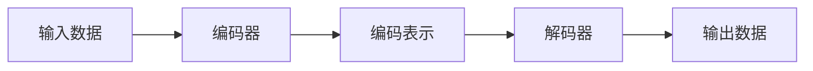

# 自动编码器 (Autoencoder) 原理与代码实例讲解

## 1. 背景介绍

### 1.1 什么是自动编码器？

自动编码器(Autoencoder)是一种无监督学习的人工神经网络,旨在学习高效的数据编码,以便在降低数据维度的同时尽可能保留数据的重要特征。它由两部分组成:编码器(Encoder)和解码器(Decoder)。编码器将输入数据压缩成低维的编码表示,而解码器则试图从该编码中重构出与原始输入数据尽可能相似的输出。

### 1.2 自动编码器的应用

自动编码器在许多领域都有广泛的应用,例如:

- **降噪**:通过将噪声数据输入自动编码器,训练它学习数据的真实特征,从而达到去噪的目的。
- **数据压缩**:利用编码器将高维数据压缩为低维表示,可用于数据压缩和特征提取。
- **异常检测**:通过计算输入数据与重构数据之间的差异,可以检测异常数据点。
- **数据生成**:变分自动编码器(Variational Autoencoder)可用于生成新的类似于训练数据的样本。

## 2. 核心概念与联系

### 2.1 自编码器的基本结构

自动编码器由编码器和解码器两部分组成,如下图所示:



编码器将高维输入数据压缩为低维编码表示,而解码器则试图从该编码中重构出与原始输入数据尽可能相似的输出。在训练过程中,自动编码器会最小化输入数据与重构数据之间的差异,从而学习到输入数据的有效编码表示。

### 2.2 自编码器的损失函数

自动编码器的损失函数通常是输入数据与重构数据之间的重构误差,例如均方误差(Mean Squared Error, MSE)或交叉熵损失(Cross Entropy Loss)。目标是最小化该损失函数,使重构数据尽可能接近原始输入数据。

$$
\mathcal{L}(x, \hat{x}) = \|x - \hat{x}\|^2
$$

其中,x为输入数据,\hat{x}为重构数据。

### 2.3 正则化自编码器

为了防止自动编码器简单地学习身份映射(即直接复制输入作为输出),通常会对编码器施加约束或正则化,例如:

- **稀疏自动编码器(Sparse Autoencoder)**:对编码器输出施加稀疏性约束,使其学习稀疏表示。
- **去噪自动编码器(Denoising Autoencoder)**:在训练时,向输入数据添加噪声,迫使自动编码器学习数据的鲁棒表示。
- **变分自动编码器(Variational Autoencoder, VAE)**:对编码器输出施加先验分布约束,使其学习数据的潜在分布。

## 3. 核心算法原理具体操作步骤

### 3.1 自动编码器的前向传播

自动编码器的前向传播过程包括编码和解码两个阶段:

1. **编码阶段**:输入数据x通过编码器网络f(x)得到编码表示z。

   $$z = f(x)$$

2. **解码阶段**:编码表示z通过解码器网络g(z)得到重构输出\hat{x}。

   $$\hat{x} = g(z)$$

### 3.2 自动编码器的反向传播

在反向传播过程中,我们需要计算损失函数相对于网络参数的梯度,并使用优化算法(如梯度下降)更新参数,以最小化重构误差。

1. 计算重构误差:

   $$\mathcal{L}(x, \hat{x}) = \|x - \hat{x}\|^2$$

2. 计算损失函数相对于解码器参数的梯度:

   $$\frac{\partial \mathcal{L}}{\partial \theta_d} = \frac{\partial \mathcal{L}}{\partial \hat{x}} \cdot \frac{\partial \hat{x}}{\partial \theta_d}$$

3. 计算损失函数相对于编码器参数的梯度:

   $$\frac{\partial \mathcal{L}}{\partial \theta_e} = \frac{\partial \mathcal{L}}{\partial \hat{x}} \cdot \frac{\partial \hat{x}}{\partial z} \cdot \frac{\partial z}{\partial \theta_e}$$

4. 使用优化算法更新编码器和解码器的参数。

### 3.3 自动编码器的训练

自动编码器的训练过程如下:

1. 初始化编码器和解码器的参数。
2. 对于每个训练批次:
   - 前向传播计算重构输出。
   - 计算重构误差。
   - 反向传播计算梯度。
   - 使用优化算法更新参数。
3. 重复步骤2,直到模型收敛或达到预设的训练轮数。

## 4. 数学模型和公式详细讲解举例说明

### 4.1 自动编码器的数学表示

假设我们有一个自动编码器,其编码器函数为$f$,解码器函数为$g$,输入数据为$x$,编码表示为$z$,重构输出为$\hat{x}$。则自动编码器的数学表示为:

$$
\begin{aligned}
z &= f(x) \\
\hat{x} &= g(z)
\end{aligned}
$$

其中,编码器$f$将输入$x$映射到编码空间,解码器$g$则将编码$z$映射回原始数据空间。

### 4.2 自动编码器的损失函数

自动编码器的目标是最小化输入数据$x$与重构输出$\hat{x}$之间的差异,通常使用均方误差(MSE)或交叉熵损失(Cross Entropy Loss)作为损失函数。

**均方误差(MSE)损失函数**:

$$
\mathcal{L}_{MSE}(x, \hat{x}) = \frac{1}{n} \sum_{i=1}^{n} (x_i - \hat{x}_i)^2
$$

**交叉熵损失函数**:

$$
\mathcal{L}_{CE}(x, \hat{x}) = -\frac{1}{n} \sum_{i=1}^{n} \left[ x_i \log(\hat{x}_i) + (1 - x_i) \log(1 - \hat{x}_i) \right]
$$

其中,$n$是输入数据的维度。

### 4.3 正则化自动编码器

为了防止自动编码器简单地学习身份映射,我们可以对编码器施加约束或正则化。以下是一些常见的正则化方法:

**1. 稀疏自动编码器(Sparse Autoencoder)**

稀疏自动编码器通过在损失函数中添加稀疏性惩罚项,迫使编码器学习稀疏表示。

$$
\mathcal{L}_{sparse} = \mathcal{L}(x, \hat{x}) + \lambda \sum_{j=1}^{m} \text{KL}(\rho \| \hat{\rho}_j)
$$

其中,$\lambda$是稀疏性权重,$m$是编码维度,$\rho$是期望的稀疏程度,$\hat{\rho}_j$是第$j$个编码单元的平均活跃度,$\text{KL}$是KL散度。

**2. 去噪自动编码器(Denoising Autoencoder)**

去噪自动编码器在训练时向输入数据添加噪声,迫使自动编码器学习数据的鲁棒表示。

$$
\tilde{x} = x + \epsilon
$$

其中,$\tilde{x}$是加噪输入,$\epsilon$是噪声。

**3. 变分自动编码器(Variational Autoencoder, VAE)**

变分自动编码器对编码器输出施加先验分布约束,使其学习数据的潜在分布。具体细节超出了本文的范围,感兴趣的读者可以进一步研究。

### 4.4 自动编码器的实例

假设我们有一个简单的自动编码器,其编码器和解码器都是全连接神经网络。输入数据$x$是一个28x28的灰度图像,我们希望将其编码为一个64维的向量$z$。

编码器:

$$
\begin{aligned}
h_1 &= \sigma(W_1 x + b_1) \\
z &= \sigma(W_2 h_1 + b_2)
\end{aligned}
$$

解码器:

$$
\begin{aligned}
h_2 &= \sigma(W_3 z + b_3) \\
\hat{x} &= \sigma(W_4 h_2 + b_4)
\end{aligned}
$$

其中,$\sigma$是激活函数(如ReLU或Sigmoid),$W_i$和$b_i$分别是权重和偏置。

在训练过程中,我们可以使用均方误差损失函数:

$$
\mathcal{L}_{MSE}(x, \hat{x}) = \frac{1}{784} \sum_{i=1}^{784} (x_i - \hat{x}_i)^2
$$

通过反向传播算法计算梯度,并使用优化算法(如Adam或SGD)更新网络参数,直到损失函数收敛。

## 5. 项目实践: 代码实例和详细解释说明

以下是一个使用PyTorch实现的简单自动编码器的示例代码:

```python
import torch
import torch.nn as nn

# 定义自动编码器模型
class Autoencoder(nn.Module):
    def __init__(self, input_dim, hidden_dim, latent_dim):
        super(Autoencoder, self).__init__()

        # 编码器
        self.encoder = nn.Sequential(
            nn.Linear(input_dim, hidden_dim),
            nn.ReLU(),
            nn.Linear(hidden_dim, latent_dim)
        )

        # 解码器
        self.decoder = nn.Sequential(
            nn.Linear(latent_dim, hidden_dim),
            nn.ReLU(),
            nn.Linear(hidden_dim, input_dim),
            nn.Sigmoid()  # 输出在0-1范围内
        )

    def forward(self, x):
        z = self.encoder(x)
        x_recon = self.decoder(z)
        return x_recon

# 定义超参数
input_dim = 784  # 28 x 28 灰度图像
hidden_dim = 512
latent_dim = 64
batch_size = 128
epochs = 20
learning_rate = 1e-3

# 加载MNIST数据集
from torchvision.datasets import MNIST
from torch.utils.data import DataLoader

train_dataset = MNIST(root='./data', train=True, transform=None, download=True)
train_loader = DataLoader(train_dataset, batch_size=batch_size, shuffle=True)

# 初始化模型和优化器
model = Autoencoder(input_dim, hidden_dim, latent_dim)
optimizer = torch.optim.Adam(model.parameters(), lr=learning_rate)
criterion = nn.MSELoss()

# 训练模型
for epoch in range(epochs):
    for data, _ in train_loader:
        data = data.view(-1, input_dim)  # 将图像展平为一维向量

        # 前向传播
        output = model(data)
        loss = criterion(output, data)

        # 反向传播和优化
        optimizer.zero_grad()
        loss.backward()
        optimizer.step()

    print(f"Epoch {epoch+1}/{epochs}, Loss: {loss.item():.4f}")
```

代码解释:

1. 定义自动编码器模型`Autoencoder`。它包含一个编码器和一个解码器,都是由全连接层组成的简单神经网络。
2. 定义超参数,包括输入维度、隐藏层维度、潜在编码维度、批次大小、训练轮数和学习率。
3. 加载MNIST数据集,并使用`DataLoader`将其分批次。
4. 初始化模型、优化器(Adam)和损失函数(均方误差损失)。
5. 训练模型:
   - 对于每个训练批次,将图像展平为一维向量。
   - 前向传播计算重构输出。
   - 计算重构误差(均方误差损失)。
   - 反向传播计算梯度。
   - 使用优化器更新模型参数。
   - 打印当前轮次的损失值。

在训练完成后,你可以使用训练好的自动编码器对新的输入数据进行编码和解码,或者将其用于其他任务,如降噪、异常检测等。

## 6. 实际应用场景

自动编码器在许多实际应用场景中都发挥着重要作用,例如:

### 6.1 图像去噪

去噪自动编码器可以用于从含有噪声的图像中恢复原始图像。它通过学习图像的潜在特征,从而能够有效地去除噪声,并重构