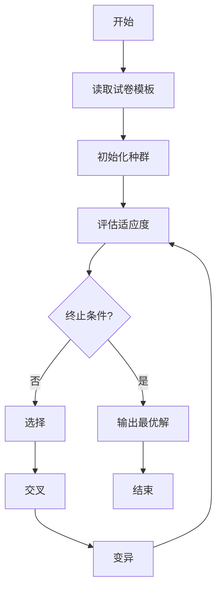

# 试卷自动生成系统详细设计与具体代码实现

## 1.背景介绍

随着教育信息化的快速发展,自动化试卷生成系统在教育领域得到了广泛应用。传统的人工命题方式不仅耗时耗力,而且难以保证试题的新颖性和多样性。自动试卷生成系统可以根据预设的知识点、难度系数等参数,自动组合生成符合要求的试卷,大大提高了试卷组卷效率,减轻了教师的工作负担。

## 2.核心概念与联系

### 2.1 题库管理

题库是试卷自动生成系统的核心数据源,包含了各种知识点、难度等级的试题。高质量的题库是生成优秀试卷的基础。题库管理模块负责题目的录入、编辑、分类等工作,确保题库的完整性和准确性。

### 2.2 知识点模型

知识点模型定义了考试大纲中的知识点框架,是组卷的基本单元。每个知识点包含了对应的描述、重要程度等属性,知识点之间可能存在先修后续的依赖关系。

### 2.3 试卷模板

试卷模板规定了试卷的整体结构,包括考试时间、试卷分值、题型比例等要求。模板中定义了每个知识点在试卷中的分值占比,以及不同题型的数量分配。

### 2.4 组卷策略

组卷策略是试卷生成的核心算法,根据试卷模板的要求,从题库中智能选取合适的题目,并进行自动组合,最终生成满足要求的试卷。

### 2.5 试卷评审

生成的试卷需要经过人工评审,检查试题的质量、难度分布、知识点覆盖等,确保试卷的合理性和有效性。评审通过后,试卷方可投入使用。

## 3.核心算法原理具体操作步骤

试卷自动生成系统的核心算法是组卷策略,其基本原理是启发式搜索算法,具体操作步骤如下:



1. **读取试卷模板**:解析试卷模板文件,获取考试时间、总分值、知识点权重等参数。

2. **初始化种群**:根据模板要求,从题库中随机选取一定数量的试题组合,构建初始种群。

3. **评估适应度**:计算每个个体(试卷)的适应度函数值,衡量其满足模板要求的程度。适应度函数通常包括知识点覆盖率、难度分布、分值占比等指标。

4. **终止条件判断**:检查是否满足终止条件,如达到最大迭代次数、适应度满足阈值等。若满足,输出当前最优解(试卷)并结束;否则进入进化操作。

5. **选择**:根据适应度大小,采用赌轮盘法等策略,从当前种群中选择若干个体,作为交叉和变异的父代。

6. **交叉**:对选中的父代个体进行交叉操作,产生新的子代个体。交叉方式可采用单点交叉、多点交叉等。

7. **变异**:以一定的变异概率,对交叉后的子代个体进行小概率的变异操作,引入新的基因,维持种群多样性。

8. **回到步骤3**,重复迭代进化,直至满足终止条件。

该算法的关键在于设计合理的适应度函数、选择策略、交叉变异操作等,以保证算法的收敛性和全局最优性。

## 4.数学模型和公式详细讲解举例说明

### 4.1 适应度函数

适应度函数是评价试卷质量的核心指标,通常是多目标优化问题,需要综合考虑知识点覆盖、难度分布、分值占比等多个因素。一种常见的适应度函数定义如下:

$$
f(x)=\omega_1f_1(x)+\omega_2f_2(x)+\omega_3f_3(x)+\omega_4f_4(x)
$$

其中:

- $f_1(x)$表示知识点覆盖率,即试卷中涉及的知识点占总知识点的比例。覆盖率越高,适应度分数越高。
- $f_2(x)$表示难度分布评分,衡量试题难度的均匀分布程度。可使用标准差等统计量进行评估。
- $f_3(x)$表示分值占比评分,考虑每个知识点在试卷中的实际分值占比与模板要求的偏差。
- $f_4(x)$表示题型分布评分,考虑不同题型数量与模板要求的差异。
- $\omega_i$为各项指标的权重系数,根据具体需求进行设置。

### 4.2 交叉操作

交叉操作是进化算法中最关键的步骤,用于产生新的个体,扩大搜索空间。对于试卷生成问题,一种常见的交叉方式是部分映射交叉(Partial Mapped Crossover,PMX)。

假设父代个体P1和P2的基因型(题目序列)分别为:

```
P1 = (3, 1, 5, 2, 7, 6, 4, 8)
P2 = (8, 3, 7, 6, 5, 2, 1, 4)
```

1) 随机选取两个交叉点,如2和6。
2) 将P1中[2,6]内的基因片段直接复制到子代C1中,其余位置用"-"占位。
3) 在P2中找到与C1[2,6]片段基因相同的基因,将其在C1中的位置也替换为"-"。
4) 从P2的起始位置开始,将未出现在C1中的基因按顺序填入C1的"-"位置。

```
   +---交叉片段---+
P1 = (3, 1, 5, 2, 7, 6, 4, 8)
P2 = (8, 3, 7, 6, 5, 2, 1, 4)
            \/
C1 = (-, -, 5, 2, 7, 6, -, -)

C1中已有基因在P2中位置:  2 6 - -
未出现基因:               8 3 7 1 4
            \/
C1 = (8, 3, 5, 2, 7, 6, 1, 4)
```

经过交叉操作,产生了新的个体C1,继承了父代的部分基因片段,同时也引入了新的基因组合。

## 5.项目实践:代码实例和详细解释说明

以下是试卷自动生成系统的核心代码实现,采用Python语言,使用DEAP(Distributed Evolutionary Algorithms in Python)进化算法框架。

### 5.1 数据模型

```python
from dataclasses import dataclass

@dataclass
class Question:
    """试题类"""
    id: int
    content: str
    answer: str
    score: float
    diff_level: int
    knowledge_ids: List[int]

@dataclass
class KnowledgePoint:
    """知识点类"""
    id: int
    name: str
    parent_id: int = None
    weight: float = 1.0

@dataclass
class PaperTemplate:
    """试卷模板类"""
    name: str
    total_score: float
    time_limit: int  # 分钟
    knowledge_weights: Dict[int, float]
    q_type_nums: Dict[str, int]
```

上述代码定义了试题、知识点和试卷模板三个核心数据类。

- `Question`类描述了单个试题的属性,包括ID、内容、答案、分数、难度等级和所涉及的知识点ID列表。
- `KnowledgePoint`类描述了知识点的层级结构、名称和权重。
- `PaperTemplate`类定义了试卷的整体要求,包括总分值、考试时间限制、每个知识点的权重分布,以及各题型的数量要求。

### 5.2 进化算法实现

```python
import random
from deap import creator, base, tools, algorithms

# 定义个体(试卷)类型
creator.create("FitnessMax", base.Fitness, weights=(1.0,))
creator.create("Individual", list, fitness=creator.FitnessMax)

# 初始化工具
toolbox = base.Toolbox()
# 定义gene(题目)编码
toolbox.register("gene", random.sample, range(len(question_pool)), 1)
# 定义individual(试卷)编码
toolbox.register("individual", tools.initRepeat, creator.Individual, toolbox.gene, n=paper_size)
# 定义population(种群)编码
toolbox.register("population", tools.initRepeat, list, toolbox.individual)

# 定义评估函数
def evaluate(individual):
    return sum(q.score for q in [question_pool[i] for i in individual]),

toolbox.register("evaluate", evaluate)

# 定义遗传操作
toolbox.register("select", tools.selTournament, tournsize=3)
toolbox.register("mate", tools.cxPartialyMapped)
toolbox.register("mutate", tools.mutShuffleIndexes, indpb=0.2)

# 创建初始种群
population = toolbox.population(n=300)

# 开始进化
final_pop = algorithms.eaSimple(population, toolbox, cxpb=0.5, mutpb=0.2, ngen=50, verbose=False)

# 输出最优解
best_ind = tools.selBest(final_pop, 1)[0]
best_paper = [question_pool[i] for i in best_ind]
print(f"Best Paper Score: {best_ind.fitness.values[0]}")
for q in best_paper:
    print(q.content)
```

上述代码使用DEAP框架实现了进化算法的主要流程:

1. 定义个体(试卷)的类型,采用基因型编码为题目ID序列。
2. 注册初始化、评估、选择、交叉、变异等遗传操作。
3. 创建初始种群,种群大小设为300。
4. 执行进化算法`eaSimple`,迭代50代,交叉概率0.5,变异概率0.2。
5. 输出最优个体(试卷)及其适应度分数和试题内容。

在实际应用中,还需要设计合理的适应度函数、调整算法参数,以获得满意的试卷质量。

## 6.实际应用场景

试卷自动生成系统在教育领域有着广泛的应用前景:

1. **学校考试**: 可用于自动组织期中、期末、入学等各类考试试卷,减轻教师的工作量。

2. **在线教育平台**: 为学生提供个性化的自主学习和自测试卷,实现因材施教。

3. **职业培训和认证考试**: 根据企业和行业的要求,自动生成培训课程的练习题和考核试卷。

4. **智能教学系统**: 与智能教学系统集成,根据学生的知识掌握情况,动态生成适合的练习和测试题目。

5. **科研项目**: 在自然语言处理、知识图谱等领域,可用于自动生成特定领域的问答数据集。

## 7.工具和资源推荐

实现试卷自动生成系统需要借助多种工具和资源:

1. **Python生态工具**:
   - DEAP: 进化算法框架
   - NumPy: 科学计算库
   - Pandas: 数据处理库

2. **自然语言处理工具**:
   - NLTK: 自然语言处理工具包
   - Stanza: 斯坦福自然语言处理工具包
   - Word2Vec/BERT: 词向量表示模型

3. **知识图谱构建**:
   - Neo4j: 图数据库
   - OpenKG: 开源知识图谱工具

4. **题库资源**:
   - 教育部考试中心题库
   - 各大在线教育平台公开题库
   - 行业协会认证考试题库

5. **在线社区和文档**:
   - Stack Overflow
   - GitHub
   -官方文档和教程

利用这些工具和资源,可以高效地构建知识图谱、处理自然语言、实现进化算法等核心功能。

## 8.总结:未来发展趋势与挑战

试卷自动生成系统是教育信息化的重要一环,具有广阔的发展前景。未来,该领域可能会有以下发展趋势和挑战:

1. **知识图谱与自然语言处理技术的深度融合**:利用知识图谱表示结构化知识,结合自然语言处理技术,可以自动生成更加符合语义逻辑的试题。

2. **多模态试题生成**:除文本