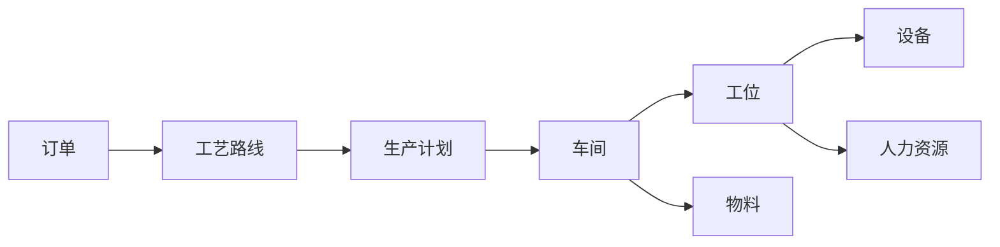

# 车间管理系统详细设计与具体代码实现

## 1. 背景介绍

在现代制造业中,车间管理是企业生产运营的核心环节之一。传统的人工管理模式已经无法满足日益增长的生产需求和精细化管理要求。因此,开发一套高效、智能的车间管理系统势在必行。本文将详细阐述车间管理系统的设计思路和具体实现方法,为制造企业的信息化建设提供参考。

### 1.1 车间管理的痛点与挑战
#### 1.1.1 生产进度难以实时掌控
#### 1.1.2 设备利用率低,故障频发
#### 1.1.3 库存管理混乱,成本居高不下
#### 1.1.4 人力资源分配不合理,效率低下

### 1.2 车间管理系统的价值与意义
#### 1.2.1 提高生产效率,缩短交货周期
#### 1.2.2 降低运营成本,提升企业竞争力
#### 1.2.3 优化资源配置,减少浪费
#### 1.2.4 助力智能制造,推动产业升级

## 2. 核心概念与联系

要设计一个优秀的车间管理系统,首先需要理清其中的核心概念及其相互关系。

### 2.1 订单(Order)
订单是车间生产活动的起点,包含了客户需求、交货期、产品规格等关键信息。

### 2.2 工艺路线(Process Route)
工艺路线定义了产品生产的流程和所需工序,是指导车间生产的重要依据。

### 2.3 生产计划(Production Plan)
生产计划根据订单和工艺路线,合理安排生产任务,确保按时交付。

### 2.4 车间(Workshop)
车间是生产活动的主要场所,由多个工位构成,配备了各类生产设备。

### 2.5 工位(Workstation)
工位是车间的基本组成单元,由操作工和设备组成,承担特定工序的加工任务。

### 2.6 设备(Equipment)
设备是车间的主要生产资源,包括机床、装配线、检测仪器等,其性能直接影响生产效率。

### 2.7 物料(Material)
物料是构成产品的原材料、零部件等,其供应和库存管理至关重要。

### 2.8 人力资源(Human Resource)
人力资源是车间生产的智力支撑,合理调度人员对提升生产效率有重要意义。

以下是这些概念之间的联系:



订单确定了生产什么,工艺路线确定了怎么生产,生产计划确定了何时生产。车间调度工位、设备、人员和物料开展生产活动,最终完成订单交付。

## 3. 核心算法原理和具体操作步骤

车间管理系统的核心是对生产任务进行合理调度,以实现准时交付和成本最小化。这里我们重点介绍两种常用的生产调度算法:基于规则的调度和基于仿真的调度。

### 3.1 基于规则的调度算法
#### 3.1.1 算法原理
基于规则的调度根据预设的优先级规则,依次选择任务和资源进行调度。常见的优先级规则包括:
- FCFS(First Come First Serve):先来先服务,按照任务到达时间排序。
- SPT(Shortest Processing Time):最短加工时间优先,优先调度加工时间最短的任务。
- EDD(Earliest Due Date):最早交货期优先,优先调度交货期最早的任务。
- LPT(Longest Processing Time):最长加工时间优先,优先调度加工时间最长的任务。

#### 3.1.2 算法步骤
1. 根据选定的优先级规则,对所有待调度任务排序。
2. 遍历排序后的任务列表,对每个任务:
   a. 寻找能够执行该任务且空闲的资源(工人或设备)。
   b. 如果找到空闲资源,则将任务分配给该资源,并更新资源的空闲时间。
   c. 如果没有空闲资源,则等待至有资源空闲。
3. 重复步骤2,直到所有任务都被调度。
4. 输出调度结果,包括每个任务的开始时间、结束时间和执行资源。

### 3.2 基于仿真的调度算法
#### 3.2.1 算法原理
基于仿真的调度通过建立车间的仿真模型,模拟不同调度方案下的生产过程,评估各方案的效果,从而选出最优方案。该算法一般采用离散事件仿真(DES)的建模方法。

#### 3.2.2 算法步骤
1. 定义仿真模型的元素,包括:
   - 实体:工件、物料、人员等。
   - 资源:机床、工位、缓冲区等。
   - 事件:工件到达、加工开始/结束、故障发生等。
   - 性能指标:完工时间、设备利用率、WIP库存等。
2. 构建车间仿真模型,定义实体流动和资源调度的逻辑。
3. 设计多个调度方案,如不同的优先级规则、产能配置等。
4. 对每个调度方案,运行仿真模型,统计性能指标。
5. 比较各方案的性能指标,选择最优方案作为实际调度策略。
6. 将最优调度策略应用到车间管理系统中。

## 4. 数学模型和公式详细讲解举例说明

为了更精确地描述车间调度问题,我们可以建立数学模型。以下是一个常见的车间调度模型——Job Shop Scheduling(JSP)的定义。

### 4.1 符号定义
- $n$:任务(工件)数量
- $m$:机器数量
- $O_{ij}$:工件$i$的第$j$道工序
- $M_{ij}$:工序$O_{ij}$加工所需的机器
- $p_{ij}$:工序$O_{ij}$的加工时间
- $s_{ij}$:工序$O_{ij}$的开始时间
- $c_{ij}$:工序$O_{ij}$的完成时间
- $C_i$:工件$i$的完工时间
- $C_{max}$:所有工件的最大完工时间(Makespan)

### 4.2 约束条件
- 工序先后约束:每个工件的工序必须按照预定顺序加工。
$$
c_{ij} \leq s_{i(j+1)}, \forall i,j
$$
- 机器占用约束:每台机器在同一时刻只能加工一个工件。
$$
s_{ij} \geq c_{hk} \text{ or } s_{hk} \geq c_{ij}, \forall O_{ij}, O_{hk}: M_{ij}=M_{hk}
$$
- 加工时间约束:每道工序的完成时间等于开始时间加上加工时间。
$$
c_{ij} = s_{ij} + p_{ij}, \forall i,j
$$
- 完工时间约束:每个工件的完工时间等于其最后一道工序的完成时间。
$$
C_i = c_{i,n_i}, \forall i
$$

### 4.3 目标函数
JSP问题常见的优化目标是最小化所有工件的最大完工时间(Makespan):

$$
\min C_{max} = \min \max_{1 \leq i \leq n} C_i
$$

### 4.4 示例说明
考虑一个包含3个工件、3台机器的JSP问题,其加工时间矩阵如下:

$$
p_{ij}=
\begin{bmatrix}
3 & 2 & 4 \\
2 & 3 & 3 \\
4 & 2 & 1
\end{bmatrix}
$$

每个工件的加工机器顺序为:
- 工件1: M1 -> M2 -> M3
- 工件2: M2 -> M1 -> M3
- 工件3: M1 -> M3 -> M2

求解该JSP问题,即找到一个满足约束条件且最小化最大完工时间的调度方案。下图展示了一个最优调度结果,其最大完工时间为11。

```mermaid
gantt
    title 最优调度甘特图
    dateFormat  s
    axisFormat %S
    section M1
    J1-O1  :0, 3s
    J2-O2  :3, 2s
    J3-O1  :5, 4s
    section M2
    J2-O1  :0, 2s
    J1-O2  :3, 2s
    J3-O3  :9, 2s
    section M3
    J3-O2  :5, 2s
    J2-O3  :7, 3s
    J1-O3  :10, 1s
```



通过建立JSP数学模型,我们可以清晰地描述车间调度问题,并使用优化算法求解最优调度方案。这为车间管理系统的开发提供了理论基础。

## 5. 项目实践:代码实例和详细解释说明

下面我们使用Python实现一个简单的车间调度系统,基于FCFS(先来先服务)规则对任务进行调度。

### 5.1 定义数据结构

首先定义任务(Task)和资源(Resource)的数据结构。

```python
class Task:
    def __init__(self, id, arrival_time, processing_time):
        self.id = id
        self.arrival_time = arrival_time
        self.processing_time = processing_time
        self.start_time = None
        self.end_time = None

class Resource:
    def __init__(self, id):
        self.id = id
        self.idle_time = 0
```

其中,Task包含任务ID、到达时间、加工时间、开始时间和结束时间;Resource包含资源ID和空闲时间。

### 5.2 实现FCFS调度算法

然后实现FCFS调度算法,根据任务到达时间对任务列表排序,并依次分配任务给空闲资源。

```python
def fcfs_schedule(tasks, resources):
    tasks.sort(key=lambda x: x.arrival_time)
    for task in tasks:
        earliest_resource = min(resources, key=lambda x: x.idle_time)
        task.start_time = max(task.arrival_time, earliest_resource.idle_time)
        task.end_time = task.start_time + task.processing_time
        earliest_resource.idle_time = task.end_time
    return tasks
```

### 5.3 输出调度结果

最后,我们输出调度结果,包括每个任务的开始时间、结束时间和执行资源。

```python
def print_schedule(tasks, resources):
    for resource in resources:
        print(f"Resource {resource.id}:")
        for task in tasks:
            if task.start_time >= resource.idle_time:
                print(f"  Task {task.id}: [{task.start_time}, {task.end_time}]")

    print("Task\tArrival\tStart\tEnd")
    for task in tasks:
        print(f"{task.id}\t{task.arrival_time}\t{task.start_time}\t{task.end_time}")
```

### 5.4 测试调度系统

现在,我们创建一些任务和资源,测试我们的调度系统。

```python
if __name__ == "__main__":
    tasks = [
        Task(1, 0, 3),
        Task(2, 1, 2),
        Task(3, 2, 4),
        Task(4, 3, 2),
        Task(5, 4, 1)
    ]
    resources = [Resource(1), Resource(2)]

    scheduled_tasks = fcfs_schedule(tasks, resources)
    print_schedule(scheduled_tasks, resources)
```

运行结果如下:

```
Resource 1:
  Task 1: [0, 3]
  Task 3: [3, 7]
  Task 5: [7, 8]
Resource 2:
  Task 2: [1, 3]
  Task 4: [3, 5]
Task    Arrival Start   End
1       0       0       3
2       1       1       3
3       2       3       7
4       3       3       5
5       4       7       8
```

可以看到,任务按照到达时间的顺序被分配到两个资源上执行,实现了先来先服务的调度策略。这个简单的例子演示了如何使用Python构建一个基本的车间调度系统。在实际项目中,我们可以进一步扩展该系统,如支持更多的调度规则、优化资源利用率、提供可视化的任务甘特图等。

## 6. 实际应用场景

车间管理系统在制造业中有广泛的应用,下面列举几个典型场景。

### 6.1 机械加工车间
在机械加工车间,需要对零件进行铣削、车削、钻孔、磨削等多道工序的加工。