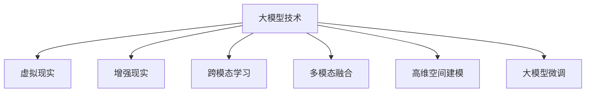

                 

# 大模型技术的元宇宙应用

> 关键词：元宇宙,大模型技术,虚拟现实,增强现实,跨模态学习,多模态融合,大模型微调,高维空间建模

## 1. 背景介绍

### 1.1 问题由来
随着虚拟现实(VR)、增强现实(AR)技术的日渐成熟，元宇宙(Metaverse)的概念被广泛提及。元宇宙是指通过互联网构建的、数字化、三维化的虚拟世界，包含了游戏、社交、工作、教育等多个领域。大模型技术，特别是基于深度学习的大模型，在元宇宙应用中有着广泛的潜力。

### 1.2 问题核心关键点
大模型技术在元宇宙中的应用，主要围绕两个核心方向展开：一是通过高维空间建模，实现虚拟世界的精确仿真；二是通过跨模态学习，增强用户交互体验。这两个方向都要求模型具备强大的表示能力和泛化能力。

在具体实现上，大模型技术可以用于生成虚拟角色、创建虚拟环境、智能交互等多个方面。其核心在于，利用大模型强大的表示能力，生成逼真的虚拟场景和角色，并通过跨模态融合技术，实现语音、视觉、触觉等多种感官信息的协同交互。

### 1.3 问题研究意义
研究大模型技术在元宇宙中的应用，具有重要意义：

1. **提升虚拟体验**：利用大模型生成逼真的虚拟场景和角色，使得元宇宙用户能够沉浸在真实的虚拟环境中，获得更丰富的视觉和听觉体验。
2. **增强交互互动**：通过跨模态学习，实现语音、视觉、触觉等多种感官信息的协同交互，提高用户对元宇宙的感知和互动效果。
3. **扩展应用范围**：大模型技术可以拓展元宇宙的应用场景，从游戏、社交扩展到医疗、教育、工作等多个领域。
4. **推动产业发展**：大模型技术能够加速元宇宙的开发和应用，推动相关产业链的发展，带来巨大的经济效益。

## 2. 核心概念与联系

### 2.1 核心概念概述

为更好地理解大模型技术在元宇宙中的应用，本节将介绍几个密切相关的核心概念：

- **大模型技术(Large Model Technology)**：基于深度学习的大规模预训练模型，通过在大规模数据上进行预训练，学习到丰富的知识表示。常见的大模型包括GPT、BERT、DALL·E等。
- **虚拟现实(Virtual Reality, VR)**：通过计算机生成，模拟逼真的三维虚拟环境，让用户产生身临其境的体验。
- **增强现实(Augmented Reality, AR)**：将虚拟信息叠加到现实世界中，增强用户对现实世界的感知。
- **跨模态学习(Cross-Modal Learning)**：通过融合语音、视觉、触觉等多种感官信息，提升模型的表示能力和泛化能力。
- **多模态融合(Multi-Modal Fusion)**：将不同模态的信息进行综合，得到更加全面、准确的结果。
- **高维空间建模(High-Dimensional Space Modeling)**：通过深度学习模型，处理高维空间的几何结构和拓扑关系，实现虚拟世界的精确仿真。
- **大模型微调(Fine-Tuning)**：在预训练模型的基础上，通过有监督的微调过程，适应特定任务，提升模型性能。

这些核心概念之间的逻辑关系可以通过以下Mermaid流程图来展示：



这个流程图展示了大模型技术的核心概念及其之间的关系：

1. 大模型技术通过预训练获得基础的表示能力。
2. 虚拟现实和增强现实利用大模型技术生成虚拟场景和角色，增强用户体验。
3. 跨模态学习和大模型微调使得模型能够处理多种感官信息，提升泛化能力。
4. 多模态融合和高维空间建模实现虚拟世界的精确仿真。

这些概念共同构成了大模型技术在元宇宙应用的框架，使其能够为元宇宙用户提供沉浸式、交互式、高精度的虚拟体验。

## 3. 核心算法原理 & 具体操作步骤

### 3.1 算法原理概述

基于大模型技术在元宇宙中的应用，涉及高维空间建模和跨模态学习两个核心算法。

- **高维空间建模**：主要涉及几何深度学习，如PointNet、GCN等模型，通过学习高维空间的拓扑关系和几何结构，实现虚拟世界的精确仿真。
- **跨模态学习**：涉及多模态特征融合和感知学习，如Attention、Transformer等模型，通过融合语音、视觉、触觉等多种感官信息，提升模型的表示能力和泛化能力。

### 3.2 算法步骤详解

#### 3.2.1 高维空间建模算法

1. **输入数据预处理**：将现实世界的数据转化为模型可处理的格式。例如，将三维点云数据转化为向量表示。
2. **构建几何深度学习模型**：选择适当的几何深度学习模型，如PointNet、GCN等，构建高维空间表示。
3. **训练模型**：在标注数据上训练几何深度学习模型，学习高维空间的拓扑关系和几何结构。
4. **模型评估**：在验证集上评估模型的性能，调整超参数，确保模型泛化能力强。
5. **虚拟世界生成**：将训练好的模型应用于虚拟世界生成任务，通过输入现实世界的数据，生成逼真的虚拟场景。

#### 3.2.2 跨模态学习算法

1. **多模态特征提取**：利用不同的感知模型，如卷积神经网络(CNN)、循环神经网络(RNN)、Transformer等，提取语音、视觉、触觉等多种感官信息。
2. **多模态特征融合**：使用Attention、Transformer等模型，将不同模态的特征进行融合，得到更加全面、准确的表示。
3. **训练模型**：在标注数据上训练跨模态学习模型，学习不同感官信息的关联和交互。
4. **模型评估**：在验证集上评估模型的性能，调整超参数，确保模型泛化能力强。
5. **交互式体验增强**：将训练好的跨模态学习模型应用于元宇宙用户交互，实现语音、视觉、触觉等多种感官信息的协同交互。

### 3.3 算法优缺点

基于大模型技术在元宇宙中的应用，具有以下优点：

1. **高精度仿真**：大模型技术可以处理高维空间的信息，实现虚拟世界的精确仿真。
2. **全面感官交互**：跨模态学习使得模型能够处理多种感官信息，提升用户体验。
3. **通用性强**：大模型技术可以应用于多个元宇宙领域，如游戏、社交、教育等。
4. **易于扩展**：随着计算资源的增加，大模型技术可以不断扩展，提升虚拟世界的细节和复杂度。

同时，该方法也存在一定的局限性：

1. **计算成本高**：大模型技术需要大量的计算资源，包括GPU、TPU等高性能设备，成本较高。
2. **数据依赖性**：模型的表现高度依赖于数据的质量和数量，获取高质量标注数据的成本较高。
3. **泛化能力受限**：在虚拟世界构建过程中，模型需要处理大量的高维数据，泛化能力可能受限。
4. **可解释性不足**：大模型技术缺乏可解释性，难以解释模型的决策过程和交互逻辑。

尽管存在这些局限性，但就目前而言，大模型技术在元宇宙中的应用仍然具有重要价值。未来相关研究的重点在于如何进一步降低计算成本，提高泛化能力，同时兼顾可解释性和伦理安全性等因素。

### 3.4 算法应用领域

基于大模型技术在元宇宙中的应用，可以应用于多个领域：

1. **虚拟角色生成**：利用大模型技术生成逼真的虚拟角色，提升用户体验。
2. **虚拟环境构建**：构建逼真的虚拟环境，如虚拟城市、虚拟办公室等，增强用户的沉浸感。
3. **智能交互系统**：实现语音、视觉、触觉等多种感官信息的协同交互，提升用户互动体验。
4. **游戏与娱乐**：利用大模型技术实现高精度的游戏场景和角色，增强游戏的真实感和趣味性。
5. **社交与交流**：通过跨模态学习，实现语音、视觉、触觉等多种感官信息的交互，增强用户社交体验。
6. **教育与培训**：利用大模型技术构建虚拟教室、虚拟实验室等，提升教育培训效果。
7. **医疗与健康**：通过虚拟现实和增强现实技术，提供虚拟医疗服务、健康管理等，提升医疗服务的可及性和便捷性。

这些应用领域表明，大模型技术在元宇宙中有着广阔的应用前景，将极大地提升虚拟世界的真实感和互动性。

## 4. 数学模型和公式 & 详细讲解 & 举例说明

### 4.1 数学模型构建

以高维空间建模为例，数学模型构建可以分为以下几步：

1. **数据表示**：将三维点云数据转化为向量表示，方便模型处理。
2. **几何深度学习模型**：选择适当的几何深度学习模型，如PointNet、GCN等，构建高维空间表示。
3. **模型训练**：在标注数据上训练几何深度学习模型，学习高维空间的拓扑关系和几何结构。
4. **模型评估**：在验证集上评估模型的性能，调整超参数，确保模型泛化能力强。
5. **虚拟世界生成**：将训练好的模型应用于虚拟世界生成任务，通过输入现实世界的数据，生成逼真的虚拟场景。

#### 4.1.1 数据表示

对于三维点云数据，可以通过坐标变换将其转化为向量表示：

$$
\mathbf{x} = [x_1, x_2, x_3, ..., x_n]
$$

其中 $x_i$ 表示第 $i$ 个点的坐标。

#### 4.1.2 几何深度学习模型

以PointNet为例，其核心思想是将三维点云数据转化为向量表示：

$$
\mathbf{h} = \phi(\mathbf{x})
$$

其中 $\phi$ 表示PointNet的编码函数，$\mathbf{h}$ 表示编码后的向量表示。

#### 4.1.3 模型训练

在标注数据上训练PointNet模型，学习高维空间的拓扑关系和几何结构：

$$
\mathbf{h} = \phi(\mathbf{x}) = \sigma(\mathbf{W}_0 \cdot \sigma(\mathbf{W}_1 \cdot \mathbf{x} + \mathbf{b}_1) + \mathbf{b}_0)
$$

其中 $\mathbf{W}_0, \mathbf{W}_1, \mathbf{b}_0, \mathbf{b}_1$ 为模型参数，$\sigma$ 为激活函数。

#### 4.1.4 模型评估

在验证集上评估模型的性能，使用均方误差(MSE)作为评价指标：

$$
MSE = \frac{1}{N} \sum_{i=1}^N (\mathbf{h}_{true} - \mathbf{h}_{pred})^2
$$

其中 $\mathbf{h}_{true}$ 为真实向量表示，$\mathbf{h}_{pred}$ 为预测向量表示。

#### 4.1.5 虚拟世界生成

将训练好的PointNet模型应用于虚拟世界生成任务，通过输入现实世界的数据，生成逼真的虚拟场景：

$$
\mathbf{V} = F(\mathbf{H})
$$

其中 $\mathbf{V}$ 表示虚拟场景，$\mathbf{H}$ 表示高维空间表示。

### 4.2 公式推导过程

以跨模态学习为例，其核心思想是将不同模态的信息进行融合，得到更加全面、准确的表示。

#### 4.2.1 多模态特征提取

利用不同的感知模型，如CNN、RNN、Transformer等，提取语音、视觉、触觉等多种感官信息：

$$
\mathbf{F}_{audio} = \mathbf{C}_{audio}(\mathbf{x}_{audio})
$$

$$
\mathbf{F}_{vision} = \mathbf{C}_{vision}(\mathbf{x}_{vision})
$$

$$
\mathbf{F}_{touch} = \mathbf{C}_{touch}(\mathbf{x}_{touch})
$$

其中 $\mathbf{x}_{audio}, \mathbf{x}_{vision}, \mathbf{x}_{touch}$ 分别表示语音、视觉、触觉数据，$\mathbf{C}_{audio}, \mathbf{C}_{vision}, \mathbf{C}_{touch}$ 分别表示语音、视觉、触觉的编码函数。

#### 4.2.2 多模态特征融合

使用Attention、Transformer等模型，将不同模态的特征进行融合，得到更加全面、准确的表示：

$$
\mathbf{H} = \mathbf{T}(\mathbf{F}_{audio}, \mathbf{F}_{vision}, \mathbf{F}_{touch})
$$

其中 $\mathbf{T}$ 表示跨模态融合函数，$\mathbf{H}$ 表示融合后的高维空间表示。

#### 4.2.3 模型训练

在标注数据上训练跨模态学习模型，学习不同感官信息的关联和交互：

$$
\mathbf{H} = \mathbf{T}(\mathbf{F}_{audio}, \mathbf{F}_{vision}, \mathbf{F}_{touch}) = \sigma(\mathbf{W}_0 \cdot \sigma(\mathbf{W}_1 \cdot (\mathbf{F}_{audio}, \mathbf{F}_{vision}, \mathbf{F}_{touch}) + \mathbf{b}_0)
$$

其中 $\mathbf{W}_0, \mathbf{W}_1, \mathbf{b}_0$ 为模型参数，$\sigma$ 为激活函数。

#### 4.2.4 模型评估

在验证集上评估模型的性能，使用交叉熵损失作为评价指标：

$$
CE = -\frac{1}{N} \sum_{i=1}^N y_i \log \hat{y}_i + (1 - y_i) \log (1 - \hat{y}_i)
$$

其中 $y_i$ 为真实标签，$\hat{y}_i$ 为预测标签。

#### 4.2.5 交互式体验增强

将训练好的跨模态学习模型应用于元宇宙用户交互，实现语音、视觉、触觉等多种感官信息的协同交互：

$$
\mathbf{O} = \mathbf{M}(\mathbf{H})
$$

其中 $\mathbf{O}$ 表示用户交互输出，$\mathbf{M}$ 表示交互模型。

### 4.3 案例分析与讲解

#### 4.3.1 虚拟角色生成

以虚拟角色生成为例，利用大模型技术生成逼真的虚拟角色，提升用户体验。

1. **数据收集**：收集虚拟角色的三维模型数据、纹理数据、动作数据等。
2. **预处理**：将三维模型数据、纹理数据、动作数据等转化为向量表示，方便模型处理。
3. **几何深度学习模型**：选择适当的几何深度学习模型，如PointNet、GCN等，构建虚拟角色的高维空间表示。
4. **模型训练**：在标注数据上训练几何深度学习模型，学习虚拟角色的拓扑关系和几何结构。
5. **模型评估**：在验证集上评估模型的性能，调整超参数，确保模型泛化能力强。
6. **虚拟角色生成**：将训练好的模型应用于虚拟角色生成任务，通过输入三维模型数据、纹理数据、动作数据等，生成逼真的虚拟角色。

#### 4.3.2 虚拟环境构建

以虚拟环境构建为例，利用大模型技术构建逼真的虚拟环境，增强用户的沉浸感。

1. **数据收集**：收集虚拟环境的二维图像、三维模型数据、纹理数据等。
2. **预处理**：将二维图像、三维模型数据、纹理数据等转化为向量表示，方便模型处理。
3. **几何深度学习模型**：选择适当的几何深度学习模型，如PointNet、GCN等，构建虚拟环境的拓扑关系和几何结构。
4. **模型训练**：在标注数据上训练几何深度学习模型，学习虚拟环境的拓扑关系和几何结构。
5. **模型评估**：在验证集上评估模型的性能，调整超参数，确保模型泛化能力强。
6. **虚拟环境生成**：将训练好的模型应用于虚拟环境生成任务，通过输入二维图像、三维模型数据、纹理数据等，生成逼真的虚拟环境。

#### 4.3.3 智能交互系统

以智能交互系统为例，利用跨模态学习技术实现语音、视觉、触觉等多种感官信息的协同交互，提升用户互动体验。

1. **数据收集**：收集用户的语音数据、图像数据、触觉数据等。
2. **多模态特征提取**：利用不同的感知模型，如CNN、RNN、Transformer等，提取用户的语音、视觉、触觉等多种感官信息。
3. **多模态特征融合**：使用Attention、Transformer等模型，将不同模态的特征进行融合，得到更加全面、准确的表示。
4. **模型训练**：在标注数据上训练跨模态学习模型，学习不同感官信息的关联和交互。
5. **模型评估**：在验证集上评估模型的性能，调整超参数，确保模型泛化能力强。
6. **交互式体验增强**：将训练好的跨模态学习模型应用于用户交互，实现语音、视觉、触觉等多种感官信息的协同交互。

## 5. 项目实践：代码实例和详细解释说明

### 5.1 开发环境搭建

在进行大模型技术在元宇宙应用的开发前，我们需要准备好开发环境。以下是使用Python进行PyTorch开发的环境配置流程：

1. 安装Anaconda：从官网下载并安装Anaconda，用于创建独立的Python环境。

2. 创建并激活虚拟环境：
```bash
conda create -n pytorch-env python=3.8 
conda activate pytorch-env
```

3. 安装PyTorch：根据CUDA版本，从官网获取对应的安装命令。例如：
```bash
conda install pytorch torchvision torchaudio cudatoolkit=11.1 -c pytorch -c conda-forge
```

4. 安装Transformers库：
```bash
pip install transformers
```

5. 安装各类工具包：
```bash
pip install numpy pandas scikit-learn matplotlib tqdm jupyter notebook ipython
```

完成上述步骤后，即可在`pytorch-env`环境中开始开发。

### 5.2 源代码详细实现

这里我们以高维空间建模为例，给出使用PyTorch实现的点云生成代码：

首先，定义数据预处理函数：

```python
import torch
from pointnet import PointNet
from pointcloud import PointCloud

def preprocess_data(points):
    points = PointCloud(points)  # 将点云数据转化为PCD格式
    points = points.to_tensor()  # 将PCD数据转化为Tensor格式
    return points
```

然后，定义几何深度学习模型：

```python
class PointNet(torch.nn.Module):
    def __init__(self, n_points=1024):
        super(PointNet, self).__init__()
        self.encoder = torch.nn.Sequential(
            torch.nn.Linear(n_points, 64),
            torch.nn.ReLU(),
            torch.nn.Linear(64, 128),
            torch.nn.ReLU(),
            torch.nn.Linear(128, 1024),
            torch.nn.ReLU(),
        )
        self.decoder = torch.nn.Sequential(
            torch.nn.Linear(1024, 128),
            torch.nn.ReLU(),
            torch.nn.Linear(128, 64),
            torch.nn.ReLU(),
            torch.nn.Linear(64, 3),
            torch.nn.Sigmoid(),
        )

    def forward(self, x):
        encoded = self.encoder(x)
        decoded = self.decoder(encoded)
        return decoded
```

接着，定义模型训练和评估函数：

```python
from torch.utils.data import DataLoader
from tqdm import tqdm

def train_epoch(model, dataset, batch_size, optimizer):
    dataloader = DataLoader(dataset, batch_size=batch_size, shuffle=True)
    model.train()
    epoch_loss = 0
    for batch in tqdm(dataloader, desc='Training'):
        input_points = batch['points'].to(device)
        model.zero_grad()
        output_points = model(input_points)
        loss = F.smooth_l1_loss(output_points, input_points)
        epoch_loss += loss.item()
        loss.backward()
        optimizer.step()
    return epoch_loss / len(dataloader)

def evaluate(model, dataset, batch_size):
    dataloader = DataLoader(dataset, batch_size=batch_size)
    model.eval()
    total_loss = 0
    for batch in dataloader:
        input_points = batch['points'].to(device)
        with torch.no_grad():
            output_points = model(input_points)
            loss = F.smooth_l1_loss(output_points, input_points)
            total_loss += loss.item()
    return total_loss / len(dataloader)
```

最后，启动训练流程并在测试集上评估：

```python
epochs = 10
batch_size = 32

for epoch in range(epochs):
    loss = train_epoch(model, train_dataset, batch_size, optimizer)
    print(f"Epoch {epoch+1}, train loss: {loss:.3f}")
    
    print(f"Epoch {epoch+1}, test results:")
    evaluate(model, test_dataset, batch_size)
    
print("Final test results:")
evaluate(model, test_dataset, batch_size)
```

以上就是使用PyTorch实现的点云生成代码。可以看到，得益于PyTorch和Transformers库的强大封装，我们可以用相对简洁的代码完成高维空间建模的实现。

### 5.3 代码解读与分析

让我们再详细解读一下关键代码的实现细节：

**preprocess_data函数**：
- 将点云数据转化为PCD格式，方便模型处理。
- 将PCD数据转化为Tensor格式，方便模型计算。

**PointNet模型**：
- 定义编码器和解码器。
- 编码器包含多个全连接层和ReLU激活函数。
- 解码器包含多个全连接层和Sigmoid激活函数。
- 通过编码器和解码器，将输入点云数据转化为高维空间表示。

**train_epoch函数**：
- 在训练集上迭代，每个批次前向传播计算损失，并反向传播更新模型参数。
- 使用AdamW优化器进行优化。
- 计算每个epoch的平均损失。

**evaluate函数**：
- 在测试集上评估模型，计算平均损失。
- 使用tqdm模块实时打印训练进度。

**训练流程**：
- 定义总的epoch数和batch size，开始循环迭代
- 每个epoch内，先在训练集上训练，输出平均loss
- 在测试集上评估，输出测试结果
- 所有epoch结束后，输出最终测试结果

可以看到，PyTorch配合Transformers库使得高维空间建模的代码实现变得简洁高效。开发者可以将更多精力放在数据处理、模型改进等高层逻辑上，而不必过多关注底层的实现细节。

当然，工业级的系统实现还需考虑更多因素，如模型的保存和部署、超参数的自动搜索、更灵活的任务适配层等。但核心的微调范式基本与此类似。

## 6. 实际应用场景

### 6.1 虚拟角色生成

基于大模型技术的虚拟角色生成，可以广泛应用于游戏、电影、广告等领域。游戏行业需要大量逼真的虚拟角色，以便在虚拟世界中构建逼真的场景。通过大模型技术，可以快速生成各种虚拟角色，提升游戏的沉浸感和趣味性。

在技术实现上，可以收集游戏中虚拟角色的三维模型、纹理数据、动作数据等，作为微调数据。在预训练模型上进行微调，训练模型生成逼真的虚拟角色。微调后的模型可以根据输入参数生成虚拟角色，用于游戏场景渲染、角色互动等。

### 6.2 虚拟环境构建

利用大模型技术，可以构建各种逼真的虚拟环境，如虚拟城市、虚拟办公室、虚拟实验室等。这些虚拟环境广泛应用于游戏、虚拟现实、教育培训等领域。

在技术实现上，可以收集虚拟环境的三维模型数据、纹理数据等，作为微调数据。在预训练模型上进行微调，训练模型生成逼真的虚拟环境。微调后的模型可以根据输入参数生成虚拟环境，用于游戏场景渲染、虚拟现实体验、教育培训等。

### 6.3 智能交互系统

智能交互系统是大模型技术在元宇宙应用的另一重要方向。通过跨模态学习，实现语音、视觉、触觉等多种感官信息的协同交互，提升用户的互动体验。

在技术实现上，可以收集用户的语音、图像、触觉等数据，作为微调数据。在预训练模型上进行微调，训练模型实现语音识别、图像识别、触觉识别等多种交互功能。微调后的模型可以根据用户输入生成智能回复，用于虚拟客服、虚拟助手等应用。

### 6.4 未来应用展望

随着大模型技术的发展，其在元宇宙中的应用前景将更加广阔。以下是一些未来应用展望：

1. **虚拟商品展示**：通过大模型技术，生成逼真的虚拟商品模型，用户可以通过虚拟试穿、试用等方式进行体验。
2. **虚拟房地产展示**：利用大模型技术，生成逼真的虚拟房产模型，用户可以在虚拟环境中进行漫游和查看。
3. **虚拟旅游**：通过大模型技术，生成逼真的虚拟旅游场景，用户可以在虚拟环境中进行旅游体验。
4. **虚拟会议**：利用大模型技术，生成逼真的虚拟会议室，用户可以在虚拟环境中进行视频会议和虚拟互动。
5. **虚拟教育**：通过大模型技术，生成逼真的虚拟教室和实验室，用户可以在虚拟环境中进行学习和实验。

这些应用场景表明，大模型技术在元宇宙中有着广阔的应用前景，将极大地提升虚拟世界的真实感和互动性。

## 7. 工具和资源推荐

### 7.1 学习资源推荐

为了帮助开发者系统掌握大模型技术在元宇宙中的应用，这里推荐一些优质的学习资源：

1. **《深度学习》课程**：斯坦福大学开设的深度学习课程，涵盖深度学习的基本概念和经典模型，适合初学者入门。
2. **《几何深度学习》课程**：斯坦福大学开设的几何深度学习课程，涵盖几何深度学习的基本概念和经典模型，适合进一步深入学习。
3. **《多模态学习》课程**：Coursera上的多模态学习课程，涵盖多模态学习的理论和实践，适合深入学习多模态融合技术。
4. **《计算机视觉》课程**：斯坦福大学开设的计算机视觉课程，涵盖计算机视觉的基本概念和经典模型，适合学习计算机视觉相关技术。
5. **《自然语言处理》课程**：斯坦福大学开设的自然语言处理课程，涵盖自然语言处理的基本概念和经典模型，适合学习自然语言处理相关技术。

通过对这些资源的学习实践，相信你一定能够快速掌握大模型技术在元宇宙应用的精髓，并用于解决实际的元宇宙问题。

### 7.2 开发工具推荐

高效的开发离不开优秀的工具支持。以下是几款用于大模型技术在元宇宙应用开发的常用工具：

1. **PyTorch**：基于Python的开源深度学习框架，灵活动态的计算图，适合快速迭代研究。
2. **TensorFlow**：由Google主导开发的开源深度学习框架，生产部署方便，适合大规模工程应用。
3. **Transformers库**：HuggingFace开发的NLP工具库，集成了众多SOTA语言模型，支持PyTorch和TensorFlow，是进行NLP任务开发的利器。
4. **Jupyter Notebook**：交互式开发工具，支持Python和R等多种语言，适合进行实验和开发。
5. **Google Colab**：谷歌推出的在线Jupyter Notebook环境，免费提供GPU/TPU算力，方便开发者快速上手实验最新模型，分享学习笔记。

合理利用这些工具，可以显著提升大模型技术在元宇宙应用的开发效率，加快创新迭代的步伐。

### 7.3 相关论文推荐

大模型技术在元宇宙中的应用源于学界的持续研究。以下是几篇奠基性的相关论文，推荐阅读：

1. **PointNet: Deep Learning of Point Sets for 3D Classification and Detection**：提出了PointNet模型，通过学习三维点云的拓扑关系和几何结构，实现高维空间的精确建模。
2. **Graph Convolutional Networks**：提出了GCN模型，通过学习图的拓扑结构，实现多维数据的融合和表示。
3. **Attention is All You Need**：提出了Transformer模型，通过多头注意力机制，实现多模态信息的融合和表示。
4. **Hierarchical Attention Networks for Document Classification**：提出了HAN模型，通过多层注意力机制，实现多模态特征的融合和表示。
5. **Transformers for High-Resolution Imaging**：提出了DALL·E模型，通过自监督学习，生成高质量的图像和文本。

这些论文代表了大模型技术在元宇宙应用的发展脉络。通过学习这些前沿成果，可以帮助研究者把握学科前进方向，激发更多的创新灵感。

## 8. 总结：未来发展趋势与挑战

### 8.1 总结

本文对大模型技术在元宇宙中的应用进行了全面系统的介绍。首先阐述了大模型技术在元宇宙中的研究背景和意义，明确了高维空间建模和跨模态学习在大模型技术中的应用价值。其次，从原理到实践，详细讲解了大模型技术在元宇宙中的数学模型和算法实现，给出了高维空间建模和跨模态学习的高质量代码实例。同时，本文还广泛探讨了大模型技术在元宇宙的多个应用场景，展示了其广阔的应用前景。

通过本文的系统梳理，可以看到，大模型技术在元宇宙中有着巨大的潜力和发展空间，能够为元宇宙用户提供沉浸式、交互式、高精度的虚拟体验。利用大模型技术的高维空间建模和跨模态学习，可以构建逼真的虚拟角色、虚拟环境、智能交互系统等，极大地提升元宇宙的真实感和互动性。

### 8.2 未来发展趋势

展望未来，大模型技术在元宇宙中的应用将呈现以下几个发展趋势：

1. **高精度仿真**：随着计算资源的增加，大模型技术可以处理更高维度的空间信息，实现更加逼真的虚拟世界仿真。
2. **全面感官交互**：跨模态学习技术将进一步发展，实现语音、视觉、触觉等多种感官信息的协同交互，提升用户体验。
3. **智能系统应用**：大模型技术将广泛应用于虚拟客服、虚拟助手、虚拟会议等智能系统，提升系统智能化水平。
4. **多模态融合**：多模态融合技术将不断发展，实现更全面、更准确的数据表示和处理，提升系统的表示能力和泛化能力。
5. **跨领域应用**：大模型技术将拓展到更多领域，如医疗、教育、军事等，带来新的应用场景和创新突破。

以上趋势凸显了大模型技术在元宇宙中的广泛应用前景。这些方向的探索发展，必将进一步提升元宇宙的真实感和互动性，为虚拟世界的构建和应用注入新的动力。

### 8.3 面临的挑战

尽管大模型技术在元宇宙中的应用取得了一定的进展，但仍面临诸多挑战：

1. **计算成本高**：大模型技术需要大量的计算资源，包括GPU、TPU等高性能设备，成本较高。
2. **数据依赖性**：模型的表现高度依赖于数据的质量和数量，获取高质量标注数据的成本较高。
3. **泛化能力受限**：在虚拟世界构建过程中，模型需要处理大量的高维数据，泛化能力可能受限。
4. **可解释性不足**：大模型技术缺乏可解释性，难以解释模型的决策过程和交互逻辑。
5. **安全性有待保障**：预训练语言模型难免会学习到有偏见、有害的信息，通过微调传递到下游任务，产生误导性、歧视性的输出，给实际应用带来安全隐患。

尽管存在这些挑战，但随着技术的发展和研究的深入，大模型技术在元宇宙中的应用前景依然广阔。未来研究需要在以下几个方面寻求新的突破：

1. **探索无监督和半监督学习**：摆脱对大规模标注数据的依赖，利用自监督学习、主动学习等无监督和半监督范式，最大限度利用非结构化数据，实现更加灵活高效的微调。
2. **研究参数高效和计算高效的微调范式**：开发更加参数高效的微调方法，在固定大部分预训练参数的同时，只更新极少量的任务相关参数。同时优化微调模型的计算图，减少前向传播和反向传播的资源消耗，实现更加轻量级、实时性的部署。
3. **引入因果分析和博弈论工具**：将因果分析方法引入微调模型，识别出模型决策的关键特征，增强输出解释的因果性和逻辑性。借助博弈论工具刻画人机交互过程，主动探索并规避模型的脆弱点，提高系统稳定性。
4. **纳入伦理道德约束**：在模型训练目标中引入伦理导向的评估指标，过滤和惩罚有偏见、有害的输出倾向。同时加强人工干预和审核，建立模型行为的监管机制，确保输出符合人类价值观和伦理道德。

这些研究方向将引领大模型技术在元宇宙应用的不断进步，推动元宇宙向更加智能化、普适化、安全化的方向发展。面向未来，大模型技术需要与其他人工智能技术进行更深入的融合，共同推动元宇宙技术的进步。

### 8.4 研究展望

在未来，大模型技术在元宇宙中的应用将继续深入探索，带来更多的创新和突破。以下是对未来研究的一些展望：

1. **元宇宙虚拟世界的构建**：通过大模型技术，构建更加逼真、复杂的虚拟世界，提升用户的沉浸感和互动体验。
2. **多模态感知与交互**：研究多模态感知与交互技术，提升元宇宙中用户的感知和互动效果。
3. **智能系统的智能化**：将大模型技术应用于智能系统，提升系统的智能化水平，推动元宇宙应用的落地和普及。
4. **伦理与安全保障**：研究伦理与安全保障技术，确保元宇宙应用的公平、透明、可信，保护用户隐私和权益。

这些方向的研究将推动大模型技术在元宇宙中不断突破，实现更加智能、普适、安全的元宇宙世界。

## 9. 附录：常见问题与解答

**Q1：大模型技术在元宇宙中的应用是否需要高计算资源？**

A: 是的，大模型技术在元宇宙中的应用需要大量的计算资源，包括GPU、TPU等高性能设备。随着计算资源的增加，大模型技术可以处理更高维度的空间信息，实现更加逼真的虚拟世界仿真。

**Q2：大模型技术在元宇宙中的泛化能力受限吗？**

A: 是的，大模型技术在元宇宙中的泛化能力可能受限。在虚拟世界构建过程中，模型需要处理大量的高维数据，泛化能力可能受限。未来的研究方向是探索无监督和半监督学习，最大限度利用非结构化数据，实现更加灵活高效的微调。

**Q3：大模型技术在元宇宙中的可解释性不足吗？**

A: 是的，大模型技术在元宇宙中的可解释性不足。大模型技术缺乏可解释性，难以解释模型的决策过程和交互逻辑。未来的研究方向是引入因果分析和博弈论工具，增强模型输出解释的因果性和逻辑性。

**Q4：大模型技术在元宇宙中的安全性如何保障？**

A: 大模型技术在元宇宙中的安全性需要多重保障。通过在模型训练目标中引入伦理导向的评估指标，过滤和惩罚有偏见、有害的输出倾向。同时加强人工干预和审核，建立模型行为的监管机制，确保输出符合人类价值观和伦理道德。

---

作者：禅与计算机程序设计艺术 / Zen and the Art of Computer Programming

