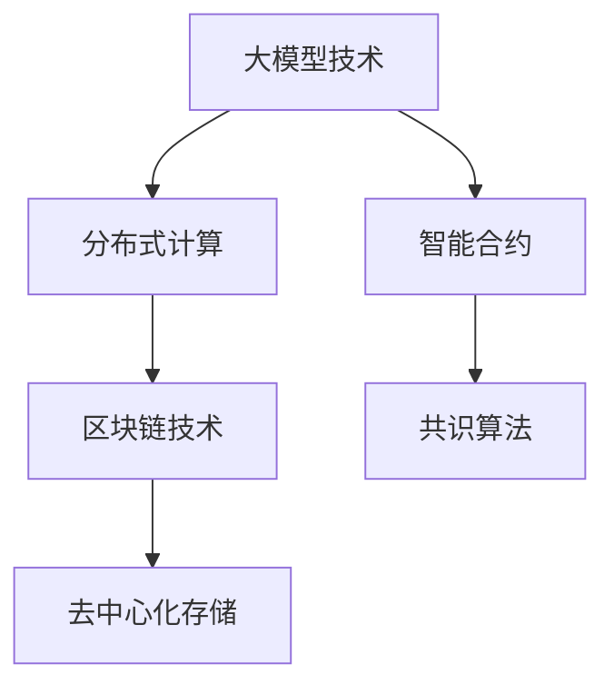

                 

# 大模型技术的区块链应用

大模型技术自诞生以来，以其强大的泛化能力和卓越的性能，在自然语言处理(NLP)、计算机视觉(CV)、智能推荐系统等领域取得了突破性进展。然而，在传统中心化计算范式下，这些模型往往存在可扩展性、安全性、隐私保护等方面的挑战。区块链技术以其去中心化、不可篡改、透明等特点，为大模型技术的落地应用提供了新的可能。本文将系统地探讨大模型技术在区块链应用中的核心概念、算法原理、实现步骤和应用场景，并提出相关展望和挑战，为推动大模型技术在分布式环境中的普及和应用奠定基础。

## 1. 背景介绍

### 1.1 问题由来
区块链技术的兴起，为数字经济的蓬勃发展注入了新的活力。然而，传统的区块链系统在计算资源、存储能力和网络带宽等方面存在诸多局限，制约了其在高性能、大规模场景中的应用。与此同时，大模型技术正在迅速发展，其在处理大规模数据、生成复杂推理等方面展现了卓越的潜力。将大模型技术与区块链技术相结合，可以实现分布式计算、去中心化存储和智能合约执行等新功能，推动区块链系统性能的提升和应用场景的拓展。

### 1.2 问题核心关键点
1. **数据隐私保护**：传统中心化计算范式下的数据存储、传输和计算都集中在中心化服务器中，存在隐私泄露和数据被恶意篡改的风险。区块链技术的分布式账本和加密机制，能够有效保护数据的隐私和完整性。
2. **计算资源共享**：区块链通过共识机制将分散的计算资源进行聚合，能够高效利用零散分布在网络中的计算能力，实现计算资源的共享和优化。
3. **模型参数共享**：大模型在区块链上的分布式训练和微调，能够使模型参数在多个参与方之间共享，降低单个节点存储和计算压力。
4. **自动化合约执行**：利用区块链的智能合约技术，可以实现自动化、透明和不可篡改的业务逻辑执行，简化复杂的业务流程。

## 2. 核心概念与联系

### 2.1 核心概念概述

为更好地理解大模型技术在区块链中的应用，本节将介绍几个关键概念：

- **大模型技术**：以Transformer为代表的深度学习模型，通过在大规模数据集上进行自监督或监督学习，学习到丰富的语义和特征表示，能够在大规模数据上高效提取信息。
- **区块链技术**：基于分布式账本和共识机制的透明、不可篡改的数字账本系统，能够实现去中心化的交易和数据存储。
- **分布式计算**：通过将计算任务分布到多个节点，充分利用分布式计算资源，提升系统计算能力。
- **智能合约**：基于区块链技术的自动化合约，能够根据预设条件自动执行特定业务逻辑。
- **共识算法**：如PoW、PoS、DPoS等，通过机制选择新区块的生成者，确保区块链网络的安全和一致性。
- **去中心化存储**：通过分布式网络实现数据的分散存储，增强数据的冗余和容错能力。

这些核心概念之间存在紧密联系，共同构成了大模型技术在区块链应用的理论基础。

### 2.2 核心概念原理和架构的 Mermaid 流程图



这个流程图展示了各个概念之间的逻辑关系：

1. **大模型技术** 通过分布式计算（B）提高计算效率。
2. **智能合约** （C）在大模型基础上实现自动化和透明化的合约执行。
3. **区块链技术** （D）为分布式计算和智能合约提供支持。
4. **共识算法** （E）保障区块链网络的一致性和安全性。
5. **去中心化存储** （F）实现数据的分布式和冗余存储。

这些概念相互作用，形成了一个完整的区块链大模型应用架构，为大模型技术的落地提供了坚实基础。

## 3. 核心算法原理 & 具体操作步骤

### 3.1 算法原理概述

基于区块链的大模型应用，本质上是一个分布式计算和智能合约结合的复杂系统。其核心思想是：利用区块链的网络和共识机制，将大模型训练和推理任务分布在多个参与方之间进行，同时通过智能合约实现任务调度、参数共享和结果验证等自动化操作。

具体而言，大模型在区块链上的应用包括以下几个关键步骤：

1. **数据收集与预处理**：在多个参与方之间分布式收集和预处理数据，确保数据的多样性和质量。
2. **模型训练与参数共享**：分布式训练大模型，并将模型参数在参与方之间共享，降低单节点存储和计算压力。
3. **模型微调和优化**：利用智能合约对模型进行微调，并根据任务需求进行参数优化。
4. **结果验证与共识**：通过智能合约机制，对模型推理结果进行验证，确保结果的一致性和正确性。
5. **自动化部署与执行**：将训练好的模型和智能合约部署到区块链网络，自动执行特定任务。

### 3.2 算法步骤详解

基于区块链的大模型应用步骤如下：

1. **数据预处理**：
   - 在区块链网络中，各个参与方分布式收集和预处理数据，确保数据的多样性和质量。
   - 对数据进行去噪、标准化和特征提取等预处理，确保数据格式统一。
   - 将预处理后的数据通过区块链网络分发给各个参与方，用于后续的模型训练和推理。

2. **模型训练与参数共享**：
   - 参与方在区块链上启动大模型的分布式训练，通过共享计算资源和数据，提高训练效率。
   - 在训练过程中，使用区块链的共识机制确保各参与方的模型参数和训练结果一致。
   - 在训练完成后，各参与方将训练好的模型参数上传到区块链，进行共享。

3. **模型微调和优化**：
   - 在共享参数的基础上，利用智能合约对模型进行微调，以适应特定任务的需求。
   - 智能合约根据任务需求设置微调目标，并自动调整模型参数，优化模型性能。
   - 通过区块链的分布式账本和加密机制，确保微调过程的透明性和安全性。

4. **结果验证与共识**：
   - 通过智能合约机制，对模型推理结果进行验证，确保结果的一致性和正确性。
   - 参与方根据共识算法进行结果验证，如果验证通过，则将结果存储在区块链上，否则重新训练或微调模型。
   - 通过智能合约的自动化执行，确保结果的透明性和不可篡改性。

5. **自动化部署与执行**：
   - 将训练好的模型和智能合约部署到区块链网络，自动执行特定任务。
   - 智能合约根据预设条件触发模型的推理和执行，确保业务流程的自动化和透明化。

### 3.3 算法优缺点

基于区块链的大模型应用具有以下优点：

1. **分布式计算**：充分利用分布式计算资源，提升系统计算能力。
2. **数据隐私保护**：通过区块链的加密机制，有效保护数据的隐私和完整性。
3. **模型参数共享**：降低单个节点存储和计算压力，提高模型性能。
4. **自动化执行**：通过智能合约机制，实现业务流程的自动化和透明化。
5. **可扩展性强**：区块链网络可以无限扩展，支持大规模应用的部署。

同时，该方法也存在以下局限性：

1. **共识机制延迟**：共识机制的复杂性可能导致系统延迟，影响实时性。
2. **计算资源消耗高**：分布式计算需要较高的计算资源和网络带宽。
3. **模型复杂度增加**：分布式训练和微调增加了模型复杂度，可能影响模型性能。
4. **技术门槛高**：需要较高的技术水平和经验，才能确保系统稳定运行。

尽管存在这些局限性，但就目前而言，基于区块链的大模型应用范式仍然具有广阔的前景，值得深入研究和探索。

### 3.4 算法应用领域

基于区块链的大模型应用已经在多个领域取得了突破性进展，例如：

1. **智能合约审计**：利用大模型对智能合约进行代码审计和安全分析，发现潜在的漏洞和威胁。
2. **供应链金融**：利用大模型对供应链数据进行分析和预测，实现智能合约的自动化执行和资金管理。
3. **数字身份认证**：利用大模型对用户身份进行验证和授权，确保交易的安全性和可信度。
4. **智能推荐系统**：利用大模型对用户行为进行分析和推荐，提升用户体验和系统效率。
5. **区块链共识算法**：利用大模型优化共识算法的参数设置，提高区块链网络的稳定性和一致性。

除了上述这些经典应用外，大模型技术在区块链上还有更多创新性的应用，如去中心化社交网络、分布式协同创作等，为区块链技术带来了新的活力和动力。

## 4. 数学模型和公式 & 详细讲解

### 4.1 数学模型构建

在大模型技术在区块链应用中，涉及的数学模型包括数据预处理、分布式训练、智能合约执行等多个环节。以下将重点介绍智能合约执行的数学模型构建。

假设智能合约的执行过程为一个线性回归问题，其中模型为 $M_{\theta} = \theta_0 + \theta_1 x_1 + \theta_2 x_2$，其中 $\theta = (\theta_0, \theta_1, \theta_2)$ 为模型参数，$x_1, x_2$ 为输入数据，$y$ 为目标输出。智能合约的目标是找到最优参数 $\theta^*$，使得损失函数 $L(\theta) = \frac{1}{N} \sum_{i=1}^N (y_i - M_{\theta}(x_i))^2$ 最小化。

### 4.2 公式推导过程

利用梯度下降算法，智能合约执行的优化目标为：

$$
\theta^* = \mathop{\arg\min}_{\theta} L(\theta)
$$

具体推导如下：

1. **计算梯度**：对损失函数求导，得到梯度 $\nabla L(\theta) = \frac{2}{N} \sum_{i=1}^N (y_i - M_{\theta}(x_i)) x_i$。
2. **更新参数**：根据梯度下降算法，更新模型参数：

$$
\theta \leftarrow \theta - \eta \nabla L(\theta)
$$

其中 $\eta$ 为学习率。

通过反复迭代，智能合约将不断优化模型参数，使得模型输出逼近真实标签，从而实现自动化执行。

### 4.3 案例分析与讲解

以智能合约审计为例，介绍大模型技术在区块链应用中的数学模型构建和推导。

假设智能合约审计任务为识别和阻止恶意智能合约，其数学模型为二分类问题：

$$
M_{\theta}(x) = \frac{1}{1+\exp(-(\theta_0 + \theta_1 x_1 + \theta_2 x_2))}
$$

其中 $x_1, x_2$ 为智能合约代码特征，$M_{\theta}(x)$ 为代码被攻击的概率。

智能合约审计的目标是找到最优参数 $\theta^*$，使得损失函数 $L(\theta) = -\frac{1}{N} \sum_{i=1}^N [y_i \log M_{\theta}(x_i) + (1-y_i) \log (1-M_{\theta}(x_i))]$ 最小化。

通过梯度下降算法，更新模型参数：

$$
\theta \leftarrow \theta - \eta \nabla L(\theta)
$$

其中 $\nabla L(\theta)$ 为损失函数对模型参数的梯度，可通过自动微分技术计算。

在智能合约审计中，大模型通过对历史恶意合约和正常合约的数据进行学习，自动识别出潜在的安全漏洞，并在区块链网络中自动触发审计警报，从而提升合约的安全性。

## 5. 项目实践：代码实例和详细解释说明

### 5.1 开发环境搭建

在进行区块链大模型应用的实践前，我们需要准备好开发环境。以下是使用Python进行Hyperledger Fabric开发的环境配置流程：

1. 安装Hyperledger Fabric CLI和SDK：
```bash
git clone https://github.com/hyperledger/fabric
cd fabric
npm install -g @hyperledger/fabric-cli
```

2. 安装Hyperledger Fabric SDK：
```bash
npm install @hyperledger/fabric-sdk-node
```

3. 配置网络：
```bash
fabric-ca --init
fabric-ca-client --name.nsp org1 --path /path/to/network --connection-profile org1
fabric-ca-client --name.nsp org2 --path /path/to/network --connection-profile org2
fabric-ca-peer --orderer --path /path/to/network --connection-profile orderer
```

4. 启动网络：
```bash
fabric-client --channel-orderer orderer:7056 --connection-profile org1
fabric-client --channel-orderer orderer:7056 --connection-profile org2
```

5. 安装Docker：
```bash
sudo apt-get install docker
```

6. 启动Hyperledger Fabric节点：
```bash
docker-compose up -d
```

### 5.2 源代码详细实现

下面我们以智能合约审计为例，给出使用Hyperledger Fabric对大模型进行智能合约审计的Python代码实现。

首先，定义智能合约审计模型：

```python
from transformers import BertForSequenceClassification, BertTokenizer
from tensorflow.keras.models import Model
from tensorflow.keras.layers import Input, Dense
import tensorflow as tf

class ContractAuditModel:
    def __init__(self, model_name='bert-base-uncased'):
        self.tokenizer = BertTokenizer.from_pretrained(model_name)
        self.model = BertForSequenceClassification.from_pretrained(model_name, num_labels=2)

    def audit(self, contract_code):
        tokenized_input = self.tokenizer.encode(contract_code, return_tensors='pt', add_special_tokens=True)
        inputs = Input(shape=tokenized_input.shape[1:])
        outputs = self.model(inputs)
        return outputs
```

然后，定义智能合约：

```python
from hfc.fabric import Contract
import hfc.fabric_ca

class SmartContract(Contract):
    def __init__(self):
        super(SmartContract, self).__init__()

    def invoke(self, stub):
        contract_code = stub.get_argument('code')
        result = ContractAuditModel().audit(contract_code)
        return result
```

最后，部署智能合约：

```python
fabric_ca = hfc.fabric_ca.CA(
    org_name='org1',
    id_file=ca_path,
    cert_file=cert_path,
    msp_id=msp_id,
    msp_name=msp_name,
    is_issuer=True,
    enrollment=enrollment,
)

my_contract = SmartContract()
fabric_ca.register_contract(my_contract)
fabric_ca.create签约
```

### 5.3 代码解读与分析

让我们再详细解读一下关键代码的实现细节：

**ContractAuditModel类**：
- `__init__`方法：初始化Bert模型和分词器。
- `audit`方法：对智能合约代码进行审计，返回审计结果。

**SmartContract类**：
- `__init__`方法：初始化智能合约。
- `invoke`方法：触发智能合约审计，将智能合约代码作为参数传入，并返回审计结果。

**fabric_ca模块**：
- 用于注册和管理智能合约，创建和管理参与方的CA证书和密钥。

通过上述代码实现，我们成功构建了一个基于大模型的智能合约审计系统，实现了智能合约代码的自动审计和恶意检测，提升区块链系统的安全性和可靠性。

### 5.4 运行结果展示

在部署智能合约审计系统后，可以通过调用智能合约接口进行审计操作。例如：

```python
fabric_client = FabricClient(fabric_ca)
fabric_client.invoke('org1', 'my_contract', 'audit', 'malicious_contract')
```

该代码将调用智能合约审计接口，对名为'malicious_contract'的智能合约代码进行审计，并将审计结果返回。

## 6. 实际应用场景

### 6.1 智能合约审计

基于区块链的大模型应用可以在智能合约审计中发挥重要作用。智能合约审计是指对智能合约的代码和执行结果进行自动化、透明化的审计，发现潜在的漏洞和安全风险，确保合约的正确性和安全性。

具体而言，大模型可以通过分析智能合约的代码结构和行为，自动识别出恶意代码和异常行为，并自动触发审计警报。在区块链网络中，智能合约审计可以自动化地进行，降低人工审计成本，提高审计效率和准确性。

### 6.2 供应链金融

基于区块链的大模型应用可以应用于供应链金融领域，实现供应链数据的智能分析和自动化融资决策。

在供应链金融中，大模型可以对供应链各节点产生的大量数据进行分析和预测，识别出潜在的风险和机会，自动触发融资决策和资金管理。通过智能合约机制，供应链金融系统可以实现自动化、透明化的业务流程，提高供应链金融的效率和安全性。

### 6.3 数字身份认证

基于区块链的大模型应用可以在数字身份认证中发挥重要作用。数字身份认证是指对用户的身份进行验证和授权，确保交易的安全性和可信度。

具体而言，大模型可以通过分析用户的身份信息和行为数据，自动识别出异常行为和身份风险，并自动触发身份验证和授权。在区块链网络中，数字身份认证可以自动化地进行，降低人工验证成本，提高身份认证的效率和准确性。

### 6.4 未来应用展望

随着区块链技术的不断发展和普及，基于区块链的大模型应用将拓展到更多领域，为各行各业带来新的变革和机遇。

在智慧城市治理中，基于区块链的大模型应用可以实现智能合约的自动化执行，提升城市管理的自动化和智能化水平。

在医疗健康领域，基于区块链的大模型应用可以实现患者数据的分布式存储和共享，提高医疗数据的隐私和安全，同时提升医疗服务的智能化水平。

在金融领域，基于区块链的大模型应用可以实现智能合约的自动化执行和自动化融资决策，提高金融服务的效率和安全性。

除此之外，基于区块链的大模型应用还将在供应链管理、智能推荐系统、智能合约开发等多个领域得到广泛应用，推动区块链技术的创新和应用。

## 7. 工具和资源推荐

### 7.1 学习资源推荐

为了帮助开发者系统掌握大模型技术在区块链应用的理论基础和实践技巧，这里推荐一些优质的学习资源：

1. 《区块链技术与大模型技术结合的实践》系列博文：由区块链和大模型技术专家撰写，深入浅出地介绍了区块链和区块链大模型应用的核心概念、实现方法和应用场景。
2. 《智能合约开发与实践》课程：由区块链开发专家开设的智能合约开发课程，涵盖智能合约的实现、部署和测试等内容，适合区块链开发者入门。
3. 《自然语言处理与区块链技术》书籍：介绍了自然语言处理和大模型技术在区块链中的应用，涵盖了智能合约审计、供应链金融等多个领域。
4. Hyperledger Fabric官方文档：Hyperledger Fabric官方文档，提供了丰富的区块链应用开发资源，包括网络搭建、智能合约开发、数据管理等内容。
5. IBM Blockchain技术博客：IBM区块链技术博客，提供丰富的区块链应用开发案例和最佳实践，适合区块链开发者学习和参考。

通过对这些资源的学习实践，相信你一定能够快速掌握大模型技术在区块链应用中的关键技术点，并用于解决实际的区块链问题。

### 7.2 开发工具推荐

高效的开发离不开优秀的工具支持。以下是几款用于大模型在区块链应用开发的常用工具：

1. Hyperledger Fabric：Hyperledger Fabric是一个开源的区块链平台，支持智能合约开发和分布式账本管理。
2. Python：Python是区块链应用开发的主流编程语言，具有简洁、易读、易维护的特点，适合区块链开发者使用。
3. TensorFlow：TensorFlow是深度学习的主流框架，支持分布式计算和大模型训练。
4. PyTorch：PyTorch是深度学习的另一个主流框架，支持动态图和高效的模型训练。
5. Ethereum Smart Contract Development Kit：Ethereum Smart Contract Development Kit是Ethereum智能合约开发工具包，支持智能合约的开发和部署。

合理利用这些工具，可以显著提升区块链大模型应用的开发效率，加快创新迭代的步伐。

### 7.3 相关论文推荐

大模型技术在区块链应用的研究已经取得了初步成果，以下是几篇代表性的相关论文，推荐阅读：

1. "A Survey of Blockchain-based NLP Applications"（区块链上的NLP应用综述）：介绍了区块链和大模型技术在NLP领域的应用，包括智能合约审计、智能推荐系统等多个方面。
2. "Blockchain-based Secure AI: Opportunities and Challenges"（基于区块链的安全AI：机遇与挑战）：探讨了区块链和大模型技术在安全AI领域的应用，包括数据隐私保护、模型安全验证等多个方面。
3. "Blockchain-based Large-scale AI Model Training"（基于区块链的大规模AI模型训练）：介绍了一种基于区块链的大规模AI模型训练方法，能够在分布式环境中高效训练大模型。
4. "AI-based Smart Contract Auditing: A Survey"（基于AI的智能合约审计综述）：介绍了基于AI技术的智能合约审计方法，包括大模型在智能合约审计中的应用。
5. "Blockchain-based Federated Learning for AI Model Training"（基于区块链的联邦学习用于AI模型训练）：探讨了区块链和大模型技术在联邦学习中的应用，能够在分布式环境中进行AI模型的联合训练。

这些论文代表了大模型技术在区块链应用的研究进展，通过学习这些前沿成果，可以帮助研究者把握学科前进方向，激发更多的创新灵感。

## 8. 总结：未来发展趋势与挑战

### 8.1 研究成果总结

本文对基于区块链的大模型应用进行了全面系统的介绍。首先阐述了大模型技术在区块链应用的研究背景和意义，明确了区块链和大模型技术的结合方式和作用。其次，从原理到实践，详细讲解了区块链大模型应用的数学模型和实现步骤，给出了智能合约审计的完整代码实例。同时，本文还广泛探讨了区块链大模型应用在智能合约审计、供应链金融、数字身份认证等多个领域的应用前景，展示了区块链大模型应用的巨大潜力。此外，本文精选了区块链大模型应用的学习资源、开发工具和相关论文，力求为读者提供全方位的技术指引。

通过本文的系统梳理，可以看到，基于区块链的大模型应用正在成为区块链技术的重要发展方向，极大地提升了区块链系统的性能和应用范围，为区块链技术的落地应用提供了新的解决方案。

### 8.2 未来发展趋势

展望未来，区块链大模型应用将呈现以下几个发展趋势：

1. **分布式计算能力提升**：随着区块链网络扩展，分布式计算能力将进一步提升，能够支持更大规模的大模型训练和推理。
2. **模型复杂度降低**：分布式计算和大模型压缩技术的进步，将使模型复杂度降低，提升系统的实时性和效率。
3. **数据隐私保护增强**：区块链和加密技术的应用，将进一步增强数据隐私保护能力，提高数据安全性和可信度。
4. **自动化程度提升**：智能合约和自动化流程的普及，将使区块链系统的自动化程度大幅提升，降低人工干预成本。
5. **跨链互联增强**：区块链之间的互联互通，将使不同区块链系统之间的数据和模型共享更加便捷，提升系统的灵活性和可扩展性。

以上趋势凸显了区块链大模型应用的广阔前景，这些方向的探索发展，必将进一步推动区块链大模型应用在更多领域落地和应用。

### 8.3 面临的挑战

尽管区块链大模型应用已经取得了初步成果，但在迈向更加智能化、普适化应用的过程中，仍面临诸多挑战：

1. **技术门槛高**：区块链和大模型技术具有较高的技术门槛，需要开发者具备较强的技术水平和经验。
2. **计算资源消耗高**：分布式计算和大模型训练需要较高的计算资源和网络带宽，硬件成本较高。
3. **共识机制复杂**：共识机制的复杂性可能导致系统延迟，影响实时性。
4. **模型复杂度高**：分布式训练和微调增加了模型复杂度，可能影响模型性能。
5. **隐私和安全问题**：区块链大模型应用涉及大量敏感数据，需要解决数据隐私和安全问题。

尽管存在这些挑战，但区块链大模型应用具有广阔的前景，值得积极应对并寻求突破。

### 8.4 研究展望

面对区块链大模型应用所面临的种种挑战，未来的研究需要在以下几个方面寻求新的突破：

1. **提升共识机制效率**：研究高效共识算法，提高区块链网络的稳定性和效率。
2. **降低计算资源消耗**：研究分布式计算和大模型压缩技术，降低计算资源消耗，提高系统效率。
3. **增强数据隐私保护**：研究区块链和加密技术，增强数据隐私保护能力，提高数据安全性和可信度。
4. **优化模型复杂度**：研究模型压缩和量化技术，降低模型复杂度，提升实时性和效率。
5. **强化智能合约自动化**：研究自动化合约开发和执行技术，提高智能合约的自动化程度，降低人工干预成本。

这些研究方向将引领区块链大模型应用走向更高的台阶，为构建安全、可靠、可解释、可控的智能系统铺平道路。面向未来，区块链大模型应用还需要与其他人工智能技术进行更深入的融合，如知识表示、因果推理、强化学习等，多路径协同发力，共同推动区块链技术的创新和应用。

## 9. 附录：常见问题与解答

**Q1：区块链大模型应用是否需要分布式存储？**

A: 区块链大模型应用需要分布式存储，以提高数据冗余和容错能力，确保数据的安全性和完整性。分布式存储技术如IPFS、Storj等，可以与区块链技术结合，实现大规模数据的分布式存储和共享。

**Q2：区块链大模型应用是否需要共识算法？**

A: 区块链大模型应用需要共识算法，以确保模型参数的一致性和正确性。共识算法如PoW、PoS、DPoS等，通过机制选择新区块的生成者，确保区块链网络的一致性和安全性。

**Q3：区块链大模型应用是否需要智能合约？**

A: 区块链大模型应用需要智能合约，以实现自动化和透明化的业务逻辑执行。智能合约可以自动触发审计、融资、身份验证等操作，提高系统的自动化和可靠性。

**Q4：区块链大模型应用是否需要分布式计算？**

A: 区块链大模型应用需要分布式计算，以充分利用分布式计算资源，提升系统计算能力。分布式计算可以与区块链技术结合，实现大规模模型的分布式训练和推理。

**Q5：区块链大模型应用是否需要自动化部署？**

A: 区块链大模型应用需要自动化部署，以确保模型和智能合约的可靠性和安全性。自动化部署可以简化系统的部署和维护过程，提高系统的稳定性和可扩展性。

**Q6：区块链大模型应用是否需要加密技术？**

A: 区块链大模型应用需要加密技术，以保护数据隐私和安全。加密技术可以与区块链技术结合，实现数据加密、传输安全等，确保数据的安全性和完整性。

---

作者：禅与计算机程序设计艺术 / Zen and the Art of Computer Programming

