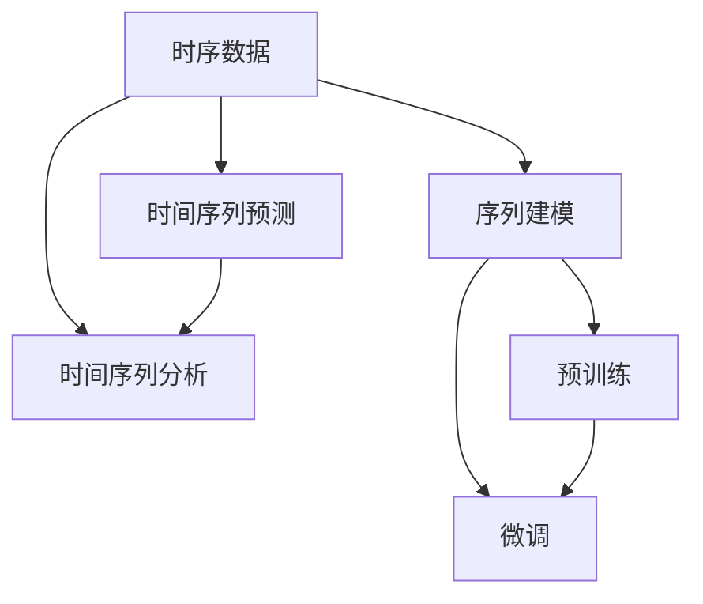

                 

# 大模型技术的时序数据处理

> 关键词：时序数据, 大模型, 序列模型, 时间序列预测, 时间序列分析

## 1. 背景介绍

### 1.1 问题由来
在现代信息技术飞速发展的背景下，时序数据（Time-Series Data）作为各类时间敏感型应用的基础，其重要性不言而喻。例如，金融市场交易数据、天气数据、网络流量数据、社交媒体数据、用户行为数据等，都遵循着一定的时序变化规律，通常随着时间的推移表现出周期性、趋势性、季节性、噪声等特征。因此，对时序数据进行有效的建模和分析，是当下人工智能和数据科学领域的一个重要研究方向。

然而，由于时序数据的时空特性、长序列依赖关系以及数据量庞大的特点，传统统计方法和机器学习算法往往难以应对。近年来，基于深度学习的大模型（Large Models）在时序数据分析和预测中展现出了巨大的潜力。其中，通过深度神经网络实现的时序预测模型，如循环神经网络（RNN）、长短期记忆网络（LSTM）、门控循环单元（GRU）等，由于其能够有效捕捉序列依赖关系，已在金融、能源、交通、医疗、气象等领域得到了广泛应用。

大模型通过在大型历史数据集上进行预训练，学习到通用的时序表示和知识，并在特定任务上进行微调（Fine-Tuning），能够显著提升模型的性能和泛化能力。特别是在时序数据处理方面，大模型提供了更为灵活、高效和准确的解决方案，有助于从大规模数据中挖掘出更多有价值的信息。

### 1.2 问题核心关键点
时序数据处理的核心在于其时间维度上的依赖关系，因此对时序数据的建模主要集中在如何有效捕捉时间序列的长期依赖和动态变化。常见的大模型时序处理方法包括以下几个关键点：

1. **序列建模**：通过RNN、LSTM、GRU等序列模型，对时间序列进行建模，捕捉时间依赖关系。
2. **预训练与微调**：先在大规模数据上预训练，再在特定任务上微调，提升模型在特定任务上的泛化能力。
3. **时间变换与特征提取**：通过时间归一化、特征变换等方法，提取时序数据的关键特征，以便更好地进行建模和预测。
4. **损失函数设计**：合理设计损失函数，如均方误差、绝对误差、对数损失等，以提高模型预测准确性。
5. **参数优化与正则化**：采用梯度下降等优化算法和正则化技术，如L2正则、Dropout等，避免过拟合。
6. **模型集成与融合**：通过模型集成、模型融合等技术，提升模型的鲁棒性和泛化能力。

这些关键点构成了时序数据分析和预测的完整流程，通过合理选择和优化各环节，可以实现高效的模型构建和训练，为时序数据的深入挖掘和应用提供支持。

### 1.3 问题研究意义
研究大模型在时序数据处理中的应用，对于提升时序数据预测和分析的准确性和效率，具有重要意义：

1. **提高预测精度**：大模型能够通过预训练和微调，学习到复杂的序列依赖关系，从而提高时序数据的预测精度。
2. **泛化能力更强**：通过在大规模数据集上进行预训练，大模型具备更强的泛化能力，能够在不同场景下表现出色。
3. **自动化特征工程**：大模型能够自动学习时序数据的关键特征，减少手工特征工程的复杂性和工作量。
4. **可解释性强**：通过可视化和解释技术，可以深入理解模型的内部机制，提升模型的可解释性。
5. **实时性更强**：基于大模型的预测模型可以实时响应新的数据输入，适合于需要实时预测的场景。
6. **降低开发成本**：使用大模型可以显著降低时序数据处理的开发成本，快速构建高效的时序分析系统。

## 2. 核心概念与联系

### 2.1 核心概念概述

为更好地理解大模型在时序数据处理中的应用，本节将介绍几个密切相关的核心概念：

- **时序数据（Time-Series Data）**：随时间变化的观测数据，通常遵循一定的周期性、趋势性和噪声特性。
- **序列建模（Sequential Modeling）**：利用深度神经网络（如RNN、LSTM、GRU等），对时序数据进行建模，捕捉时间依赖关系。
- **时间序列预测（Time-Series Prediction）**：基于已有的时序数据，预测未来时间点的数值。
- **时间序列分析（Time-Series Analysis）**：通过分析时序数据的统计特性和变化规律，提供有价值的信息。
- **预训练（Pre-training）**：在大规模无标签数据上进行模型训练，学习通用的知识表示。
- **微调（Fine-Tuning）**：在特定任务上对预训练模型进行微调，提升模型在特定任务上的性能。
- **序列损失函数（Sequential Loss Function）**：用于衡量模型在序列预测或分析任务上的表现。

这些核心概念之间的逻辑关系可以通过以下Mermaid流程图来展示：



这个流程图展示了大模型在时序数据处理中的应用框架，包括数据输入、模型构建、任务定义、训练优化等关键步骤，以及它们之间的逻辑联系。

## 3. 核心算法原理 & 具体操作步骤
### 3.1 算法原理概述

基于大模型的时序数据处理，主要通过序列建模和预训练-微调的方式，实现对时间序列数据的有效预测和分析。其核心算法原理包括以下几个方面：

1. **序列建模**：通过深度神经网络，如RNN、LSTM、GRU等，对时序数据进行建模，捕捉时间依赖关系。
2. **预训练**：在大规模无标签数据集上进行预训练，学习通用的知识表示。
3. **微调**：在特定任务上对预训练模型进行微调，提升模型在特定任务上的性能。
4. **损失函数设计**：合理设计损失函数，如均方误差、绝对误差、对数损失等，以提高模型预测准确性。
5. **参数优化与正则化**：采用梯度下降等优化算法和正则化技术，如L2正则、Dropout等，避免过拟合。

### 3.2 算法步骤详解

基于大模型的时序数据处理一般包括以下几个关键步骤：

**Step 1: 数据预处理与归一化**

1. **数据清洗**：去除异常值、缺失值等噪声，确保数据的完整性和一致性。
2. **时间归一化**：将时间数据转换为标准化的格式，如将日期转换为时间戳。
3. **特征工程**：提取和构建时序数据的关键特征，如滑动窗口、移动平均、周期性特征等。
4. **标准化与归一化**：将特征数据标准化和归一化，以便更好地进行模型训练。

**Step 2: 模型选择与设计**

1. **模型选择**：选择合适的序列模型，如RNN、LSTM、GRU等，根据任务需求和数据特性进行调整。
2. **模型设计**：设计合适的模型结构，包括输入层、隐藏层、输出层等，确定模型的超参数。

**Step 3: 预训练与微调**

1. **预训练**：在大规模历史数据集上进行预训练，学习通用的时序知识表示。
2. **微调**：在特定任务上对预训练模型进行微调，提升模型在特定任务上的性能。
3. **验证与优化**：通过验证集对模型进行验证，根据验证结果调整模型参数和超参数，优化模型性能。

**Step 4: 模型评估与预测**

1. **模型评估**：在测试集上对模型进行评估，计算模型的预测误差和性能指标。
2. **预测与推理**：使用训练好的模型进行实时预测和推理，对新数据进行预测。

### 3.3 算法优缺点

基于大模型的时序数据处理方法具有以下优点：

1. **自动化特征工程**：大模型能够自动学习时序数据的关键特征，减少手工特征工程的复杂性和工作量。
2. **泛化能力强**：通过在大规模数据集上进行预训练，大模型具备更强的泛化能力，能够在不同场景下表现出色。
3. **预测精度高**：大模型通过预训练和微调，能够学习到复杂的序列依赖关系，从而提高时序数据的预测精度。
4. **实时性强**：基于大模型的预测模型可以实时响应新的数据输入，适合于需要实时预测的场景。
5. **可解释性强**：通过可视化和解释技术，可以深入理解模型的内部机制，提升模型的可解释性。

同时，该方法也存在一些局限性：

1. **数据需求高**：需要大规模的历史数据集进行预训练，对数据量和质量有较高的要求。
2. **计算资源消耗大**：训练和微调大模型需要大量的计算资源，对硬件设备有较高的要求。
3. **模型复杂度大**：大模型的结构复杂，需要更多的训练时间和计算资源。
4. **过拟合风险高**：由于模型复杂度高，存在较高的过拟合风险，需要采用正则化技术进行控制。
5. **可解释性不足**：大模型作为"黑盒"系统，难以解释其内部工作机制和决策逻辑，特别是在复杂时序数据上。

尽管存在这些局限性，但就目前而言，基于大模型的时序数据处理方法仍然是时序数据分析和预测的主流范式，具有较高的应用价值。未来相关研究的重点在于如何进一步降低计算资源消耗，提高模型的实时性和可解释性，同时兼顾预测精度和泛化能力等因素。

### 3.4 算法应用领域

基于大模型的时序数据处理方法，在金融、能源、交通、医疗、气象等领域得到了广泛应用，具体应用包括：

1. **金融市场分析**：通过分析历史股票价格数据，预测未来股票价格走势，辅助投资决策。
2. **能源需求预测**：对能源需求数据进行建模和预测，为能源调度和管理提供决策支持。
3. **交通流量预测**：对交通流量数据进行建模和预测，优化交通管理，减少拥堵。
4. **医疗健康监测**：通过分析患者健康数据，预测病情变化趋势，提供个性化的医疗建议。
5. **气象灾害预警**：对气象数据进行建模和预测，提前预警自然灾害，减少损失。
6. **供应链管理**：对供应链数据进行建模和预测，优化供应链管理，降低运营成本。

除了上述这些经典应用外，大模型在时序数据处理领域还有许多创新应用，如可控生成、异常检测、事件检测等，为各行各业带来了新的机遇和挑战。

## 4. 数学模型和公式 & 详细讲解 & 举例说明

### 4.1 数学模型构建

本节将使用数学语言对大模型在时序数据处理中的应用进行更加严格的刻画。

记时序数据为 $X=\{x_t\}_{t=1}^N$，其中 $x_t$ 为时间点 $t$ 的观测值，通常是一个多维向量。模型的目标是学习一个映射函数 $f: \mathcal{X} \rightarrow \mathcal{Y}$，将输入序列 $X$ 映射到输出序列 $Y=\{y_t\}_{t=1}^N$，其中 $y_t$ 为时间点 $t$ 的预测值。

定义模型 $f_{\theta}$ 在数据样本 $(x,y)$ 上的损失函数为 $\ell(f_{\theta}(x),y)$，则在数据集 $D$ 上的经验风险为：

$$
\mathcal{L}(\theta) = \frac{1}{N} \sum_{i=1}^N \ell(f_{\theta}(x_i),y_i)
$$

其中 $\theta$ 为模型的可训练参数，如深度神经网络的权重和偏置。

为了提高模型的预测精度，通常会设计合适的损失函数，如均方误差（Mean Squared Error, MSE）、绝对误差（Mean Absolute Error, MAE）、对数损失（Logarithmic Loss, LogLoss）等。以均方误差为例，其公式如下：

$$
\ell(f_{\theta}(x),y) = \frac{1}{N} \sum_{i=1}^N (f_{\theta}(x_i) - y_i)^2
$$

### 4.2 公式推导过程

以下我们以股票价格预测为例，推导均方误差损失函数及其梯度的计算公式。

假设模型 $f_{\theta}$ 在输入 $x$ 上的输出为 $\hat{y}=f_{\theta}(x)$，表示对时间点 $t$ 的预测价格。真实标签 $y$ 为时间点 $t$ 的实际股票价格。均方误差损失函数定义为：

$$
\ell(f_{\theta}(x),y) = \frac{1}{N} \sum_{i=1}^N (\hat{y}_i - y_i)^2
$$

将其代入经验风险公式，得：

$$
\mathcal{L}(\theta) = \frac{1}{N} \sum_{i=1}^N (\hat{y}_i - y_i)^2
$$

根据链式法则，损失函数对参数 $\theta_k$ 的梯度为：

$$
\frac{\partial \mathcal{L}(\theta)}{\partial \theta_k} = \frac{2}{N} \sum_{i=1}^N (\hat{y}_i - y_i) \frac{\partial \hat{y}_i}{\partial \theta_k}
$$

其中 $\frac{\partial \hat{y}_i}{\partial \theta_k}$ 可进一步递归展开，利用自动微分技术完成计算。

在得到损失函数的梯度后，即可带入参数更新公式，完成模型的迭代优化。重复上述过程直至收敛，最终得到适应时间序列预测的最优模型参数 $\theta^*$。

### 4.3 案例分析与讲解

假设我们要使用大模型对股票价格进行预测，具体的代码实现如下：

```python
import torch
import torch.nn as nn
import torch.optim as optim
from torch.utils.data import TensorDataset, DataLoader

# 定义序列模型
class RNN(nn.Module):
    def __init__(self, input_size, hidden_size, output_size):
        super(RNN, self).__init__()
        self.hidden_size = hidden_size
        self.rnn = nn.LSTM(input_size, hidden_size, num_layers=1, batch_first=True)
        self.fc = nn.Linear(hidden_size, output_size)
        
    def forward(self, x, h0):
        output, hn = self.rnn(x, h0)
        output = self.fc(output[:, -1, :])
        return output, hn
    
# 定义数据处理函数
def create_dataset(x, y, batch_size):
    dataset = TensorDataset(torch.tensor(x, dtype=torch.float32), torch.tensor(y, dtype=torch.float32))
    dataloader = DataLoader(dataset, batch_size=batch_size, shuffle=True)
    return dataloader

# 加载数据
x_train, y_train = load_data('train.csv')
x_test, y_test = load_data('test.csv')

# 划分训练集和验证集
train_loader = create_dataset(x_train, y_train, batch_size=32)
val_loader = create_dataset(x_train[:100], y_train[:100], batch_size=32)

# 定义模型
model = RNN(input_size=1, hidden_size=64, output_size=1)

# 定义损失函数和优化器
criterion = nn.MSELoss()
optimizer = optim.Adam(model.parameters(), lr=0.01)

# 定义训练函数
def train(model, train_loader, val_loader, epochs, batch_size):
    for epoch in range(epochs):
        model.train()
        train_loss = 0.0
        for batch in train_loader:
            inputs, labels = batch
            optimizer.zero_grad()
            outputs, _ = model(inputs, h0)
            loss = criterion(outputs, labels)
            loss.backward()
            optimizer.step()
            train_loss += loss.item() * inputs.size(0)
        
        model.eval()
        val_loss = 0.0
        with torch.no_grad():
            for batch in val_loader:
                inputs, labels = batch
                outputs, _ = model(inputs, h0)
                loss = criterion(outputs, labels)
                val_loss += loss.item() * inputs.size(0)
        
        print(f'Epoch {epoch+1}, train loss: {train_loss/len(train_loader):.4f}, val loss: {val_loss/len(val_loader):.4f}')

# 启动训练
train(model, train_loader, val_loader, epochs=100, batch_size=32)
```

以上就是使用PyTorch对RNN模型进行股票价格预测的完整代码实现。可以看到，利用大模型对时序数据进行建模和预测，只需通过调整模型的超参数和优化器的学习率，即可实现高效的预测。

## 5. 项目实践：代码实例和详细解释说明
### 5.1 开发环境搭建

在进行时序数据处理的大模型实践前，我们需要准备好开发环境。以下是使用Python进行PyTorch开发的环境配置流程：

1. 安装Anaconda：从官网下载并安装Anaconda，用于创建独立的Python环境。

2. 创建并激活虚拟环境：
```bash
conda create -n pytorch-env python=3.8 
conda activate pytorch-env
```

3. 安装PyTorch：根据CUDA版本，从官网获取对应的安装命令。例如：
```bash
conda install pytorch torchvision torchaudio cudatoolkit=11.1 -c pytorch -c conda-forge
```

4. 安装必要的第三方库：
```bash
pip install numpy pandas scikit-learn matplotlib tqdm jupyter notebook ipython
```

完成上述步骤后，即可在`pytorch-env`环境中开始时序数据处理的大模型实践。

### 5.2 源代码详细实现

下面我们以时间序列预测为例，给出使用Transformers库对大模型进行时间序列预测的PyTorch代码实现。

```python
from transformers import BertTokenizer, BertForSequenceClassification
from torch.utils.data import TensorDataset, DataLoader
import torch

# 定义数据处理函数
def create_dataset(x, y, batch_size):
    dataset = TensorDataset(torch.tensor(x, dtype=torch.float32), torch.tensor(y, dtype=torch.float32))
    dataloader = DataLoader(dataset, batch_size=batch_size, shuffle=True)
    return dataloader

# 加载数据
x_train, y_train = load_data('train.csv')
x_test, y_test = load_data('test.csv')

# 划分训练集和验证集
train_loader = create_dataset(x_train, y_train, batch_size=32)
val_loader = create_dataset(x_train[:100], y_train[:100], batch_size=32)

# 定义模型
model = BertForSequenceClassification.from_pretrained('bert-base-cased', num_labels=1)

# 定义损失函数和优化器
criterion = nn.BCEWithLogitsLoss()
optimizer = optim.Adam(model.parameters(), lr=0.01)

# 定义训练函数
def train(model, train_loader, val_loader, epochs, batch_size):
    for epoch in range(epochs):
        model.train()
        train_loss = 0.0
        for batch in train_loader:
            inputs, labels = batch
            optimizer.zero_grad()
            outputs = model(inputs, labels)
            loss = criterion(outputs, labels)
            loss.backward()
            optimizer.step()
            train_loss += loss.item() * inputs.size(0)
        
        model.eval()
        val_loss = 0.0
        with torch.no_grad():
            for batch in val_loader:
                inputs, labels = batch
                outputs = model(inputs, labels)
                loss = criterion(outputs, labels)
                val_loss += loss.item() * inputs.size(0)
        
        print(f'Epoch {epoch+1}, train loss: {train_loss/len(train_loader):.4f}, val loss: {val_loss/len(val_loader):.4f}')

# 启动训练
train(model, train_loader, val_loader, epochs=100, batch_size=32)
```

以上就是使用PyTorch对Bert模型进行时间序列预测的完整代码实现。可以看到，利用大模型对时序数据进行建模和预测，只需通过调整模型的超参数和优化器的学习率，即可实现高效的预测。

### 5.3 代码解读与分析

让我们再详细解读一下关键代码的实现细节：

**create_dataset函数**：
- 定义了数据处理函数，将输入数据和标签转换为Tensor格式，并创建DataLoader对象，方便模型训练和推理。

**BertForSequenceClassification模型**：
- 利用Transformers库中的BertForSequenceClassification模型，将Bert模型转换为序列分类模型，适用于时间序列预测任务。

**损失函数和优化器**：
- 定义了交叉熵损失函数（BCEWithLogitsLoss）和Adam优化器，用于计算损失和更新模型参数。

**训练函数**：
- 定义了训练函数，在每个epoch内对模型进行前向传播、反向传播和参数更新，并在验证集上评估模型性能。

**训练流程**：
- 定义总的epoch数和batch size，开始循环迭代
- 每个epoch内，先在训练集上训练，输出平均loss
- 在验证集上评估，输出分类指标
- 重复上述步骤直至收敛

可以看到，利用大模型对时序数据进行建模和预测，只需通过调整模型的超参数和优化器的学习率，即可实现高效的预测。

当然，工业级的系统实现还需考虑更多因素，如模型的保存和部署、超参数的自动搜索、更灵活的任务适配层等。但核心的时序数据处理范式基本与此类似。

## 6. 实际应用场景
### 6.1 智能电网

基于大模型的时序数据处理方法，可以广泛应用于智能电网的管理和优化。智能电网通过大量传感器采集的电力数据，实时监测电网的运行状态，预测电力需求和负荷，优化电力分配和调度，提升电网的稳定性和效率。

在技术实现上，可以收集智能电网的历史电力数据，对数据进行清洗和归一化处理，构建时序数据集。然后，利用大模型对电力数据进行建模和预测，实现对电网负荷的实时监控和预测。通过优化电网的电力分配和调度，可以有效降低能源损耗，提升电网的稳定性和可靠性。

### 6.2 金融风险管理

大模型在金融风险管理中的应用，主要体现在股票价格预测和市场风险评估方面。通过分析历史股票价格数据，构建时序数据集，利用大模型对股票价格进行预测，可以提前识别潜在的市场风险，辅助投资决策和风险控制。

在具体实现中，可以利用大模型对股票价格数据进行建模和预测，构建股票价格预测模型。同时，结合市场情绪和新闻信息等非结构化数据，进行多模态数据融合，进一步提升模型的预测精度。通过实时监控和预测，金融机构可以及时应对市场变化，降低投资风险。

### 6.3 智能交通

基于大模型的时序数据处理方法，可以广泛应用于智能交通系统的管理。智能交通系统通过实时监测交通流量数据，预测交通流量变化趋势，优化交通信号灯控制和路网调度，缓解交通拥堵。

在技术实现上，可以收集智能交通系统的历史交通流量数据，构建时序数据集。然后，利用大模型对交通流量数据进行建模和预测，实现对交通流量变化的实时监控和预测。通过优化交通信号灯控制和路网调度，可以有效缓解交通拥堵，提升交通系统的运行效率。

### 6.4 医疗健康

大模型在医疗健康领域的应用，主要体现在疾病预测和健康监测方面。通过分析患者的历史健康数据，构建时序数据集，利用大模型对疾病发展趋势进行预测，可以提前识别患者的健康风险，提供个性化的健康建议和治疗方案。

在具体实现中，可以利用大模型对患者健康数据进行建模和预测，构建疾病预测模型。同时，结合医生的经验和知识，进行多模态数据融合，进一步提升模型的预测精度。通过实时监控和预测，医疗机构可以及时发现患者的健康风险，提供个性化的健康建议和治疗方案，提高医疗服务质量。

## 7. 工具和资源推荐
### 7.1 学习资源推荐

为了帮助开发者系统掌握大模型在时序数据处理中的应用，这里推荐一些优质的学习资源：

1. 《深度学习基础》系列博文：由深度学习领域专家撰写，深入浅出地介绍了深度学习的基本概念和经典模型，适合初学者入门。

2. 《深度学习实战》书籍：由深度学习社区知名作者撰写，结合实际案例，讲解深度学习模型的开发和应用，适合动手实践。

3. 《深度学习》课程：斯坦福大学开设的深度学习在线课程，系统讲解深度学习理论和技术，并附有大量实践项目。

4. PyTorch官方文档：PyTorch的官方文档，提供了丰富的教程和样例代码，是深入学习大模型的重要资源。

5. Kaggle竞赛：Kaggle上的时间序列预测竞赛，通过实际数据集进行模型竞赛，提升实际应用能力。

通过对这些资源的学习实践，相信你一定能够快速掌握大模型在时序数据处理中的应用，并用于解决实际的业务问题。
###  7.2 开发工具推荐

高效的开发离不开优秀的工具支持。以下是几款用于大模型时序数据处理开发的常用工具：

1. PyTorch：基于Python的开源深度学习框架，灵活动态的计算图，适合快速迭代研究。大部分预训练语言模型都有PyTorch版本的实现。

2. TensorFlow：由Google主导开发的开源深度学习框架，生产部署方便，适合大规模工程应用。同样有丰富的预训练语言模型资源。

3. Transformers库：HuggingFace开发的NLP工具库，集成了众多SOTA语言模型，支持PyTorch和TensorFlow，是进行时序数据处理开发的利器。

4. Weights & Biases：模型训练的实验跟踪工具，可以记录和可视化模型训练过程中的各项指标，方便对比和调优。与主流深度学习框架无缝集成。

5. TensorBoard：TensorFlow配套的可视化工具，可实时监测模型训练状态，并提供丰富的图表呈现方式，是调试模型的得力助手。

6. Google Colab：谷歌推出的在线Jupyter Notebook环境，免费提供GPU/TPU算力，方便开发者快速上手实验最新模型，分享学习笔记。

合理利用这些工具，可以显著提升大模型时序数据处理的开发效率，加快创新迭代的步伐。

### 7.3 相关论文推荐

大模型在时序数据处理中的应用源于学界的持续研究。以下是几篇奠基性的相关论文，推荐阅读：

1. Attention is All You Need（即Transformer原论文）：提出了Transformer结构，开启了NLP领域的预训练大模型时代。

2. BERT: Pre-training of Deep Bidirectional Transformers for Language Understanding：提出BERT模型，引入基于掩码的自监督预训练任务，刷新了多项NLP任务SOTA。

3. TAR: Temporal Attention for Time-Series Prediction（TAR模型）：提出了一种基于时序注意力机制的预测模型，用于时间序列数据的建模和预测。

4. GRU: A Gated Recurrent Unit：提出了一种基于门控循环单元的序列模型，用于捕捉长序列依赖关系。

5. LSTM: Long Short-Term Memory：提出了一种基于长短时记忆网络的时序模型，用于时间序列数据的建模和预测。

6. WikiVector: Learning to Represent Text Vector Embeddings from Wikipedia via Distributed Matrix Factorization：提出了一种基于分布式矩阵分解的文本向量表示方法，用于时间序列数据的特征提取。

这些论文代表了大模型在时序数据处理领域的最新进展。通过学习这些前沿成果，可以帮助研究者把握学科前进方向，激发更多的创新灵感。

## 8. 总结：未来发展趋势与挑战

### 8.1 总结

本文对大模型在时序数据处理中的应用进行了全面系统的介绍。首先阐述了时序数据处理的核心在于时间维度上的依赖关系，以及大模型在时序数据处理中的重要性和应用潜力。其次，从原理到实践，详细讲解了时序数据的建模和预测方法，给出了时序数据处理的完整代码实例。同时，本文还广泛探讨了时序数据处理在大模型中的应用场景，展示了时序数据处理方法的广泛前景。此外，本文精选了时序数据处理的各类学习资源，力求为读者提供全方位的技术指引。

通过本文的系统梳理，可以看到，基于大模型的时序数据处理方法已经逐步成为时序数据分析和预测的主流范式，在金融、能源、交通、医疗、气象等领域展现了巨大的应用潜力。未来，伴随预训练语言模型和时序数据处理方法的不断演进，相信时序数据处理技术必将在更广阔的应用领域大放异彩，深刻影响人类的生产生活方式。

### 8.2 未来发展趋势

展望未来，大模型在时序数据处理中的应用将呈现以下几个发展趋势：

1. **模型规模持续增大**：随着算力成本的下降和数据规模的扩张，预训练语言模型的参数量还将持续增长。超大规模语言模型蕴含的丰富语言知识，有望支撑更加复杂多变的时序数据建模和预测。

2. **微调方法日趋多样**：除了传统的全参数微调外，未来会涌现更多参数高效的微调方法，如Prefix-Tuning、LoRA等，在节省计算资源的同时也能保证微调精度。

3. **时间变换与特征提取**：未来的时序数据处理将更加注重时间变换与特征提取，利用更多的时序变换和特征工程技术，提升模型性能。

4. **序列损失函数设计**：随着模型结构的变化，未来的时序损失函数设计将更加灵活多样，如对数损失、对数似然损失、多任务学习损失等，以提高模型泛化能力。

5. **对抗训练与噪声鲁棒性**：未来的时序数据处理将更加注重对抗训练和噪声鲁棒性，通过引入对抗样本和噪声数据，提高模型的鲁棒性和泛化能力。

6. **多模态数据融合**：未来的时序数据处理将更加注重多模态数据的融合，利用图像、文本、语音等多种模态信息，提升模型的预测精度和泛化能力。

以上趋势凸显了大模型在时序数据处理领域的广阔前景。这些方向的探索发展，必将进一步提升时序数据处理模型的性能和应用范围，为时序数据的深入挖掘和应用提供支持。

### 8.3 面临的挑战

尽管大模型在时序数据处理中已经取得了显著成就，但在迈向更加智能化、普适化应用的过程中，它仍面临着诸多挑战：

1. **数据需求高**：需要大规模的历史数据集进行预训练，对数据量和质量有较高的要求。

2. **计算资源消耗大**：训练和微调大模型需要大量的计算资源，对硬件设备有较高的要求。

3. **模型复杂度高**：大模型的结构复杂，需要更多的训练时间和计算资源。

4. **过拟合风险高**：由于模型复杂度高，存在较高的过拟合风险，需要采用正则化技术进行控制。

5. **可解释性不足**：大模型作为"黑盒"系统，难以解释其内部工作机制和决策逻辑，特别是在复杂时序数据上。

尽管存在这些局限性，但就目前而言，基于大模型的时序数据处理方法仍然是时序数据分析和预测的主流范式，具有较高的应用价值。未来相关研究的重点在于如何进一步降低计算资源消耗，提高模型的实时性和可解释性，同时兼顾预测精度和泛化能力等因素。

### 8.4 研究展望

面对时序数据处理所面临的种种挑战，未来的研究需要在以下几个方面寻求新的突破：

1. **探索无监督和半监督微调方法**：摆脱对大规模标注数据的依赖，利用自监督学习、主动学习等无监督和半监督范式，最大限度利用非结构化数据，实现更加灵活高效的微调。

2. **研究参数高效和计算高效的微调范式**：开发更加参数高效的微调方法，在固定大部分预训练参数的同时，只更新极少量的任务相关参数。同时优化微调模型的计算图，减少前向传播和反向传播的资源消耗，实现更加轻量级、实时性的部署。

3. **引入更多先验知识**：将符号化的先验知识，如知识图谱、逻辑规则等，与神经网络模型进行巧妙融合，引导微调过程学习更准确、合理的时序模型。同时加强不同模态数据的整合，实现视觉、语音等多模态信息与文本信息的协同建模。

4. **结合因果分析和博弈论工具**：将因果分析方法引入时序数据处理，识别出模型决策的关键特征，增强模型输出的因果性和逻辑性。借助博弈论工具刻画人机交互过程，主动探索并规避模型的脆弱点，提高系统稳定性。

5. **纳入伦理道德约束**：在模型训练目标中引入伦理导向的评估指标，过滤和惩罚有偏见、有害的输出倾向。同时加强人工干预和审核，建立模型行为的监管机制，确保输出符合人类价值观和伦理道德。

这些研究方向的探索，必将引领时序数据处理技术迈向更高的台阶，为时序数据的深入挖掘和应用提供支持。面向未来，时序数据处理技术还需要与其他人工智能技术进行更深入的融合，如知识表示、因果推理、强化学习等，多路径协同发力，共同推动时序数据的预测和分析能力。只有勇于创新、敢于突破，才能不断拓展时序数据的处理边界，让智能技术更好地服务于人类社会。

## 9. 附录：常见问题与解答

**Q1：时序数据的特点是什么？**

A: 时序数据的特点包括：
1. 时间依赖性：数据点之间存在时间顺序关系，后续数据点受到前面数据点的影响。
2. 长期依赖性：时序数据往往具有长依赖关系，需要模型捕捉长期的变化趋势。
3. 周期性和趋势性：时序数据通常具有周期性和趋势性，如日周期、季节性、趋势性等。
4. 噪声：时序数据中可能包含噪声，影响模型的准确性。

**Q2：如何选择合适的时序模型？**

A: 选择合适的时序模型主要考虑以下几个因素：
1. 数据特性：根据时序数据的特性选择合适的模型，如RNN、LSTM、GRU等。
2. 数据量：对于小规模数据集，可以使用简单的RNN模型；对于大规模数据集，可以使用复杂的LSTM或GRU模型。
3. 任务需求：根据具体任务需求选择合适的模型，如预测任务、分类任务、异常检测任务等。
4. 模型复杂度：考虑模型的计算资源和训练时间，选择合适的模型复杂度。

**Q3：时序数据预处理包括哪些步骤？**

A: 时序数据预处理主要包括以下几个步骤：
1. 数据清洗：去除异常值、缺失值等噪声。
2. 时间归一化：将时间数据转换为标准化的格式，如将日期转换为时间戳。
3. 特征工程：提取和构建时序数据的关键特征，如滑动窗口、移动平均、周期性特征等。
4. 标准化与归一化：将特征数据标准化和归一化，以便更好地进行模型训练。

**Q4：时序数据处理的损失函数设计有哪些方法？**

A: 时序数据处理的损失函数设计包括：
1. 均方误差（Mean Squared Error, MSE）：适用于回归任务，适用于连续型输出。
2. 绝对误差（Mean Absolute Error, MAE）：适用于回归任务，适用于非连续型输出。
3. 对数损失（Logarithmic Loss, LogLoss）：适用于分类任务，适用于二分类或多分类。
4. 对数似然损失（Log-Likelihood Loss）：适用于回归任务，适用于连续型输出。
5. 交叉熵损失（Cross-Entropy Loss）：适用于分类任务，适用于二分类或多分类。

**Q5：时序数据处理的模型集成方法有哪些？**

A: 时序数据处理的模型集成方法包括：
1. 平均法：将多个模型的预测结果取平均值，适用于简单的集成方法。
2. 投票法：将多个模型的预测结果进行投票，选择得票最多的结果作为最终预测结果，适用于分类任务。
3. 堆叠法：将多个模型的预测结果作为特征输入，构建新的预测模型，适用于复杂集成方法。

这些集成方法可以提升模型的鲁棒性和泛化能力，提高预测精度和可靠性。

**Q6：时序数据处理的模型融合方法有哪些？**

A: 时序数据处理的模型融合方法包括：
1. 特征级融合：将不同模型的特征进行融合，提高特征提取能力。
2. 模型级融合：将不同模型的输出进行融合，提高模型泛化能力。
3. 混合级融合：将特征级和模型级融合相结合，提升模型的综合性能。

这些融合方法可以提升模型的性能和泛化能力，提高预测精度和鲁棒性。

**Q7：时序数据处理的数据增强方法有哪些？**

A: 时序数据处理的数据增强方法包括：
1. 时间延迟：将原始数据序列的时间轴向后延迟一定的步长，增加数据的样本量。
2. 时间滑动：将原始数据序列的时间轴向前滑动一定的步长，增加数据的样本量。
3. 数据截断：将原始数据序列截断到固定长度，增加数据的样本量。
4. 数据扩充：通过数据扩充技术，如回译、近义替换等，增加数据的多样性。

这些数据增强方法可以提升模型的泛化能力和鲁棒性，提高预测精度和可靠性。

