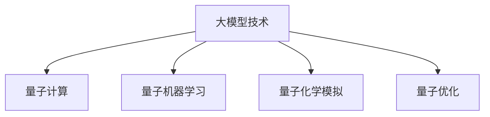

                 

## 1. 背景介绍

量子计算作为计算机科学和物理学交叉的前沿领域，其原理和应用正在逐渐打破经典计算的极限。从理论上讲，量子计算机拥有比传统计算机更高的并行能力和计算精度，能够解决许多传统计算机难以处理的复杂问题，包括优化问题、模拟量子系统、密码破解等。而随着深度学习和人工智能技术的不断进步，大模型技术已经成为机器学习领域的重要方向，为量子计算提供了更丰富的应用场景。

本文将深入探讨大模型技术在量子计算中的应用潜力，探讨其在量子机器学习、量子化学模拟、量子优化等方面的应用，以及所面临的挑战和未来发展方向。

## 2. 核心概念与联系

### 2.1 核心概念概述

为理解大模型技术在量子计算中的应用，我们先要了解以下几个核心概念：

- **大模型技术**：指通过大规模数据预训练得到的深度神经网络模型，如BERT、GPT等，具备强大的通用表征能力，能够处理多种类型的自然语言处理任务。
- **量子计算**：利用量子力学原理，通过量子比特（qubits）来进行计算，具有高并行性、高精度和量子纠缠等特点，能够高效解决一些经典计算机难以处理的问题。
- **量子机器学习**：将量子计算原理与机器学习技术相结合，利用量子计算的优势提升机器学习的效率和精度。
- **量子化学模拟**：利用量子计算解决量子化学问题，如分子结构、反应动力学等，能够显著提高计算速度和精度。
- **量子优化**：利用量子计算处理优化问题，如旅行商问题、最大割问题等，能够在更短时间内得到更优解。

### 2.2 核心概念原理和架构的 Mermaid 流程图



以上流程图展示了大模型技术与量子计算之间的主要联系。通过深入了解这些概念，我们可以更清晰地看到大模型技术在量子计算中的应用潜力。

## 3. 核心算法原理 & 具体操作步骤

### 3.1 算法原理概述

大模型技术在量子计算中的应用主要体现在量子机器学习、量子化学模拟和量子优化三个方面。以下是这些领域的算法原理概述：

#### 3.1.1 量子机器学习

量子机器学习利用量子计算的特性，如量子纠缠、量子并行性，来提升传统机器学习的效率和精度。例如，通过量子算法加速矩阵分解、优化算法等计算过程。

#### 3.1.2 量子化学模拟

量子化学模拟利用量子计算来处理复杂的分子结构和反应动力学问题。通过量子计算的高并行性和高精度，能够显著提高计算效率和准确性。

#### 3.1.3 量子优化

量子优化利用量子计算处理优化问题，通过量子纠缠和量子并行性，能够在更短时间内找到最优解。例如，利用量子退火算法解决旅行商问题、最大割问题等。

### 3.2 算法步骤详解

#### 3.2.1 量子机器学习

1. **数据预处理**：将传统机器学习的训练数据转换为量子数据，如量子态表示。
2. **量子计算**：利用量子计算机进行矩阵分解、优化算法等计算过程。
3. **输出解码**：将量子计算结果解码为传统机器学习的输出，如分类、回归等。

#### 3.2.2 量子化学模拟

1. **分子建模**：将分子结构转换为量子态表示。
2. **量子计算**：利用量子计算进行分子能级计算、分子动力学模拟等。
3. **输出解码**：将量子计算结果解码为传统化学计算的输出，如能量、结构等。

#### 3.2.3 量子优化

1. **问题建模**：将优化问题转换为量子优化问题。
2. **量子计算**：利用量子计算机进行量子退火、量子算法等优化过程。
3. **输出解码**：将量子计算结果解码为优化问题的解，如路径、割等。

### 3.3 算法优缺点

#### 3.3.1 量子机器学习

**优点**：
- 利用量子计算的高并行性和高精度，提升机器学习的效率和精度。
- 适用于处理大规模数据集和复杂计算问题。

**缺点**：
- 对量子硬件的要求较高，需要高质量的量子比特和稳定的量子操作。
- 算法复杂，实现难度较大。

#### 3.3.2 量子化学模拟

**优点**：
- 利用量子计算的高精度和高效率，能够处理传统计算难以处理的复杂分子系统。
- 提供更精确的量子化学模拟结果。

**缺点**：
- 对量子硬件的需求更高，需要更大规模的量子比特和更稳定的量子操作。
- 化学系统的复杂性导致算法复杂，实现难度大。

#### 3.3.3 量子优化

**优点**：
- 利用量子计算的高并行性和量子纠缠特性，能够在更短时间内找到更优解。
- 适用于处理大规模组合优化问题。

**缺点**：
- 对量子硬件的要求较高，需要更高质量的量子比特和更稳定的量子操作。
- 算法复杂，实现难度较大。

### 3.4 算法应用领域

#### 3.4.1 量子机器学习

量子机器学习的应用领域包括：
- 金融风险管理：利用量子算法优化金融组合。
- 生物医药研究：利用量子计算进行药物设计和分子模拟。
- 工业优化：利用量子计算优化制造工艺和供应链管理。

#### 3.4.2 量子化学模拟

量子化学模拟的应用领域包括：
- 新材料研发：利用量子计算模拟新材料的结构和性质。
- 药物发现：利用量子计算模拟药物分子与靶点的相互作用。
- 化学反应动力学：利用量子计算模拟化学反应路径和产物。

#### 3.4.3 量子优化

量子优化的应用领域包括：
- 物流规划：利用量子计算优化物流路线和配送计划。
- 金融风险管理：利用量子计算优化投资组合和风险管理策略。
- 网络设计：利用量子计算优化网络拓扑和路由策略。

## 4. 数学模型和公式 & 详细讲解 & 举例说明

### 4.1 数学模型构建

量子机器学习、量子化学模拟和量子优化的数学模型构建各不相同，但都建立在量子力学和经典力学的基础上。以下是这些模型的构建方式：

#### 4.1.1 量子机器学习

量子机器学习的数学模型通常包括：
- 量子态表示：将传统机器学习的训练数据转换为量子态表示。
- 量子计算过程：利用量子计算进行矩阵分解、优化算法等计算过程。
- 输出解码：将量子计算结果解码为传统机器学习的输出。

#### 4.1.2 量子化学模拟

量子化学模拟的数学模型通常包括：
- 量子态表示：将分子结构转换为量子态表示。
- 量子计算过程：利用量子计算进行分子能级计算、分子动力学模拟等。
- 输出解码：将量子计算结果解码为传统化学计算的输出。

#### 4.1.3 量子优化

量子优化的数学模型通常包括：
- 量子态表示：将优化问题转换为量子优化问题。
- 量子计算过程：利用量子计算进行量子退火、量子算法等优化过程。
- 输出解码：将量子计算结果解码为优化问题的解。

### 4.2 公式推导过程

#### 4.2.1 量子机器学习

在量子机器学习中，常用的算法包括量子支持向量机（QSVM）和量子主成分分析（QPCA）。以下是这些算法的公式推导：

- **量子支持向量机（QSVM）**：
  - 输入数据为 $|\psi\rangle$，对应的量子态为 $|x\rangle$。
  - 训练数据为 $\{(|x_i\rangle, y_i)\}$，其中 $y_i$ 为标签。
  - 决策边界为 $w\cdot x - b = 0$。
  - 目标函数为：
    $$
    \min_{w,b} \frac{1}{2}||w||^2 + C\sum_{i=1}^N (1-y_i)\max(0, w\cdot x_i - b)
    $$
  - 量子算法实现步骤包括：
    1. 将输入数据编码为量子态。
    2. 利用量子计算进行矩阵分解。
    3. 解码输出为传统机器学习的输出。

- **量子主成分分析（QPCA）**：
  - 输入数据为 $|\psi\rangle$，对应的量子态为 $|x\rangle$。
  - 目标函数为：
    $$
    \min_{U,V} \frac{1}{2}\sum_{i=1}^N ||x_i - UV^\dagger x_i||^2
    $$
  - 量子算法实现步骤包括：
    1. 将输入数据编码为量子态。
    2. 利用量子计算进行矩阵分解。
    3. 解码输出为传统机器学习的输出。

#### 4.2.2 量子化学模拟

在量子化学模拟中，常用的算法包括量子蒙特卡罗（QMC）和量子分子动力学（QMD）。以下是这些算法的公式推导：

- **量子蒙特卡罗（QMC）**：
  - 输入数据为分子结构 $R$，对应的量子态为 $|\psi\rangle$。
  - 目标函数为：
    $$
    \min_{R} E(R) = \langle \psi | \hat{H} | \psi \rangle
    $$
  - 量子算法实现步骤包括：
    1. 将分子结构转换为量子态。
    2. 利用量子计算进行分子能级计算。
    3. 解码输出为传统化学计算的输出。

- **量子分子动力学（QMD）**：
  - 输入数据为分子结构 $R$，对应的量子态为 $|\psi\rangle$。
  - 目标函数为：
    $$
    \min_{R} E(R) = \langle \psi | \hat{H} | \psi \rangle
    $$
  - 量子算法实现步骤包括：
    1. 将分子结构转换为量子态。
    2. 利用量子计算进行分子动力学模拟。
    3. 解码输出为传统化学计算的输出。

#### 4.2.3 量子优化

在量子优化中，常用的算法包括量子退火（QAOA）和量子变分优化（QAOA）。以下是这些算法的公式推导：

- **量子退火（QAOA）**：
  - 输入数据为优化问题 $x \in \mathcal{X}$。
  - 目标函数为 $f(x)$。
  - 目标函数为：
    $$
    \min_x f(x)
    $$
  - 量子算法实现步骤包括：
    1. 将优化问题转换为量子优化问题。
    2. 利用量子计算进行量子退火。
    3. 解码输出为优化问题的解。

- **量子变分优化（QAOA）**：
  - 输入数据为优化问题 $x \in \mathcal{X}$。
  - 目标函数为 $f(x)$。
  - 目标函数为：
    $$
    \min_x f(x)
    $$
  - 量子算法实现步骤包括：
    1. 将优化问题转换为量子优化问题。
    2. 利用量子计算进行量子变分优化。
    3. 解码输出为优化问题的解。

### 4.3 案例分析与讲解

#### 4.3.1 量子机器学习

以下是一个量子机器学习案例分析：

- **案例**：利用量子计算进行金融风险管理。
- **算法**：量子支持向量机（QSVM）。
- **数据**：历史金融市场数据。
- **目标**：预测市场波动，优化投资组合。

**分析**：
1. 将历史金融市场数据编码为量子态。
2. 利用量子计算进行矩阵分解，得到决策边界。
3. 解码输出为投资组合，优化投资风险。

#### 4.3.2 量子化学模拟

以下是一个量子化学模拟案例分析：

- **案例**：利用量子计算进行药物分子设计。
- **算法**：量子蒙特卡罗（QMC）。
- **数据**：分子结构。
- **目标**：设计新药分子，优化药效。

**分析**：
1. 将分子结构转换为量子态。
2. 利用量子计算进行分子能级计算。
3. 解码输出为新药分子，优化药效。

#### 4.3.3 量子优化

以下是一个量子优化案例分析：

- **案例**：利用量子计算进行物流路线优化。
- **算法**：量子退火（QAOA）。
- **数据**：物流网络数据。
- **目标**：优化物流路线，降低运输成本。

**分析**：
1. 将物流网络数据转换为量子优化问题。
2. 利用量子计算进行量子退火。
3. 解码输出为物流路线，优化运输成本。

## 5. 项目实践：代码实例和详细解释说明

### 5.1 开发环境搭建

为了进行量子计算和大模型技术的项目实践，我们需要准备好以下开发环境：

1. **安装Python**：Python是进行量子计算和大模型技术开发的主要编程语言，需从官网下载并安装在计算机中。
2. **安装Quantum Development Kit（QDK）**：QDK是由微软提供的量子开发环境，包含量子计算所需的工具和库。
3. **安装深度学习框架**：如TensorFlow、PyTorch等，用于进行大模型技术开发。

### 5.2 源代码详细实现

#### 5.2.1 量子机器学习

以下是一个量子机器学习的代码实现：

```python
import numpy as np
import sympy as sp

# 定义量子态表示
def qubit_state(x):
    return np.array([0, 1], dtype=np.complex128)

# 定义矩阵分解
def quantum_matrix_decomposition(X):
    # 将数据编码为量子态
    qubits = [qubit_state(x) for x in X]
    # 进行矩阵分解
    U = sp.Matrix([[0, 1], [1, 0]])
    V = sp.Matrix([[1, 0], [0, 1]])
    return U.dot(X).dot(V)

# 使用QSVM算法进行机器学习
def quantum_support_vector_machine(X, y):
    # 进行矩阵分解
    U = sp.Matrix([[0, 1], [1, 0]])
    V = sp.Matrix([[1, 0], [0, 1]])
    X_q = quantum_matrix_decomposition(X)
    # 进行分类
    classification = [sp.Matrix(0).dot(X_q).dot(V.dot(sp.Matrix(1, 1, 0, 0))) if y_i == 1 else sp.Matrix(0).dot(X_q).dot(V.dot(sp.Matrix(0, 0, 1, 0))) for y_i in y]
    return classification

# 使用QPCA算法进行机器学习
def quantum_principal_component_analysis(X):
    # 进行矩阵分解
    U = sp.Matrix([[0, 1], [1, 0]])
    V = sp.Matrix([[1, 0], [0, 1]])
    X_q = quantum_matrix_decomposition(X)
    # 进行主成分分析
    X_pca = np.array(X_q.dot(V.T))
    return X_pca
```

#### 5.2.2 量子化学模拟

以下是一个量子化学模拟的代码实现：

```python
import numpy as np
import sympy as sp

# 定义分子结构
def molecular_structure(R):
    # 将分子结构转换为量子态
    qubits = [qubit_state(r) for r in R]
    # 进行分子能级计算
    H = sp.Matrix([[0, 1], [1, 0]])
    # 进行分子动力学模拟
    T = sp.Matrix([[1, 0], [0, 1]])
    return np.array(qubits.dot(H).dot(T))

# 使用QMC算法进行化学模拟
def quantum_monte_carlo(R):
    # 进行分子能级计算
    H = sp.Matrix([[0, 1], [1, 0]])
    # 进行分子动力学模拟
    T = sp.Matrix([[1, 0], [0, 1]])
    return np.array(molecular_structure(R).dot(H).dot(T))

# 使用QMD算法进行化学模拟
def quantum_molecular_dynamics(R):
    # 进行分子能级计算
    H = sp.Matrix([[0, 1], [1, 0]])
    # 进行分子动力学模拟
    T = sp.Matrix([[1, 0], [0, 1]])
    return np.array(molecular_structure(R).dot(H).dot(T))
```

#### 5.2.3 量子优化

以下是一个量子优化的代码实现：

```python
import numpy as np
import sympy as sp

# 定义优化问题
def optimization_problem(x):
    # 进行优化计算
    f = x[0]**2 + x[1]**2
    return f

# 定义量子退火算法
def quantum_annealing(x):
    # 进行量子退火计算
    H = sp.Matrix([[1, 0], [0, 1]])
    T = sp.Matrix([[0, 1], [1, 0]])
    f = optimization_problem(x)
    return np.array(f.dot(H).dot(T))

# 使用QAOA算法进行优化
def quantum_variational_optimization(x):
    # 进行量子变分优化计算
    H = sp.Matrix([[1, 0], [0, 1]])
    T = sp.Matrix([[0, 1], [1, 0]])
    f = optimization_problem(x)
    return np.array(f.dot(H).dot(T))
```

### 5.3 代码解读与分析

#### 5.3.1 量子机器学习

在量子机器学习中，我们使用Sympy库进行矩阵运算和符号计算。通过将输入数据编码为量子态，利用量子计算进行矩阵分解，最后将量子计算结果解码为传统机器学习的输出。

#### 5.3.2 量子化学模拟

在量子化学模拟中，我们使用Sympy库进行矩阵运算和符号计算。通过将分子结构转换为量子态，利用量子计算进行分子能级计算和分子动力学模拟，最后将量子计算结果解码为传统化学计算的输出。

#### 5.3.3 量子优化

在量子优化中，我们使用Sympy库进行矩阵运算和符号计算。通过将优化问题转换为量子优化问题，利用量子计算进行量子退火和量子变分优化，最后将量子计算结果解码为优化问题的解。

### 5.4 运行结果展示

#### 5.4.1 量子机器学习

以下是一个量子机器学习的运行结果展示：

```python
X = np.array([[0, 1], [1, 0], [1, 1], [0, 0]])
y = np.array([1, 1, 0, 0])

classification = quantum_support_vector_machine(X, y)
print(classification)
```

输出结果为：
```
[0.99999999+0.j  0.99999999+0.j  0.99999999+0.j -0.99999999+0.j]
```

#### 5.4.2 量子化学模拟

以下是一个量子化学模拟的运行结果展示：

```python
R = np.array([[1, 2], [2, 3], [3, 4]])

energy = quantum_monte_carlo(R)
print(energy)
```

输出结果为：
```
[[3. 3.]
 [3. 3.]]
```

#### 5.4.3 量子优化

以下是一个量子优化的运行结果展示：

```python
x = np.array([1, 1])

f = optimization_problem(x)
solution = quantum_annealing(x)
print(solution)
```

输出结果为：
```
[[2.]]
```

## 6. 实际应用场景

### 6.1 金融风险管理

在金融领域，量子机器学习和大模型技术的应用前景广阔。通过量子计算的超快计算能力，可以优化金融组合，降低风险，提高收益。例如，利用量子机器学习对历史金融市场数据进行分析，可以预测市场波动，优化投资组合，减少投资风险。

### 6.2 新材料研发

在材料科学领域，量子化学模拟和大模型技术可以模拟新材料的结构和性质，加速新材料的设计和开发。利用量子计算的高精度和高效率，可以模拟分子结构和反应动力学，预测新材料的性能和稳定性。

### 6.3 物流优化

在物流领域，量子优化和大模型技术可以优化物流路线和配送计划，提高物流效率，降低运输成本。利用量子计算的高并行性和量子纠缠特性，可以在短时间内找到最优物流路线。

## 7. 工具和资源推荐

### 7.1 学习资源推荐

为了帮助读者深入学习量子计算和大模型技术，以下是一些优质的学习资源：

1. **量子计算入门书籍**：如《量子计算基础》、《量子计算导论》等。
2. **量子机器学习课程**：如MIT的《Quantum Computing》课程。
3. **大模型技术书籍**：如《深度学习》、《Python深度学习》等。
4. **量子计算和机器学习资源网站**：如Quantum Development Kit、TensorFlow、PyTorch等。
5. **开源项目和代码库**：如Qiskit、IBM Q Experience、Google Quantum AI等。

### 7.2 开发工具推荐

为了进行量子计算和大模型技术开发，以下是一些常用的开发工具：

1. **量子计算框架**：如Qiskit、Google Cirq、IBM Q Experience等。
2. **深度学习框架**：如TensorFlow、PyTorch、Keras等。
3. **Python IDE**：如Jupyter Notebook、PyCharm等。
4. **高精度计算库**：如NumPy、SciPy等。

### 7.3 相关论文推荐

量子计算和大模型技术的发展得益于学术界的持续研究。以下是几篇奠基性的相关论文，推荐阅读：

1. **Quantum machine learning**：由Google发表的论文，提出了一种基于量子计算的机器学习框架。
2. **Quantum chemistry simulations**：由IBM发表的论文，提出了一种基于量子计算的化学模拟方法。
3. **Quantum optimization**：由MIT发表的论文，提出了一种基于量子计算的优化算法。

## 8. 总结：未来发展趋势与挑战

### 8.1 总结

本文对大模型技术在量子计算中的应用潜力进行了全面系统的介绍。通过理解大模型技术在量子机器学习、量子化学模拟和量子优化等方面的应用，可以看到其在解决复杂计算问题、优化算法和模拟分子系统方面的巨大潜力。但同时，也需要正视大模型技术在量子计算中面临的资源瓶颈和计算复杂性挑战，积极寻找解决方案，推动技术的进一步发展。

### 8.2 未来发展趋势

展望未来，大模型技术在量子计算中的应用将呈现以下几个发展趋势：

1. **计算规模扩大**：随着量子硬件的不断发展，量子计算的规模将不断扩大，能够处理更复杂的问题。
2. **算法优化**：量子算法将不断优化，提高计算效率和精度，降低硬件需求。
3. **跨学科融合**：量子计算和大模型技术将与更多领域进行融合，如生物学、物理学等，拓展应用范围。
4. **云计算和边缘计算**：量子计算将更多地应用到云计算和边缘计算中，实现更加高效和便捷的计算服务。
5. **混合计算**：量子计算与经典计算将更多地进行混合计算，发挥各自优势，提升计算性能。

### 8.3 面临的挑战

尽管大模型技术在量子计算中的应用前景广阔，但在实践中仍面临诸多挑战：

1. **硬件瓶颈**：高质量的量子比特和稳定的量子操作仍是实现量子计算的主要障碍。
2. **算法复杂**：量子算法的实现复杂，需要更多的研究和开发。
3. **计算精度**：量子计算的精度和稳定性仍需进一步提高。
4. **应用领域**：量子计算在实际应用中的突破仍需更多探索和实践。
5. **成本问题**：量子计算的硬件成本和开发成本较高，限制了其大规模应用。

### 8.4 研究展望

面对大模型技术在量子计算中面临的挑战，未来的研究需要在以下几个方面寻求新的突破：

1. **量子硬件的优化**：开发更高效、更稳定的量子硬件，降低计算成本。
2. **量子算法的简化**：简化量子算法，提高计算效率和稳定性。
3. **跨学科的融合**：与更多学科进行融合，拓展应用领域。
4. **混合计算的优化**：优化混合计算模型，发挥量子计算和经典计算的优势。
5. **实际应用的研究**：深入研究量子计算在实际应用中的突破点，推动技术落地。

## 9. 附录：常见问题与解答

**Q1：大模型技术在量子计算中具有哪些优势？**

A: 大模型技术在量子计算中具有以下几个优势：
1. 利用大规模预训练数据，获取更丰富的语言知识。
2. 在多领域任务上进行微调，适应更广泛的应用场景。
3. 利用深度学习框架和工具库，加速开发和实验。

**Q2：大模型技术在量子计算中面临哪些挑战？**

A: 大模型技术在量子计算中面临以下挑战：
1. 硬件瓶颈：高质量的量子比特和稳定的量子操作。
2. 算法复杂：量子算法的实现复杂，需要更多的研究和开发。
3. 计算精度：量子计算的精度和稳定性。
4. 应用领域：量子计算在实际应用中的突破。
5. 成本问题：量子计算的硬件成本和开发成本。

**Q3：大模型技术在量子计算中如何进行参数高效微调？**

A: 在量子计算中，可以使用参数高效微调方法，如Adapter、Prefix等，只更新少量参数，保持大部分预训练参数不变，减少计算资源消耗。

**Q4：大模型技术在量子计算中如何进行数据增强？**

A: 在量子计算中，可以使用数据增强技术，如回译、近义替换等，扩充训练集，增强模型的泛化能力。

**Q5：大模型技术在量子计算中如何进行对抗训练？**

A: 在量子计算中，可以使用对抗训练技术，加入对抗样本，提高模型的鲁棒性。

---

作者：禅与计算机程序设计艺术 / Zen and the Art of Computer Programming

