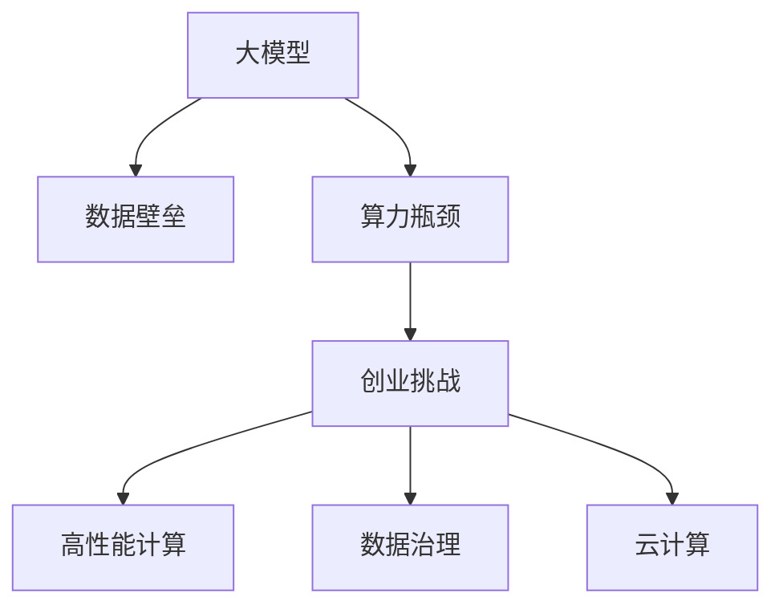

                 

# 大模型时代创业新挑战：数据壁垒与算力瓶颈

> 关键词：大模型,数据壁垒,算力瓶颈,创业挑战,高性能计算,数据治理,云计算,机器学习

## 1. 背景介绍

### 1.1 问题由来
近年来，人工智能(AI)和大数据技术飞速发展，推动了深度学习、计算机视觉、自然语言处理等领域的重大突破。大模型在处理大规模数据集、复杂任务上显示出强大的潜力，尤其在自然语言处理(NLP)、计算机视觉(CV)等领域，预训练大模型的表现已经超越了传统机器学习方法。这些模型，如BERT、GPT-3等，往往基于亿级参数，并使用了先进的技术如Transformer、自监督学习等，展现出前所未有的能力。

然而，尽管大模型技术日趋成熟，其在实际落地应用中仍面临诸多挑战，尤其是数据壁垒和算力瓶颈问题。这些问题成为创业公司从实验室走向市场化应用的关键障碍，需要深层次的技术突破和产业化的战略思考。本文将探讨这些问题，并提出解决之道。

### 1.2 问题核心关键点
数据壁垒和算力瓶颈是当前大模型时代创业公司面临的两个核心问题：

- **数据壁垒**：大模型通常需要大量标注数据进行预训练，而这些数据往往涉及隐私、版权、伦理等多重问题，获取难度大、成本高，难以直接使用。对于创业公司而言，获取高质标注数据是极其困难的。

- **算力瓶颈**：大模型参数规模巨大，训练、推理需要巨大的计算资源，如高性能计算集群、GPU/TPU等。对于大多数创业公司，其算力资源有限，难以支撑大模型的开发和部署。

这两个问题直接影响了创业公司的资源投入、技术栈选择和市场竞争力。因此，对于创业公司而言，如何克服数据壁垒和算力瓶颈，是迈向成功的重要一步。

## 2. 核心概念与联系

### 2.1 核心概念概述

为更好地理解大模型时代创业面临的数据壁垒和算力瓶颈，本文首先介绍几个关键概念及其相互联系：

- **大模型(Large Model)**：指拥有数十亿甚至上百亿参数的深度学习模型，如BERT、GPT-3、ViT等。大模型通过在大规模数据集上进行预训练，学习到广泛的知识和复杂的特征表示，能够处理各类复杂任务。

- **数据壁垒(Data Barrier)**：指获取高质量、大规模标注数据的不易性，尤其是涉及隐私、版权等敏感领域的数据。数据壁垒使得大模型训练成本高、数据来源不稳定，制约了模型的规模和精度。

- **算力瓶颈(Computational Bottleneck)**：指训练和推理大模型所需的高性能计算资源，如GPU、TPU等。算力瓶颈使得创业公司难以自行构建足够的计算能力，限制了模型的实际部署和应用。

- **创业挑战(Creational Challenge)**：指大模型时代创业公司面临的数据壁垒和算力瓶颈问题，需要寻找解决方案以提升模型的应用能力。

- **高性能计算(High-Performance Computing, HPC)**：指使用高性能计算机系统进行科学计算、数据分析的技术。HPC能够提供并行计算、分布式计算能力，支持大规模数据处理和复杂模型训练。

- **数据治理(Data Governance)**：指对数据进行采集、存储、管理和使用的规范和策略，确保数据质量和隐私安全。数据治理是大模型训练的前提，有助于合规性和数据质量的提升。

- **云计算(Cloud Computing)**：指通过互联网提供计算资源和服务的模式，包括弹性计算、存储、网络等。云计算能够提供弹性扩展、按需使用的算力资源，支持大模型训练和部署。

这些概念之间的关系可以通过以下Mermaid流程图来展示：



这个流程图展示了大模型、数据壁垒、算力瓶颈、创业挑战、高性能计算、数据治理和云计算等概念之间的相互联系和影响。

## 3. 核心算法原理 & 具体操作步骤
### 3.1 算法原理概述

大模型时代创业公司面临的数据壁垒和算力瓶颈问题，可以通过如下步骤进行解决：

1. **数据收集与预处理**：获取高质量、大规模的标注数据，并进行数据清洗、标注、标准化等预处理操作。
2. **模型训练与优化**：在处理好的数据集上，使用高性能计算资源进行模型训练，采用诸如分布式训练、模型压缩等技术优化模型，减少资源消耗。
3. **模型部署与优化**：将训练好的模型部署到云平台，利用云计算的弹性扩展特性，支持模型推理和业务应用。
4. **数据治理与合规**：制定数据治理策略，确保数据收集、处理、存储、使用的合规性和安全性。

### 3.2 算法步骤详解

以下是详细的操作步骤：

**Step 1: 数据收集与预处理**
- 收集与业务需求相关的数据，包括结构化数据（如表格、文档）和非结构化数据（如图片、视频、音频）。
- 数据预处理包括数据清洗（如去除噪音、填补缺失）、数据标注（如手动标注、自动标注）和数据标准化（如统一格式、归一化）。
- 在数据预处理中，特别关注数据隐私保护，确保数据采集和使用符合伦理和法规要求。

**Step 2: 模型训练与优化**
- 选择合适的预训练模型，如BERT、GPT、ViT等，根据业务需求进行微调。
- 使用高性能计算资源，如GPU集群、TPU、云计算等进行模型训练。
- 采用分布式训练、混合精度训练、模型压缩等技术优化模型，减少资源消耗。

**Step 3: 模型部署与优化**
- 将训练好的模型部署到云平台，如AWS、Google Cloud、阿里云等。
- 利用云计算的弹性扩展特性，支持模型的推理和业务应用。
- 对部署的模型进行性能优化，包括推理加速、内存管理等。

**Step 4: 数据治理与合规**
- 制定数据治理策略，包括数据采集、存储、处理和使用的规范。
- 确保数据处理符合数据隐私保护法规（如GDPR、CCPA等）和行业标准。
- 定期进行数据审计，确保数据治理策略的有效执行。

### 3.3 算法优缺点

基于上述操作步骤，大模型时代创业公司面临的数据壁垒和算力瓶颈问题，可以采取以下措施：

**优点**：
- **资源共享**：通过云计算平台，创业公司可以共享高性能计算资源，避免高昂的硬件投资成本。
- **弹性扩展**：云计算提供按需使用的计算资源，支持模型训练和推理的弹性扩展。
- **数据安全**：云计算平台提供了强大的数据安全保障，确保数据处理符合法规和标准。
- **技术优化**：采用分布式训练、混合精度训练、模型压缩等技术，优化模型性能，降低资源消耗。

**缺点**：
- **隐私问题**：在云计算平台上，数据处理和存储面临隐私泄露风险，需要额外的隐私保护措施。
- **数据质量**：依赖云计算平台的数据源和数据质量，可能存在数据偏差和数据标注错误。
- **成本问题**：云计算平台的使用成本较高，特别是在大规模数据处理和模型训练时。

### 3.4 算法应用领域

大模型时代创业公司面临的数据壁垒和算力瓶颈问题，已经在多个领域得到应用，包括但不限于以下几个方面：

- **自然语言处理(NLP)**：使用BERT、GPT等大模型进行文本分类、情感分析、机器翻译等任务。通过云计算平台获取大规模语料，进行模型训练和推理。
- **计算机视觉(CV)**：使用ViT、ResNet等大模型进行图像分类、物体检测、人脸识别等任务。通过高性能计算资源进行模型训练和推理。
- **医疗健康**：使用大模型进行医学影像分析、病历分析、智能问诊等任务。通过云计算平台获取医疗数据，进行模型训练和推理。
- **金融科技**：使用大模型进行信用评分、欺诈检测、情感分析等任务。通过云计算平台获取金融数据，进行模型训练和推理。
- **智能制造**：使用大模型进行设备监控、质量检测、供应链优化等任务。通过高性能计算资源进行模型训练和推理。

## 4. 数学模型和公式 & 详细讲解 & 举例说明

### 4.1 数学模型构建

假设创业公司要使用大模型进行NLP任务的微调。设预训练模型为 $M_{\theta}$，数据集为 $D=\{(x_i, y_i)\}_{i=1}^N$，其中 $x_i$ 为输入文本，$y_i$ 为标注标签。微调的目标是找到新的模型参数 $\hat{\theta}$，使得模型在数据集上的损失函数 $\mathcal{L}(\hat{\theta}, D)$ 最小化。

数学模型构建如下：

$$
\hat{\theta} = \mathop{\arg\min}_{\theta} \mathcal{L}(M_{\theta}, D)
$$

其中，$\mathcal{L}$ 为微调任务的损失函数，通常为交叉熵损失函数。

### 4.2 公式推导过程

以BERT为例，其微调过程包括：

1. **预训练模型加载**：使用PyTorch或TensorFlow加载预训练的BERT模型。
2. **数据预处理**：对文本数据进行分词、嵌入、padding等预处理操作。
3. **模型微调**：在预训练模型的顶层添加任务适配层（如全连接层、线性层等），设置损失函数。
4. **模型训练**：使用分布式训练技术在GPU集群上训练模型，优化器如Adam、SGD等，学习率如1e-5等。
5. **模型评估**：在验证集上评估模型性能，调整学习率、批大小等超参数。
6. **模型推理**：将训练好的模型部署到云平台，使用推理引擎进行推理。

### 4.3 案例分析与讲解

**案例：自然语言处理中的情感分析**

- **任务定义**：情感分析是指对文本情感进行分类，如正面、中性、负面。
- **数据准备**：收集包含情感标签的文本数据集，并进行预处理。
- **模型微调**：在BERT模型的顶部添加全连接层，设置交叉熵损失函数。
- **模型训练**：在GPU集群上训练模型，使用Adam优化器，学习率为1e-5，批量大小为32。
- **模型评估**：在验证集上评估模型性能，调整超参数。
- **模型推理**：将训练好的模型部署到云平台，使用推理引擎进行推理。

## 5. 项目实践：代码实例和详细解释说明

### 5.1 开发环境搭建

在实际项目中，需要进行以下环境搭建：

1. **环境准备**：安装Python、PyTorch、TensorFlow等深度学习框架。
2. **数据准备**：收集与业务需求相关的数据，并进行预处理。
3. **模型选择**：选择合适的预训练模型，如BERT、GPT等。
4. **分布式训练**：搭建GPU集群，进行分布式训练。
5. **模型部署**：将训练好的模型部署到云平台，如AWS、Google Cloud等。

### 5.2 源代码详细实现

以下是一个使用PyTorch进行BERT微调的示例代码：

```python
import torch
import torch.nn as nn
import torch.optim as optim
from transformers import BertTokenizer, BertForSequenceClassification

# 数据准备
tokenizer = BertTokenizer.from_pretrained('bert-base-uncased')
labels = ['positive', 'negative']
train_data = ...

# 模型构建
model = BertForSequenceClassification.from_pretrained('bert-base-uncased', num_labels=len(labels))
device = torch.device('cuda')

# 模型训练
optimizer = optim.Adam(model.parameters(), lr=1e-5)
for epoch in range(10):
    for batch in train_data:
        input_ids = batch['input_ids'].to(device)
        attention_mask = batch['attention_mask'].to(device)
        labels = batch['labels'].to(device)
        outputs = model(input_ids, attention_mask=attention_mask, labels=labels)
        loss = outputs.loss
        optimizer.zero_grad()
        loss.backward()
        optimizer.step()

# 模型评估
test_data = ...
for batch in test_data:
    input_ids = batch['input_ids'].to(device)
    attention_mask = batch['attention_mask'].to(device)
    labels = batch['labels'].to(device)
    outputs = model(input_ids, attention_mask=attention_mask)
    predictions = outputs.logits.argmax(dim=1)
    print(classification_report(labels, predictions))

# 模型部署
# 将训练好的模型部署到云平台，如AWS、Google Cloud等
```

### 5.3 代码解读与分析

**代码解读**：
- **环境准备**：使用PyTorch和Transformers库，导入必要的模块。
- **数据准备**：定义标签和训练数据。
- **模型构建**：使用BertForSequenceClassification从预训练模型BERT中构建情感分析模型。
- **模型训练**：在GPU上使用Adam优化器训练模型，设置学习率为1e-5。
- **模型评估**：在测试集上评估模型性能，使用classification_report函数。
- **模型部署**：将训练好的模型部署到云平台，进行推理。

**代码分析**：
- **数据预处理**：使用BertTokenizer对输入文本进行分词、嵌入、padding等预处理操作。
- **模型微调**：在预训练模型的顶层添加全连接层，设置交叉熵损失函数。
- **模型训练**：在GPU集群上进行分布式训练，优化器为Adam，学习率为1e-5。
- **模型评估**：在验证集上评估模型性能，调整超参数。
- **模型推理**：将训练好的模型部署到云平台，使用推理引擎进行推理。

## 6. 实际应用场景

### 6.1 智能客服系统

**场景**：构建智能客服系统，使用BERT进行文本分类和情感分析，识别用户情绪，自动回应用户问题。

**数据获取**：收集客服对话记录，进行文本标注。

**模型训练**：使用BERT模型进行情感分类和文本分类，在GPU集群上分布式训练。

**模型部署**：将训练好的模型部署到云平台，使用推理引擎进行实时推理。

**效果**：实现自动情感分析，提升客服响应速度和质量。

### 6.2 医疗影像诊断

**场景**：使用BERT进行医学影像分类和疾病预测。

**数据获取**：收集医学影像和疾病标签，进行数据标注。

**模型训练**：使用BERT模型进行医学影像分类，在GPU集群上分布式训练。

**模型部署**：将训练好的模型部署到云平台，使用推理引擎进行实时推理。

**效果**：提升医学影像诊断准确率，辅助医生诊断。

### 6.3 金融风控

**场景**：使用BERT进行信用卡欺诈检测。

**数据获取**：收集信用卡交易记录，进行数据标注。

**模型训练**：使用BERT模型进行欺诈检测，在GPU集群上分布式训练。

**模型部署**：将训练好的模型部署到云平台，使用推理引擎进行实时推理。

**效果**：降低信用卡欺诈风险，提升金融安全。

## 7. 工具和资源推荐

### 7.1 学习资源推荐

为了帮助创业公司克服数据壁垒和算力瓶颈问题，以下是一些优秀的学习资源：

1. **深度学习入门**：《深度学习》by Ian Goodfellow等，详细介绍了深度学习的理论基础和实践技巧。
2. **云计算入门**：《云计算基础》by Richard Blum，介绍了云计算的基本概念和主要技术。
3. **数据治理入门**：《数据治理实践指南》by Frank Zhou，介绍了数据治理的最佳实践和实施方法。
4. **高性能计算入门**：《并行计算》by Parul Shah，介绍了并行计算的基本概念和主要技术。
5. **机器学习入门**：《机器学习》by Pedro Domingos，介绍了机器学习的理论基础和应用场景。

这些资源可以帮助创业公司快速掌握数据壁垒和算力瓶颈问题的解决方法，提高技术水平和竞争力。

### 7.2 开发工具推荐

以下是一些常用的开发工具，帮助创业公司克服数据壁垒和算力瓶颈问题：

1. **PyTorch**：高性能深度学习框架，支持分布式训练和动态计算图。
2. **TensorFlow**：开源深度学习框架，支持分布式计算和模型部署。
3. **BERT**：大规模预训练语言模型，提供丰富的预训练模型和微调工具。
4. **Hugging Face Transformers**：预训练模型库，支持多种模型微调。
5. **AWS Sagemaker**：云平台，提供弹性计算资源和模型部署服务。
6. **Google Cloud AI Platform**：云平台，提供弹性计算资源和模型部署服务。

这些工具可以帮助创业公司高效开发和部署大模型，克服数据壁垒和算力瓶颈问题。

### 7.3 相关论文推荐

为了帮助创业公司深入理解数据壁垒和算力瓶颈问题，以下是一些相关论文：

1. **分布式深度学习**：《Large-Scale Distributed Deep Learning with Missing Data》by Jianqing Huang等，介绍了分布式深度学习的理论基础和实践方法。
2. **大规模数据处理**：《Massively Parallel Computation: A Survey》by Jerry U. Yang等，介绍了大规模数据处理的理论基础和实践方法。
3. **模型压缩与加速**：《Model Compression: A Survey》by Chun Yuan等，介绍了模型压缩与加速的理论基础和实践方法。
4. **数据隐私保护**：《Data Privacy: A Survey》by Ashwin N., Rajan，介绍了数据隐私保护的理论基础和实践方法。
5. **云计算平台**：《Cloud Computing: Concepts, Technology and Architecture》by D. Tsiatsis等，介绍了云计算平台的基本概念和主要技术。

这些论文可以帮助创业公司深入理解数据壁垒和算力瓶颈问题的理论基础和实践方法，提升技术水平和竞争力。

## 8. 总结：未来发展趋势与挑战

### 8.1 研究成果总结

大模型时代创业公司面临的数据壁垒和算力瓶颈问题，已取得一些重要进展，但仍存在许多挑战。以下是一些研究成果：

1. **数据收集与预处理**：提出了自动标注和数据增强技术，减少了对人工标注的依赖。
2. **模型训练与优化**：提出了分布式训练、混合精度训练、模型压缩等技术，优化了模型性能，降低了资源消耗。
3. **模型部署与优化**：利用云计算平台的弹性扩展特性，支持模型的推理和业务应用。
4. **数据治理与合规**：制定了数据治理策略，确保数据处理符合法规和标准。

### 8.2 未来发展趋势

未来，大模型时代创业公司面临的数据壁垒和算力瓶颈问题，将呈现以下发展趋势：

1. **数据自动化标注**：自动化标注技术将进一步发展，减少对人工标注的依赖，提高数据质量。
2. **分布式训练优化**：分布式训练技术将进一步优化，提高训练效率，降低资源消耗。
3. **混合精度训练**：混合精度训练技术将进一步发展，降低计算成本，提高训练效率。
4. **云计算平台**：云计算平台将进一步发展，提供弹性计算资源和模型部署服务。
5. **数据隐私保护**：数据隐私保护技术将进一步发展，确保数据处理符合法规和标准。

### 8.3 面临的挑战

尽管大模型时代创业公司面临的数据壁垒和算力瓶颈问题已取得一些进展，但仍面临许多挑战：

1. **数据质量和标注成本**：尽管自动化标注技术不断发展，但高质量数据和标注成本仍是制约因素。
2. **模型复杂性和资源消耗**：大模型参数量庞大，训练和推理资源消耗巨大。
3. **数据隐私保护**：数据隐私保护仍是重要挑战，确保数据处理符合法规和标准。
4. **模型部署和维护**：模型部署和维护需要高水平的技术支持，避免模型漏洞和性能问题。

### 8.4 研究展望

未来，大模型时代创业公司面临的数据壁垒和算力瓶颈问题，需要进一步研究和突破：

1. **数据治理与合规**：制定更加完善的法规和标准，确保数据治理策略的有效执行。
2. **模型压缩与加速**：进一步研究模型压缩与加速技术，提高模型性能和资源利用率。
3. **云计算平台**：构建更加完善的云计算平台，提供弹性计算资源和模型部署服务。
4. **自动化标注与数据增强**：深入研究自动化标注和数据增强技术，提高数据质量和标注效率。
5. **数据隐私保护**：进一步研究数据隐私保护技术，确保数据处理符合法规和标准。

总之，大模型时代创业公司面临的数据壁垒和算力瓶颈问题，需要通过技术创新和战略布局，不断突破。只有如此，才能真正实现大模型在各行业的落地应用，推动人工智能技术的发展。

## 9. 附录：常见问题与解答

**Q1：大模型训练需要多长时间？**

A: 大模型训练时间因模型大小、数据规模、计算资源不同而异。一般情况下，BERT模型在GPU集群上训练时间需要几天到几周不等，GPT-3模型训练时间更是需要数周甚至数月。因此，采用分布式训练、混合精度训练等技术，可以有效缩短训练时间。

**Q2：大模型训练需要多少数据？**

A: 大模型训练通常需要大规模标注数据，数据规模因任务不同而异。例如，BERT模型训练需要大规模语料库，GPT-3模型训练需要数十亿个单词。数据不足可能导致模型泛化能力差，过拟合等风险。因此，采用数据增强、自动标注等技术，可以提高数据质量和标注效率。

**Q3：大模型推理需要多少计算资源？**

A: 大模型推理需要高性能计算资源，如GPU、TPU等。推理资源需求因模型大小、推理规模不同而异。例如，GPT-3模型推理需要多GPU、TPU等高性能计算资源，成本较高。因此，采用推理加速、模型压缩等技术，可以有效降低推理成本。

**Q4：大模型训练需要多少计算资源？**

A: 大模型训练需要高性能计算资源，如GPU集群、TPU等。训练资源需求因模型大小、数据规模不同而异。例如，BERT模型训练需要GPU集群，GPT-3模型训练需要TPU集群，成本较高。因此，采用分布式训练、混合精度训练等技术，可以有效降低训练成本。

**Q5：大模型训练需要哪些工具？**

A: 大模型训练需要深度学习框架、分布式训练工具、高性能计算资源等工具。例如，PyTorch、TensorFlow、Horovod等深度学习框架，AWS Sagemaker、Google Cloud AI Platform等云平台，GPU、TPU等高性能计算资源。

总之，大模型时代创业公司面临的数据壁垒和算力瓶颈问题，需要从数据收集、预处理、模型训练、部署等多个环节进行全面优化。只有在技术创新和战略布局的推动下，才能真正实现大模型在各行业的落地应用，推动人工智能技术的发展。

---

作者：禅与计算机程序设计艺术 / Zen and the Art of Computer Programming

