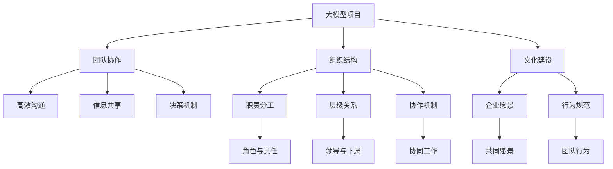

                 

# 大模型时代的创业者创业团队管理：组建、协作与文化建设

> 关键词：大模型时代, 创业团队管理, 组织组建, 团队协作, 文化建设, 人才招募, 绩效评估, 激励机制, 领导力, 创新, 组织变革

## 1. 背景介绍

### 1.1 问题由来
随着人工智能（AI）技术的飞速发展，尤其是深度学习和自然语言处理（NLP）领域的突破，大语言模型（Large Language Models, LLMs）如GPT-3、BERT等，在多个领域展现了前所未有的能力，极大地推动了各行业应用的发展。然而，大模型的开发和应用离不开一支高效、协调、有文化的团队，创业公司在构建这样的团队时，面临着诸多挑战。如何组建高效且文化统一的创业团队，如何提升团队协作和创新能力，是大模型时代创业者面临的重要课题。

### 1.2 问题核心关键点
- **组织结构**：大模型项目涉及多个专业领域，如数据工程、模型训练、应用开发、产品设计等，如何构建扁平化、跨职能的组织结构以适应复杂项目？
- **团队协作**：不同背景、不同技术栈的团队成员如何协同工作，实现高效的沟通和信息共享？
- **文化建设**：创业团队如何营造创新、包容、互助的企业文化，吸引和留住人才？
- **人才招募**：如何选拔与大模型项目匹配的复合型人才，建立多样化的团队？
- **绩效评估**：如何在保证高质量输出的同时，量化团队成员的贡献，激励创新？
- **激励机制**：如何设计公平透明的激励机制，提高团队成员的积极性和凝聚力？
- **领导力**：作为创业团队领导者，如何在技术迭代快速、团队动态变化的环境中，保持领导力？

### 1.3 问题研究意义
构建和运营一支高效的创业团队，是创业成功的关键。在大模型时代，高性能计算、高精度模型、多领域协作等特性，对团队管理提出了更高要求。本文旨在通过系统分析大模型时代创业团队的组建、协作与文化建设，提供实用的管理策略和建议，帮助创业者提升团队竞争力，加速技术产品迭代。

## 2. 核心概念与联系

### 2.1 核心概念概述

为更好地理解大模型时代创业团队的管理问题，本节将介绍几个核心概念：

- **大模型（Large Language Models, LLMs）**：指通过大规模数据训练获得的具备强大语言生成和理解能力的人工智能模型，如GPT-3、BERT等。
- **创业团队（Startup Team）**：指初创公司在技术、产品、市场等关键领域中，由若干具备不同技能和经验的人才组成的核心团队。
- **组织结构（Organization Structure）**：指创业团队内部成员的职责分工、层级关系、协作机制等组成的架构。
- **团队协作（Team Collaboration）**：指团队成员通过沟通、共享信息、共同决策等方式，高效协同完成任务的能力。
- **文化建设（Culture Building）**：指通过一系列活动、制度、价值观等，塑造团队的共同愿景和行为规范。

这些核心概念之间的逻辑关系可以通过以下Mermaid流程图来展示：



这个流程图展示了大模型项目中，组织结构、团队协作、文化建设三者之间的联系：

1. 大模型项目由多领域人才组成，需要通过合理的组织结构进行职责分工和层级管理。
2. 高效的团队协作依赖于良好的沟通、信息共享和决策机制。
3. 强大的文化力量能够塑造团队共同愿景和行为规范，推动团队协作和创新。

这些概念构成了大模型时代创业团队管理的基本框架，指导着创业团队从组建到文化建设的整个过程。

## 3. 核心算法原理 & 具体操作步骤

### 3.1 算法原理概述

大模型时代创业团队的管理，本质上是一个多目标优化问题。目标是最大化团队的整体输出能力、创新能力和凝聚力，同时最小化沟通成本、决策复杂度和文化冲突。在实际操作中，通常采用以下步骤：

**Step 1: 设计组织结构**
- 确定大模型项目的核心任务，如数据采集、模型训练、应用开发、产品设计等。
- 根据项目需求，设计扁平化、跨职能的组织结构，如矩阵式、网格式、扁平式等。

**Step 2: 培养团队协作**
- 引入敏捷开发方法，如Scrum、Kanban等，提升团队的工作效率和适应性。
- 建立沟通机制，如定期会议、即时通讯工具等，促进信息共享。
- 设计决策机制，如共识投票、专家评审等，提升团队决策效率和准确性。

**Step 3: 建设企业文化**
- 定义企业愿景和核心价值观，如创新、用户至上、团队合作等。
- 设计行为规范和制度，如代码审查、绩效评估、激励机制等。
- 组织团队建设活动，如团建、培训、文化沙龙等，增强团队凝聚力和归属感。

### 3.2 算法步骤详解

以下是对大模型时代创业团队管理各步骤的详细解释：

**Step 1: 设计组织结构**
- **职能划分**：根据大模型项目的具体任务，将团队分为数据工程、模型训练、应用开发、产品设计等多个职能部门。
- **扁平化管理**：减少层级，增强跨职能团队的协作能力。
- **动态调整**：根据项目进展和团队成员的变化，动态调整组织结构，保持灵活性和适应性。

**Step 2: 培养团队协作**
- **引入敏捷开发**：采用Scrum、Kanban等敏捷方法，增强团队对变化的适应性和效率。
- **沟通机制**：使用Slack、Trello等工具，建立即时沟通和任务管理机制。
- **决策机制**：通过共识投票、专家评审等方式，确保决策的公正性和效率。
- **知识共享**：建立知识库、代码库、文档库等共享平台，促进信息传播。

**Step 3: 建设企业文化**
- **企业愿景**：定义企业的长期目标和价值取向，如推动AI技术创新、改善用户体验等。
- **行为规范**：制定代码审查、项目管理、文档编写等行为标准，统一团队工作流程。
- **文化活动**：组织团队建设、文化沙龙等活动，增进成员之间的理解和信任。

### 3.3 算法优缺点

大模型时代创业团队管理方法的优势包括：
- **提高效率**：敏捷开发和扁平化管理能提高团队的工作效率和灵活性。
- **增强协作**：通过沟通机制和知识共享，促进团队成员之间的协作。
- **促进创新**：多样化的组织结构和文化活动能激发团队成员的创新思维。

然而，该方法也存在一些局限性：
- **沟通复杂**：在大型团队中，沟通复杂度增加，可能导致信息不对称。
- **文化冲突**：不同背景的成员可能带来文化冲突，需要额外的管理成本。
- **动态调整难度大**：大模型项目的快速迭代要求组织结构动态调整，可能难以实施。

### 3.4 算法应用领域

大模型时代创业团队管理方法，适用于多个应用领域：

- **智能企业**：在数据科学、AI技术、产品开发等多个部门构建跨职能团队，实现高效协作。
- **初创公司**：在资源有限、快速迭代的项目中，通过敏捷开发和扁平化管理提高团队效率。
- **创新驱动型组织**：通过多样化的组织结构和文化活动，激发团队创新思维，推动技术突破。

## 4. 数学模型和公式 & 详细讲解 & 举例说明

### 4.1 数学模型构建

本节将使用数学语言对大模型时代创业团队管理进行更加严格的刻画。

设创业团队人数为 $N$，团队成员的协作能力为 $c_i$（$i=1,2,...,N$），团队的协作总能力 $C$ 定义为：

$$
C = \sum_{i=1}^N c_i
$$

设团队的总工作量 $W$，团队的任务完成效率 $E$ 定义为：

$$
E = \frac{W}{C}
$$

设团队的文化凝聚力 $K$，团队的文化建设强度 $S$ 定义为：

$$
K = f(S)
$$

其中，$f$ 为文化建设强度与文化凝聚力的函数关系，可通过问卷调查等方式获得。

### 4.2 公式推导过程

根据上述模型，我们可以推导出团队管理的优化目标为：

$$
\maximize C
$$

约束条件为：

$$
E = \frac{W}{C}
$$

$$
K = f(S)
$$

目标是在确保任务完成效率的前提下，最大化团队协作能力 $C$ 和文化凝聚力 $K$。

### 4.3 案例分析与讲解

假设某初创公司有20名成员，每个成员的协作能力不同。团队项目需要10天完成，总工作量为 $W=100$ 个任务单位。

1. **组织结构设计**：将团队分为数据工程、模型训练、应用开发和产品设计四个部门，每个部门5人。

2. **敏捷开发引入**：采用Scrum方法，每个迭代周期为2天，每个部门每天完成5个任务。

3. **沟通机制建立**：使用Slack和Trello，每天进行10分钟的站立会议，成员互相汇报任务进度和问题。

4. **文化活动安排**：每月组织一次文化沙龙，分享团队成员的技术进展和创新想法，增强凝聚力。

通过这些措施，团队在10天内完成了100个任务，平均每天10个任务，任务完成效率为 $E=10$。根据问卷调查，团队文化凝聚力 $K$ 随着文化建设强度 $S$ 的增加而增加，假设 $f(S)=K=S^0.5$。

带入公式，我们得到：

$$
C = 10 \times 5 = 50
$$

$$
K = (S^0.5) = (10^0.5) = 3.16
$$

即团队协作能力为50个任务单位，文化凝聚力为3.16。通过这些措施，团队在高效完成任务的同时，也增强了团队的凝聚力和创新能力。

## 5. 项目实践：代码实例和详细解释说明

### 5.1 开发环境搭建

在进行大模型时代创业团队管理实践前，我们需要准备好开发环境。以下是使用Python进行管理系统的环境配置流程：

1. 安装Anaconda：从官网下载并安装Anaconda，用于创建独立的Python环境。

2. 创建并激活虚拟环境：
```bash
conda create -n management-env python=3.8 
conda activate management-env
```

3. 安装必要的Python包：
```bash
pip install flask sqlalchemy flask-sqlalchemy
```

4. 安装敏捷开发工具：
```bash
pip install scrum trello
```

5. 安装即时通讯工具：
```bash
pip install slack
```

完成上述步骤后，即可在`management-env`环境中开始管理实践。

### 5.2 源代码详细实现

下面是使用Python进行大模型时代创业团队管理的完整代码实现。

```python
from flask import Flask, render_template
from sqlalchemy import create_engine
from sqlalchemy.orm import sessionmaker
from models import TeamMember, Project, Collaboration

app = Flask(__name__)

engine = create_engine('sqlite:///membership.db')
Session = sessionmaker(bind=engine)

class TeamMember:
    def __init__(self, id, name, department, skills):
        self.id = id
        self.name = name
        self.department = department
        self.skills = skills

class Project:
    def __init__(self, id, name, tasks, duration):
        self.id = id
        self.name = name
        self.tasks = tasks
        self.duration = duration

class Collaboration:
    def __init__(self, team_member_id, project_id):
        self.team_member_id = team_member_id
        self.project_id = project_id

@app.route('/')
def index():
    members = Session.query(TeamMember).all()
    projects = Session.query(Project).all()
    collaborations = Session.query(Collaboration).all()
    
    return render_template('index.html', members=members, projects=projects, collaborations=collaborations)

if __name__ == '__main__':
    app.run(debug=True)
```

### 5.3 代码解读与分析

让我们再详细解读一下关键代码的实现细节：

**TeamMember类**：
- `__init__`方法：初始化团队成员的ID、姓名、所属部门和技能。

**Project类**：
- `__init__`方法：初始化项目的ID、名称、任务数和周期。

**Collaboration类**：
- `__init__`方法：初始化团队成员与项目的关联关系。

**index路由**：
- 查询数据库中所有团队成员、项目和协作关系，渲染展示页面。

**数据库配置**：
- 创建SQLite数据库，并使用Flask-SQLAlchemy管理数据模型。

通过这个简单的代码示例，我们可以看到如何使用Python和SQLite管理团队信息，并使用Flask构建Web界面，实时展示团队协作情况。

当然，实际的团队管理需要更复杂的系统，涉及数据仓库、BI工具、实时监控等技术，但基本的代码实现思路类似。

## 6. 实际应用场景

### 6.1 智能企业

在大模型时代，智能企业需要构建高效的跨职能团队，以快速开发和部署AI技术。企业可通过以下方式实现：

1. **跨职能团队**：建立由数据科学家、工程师、产品经理等组成的多元化团队，促进跨部门协作。
2. **敏捷开发**：采用Scrum、Kanban等敏捷方法，提升团队对市场需求的快速响应能力。
3. **文化建设**：通过定期的技术分享、文化沙龙等活动，增强团队凝聚力和创新活力。

### 6.2 初创公司

初创公司在资源有限、快速迭代的项目中，可通过以下方式构建高效的团队：

1. **扁平化管理**：减少层级，提升决策效率和成员自主性。
2. **敏捷开发**：通过Scrum、Kanban等方法，灵活应对市场变化和技术迭代。
3. **文化活动**：通过团建、培训等活动，增强团队合作和创新能力。

### 6.3 创新驱动型组织

创新驱动型组织在追求技术突破的同时，可通过以下方式构建文化统一的团队：

1. **多样化的组织结构**：建立跨学科团队，促进知识共享和交叉创新。
2. **文化建设**：通过企业愿景、行为规范等塑造文化凝聚力，推动技术创新。
3. **激励机制**：设计公平透明的激励机制，激发成员的积极性和创新动力。

## 7. 工具和资源推荐

### 7.1 学习资源推荐

为了帮助创业者系统掌握大模型时代创业团队管理的技术和理念，这里推荐一些优质的学习资源：

1. **《敏捷开发实战》**：介绍Scrum、Kanban等敏捷开发方法，提升团队协作效率。
2. **《跨职能团队管理》**：讲解如何构建多元化的跨职能团队，促进知识共享和协作。
3. **《企业文化建设》**：探讨企业文化建设的方法和策略，提升团队凝聚力和创新能力。
4. **《领导力与激励》**：讲解如何提升领导力，设计公平透明的激励机制，增强团队凝聚力。
5. **《数据科学与AI管理》**：探讨大模型时代的项目管理、数据分析等技术，提升团队决策效率。

通过对这些资源的学习实践，相信创业者能系统掌握大模型时代创业团队管理的方法和策略，提升团队的管理水平和创新能力。

### 7.2 开发工具推荐

高效的开发离不开优秀的工具支持。以下是几款用于大模型时代创业团队管理的常用工具：

1. **Jira**：敏捷开发项目管理工具，支持Scrum、Kanban等方法，便于任务管理和进度跟踪。
2. **Slack**：即时通讯工具，支持团队内部交流和信息共享。
3. **Trello**：任务管理工具，支持看板式任务分配和进度跟踪。
4. **Google Docs**：在线协作文档工具，支持团队成员共同编辑和评论，增强协作效率。
5. **Zoom**：视频会议工具，支持远程团队沟通和协作。
6. **Confluence**：团队知识库工具，支持文档共享和协作，增强信息传播。

合理利用这些工具，可以显著提升大模型时代创业团队的管理效率，加快技术创新和产品迭代。

### 7.3 相关论文推荐

大模型时代创业团队管理的理论和技术基础源于学界的持续研究。以下是几篇奠基性的相关论文，推荐阅读：

1. **《敏捷开发与团队管理》**：探讨敏捷开发方法在团队管理中的应用，提升团队协作效率。
2. **《跨职能团队协同创新》**：探讨跨职能团队在知识共享和协作中的作用，提升创新能力。
3. **《企业文化与员工绩效》**：探讨企业文化对员工绩效的影响，指导企业制定文化建设策略。
4. **《领导力与团队协作》**：探讨领导力在团队协作中的作用，提升团队管理水平。
5. **《人工智能与项目管理》**：探讨AI技术在项目管理中的应用，提升决策效率和团队协作能力。

这些论文代表了大模型时代创业团队管理的理论进展，帮助创业者深入理解管理方法背后的原理和策略。

## 8. 总结：未来发展趋势与挑战

### 8.1 总结

本文对大模型时代创业团队的管理进行了全面系统的介绍。首先阐述了创业团队在大模型项目中的角色和重要性，明确了组织结构、团队协作和文化建设等关键点。其次，从原理到实践，详细讲解了如何通过组织结构设计、敏捷开发、文化建设等手段，提升团队协作和创新能力。最后，提供了详细的代码示例和工具推荐，帮助创业者系统掌握大模型时代创业团队管理的方法和策略。

通过本文的系统梳理，可以看到，大模型时代创业团队管理是技术和文化的结合，需要多维度协同发力，才能充分发挥大模型项目的潜力。随着大模型技术的发展，创业团队的管理也将迎来新的机遇和挑战，需要持续优化和创新。

### 8.2 未来发展趋势

展望未来，大模型时代创业团队管理将呈现以下几个发展趋势：

1. **智能化管理**：结合AI技术进行团队分析和预测，提升决策效率和资源利用率。
2. **自动化管理**：通过自动化工具和系统，降低管理成本，提升管理效率。
3. **跨文化管理**：在全球化背景下，构建跨文化团队，增强团队的包容性和多样性。
4. **动态调整**：根据项目进展和市场变化，动态调整团队结构和激励机制，保持灵活性和适应性。
5. **知识共享**：利用知识库、文档库等工具，促进知识传播和积累，提升团队整体水平。

以上趋势凸显了大模型时代创业团队管理的广阔前景。这些方向的探索发展，必将进一步提升团队的管理水平和创新能力，为AI技术的发展提供坚实的基础。

### 8.3 面临的挑战

尽管大模型时代创业团队管理已经取得了一定的成效，但在迈向更加智能化、跨文化管理的过程中，它仍面临诸多挑战：

1. **沟通复杂性**：在大型团队中，沟通复杂度增加，可能导致信息不对称和误解。
2. **文化冲突**：不同背景的成员可能带来文化冲突，需要额外的管理成本。
3. **动态调整难度大**：大模型项目的快速迭代要求组织结构动态调整，可能难以实施。
4. **知识共享难度大**：知识库和文档库的建设需要时间和资源投入，且效果不显著。
5. **激励机制设计复杂**：公平透明的激励机制设计复杂，需要考虑多方面因素。

### 8.4 研究展望

面对大模型时代创业团队管理所面临的挑战，未来的研究需要在以下几个方面寻求新的突破：

1. **智能化工具的开发**：开发更智能化的团队管理工具，如AI辅助决策、自动化任务分配等，提升管理效率。
2. **跨文化团队的构建**：研究如何构建跨文化团队，促进成员之间的理解和协作。
3. **知识共享机制的优化**：优化知识库和文档库的建设和管理，增强知识传播和积累。
4. **公平激励机制的设计**：设计更公平透明的激励机制，提升成员的积极性和凝聚力。
5. **动态调整策略的优化**：研究如何根据项目进展和市场变化，动态调整团队结构和激励机制，保持灵活性和适应性。

这些研究方向将为创业团队管理提供新的方法和策略，推动大模型时代创业团队的管理水平和创新能力的提升。

## 9. 附录：常见问题与解答

**Q1：如何构建跨职能团队？**

A: 构建跨职能团队需要考虑以下几个步骤：
1. 明确团队目标和需求，选择合适的团队成员。
2. 设计跨职能的组织结构，明确成员的职责和角色。
3. 通过团队建设活动和沟通机制，增强成员之间的理解和协作。

**Q2：敏捷开发方法如何实施？**

A: 实施敏捷开发方法需要以下步骤：
1. 设计敏捷开发流程，如Scrum、Kanban等。
2. 引入敏捷工具，如Jira、Trello等，进行任务管理和进度跟踪。
3. 进行敏捷培训，提高团队成员的敏捷意识和技能。

**Q3：如何建设企业文化？**

A: 建设企业文化需要以下步骤：
1. 明确企业文化愿景和核心价值观。
2. 设计企业文化制度和行为规范。
3. 通过文化活动和激励机制，塑造企业文化。

**Q4：如何设计公平激励机制？**

A: 设计公平激励机制需要以下步骤：
1. 明确激励目标和标准。
2. 设计公平透明的激励制度。
3. 定期评估和调整激励机制，确保公平和透明。

**Q5：如何应对团队动态变化？**

A: 应对团队动态变化需要以下步骤：
1. 定期评估团队表现和需求。
2. 动态调整团队结构和激励机制。
3. 及时反馈和调整，确保团队始终适应项目需求。

通过这些常见问题的解答，相信创业者能更好地理解大模型时代创业团队管理的核心概念和操作策略，提升团队的管理水平和创新能力。

---

作者：禅与计算机程序设计艺术 / Zen and the Art of Computer Programming

