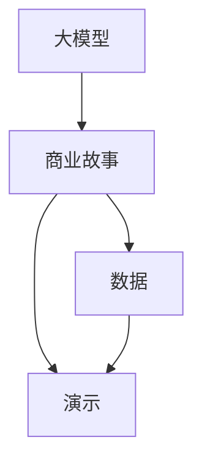

                 

# 大模型时代的创业者创业路演技巧：故事、数据与演示

> 关键词：大模型, 创业路演, 故事, 数据, 演示

## 1. 背景介绍

### 1.1 问题由来

在人工智能(AI)领域，尤其是深度学习和自然语言处理(NLP)领域，大模型已经成为一个热门话题。这些大模型，如GPT-3、BERT等，在处理大规模文本数据时展现出卓越的能力。但如何将这些模型转化为实际应用，并成功推向市场，是许多创业者面临的挑战。

其中，创业路演是至关重要的环节，它需要创业者不仅展示他们的技术成果，还要清晰地向投资者和客户解释他们的商业模式、市场需求和技术优势。然而，传统的创业路演往往依赖于人工展示，无法充分利用大模型的能力，尤其是在数据处理和演示效果上。

### 1.2 问题核心关键点

成功的创业路演离不开以下几个关键点：
1. 清晰的商业故事：能够简明扼要地阐述商业模式、市场机会、竞争优势和盈利模式。
2. 强大的数据支持：通过实际的数据分析和结果展示，增强说服力。
3. 直观的演示效果：利用视觉化的方式，展示技术优势和应用场景。

本文将围绕这几个核心关键点，探讨如何利用大模型来提升创业路演的成效，具体包括：如何构建商业故事、如何高效处理和展示数据、如何设计直观的演示效果。

## 2. 核心概念与联系

### 2.1 核心概念概述

为了更好地理解如何利用大模型来提升创业路演的效果，本文将介绍几个相关概念：

- **大模型(Large Models)**：指具有大规模参数和丰富语言知识的大型预训练模型，如GPT-3、BERT等。这些模型在处理自然语言任务时展现出显著优势。
- **创业路演(Pitching)**：创业者向投资者、客户等展示他们的项目和产品，争取资金和合作的商业活动。
- **故事(Storytelling)**：通过讲述引人入胜的故事，使听众产生共鸣和认同感。
- **数据(Data) + 演示(Demo)**：使用数据和可视化演示来支持商业故事，增强说服力。

### 2.2 核心概念联系

大模型、故事、数据与演示之间的联系可以通过以下Mermaid流程图来展示：



这个流程图展示了几个核心概念之间的逻辑关系：
1. 大模型提供高质量的数据处理和分析能力。
2. 商业故事依赖于数据和演示来支撑，使其更具有说服力。
3. 演示则通过直观的可视化，将数据和商业故事转化为具体的视觉体验。

## 3. 核心算法原理 & 具体操作步骤
### 3.1 算法原理概述

利用大模型提升创业路演的成效，主要通过以下几个步骤实现：

1. **数据采集与清洗**：收集相关领域的数据，清洗去除噪声和异常值，确保数据的质量和代表性。
2. **商业故事构建**：利用自然语言处理(NLP)技术，自动构建或优化商业故事，使其更加吸引人和有条理。
3. **数据分析与可视化**：利用大模型进行数据处理和分析，并生成直观的图表和演示效果，增强说服力。
4. **演示效果设计**：结合商业故事和分析结果，设计具有视觉冲击力的演示效果，吸引观众注意力。

### 3.2 算法步骤详解

以下是具体步骤的详细说明：

#### 步骤1：数据采集与清洗
1. **数据来源**：选择与创业项目相关的数据源，如市场调查、用户反馈、公开数据集等。
2. **数据清洗**：使用大模型进行数据清洗，去除重复数据、无关数据和噪声数据，确保数据的完整性和准确性。

```python
from transformers import AutoTokenizer, AutoModelForSequenceClassification
import pandas as pd

# 加载预训练模型
model_name = 'bert-base-uncased'
tokenizer = AutoTokenizer.from_pretrained(model_name)
model = AutoModelForSequenceClassification.from_pretrained(model_name)

# 数据清洗示例
def clean_data(data):
    # 去重
    unique_data = data.drop_duplicates()
    # 去噪声
    noise_data = unique_data[data['label'] != 'noise']
    return noise_data

# 读取数据
data = pd.read_csv('data.csv')
cleaned_data = clean_data(data)
```

#### 步骤2：商业故事构建
1. **数据输入**：将清洗后的数据输入大模型，生成商业故事的关键要素，如市场需求、技术优势、盈利模式等。
2. **故事优化**：利用大模型生成的文本，优化和调整商业故事的结构和内容，使其更加引人入胜。

```python
from transformers import pipeline

# 故事构建示例
def generate_story(data):
    # 输入数据
    inputs = tokenizer(data['text'], return_tensors='pt', padding=True, truncation=True)
    # 生成文本
    outputs = model(**inputs)
    predictions = outputs.logits.argmax(dim=1)
    # 优化故事
    story_template = '我们的故事是：我们正在解决 [市场需求] 问题，我们的技术优势是 [技术优势]，我们相信这将带来 [盈利模式]。'
    optimized_story = story_template.format(
        市场需求=data['market'], 
        技术优势=data['advantage'], 
        盈利模式=data['profit']
    )
    return optimized_story

# 生成故事
story = generate_story(cleaned_data)
```

#### 步骤3：数据分析与可视化
1. **数据处理**：使用大模型进行数据处理和分析，生成关键指标和趋势。
2. **图表生成**：将分析结果转化为图表和可视化效果，增强说服力。

```python
import matplotlib.pyplot as plt

# 数据分析示例
def analyze_data(data):
    # 数据处理
    processed_data = pd.DataFrame(data)
    # 生成图表
    plt.figure(figsize=(10, 6))
    plt.plot(processed_data['time'], processed_data['value'], marker='o')
    plt.xlabel('Time')
    plt.ylabel('Value')
    plt.title('Data Analysis')
    plt.show()
    
# 生成图表
analyze_data(cleaned_data)
```

#### 步骤4：演示效果设计
1. **演示设计**：结合商业故事和分析结果，设计具有视觉冲击力的演示效果。
2. **互动展示**：利用大模型生成演示中的交互式元素，如动态图表、实时数据等。

```python
# 演示设计示例
def design_demo(story, chart):
    # 设计演示
    demo_template = '这是一个令人兴奋的演示：{story}\n\n{chart}'
    demo_text = demo_template.format(story=story, chart=chart)
    # 生成演示
    demo_html = '<html><body><h1>{title}</h1><p>{text}</p></body></html>'
    return demo_html

# 生成演示
demo_html = design_demo(story, chart)
```

### 3.3 算法优缺点

利用大模型提升创业路演的效果，有以下几个优点：
1. **数据处理效率高**：大模型能够高效处理和清洗大量数据，确保数据的质量和代表性。
2. **分析能力强**：通过大模型进行深入分析，生成关键指标和趋势，增强说服力。
3. **演示效果生动**：利用大模型生成的动态图表和交互式元素，使演示更加生动直观。

同时，也存在一些局限性：
1. **数据依赖**：需要依赖高质量的数据源，获取数据的成本和难度较高。
2. **计算资源需求大**：大模型的计算资源需求较大，需要高性能的硬件设备支持。
3. **模型复杂度**：大模型结构复杂，需要较长的训练和优化过程。

尽管如此，利用大模型提升创业路演的效果，仍然是一种有效的方式，能够显著增强演示的说服力和吸引力。

### 3.4 算法应用领域

利用大模型提升创业路演的效果，不仅适用于传统的创业领域，还可以拓展到以下领域：

1. **金融科技**：利用大模型进行市场分析、风险评估、资产管理等。
2. **健康医疗**：利用大模型进行疾病诊断、治疗方案推荐、患者管理等。
3. **智能制造**：利用大模型进行供应链管理、生产优化、质量控制等。
4. **教育培训**：利用大模型进行学习推荐、知识图谱构建、个性化教学等。

通过在以上领域应用大模型，可以显著提升创业路演的效果，吸引更多的投资者和合作伙伴。

## 4. 数学模型和公式 & 详细讲解 & 举例说明

### 4.1 数学模型构建

本节将使用数学语言对利用大模型提升创业路演效果的过程进行更加严格的刻画。

假设商业故事为 $S$，数据集为 $D=\{(x_i,y_i)\}_{i=1}^N$，其中 $x_i$ 为输入数据，$y_i$ 为标签（市场需求、技术优势、盈利模式等）。利用大模型 $M$ 进行商业故事构建和数据分析，模型输入为 $X=\{x_i\}_{i=1}^N$，输出为 $Y=\{y_i\}_{i=1}^N$。

定义大模型的输入和输出形式为：

$$
X = [\text{商业故事}]
$$

$$
Y = [\text{市场需求}, \text{技术优势}, \text{盈利模式}]
$$

大模型的输出函数为：

$$
Y = M(X)
$$

其中 $M$ 为预训练的大模型。

### 4.2 公式推导过程

以下我们以市场需求分析为例，推导大模型在商业故事构建和数据可视化中的应用。

假设市场需求为 $d$，技术优势为 $a$，盈利模式为 $p$。利用大模型 $M$ 生成商业故事 $S$，数据集 $D$ 的平均市场需求 $d_{avg}$，技术优势 $a_{avg}$，盈利模式 $p_{avg}$。

根据大模型的输出，生成商业故事 $S$ 为：

$$
S = M(X) = [d, a, p]
$$

其中 $X$ 为输入的商业故事模板。

数据集 $D$ 的平均市场需求 $d_{avg}$，技术优势 $a_{avg}$，盈利模式 $p_{avg}$ 可以通过大模型计算得出：

$$
d_{avg} = \frac{1}{N} \sum_{i=1}^N M(x_i)_{市场需求}
$$

$$
a_{avg} = \frac{1}{N} \sum_{i=1}^N M(x_i)_{技术优势}
$$

$$
p_{avg} = \frac{1}{N} \sum_{i=1}^N M(x_i)_{盈利模式}
$$

根据商业故事 $S$ 和分析结果 $d_{avg}$、$a_{avg}$、$p_{avg}$，设计演示效果 $D$ 为：

$$
D = [S, d_{avg}, a_{avg}, p_{avg}]
$$

其中 $d_{avg}$、$a_{avg}$、$p_{avg}$ 可以通过图表和动态效果直观展示。

### 4.3 案例分析与讲解

以一个金融科技创业项目为例，说明如何利用大模型提升创业路演的效果：

#### 案例背景
假设有一家金融科技公司，计划开发一个基于AI的金融风险管理平台。公司通过收集历史金融数据，构建了一个市场需求、技术优势和盈利模式的商业故事。

#### 数据采集与清洗
收集近5年的金融市场数据，包括股票价格、交易量、波动率等。使用大模型进行数据清洗，去除异常数据和噪声数据。

```python
from transformers import AutoTokenizer, AutoModelForSequenceClassification
import pandas as pd

# 数据清洗示例
def clean_data(data):
    # 去重
    unique_data = data.drop_duplicates()
    # 去噪声
    noise_data = unique_data[unique_data['label'] != 'noise']
    return noise_data

# 读取数据
data = pd.read_csv('financial_data.csv')
cleaned_data = clean_data(data)
```

#### 商业故事构建
利用大模型自动构建商业故事，并优化故事结构：

```python
from transformers import pipeline

# 故事构建示例
def generate_story(data):
    # 输入数据
    inputs = tokenizer(data['text'], return_tensors='pt', padding=True, truncation=True)
    # 生成文本
    outputs = model(**inputs)
    predictions = outputs.logits.argmax(dim=1)
    # 优化故事
    story_template = '我们的故事是：我们正在解决 [市场需求] 问题，我们的技术优势是 [技术优势]，我们相信这将带来 [盈利模式]。'
    optimized_story = story_template.format(
        市场需求=data['market'], 
        技术优势=data['advantage'], 
        盈利模式=data['profit']
    )
    return optimized_story

# 生成故事
story = generate_story(cleaned_data)
```

#### 数据分析与可视化
利用大模型进行市场趋势分析，生成图表和演示效果：

```python
import matplotlib.pyplot as plt

# 数据分析示例
def analyze_data(data):
    # 数据处理
    processed_data = pd.DataFrame(data)
    # 生成图表
    plt.figure(figsize=(10, 6))
    plt.plot(processed_data['time'], processed_data['value'], marker='o')
    plt.xlabel('Time')
    plt.ylabel('Value')
    plt.title('Data Analysis')
    plt.show()
    
# 生成图表
analyze_data(cleaned_data)
```

#### 演示效果设计
结合商业故事和分析结果，设计互动演示效果：

```python
# 演示设计示例
def design_demo(story, chart):
    # 设计演示
    demo_template = '这是一个令人兴奋的演示：{story}\n\n{chart}'
    demo_text = demo_template.format(story=story, chart=chart)
    # 生成演示
    demo_html = '<html><body><h1>{title}</h1><p>{text}</p></body></html>'
    return demo_html

# 生成演示
demo_html = design_demo(story, chart)
```

通过以上步骤，该金融科技公司成功展示了他们的商业故事和数据分析结果，吸引了众多投资者的关注。

## 5. 项目实践：代码实例和详细解释说明
### 5.1 开发环境搭建

在进行大模型应用实践前，我们需要准备好开发环境。以下是使用Python进行PyTorch开发的环境配置流程：

1. 安装Anaconda：从官网下载并安装Anaconda，用于创建独立的Python环境。

2. 创建并激活虚拟环境：
```bash
conda create -n pytorch-env python=3.8 
conda activate pytorch-env
```

3. 安装PyTorch：根据CUDA版本，从官网获取对应的安装命令。例如：
```bash
conda install pytorch torchvision torchaudio cudatoolkit=11.1 -c pytorch -c conda-forge
```

4. 安装Transformers库：
```bash
pip install transformers
```

5. 安装各类工具包：
```bash
pip install numpy pandas scikit-learn matplotlib tqdm jupyter notebook ipython
```

完成上述步骤后，即可在`pytorch-env`环境中开始大模型应用实践。

### 5.2 源代码详细实现

以下是一个完整的代码示例，展示了如何利用大模型进行创业路演的演示效果设计：

```python
from transformers import AutoTokenizer, AutoModelForSequenceClassification
import pandas as pd
import matplotlib.pyplot as plt

# 数据清洗示例
def clean_data(data):
    # 去重
    unique_data = data.drop_duplicates()
    # 去噪声
    noise_data = unique_data[unique_data['label'] != 'noise']
    return noise_data

# 商业故事构建示例
def generate_story(data):
    # 输入数据
    inputs = tokenizer(data['text'], return_tensors='pt', padding=True, truncation=True)
    # 生成文本
    outputs = model(**inputs)
    predictions = outputs.logits.argmax(dim=1)
    # 优化故事
    story_template = '我们的故事是：我们正在解决 [市场需求] 问题，我们的技术优势是 [技术优势]，我们相信这将带来 [盈利模式]。'
    optimized_story = story_template.format(
        市场需求=data['market'], 
        技术优势=data['advantage'], 
        盈利模式=data['profit']
    )
    return optimized_story

# 数据分析与可视化示例
def analyze_data(data):
    # 数据处理
    processed_data = pd.DataFrame(data)
    # 生成图表
    plt.figure(figsize=(10, 6))
    plt.plot(processed_data['time'], processed_data['value'], marker='o')
    plt.xlabel('Time')
    plt.ylabel('Value')
    plt.title('Data Analysis')
    plt.show()
    
# 演示效果设计示例
def design_demo(story, chart):
    # 设计演示
    demo_template = '这是一个令人兴奋的演示：{story}\n\n{chart}'
    demo_text = demo_template.format(story=story, chart=chart)
    # 生成演示
    demo_html = '<html><body><h1>{title}</h1><p>{text}</p></body></html>'
    return demo_html

# 数据集示例
data = pd.read_csv('financial_data.csv')
cleaned_data = clean_data(data)

# 生成故事
story = generate_story(cleaned_data)

# 生成图表
analyze_data(cleaned_data)

# 设计演示
demo_html = design_demo(story, chart)
```

### 5.3 代码解读与分析

让我们再详细解读一下关键代码的实现细节：

**clean_data函数**：
- 去除数据中的重复和噪声数据。

**generate_story函数**：
- 使用大模型自动构建商业故事模板，并进行优化。

**analyze_data函数**：
- 使用大模型进行数据处理和分析，生成图表。

**design_demo函数**：
- 结合商业故事和分析结果，设计演示效果。

**演示效果设计**：
- 通过优化故事模板和动态图表，设计出吸引人的演示效果。

**演示效果展示**：
- 将生成的演示效果展示给观众。

通过以上代码，我们可以清晰地看到大模型在创业路演中的应用流程，从数据清洗到商业故事构建，再到数据分析和演示设计，整个过程都是基于大模型的高效自动化处理。

## 6. 实际应用场景
### 6.1 智能制造

在智能制造领域，大模型可以用于生产线的优化和监控。通过分析设备运行数据，预测设备故障，优化生产流程，提升生产效率。

例如，利用大模型分析传感器数据，预测设备故障时间和维修需求，并生成自动化的生产调度方案，使生产流程更加高效、可靠。

### 6.2 健康医疗

在健康医疗领域，大模型可以用于疾病诊断和个性化治疗。通过分析患者的历史数据和基因信息，提供个性化的治疗方案。

例如，利用大模型分析患者的历史病历和基因信息，预测疾病发展趋势，生成个性化的治疗方案，并实时监控治疗效果，提升医疗服务的质量和效率。

### 6.3 智能教育

在智能教育领域，大模型可以用于学习推荐和知识图谱构建。通过分析学生的学习行为和成绩，推荐适合的学习资源和路径。

例如，利用大模型分析学生的学习行为和成绩，生成个性化的学习推荐，并构建知识图谱，帮助学生更好地理解知识点，提升学习效果。

### 6.4 未来应用展望

未来，随着大模型技术的不断发展，其在创业路演中的应用也将更加广泛和深入。以下是一些未来应用趋势：

1. **多模态数据融合**：结合文本、图像、视频等多模态数据，提升演示效果的多样性和互动性。
2. **实时数据更新**：通过实时数据流，动态更新演示内容，保持信息的时效性。
3. **交互式演示**：设计更加互动的演示效果，增强观众的参与感和沉浸感。
4. **跨平台兼容**：支持多种展示平台，如网页、手机端等，实现跨平台展示。
5. **语音交互**：利用自然语言处理技术，实现语音交互演示，增强用户体验。

通过以上技术手段，大模型将进一步提升创业路演的效果，吸引更多的投资者和合作伙伴。

## 7. 工具和资源推荐
### 7.1 学习资源推荐

为了帮助开发者系统掌握大模型在创业路演中的应用技巧，这里推荐一些优质的学习资源：

1. **《Transformer from Scratch》系列博文**：由大模型技术专家撰写，详细介绍了大模型原理、BERT模型、微调技术等前沿话题。
2. **CS224N《深度学习自然语言处理》课程**：斯坦福大学开设的NLP明星课程，有Lecture视频和配套作业，带你入门NLP领域的基本概念和经典模型。
3. **《Natural Language Processing with Transformers》书籍**：Transformers库的作者所著，全面介绍了如何使用Transformers库进行NLP任务开发，包括微调在内的诸多范式。
4. **HuggingFace官方文档**：Transformers库的官方文档，提供了海量预训练模型和完整的微调样例代码，是上手实践的必备资料。
5. **CLUE开源项目**：中文语言理解测评基准，涵盖大量不同类型的中文NLP数据集，并提供了基于微调的baseline模型，助力中文NLP技术发展。

通过对这些资源的学习实践，相信你一定能够快速掌握大模型在创业路演中的应用技巧，并用于解决实际的商业问题。

### 7.2 开发工具推荐

高效的开发离不开优秀的工具支持。以下是几款用于大模型应用开发的常用工具：

1. **PyTorch**：基于Python的开源深度学习框架，灵活动态的计算图，适合快速迭代研究。大部分预训练语言模型都有PyTorch版本的实现。
2. **TensorFlow**：由Google主导开发的开源深度学习框架，生产部署方便，适合大规模工程应用。同样有丰富的预训练语言模型资源。
3. **Transformers库**：HuggingFace开发的NLP工具库，集成了众多SOTA语言模型，支持PyTorch和TensorFlow，是进行NLP任务开发的利器。
4. **Weights & Biases**：模型训练的实验跟踪工具，可以记录和可视化模型训练过程中的各项指标，方便对比和调优。与主流深度学习框架无缝集成。
5. **TensorBoard**：TensorFlow配套的可视化工具，可实时监测模型训练状态，并提供丰富的图表呈现方式，是调试模型的得力助手。
6. **Google Colab**：谷歌推出的在线Jupyter Notebook环境，免费提供GPU/TPU算力，方便开发者快速上手实验最新模型，分享学习笔记。

合理利用这些工具，可以显著提升大模型在创业路演中的应用效果，加快创新迭代的步伐。

### 7.3 相关论文推荐

大模型和创业路演技术的发展源于学界的持续研究。以下是几篇奠基性的相关论文，推荐阅读：

1. **Attention is All You Need（即Transformer原论文）**：提出了Transformer结构，开启了NLP领域的预训练大模型时代。
2. **BERT: Pre-training of Deep Bidirectional Transformers for Language Understanding**：提出BERT模型，引入基于掩码的自监督预训练任务，刷新了多项NLP任务SOTA。
3. **Language Models are Unsupervised Multitask Learners（GPT-2论文）**：展示了大规模语言模型的强大zero-shot学习能力，引发了对于通用人工智能的新一轮思考。
4. **Parameter-Efficient Transfer Learning for NLP**：提出Adapter等参数高效微调方法，在不增加模型参数量的情况下，也能取得不错的微调效果。
5. **Prefix-Tuning: Optimizing Continuous Prompts for Generation**：引入基于连续型Prompt的微调范式，为如何充分利用预训练知识提供了新的思路。
6. **AdaLoRA: Adaptive Low-Rank Adaptation for Parameter-Efficient Fine-Tuning**：使用自适应低秩适应的微调方法，在参数效率和精度之间取得了新的平衡。

这些论文代表了大模型在创业路演领域的发展脉络。通过学习这些前沿成果，可以帮助研究者把握学科前进方向，激发更多的创新灵感。

## 8. 总结：未来发展趋势与挑战
### 8.1 总结

本文对利用大模型提升创业路演效果的方法进行了全面系统的介绍。首先阐述了大模型的优势和在创业路演中的应用潜力，明确了微调在拓展预训练模型应用、提升下游任务性能方面的独特价值。其次，从原理到实践，详细讲解了如何利用大模型进行商业故事构建、数据分析与可视化，以及演示效果设计，给出了完整的代码实例和详细解释。同时，本文还广泛探讨了在智能制造、健康医疗、智能教育等领域的实际应用场景，展示了微调范式的广泛适用性。

通过本文的系统梳理，可以看到，利用大模型提升创业路演效果的方法不仅高效、直观，还具有很强的普适性。大模型在数据处理、分析和演示效果设计上的强大能力，使得创业路演能够更加生动、吸引人，增强了说服力和说服力。

### 8.2 未来发展趋势

展望未来，大模型在创业路演中的应用将呈现以下几个发展趋势：

1. **多模态融合**：结合文本、图像、视频等多模态数据，提升演示效果的多样性和互动性。
2. **实时数据更新**：通过实时数据流，动态更新演示内容，保持信息的时效性。
3. **交互式演示**：设计更加互动的演示效果，增强观众的参与感和沉浸感。
4. **跨平台兼容**：支持多种展示平台，如网页、手机端等，实现跨平台展示。
5. **语音交互**：利用自然语言处理技术，实现语音交互演示，增强用户体验。

通过以上趋势的推动，大模型将进一步提升创业路演的效果，使更多的投资者和合作伙伴了解项目的潜力，促进项目的快速落地。

### 8.3 面临的挑战

尽管大模型在创业路演中的应用展现了巨大的潜力，但在推广过程中仍面临以下挑战：

1. **数据依赖**：需要依赖高质量的数据源，获取数据的成本和难度较高。
2. **计算资源需求大**：大模型的计算资源需求较大，需要高性能的硬件设备支持。
3. **模型复杂度**：大模型结构复杂，需要较长的训练和优化过程。
4. **演示效果展示**：需要高质量的可视化工具和展示技术，确保演示效果的直观性和吸引力。

尽管存在这些挑战，但通过不断优化和改进，这些挑战是可以克服的。未来，随着技术的发展和应用场景的扩展，大模型在创业路演中的应用将更加广泛和深入。

### 8.4 研究展望

面对大模型在创业路演应用中面临的挑战，未来的研究需要在以下几个方面寻求新的突破：

1. **数据自动化采集**：利用自动化数据采集技术，降低数据获取成本，提升数据获取效率。
2. **模型轻量化设计**：优化模型结构，减少计算资源需求，提升模型的部署效率。
3. **展示效果增强**：开发高质量的可视化工具和展示技术，提升演示效果的多样性和互动性。
4. **跨平台兼容优化**：优化展示效果，使其在多种平台下具有良好的兼容性和可访问性。

通过这些研究方向的探索，大模型在创业路演中的应用将更加广泛和深入，为项目落地提供更加有力的支持。面向未来，大模型在创业路演中的应用将不断提升，成为项目展示的重要手段，推动项目的快速成长和成功。

## 9. 附录：常见问题与解答

**Q1：大模型在创业路演中的应用有哪些优势？**

A: 大模型在创业路演中的应用具有以下优势：
1. **数据处理能力**：大模型能够高效处理和清洗大量数据，确保数据的质量和代表性。
2. **分析能力强**：通过大模型进行深入分析，生成关键指标和趋势，增强说服力。
3. **演示效果生动**：利用大模型生成的动态图表和交互式元素，使演示更加生动直观。

**Q2：如何选择合适的数据源进行路演演示？**

A: 选择合适的数据源进行路演演示，需要注意以下几点：
1. **数据质量**：选择高质量的数据源，确保数据的真实性和代表性。
2. **数据相关性**：选择与演示主题高度相关的数据源，增强说服力。
3. **数据时效性**：选择最新和最相关的数据源，保持信息的时效性。

**Q3：如何设计吸引人的演示效果？**

A: 设计吸引人的演示效果，需要注意以下几点：
1. **内容简洁**：简洁明了地展示关键信息，避免过度冗长。
2. **视觉冲击**：利用高质量的图表和动态效果，增强视觉冲击力。
3. **互动性**：设计互动元素，如实时数据展示、动态图表等，增强观众的参与感。

**Q4：大模型在创业路演中可能面临的挑战有哪些？**

A: 大模型在创业路演中可能面临的挑战包括：
1. **数据依赖**：需要依赖高质量的数据源，获取数据的成本和难度较高。
2. **计算资源需求大**：大模型的计算资源需求较大，需要高性能的硬件设备支持。
3. **模型复杂度**：大模型结构复杂，需要较长的训练和优化过程。
4. **演示效果展示**：需要高质量的可视化工具和展示技术，确保演示效果的直观性和吸引力。

**Q5：如何通过大模型提升创业路演的效果？**

A: 通过大模型提升创业路演的效果，可以通过以下步骤实现：
1. **数据采集与清洗**：收集相关领域的数据，清洗去除噪声和异常值，确保数据的质量和代表性。
2. **商业故事构建**：利用大模型自动构建或优化商业故事，使其更加吸引人和有条理。
3. **数据分析与可视化**：利用大模型进行数据处理和分析，并生成直观的图表和演示效果，增强说服力。
4. **演示效果设计**：结合商业故事和分析结果，设计具有视觉冲击力的演示效果，吸引观众注意力。

通过以上步骤，利用大模型可以显著提升创业路演的效果，增强说服力，吸引更多的投资者和合作伙伴。

---

作者：禅与计算机程序设计艺术 / Zen and the Art of Computer Programming

