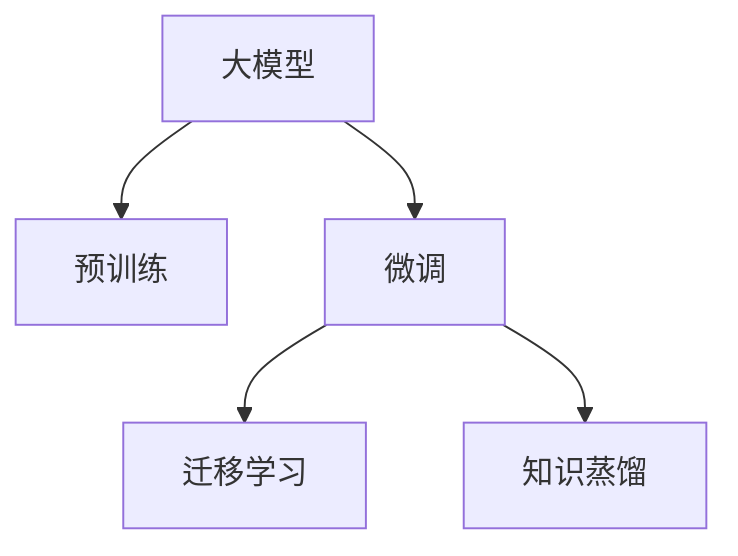
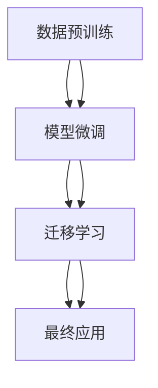

                 

# 大模型的市场定位与用户需求

大模型（Large Model）在当今的人工智能领域占据了核心地位，它们通过海量数据的预训练学习到了复杂的语言知识，并在众多自然语言处理（NLP）和计算机视觉（CV）任务上取得了卓越的性能。本文将从市场定位和用户需求两个方面探讨大模型的应用场景，并详细解析它们在实际应用中的表现。

## 1. 背景介绍

### 1.1 问题由来

近年来，深度学习技术在处理自然语言和图像数据方面取得了显著进展。大模型，尤其是基于Transformer架构的语言模型（如GPT系列、BERT、T5等），以其庞大的参数量和强大的泛化能力，逐渐成为了AI领域的关键技术。

大模型的崛起标志着计算资源和数据资源的密集使用，其在图像识别、语言理解和生成等方面展现了巨大的潜力。但同时，如何在大规模数据集上高效地进行模型训练、模型优化以及模型部署，成为业界关注的焦点。

### 1.2 问题核心关键点

大模型的市场定位和用户需求主要围绕以下几个关键点展开：

- **计算需求**：大规模模型需要强大的计算能力来处理海量数据，这通常意味着对GPU/TPU等高性能硬件的需求。
- **数据质量**：模型性能与数据质量密切相关，高质量的标注数据是提升模型效果的关键。
- **用户需求**：不同行业的用户对大模型的需求各异，如实时响应、低延迟、高准确性等。
- **技术门槛**：部署和优化大模型需要一定的技术基础，包括深度学习、分布式计算和优化算法等。

## 2. 核心概念与联系

### 2.1 核心概念概述

为更好地理解大模型的市场定位和用户需求，本文将介绍几个关键概念及其之间的关系：

- **大模型（Large Model）**：指通过大规模无标签数据预训练学习到复杂知识结构的模型，通常具有数十亿甚至百亿级别的参数。
- **预训练（Pre-training）**：指在大规模无标签数据上训练模型，学习通用的知识表示。
- **微调（Fine-tuning）**：在预训练模型的基础上，使用特定任务的数据进行有监督的调整，以适应该任务的需求。
- **迁移学习（Transfer Learning）**：利用预训练模型在不同任务间的知识迁移，减少新任务的数据需求。
- **知识蒸馏（Knowledge Distillation）**：将大型模型的知识传递给小型模型，提升小型模型的性能。

这些概念通过一个大模型训练和微调的框架（见下述流程图）进行联系，展示了预训练、微调和迁移学习之间的内在关系。



### 2.2 核心概念原理和架构的 Mermaid 流程图

以下是一个简单的Mermaid流程图，展示了预训练、微调和迁移学习之间的联系：



此流程图表明，大模型首先在大规模数据集上进行预训练，然后通过微调学习特定任务的相关知识，最终在实际应用中进行迁移学习，以适应不同的用户需求。

## 3. 核心算法原理 & 具体操作步骤

### 3.1 算法原理概述

大模型的核心算法原理主要基于Transformer架构，通过自回归或自编码方式进行预训练，学习到丰富的语言知识和图像特征。这些模型通常在处理大规模无标签数据时，会通过计算图自动求导的方式进行反向传播，不断优化模型参数。

在微调阶段，通过在特定任务的数据集上重新训练模型，更新部分或全部模型参数，使其能够更好地适应新任务。这一过程通常需要选择合适的优化器、学习率和正则化方法，以避免过拟合和提高模型的泛化能力。

### 3.2 算法步骤详解

大模型的微调步骤如下：

1. **数据准备**：收集并处理特定任务的数据集，确保数据集的质量和多样性。
2. **模型选择**：选择适当的预训练模型，并决定是否需要微调其中的部分或全部层。
3. **设置参数**：设定微调的超参数，包括学习率、批量大小、迭代轮数等。
4. **模型微调**：使用有监督学习的方法，在特定任务的数据集上对模型进行训练和调整。
5. **模型评估**：在验证集上评估模型性能，确保模型在特定任务上表现良好。
6. **部署应用**：将微调后的模型部署到实际应用中，进行实时推理和预测。

### 3.3 算法优缺点

**优点**：

- **泛化能力**：大模型通常具有较强的泛化能力，能够在不同的数据集上表现出色。
- **高性能**：基于Transformer架构的模型通常具有高效的前向和后向传播速度。
- **灵活性**：微调过程允许模型适应不同的用户需求，提升其在特定任务上的性能。

**缺点**：

- **资源消耗大**：大规模模型的训练和推理需要高性能硬件支持。
- **数据依赖性**：模型的性能高度依赖于数据质量，标注数据不足时难以取得理想效果。
- **模型复杂性**：大模型结构复杂，参数数量庞大，优化难度较大。

### 3.4 算法应用领域

大模型已在多个领域得到广泛应用，主要包括以下几个方面：

- **自然语言处理（NLP）**：如文本分类、情感分析、机器翻译、问答系统等。
- **计算机视觉（CV）**：如图像识别、物体检测、人脸识别、图像生成等。
- **语音处理**：如语音识别、语音合成、情感识别等。
- **推荐系统**：如商品推荐、个性化推荐、内容推荐等。
- **医学领域**：如医疗影像分析、病理分析等。
- **金融领域**：如风险评估、市场预测等。

## 4. 数学模型和公式 & 详细讲解 & 举例说明

### 4.1 数学模型构建

以自然语言处理任务为例，一个大模型的数学模型可以表示为：

$$
M_{\theta}(x) = \text{Transformer}(\text{Embedding}(x))
$$

其中，$M_{\theta}$ 表示模型参数，$x$ 表示输入文本，$\text{Embedding}$ 表示嵌入层，$\text{Transformer}$ 表示Transformer模型。

### 4.2 公式推导过程

Transformer模型的核心在于自注意力机制，其公式如下：

$$
\text{Attention}(Q,K,V) = \text{Softmax}(QK^T)/\sqrt{d_k} \cdot V
$$

其中，$Q$ 和 $K$ 表示查询向量和键向量，$V$ 表示值向量，$d_k$ 表示键向量的维度。

### 4.3 案例分析与讲解

以BERT模型为例，其在预训练和微调过程中使用了大量的无标签数据和有标签数据。预训练过程通常使用掩码语言模型（Masked Language Model, MLM）和下一句预测（Next Sentence Prediction, NSP）任务。这些任务通过最大化预测正确概率，使模型学习到语言的概率分布和上下文关系。

在微调阶段，BERT模型会根据特定的任务数据集进行有监督学习，更新模型参数以适应新任务的需求。例如，在文本分类任务中，BERT模型会学习如何将输入文本映射到类别标签。

## 5. 项目实践：代码实例和详细解释说明

### 5.1 开发环境搭建

开发环境搭建通常包括以下步骤：

1. **安装Python**：确保系统安装了最新版本的Python，建议选择Anaconda或Miniconda。
2. **创建虚拟环境**：使用conda创建虚拟环境，以隔离开发过程中的依赖包。
3. **安装必要的库**：安装TensorFlow、PyTorch、Scikit-learn、NumPy等常用库。
4. **数据准备**：收集和处理训练集和测试集，确保数据集的质量。
5. **模型训练**：在虚拟环境中运行模型训练脚本，并进行参数调整。

### 5.2 源代码详细实现

以下是一个简单的BERT模型微调代码示例：

```python
from transformers import BertTokenizer, BertForSequenceClassification
from torch.utils.data import DataLoader, Dataset
import torch
import pandas as pd

# 加载预训练模型和分词器
model = BertForSequenceClassification.from_pretrained('bert-base-uncased')
tokenizer = BertTokenizer.from_pretrained('bert-base-uncased')

# 定义数据集
class CustomDataset(Dataset):
    def __init__(self, data, tokenizer):
        self.tokenizer = tokenizer
        self.data = data

    def __len__(self):
        return len(self.data)

    def __getitem__(self, idx):
        text = self.data[idx]['text']
        label = self.data[idx]['label']
        encoding = self.tokenizer(text, max_length=256, truncation=True, padding='max_length', return_tensors='pt')
        input_ids = encoding['input_ids']
        attention_mask = encoding['attention_mask']
        return {'input_ids': input_ids, 'attention_mask': attention_mask, 'labels': torch.tensor(label, dtype=torch.long)}

# 加载数据
data = pd.read_csv('data.csv')
train_dataset = CustomDataset(data, tokenizer)
test_dataset = CustomDataset(data, tokenizer)

# 定义训练参数
train_loader = DataLoader(train_dataset, batch_size=32, shuffle=True)
test_loader = DataLoader(test_dataset, batch_size=32, shuffle=False)

# 定义优化器和损失函数
optimizer = torch.optim.AdamW(model.parameters(), lr=2e-5)
criterion = torch.nn.CrossEntropyLoss()

# 训练模型
model.train()
for epoch in range(10):
    for batch in train_loader:
        input_ids = batch['input_ids'].to(device)
        attention_mask = batch['attention_mask'].to(device)
        labels = batch['labels'].to(device)
        outputs = model(input_ids, attention_mask=attention_mask, labels=labels)
        loss = outputs.loss
        optimizer.zero_grad()
        loss.backward()
        optimizer.step()

# 评估模型
model.eval()
with torch.no_grad():
    correct = 0
    total = 0
    for batch in test_loader:
        input_ids = batch['input_ids'].to(device)
        attention_mask = batch['attention_mask'].to(device)
        labels = batch['labels'].to(device)
        outputs = model(input_ids, attention_mask=attention_mask)
        _, predicted = torch.max(outputs, 1)
        total += labels.size(0)
        correct += (predicted == labels).sum().item()
    print('Accuracy: {:.2f}%'.format(correct / total * 100))
```

### 5.3 代码解读与分析

上述代码演示了使用BERT模型进行情感分析任务的微调过程。其中，数据集定义了文本和标签，分词器将文本转换为模型所需的格式，模型使用AdamW优化器和交叉熵损失函数进行训练和评估。

## 6. 实际应用场景

### 6.4 未来应用展望

大模型的应用前景广阔，未来将进一步扩展到更多领域。以下是几个具体的应用场景：

- **智能客服**：使用大模型处理客户咨询，提供自然流畅的回答，提升客户满意度。
- **医疗诊断**：利用大模型分析医学影像和病历数据，辅助医生进行诊断和治疗。
- **金融分析**：对海量金融数据进行情感分析和趋势预测，帮助投资者做出决策。
- **教育辅导**：提供个性化学习建议和作业批改服务，提升教育质量。
- **内容推荐**：分析用户行为数据，提供精准的个性化推荐服务。

## 7. 工具和资源推荐

### 7.1 学习资源推荐

- **《深度学习》** 一书，由Ian Goodfellow等人撰写，是深度学习领域的经典教材，详细介绍了深度学习的基本概念和算法。
- **Coursera的《深度学习专项课程》**，由Andrew Ng教授主讲，涵盖了深度学习的基础知识与应用实践。
- **Hugging Face官方文档**，提供了Transformer模型和相关库的使用指南，适合快速上手。
- **Google Colab**，提供了免费的GPU和TPU资源，适合进行大模型的实验和研究。

### 7.2 开发工具推荐

- **PyTorch**：一个开源的深度学习框架，灵活易用，适用于各种深度学习模型开发。
- **TensorFlow**：由Google开发的大规模机器学习框架，适用于分布式计算和模型部署。
- **Jupyter Notebook**：一个开源的交互式笔记本，支持Python代码的交互式编写和执行。
- **Weights & Biases**：一个模型实验管理和可视化工具，适合记录和分析模型训练过程。

### 7.3 相关论文推荐

- **Attention is All You Need**：提出Transformer架构，是现代大模型的基础。
- **BERT: Pre-training of Deep Bidirectional Transformers for Language Understanding**：提出BERT模型，展示了预训练语言模型的强大性能。
- **Language Models are Unsupervised Multitask Learners**：提出了预训练语言模型可以无监督地学习多种任务的思路。
- **ImageNet Classification with Deep Convolutional Neural Networks**：展示了卷积神经网络在图像分类任务上的成功应用。

## 8. 总结：未来发展趋势与挑战

### 8.1 研究成果总结

大模型的市场定位和用户需求研究，推动了深度学习技术在多个领域的应用。基于大模型的微调方法，使得模型能够适应不同的任务需求，提升了模型在实际应用中的性能。

### 8.2 未来发展趋势

未来，大模型的应用将继续扩展到更多领域，主要趋势包括：

- **多模态融合**：大模型将越来越多地融合视觉、语音等多模态数据，提升跨领域知识迁移能力。
- **知识蒸馏**：通过将大型模型的知识传递给小型模型，提升小型模型的性能，降低计算资源需求。
- **自监督学习**：利用自监督任务，如掩码语言模型、自回归模型等，进一步提升模型的泛化能力。
- **跨领域迁移**：大模型将在更多领域中实现跨领域的知识迁移，提升在不同任务间的泛化性能。

### 8.3 面临的挑战

大模型在应用过程中面临诸多挑战：

- **计算资源需求大**：大规模模型需要高性能硬件支持，且训练和推理耗时长。
- **数据依赖性高**：模型的性能高度依赖于数据质量，标注数据不足时难以取得理想效果。
- **模型复杂性高**：大模型结构复杂，参数数量庞大，优化难度较大。
- **模型解释性差**：大模型的决策过程缺乏可解释性，难以对其推理逻辑进行分析和调试。

### 8.4 研究展望

未来研究需要从以下几个方面进行突破：

- **参数高效微调**：开发更多参数高效的微调方法，在固定大部分预训练参数的情况下，只更新极少量的任务相关参数。
- **数据增强**：采用数据增强技术，扩充训练集的多样性，提升模型的泛化能力。
- **知识蒸馏**：研究如何通过知识蒸馏，将大型模型的知识高效传递给小型模型，提升模型的性能。
- **多任务学习**：探索多任务学习技术，提升模型在多个任务上的泛化能力。

## 9. 附录：常见问题与解答

**Q1：如何选择适合的任务微调模型？**

A: 选择适合的任务微调模型需要考虑多个因素，如任务类型、数据规模、计算资源等。一般来说，对于图像处理任务，可以选择基于CNN的模型，如ResNet、VGG等；对于自然语言处理任务，可以选择BERT、GPT等预训练模型。

**Q2：如何进行有效的数据增强？**

A: 数据增强可以通过多种方式实现，如图像旋转、翻转、缩放等。在自然语言处理中，可以通过回译、改写等技术扩充训练集。

**Q3：如何优化大模型的训练过程？**

A: 优化大模型训练过程需要考虑多个方面，如选择合适的优化器、设置合适的学习率、使用正则化技术等。同时，可以使用分布式训练、混合精度训练等技术提升训练效率。

**Q4：如何在实际应用中实现模型部署？**

A: 模型部署需要考虑模型裁剪、量化加速、服务化封装等。可以使用TensorFlow Serving、TorchScript等工具将模型封装成API服务，方便集成调用。

---

作者：禅与计算机程序设计艺术 / Zen and the Art of Computer Programming

