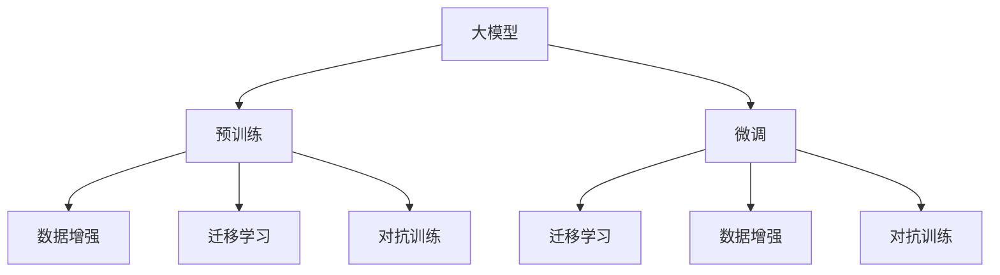

                 

## 1. 背景介绍

在全球环境问题日益严峻的背景下，如何通过技术手段实现可持续发展，成为各国政府和国际社会关注的焦点。人工智能（AI）作为新兴的科学技术，正在成为推动生态文明建设的重要工具。本文将探讨大模型如何赋能智慧环保，并提出创业者在助力生态文明建设中可以采取的策略。

### 1.1 问题的由来
近年来，随着工业化和城市化的加速，环境污染和资源过度消耗问题愈发严重。传统的环保监测和管理方法难以应对日益复杂和庞大的环境数据，迫切需要新的技术手段提升环境治理的效率和精度。人工智能，尤其是大模型，凭借其强大的数据分析和模式识别能力，为智慧环保提供了新的解决方案。

### 1.2 问题核心关键点
- **大模型**：指基于深度学习的大型神经网络模型，如GPT、BERT等，具备强大的数据处理和模式识别能力。
- **智慧环保**：利用AI技术优化环保管理流程，提升环境监测和治理的效率和效果。
- **创业者**：在AI和大模型技术推动下，探索环保领域的创新应用，助力生态文明建设。

### 1.3 问题研究意义
通过大模型赋能智慧环保，不仅可以提高环保工作的效率和精准度，还能促进环保技术的普及和应用，推动全球生态文明建设的进程。此外，创业者的积极参与和创新实践，将为智慧环保注入新的活力和动力。

## 2. 核心概念与联系

### 2.1 核心概念概述
- **大模型**：指通过大规模数据预训练得到的大型神经网络模型，如BERT、GPT等。
- **预训练**：在大规模无标签数据上训练模型，学习通用的语言或特征表示。
- **微调**：在预训练模型上添加特定任务的输出层，通过有标签数据进行训练，优化模型在特定任务上的性能。
- **迁移学习**：将预训练模型在其他任务上的知识迁移到新任务中，提高新任务的训练效率和性能。
- **数据增强**：通过对原始数据进行变换、扩充，增加数据多样性，提高模型的鲁棒性和泛化能力。
- **对抗训练**：通过加入对抗样本，训练模型对噪声和扰动的鲁棒性。

这些概念之间存在着紧密的联系，共同构成了大模型在智慧环保领域的应用基础。

### 2.2 核心概念原理和架构的 Mermaid 流程图



## 3. 核心算法原理 & 具体操作步骤

### 3.1 算法原理概述
大模型在智慧环保中的应用主要基于迁移学习和微调。预训练大模型通过在大规模无标签数据上学习通用的语言或特征表示，然后在特定的环保监测和管理任务上通过微调进行优化，从而提升模型在特定任务上的性能。

### 3.2 算法步骤详解

**Step 1: 数据准备**
- 收集环保相关的数据，如空气质量监测数据、水体污染数据、噪声监测数据等。
- 数据清洗和标注，准备训练集、验证集和测试集。

**Step 2: 选择预训练模型**
- 选择适合任务的预训练模型，如BERT、GPT等。
- 加载预训练模型和相应的分词器。

**Step 3: 添加任务适配层**
- 根据任务类型，设计相应的输出层和损失函数。
- 对于分类任务，添加线性分类器；对于生成任务，使用语言模型的解码器。

**Step 4: 设置微调超参数**
- 选择合适的优化器，如AdamW、SGD等。
- 设置学习率、批大小、迭代轮数等。
- 应用正则化技术，如L2正则、Dropout等。

**Step 5: 执行梯度训练**
- 将训练集数据分批次输入模型，计算损失函数。
- 反向传播计算参数梯度，更新模型参数。
- 周期性在验证集上评估模型性能，触发Early Stopping。
- 重复上述步骤直至模型收敛。

**Step 6: 测试和部署**
- 在测试集上评估微调后模型的性能。
- 将模型集成到实际应用系统中，进行环境监测和治理。

### 3.3 算法优缺点
- **优点**：
  - **高效性**：利用大模型的预训练知识，减少从头训练所需的数据和时间。
  - **泛化能力强**：大模型能够学习到通用的语言或特征表示，适用于多种环保监测和管理任务。
  - **可扩展性**：模型可以通过微调和迁移学习，快速适应新任务和新场景。

- **缺点**：
  - **数据依赖**：微调效果依赖于数据的质量和数量，标注成本较高。
  - **模型复杂性**：大模型参数量大，训练和推理资源需求高。
  - **可解释性差**：大模型通常被视为"黑盒"，其内部决策过程难以解释。

### 3.4 算法应用领域

大模型在智慧环保中的应用领域广泛，包括但不限于：

- **空气质量监测**：通过分析气象数据、地面监测数据和卫星遥感数据，预测未来空气质量变化。
- **水体污染监测**：通过分析水质数据、流速数据和气象数据，识别污染源和预测污染趋势。
- **噪声监测**：通过分析声学数据和地理位置数据，识别噪音源和评估噪音影响。
- **垃圾分类**：通过图像识别技术，自动分类和统计垃圾种类和数量，提高垃圾回收效率。

## 4. 数学模型和公式 & 详细讲解

### 4.1 数学模型构建

假设预训练模型为 $M_{\theta}$，其中 $\theta$ 为预训练得到的模型参数。设环保监测任务的训练集为 $D=\{(x_i,y_i)\}_{i=1}^N$，其中 $x_i$ 为输入数据（如气象数据、水质数据等），$y_i$ 为对应的环境标签（如空气质量等级、污染源等）。

定义模型 $M_{\theta}$ 在数据样本 $(x,y)$ 上的损失函数为 $\ell(M_{\theta}(x),y)$，则在数据集 $D$ 上的经验风险为：

$$
\mathcal{L}(\theta) = \frac{1}{N} \sum_{i=1}^N \ell(M_{\theta}(x_i),y_i)
$$

其中 $\ell$ 为特定任务的损失函数，如交叉熵损失、均方误差损失等。

### 4.2 公式推导过程

以空气质量监测任务为例，假设模型 $M_{\theta}$ 在输入 $x_i$ 上的输出为 $\hat{y}=M_{\theta}(x_i)$，表示预测的空气质量等级。真实标签 $y_i$ 为实际空气质量等级。则二分类交叉熵损失函数定义为：

$$
\ell(M_{\theta}(x_i),y_i) = -[y_i\log \hat{y} + (1-y_i)\log (1-\hat{y})]
$$

将其代入经验风险公式，得：

$$
\mathcal{L}(\theta) = -\frac{1}{N}\sum_{i=1}^N [y_i\log M_{\theta}(x_i)+(1-y_i)\log(1-M_{\theta}(x_i))]
$$

根据链式法则，损失函数对参数 $\theta_k$ 的梯度为：

$$
\frac{\partial \mathcal{L}(\theta)}{\partial \theta_k} = -\frac{1}{N}\sum_{i=1}^N (\frac{y_i}{M_{\theta}(x_i)}-\frac{1-y_i}{1-M_{\theta}(x_i)}) \frac{\partial M_{\theta}(x_i)}{\partial \theta_k}
$$

其中 $\frac{\partial M_{\theta}(x_i)}{\partial \theta_k}$ 可进一步递归展开，利用自动微分技术完成计算。

### 4.3 案例分析与讲解

以垃圾分类任务为例，假设输入为垃圾图片，输出为垃圾种类。

首先，将垃圾图片输入预训练模型 $M_{\theta}$ 得到特征表示 $f(x_i)$。然后，将特征表示 $f(x_i)$ 输入分类器 $g(f(x_i))$ 得到垃圾种类预测 $\hat{y}=g(f(x_i))$。损失函数定义为交叉熵损失：

$$
\ell(\hat{y},y_i) = -\sum_{k} y_{ik} \log \hat{y}_{ik}
$$

其中 $y_{ik}$ 表示第 $i$ 个样本第 $k$ 个类别的真实标签，$\hat{y}_{ik}$ 表示模型对第 $i$ 个样本第 $k$ 个类别的预测概率。

## 5. 项目实践：代码实例和详细解释说明

### 5.1 开发环境搭建

使用Python和PyTorch搭建开发环境，具体步骤如下：

1. 安装Anaconda并创建虚拟环境。
2. 安装PyTorch、torchvision等深度学习库。
3. 安装Transformer库和预训练模型。
4. 安装数据处理和可视化库，如pandas、matplotlib等。

### 5.2 源代码详细实现

以下是一个简单的垃圾分类任务的代码实现示例：

```python
import torch
import torch.nn as nn
import torch.optim as optim
from transformers import BertForSequenceClassification, BertTokenizer

# 定义模型
class GarbageClassifier(nn.Module):
    def __init__(self):
        super(GarbageClassifier, self).__init__()
        self.bert = BertForSequenceClassification.from_pretrained('bert-base-uncased', num_labels=10)
        self.dropout = nn.Dropout(0.1)
        self.out = nn.Linear(768, 10)
    
    def forward(self, input_ids, attention_mask):
        outputs = self.bert(input_ids=input_ids, attention_mask=attention_mask)
        pooled_output = outputs.pooler_output
        pooled_output = self.dropout(pooled_output)
        logits = self.out(pooled_output)
        return logits

# 加载数据
tokenizer = BertTokenizer.from_pretrained('bert-base-uncased')
train_dataset = ...
dev_dataset = ...
test_dataset = ...

# 定义模型、优化器和损失函数
model = GarbageClassifier()
optimizer = optim.Adam(model.parameters(), lr=1e-5)
criterion = nn.CrossEntropyLoss()

# 训练模型
for epoch in range(epochs):
    for batch in train_dataset:
        input_ids = batch['input_ids']
        attention_mask = batch['attention_mask']
        labels = batch['labels']
        optimizer.zero_grad()
        logits = model(input_ids, attention_mask)
        loss = criterion(logits, labels)
        loss.backward()
        optimizer.step()

# 评估模型
dev_loss = 0
dev_acc = 0
for batch in dev_dataset:
    input_ids = batch['input_ids']
    attention_mask = batch['attention_mask']
    labels = batch['labels']
    logits = model(input_ids, attention_mask)
    loss = criterion(logits, labels)
    dev_loss += loss.item()
    preds = torch.argmax(logits, dim=1)
    acc = (preds == labels).float().mean()
    dev_acc += acc.item()

# 输出结果
print('Dev Loss:', dev_loss/len(dev_dataset))
print('Dev Acc:', dev_acc/len(dev_dataset))
```

### 5.3 代码解读与分析

以上代码实现了垃圾分类的任务，具体解释如下：

1. **数据准备**：从数据集中获取训练、验证和测试数据，并使用BertTokenizer进行分词和编码。
2. **模型定义**：定义了一个基于BERT的垃圾分类模型，包括BERT模型、Dropout层和线性输出层。
3. **优化器和损失函数**：使用Adam优化器进行模型参数优化，交叉熵损失函数用于衡量模型预测和真实标签之间的差异。
4. **训练和评估**：使用训练集对模型进行训练，在验证集上评估模型性能，计算损失和准确率。
5. **输出结果**：输出验证集上的损失和准确率，作为模型评估的指标。

## 6. 实际应用场景

### 6.4 未来应用展望

未来，大模型在智慧环保领域的应用将更加广泛和深入。以下是一些可能的未来应用场景：

- **智能环境监控系统**：利用大模型进行实时环境数据监测和分析，提前预测环境污染事件，及时采取应急措施。
- **环保政策评估**：利用大模型分析环保政策实施效果，提供科学依据和优化建议。
- **公众环保意识提升**：通过大模型进行环保知识普及和教育，提升公众环保意识和参与度。
- **智慧城市建设**：将大模型应用于城市环境管理，如智能交通、垃圾分类、能源管理等，提升城市管理的智能化水平。

## 7. 工具和资源推荐

### 7.1 学习资源推荐

1. **《深度学习》书籍**：Ian Goodfellow、Yoshua Bengio、Aaron Courville合著的深度学习入门书籍，涵盖深度学习基础和应用。
2. **Coursera课程**：斯坦福大学《深度学习》课程，由Andrew Ng主讲，适合入门学习。
3. **GitHub资源**：搜索与环保相关的开源项目和代码库，学习他人的实现。
4. **HuggingFace文档**：详细介绍了BERT、GPT等大模型的使用方法和注意事项。
5. **Kaggle竞赛**：参加环保相关的Kaggle竞赛，锻炼模型构建和优化能力。

### 7.2 开发工具推荐

1. **PyTorch**：深度学习领域的领先框架，提供灵活的计算图和丰富的优化器。
2. **TensorFlow**：Google主导的开源框架，支持大规模模型训练和部署。
3. **Jupyter Notebook**：交互式编程环境，适合模型调试和开发。
4. **AWS SageMaker**：亚马逊提供的云服务，支持模型训练、部署和监控。
5. **Google Cloud AI Platform**：谷歌提供的云平台，支持模型训练、推理和部署。

### 7.3 相关论文推荐

1. **Attention is All You Need**：Transformer模型的原始论文，奠定了大模型基础。
2. **BERT: Pre-training of Deep Bidirectional Transformers for Language Understanding**：BERT模型的论文，提出预训练和微调的新方法。
3. **Parameter-Efficient Transfer Learning for NLP**：提出Adapter等参数高效微调方法，减少微调过程中参数更新。
4. **AdaLoRA: Adaptive Low-Rank Adaptation for Parameter-Efficient Fine-Tuning**：提出自适应低秩适应的微调方法，提高微调效率。
5. **A Survey on Multimodal Sentiment Analysis**：综述多模态情感分析，探讨图像、语音等信息的融合。

## 8. 总结：未来发展趋势与挑战

### 8.1 研究成果总结

通过大模型赋能智慧环保，已经在垃圾分类、空气质量监测、水体污染监测等领域取得了显著成果。大模型的预训练和微调技术，使得模型能够学习到通用的语言或特征表示，并针对特定任务进行优化，提高了环保监测和管理的效率和精度。

### 8.2 未来发展趋势

未来，大模型在智慧环保领域的应用将呈现以下几个趋势：

1. **数据驱动**：随着更多环保数据的收集和标注，大模型的训练和微调将更加数据驱动，提升模型的泛化能力和鲁棒性。
2. **模型可解释性**：提高模型的可解释性，使得环保监测和管理的结果更加透明和可信。
3. **多模态融合**：将视觉、声音、位置等不同模态的信息进行融合，提升模型对复杂环境的理解能力。
4. **边缘计算**：将大模型部署在边缘设备上，减少数据传输和计算延时，提升实时性。
5. **联邦学习**：通过联邦学习技术，将数据分布式存储和计算，保护数据隐私同时提高模型性能。

### 8.3 面临的挑战

虽然大模型在智慧环保领域具有广阔的应用前景，但仍面临以下挑战：

1. **数据获取和标注成本高**：环保数据的获取和标注成本较高，制约了模型训练和微调的规模。
2. **模型训练资源需求大**：大模型训练和推理需要大量计算资源和存储空间，限制了模型的应用场景。
3. **模型可解释性差**：大模型通常被视为"黑盒"，其内部决策过程难以解释。
4. **模型鲁棒性不足**：大模型面对噪声和扰动时，容易出现波动和误判。

### 8.4 研究展望

未来，需要在以下几个方面进行深入研究：

1. **数据增强**：开发更加有效的数据增强技术，提升模型对噪声和扰动的鲁棒性。
2. **模型压缩**：采用模型压缩和稀疏化技术，减少计算资源需求。
3. **多模态融合**：探索如何将不同模态的信息进行融合，提升模型对复杂环境的理解能力。
4. **联邦学习**：研究分布式训练和联邦学习技术，保护数据隐私同时提高模型性能。
5. **可解释性提升**：开发模型可解释性技术，提高模型的透明性和可信度。

## 9. 附录：常见问题与解答

### Q1: 大模型在环保应用中的作用是什么？

A: 大模型在环保应用中主要通过预训练和微调技术，学习到通用的语言或特征表示，然后针对特定的环保监测和管理任务进行优化，提升模型的性能和效率。

### Q2: 大模型在环保应用中如何克服数据不足的挑战？

A: 可以通过数据增强和迁移学习等技术，利用已有的数据和模型的知识，减少对新数据的依赖，提升模型的泛化能力和鲁棒性。

### Q3: 大模型在环保应用中如何进行多模态融合？

A: 可以利用图像、声音、位置等多模态数据，通过特征提取和融合技术，将不同模态的信息进行整合，提升模型对复杂环境的理解能力。

### Q4: 大模型在环保应用中如何进行模型压缩？

A: 可以通过剪枝、量化、蒸馏等技术，减少模型参数和计算资源需求，提升模型的实时性和可扩展性。

### Q5: 大模型在环保应用中如何进行联邦学习？

A: 可以通过分布式训练和联邦学习技术，将数据分布式存储和计算，保护数据隐私同时提高模型性能。

---

作者：禅与计算机程序设计艺术 / Zen and the Art of Computer Programming

