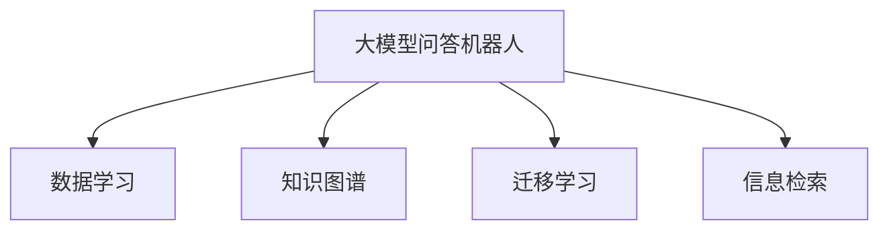

                 

# 大模型问答机器人的数据学习

## 1. 背景介绍

### 1.1 问题由来

随着人工智能技术的快速发展，智能问答机器人（QA Robot）在各个领域的应用日益广泛。它们能够根据用户提出的自然语言问题，自动检索、推理并返回答案，极大地提升了用户体验。

然而，尽管问答机器人已经取得了一定成就，但仍存在许多挑战。其中最核心的难题之一是模型的训练数据。高质量的数据集对于训练出性能优越的问答机器人至关重要，但数据获取和标注过程往往既耗时又成本高昂。

基于此，本文将深入探讨大模型问答机器人的数据学习过程，从理论到实践，全面解析如何高效、高质量地获取和利用数据，以提升问答机器人的性能。

## 2. 核心概念与联系

### 2.1 核心概念概述

在进行数据学习前，我们先来梳理一些关键概念及其联系：

- **大模型问答机器人**：指利用深度学习技术，特别是预训练大语言模型（如GPT、BERT等）构建的智能问答系统。大模型通过海量数据预训练，具备强大的语言理解和生成能力，能够对各种复杂问题给出答案。

- **数据学习**：指从数据中提取知识，更新模型参数，提升模型性能的过程。数据学习是问答机器人训练的核心，包括数据准备、特征提取、模型训练和调优等环节。

- **知识图谱**：一种结构化表示实体与实体间关系的语义网络。知识图谱被广泛应用于问答机器人中，帮助模型理解问题的语义并找到准确答案。

- **迁移学习**：指将一个领域学习到的知识，迁移应用到另一个不同但相关的领域的学习范式。在大模型问答机器人中，通过在通用语言模型上进行微调，可以提升特定领域问题处理的性能。

- **信息检索**：指从大规模数据集中找到与问题最相关的信息片段。信息检索是问答机器人的核心能力之一，利用搜索结果辅助模型进行推理。

这些核心概念之间的逻辑关系可以通过以下Mermaid流程图来展示：



这个流程图展示了问答机器人的核心组件及其相互关系：

1. 大模型问答机器人通过数据学习从数据中提取知识，并更新模型。
2. 知识图谱用于提高机器人的推理能力。
3. 迁移学习帮助机器人将通用知识迁移到特定领域。
4. 信息检索帮助机器人从海量的文本数据中快速定位答案。

## 3. 核心算法原理 & 具体操作步骤

### 3.1 算法原理概述

问答机器人的核心算法是深度学习模型，特别是预训练大语言模型。其核心原理是从大规模文本数据中学习语言的表示，然后通过微调适应特定问答任务。

具体而言，问答机器人首先在大规模语料库上预训练一个大语言模型，如BERT或GPT。然后，在问答任务的少量标注数据上微调该模型，通过优化损失函数提升模型对特定问题生成的准确性。

### 3.2 算法步骤详解

问答机器人的数据学习主要包括以下几个步骤：

**Step 1: 数据准备与预处理**

- **数据收集**：从公开数据集、网络爬虫或用户交互中获取问答对。
- **数据清洗**：去除噪声、无关信息，确保数据质量。
- **数据标注**：为问答对进行手动标注，确保每个问题都有明确的答案。
- **数据划分**：将数据划分为训练集、验证集和测试集。

**Step 2: 特征提取与表示学习**

- **分词与向量化**：将文本数据分词并转换为向量表示，可以使用预训练的Word Embedding（如Word2Vec、GloVe）或更先进的Transformer编码器。
- **问题与答案对齐**：将问题与答案通过注意力机制对齐，提取相关特征。
- **知识图谱融合**：将知识图谱与问答数据进行融合，丰富语义信息。

**Step 3: 模型训练与调优**

- **模型选择**：选择合适的深度学习模型，如Transformer、BERT、GPT等。
- **模型微调**：在问答数据上微调模型，通过反向传播更新模型参数。
- **超参数调优**：调整学习率、批大小、迭代次数等超参数，提高模型性能。
- **正则化**：使用L2正则、Dropout等技术，防止模型过拟合。

**Step 4: 模型评估与测试**

- **验证集评估**：在验证集上评估模型性能，调整超参数。
- **测试集测试**：在测试集上测试模型性能，最终评估模型效果。

**Step 5: 部署与应用**

- **模型部署**：将训练好的模型部署到生产环境。
- **用户交互**：与用户进行自然语言交互，生成并返回答案。

### 3.3 算法优缺点

问答机器人数据学习的主要优点包括：

1. **效率高**：利用预训练大语言模型，可以快速适应新任务。
2. **性能好**：通过微调，模型能够在大规模文本数据上学习丰富的语言知识。
3. **可扩展性强**：可以轻松扩展到多个领域，覆盖多种问答任务。

然而，该方法也存在一些缺点：

1. **数据依赖性高**：问答机器人的性能高度依赖于问答数据的数量和质量。
2. **知识图谱构建复杂**：知识图谱的构建需要大量人工标注，成本高昂。
3. **模型复杂度高**：大规模语言模型的复杂度较高，训练和推理速度较慢。
4. **可解释性差**：黑箱模型难以解释其决策过程，缺乏透明性。

## 4. 数学模型和公式 & 详细讲解

### 4.1 数学模型构建

假设问答机器人使用BERT作为预训练模型，并在问答数据集上进行微调。

**输入**：问题 $q$ 和答案 $a$。
**输出**：模型生成的答案 $\hat{a}$。

模型可以表示为：

$$
\hat{a} = M(q; \theta)
$$

其中 $M$ 为微调后的BERT模型，$\theta$ 为模型参数。

**损失函数**：使用交叉熵损失函数来衡量模型输出与真实答案的差异：

$$
\mathcal{L} = -\sum_{i=1}^{N} \log P(\hat{a}_i = a_i)
$$

其中 $P$ 为模型对答案的预测概率。

### 4.2 公式推导过程

以BERT为例，其微调过程可以表示为：

1. **编码器前向传播**：将问题 $q$ 和答案 $a$ 输入BERT编码器，得到上下文表示 $c$。
2. **注意力机制**：计算问题 $q$ 对上下文表示 $c$ 的注意力权重 $w$。
3. **答案预测**：将问题 $q$ 和注意力权重 $w$ 输入全连接层，得到预测答案 $\hat{a}$。
4. **交叉熵损失**：计算预测答案 $\hat{a}$ 与真实答案 $a$ 的交叉熵损失。
5. **反向传播**：根据交叉熵损失，反向传播更新模型参数 $\theta$。

### 4.3 案例分析与讲解

以问答机器人解决“美国首都”问题为例：

1. **数据准备**：收集包含“美国首都”问题的问答对，进行手动标注。
2. **模型微调**：使用BERT作为预训练模型，在问题 $q$ 和答案 $a$ 上微调，得到模型参数 $\theta$。
3. **验证集评估**：在验证集上评估模型性能，调整学习率、批大小等超参数。
4. **测试集测试**：在测试集上测试模型性能，得到最终评估结果。

## 5. 项目实践：代码实例和详细解释说明

### 5.1 开发环境搭建

在使用PyTorch进行问答机器人的数据学习时，需要先配置开发环境：

1. 安装Anaconda：`conda create -n pytorch-env python=3.8`
2. 激活虚拟环境：`conda activate pytorch-env`
3. 安装PyTorch：`pip install torch torchvision torchaudio cudatoolkit=11.1`
4. 安装Transformers库：`pip install transformers`
5. 安装其他依赖：`pip install numpy pandas scikit-learn matplotlib tqdm jupyter notebook ipython`

### 5.2 源代码详细实现

下面以BERT问答机器人为例，展示完整的代码实现过程：

```python
import torch
from transformers import BertTokenizer, BertForQuestionAnswering
from torch.utils.data import Dataset, DataLoader

class QADataset(Dataset):
    def __init__(self, texts, answers, tokenizer):
        self.tokenizer = tokenizer
        self.texts = texts
        self.answers = answers
        
    def __len__(self):
        return len(self.texts)
    
    def __getitem__(self, idx):
        question = self.texts[idx]
        answer = self.answers[idx]
        
        encoding = self.tokenizer(question, answer, return_tensors='pt', max_length=512, padding='max_length', truncation=True)
        input_ids = encoding['input_ids'][0]
        attention_mask = encoding['attention_mask'][0]
        start_idx = encoding['start_positions'][0]
        end_idx = encoding['end_positions'][0]
        
        return {'input_ids': input_ids, 
                'attention_mask': attention_mask,
                'start_idx': start_idx,
                'end_idx': end_idx}

tokenizer = BertTokenizer.from_pretrained('bert-base-cased')
model = BertForQuestionAnswering.from_pretrained('bert-base-cased')

# 数据集
train_dataset = QADataset(train_texts, train_answers, tokenizer)
dev_dataset = QADataset(dev_texts, dev_answers, tokenizer)
test_dataset = QADataset(test_texts, test_answers, tokenizer)

# 数据加载器
train_loader = DataLoader(train_dataset, batch_size=16, shuffle=True)
dev_loader = DataLoader(dev_dataset, batch_size=16, shuffle=False)
test_loader = DataLoader(test_dataset, batch_size=16, shuffle=False)

# 训练循环
epochs = 3
for epoch in range(epochs):
    model.train()
    for batch in train_loader:
        input_ids = batch['input_ids'].to(device)
        attention_mask = batch['attention_mask'].to(device)
        start_idx = batch['start_idx'].to(device)
        end_idx = batch['end_idx'].to(device)
        outputs = model(input_ids, attention_mask=attention_mask, start_positions=start_idx, end_positions=end_idx)
        loss = outputs.loss
        loss.backward()
        optimizer.step()
        optimizer.zero_grad()
    
    model.eval()
    with torch.no_grad():
        for batch in dev_loader:
            input_ids = batch['input_ids'].to(device)
            attention_mask = batch['attention_mask'].to(device)
            start_idx = batch['start_idx'].to(device)
            end_idx = batch['end_idx'].to(device)
            outputs = model(input_ids, attention_mask=attention_mask, start_positions=start_idx, end_positions=end_idx)
            loss = outputs.loss
        
    print(f"Epoch {epoch+1}, dev loss: {loss.item()}")

# 测试循环
with torch.no_grad():
    for batch in test_loader:
        input_ids = batch['input_ids'].to(device)
        attention_mask = batch['attention_mask'].to(device)
        start_idx = batch['start_idx'].to(device)
        end_idx = batch['end_idx'].to(device)
        outputs = model(input_ids, attention_mask=attention_mask, start_positions=start_idx, end_positions=end_idx)
        loss = outputs.loss
        
    print(f"Test loss: {loss.item()}")
```

### 5.3 代码解读与分析

这段代码主要实现了BERT问答机器人的微调过程：

- **数据准备**：通过定义 `QADataset` 类，对问答对进行分词和向量表示，并加入开始和结束位置。
- **模型初始化**：使用 `BertTokenizer` 和 `BertForQuestionAnswering` 加载预训练的BERT模型。
- **训练循环**：在每个epoch内，使用训练数据集进行前向传播和反向传播，更新模型参数。
- **验证集评估**：在验证集上评估模型性能，记录损失值。
- **测试集测试**：在测试集上测试模型性能，记录损失值。

## 6. 实际应用场景

### 6.1 智能客服系统

智能客服系统是问答机器人最常见的应用场景之一。通过问答机器人，企业可以自动化处理大量客户咨询，提升响应速度和满意度。

在实际应用中，企业可以收集用户的历史咨询记录，并对其进行标注。然后将标注数据输入问答机器人进行微调，使其能够识别和回答常见问题。用户咨询时，系统自动调用问答机器人，生成并返回答案，大大减轻了客服人员的工作负担。

### 6.2 医疗问答系统

医疗问答系统可以帮助患者快速获取医学知识，减少就医时间和成本。通过微调，问答机器人能够理解各种医学问题，并从中提取关键信息，给出准确的答案。

在实际应用中，医疗问答系统可以与电子健康记录（EHR）系统集成，根据患者的历史病历和当前症状，给出个性化的医疗建议。医生可以根据这些建议，进行更精准的诊断和治疗。

### 6.3 教育问答平台

教育问答平台可以帮助学生解答各种学习问题，提升学习效率。通过微调，问答机器人能够理解学生的各种学习问题，并给出详细的解答。

在实际应用中，教育问答平台可以集成到学校的学习管理系统（LMS）中，帮助学生解决学习中的疑惑，提高学习效果。教师可以通过平台反馈，了解学生的学习情况，进行针对性的辅导。

### 6.4 未来应用展望

未来，问答机器人将在更多领域得到广泛应用，其发展趋势如下：

1. **多模态问答**：通过融合图像、语音、文本等多种模态信息，提升问答机器人的智能化水平。
2. **自监督学习**：利用无标注数据进行自监督学习，减少对大量标注数据的依赖。
3. **深度融合知识图谱**：构建更加精确的知识图谱，提升问答机器人的推理能力。
4. **端到端训练**：通过端到端训练，减少数据预处理和特征提取的复杂度。
5. **实时交互**：通过实时交互技术，提升问答机器人的响应速度和用户体验。

这些趋势将进一步拓展问答机器人的应用边界，使其在各个领域发挥更大的作用。

## 7. 工具和资源推荐

### 7.1 学习资源推荐

1. **《深度学习问答系统》**：张晓刚教授的书籍，全面介绍了问答系统的原理和实现。
2. **CS224N《深度学习自然语言处理》课程**：斯坦福大学开设的NLP明星课程，讲解了问答系统的前沿技术。
3. **《自然语言处理入门》**：李航教授的书籍，介绍了问答系统的基础知识和经典算法。
4. **HuggingFace官方文档**：提供了丰富的问答系统资源和样例代码。
5. **Arxiv论文**：收录了大量高质量的问答系统论文，涵盖各类任务和算法。

### 7.2 开发工具推荐

1. **PyTorch**：基于Python的开源深度学习框架，支持动态计算图。
2. **TensorFlow**：由Google主导开发的深度学习框架，支持分布式训练。
3. **Transformers**：HuggingFace开发的NLP工具库，集成了大量预训练模型。
4. **TensorBoard**：TensorFlow配套的可视化工具，实时监测模型训练状态。
5. **Weights & Biases**：实验跟踪工具，记录模型训练过程中的各项指标。

### 7.3 相关论文推荐

1. **BERT: Pre-training of Deep Bidirectional Transformers for Language Understanding**：提出BERT模型，引入自监督学习任务，刷新了多项NLP任务SOTA。
2. **Attention is All You Need**：提出Transformer结构，开启了NLP领域的预训练大模型时代。
3. **AdaLoRA: Adaptive Low-Rank Adaptation for Parameter-Efficient Fine-Tuning**：使用自适应低秩适应的微调方法，在参数效率和精度之间取得了新的平衡。
4. **Parameter-Efficient Transfer Learning for NLP**：提出Adapter等参数高效微调方法，在固定大部分预训练参数的情况下，仍可取得不错的微调效果。
5. **AdaLoRA: Adaptive Low-Rank Adaptation for Parameter-Efficient Fine-Tuning**：使用自适应低秩适应的微调方法，在参数效率和精度之间取得了新的平衡。

这些论文代表了大模型问答机器人的发展脉络，涵盖了数据学习、模型设计、超参数调优等多个方面。

## 8. 总结：未来发展趋势与挑战

### 8.1 研究成果总结

大模型问答机器人通过数据学习，利用预训练大语言模型，提升了问答任务的性能。其主要研究成果包括：

1. **高效数据处理**：通过数据增强、知识图谱融合等技术，提升数据质量。
2. **模型优化**：通过超参数调优、正则化等技术，提升模型性能。
3. **实际应用**：在智能客服、医疗问答、教育平台等多个领域取得成功应用。

### 8.2 未来发展趋势

1. **多模态问答**：融合图像、语音、文本等多种模态信息，提升问答系统的智能化水平。
2. **自监督学习**：利用无标注数据进行自监督学习，减少对大量标注数据的依赖。
3. **深度融合知识图谱**：构建更加精确的知识图谱，提升问答系统的推理能力。
4. **端到端训练**：减少数据预处理和特征提取的复杂度，提升训练效率。
5. **实时交互**：通过实时交互技术，提升问答系统的响应速度和用户体验。

### 8.3 面临的挑战

1. **数据获取难度大**：高质量数据集难以获取，限制了问答系统的性能。
2. **知识图谱构建复杂**：需要大量人工标注，成本高昂。
3. **模型复杂度高**：大规模语言模型的复杂度较高，训练和推理速度较慢。
4. **可解释性差**：黑箱模型难以解释其决策过程，缺乏透明性。
5. **数据隐私问题**：问答系统需要处理大量用户数据，存在隐私泄露的风险。

### 8.4 研究展望

1. **端到端训练**：通过端到端训练，减少数据预处理和特征提取的复杂度。
2. **知识增强**：利用外部知识库和规则库，提升问答系统的推理能力。
3. **隐私保护**：通过差分隐私等技术，保护用户数据隐私。
4. **自监督学习**：利用无标注数据进行自监督学习，减少对大量标注数据的依赖。
5. **多模态融合**：融合图像、语音、文本等多种模态信息，提升问答系统的智能化水平。

## 9. 附录：常见问题与解答

**Q1：问答机器人如何处理噪声数据？**

A: 噪声数据是问答机器人面临的常见问题。为了处理噪声数据，可以使用数据清洗技术，如去重、过滤无关信息等。另外，可以通过数据增强技术，生成更多的噪声样本，增加模型对噪声的鲁棒性。

**Q2：问答机器人如何融合知识图谱？**

A: 知识图谱的融合可以通过以下步骤实现：
1. 构建知识图谱，提取实体和关系。
2. 将知识图谱转换为向量表示。
3. 将知识图谱与问答数据进行融合，利用注意力机制提取相关知识。
4. 将融合后的知识向量输入模型进行推理。

**Q3：问答机器人如何进行端到端训练？**

A: 端到端训练可以简化数据预处理和特征提取的复杂度，提升训练效率。具体步骤包括：
1. 将问答数据转换为模型可直接处理的格式。
2. 将问题与答案拼接，构建输入样本。
3. 利用端到端模型直接训练，减少中间步骤。

**Q4：问答机器人如何提升推理能力？**

A: 提升推理能力可以通过以下方法实现：
1. 构建精确的知识图谱，提供更多的语义信息。
2. 利用自监督学习，学习更多的推理规则。
3. 引入专家知识，指导模型的推理过程。

**Q5：问答机器人如何优化超参数？**

A: 超参数的优化可以通过以下方法实现：
1. 使用网格搜索或随机搜索，尝试不同的超参数组合。
2. 利用贝叶斯优化，找到最优超参数。
3. 使用自动机器学习工具，自动调整超参数。

通过这些技术，问答机器人可以更好地处理噪声数据，提升推理能力，优化超参数，从而实现更高的性能和更好的用户体验。

---

作者：禅与计算机程序设计艺术 / Zen and the Art of Computer Programming

