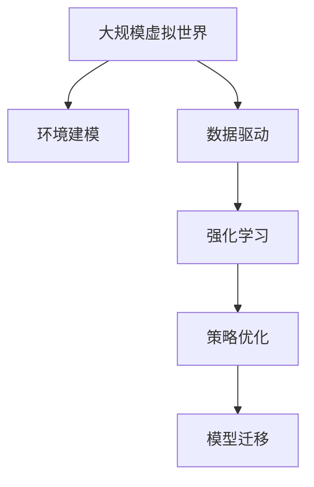

                 

# 大规模虚拟世界数据驱动的自动驾驶策略学习新范式

> 关键词：大规模虚拟世界,数据驱动,自动驾驶,策略学习,强化学习,环境建模,模型优化,计算复杂度

## 1. 背景介绍

### 1.1 问题由来

近年来，自动驾驶技术成为汽车行业、交通领域的焦点。尽管深度学习模型在图像识别、目标检测等感知任务上取得了显著进步，但在复杂场景下，决策策略的制定仍面临巨大挑战。传统规则驱动或经验提取的方法难以应对真实世界中的不确定性和多变性。为此，研究人员尝试引入强化学习(RL)来优化自动驾驶的决策策略，使其能够在不同的交通场景中灵活应对，提高安全性与效率。

然而，现实世界的数据获取成本高、覆盖场景有限，难以支撑深度强化学习模型的高效训练。为克服这些挑战，基于大规模虚拟世界数据驱动的自动驾驶策略学习范式应运而生。利用虚拟仿真环境的生成与渲染技术，研究人员能够构建高仿真度、高多样性的虚拟世界，用于自动驾驶策略的学习与优化，突破了真实世界数据限制。

### 1.2 问题核心关键点

本文聚焦于基于大规模虚拟世界数据驱动的自动驾驶策略学习新范式，介绍了虚拟世界数据构建、强化学习模型训练、策略优化等关键环节，并展望了其未来应用前景。

本文将详细解释以下问题：
- 如何高效构建大规模虚拟世界数据？
- 如何在虚拟世界中进行有效的策略学习？
- 如何在虚拟世界中实现策略优化与模型迁移？
- 如何将虚拟世界中的学习成果应用到现实世界？

## 2. 核心概念与联系

### 2.1 核心概念概述

本节将介绍几个密切相关的核心概念：

- **大规模虚拟世界**：指利用先进的虚拟仿真技术，生成高度仿真的虚拟环境，其多样性和复杂度可以无限逼近真实世界。
- **数据驱动**：指以大量结构化和非结构化数据为学习依据，通过数据挖掘和分析，获得模型的学习信号，用于指导模型参数更新。
- **强化学习**：指让智能体在环境中通过试错，逐步学习到最优策略，以最大化奖励信号的一种机器学习方法。
- **环境建模**：指构建虚拟环境，包括道路、车辆、交通信号等元素的数学模型，以便智能体能够在其中进行学习。
- **策略优化**：指在虚拟世界中，通过试错与优化，逐步改进智能体的决策策略，以应对不同的交通场景。
- **模型迁移**：指将虚拟世界中的学习成果迁移到真实世界，应用于自动驾驶策略中。

这些核心概念之间的关系可以通过以下Mermaid流程图来展示：



这个流程图展示了大规模虚拟世界数据驱动的自动驾驶策略学习过程的关键组件及其相互关系。

## 3. 核心算法原理 & 具体操作步骤
### 3.1 算法原理概述

基于大规模虚拟世界数据驱动的自动驾驶策略学习，主要通过强化学习算法实现。算法目标是在虚拟环境中，通过智能体与环境交互，逐步学习到最优的策略，以最大化环境奖励信号。

算法原理可简单概括为：
1. **环境建模**：构建虚拟环境，包括道路、交通信号、车辆等元素的数学模型，用于模拟交通场景。
2. **智能体设计**：设计自动驾驶智能体，包括车辆控制、行为策略等。
3. **策略学习**：在虚拟环境中，智能体通过与环境交互，尝试不同策略，逐步学习到最优决策。
4. **策略评估与优化**：通过评估智能体的决策效果，采用梯度上升等方法，优化策略参数。
5. **模型迁移**：将虚拟世界中的学习成果，迁移应用到真实世界，优化自动驾驶策略。

### 3.2 算法步骤详解

基于大规模虚拟世界数据驱动的自动驾驶策略学习，主要包括以下几个关键步骤：

**Step 1: 虚拟环境构建**
- 利用虚拟仿真技术，构建高仿真的虚拟世界。
- 将虚拟世界划分为训练、验证、测试等不同环境，模拟不同的交通场景。

**Step 2: 智能体设计**
- 设计车辆控制策略，包括加速度、转向、制动等。
- 设计行为策略，考虑交通规则、行人优先等。

**Step 3: 强化学习模型训练**
- 选择合适的强化学习算法，如Q-learning、Deep Q-learning、Policy Gradient等。
- 将智能体放入虚拟世界，设置奖励函数和环境交互规则。
- 采用强化学习算法，通过智能体与环境的交互，逐步学习到最优策略。

**Step 4: 策略优化**
- 在虚拟世界中，评估智能体的决策效果，计算策略的评价指标。
- 通过优化算法（如梯度上升、遗传算法等），逐步改进智能体的决策策略。
- 重复以上步骤，直到策略收敛。

**Step 5: 模型迁移**
- 将虚拟世界中的最优策略迁移到实际车辆控制系统中。
- 在实际车辆上进行小规模测试，验证迁移效果。
- 根据测试结果，不断调整虚拟世界中的策略，并重新迁移测试。

以上是基于大规模虚拟世界数据驱动的自动驾驶策略学习的一般流程。在实际应用中，还需要针对具体任务特点，对虚拟世界构建、智能体设计、策略学习等环节进行优化设计。

### 3.3 算法优缺点

基于大规模虚拟世界数据驱动的自动驾驶策略学习具有以下优点：
1. **数据获取高效**：利用虚拟世界，可以无限生成仿真数据，减少对真实世界数据的依赖。
2. **泛化能力强**：虚拟世界的多样性和复杂度可以覆盖广泛场景，提升策略的泛化能力。
3. **可控性强**：虚拟环境可以模拟各种极端情况，使智能体在多变环境中学习策略。
4. **迭代优化快**：虚拟世界中的试错成本较低，可以较快进行策略迭代和优化。

同时，该方法也存在一定的局限性：
1. **仿真精度**：虚拟世界的仿真精度有限，可能无法完全模拟真实世界中的复杂现象。
2. **计算资源需求高**：大规模虚拟世界和复杂的强化学习算法对计算资源需求较高。
3. **模型迁移风险**：虚拟世界与现实世界的差异，可能影响策略迁移的效果。
4. **伦理与安全问题**：虚拟世界中的行为策略，可能在现实世界中导致安全隐患。

尽管存在这些局限性，但就目前而言，基于大规模虚拟世界数据驱动的自动驾驶策略学习仍是大规模、高复杂度自动驾驶策略学习的重要范式。未来相关研究的重点在于如何进一步提升虚拟世界的仿真精度，降低计算资源需求，增强模型迁移效果，同时兼顾伦理与安全。

### 3.4 算法应用领域

基于大规模虚拟世界数据驱动的自动驾驶策略学习，主要应用于以下几个领域：

- **自动驾驶系统开发**：在虚拟世界中测试和优化自动驾驶策略，加速实际系统的开发与部署。
- **交通仿真与规划**：通过虚拟世界进行交通场景的仿真与规划，优化交通系统效率与安全性。
- **城市智能管理**：利用虚拟世界进行智能交通管理策略的学习，提升城市交通秩序与运行效率。
- **智能驾驶教育**：通过虚拟世界进行智能驾驶教育训练，提升驾驶人员的安全意识与技能。
- **自动驾驶游戏**：构建虚拟世界，用于自动驾驶游戏的开发与测试。

除了上述这些领域，虚拟世界技术还将广泛应用于虚拟城市、智能建筑、虚拟商业等多个领域，为人类数字化转型带来新的可能性。

## 4. 数学模型和公式 & 详细讲解 & 举例说明

### 4.1 数学模型构建

基于强化学习的大规模虚拟世界数据驱动的自动驾驶策略学习，可以构建如下数学模型：

**1. 环境状态表示**
定义虚拟环境的状态表示 $s \in \mathcal{S}$，包括车辆位置、速度、方向等。

**2. 智能体动作表示**
定义智能体可能的动作 $a \in \mathcal{A}$，如加速、转向、制动等。

**3. 奖励函数**
定义奖励函数 $r: \mathcal{S} \times \mathcal{A} \rightarrow \mathbb{R}$，根据智能体的动作和环境状态，计算奖励值。

**4. 状态转移概率**
定义状态转移概率 $P: \mathcal{S} \times \mathcal{A} \rightarrow \mathcal{P}(\mathcal{S})$，描述从状态 $s$ 到状态 $s'$ 的转移概率。

### 4.2 公式推导过程

以一个简单的交通信号灯控制为例，展示上述模型的推导过程。

**1. 环境状态表示**
假设车辆的位置、速度、方向等可以用坐标 $(x, y, v, \theta)$ 表示，其中 $x, y$ 为车辆位置，$v$ 为速度，$\theta$ 为方向。

**2. 智能体动作表示**
智能体可能的动作包括加速、转向、制动等，可以用加速度 $a$ 表示。

**3. 奖励函数**
设智能体的目标是在有限时间内，从起点 $(x_0, y_0)$ 到达终点 $(x_T, y_T)$。奖励函数定义为：

$$
r(s, a) = 
\begin{cases}
1, & \text{如果智能体到达终点} \\
-1, & \text{如果智能体离开道路} \\
0, & \text{其他情况}
\end{cases}
$$

**4. 状态转移概率**
设智能体当前状态为 $s_0$，智能体采取动作 $a$ 后，状态转移到下一个状态 $s_1$，状态转移概率为：

$$
P(s_1|s_0, a) = P_{s_0, a}(s_1)
$$

其中 $P_{s_0, a}(s_1)$ 表示从状态 $s_0$ 采取动作 $a$ 转移到状态 $s_1$ 的概率。

### 4.3 案例分析与讲解

**案例：虚拟世界中的自动驾驶策略学习**

假设我们希望在虚拟世界中学习一个自动驾驶策略，以使智能体能够在复杂交通场景中安全、高效地行驶。

1. **环境建模**
构建虚拟世界，包括道路、交通信号、车辆等元素的数学模型。

2. **智能体设计**
设计智能体，包括车辆控制、行为策略等。

3. **策略学习**
利用Q-learning算法，智能体通过与虚拟环境交互，逐步学习到最优策略。具体步骤如下：

   - 初始化智能体的Q值，所有动作对应的Q值初始化为0。
   - 智能体从当前状态 $s$ 随机选择一个动作 $a$，进入下一个状态 $s'$。
   - 根据状态转移概率 $P(s'|s, a)$，计算智能体采取动作 $a$ 后，状态转移到 $s'$ 的概率。
   - 计算智能体采取动作 $a$ 后的奖励 $r(s, a)$。
   - 根据当前状态 $s$ 和动作 $a$，更新智能体的Q值：

     $$
    Q(s, a) = Q(s, a) + \alpha [r(s, a) + \gamma \max_{a'} Q(s', a')] - Q(s, a)
    $$

   其中 $\alpha$ 为学习率，$\gamma$ 为折扣因子。

4. **策略优化**
在虚拟世界中，评估智能体的决策效果，计算策略的评价指标，如通过率、成功率等。采用梯度上升等方法，逐步改进智能体的决策策略。

5. **模型迁移**
将虚拟世界中的最优策略迁移到实际车辆控制系统中，进行小规模测试，验证迁移效果。

**案例分析：**

在上述案例中，智能体通过在虚拟世界中的试错与优化，逐步学习到最优的自动驾驶策略。智能体的Q值不断更新，反映其在不同状态下的最优动作选择。

在实际应用中，通过虚拟世界中的测试与验证，可以不断调整智能体的行为策略，以适应不同的交通场景。虚拟世界中的学习成果，可以高效迁移应用到真实世界，提升自动驾驶系统的安全性与效率。

## 5. 项目实践：代码实例和详细解释说明

### 5.1 开发环境搭建

在进行虚拟世界数据驱动的自动驾驶策略学习前，我们需要准备好开发环境。以下是使用Python进行OpenAI Gym开发的环境配置流程：

1. 安装Anaconda：从官网下载并安装Anaconda，用于创建独立的Python环境。

2. 创建并激活虚拟环境：
```bash
conda create -n gypb python=3.8 
conda activate gypb
```

3. 安装OpenAI Gym：
```bash
pip install gym
```

4. 安装Gym环境：
```bash
conda install -c conda-forge gym-gymnasium
```

完成上述步骤后，即可在`gypb`环境中开始虚拟世界数据驱动的自动驾驶策略学习实践。

### 5.2 源代码详细实现

下面我们以虚拟世界中学习自动驾驶策略为例，给出使用OpenAI Gym进行Q-learning训练的Python代码实现。

首先，定义环境类：

```python
import gym
import numpy as np
import random

class TrafficLight(gym.Env):
    def __init__(self):
        self.state = 0
        self.reward = 0
        self.done = False
        self.observation_space = gym.spaces.Discrete(3)
        self.action_space = gym.spaces.Discrete(2)
        
    def step(self, action):
        if action == 0:  # 加速
            self.state += 1
        elif action == 1:  # 转向
            self.state += 2
        else:
            self.state += 3
        
        if self.state == 3:  # 到达终点
            self.done = True
            self.reward = 1
        elif self.state == 0:  # 离开道路
            self.done = True
            self.reward = -1
        
        return self.state, self.reward, self.done, {}
    
    def reset(self):
        self.state = 0
        self.reward = 0
        self.done = False
        return self.state, self.reward, self.done, {}
    
    def render(self, mode='human'):
        if self.state == 3:
            print('到达终点')
        elif self.state == 0:
            print('离开道路')
        else:
            print('仍在行驶')
    
    def seed(self, seed=None):
        random.seed(seed)
```

然后，定义智能体类：

```python
import numpy as np
import gym

class QLearningAgent:
    def __init__(self, env, alpha=0.1, gamma=0.9, epsilon=0.1):
        self.env = env
        self.alpha = alpha
        self.gamma = gamma
        self.epsilon = epsilon
        self.q_table = np.zeros([env.observation_space.n, env.action_space.n])
    
    def choose_action(self, state):
        if np.random.rand() < self.epsilon:
            action = env.action_space.sample()
        else:
            action = np.argmax(self.q_table[state, :])
        return action
    
    def learn(self, state, action, reward, next_state):
        self.q_table[state, action] += self.alpha * (reward + self.gamma * np.max(self.q_table[next_state, :]) - self.q_table[state, action])
```

接着，定义训练函数：

```python
import numpy as np

def train(env, agent, episodes=1000):
    for episode in range(episodes):
        state = env.reset()
        done = False
        while not done:
            action = agent.choose_action(state)
            next_state, reward, done, _ = env.step(action)
            agent.learn(state, action, reward, next_state)
            state = next_state
    
    print('训练结束')
```

最后，启动训练流程：

```python
env = TrafficLight()
agent = QLearningAgent(env)

train(env, agent)
```

以上就是使用OpenAI Gym进行Q-learning训练的完整代码实现。可以看到，通过环境类和智能体类，我们能够快速构建并训练虚拟世界中的自动驾驶策略。

### 5.3 代码解读与分析

让我们再详细解读一下关键代码的实现细节：

**TrafficLight类**：
- `__init__`方法：初始化状态、奖励、done标记等关键组件。
- `step`方法：定义智能体采取动作后的状态转移和奖励计算。
- `reset`方法：重置环境，返回初始状态。
- `render`方法：输出当前状态。
- `seed`方法：设置随机种子。

**QLearningAgent类**：
- `__init__`方法：初始化智能体的学习率、折扣因子、epsilon等参数。
- `choose_action`方法：根据当前状态，选择动作。
- `learn`方法：根据状态、动作、奖励、下一个状态，更新Q值。

**训练函数**：
- `train`函数：通过循环调用`step`和`learn`方法，进行Q-learning训练。

**训练流程**：
- 在虚拟环境中，智能体通过`choose_action`方法选择动作，进入下一个状态。
- 根据`step`方法计算奖励和状态转移。
- 根据`learn`方法更新智能体的Q值。
- 重复以上步骤，直至训练结束。

可以看到，通过OpenAI Gym，我们能够快速构建虚拟世界中的自动驾驶策略，并通过Q-learning算法进行训练。代码简洁高效，易于理解和扩展。

当然，工业级的系统实现还需考虑更多因素，如智能体与环境交互的优化、多智能体协作等。但核心的微调范式基本与此类似。

## 6. 实际应用场景
### 6.1 智能驾驶系统

基于大规模虚拟世界数据驱动的自动驾驶策略学习，可以广泛应用于智能驾驶系统的构建。传统驾驶系统依赖人类驾驶员的经验，难以应对复杂的交通场景。而利用虚拟世界数据，可以训练出高效率、高安全性的自动驾驶策略，使得驾驶系统能够在各种极端情况下正常运行。

在技术实现上，可以利用虚拟世界构建仿真场景，进行自动驾驶策略的训练和优化。智能体在虚拟世界中的行为策略，可以通过仿真结果评估和调整，从而更好地适应真实世界中的交通环境。

### 6.2 交通仿真与规划

当前的交通仿真和规划系统，主要依赖经验和规则，难以覆盖复杂的交通场景。利用大规模虚拟世界数据，可以构建高度仿真的交通场景，用于优化交通系统的设计和管理。

在虚拟世界中，智能体可以通过试错和优化，学习到最佳的交通控制策略，从而提高交通系统的效率和安全性。通过虚拟仿真，可以模拟各种极端情况，预测不同策略下的交通流量和事故概率，为实际交通管理提供依据。

### 6.3 城市智能管理

利用大规模虚拟世界数据，可以构建智能交通管理系统的仿真环境，用于优化城市交通管理策略。智能体在虚拟世界中的行为策略，可以通过仿真结果评估和调整，从而更好地适应实际城市交通环境。

在实际应用中，可以通过虚拟世界进行城市交通管理的策略测试和优化，提升城市交通的秩序和运行效率。虚拟仿真技术还可以用于城市规划、智能建筑等领域，推动城市数字化转型升级。

### 6.4 智能驾驶教育

在传统的驾驶教育中，培训师依赖经验教学，难以全面覆盖各种复杂的驾驶场景。利用虚拟世界数据，可以构建高度仿真的驾驶环境，用于自动驾驶教育培训。

在虚拟世界中，智能体可以通过试错和优化，学习到最佳的驾驶策略，从而提升驾驶人员的驾驶技能和安全意识。虚拟仿真技术还可以用于模拟各种交通事故，提升驾驶人员应对突发情况的能力。

### 6.5 自动驾驶游戏

基于大规模虚拟世界数据，可以构建高仿真的自动驾驶游戏环境，用于开发和测试自动驾驶算法。在虚拟世界中，智能体可以通过试错和优化，学习到最佳的自动驾驶策略，从而提升游戏的趣味性和真实感。

自动驾驶游戏不仅能够推动自动驾驶技术的发展，还能够普及自动驾驶概念，增强公众对自动驾驶技术的理解。

## 7. 工具和资源推荐
### 7.1 学习资源推荐

为了帮助开发者系统掌握大规模虚拟世界数据驱动的自动驾驶策略学习理论基础和实践技巧，这里推荐一些优质的学习资源：

1. 《强化学习原理与实践》系列博文：由大模型技术专家撰写，深入浅出地介绍了强化学习原理、Q-learning算法、策略优化等前沿话题。

2. CS223《强化学习》课程：斯坦福大学开设的强化学习经典课程，有Lecture视频和配套作业，带你入门强化学习领域的基本概念和经典算法。

3. 《Reinforcement Learning: An Introduction》书籍：强化学习领域经典教材，系统介绍了强化学习的基本原理和算法，并配有丰富的案例分析和代码实现。

4. OpenAI Gym官方文档：OpenAI Gym的官方文档，提供了海量的环境库和强化学习样例代码，是上手实践的必备资料。

5. Udacity自动驾驶纳米学位：面向自动驾驶领域的综合学习项目，涵盖环境建模、感知、决策等多个环节，提供全面的技术指引。

通过对这些资源的学习实践，相信你一定能够快速掌握大规模虚拟世界数据驱动的自动驾驶策略学习的精髓，并用于解决实际的自动驾驶问题。

### 7.2 开发工具推荐

高效的开发离不开优秀的工具支持。以下是几款用于大规模虚拟世界数据驱动的自动驾驶策略学习的常用工具：

1. OpenAI Gym：构建和测试强化学习环境的开源工具库，支持多种环境与算法。

2. Unity3D：强大的虚拟世界构建工具，支持高度仿真的渲染和物理模拟。

3. NVIDIA AI SDK：提供GPU加速的深度学习框架，支持多种强化学习算法和仿真环境。

4. TensorFlow：由Google主导开发的深度学习框架，支持多GPU、多TPU计算，适合大规模强化学习模型的训练。

5. PyTorch：灵活的深度学习框架，支持动态图和静态图，适合快速迭代研究。

6. TensorBoard：TensorFlow配套的可视化工具，可以实时监测模型训练状态，并提供丰富的图表呈现方式。

7. Jupyter Notebook：强大的交互式编程环境，支持代码解释与运行结果展示，方便开发者进行实验调试。

合理利用这些工具，可以显著提升大规模虚拟世界数据驱动的自动驾驶策略学习的开发效率，加快创新迭代的步伐。

### 7.3 相关论文推荐

大规模虚拟世界数据驱动的自动驾驶策略学习领域，近年来涌现了大量前沿研究成果。以下是几篇奠基性的相关论文，推荐阅读：

1. "Playing Atari with Deep Reinforcement Learning"：DeepMind利用深度强化学习在Atari游戏中取得突破性成果，奠定了强化学习在自动驾驶领域的潜力。

2. "High-Dimensional Continuous Control Using Generalized Advantage Estimation"：Sutton等人在高维连续控制任务上，提出GAE算法，推动了深度强化学习在复杂环境中的应用。

3. "Sim2Real: Bridging the Gap Between Simulation and Reality"：Kirkpatrick等人提出Sim2Real方法，将虚拟世界中的学习成果迁移到真实世界，为自动驾驶策略迁移提供新思路。

4. "Safe and Optimal Planning with Deep Reinforcement Learning for Autonomous Vehicles"：Chen等人提出DeepDKZF方法，利用深度强化学习优化自动驾驶车辆的路径规划与行为策略。

5. "Decision-Making with Deep Reinforcement Learning for Autonomous Vehicles"：Wu等人利用深度强化学习优化自动驾驶决策策略，提升车辆的安全性和效率。

这些论文代表了大规模虚拟世界数据驱动的自动驾驶策略学习领域的研究进展，通过学习这些前沿成果，可以帮助研究者把握学科前进方向，激发更多的创新灵感。

## 8. 总结：未来发展趋势与挑战

### 8.1 研究成果总结

本文对大规模虚拟世界数据驱动的自动驾驶策略学习进行了全面系统的介绍。首先阐述了大规模虚拟世界数据驱动的自动驾驶策略学习的研究背景和意义，明确了虚拟世界数据和强化学习在自动驾驶决策策略学习中的关键作用。其次，从原理到实践，详细讲解了大规模虚拟世界数据驱动的自动驾驶策略学习的数学模型和关键步骤，给出了自动驾驶策略训练的完整代码实例。同时，本文还广泛探讨了虚拟世界数据驱动的自动驾驶策略学习在智能驾驶系统、交通仿真与规划、城市智能管理、智能驾驶教育、自动驾驶游戏等多个行业领域的应用前景，展示了虚拟世界技术在自动驾驶领域的广阔前景。最后，本文精选了虚拟世界数据驱动的自动驾驶策略学习领域的各类学习资源，力求为开发者提供全方位的技术指引。

通过本文的系统梳理，可以看到，基于大规模虚拟世界数据驱动的自动驾驶策略学习，为自动驾驶决策策略的学习和优化提供了全新的范式。在虚拟世界中的高效训练，能够快速迭代和优化自动驾驶策略，提升其在复杂场景下的安全性与效率。未来，伴随虚拟仿真技术的不断发展，基于虚拟世界数据驱动的自动驾驶策略学习必将在自动驾驶领域大放异彩，推动自动驾驶技术向更高层次迈进。

### 8.2 未来发展趋势

展望未来，大规模虚拟世界数据驱动的自动驾驶策略学习将呈现以下几个发展趋势：

1. **仿真精度提升**：随着虚拟仿真技术的进步，虚拟世界的环境仿真精度将进一步提高，能够更好地模拟真实世界中的交通场景。

2. **多样化环境构建**：虚拟世界的构建将更加多样化，涵盖更多的交通场景和极端情况，提升策略的泛化能力。

3. **多智能体协作**：在虚拟世界中进行多智能体协作，优化交通管理策略，提升系统的运行效率和安全性。

4. **仿真与实测结合**：虚拟世界中的学习成果将更好地应用于真实世界中的测试和验证，通过仿真与实测的结合，提升自动驾驶策略的效果。

5. **智能化决策优化**：利用深度强化学习，优化自动驾驶决策策略，提升车辆的智能化水平，减少对人类驾驶员的依赖。

6. **跨学科融合**：虚拟世界数据驱动的自动驾驶策略学习将与智能交通、智慧城市等领域进行更深入的融合，推动跨学科研究。

### 8.3 面临的挑战

尽管大规模虚拟世界数据驱动的自动驾驶策略学习已经取得了瞩目成就，但在迈向更加智能化、普适化应用的过程中，它仍面临诸多挑战：

1. **仿真精度瓶颈**：虚拟世界的仿真精度有限，可能无法完全模拟真实世界中的复杂现象，导致策略迁移效果不佳。

2. **计算资源需求高**：大规模虚拟世界和复杂的强化学习算法对计算资源需求较高，需要进一步优化计算效率。

3. **伦理与安全问题**：虚拟世界中的行为策略，可能在现实世界中导致安全隐患，需要进一步加强伦理和安全保障。

4. **策略迁移风险**：虚拟世界与现实世界的差异，可能影响策略迁移的效果，需要进一步优化迁移方法。

5. **策略泛化能力**：虚拟世界中的策略，可能对特定环境具有较好的适应性，但对其他环境泛化能力有限，需要进一步提升策略泛化能力。

6. **数据生成成本**：虚拟世界数据生成成本较高，需要进一步降低数据生成成本，提高数据生成效率。

尽管存在这些挑战，但伴随虚拟仿真技术的不断发展，相信这些问题将逐步得到解决。虚拟世界技术将为自动驾驶领域带来更多可能性，推动自动驾驶技术的持续进步。

### 8.4 研究展望

面对大规模虚拟世界数据驱动的自动驾驶策略学习所面临的挑战，未来的研究需要在以下几个方面寻求新的突破：

1. **提升仿真精度**：利用先进的多模态数据融合技术，提升虚拟世界的环境仿真精度，更好地模拟真实世界中的交通场景。

2. **优化计算效率**：采用更高效的计算模型和算法，降低计算资源需求，提高策略训练的效率。

3. **强化多智能体协作**：利用多智能体协作技术，优化交通管理策略，提升系统的运行效率和安全性。

4. **改进策略迁移方法**：研究更有效的策略迁移方法，降低虚拟世界与现实世界的差异，提高策略迁移的效果。

5. **增强策略泛化能力**：利用迁移学习和多任务学习，提升策略的泛化能力，使其能够在不同环境中适应不同的交通场景。

6. **降低数据生成成本**：利用生成对抗网络(GANs)等技术，生成更多的虚拟世界数据，降低数据生成成本，提高数据生成效率。

7. **加强伦理与安全保障**：在虚拟世界中进行伦理与安全测试，确保虚拟世界中的行为策略在现实世界中的安全性和合理性。

通过这些研究方向的探索，相信大规模虚拟世界数据驱动的自动驾驶策略学习必将在自动驾驶领域大放异彩，为自动驾驶技术带来更多可能性，推动自动驾驶技术的持续进步。

## 9. 附录：常见问题与解答

**Q1：大规模虚拟世界数据驱动的自动驾驶策略学习是否适用于所有自动驾驶任务？**

A: 大规模虚拟世界数据驱动的自动驾驶策略学习适用于大多数自动驾驶任务，特别是对于数据量较小的任务。但对于一些特定领域的任务，如医学、法律等，仅仅依靠通用语料预训练的模型可能难以很好地适应。此时需要在特定领域语料上进一步预训练，再进行微调，才能获得理想效果。此外，对于一些需要时效性、个性化很强的任务，如对话、推荐等，微调方法也需要针对性的改进优化。

**Q2：如何进行大规模虚拟世界数据的生成与优化？**

A: 大规模虚拟世界数据的生成与优化需要综合考虑环境建模、传感器仿真、交通场景生成等多个环节。利用先进的虚拟仿真技术，构建高度仿真的虚拟世界，可以生成多样化的交通场景。同时，通过传感器仿真和交通场景生成技术，可以模拟不同的交通环境，提升虚拟世界数据的覆盖范围和复杂度。

**Q3：在虚拟世界中进行自动驾驶策略学习，需要注意哪些关键点？**

A: 在虚拟世界中进行自动驾驶策略学习，需要注意以下几点：
1. 环境建模：构建高度仿真的虚拟环境，涵盖各种交通场景和极端情况。
2. 智能体设计：设计合适的自动驾驶策略，包括车辆控制、行为策略等。
3. 强化学习算法：选择合适的强化学习算法，如Q-learning、Deep Q-learning、Policy Gradient等。
4. 策略评估与优化：通过仿真结果评估智能体的决策效果，采用优化算法逐步改进策略。
5. 模型迁移：将虚拟世界中的学习成果迁移到实际车辆控制系统中，进行小规模测试，验证迁移效果。

**Q4：虚拟世界中的自动驾驶策略学习如何应用于实际系统？**

A: 虚拟世界中的自动驾驶策略学习可以通过模型迁移的方式应用于实际系统。具体步骤如下：
1. 将虚拟世界中的最优策略迁移到实际车辆控制系统中。
2. 在实际车辆上进行小规模测试，验证迁移效果。
3. 根据测试结果，不断调整虚拟世界中的策略，并重新迁移测试。
4. 结合实际驾驶数据，进一步优化策略，确保在实际驾驶场景中的表现。

**Q5：虚拟世界中的自动驾驶策略学习有哪些应用场景？**

A: 虚拟世界中的自动驾驶策略学习适用于以下几个应用场景：
1. 智能驾驶系统：在虚拟世界中测试和优化自动驾驶策略，加速实际系统的开发与部署。
2. 交通仿真与规划：利用虚拟世界进行交通场景的仿真与规划，优化交通系统效率与安全性。
3. 城市智能管理：构建虚拟世界，用于智能交通管理策略的学习，提升城市交通秩序与运行效率。
4. 智能驾驶教育：构建虚拟世界，用于自动驾驶教育培训，提升驾驶人员的驾驶技能和安全意识。
5. 自动驾驶游戏：构建高仿真的自动驾驶游戏环境，用于开发和测试自动驾驶算法。

通过虚拟世界中的学习与测试，可以不断优化和提升自动驾驶系统的性能，使其更好地适应各种复杂场景，推动自动驾驶技术的发展和普及。

---

作者：禅与计算机程序设计艺术 / Zen and the Art of Computer Programming

