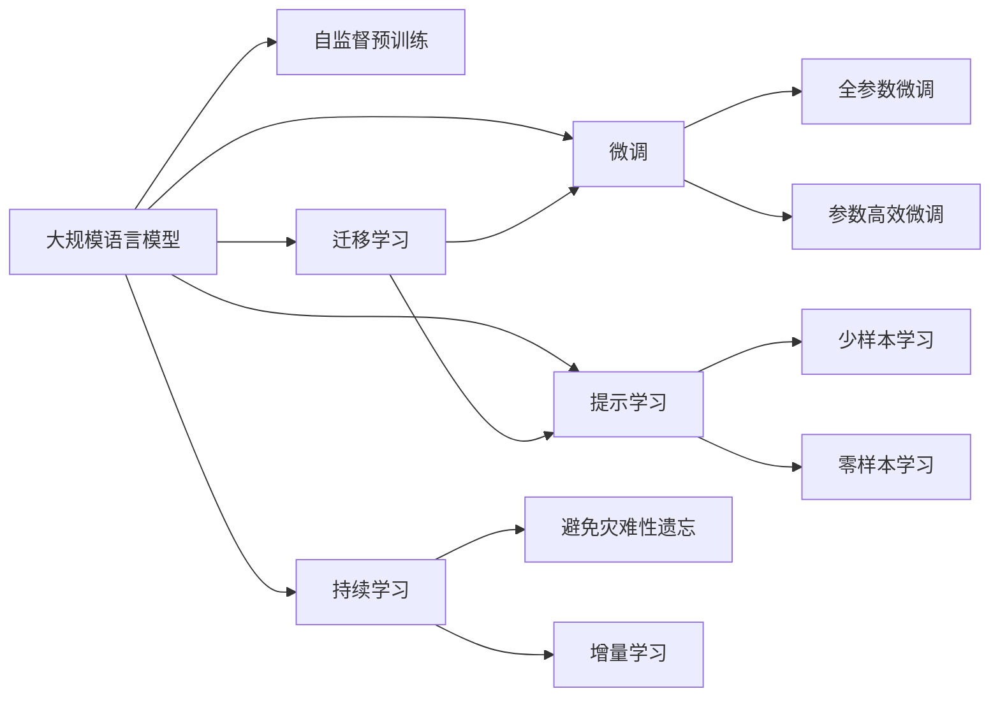

                 

# 大规模语言模型从理论到实践 代码结构

## 1. 背景介绍

在人工智能领域，特别是自然语言处理（NLP）中，大规模语言模型（LLM）已经成为处理文本数据的关键技术。LLM通过在大规模语料上进行的自监督预训练，学习到了丰富的语言知识，具有强大的文本生成和理解能力。这些模型的应用覆盖了问答、翻译、摘要、情感分析等多个NLP任务，极大地推动了NLP技术的发展。然而，理解并有效利用这些模型，需要深入掌握其理论基础和实践技巧。本文旨在从理论到实践，全面系统地介绍大规模语言模型的构建和应用，包括其核心算法、操作步骤和实际应用场景。

## 2. 核心概念与联系

### 2.1 核心概念概述

1. **大规模语言模型（LLM）**：基于Transformer架构，如GPT、BERT等，通过在大量无标签数据上进行预训练，学习通用的语言表示。
2. **自监督预训练**：在无标签数据上，通过如掩码语言模型（MLM）、下位任务（Next Sentence Prediction）等自监督任务进行训练。
3. **微调（Fine-Tuning）**：在预训练模型的基础上，使用下游任务的标注数据进行有监督优化，适应特定任务。
4. **迁移学习**：将预训练模型迁移到下游任务上，通过微调进一步优化，提升性能。
5. **正则化技术**：如权重衰减、Dropout、Early Stopping等，防止过拟合。
6. **对抗训练**：引入对抗样本，提高模型的鲁棒性。
7. **提示学习（Prompt Tuning）**：通过设计特定的输入格式，引导模型输出特定任务结果，无需微调参数。

### 2.2 核心概念原理和架构的 Mermaid 流程图



## 3. 核心算法原理 & 具体操作步骤

### 3.1 算法原理概述

大规模语言模型的构建和应用，分为自监督预训练和微调两个阶段。

- **自监督预训练**：在大量无标签数据上，通过自监督任务（如掩码语言模型、下位任务等）进行训练，学习通用的语言表示。
- **微调**：在预训练模型的基础上，使用下游任务的标注数据进行有监督优化，适应特定任务。

### 3.2 算法步骤详解

**步骤1：数据准备**
- 收集和处理大量无标签数据，作为自监督预训练的语料。
- 分割数据集为训练集、验证集和测试集。

**步骤2：模型选择与配置**
- 选择合适的预训练模型，如GPT-3、BERT等。
- 配置预训练模型的超参数，如学习率、批次大小、优化器等。

**步骤3：自监督预训练**
- 在无标签数据上，使用掩码语言模型等自监督任务进行训练。
- 每训练一定轮次后，在验证集上评估模型性能，调整模型配置。

**步骤4：微调**
- 使用下游任务的标注数据集进行微调。
- 配置微调模型的超参数，如学习率、批次大小、正则化等。
- 使用下游任务的损失函数计算梯度，更新模型参数。
- 在验证集上评估模型性能，调整超参数。

**步骤5：评估与部署**
- 在测试集上评估微调后的模型性能。
- 部署模型到实际应用中，如自然语言处理任务、智能客服等。

### 3.3 算法优缺点

**优点**：
- 预训练模型具有强大的语言理解能力，能在有限标注数据下取得良好性能。
- 模型迁移学习能力强，能适应不同领域和任务。

**缺点**：
- 对标注数据依赖性强，标注成本高。
- 模型较大，对计算资源要求高。
- 微调过程容易出现过拟合，需额外正则化技术。

### 3.4 算法应用领域

大规模语言模型广泛应用于多个领域，如：

- 机器翻译：将源语言翻译成目标语言。
- 文本摘要：将长文本压缩成简短摘要。
- 问答系统：对自然语言问题给出答案。
- 对话系统：使机器能够与人自然对话。
- 情感分析：识别文本情感倾向。
- 命名实体识别：识别文本中的实体。
- 文本分类：将文本分类到预定义类别。

## 4. 数学模型和公式 & 详细讲解 & 举例说明

### 4.1 数学模型构建

假设预训练模型为 $M_{\theta}$，其中 $\theta$ 为模型参数。下游任务为分类任务，假设标签空间为 $\{0, 1\}$，使用交叉熵损失函数：

$$
\mathcal{L}(y, M_{\theta}(x)) = -(y\log M_{\theta}(x) + (1-y)\log(1-M_{\theta}(x)))
$$

其中 $x$ 为输入文本，$y$ 为真实标签，$M_{\theta}(x)$ 为模型在输入文本 $x$ 上的预测概率。

### 4.2 公式推导过程

以二分类任务为例，假设模型在输入 $x$ 上的输出为 $\hat{y}=M_{\theta}(x)$，表示样本属于正类的概率。真实标签 $y \in \{0,1\}$。则二分类交叉熵损失函数为：

$$
\ell(M_{\theta}(x),y) = -[y\log \hat{y} + (1-y)\log(1-\hat{y})]
$$

最小化经验风险：

$$
\mathcal{L}(\theta) = \frac{1}{N}\sum_{i=1}^N \ell(M_{\theta}(x_i), y_i)
$$

使用梯度下降算法，更新参数 $\theta$：

$$
\theta \leftarrow \theta - \eta \nabla_{\theta}\mathcal{L}(\theta) - \eta\lambda\theta
$$

其中 $\eta$ 为学习率，$\lambda$ 为正则化系数。

### 4.3 案例分析与讲解

以GPT-3为例，使用掩码语言模型（MLM）进行自监督预训练。MLM目标是在遮掩部分单词的文本中，预测被遮掩的单词。具体步骤如下：

1. 将文本随机遮掩一定比例的单词。
2. 使用预训练模型预测遮掩单词。
3. 计算预测单词与真实单词之间的交叉熵损失。
4. 反向传播更新模型参数。

## 5. 项目实践：代码实例和详细解释说明

### 5.1 开发环境搭建

使用PyTorch框架进行代码实现。首先，安装PyTorch和相关依赖：

```bash
pip install torch torchvision torchaudio transformers
```

### 5.2 源代码详细实现

以下代码展示了如何使用PyTorch和Transformers库进行微调。

```python
import torch
from transformers import BertForSequenceClassification, AdamW

# 加载预训练模型
model = BertForSequenceClassification.from_pretrained('bert-base-uncased', num_labels=2)

# 加载数据集
train_data, dev_data, test_data = load_data('path/to/data')

# 定义数据预处理函数
def preprocess(text):
    return tokenizer.encode_plus(text, max_length=256, padding='max_length', truncation=True)

# 加载优化器
optimizer = AdamW(model.parameters(), lr=2e-5)

# 定义训练函数
def train_epoch(model, data, optimizer, batch_size):
    model.train()
    for batch in data:
        inputs = preprocess(batch['text'])
        labels = batch['label']
        optimizer.zero_grad()
        outputs = model(**inputs, labels=labels)
        loss = outputs.loss
        loss.backward()
        optimizer.step()

# 定义评估函数
def evaluate(model, data):
    model.eval()
    predictions, labels = [], []
    for batch in data:
        inputs = preprocess(batch['text'])
        labels = batch['label']
        outputs = model(**inputs)
        predictions.append(outputs.logits.argmax(dim=1).tolist())
        labels.append(labels.tolist())
    return metrics.precision_recall_fscore_support(labels, predictions, average='micro')

# 训练模型
epochs = 3
batch_size = 16

for epoch in range(epochs):
    train_epoch(model, train_data, optimizer, batch_size)
    dev_score = evaluate(model, dev_data)
    test_score = evaluate(model, test_data)
    print(f"Epoch {epoch+1}, dev score: {dev_score}, test score: {test_score}")
```

### 5.3 代码解读与分析

1. **数据准备**：首先加载预训练模型和数据集。
2. **模型选择**：选择BERT作为预训练模型，并设置标签数量。
3. **数据预处理**：定义文本预处理函数，将文本转化为模型所需的格式。
4. **优化器配置**：配置AdamW优化器，设置学习率。
5. **训练过程**：定义训练函数，在每个epoch内进行前向传播和反向传播，更新模型参数。
6. **评估过程**：定义评估函数，在验证集和测试集上计算模型性能指标。
7. **训练流程**：循环训练多个epoch，并在每个epoch后评估模型性能。

### 5.4 运行结果展示

运行上述代码，可以得到训练过程中模型在验证集和测试集上的性能指标，如精度、召回率、F1分数等。

## 6. 实际应用场景

### 6.1 机器翻译

大规模语言模型在机器翻译任务上表现出色。通过微调，模型能够适应目标语言的语法和词汇特点，提高翻译质量。

### 6.2 文本摘要

使用大规模语言模型进行文本摘要，能够快速生成高质量的摘要，提升信息检索效率。

### 6.3 问答系统

基于大规模语言模型的问答系统，能够准确理解和回答用户问题，提升用户满意度。

### 6.4 未来应用展望

随着大规模语言模型的不断进步，未来将有更多应用场景得以实现。如自动摘要生成、智能对话系统、智能客服等。

## 7. 工具和资源推荐

### 7.1 学习资源推荐

- 《深度学习与自然语言处理》：介绍自然语言处理的基础理论和常用模型。
- 《自然语言处理综述》：综述当前自然语言处理的技术进展。
- 《Transformer: A Survey》：介绍Transformer架构及其应用。

### 7.2 开发工具推荐

- PyTorch：高性能深度学习框架，支持动态计算图。
- TensorFlow：灵活的深度学习框架，适合大规模工程应用。
- Weights & Biases：模型训练实验跟踪工具。
- TensorBoard：模型训练可视化工具。

### 7.3 相关论文推荐

- Attention is All You Need：提出Transformer架构，开创深度学习中的自注意力机制。
- BERT: Pre-training of Deep Bidirectional Transformers for Language Understanding：提出BERT模型，基于掩码语言模型进行自监督预训练。
- Parameter-Efficient Transfer Learning for NLP：提出 Adapter等参数高效微调方法，减小模型规模。

## 8. 总结：未来发展趋势与挑战

### 8.1 研究成果总结

大规模语言模型在自然语言处理领域取得了显著进展，从自监督预训练到微调，再到迁移学习，逐步拓展了语言模型的应用边界。

### 8.2 未来发展趋势

1. 模型规模继续增大：随着计算资源和语料库的增长，模型参数量将进一步增加。
2. 多模态融合：将文本与其他模态（如视觉、语音）结合，实现更全面的智能系统。
3. 知识图谱融合：将外部知识库与语言模型结合，提升知识推理能力。
4. 自监督预训练：通过更多自监督任务，提高模型的泛化能力和自适应性。
5. 零样本和少样本学习：通过提示学习等方法，实现无需标注数据的零样本和少样本学习。

### 8.3 面临的挑战

1. 标注成本高昂：大规模语料标注成本高，难以满足实际需求。
2. 过拟合问题：微调模型容易在数据分布变化时发生性能下降。
3. 鲁棒性不足：模型对对抗样本和噪声敏感，需要进一步提高鲁棒性。
4. 解释性不足：模型决策过程难以解释，影响应用的可信度和可控性。

### 8.4 研究展望

1. 低资源场景下的微调：探索无需大量标注数据和计算资源的微调方法。
2. 模型鲁棒性和解释性提升：通过对抗训练和可解释性技术，提高模型的鲁棒性和可解释性。
3. 多模态融合与知识图谱应用：将语言模型与其他模态数据结合，提升知识推理能力。
4. 跨领域迁移能力：研究跨领域迁移学习，实现不同任务之间的知识迁移。

## 9. 附录：常见问题与解答

**Q1: 如何选择预训练模型？**

A: 根据任务需求和数据特点选择合适的预训练模型。如需要大量标注数据的任务，可以选择参数较小的模型；若需要高泛化能力，可以选择参数较大的模型。

**Q2: 如何防止过拟合？**

A: 使用正则化技术，如权重衰减、Dropout、Early Stopping等。使用对抗训练和数据增强方法，提高模型的鲁棒性。

**Q3: 如何提高模型的解释性？**

A: 引入可解释性技术，如LIME、SHAP等，对模型决策过程进行解释和可视化。

**Q4: 如何在低资源环境下进行微调？**

A: 探索少样本学习和零样本学习技术，利用已有数据和知识图谱进行迁移学习。

**Q5: 如何评估模型性能？**

A: 使用各种指标，如精度、召回率、F1分数、ROC曲线等，评估模型在不同任务上的性能。

作者：禅与计算机程序设计艺术 / Zen and the Art of Computer Programming

