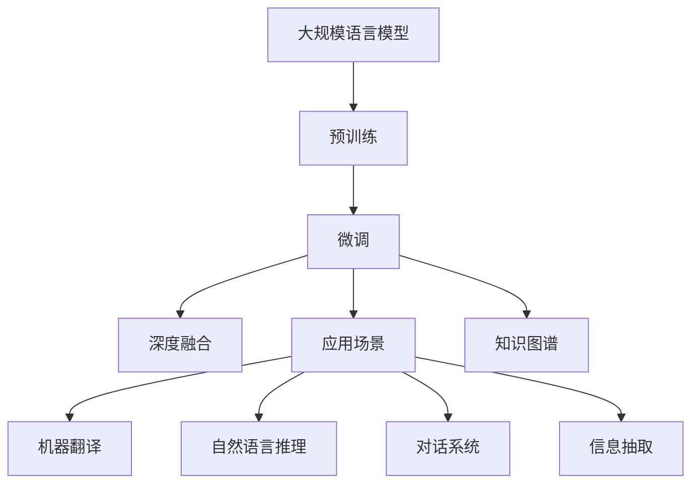

                 

# 大规模语言模型从理论到实践 大语言模型应用

> 关键词：大规模语言模型,深度学习,自然语言处理,预训练,微调,Transformer,BERT,应用场景,知识图谱,深度融合

## 1. 背景介绍

### 1.1 问题由来

近年来，人工智能领域迅速发展，其中自然语言处理(NLP)尤为引人注目。尤其是大规模语言模型（Large Language Models, LLMs），通过自回归模型（如GPT）和自编码模型（如BERT）的预训练，能够在无监督环境下学习丰富的语言知识，实现自然语言理解和生成任务。大语言模型在语言模型上的表现，已经接近甚至超越了人类水平，引发了广泛关注和热议。

然而，尽管大语言模型在各种任务上取得了令人瞩目的成绩，但在实际应用中仍面临诸多挑战。例如，预训练数据集往往缺乏针对特定领域的标注，导致模型在特定任务上性能欠佳。此外，大模型通常具有巨大的参数量，大规模的训练和推理任务，使得在实际部署中遇到了诸多困难。

针对这些问题，本文将从理论到实践，系统性地探讨大语言模型的构建、预训练、微调和应用，帮助读者全面了解大语言模型的核心思想和关键技术，并探讨其在多个行业的应用场景。

## 2. 核心概念与联系

### 2.1 核心概念概述

为更好地理解大语言模型，我们需要对其核心概念进行详细阐述：

- **大规模语言模型**（Large Language Model）：一种基于深度学习模型，通过在大规模无标签文本上预训练，学习到丰富的语言知识和语法结构。常见的模型包括BERT、GPT-3等。
- **预训练（Pre-training）**：通过在大规模无标签文本数据上自监督学习，预训练模型能够学习到通用的语言表示，增强模型在新任务上的泛化能力。
- **微调（Fine-tuning）**：在预训练模型基础上，使用下游任务的标注数据，进一步优化模型，以适应特定任务的要求。
- **Transformer**：一种高效的神经网络结构，用于大语言模型的构建，具有并行计算和自注意力机制。
- **BERT**：一种基于Transformer的预训练模型，通过掩码语言模型和下一句预测等任务进行预训练。
- **应用场景**：大语言模型在机器翻译、自然语言推理、对话系统、信息抽取等多个领域得到了广泛应用。
- **知识图谱**：一种用于存储和表示实体及其关系的数据结构，用于增强模型的知识表示能力。
- **深度融合**：将深度学习与先验知识相结合，提升模型的性能和可解释性。

这些概念之间存在紧密联系，共同构成了大语言模型的理论基础和应用框架。

### 2.2 核心概念原理和架构的 Mermaid 流程图



这个流程图展示了大语言模型的核心概念及它们之间的联系：

1. **预训练**：通过在大规模无标签文本上训练，大语言模型学习到通用的语言表示。
2. **微调**：在预训练模型基础上，使用下游任务的标注数据进行进一步优化。
3. **深度融合**：将知识图谱等先验知识与深度学习模型结合，提升模型的表现和解释性。
4. **应用场景**：大语言模型在机器翻译、自然语言推理、对话系统、信息抽取等多个领域得到了广泛应用。

通过理解这些核心概念，我们能够更好地把握大语言模型的理论基础和应用框架。

## 3. 核心算法原理 & 具体操作步骤

### 3.1 算法原理概述

大语言模型基于Transformer架构，通过在大规模无标签文本上进行预训练，学习到丰富的语言表示能力。其核心算法包括以下几个关键步骤：

1. **预训练**：通过自监督任务（如掩码语言模型、下一句预测）对模型进行预训练，学习到通用的语言表示。
2. **微调**：使用下游任务的标注数据，进一步优化模型，以适应特定任务的要求。
3. **知识图谱融合**：将知识图谱等先验知识与模型深度融合，增强模型的知识表示能力。
4. **深度融合**：将深度学习与知识图谱结合，提升模型的性能和可解释性。

### 3.2 算法步骤详解

**Step 1: 准备数据和模型**
- 准备大规模无标签文本数据，进行预训练。
- 选择合适的预训练模型（如BERT、GPT等），作为模型的初始化参数。
- 收集下游任务的标注数据，作为微调的监督信号。

**Step 2: 预训练过程**
- 定义预训练任务，如掩码语言模型、下一句预测等。
- 使用大规模无标签文本数据，训练模型以学习通用的语言表示。
- 对模型进行评估，选择合适的超参数，如学习率、批量大小等。

**Step 3: 微调过程**
- 将预训练模型作为初始化参数，使用下游任务的标注数据进行微调。
- 定义任务适配层，根据下游任务选择合适的输出层和损失函数。
- 设置微调的超参数，如学习率、批量大小、迭代轮数等。
- 使用标注数据，训练模型以适应特定任务。

**Step 4: 知识图谱融合**
- 定义知识图谱，存储实体及其关系。
- 将知识图谱融入模型，增强模型的知识表示能力。
- 对模型进行评估，调整超参数，提升模型性能。

**Step 5: 深度融合**
- 将深度学习与知识图谱结合，提升模型的表现和可解释性。
- 对模型进行评估，验证深度融合的效果。

### 3.3 算法优缺点

大语言模型具有以下优点：

- **泛化能力**：在大规模无标签数据上进行预训练，模型能够学习到丰富的语言表示，具有较强的泛化能力。
- **高效性**：模型参数量大，能够处理大规模数据集，具有高效的推理能力。
- **可扩展性**：模型结构灵活，可以根据任务需求进行微调。

同时，大语言模型也存在以下缺点：

- **计算资源需求高**：模型参数量庞大，需要大规模计算资源进行训练和推理。
- **训练时间长**：大规模预训练和微调过程需要大量时间。
- **复杂度高**：模型结构复杂，训练和微调过程需要进行细致的调参和优化。

### 3.4 算法应用领域

大语言模型在多个领域得到了广泛应用，包括但不限于：

- **机器翻译**：将源语言文本翻译成目标语言。BERT、GPT等模型在此领域表现优异。
- **自然语言推理**：判断文本之间的逻辑关系。使用Transformer等结构训练模型，能够有效提升自然语言推理任务的效果。
- **对话系统**：使机器能够进行自然对话。通过微调BERT等模型，对话系统能够理解和生成自然流畅的对话。
- **信息抽取**：从文本中抽取实体及其关系。使用预训练模型进行微调，能够高效地完成信息抽取任务。

## 4. 数学模型和公式 & 详细讲解 & 举例说明

### 4.1 数学模型构建

本节将使用数学语言对大语言模型的预训练和微调过程进行详细阐述。

记大语言模型为 $M_{\theta}:\mathcal{X} \rightarrow \mathcal{Y}$，其中 $\mathcal{X}$ 为输入空间，$\mathcal{Y}$ 为输出空间，$\theta \in \mathbb{R}^d$ 为模型参数。假设模型在大规模无标签文本数据上进行预训练，使用的预训练任务为 $\mathcal{T}$，预训练损失为 $\mathcal{L}_{pre}(\theta)$。预训练后的模型参数记为 $\theta_{pre}$。

对于下游任务 $T$，其标注数据集为 $D=\{(x_i, y_i)\}_{i=1}^N, x_i \in \mathcal{X}, y_i \in \mathcal{Y}$。定义任务损失为 $\mathcal{L}(\theta)$，用于衡量模型在任务 $T$ 上的性能。微调的目标是找到最优参数 $\theta^*$，使得任务损失最小化：

$$
\theta^* = \mathop{\arg\min}_{\theta} \mathcal{L}(\theta)
$$

### 4.2 公式推导过程

以机器翻译任务为例，定义预训练任务为掩码语言模型。假设源语言文本为 $x_i$，目标语言文本为 $y_i$，模型在源语言和目标语言上分别输出概率 $p_i^s$ 和 $p_i^t$。掩码语言模型的预训练损失定义为：

$$
\mathcal{L}_{pre}(\theta) = -\sum_{i=1}^N \log p_i^s + \log p_i^t
$$

在预训练后，对模型进行微调，使用机器翻译任务的标注数据。定义微调任务适配层为：

$$
\begin{aligned}
L_{fine} &= -\frac{1}{N}\sum_{i=1}^N \log p_i^{s \rightarrow t} \\
&= -\frac{1}{N}\sum_{i=1}^N \log \left( \frac{M_{\theta_{pre}}(x_i)}{Z} \right)
\end{aligned}
$$

其中 $Z$ 为归一化因子，$p_i^{s \rightarrow t}$ 为目标语言文本 $y_i$ 的概率。微调的目标是最小化任务适配层的损失：

$$
\theta^* = \mathop{\arg\min}_{\theta} \mathcal{L}(\theta) = \mathop{\arg\min}_{\theta} \mathcal{L}_{pre}(\theta) + \mathcal{L}_{fine}(\theta)
$$

### 4.3 案例分析与讲解

以BERT为例，BERT模型在预训练阶段使用掩码语言模型和下一句预测等任务。在微调阶段，BERT模型通常用于文本分类任务，通过添加任务适配层和交叉熵损失，进行微调。以情感分类任务为例，微调过程如下：

1. 准备数据集 $D=\{(x_i, y_i)\}_{i=1}^N$，其中 $x_i$ 为输入文本，$y_i$ 为情感标签。
2. 定义模型 $M_{\theta}$，其中 $\theta$ 为BERT模型参数。
3. 定义任务适配层为线性分类器，输出概率分布 $p_i^c$，其中 $c$ 为情感分类标签。
4. 定义损失函数为交叉熵损失 $\mathcal{L}(\theta) = -\frac{1}{N}\sum_{i=1}^N y_i \log p_i^c$。
5. 使用微调算法进行训练，最小化任务适配层损失。

## 5. 项目实践：代码实例和详细解释说明

### 5.1 开发环境搭建

在进行大语言模型项目实践前，需要先准备好开发环境。以下是使用Python进行PyTorch开发的环境配置流程：

1. 安装Anaconda：从官网下载并安装Anaconda，用于创建独立的Python环境。
```bash
conda create -n pytorch-env python=3.8 
conda activate pytorch-env
```

2. 安装PyTorch：根据CUDA版本，从官网获取对应的安装命令。例如：
```bash
conda install pytorch torchvision torchaudio cudatoolkit=11.1 -c pytorch -c conda-forge
```

3. 安装Transformers库：
```bash
pip install transformers
```

4. 安装各类工具包：
```bash
pip install numpy pandas scikit-learn matplotlib tqdm jupyter notebook ipython
```

完成上述步骤后，即可在`pytorch-env`环境中开始项目实践。

### 5.2 源代码详细实现

下面以BERT模型进行机器翻译任务的微调为例，给出使用Transformers库的PyTorch代码实现。

```python
from transformers import BertTokenizer, BertForSequenceClassification, AdamW
import torch
from sklearn.metrics import accuracy_score

tokenizer = BertTokenizer.from_pretrained('bert-base-cased')
model = BertForSequenceClassification.from_pretrained('bert-base-cased', num_labels=1)

device = torch.device('cuda') if torch.cuda.is_available() else torch.device('cpu')
model.to(device)

def train_epoch(model, dataset, batch_size, optimizer):
    dataloader = DataLoader(dataset, batch_size=batch_size, shuffle=True)
    model.train()
    epoch_loss = 0
    for batch in dataloader:
        input_ids = batch['input_ids'].to(device)
        attention_mask = batch['attention_mask'].to(device)
        labels = batch['labels'].to(device)
        model.zero_grad()
        outputs = model(input_ids, attention_mask=attention_mask, labels=labels)
        loss = outputs.loss
        epoch_loss += loss.item()
        loss.backward()
        optimizer.step()
    return epoch_loss / len(dataloader)

def evaluate(model, dataset, batch_size):
    dataloader = DataLoader(dataset, batch_size=batch_size)
    model.eval()
    preds, labels = [], []
    with torch.no_grad():
        for batch in dataloader:
            input_ids = batch['input_ids'].to(device)
            attention_mask = batch['attention_mask'].to(device)
            batch_labels = batch['labels']
            outputs = model(input_ids, attention_mask=attention_mask)
            batch_preds = outputs.logits.argmax(dim=1).to('cpu').tolist()
            batch_labels = batch_labels.to('cpu').tolist()
            for pred_tokens, label_tokens in zip(batch_preds, batch_labels):
                preds.append(pred_tokens)
                labels.append(label_tokens)
                
    return accuracy_score(labels, preds)

train_dataset = ...
train_loader = ...

dev_dataset = ...
dev_loader = ...

test_dataset = ...
test_loader = ...

epochs = 5
batch_size = 16

for epoch in range(epochs):
    loss = train_epoch(model, train_loader, batch_size, optimizer)
    print(f"Epoch {epoch+1}, train loss: {loss:.3f}")
    
    print(f"Epoch {epoch+1}, dev results:")
    acc = evaluate(model, dev_loader, batch_size)
    print(f"Accuracy on dev set: {acc:.3f}")
    
print("Test results:")
test_acc = evaluate(model, test_loader, batch_size)
print(f"Accuracy on test set: {test_acc:.3f}")
```

### 5.3 代码解读与分析

让我们再详细解读一下关键代码的实现细节：

**BERTTokenizer**：用于对输入文本进行分词和编码。

**BertForSequenceClassification**：用于序列分类任务，定义模型的输入层、中间层和输出层。

**AdamW**：使用自适应权重衰减的优化器，进行模型参数的更新。

**train_epoch**：定义一个epoch的训练过程，使用梯度下降更新模型参数。

**evaluate**：定义模型的评估过程，计算预测准确率。

**train_dataset** 和 **train_loader**：准备训练数据集和数据加载器，进行批量数据处理。

**dev_dataset** 和 **dev_loader**：准备验证数据集和数据加载器，进行模型评估。

**test_dataset** 和 **test_loader**：准备测试数据集和数据加载器，进行最终性能测试。

通过上述代码，可以看出，使用BERT模型进行机器翻译任务的微调，只需简单的几行代码，即可实现高效训练和评估。

## 6. 实际应用场景

### 6.1 智能客服系统

基于大语言模型的智能客服系统，可以显著提升客户服务的效率和质量。传统客服系统依赖人工操作，高峰期响应时间长，且无法24小时不间断工作。而大语言模型微调后的客服系统，能够7x24小时在线服务，快速响应客户咨询，提供自然流畅的回答。

在技术实现上，可以收集企业内部的历史客服对话记录，将问题和最佳答复构建成监督数据，在此基础上对预训练大语言模型进行微调。微调后的客服模型能够自动理解用户意图，匹配最合适的答复模板，提升客户满意度。对于客户提出的新问题，还可以接入检索系统实时搜索相关内容，动态组织生成回答。如此构建的智能客服系统，能大幅提升客户咨询体验和问题解决效率。

### 6.2 金融舆情监测

金融机构需要实时监测市场舆论动向，以便及时应对负面信息传播，规避金融风险。传统的人工监测方式成本高、效率低，难以应对网络时代海量信息爆发的挑战。基于大语言模型微调的文本分类和情感分析技术，为金融舆情监测提供了新的解决方案。

具体而言，可以收集金融领域相关的新闻、报道、评论等文本数据，并对其进行主题标注和情感标注。在此基础上对预训练语言模型进行微调，使其能够自动判断文本属于何种主题，情感倾向是正面、中性还是负面。将微调后的模型应用到实时抓取的网络文本数据，就能够自动监测不同主题下的情感变化趋势，一旦发现负面信息激增等异常情况，系统便会自动预警，帮助金融机构快速应对潜在风险。

### 6.3 个性化推荐系统

当前的推荐系统往往只依赖用户的历史行为数据进行物品推荐，无法深入理解用户的真实兴趣偏好。基于大语言模型微调技术，个性化推荐系统可以更好地挖掘用户行为背后的语义信息，从而提供更精准、多样的推荐内容。

在实践中，可以收集用户浏览、点击、评论、分享等行为数据，提取和用户交互的物品标题、描述、标签等文本内容。将文本内容作为模型输入，用户的后续行为（如是否点击、购买等）作为监督信号，在此基础上微调预训练语言模型。微调后的模型能够从文本内容中准确把握用户的兴趣点。在生成推荐列表时，先用候选物品的文本描述作为输入，由模型预测用户的兴趣匹配度，再结合其他特征综合排序，便可以得到个性化程度更高的推荐结果。

### 6.4 未来应用展望

随着大语言模型微调技术的发展，其应用领域将进一步拓展，为更多行业带来变革性影响。

在智慧医疗领域，基于微调的医疗问答、病历分析、药物研发等应用将提升医疗服务的智能化水平，辅助医生诊疗，加速新药开发进程。

在智能教育领域，微调技术可应用于作业批改、学情分析、知识推荐等方面，因材施教，促进教育公平，提高教学质量。

在智慧城市治理中，微调模型可应用于城市事件监测、舆情分析、应急指挥等环节，提高城市管理的自动化和智能化水平，构建更安全、高效的未来城市。

此外，在企业生产、社会治理、文娱传媒等众多领域，基于大语言模型微调的人工智能应用也将不断涌现，为经济社会发展注入新的动力。

## 7. 工具和资源推荐

### 7.1 学习资源推荐

为了帮助开发者系统掌握大语言模型微调的理论基础和实践技巧，这里推荐一些优质的学习资源：

1. 《Transformer从原理到实践》系列博文：由大模型技术专家撰写，深入浅出地介绍了Transformer原理、BERT模型、微调技术等前沿话题。

2. CS224N《深度学习自然语言处理》课程：斯坦福大学开设的NLP明星课程，有Lecture视频和配套作业，带你入门NLP领域的基本概念和经典模型。

3. 《Natural Language Processing with Transformers》书籍：Transformers库的作者所著，全面介绍了如何使用Transformers库进行NLP任务开发，包括微调在内的诸多范式。

4. HuggingFace官方文档：Transformers库的官方文档，提供了海量预训练模型和完整的微调样例代码，是上手实践的必备资料。

5. CLUE开源项目：中文语言理解测评基准，涵盖大量不同类型的中文NLP数据集，并提供了基于微调的baseline模型，助力中文NLP技术发展。

通过对这些资源的学习实践，相信你一定能够快速掌握大语言模型微调的精髓，并用于解决实际的NLP问题。

### 7.2 开发工具推荐

高效的开发离不开优秀的工具支持。以下是几款用于大语言模型微调开发的常用工具：

1. PyTorch：基于Python的开源深度学习框架，灵活动态的计算图，适合快速迭代研究。大部分预训练语言模型都有PyTorch版本的实现。

2. TensorFlow：由Google主导开发的开源深度学习框架，生产部署方便，适合大规模工程应用。同样有丰富的预训练语言模型资源。

3. Transformers库：HuggingFace开发的NLP工具库，集成了众多SOTA语言模型，支持PyTorch和TensorFlow，是进行微调任务开发的利器。

4. Weights & Biases：模型训练的实验跟踪工具，可以记录和可视化模型训练过程中的各项指标，方便对比和调优。与主流深度学习框架无缝集成。

5. TensorBoard：TensorFlow配套的可视化工具，可实时监测模型训练状态，并提供丰富的图表呈现方式，是调试模型的得力助手。

6. Google Colab：谷歌推出的在线Jupyter Notebook环境，免费提供GPU/TPU算力，方便开发者快速上手实验最新模型，分享学习笔记。

合理利用这些工具，可以显著提升大语言模型微调任务的开发效率，加快创新迭代的步伐。

### 7.3 相关论文推荐

大语言模型和微调技术的发展源于学界的持续研究。以下是几篇奠基性的相关论文，推荐阅读：

1. Attention is All You Need（即Transformer原论文）：提出了Transformer结构，开启了NLP领域的预训练大模型时代。

2. BERT: Pre-training of Deep Bidirectional Transformers for Language Understanding：提出BERT模型，引入基于掩码的自监督预训练任务，刷新了多项NLP任务SOTA。

3. Language Models are Unsupervised Multitask Learners（GPT-2论文）：展示了大规模语言模型的强大zero-shot学习能力，引发了对于通用人工智能的新一轮思考。

4. Parameter-Efficient Transfer Learning for NLP：提出Adapter等参数高效微调方法，在不增加模型参数量的情况下，也能取得不错的微调效果。

5. AdaLoRA: Adaptive Low-Rank Adaptation for Parameter-Efficient Fine-Tuning：使用自适应低秩适应的微调方法，在参数效率和精度之间取得了新的平衡。

6. Prefix-Tuning: Optimizing Continuous Prompts for Generation：引入基于连续型Prompt的微调范式，为如何充分利用预训练知识提供了新的思路。

这些论文代表了大语言模型微调技术的发展脉络。通过学习这些前沿成果，可以帮助研究者把握学科前进方向，激发更多的创新灵感。

## 8. 总结：未来发展趋势与挑战

### 8.1 总结

本文对基于监督学习的大语言模型微调方法进行了全面系统的介绍。首先阐述了大语言模型和微调技术的研究背景和意义，明确了微调在拓展预训练模型应用、提升下游任务性能方面的独特价值。其次，从原理到实践，详细讲解了微调的数学原理和关键步骤，给出了微调任务开发的完整代码实例。同时，本文还广泛探讨了微调方法在多个行业的应用场景，展示了微调范式的巨大潜力。最后，本文精选了微调技术的各类学习资源，力求为读者提供全方位的技术指引。

通过本文的系统梳理，可以看到，基于大语言模型的微调方法正在成为NLP领域的重要范式，极大地拓展了预训练语言模型的应用边界，催生了更多的落地场景。受益于大规模语料的预训练，微调模型以更低的时间和标注成本，在小样本条件下也能取得理想的效果，有力推动了NLP技术的产业化进程。未来，伴随预训练语言模型和微调方法的持续演进，相信NLP技术将在更广阔的应用领域大放异彩，深刻影响人类的生产生活方式。

### 8.2 未来发展趋势

展望未来，大语言模型微调技术将呈现以下几个发展趋势：

1. 模型规模持续增大。随着算力成本的下降和数据规模的扩张，预训练语言模型的参数量还将持续增长。超大规模语言模型蕴含的丰富语言知识，有望支撑更加复杂多变的下游任务微调。

2. 微调方法日趋多样。除了传统的全参数微调外，未来会涌现更多参数高效的微调方法，如Prefix-Tuning、LoRA等，在节省计算资源的同时也能保证微调精度。

3. 持续学习成为常态。随着数据分布的不断变化，微调模型也需要持续学习新知识以保持性能。如何在不遗忘原有知识的同时，高效吸收新样本信息，将成为重要的研究课题。

4. 标注样本需求降低。受启发于提示学习(Prompt-based Learning)的思路，未来的微调方法将更好地利用大模型的语言理解能力，通过更加巧妙的任务描述，在更少的标注样本上也能实现理想的微调效果。

5. 少样本学习成为可能。基于大模型的零样本和少样本学习能力，未来微调方法将进一步降低对标注数据的需求，实现更灵活、高效的微调。

6. 多模态微调崛起。当前的微调主要聚焦于纯文本数据，未来会进一步拓展到图像、视频、语音等多模态数据微调。多模态信息的融合，将显著提升语言模型对现实世界的理解和建模能力。

7. 知识图谱与深度学习结合。将知识图谱等先验知识与深度学习模型结合，提升模型的知识表示能力，增强模型的解释性和可控性。

8. 跨领域迁移能力增强。通过跨领域迁移学习，实现通用语言模型在多领域中的高效迁移。

以上趋势凸显了大语言模型微调技术的广阔前景。这些方向的探索发展，必将进一步提升NLP系统的性能和应用范围，为人类认知智能的进化带来深远影响。

### 8.3 面临的挑战

尽管大语言模型微调技术已经取得了瞩目成就，但在迈向更加智能化、普适化应用的过程中，它仍面临诸多挑战：

1. 标注成本瓶颈。尽管微调大大降低了标注数据的需求，但对于长尾应用场景，难以获得充足的高质量标注数据，成为制约微调性能的瓶颈。如何进一步降低微调对标注样本的依赖，将是一大难题。

2. 模型鲁棒性不足。当前微调模型面对域外数据时，泛化性能往往大打折扣。对于测试样本的微小扰动，微调模型的预测也容易发生波动。如何提高微调模型的鲁棒性，避免灾难性遗忘，还需要更多理论和实践的积累。

3. 推理效率有待提高。大规模语言模型虽然精度高，但在实际部署时往往面临推理速度慢、内存占用大等效率问题。如何在保证性能的同时，简化模型结构，提升推理速度，优化资源占用，将是重要的优化方向。

4. 可解释性亟需加强。当前微调模型更像是"黑盒"系统，难以解释其内部工作机制和决策逻辑。对于医疗、金融等高风险应用，算法的可解释性和可审计性尤为重要。如何赋予微调模型更强的可解释性，将是亟待攻克的难题。

5. 安全性有待保障。预训练语言模型难免会学习到有偏见、有害的信息，通过微调传递到下游任务，产生误导性、歧视性的输出，给实际应用带来安全隐患。如何从数据和算法层面消除模型偏见，避免恶意用途，确保输出的安全性，也将是重要的研究课题。

6. 知识整合能力不足。现有的微调模型往往局限于任务内数据，难以灵活吸收和运用更广泛的先验知识。如何让微调过程更好地与外部知识库、规则库等专家知识结合，形成更加全面、准确的信息整合能力，还有很大的想象空间。

正视微调面临的这些挑战，积极应对并寻求突破，将是大语言模型微调走向成熟的必由之路。相信随着学界和产业界的共同努力，这些挑战终将一一被克服，大语言模型微调必将在构建安全、可靠、可解释、可控的智能系统铺平道路。

### 8.4 研究展望

面对大语言模型微调所面临的种种挑战，未来的研究需要在以下几个方面寻求新的突破：

1. 探索无监督和半监督微调方法。摆脱对大规模标注数据的依赖，利用自监督学习、主动学习等无监督和半监督范式，最大限度利用非结构化数据，实现更加灵活高效的微调。

2. 研究参数高效和计算高效的微调范式。开发更加参数高效的微调方法，在固定大部分预训练参数的同时，只更新极少量的任务相关参数。同时优化微调模型的计算图，减少前向传播和反向传播的资源消耗，实现更加轻量级、实时性的部署。

3. 融合因果和对比学习范式。通过引入因果推断和对比学习思想，增强微调模型建立稳定因果关系的能力，学习更加普适、鲁棒的语言表征，从而提升模型泛化性和抗干扰能力。

4. 引入更多先验知识。将符号化的先验知识，如知识图谱、逻辑规则等，与神经网络模型进行巧妙融合，引导微调过程学习更准确、合理的语言模型。同时加强不同模态数据的整合，实现视觉、语音等多模态信息与文本信息的协同建模。

5. 结合因果分析和博弈论工具。将因果分析方法引入微调模型，识别出模型决策的关键特征，增强输出解释的因果性和逻辑性。借助博弈论工具刻画人机交互过程，主动探索并规避模型的脆弱点，提高系统稳定性。

6. 纳入伦理道德约束。在模型训练目标中引入伦理导向的评估指标，过滤和惩罚有偏见、有害的输出倾向。同时加强人工干预和审核，建立模型行为的监管机制，确保输出符合人类价值观和伦理道德。

这些研究方向的探索，必将引领大语言模型微调技术迈向更高的台阶，为构建安全、可靠、可解释、可控的智能系统铺平道路。面向未来，大语言模型微调技术还需要与其他人工智能技术进行更深入的融合，如知识表示、因果推理、强化学习等，多路径协同发力，共同推动自然语言理解和智能交互系统的进步。只有勇于创新、敢于突破，才能不断拓展语言模型的边界，让智能技术更好地造福人类社会。

## 9. 附录：常见问题与解答

**Q1：大语言模型微调是否适用于所有NLP任务？**

A: 大语言模型微调在大多数NLP任务上都能取得不错的效果，特别是对于数据量较小的任务。但对于一些特定领域的任务，如医学、法律等，仅仅依靠通用语料预训练的模型可能难以很好地适应。此时需要在特定领域语料上进一步预训练，再进行微调，才能获得理想效果。此外，对于一些需要时效性、个性化很强的任务，如对话、推荐等，微调方法也需要针对性的改进优化。

**Q2：微调过程中如何选择合适的学习率？**

A: 微调的学习率一般要比预训练时小1-2个数量级，如果使用过大的学习率，容易破坏预训练权重，导致过拟合。一般建议从1e-5开始调参，逐步减小学习率，直至收敛。也可以使用warmup策略，在开始阶段使用较小的学习率，再逐渐过渡到预设值。需要注意的是，不同的优化器(如AdamW、Adafactor等)以及不同的学习率调度策略，可能需要设置不同的学习率阈值。

**Q3：采用大模型微调时会面临哪些资源瓶颈？**

A: 目前主流的预训练大模型动辄以亿计的参数规模，对算力、内存、存储都提出了很高的要求。GPU/TPU等高性能设备是必不可少的，但即便如此，超大批次的训练和推理任务，使得在实际部署中遇到了诸多困难。因此需要采用一些资源优化技术，如梯度积累、混合精度训练、模型并行等，来突破硬件瓶颈。同时，模型的存储和读取也可能占用大量时间和空间，需要采用模型压缩、稀疏化存储等方法进行优化。

**Q4：如何缓解微调过程中的过拟合问题？**

A: 过拟合是微调面临的主要挑战，尤其是在标注数据不足的情况下。常见的缓解策略包括：

1. 数据增强：通过回译、近义替换等方式扩充训练集
2. 正则化：使用L2正则、Dropout、Early Stopping等避免过拟合
3. 对抗训练：引入对抗样本，提高模型鲁棒性
4. 参数高效微调：只调整少量参数(如Adapter、Prefix等)，减小过拟合风险
5. 多模型集成：训练多个微调模型，取平均输出，抑制过拟合

这些策略往往需要根据具体任务和数据特点进行灵活组合。只有在数据、模型、训练、推理等各环节进行全面优化，才能最大限度地发挥大模型微调的威力。

**Q5：微调模型在落地部署时需要注意哪些问题？**

A: 将微调模型转化为实际应用，还需要考虑以下因素：

1. 模型裁剪：去除不必要的层和参数，减小模型尺寸，加快推理速度
2. 量化加速：将浮点模型转为定点模型，压缩存储空间，提高计算效率
3. 服务化封装：将模型封装为标准化服务接口，便于集成调用
4. 弹性伸缩：根据请求流量动态调整资源配置，平衡服务质量和成本
5. 监控告警：实时采集系统指标，设置异常告警阈值，确保服务稳定性
6. 安全防护：采用访问鉴权、数据脱敏等措施，保障数据和模型安全

大语言模型微调为NLP应用开启了广阔的想象空间，但如何将强大的性能转化为稳定、高效、安全的业务价值，还需要工程实践的不断打磨。唯有从数据、算法、工程、业务等多个维度协同发力，才能真正实现人工智能技术在垂直行业的规模化落地。总之，微调需要开发者根据具体任务，不断迭代和优化模型、数据和算法，方能得到理想的效果。

---

作者：禅与计算机程序设计艺术 / Zen and the Art of Computer Programming

