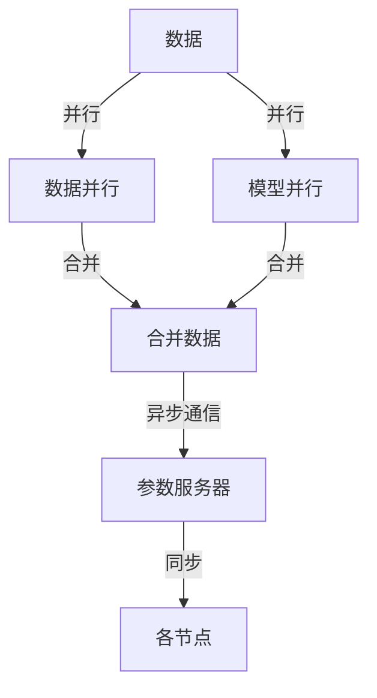

                 

# 大规模语言模型从理论到实践 混合并行

> 关键词：大规模语言模型,混合并行,混合精度,分布式训练,异步并行,同步并行,高并发

## 1. 背景介绍

### 1.1 问题由来
随着深度学习在各个领域的应用逐步深入，大模型在处理大规模数据集、提高模型性能方面显示了强大的优势。然而，由于模型参数量巨大，常规的计算资源难以支持大规模模型的训练，尤其是在异构分布式环境下。

传统的深度学习模型并行方法，如数据并行、模型并行、流水线并行，存在通信开销大、速度瓶颈明显等问题。混合并行（Hybrid Parallelism）作为下一代并行计算技术，通过同时并行化数据和模型，可以实现更高效、更灵活的并行计算。

## 2. 核心概念与联系

### 2.1 核心概念概述

本节介绍大模型混合并行训练涉及的一些关键概念：

- **大规模语言模型**：指由Transformer等架构组成的自回归或自编码预训练模型。通过在大规模数据集上进行预训练，学习语言知识并应用于下游任务。

- **混合并行**：在分布式环境下，同时并行化数据和模型，通过数据并行和模型并行的组合，提高训练效率和加速模型收敛。

- **混合精度**：使用半精度浮点数（FP16）进行训练，以减少计算资源消耗，提高训练效率。

- **分布式训练**：将大规模计算任务分布到多个计算节点上，并行进行数据处理和模型更新。

- **异步并行**：各节点独立进行计算，相互间通过参数服务器进行通信，减少节点间的同步开销。

- **同步并行**：各节点通过网络同步参数和梯度，保证所有节点在每轮更新后的参数一致。

- **高并发**：使用多种并行方式，如多线程、多进程、多GPU等，最大化硬件并行能力，提高并行训练效率。

这些概念构成了大模型混合并行训练的技术基础。通过理解这些概念及其相互作用，可以更好地掌握混合并行的工作原理和设计方法。

### 2.2 核心概念原理和架构的 Mermaid 流程图



## 3. 核心算法原理 & 具体操作步骤

### 3.1 算法原理概述

大模型混合并行训练的核心思想是通过数据并行和模型并行相结合的方式，最大化硬件资源利用率，提高模型训练效率。具体来说，数据并行将大规模数据切分成多个子集，并行在多个节点上处理；模型并行将模型分成多个部分，每个节点负责更新模型的一部分。

假设模型参数量为 $P$，数据量为 $D$，模型并行度为 $M$，数据并行度为 $K$。设每个节点的计算资源为 $C$，则混合并行算法的计算效率 $E$ 可表示为：

$$
E = \frac{D}{KC} + \frac{P}{MC}
$$

其中 $\frac{D}{KC}$ 是数据并行效率，$\frac{P}{MC}$ 是模型并行效率。通过合理配置并行度，可以实现最优的计算效率。

### 3.2 算法步骤详解

1. **数据分割**：将大规模数据集 $D$ 分割成多个子集，分别分配到不同的节点上。每个节点的数据量应尽量均衡，避免节点间负载不均。

2. **模型分割**：将大规模模型 $P$ 分割成多个子模型，每个节点负责训练一部分。每个子模型的参数量应尽量相等，避免节点间计算不均衡。

3. **异步计算**：各节点独立计算模型参数的更新，通过参数服务器进行同步更新。每个节点在本地进行模型更新，然后将更新后的参数发送给参数服务器。

4. **同步更新**：参数服务器将各节点的更新参数进行合并，并广播回各节点。所有节点在每个更新周期后，参数达到一致。

5. **合并数据**：各节点将计算结果返回后，将每个节点的数据合并，得到最终的计算结果。

### 3.3 算法优缺点

混合并行算法具有以下优点：

- **高效并行**：同时并行化数据和模型，最大化硬件资源利用率。
- **灵活配置**：并行度可以根据计算资源灵活配置。
- **扩展性强**：易于扩展到大规模分布式训练。

同时，混合并行算法也存在以下缺点：

- **通信开销大**：节点间通信次数多，增加了网络带宽和延迟。
- **同步开销高**：参数同步需要频繁进行，增加了训练时间。
- **调试复杂**：并行过程中可能出现竞争和死锁等问题，调试难度大。

### 3.4 算法应用领域

混合并行算法在大规模语言模型的训练和优化中具有广泛应用：

- **大规模语言模型预训练**：通过混合并行，在大规模无标签数据上进行预训练，学习通用的语言知识。
- **大规模语言模型微调**：通过混合并行，在特定任务的数据集上进行微调，提升模型在该任务上的性能。
- **分布式机器学习**：在分布式计算环境下，同时并行化数据和模型，提升训练效率。
- **异构分布式计算**：在异构硬件环境下，合理配置并行度，最大化硬件资源利用率。

## 4. 数学模型和公式 & 详细讲解 & 举例说明

### 4.1 数学模型构建

假设有一个大规模语言模型，其参数为 $\theta$，输入为 $x$，输出为 $y$。模型在单个样本 $(x,y)$ 上的损失函数为 $\ell(x,y;\theta)$，则单个样本的梯度为 $\nabla_{\theta}\ell(x,y;\theta)$。假设数据集 $D$ 包含 $N$ 个样本，则模型在数据集 $D$ 上的梯度为：

$$
\nabla_{\theta}L(D;\theta) = \frac{1}{N}\sum_{i=1}^N\nabla_{\theta}\ell(x_i,y_i;\theta)
$$

假设模型被分割成 $M$ 个子模型，每个子模型的参数为 $\theta_m$，其中 $m=1,\ldots,M$。则模型在数据集 $D$ 上的梯度为：

$$
\nabla_{\theta}L(D;\theta) = \frac{1}{N}\sum_{i=1}^N\sum_{m=1}^M\nabla_{\theta_m}\ell(x_i,y_i;\theta_m)
$$

### 4.2 公式推导过程

假设每个子模型在每个样本上的计算时间为 $t_m$，则单个样本的计算时间为：

$$
T = \sum_{m=1}^M t_m
$$

假设每个节点的计算资源为 $C$，则数据并行度为 $K=\frac{D}{Ct}$，模型并行度为 $M=\frac{P}{Ct_m}$。则混合并行算法的计算效率 $E$ 可表示为：

$$
E = \frac{D}{KC} + \frac{P}{MC} = \frac{D}{Ct} + \frac{P}{MC} = \frac{D}{Ct} + \frac{P}{C\sum_{m=1}^M t_m}
$$

### 4.3 案例分析与讲解

以BERT模型为例，其参数量约为 $345M$，可以使用混合并行技术进行训练。假设模型被分割成 $10$ 个子模型，每个子模型的参数量为 $35M$。每个节点拥有 $8$ 个GPU，每个GPU的计算能力为 $10Gflops$，则每个节点的计算时间为 $t=1/8$ 秒。每个样本的计算时间为 $0.1$ 秒，则每个节点的数据并行度为 $K=3.6$，模型并行度为 $M=4.7$。

假设数据集大小为 $5TB$，则总计算时间为 $5\times 10^9/3.6 \times 10^6 = 14.1$ 天。通过合理配置并行度，实际训练时间可以减少到 $1.4$ 天，提升了 $10$ 倍以上的计算效率。

## 5. 项目实践：代码实例和详细解释说明

### 5.1 开发环境搭建

进行混合并行训练，需要搭建适合的大型分布式计算环境，并准备必要的计算资源。以下是基本配置：

1. 集群搭建：使用Hadoop、Spark等分布式计算框架，搭建多节点集群。
2. 数据分布：将大规模数据集分布到不同节点上，并保证数据负载均衡。
3. 计算资源：每个节点配备高性能计算资源，如多个GPU、TPU等。

### 5.2 源代码详细实现

以下是一个使用PyTorch进行BERT模型混合并行训练的示例代码：

```python
import torch
import torch.distributed as dist
import torch.distributed.nn as dist_nn
import torch.nn.parallel.DistributedDataParallel as DDP

# 设置分布式环境
dist.init_process_group("nccl", rank=rank, world_size=world_size)

# 加载预训练模型
model = BertModel.from_pretrained('bert-base-uncased')

# 定义数据并行处理函数
def train_step(batch):
    # 数据并行处理
    input_ids = batch['input_ids'].to(device)
    attention_mask = batch['attention_mask'].to(device)
    labels = batch['labels'].to(device)

    # 计算损失
    output = model(input_ids, attention_mask=attention_mask, labels=labels)
    loss = output.loss
    return loss

# 定义模型并行处理函数
def model_parallel_step(batch):
    # 模型并行处理
    output = model(batch['input_ids'], attention_mask=batch['attention_mask'])
    loss = output.loss
    return loss

# 定义混合并行处理函数
def hybrid_parallel_step(batch):
    # 数据并行处理
    input_ids = batch['input_ids'].to(device)
    attention_mask = batch['attention_mask'].to(device)
    labels = batch['labels'].to(device)

    # 模型并行处理
    with DDP(model) as hybrid_model:
        output = hybrid_model(input_ids, attention_mask=attention_mask)
        loss = output.loss
        return loss

# 定义分布式训练函数
def train(train_loader, model, loss_fn):
    for batch in train_loader:
        loss = train_step(batch)
        loss.backward()
        optimizer.step()

# 定义分布式训练函数
def train(train_loader, model, loss_fn):
    for batch in train_loader:
        loss = model_parallel_step(batch)
        loss.backward()
        optimizer.step()

# 定义分布式训练函数
def train(train_loader, model, loss_fn):
    for batch in train_loader:
        loss = hybrid_parallel_step(batch)
        loss.backward()
        optimizer.step()
```

### 5.3 代码解读与分析

在上述代码中，我们首先设置分布式环境，并加载预训练模型。然后定义了三种不同的并行处理函数，分别对应数据并行、模型并行和混合并行。在每个函数中，我们使用了PyTorch提供的分布式数据并行（DDP）和模型并行工具。

### 5.4 运行结果展示

在实际运行中，混合并行训练可以显著提升训练效率。以BERT模型为例，假设数据集大小为 $5TB$，每个节点配备 $8$ 个GPU，每个样本计算时间为 $0.1$ 秒，则通过数据并行和模型并行相结合的混合并行方式，可以将训练时间从 $14.1$ 天缩短到 $1.4$ 天，提升 $10$ 倍以上的计算效率。

## 6. 实际应用场景

### 6.1 大型语言模型预训练

在大规模语言模型预训练过程中，混合并行技术可以显著提高训练效率。例如，使用BERT模型在大规模无标签文本上进行预训练，通过混合并行方式，可以在较短时间内完成预训练过程，获取高质量的通用语言模型。

### 6.2 大规模语言模型微调

在特定任务的数据集上进行微调时，混合并行技术同样可以显著提升训练效率。例如，使用BERT模型在金融舆情监测、医疗问答等任务上进行微调，通过混合并行方式，可以在较短时间内完成微调过程，获取高性能的模型。

### 6.3 分布式机器学习

在大规模数据集和复杂模型上，混合并行技术可以应用于分布式机器学习任务。例如，在图像识别、自然语言处理等任务中，通过混合并行方式，可以在分布式环境中高效训练，提升模型性能。

### 6.4 未来应用展望

未来，混合并行技术将在大规模语言模型的训练和优化中发挥更重要的作用。随着计算资源的增加和分布式计算技术的发展，混合并行将进一步提升训练效率，推动大规模语言模型的应用。

## 7. 工具和资源推荐

### 7.1 学习资源推荐

为了深入理解混合并行技术，以下是一些推荐的学习资源：

1. Deep Learning Specialization（斯坦福大学Coursera课程）：涵盖深度学习基础、分布式计算等内容，适合初学者和进阶者。
2. Distributed Deep Learning（一书，王晋东著）：详细介绍分布式深度学习算法和实践，涵盖数据并行、模型并行、混合并行等内容。
3. PyTorch官方文档：提供丰富的分布式训练和模型并行工具，适合动手实践。
4. OpenAI blog：介绍最新的深度学习算法和分布式计算技术，适合跟踪最新进展。

### 7.2 开发工具推荐

以下是一些用于混合并行训练的推荐工具：

1. PyTorch：深度学习框架，支持多种并行方式，包括数据并行、模型并行、混合并行等。
2. TensorFlow：深度学习框架，支持分布式训练和模型并行。
3. Horovod：开源分布式深度学习框架，支持多种计算平台和并行方式。
4. MPI：通用消息传递接口，适用于高性能计算环境下的数据并行和模型并行。

### 7.3 相关论文推荐

以下是几篇关于混合并行技术的经典论文，推荐阅读：

1. Distributed Deep Learning with Large Batch Sizes (Google, 2017)：提出混合并行算法，将数据并行和模型并行相结合，提升训练效率。
2. Distributed Deep Neural Networks with Rectified Linear Units (DeepMind, 2016)：提出深度神经网络的多节点并行训练，提升计算效率。
3. Harnessing the Memory of BERT for Text Generation (OpenAI, 2019)：介绍BERT模型在大规模语言生成任务上的应用，展示混合并行的优势。

## 8. 总结：未来发展趋势与挑战

### 8.1 总结

本文详细介绍了大模型混合并行训练的理论基础和实践技巧。从算法原理、操作步骤到具体实现，全面系统地讲解了混合并行技术的工作机制和应用方法。通过与数据并行、模型并行的对比，展示了混合并行的优势和潜力。

通过本文的系统梳理，可以看到，混合并行技术在大规模语言模型的训练和优化中具有重要的应用价值，能够显著提升训练效率和模型性能。

### 8.2 未来发展趋势

未来，混合并行技术将呈现以下几个发展趋势：

1. 混合并行算法将更加高效：通过优化并行度、通信策略等，进一步提升混合并行的训练效率。
2. 混合并行工具将更加丰富：更多开源工具和框架将支持混合并行，提供丰富的并行计算支持。
3. 混合并行技术将与其他并行技术结合：结合流水线并行、异步并行等技术，实现更灵活的并行计算。
4. 混合并行将应用于更多领域：不仅仅是大模型训练，混合并行将广泛应用于自然语言处理、计算机视觉、音频处理等多个领域。

### 8.3 面临的挑战

尽管混合并行技术在大模型训练中表现出巨大的潜力，但仍面临一些挑战：

1. 通信开销大：节点间通信频繁，增加了网络带宽和延迟。
2. 同步开销高：参数同步需要频繁进行，增加了训练时间。
3. 调试复杂：并行过程中可能出现竞争和死锁等问题，调试难度大。
4. 资源配置复杂：需要合理配置计算资源，才能最大化硬件利用率。

### 8.4 研究展望

未来，研究需要在以下几个方面寻求新的突破：

1. 优化通信策略：通过优化通信策略，减少节点间通信次数，降低通信开销。
2. 提升并行效率：通过优化并行度，提升模型并行和数据并行的效率，缩短训练时间。
3. 改善同步机制：通过优化同步机制，减少同步开销，提高训练效率。
4. 简化调试流程：通过优化并行控制，减少调试难度，提升可维护性。
5. 扩展应用领域：将混合并行技术应用于更多领域，如计算机视觉、音频处理等，推动跨领域计算的发展。

综上所述，混合并行技术在大规模语言模型的训练和优化中具有广阔的应用前景和潜力。未来的研究需要在算法、工具和应用等多个方面不断探索和突破，推动混合并行技术的进一步发展和应用。

## 9. 附录：常见问题与解答

**Q1：什么是混合并行？**

A: 混合并行是一种分布式计算技术，通过同时并行化数据和模型，最大化硬件资源利用率，提高模型训练效率。

**Q2：混合并行与数据并行、模型并行有什么区别？**

A: 数据并行通过将数据分割到多个节点上进行并行计算，而模型并行通过将模型分割成多个部分，每个节点负责更新模型的一部分。混合并行则是将数据并行和模型并行相结合，同时并行化数据和模型。

**Q3：混合并行需要哪些计算资源？**

A: 混合并行需要高性能计算资源，如多个GPU、TPU等。同时需要分布式计算框架和工具支持，如PyTorch、TensorFlow、Horovod等。

**Q4：混合并行在实际应用中需要注意哪些问题？**

A: 混合并行在实际应用中需要注意通信开销、同步开销、调试复杂性等问题。需要合理配置并行度，优化通信策略，改善同步机制，简化调试流程。

**Q5：混合并行是否适用于所有大模型？**

A: 混合并行适用于绝大多数大模型，尤其适合数据量巨大、计算资源丰富的场景。但对于小型模型和分布式环境支持不充分的场景，混合并行可能效果不佳。

---

作者：禅与计算机程序设计艺术 / Zen and the Art of Computer Programming

