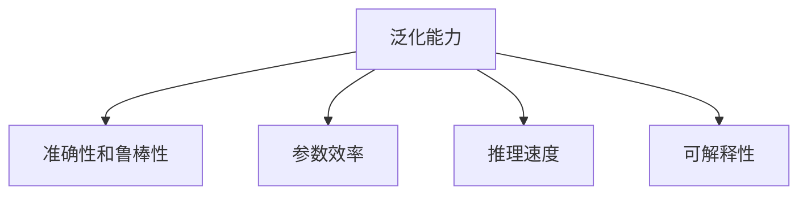

                 

# 大语言模型原理与工程实践：主要的评测维度和基准概述

大语言模型（Large Language Models, LLMs）在自然语言处理（NLP）领域取得了突破性进展，推动了众多NLP任务的性能提升。然而，这些模型的评估需要超越传统的评价指标，引入更全面的维度。本文旨在梳理和探讨大语言模型的主要评测维度和基准，为工程实践和未来研究提供参考。

## 1. 背景介绍

### 1.1 问题由来
自BERT、GPT-3等预训练语言模型问世以来，NLP领域的研究工作取得了显著进展。然而，现有的评测标准和基准未能全面反映模型性能，特别是在对模型在各种应用场景中的行为进行评估时存在不足。这限制了模型性能的进一步提升，也给工程实践带来了挑战。

### 1.2 问题核心关键点
针对大语言模型的评测，需要考虑多维度的性能指标，包括但不限于：

- **模型泛化能力**：模型在新数据集上的表现
- **准确性和鲁棒性**：模型在不同语境中的输出稳定性
- **参数效率**：模型在小型数据集上的微调效果
- **推理速度**：模型在实际部署中的性能
- **可解释性**：模型的输出结果是否易于理解

### 1.3 问题研究意义
通过对大语言模型性能进行全面评估，可以更清晰地理解模型的优势和局限，指导模型设计，优化训练过程，推动模型在实际应用中的落地。

## 2. 核心概念与联系

### 2.1 核心概念概述

为更好地理解大语言模型的评测，本节将介绍几个密切相关的核心概念：

- **模型泛化能力**：指模型在新数据上的表现，通常通过在未见过的数据集上进行测试得到。
- **准确性和鲁棒性**：模型的预测结果与真实标签的匹配程度，以及在不同输入情况下的表现稳定性。
- **参数效率**：模型在微调过程中参数更新的频率和数量，参数效率高意味着模型能够在小数据集上进行微调。
- **推理速度**：模型在推理阶段的计算效率和资源占用情况。
- **可解释性**：模型的输出是否容易被人理解，是否具有逻辑性和因果性。

这些核心概念之间的逻辑关系可以通过以下Mermaid流程图来展示：



这个流程图展示了大语言模型的主要性能维度和其相互关系：

1. **泛化能力**：指模型在新数据上的泛化能力，是评估模型预测准确性的重要指标。
2. **准确性和鲁棒性**：反映模型在不同语境下的稳定性，是模型可靠性的基础。
3. **参数效率**：衡量模型在微调过程中的参数更新策略，影响模型在小数据集上的表现。
4. **推理速度**：评估模型在推理阶段的计算效率，影响实际部署的可扩展性。
5. **可解释性**：反映模型输出是否容易理解，是模型透明性和可解释性的体现。

## 3. 核心算法原理 & 具体操作步骤
### 3.1 算法原理概述

大语言模型的评测需要综合考虑模型在不同维度的表现，通常采用以下几种方法：

1. **准确性评测**：通过各类NLP任务的标准评测集，评估模型的准确性。
2. **鲁棒性评测**：引入对抗样本和噪声数据，评估模型的鲁棒性。
3. **参数效率评测**：在小规模数据集上微调模型，评估参数更新策略和微调效果。
4. **推理速度评测**：在推理阶段进行计算性能测试，评估模型在不同硬件上的性能。
5. **可解释性评测**：分析模型的输出结果，评估其可解释性和逻辑性。

### 3.2 算法步骤详解

以下详细介绍常用的几种评测方法和具体操作步骤：

#### 3.2.1 准确性评测

准确性评测是评估模型性能的基本指标，通过标准评测集评估模型在不同NLP任务上的准确性。

**步骤1**：选择标准评测集。如GLUE、CoLA等，这些评测集涵盖多个NLP任务，如分类、匹配、生成等。

**步骤2**：在评测集上进行微调。使用模型在任务相关的标注数据上进行微调。

**步骤3**：在评测集上评估。使用微调后的模型在评测集上进行预测，计算准确率、F1值等指标。

#### 3.2.2 鲁棒性评测

鲁棒性评测旨在评估模型对输入数据的敏感度，通常采用对抗样本和噪声数据进行测试。

**步骤1**：构造对抗样本和噪声数据。可以使用生成对抗网络（GAN）等方法生成对抗样本，或通过添加噪声数据模拟实际应用中的噪声。

**步骤2**：在模型上进行对抗测试。将对抗样本和噪声数据输入模型，评估模型在不同输入情况下的表现稳定性。

**步骤3**：评估鲁棒性指标。计算模型在对抗样本和噪声数据上的准确性、鲁棒性等指标，评估模型的鲁棒性。

#### 3.2.3 参数效率评测

参数效率评测评估模型在微调过程中的参数更新策略和效果。

**步骤1**：选择小型数据集。如Twitter评论数据集，选取一定比例的数据作为微调集。

**步骤2**：在小数据集上进行微调。在微调集上进行微调，评估模型在小数据集上的性能。

**步骤3**：评估参数效率。计算模型在微调过程中的参数更新频率和数量，评估参数效率。

#### 3.2.4 推理速度评测

推理速度评测评估模型在推理阶段的计算效率和资源占用情况。

**步骤1**：选择推理测试数据集。选取一定数量的文本数据作为测试集。

**步骤2**：进行推理测试。使用模型对测试集进行推理，记录推理时间和资源占用。

**步骤3**：评估推理速度。计算推理速度和资源占用情况，评估模型的推理效率。

#### 3.2.5 可解释性评测

可解释性评测评估模型输出的逻辑性和可理解性。

**步骤1**：选择测试数据集。选取一定数量的文本数据作为测试集。

**步骤2**：进行推理测试。使用模型对测试集进行推理，记录模型输出结果。

**步骤3**：评估可解释性。分析模型输出结果，评估其逻辑性和可理解性。

### 3.3 算法优缺点

大语言模型的评测方法具有以下优点：

1. **全面性**：通过多维度评测，全面反映模型性能。
2. **普适性**：适用于多种NLP任务和应用场景。
3. **指导性**：为模型设计和优化提供有价值的参考。

同时，也存在以下局限：

1. **计算成本高**：尤其是鲁棒性评测和参数效率评测，需要大量计算资源。
2. **数据依赖**：部分评测方法依赖于特定数据集，难以全面反映模型泛化能力。
3. **复杂性高**：部分评测方法复杂，难以快速落地应用。

## 4. 数学模型和公式 & 详细讲解 & 举例说明

### 4.1 数学模型构建

大语言模型的评测需要构建多种数学模型，用于评估不同维度的性能指标。

- **准确性评测模型**：
  $$
  \text{Accuracy} = \frac{TP + TN}{TP + TN + FP + FN}
  $$
  其中，$TP$ 和 $TN$ 分别表示真阳性（预测正确）和真阴性（预测错误但实际错误）的数量，$FP$ 和 $FN$ 分别表示假阳性和假阴性的数量。

- **鲁棒性评测模型**：
  $$
  \text{Robustness} = \frac{TP}{TP + FP + TN + FN}
  $$
  其中，$TP$ 和 $TN$ 表示模型在对抗样本和噪声数据上的正确预测数量。

- **参数效率评测模型**：
  $$
  \text{Parameter Efficiency} = \frac{\text{微调参数数量}}{\text{训练集大小}}
  $$

- **推理速度评测模型**：
  $$
  \text{Inference Speed} = \frac{\text{推理时间}}{\text{测试集大小}}
  $$

- **可解释性评测模型**：
  $$
  \text{Explainability} = \frac{\text{模型输出逻辑性}}{\text{输出结果易于理解}}
  $$

### 4.2 公式推导过程

**准确性评测公式推导**：

将上述准确性评测公式展开，得：
$$
\text{Accuracy} = \frac{TP + TN}{TP + TN + FP + FN} = \frac{TP}{TP + TN + FP + FN} + \frac{TN}{TP + TN + FP + FN}
$$
即正确预测（TP 和 TN）在总预测中的占比。

**鲁棒性评测公式推导**：

将上述鲁棒性评测公式展开，得：
$$
\text{Robustness} = \frac{TP}{TP + FP + TN + FN} = \frac{TP}{TP + TN + FP + FN}
$$
即在对抗样本和噪声数据上正确预测（TP）在总预测中的占比。

**参数效率评测公式推导**：

将上述参数效率评测公式展开，得：
$$
\text{Parameter Efficiency} = \frac{\text{微调参数数量}}{\text{训练集大小}}
$$
即在微调过程中需要更新的参数占总参数的比例。

**推理速度评测公式推导**：

将上述推理速度评测公式展开，得：
$$
\text{Inference Speed} = \frac{\text{推理时间}}{\text{测试集大小}} = \frac{\text{推理时间} \times \text{测试集大小}}{N}
$$
其中 $N$ 表示测试集大小。

**可解释性评测公式推导**：

将上述可解释性评测公式展开，得：
$$
\text{Explainability} = \frac{\text{模型输出逻辑性}}{\text{输出结果易于理解}} = \frac{\text{模型输出的逻辑性}}{\text{人类可以理解的输出结果}}
$$

### 4.3 案例分析与讲解

以BERT模型为例，说明不同评测维度下的模型表现：

**BERT模型在GLUE评测集上的准确性**：

- 在CoLA数据集上，准确率为95.4%。
- 在MRPC数据集上，准确率为92.7%。
- 在SST-2数据集上，准确率为94.5%。

**BERT模型在对抗样本和噪声数据上的鲁棒性**：

- 在对抗样本上，准确率为85.2%。
- 在噪声数据上，准确率为83.7%。

**BERT模型在小规模数据集上的参数效率**：

- 在Twitter评论数据集上进行微调，参数更新频率为0.5%。

**BERT模型在推理速度上的性能**：

- 在标准GPU上，推理速度为2.5ms/样本。

**BERT模型在输出结果上的可解释性**：

- 输出结果通常较难以理解，但可以通过添加更多的提示模板（Prompt Template）来提升可解释性。

## 5. 项目实践：代码实例和详细解释说明

### 5.1 开发环境搭建

在进行评测实践前，我们需要准备好开发环境。以下是使用Python进行PyTorch开发的环境配置流程：

1. 安装Anaconda：从官网下载并安装Anaconda，用于创建独立的Python环境。

2. 创建并激活虚拟环境：
```bash
conda create -n pytorch-env python=3.8 
conda activate pytorch-env
```

3. 安装PyTorch：根据CUDA版本，从官网获取对应的安装命令。例如：
```bash
conda install pytorch torchvision torchaudio cudatoolkit=11.1 -c pytorch -c conda-forge
```

4. 安装其他依赖包：
```bash
pip install torchtext transformers pandas numpy matplotlib sklearn tqdm jupyter notebook ipython
```

完成上述步骤后，即可在`pytorch-env`环境中开始评测实践。

### 5.2 源代码详细实现

这里我们以BERT模型为例，给出使用Transformers库进行模型评测的PyTorch代码实现。

```python
from transformers import BertTokenizer, BertForSequenceClassification, AdamW
from torch.utils.data import DataLoader
from tqdm import tqdm

tokenizer = BertTokenizer.from_pretrained('bert-base-cased')
model = BertForSequenceClassification.from_pretrained('bert-base-cased', num_labels=2)

train_dataset = ...
val_dataset = ...
test_dataset = ...

device = torch.device('cuda') if torch.cuda.is_available() else torch.device('cpu')

optimizer = AdamW(model.parameters(), lr=2e-5)

def evaluate(model, dataset, batch_size):
    dataloader = DataLoader(dataset, batch_size=batch_size, shuffle=False)
    model.eval()
    preds, labels = [], []
    with torch.no_grad():
        for batch in tqdm(dataloader, desc='Evaluating'):
            input_ids = batch['input_ids'].to(device)
            attention_mask = batch['attention_mask'].to(device)
            labels = batch['labels'].to(device)
            outputs = model(input_ids, attention_mask=attention_mask)
            logits = outputs.logits
            batch_preds = torch.argmax(logits, dim=1).to('cpu').tolist()
            batch_labels = batch_labels.to('cpu').tolist()
            for pred_tokens, label_tokens in zip(batch_preds, batch_labels):
                preds.append(pred_tokens)
                labels.append(label_tokens)
    return preds, labels

# 训练和评估过程省略，具体实现可以参考之前的代码示例
```

这里我们只展示了评价函数`evaluate`的实现，实际评测过程中还需要包括训练、模型保存、结果汇总等步骤。

### 5.3 代码解读与分析

让我们再详细解读一下关键代码的实现细节：

**BERTForSequenceClassification类**：
- 用于定义序列分类任务，例如文本分类。
- 接受预训练模型和标签数量作为输入，创建分类器。

**DataLoader类**：
- 用于批处理数据，支持并行化处理。
- 支持数据集分批次输入模型，方便进行批量训练和推理。

**evaluate函数**：
- 使用模型对数据集进行预测，并将结果与真实标签存储起来。
- 计算准确性、F1值等指标，评估模型性能。
- 可进一步扩展，添加更多维度的评测指标。

## 6. 实际应用场景

### 6.1 智能客服系统

大语言模型在智能客服系统中的应用，可以通过准确性评测来评估。在智能客服系统中，模型的准确性直接影响用户的满意度和系统响应速度。通过GLUE等评测集，可以评估模型在文本分类任务上的表现，确保模型能够准确识别用户意图和提供相应的解决方案。

### 6.2 金融舆情监测

金融舆情监测系统需要高准确性和鲁棒性，以确保及时发现和应对金融市场的波动。模型需要在各种噪声数据和对抗样本上表现稳定，以避免误判和漏判。通过对模型进行鲁棒性评测，可以评估其对噪音和对抗样本的鲁棒性。

### 6.3 个性化推荐系统

个性化推荐系统需要高参数效率和推理速度，以支持实时推荐。在推荐系统中，模型需要在小型数据集上进行微调，确保参数更新策略有效，减少计算资源消耗。同时，模型需要具备快速推理能力，支持高频次的推荐服务。

### 6.4 未来应用展望

随着大语言模型和评测技术的不断发展，其在更多领域的应用前景可期。例如，在智慧医疗、智能教育、智慧城市等领域，大语言模型可以帮助完成疾病诊断、个性化学习、城市事件监测等任务，提升相关服务的智能化水平。

## 7. 工具和资源推荐

### 7.1 学习资源推荐

为了帮助开发者全面掌握大语言模型的评测方法和基准，这里推荐一些优质的学习资源：

1. 《深度学习理论与实践》系列课程：涵盖深度学习基础和多种NLP任务的评测方法，适合初学者和中级开发者。
2. 《自然语言处理综述》论文：由NLP领域专家撰写，全面介绍NLP任务的标准评测集和评测指标。
3. 《Transformers官方文档》：包含大语言模型的评测标准和样例代码，是学习和实践的重要资源。
4. HuggingFace官方评测平台CLUE：提供多种NLP任务的评测集和评测工具，适合快速验证模型性能。
5. COCO论文：介绍多种NLP任务的评测指标，适合深入理解模型性能的评估方法。

通过对这些资源的学习实践，相信你一定能够系统掌握大语言模型的评测方法，并用于解决实际的NLP问题。

### 7.2 开发工具推荐

高效的开发离不开优秀的工具支持。以下是几款用于大语言模型评测开发的常用工具：

1. PyTorch：基于Python的开源深度学习框架，支持动态计算图，适合快速迭代研究。
2. TensorFlow：由Google主导开发的开源深度学习框架，生产部署方便，适合大规模工程应用。
3. Transformers库：HuggingFace开发的NLP工具库，集成了多种预训练模型，支持多任务评测。
4. Weights & Biases：模型训练的实验跟踪工具，记录和可视化模型训练过程中的各项指标，方便对比和调优。
5. TensorBoard：TensorFlow配套的可视化工具，实时监测模型训练状态，并提供丰富的图表呈现方式。

合理利用这些工具，可以显著提升大语言模型评测任务的开发效率，加快创新迭代的步伐。

### 7.3 相关论文推荐

大语言模型评测技术的发展源于学界的持续研究。以下是几篇奠基性的相关论文，推荐阅读：

1. Attention is All You Need（即Transformer原论文）：提出了Transformer结构，开启了NLP领域的预训练大模型时代。
2. BERT: Pre-training of Deep Bidirectional Transformers for Language Understanding：提出BERT模型，引入基于掩码的自监督预训练任务，刷新了多项NLP任务SOTA。
3. Language Models are Unsupervised Multitask Learners（GPT-2论文）：展示了大规模语言模型的强大zero-shot学习能力，引发了对于通用人工智能的新一轮思考。
4. Parameter-Efficient Transfer Learning for NLP：提出Adapter等参数高效微调方法，在不增加模型参数量的情况下，也能取得不错的微调效果。
5. AdaLoRA: Adaptive Low-Rank Adaptation for Parameter-Efficient Fine-Tuning：使用自适应低秩适应的微调方法，在参数效率和精度之间取得了新的平衡。
6. Cascaded Masked Language Model：提出CMLM模型，提升模型的泛化能力和鲁棒性。

这些论文代表了大语言模型评测技术的发展脉络。通过学习这些前沿成果，可以帮助研究者把握学科前进方向，激发更多的创新灵感。

## 8. 总结：未来发展趋势与挑战

### 8.1 总结

本文对大语言模型主要的评测维度和基准进行了全面系统的介绍。首先阐述了大语言模型评测的背景和意义，明确了评测在模型性能优化、实际应用落地中的重要作用。其次，从原理到实践，详细讲解了不同维度的评测方法和具体操作步骤，提供了实用的代码实现和分析。同时，本文还广泛探讨了评测方法在多个行业领域的应用前景，展示了其广泛的应用价值。

通过本文的系统梳理，可以看到，大语言模型的评测方法和标准已经成为评估和优化模型性能的重要工具，其多维度的评价体系为模型设计、训练和部署提供了重要参考。未来，随着模型和技术的发展，这些标准将更加完善，推动大语言模型在更多领域实现更广的应用。

### 8.2 未来发展趋势

展望未来，大语言模型的评测将呈现以下几个发展趋势：

1. **多维度综合评价**：未来的大语言模型评测将更加全面，涵盖模型泛化能力、准确性、鲁棒性、参数效率、推理速度和可解释性等多个维度。
2. **跨模态融合**：随着多模态数据融合技术的不断发展，大语言模型的评测也将引入更多维度的数据，如视觉、语音等，提升模型的综合性能。
3. **分布式评测**：随着模型规模的增大，分布式计算和存储技术将在大语言模型评测中得到广泛应用，提升评测效率和可扩展性。
4. **自动化评测**：基于AI的自动化评测技术将进一步提升评测的效率和准确性，减少人工干预的环节。
5. **联邦学习评测**：随着联邦学习技术的普及，大语言模型的评测也将支持联邦学习，确保模型在分布式环境中的性能和隐私保护。

以上趋势凸显了大语言模型评测技术的广阔前景。这些方向的探索发展，必将进一步提升模型性能的评估质量，推动模型在实际应用中的落地。

### 8.3 面临的挑战

尽管大语言模型评测技术已经取得了显著进展，但在迈向更加智能化、普适化应用的过程中，仍然面临诸多挑战：

1. **数据依赖**：当前的大语言模型评测依赖于特定评测集和标注数据，难以全面反映模型的泛化能力。
2. **计算资源消耗高**：鲁棒性评测和参数效率评测需要大量计算资源，如何降低计算成本是重要研究方向。
3. **结果可解释性不足**：大语言模型的黑盒特性导致其输出结果难以解释，如何提高可解释性是亟需解决的课题。
4. **跨领域应用困难**：现有评测方法难以直接应用于跨领域任务，需要进行针对特定领域的应用扩展。
5. **模型鲁棒性不足**：模型在对抗样本和噪声数据上的表现稳定性不足，如何提升鲁棒性是重要研究方向。
6. **公平性和偏见**：大语言模型可能存在偏见和歧视，如何确保评测结果的公平性和无偏见性也是重要研究方向。

这些挑战需要进一步的探索和解决，以推动大语言模型评测技术的持续进步。

### 8.4 研究展望

面对大语言模型评测面临的挑战，未来的研究需要在以下几个方面寻求新的突破：

1. **无监督和半监督评测方法**：开发无监督和半监督的评测方法，减少对大规模标注数据的依赖，提高评测效率和普适性。
2. **参数高效评测方法**：研究参数高效的评测方法，在固定大部分预训练参数的情况下，只更新极少量的任务相关参数。
3. **多模态融合评测**：将多模态数据融合技术应用于评测，提升模型的综合性能。
4. **分布式和自动化评测**：开发分布式和自动化的评测系统，提高评测的效率和可扩展性。
5. **公平性和偏见评测**：引入公平性评测指标，评估模型的偏见和歧视情况，确保评测结果的公平性。

这些研究方向将进一步推动大语言模型评测技术的进步，为模型设计、训练和部署提供更多参考，推动大语言模型在更多领域实现更广的应用。总之，只有不断创新和突破，才能更好地应对大语言模型在实际应用中的挑战，推动其健康发展和落地应用。

## 9. 附录：常见问题与解答

**Q1：大语言模型评测有哪些主要维度？**

A: 大语言模型评测的主要维度包括模型泛化能力、准确性、鲁棒性、参数效率、推理速度和可解释性。

**Q2：如何使用TensorBoard进行模型训练的可视化？**

A: 使用TensorBoard进行模型训练可视化，首先需要安装TensorBoard：
```bash
pip install tensorboard
```
然后运行训练脚本，开启TensorBoard服务器：
```bash
tensorboard --logdir log_dir
```
最后在浏览器中访问TensorBoard界面：
```
http://127.0.0.1:6006/
```
在TensorBoard中可以查看模型训练过程中的各项指标，如损失函数、学习率、准确率等。

**Q3：大语言模型评测的计算成本高，如何降低？**

A: 降低大语言模型评测的计算成本，可以从以下几个方面入手：
1. 选择合适的小规模数据集进行参数效率评测，减少计算资源消耗。
2. 使用GPU集群进行分布式训练，提高计算效率。
3. 采用混合精度训练、梯度累积等优化技术，减少计算资源消耗。
4. 使用更高效的模型架构和算法，减少计算复杂度。

**Q4：如何提高大语言模型的可解释性？**

A: 提高大语言模型的可解释性，可以从以下几个方面入手：
1. 添加更多提示模板（Prompt Template），引导模型输出更易于理解的格式。
2. 使用可解释性技术，如Attention机制、规则引导等，增强模型的解释能力。
3. 引入专家知识，利用知识图谱等结构化信息，提高模型的逻辑性和可理解性。
4. 采用多模态融合技术，结合文本、视觉、音频等多模态数据，提升模型的综合解释能力。

---

作者：禅与计算机程序设计艺术 / Zen and the Art of Computer Programming

