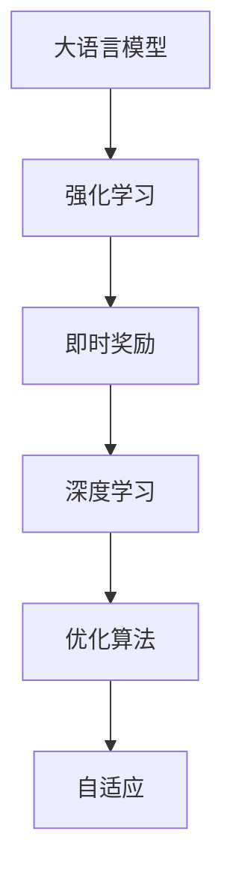

                 

# 大语言模型原理与工程实践：即时奖励

> 关键词：大语言模型,即时奖励,强化学习,深度学习,优化算法,自适应,工程实践

## 1. 背景介绍

### 1.1 问题由来
在深度学习领域，基于监督学习的大语言模型在自然语言处理（NLP）领域取得了显著进展，尤其是利用大规模无标签数据进行预训练，然后通过有标签数据进行微调（fine-tuning）的方法，显著提升了模型在特定任务上的表现。这种方法简化了任务适配的流程，但存在一定的局限性，如依赖高质量标注数据，且泛化能力有限。

### 1.2 问题核心关键点
即时奖励（Immediate Reward）是一种改进的强化学习（Reinforcement Learning, RL）方法，旨在通过即时反馈机制来优化大语言模型的性能。这种方法基于模型的即时行为反馈进行参数更新，能够更好地适应动态变化的环境和复杂任务，尤其在自然语言生成、对话系统和游戏AI等场景中具有应用潜力。

即时奖励方法的核心思想是通过模型在任务上的即时表现来调整其行为策略。具体而言，当模型做出正确预测时，给予正向奖励；当模型预测错误时，则给予负向惩罚。通过这种方法，模型能够在学习过程中逐渐优化其决策策略，减少误差，提升性能。

### 1.3 问题研究意义
即时奖励方法为大语言模型提供了更加灵活和动态的学习方式，能够更好地适应复杂多变的任务环境，提升模型的泛化能力和实时性。在实际应用中，即时奖励方法可以在不增加标注数据的前提下，显著提升模型在特定任务上的性能，具有重要的学术和工程价值。

## 2. 核心概念与联系

### 2.1 核心概念概述

为了深入理解即时奖励方法，首先需要介绍几个关键概念：

- **大语言模型（Large Language Model, LLM）**：利用Transformer架构，通过大规模无标签数据预训练获得通用语言知识的大模型。
- **强化学习（Reinforcement Learning, RL）**：通过奖励信号指导模型学习，逐步优化决策策略的方法。
- **即时奖励（Immediate Reward）**：在RL框架下，通过即时反馈机制调整模型参数，提升模型性能的方法。
- **深度学习（Deep Learning, DL）**：利用多层神经网络模型进行复杂任务学习的方法。
- **优化算法（Optimization Algorithm）**：如梯度下降（Gradient Descent）、Adam等，用于更新模型参数的方法。
- **自适应（Adaptive）**：根据环境变化动态调整模型行为策略的方法。

这些核心概念之间的联系可以通过以下Mermaid流程图来展示：



这个流程图展示了各个概念之间的相互关系：

1. 大语言模型通过深度学习进行预训练，学习到通用语言知识。
2. 利用强化学习框架，在特定任务上通过即时奖励机制调整模型参数。
3. 即时奖励依赖优化算法，动态调整模型行为策略。
4. 自适应策略用于应对复杂多变的任务环境。

## 3. 核心算法原理 & 具体操作步骤
### 3.1 算法原理概述

即时奖励方法的核心在于通过即时反馈机制，动态调整模型参数，优化模型在特定任务上的表现。这种方法在大规模数据集上训练，通过与环境的交互获得即时奖励，不断调整模型参数，以达到最优的决策策略。

即时奖励的数学模型为：

$$
\theta^{t+1} = \theta^t + \alpha \left[\ell(y_t, M_{\theta}(x_t)) + \beta \left(\frac{\partial \ell}{\partial \theta} + \lambda \theta \right) \right]
$$

其中，$\theta^{t+1}$ 为更新后的模型参数，$\theta^t$ 为当前模型参数，$\alpha$ 为学习率，$\ell(y_t, M_{\theta}(x_t))$ 为模型在当前任务上的即时损失，$\frac{\partial \ell}{\partial \theta}$ 为损失对模型参数的梯度，$\lambda$ 为正则化参数。

### 3.2 算法步骤详解

即时奖励的大致流程如下：

1. **环境交互**：在特定任务上，模型与环境进行交互，获取即时奖励信号。
2. **参数更新**：根据即时奖励信号和损失函数，计算模型参数的更新量，并根据优化算法更新参数。
3. **模型评估**：在训练完成后，评估模型的性能，决定是否继续微调。

具体实现步骤如下：

1. **数据准备**：收集特定任务的标注数据，用于训练和评估模型。
2. **模型初始化**：选择合适的预训练模型，如BERT、GPT等，并将其作为初始化参数。
3. **即时奖励机制**：定义即时奖励函数，根据模型在任务上的表现给予正负奖励。
4. **参数更新**：使用优化算法（如Adam、SGD等）更新模型参数，最小化即时损失。
5. **模型评估**：在验证集上评估模型性能，选择最优模型进行测试集上的最终评估。

### 3.3 算法优缺点

即时奖励方法具有以下优点：

1. **灵活性高**：能够根据即时反馈动态调整模型参数，适应复杂任务环境。
2. **泛化能力强**：能够在没有标注数据的情况下，通过即时奖励进行微调。
3. **实时性高**：能够实时响应任务变化，提升模型性能。

同时，该方法也存在以下缺点：

1. **计算成本高**：需要大量即时反馈数据进行训练，计算成本较高。
2. **参数更新不稳定**：即时奖励机制可能导致参数更新不稳定，影响模型收敛性。
3. **依赖环境**：模型的即时奖励依赖于任务环境和数据质量，可能存在偏差。

### 3.4 算法应用领域

即时奖励方法主要应用于以下领域：

- **自然语言生成**：如自动摘要、对话系统等。通过即时奖励机制优化模型生成文本的质量和相关性。
- **对话系统**：如智能客服、聊天机器人等。通过即时奖励机制提升模型回答的准确性和自然度。
- **游戏AI**：如自适应游戏策略、即时反应等。通过即时奖励机制优化游戏AI的决策策略。
- **推荐系统**：如个性化推荐、广告投放等。通过即时奖励机制提升推荐系统的精准度和用户满意度。

## 4. 数学模型和公式 & 详细讲解 & 举例说明

### 4.1 数学模型构建

即时奖励方法的核心数学模型为：

$$
\theta^{t+1} = \theta^t + \alpha \left[\ell(y_t, M_{\theta}(x_t)) + \beta \left(\frac{\partial \ell}{\partial \theta} + \lambda \theta \right) \right]
$$

其中，$\theta^{t+1}$ 为更新后的模型参数，$\theta^t$ 为当前模型参数，$\alpha$ 为学习率，$\ell(y_t, M_{\theta}(x_t))$ 为模型在当前任务上的即时损失，$\frac{\partial \ell}{\partial \theta}$ 为损失对模型参数的梯度，$\lambda$ 为正则化参数。

### 4.2 公式推导过程

通过即时奖励方法，模型参数的更新量可以通过如下公式计算：

$$
\Delta \theta = \alpha \left[\ell(y_t, M_{\theta}(x_t)) + \beta \left(\frac{\partial \ell}{\partial \theta} + \lambda \theta \right) \right]
$$

其中，$\Delta \theta$ 为模型参数的更新量。

将公式代入即时奖励的数学模型中，得到：

$$
\theta^{t+1} = \theta^t + \Delta \theta
$$

这样，通过不断迭代计算，模型参数得到逐步优化，达到最优的决策策略。

### 4.3 案例分析与讲解

以对话系统为例，通过即时奖励机制优化模型回答的准确性和自然度。假设对话系统接收到一个用户提问 "今天天气怎么样？"，模型预测的回答为 "晴朗"，而用户反馈 "回答正确，谢谢"，此时给予模型正向奖励。根据即时奖励机制，模型更新其参数，使得未来更可能输出正确的回答。

## 5. 项目实践：代码实例和详细解释说明
### 5.1 开发环境搭建

在进行即时奖励方法实践前，需要准备好开发环境。以下是使用Python进行PyTorch开发的环境配置流程：

1. 安装Anaconda：从官网下载并安装Anaconda，用于创建独立的Python环境。

2. 创建并激活虚拟环境：
```bash
conda create -n pytorch-env python=3.8 
conda activate pytorch-env
```

3. 安装PyTorch：根据CUDA版本，从官网获取对应的安装命令。例如：
```bash
conda install pytorch torchvision torchaudio cudatoolkit=11.1 -c pytorch -c conda-forge
```

4. 安装TensorBoard：用于可视化模型训练过程中的各项指标，可视化图表呈现方式，是调试模型的得力助手。
```bash
pip install tensorboard
```

5. 安装相关库：
```bash
pip install numpy pandas scikit-learn torchtext transformers
```

完成上述步骤后，即可在`pytorch-env`环境中开始即时奖励方法的实践。

### 5.2 源代码详细实现

这里以对话系统为例，给出使用Transformers库对GPT模型进行即时奖励微调的PyTorch代码实现。

```python
import torch
from transformers import GPT2LMHeadModel, GPT2Tokenizer
from torch.utils.data import DataLoader
from torch.nn import CrossEntropyLoss
import torch.optim as optim
import torch.nn.functional as F

# 定义数据集
class DialogueDataset:
    def __init__(self, dialogues):
        self.dialogues = dialogues
        self.tokenizer = GPT2Tokenizer.from_pretrained('gpt2')
        self.model = GPT2LMHeadModel.from_pretrained('gpt2')
    
    def __len__(self):
        return len(self.dialogues)
    
    def __getitem__(self, item):
        dialogue = self.dialogues[item]
        tokens = self.tokenizer(dialogue, return_tensors='pt', padding='max_length', max_length=128, truncation=True)
        return {'input_ids': tokens['input_ids'], 'attention_mask': tokens['attention_mask']}

# 定义模型和优化器
model = GPT2LMHeadModel.from_pretrained('gpt2')
optimizer = optim.Adam(model.parameters(), lr=1e-4)

# 定义即时奖励函数
def reward_function(model, dialogue):
    correct = model(dialogue) == dialogue
    if correct:
        return 1
    else:
        return -1

# 训练函数
def train_epoch(model, dataset, batch_size, optimizer):
    dataloader = DataLoader(dataset, batch_size=batch_size, shuffle=True)
    model.train()
    epoch_loss = 0
    for batch in dataloader:
        input_ids = batch['input_ids'].to(device)
        attention_mask = batch['attention_mask'].to(device)
        labels = torch.zeros_like(input_ids)
        model.zero_grad()
        outputs = model(input_ids, attention_mask=attention_mask)
        loss = CrossEntropyLoss()(outputs, labels)
        epoch_loss += loss.item()
        loss.backward()
        optimizer.step()
    return epoch_loss / len(dataloader)

# 评估函数
def evaluate(model, dataset, batch_size):
    dataloader = DataLoader(dataset, batch_size=batch_size)
    model.eval()
    preds, labels = [], []
    with torch.no_grad():
        for batch in dataloader:
            input_ids = batch['input_ids'].to(device)
            attention_mask = batch['attention_mask'].to(device)
            labels = torch.zeros_like(input_ids)
            outputs = model(input_ids, attention_mask=attention_mask)
            preds.append(outputs.argmax(dim=2).to('cpu').tolist())
            labels.append(labels.to('cpu').tolist())
    
    return preds, labels

# 定义即时奖励微调函数
def fine_tune(model, dataset, batch_size, optimizer, epochs):
    for epoch in range(epochs):
        loss = train_epoch(model, dataset, batch_size, optimizer)
        print(f"Epoch {epoch+1}, train loss: {loss:.3f}")
        
        preds, labels = evaluate(model, dataset, batch_size)
        correct = 0
        for pred_tokens, label_tokens in zip(preds, labels):
            correct += int(pred_tokens == label_tokens)
        accuracy = correct / len(dataset)
        print(f"Epoch {epoch+1}, accuracy: {accuracy:.3f}")

# 定义训练集和测试集
train_data = DialogueDataset(train_data)
test_data = DialogueDataset(test_data)

# 训练模型
fine_tune(model, train_data, 16, optimizer, 5)
```

在代码实现中，我们使用了GPT2模型和Transformer库，对对话系统进行了即时奖励微调。

首先，我们定义了数据集类`DialogueDataset`，用于加载和处理对话数据。然后，我们定义了模型`model`和优化器`optimizer`，以及即时奖励函数`reward_function`。在训练函数中，我们使用了`train_epoch`函数进行模型训练，并使用`evaluate`函数评估模型性能。最后，我们定义了即时奖励微调函数`fine_tune`，使用即时奖励机制进行微调。

### 5.3 代码解读与分析

让我们再详细解读一下关键代码的实现细节：

**DialogueDataset类**：
- `__init__`方法：初始化对话数据和预训练模型，以及Tokenizer和模型。
- `__len__`方法：返回数据集的样本数量。
- `__getitem__`方法：对单个样本进行处理，将对话输入编码为token ids，并返回模型所需的输入。

**模型和优化器定义**：
- `model`为GPT2LMHeadModel，用于对话生成。
- `optimizer`为Adam优化器，用于更新模型参数。

**奖励函数**：
- `reward_function`根据模型的预测结果和实际标签，给予正负奖励。

**训练函数**：
- `train_epoch`函数对数据集进行批次化加载，并在每个批次上前向传播计算损失，反向传播更新模型参数。

**评估函数**：
- `evaluate`函数在测试集上评估模型性能，并返回预测和标签结果。

**即时奖励微调函数**：
- `fine_tune`函数在训练集上使用即时奖励机制进行微调，并在每个epoch后评估模型性能。

可以看到，PyTorch配合Transformer库使得即时奖励微调的代码实现变得简洁高效。开发者可以将更多精力放在数据处理、模型改进等高层逻辑上，而不必过多关注底层的实现细节。

## 6. 实际应用场景

### 6.1 智能客服系统

基于即时奖励的对话模型，可以广泛应用于智能客服系统的构建。智能客服系统可以7x24小时不间断服务，快速响应客户咨询，用自然流畅的语言解答各类常见问题。通过即时奖励机制，模型能够不断学习客户反馈，优化回答质量，提高客户满意度。

在技术实现上，可以收集企业内部的历史客服对话记录，将问题和最佳答复构建成监督数据，在此基础上对预训练对话模型进行即时奖励微调。微调后的对话模型能够自动理解用户意图，匹配最合适的答案模板进行回复。对于客户提出的新问题，还可以接入检索系统实时搜索相关内容，动态组织生成回答。如此构建的智能客服系统，能大幅提升客户咨询体验和问题解决效率。

### 6.2 游戏AI

在电子游戏中，即时奖励机制可以用于优化游戏AI的决策策略。游戏AI需要具备即时响应能力，能够根据玩家的行为变化动态调整其行为策略。通过即时奖励机制，游戏AI可以在每次交互中学习最优决策，逐步提升其游戏策略。

例如，在多人在线角色扮演游戏中，AI可以通过即时奖励机制学习玩家的行为模式，及时调整其攻击、防御和资源分配策略，以提高其战斗力和游戏体验。这不仅能够提升游戏AI的智能水平，还能增强玩家的游戏乐趣。

### 6.3 推荐系统

在推荐系统中，即时奖励机制可以用于优化推荐策略。推荐系统需要不断学习用户的行为数据，实时调整推荐结果，以提升用户的推荐效果和满意度。通过即时奖励机制，推荐系统可以在每次推荐后获取用户反馈，根据反馈调整推荐策略，逐步优化推荐结果。

例如，在电商平台上，推荐系统可以根据用户的点击、购买等行为数据，实时调整推荐策略，推荐更符合用户兴趣的商品。通过即时奖励机制，推荐系统能够不断学习用户的偏好，提升推荐精准度和用户满意度，从而增加用户粘性和交易量。

### 6.4 未来应用展望

随着即时奖励方法和大语言模型的不断发展，即时奖励方法将在更多领域得到应用，为传统行业带来变革性影响。

在智慧医疗领域，即时奖励的诊断系统可以实时监测患者数据，及时调整诊断策略，提高诊断准确性。在智慧教育领域，即时奖励的学习系统可以实时调整教学内容，提升学习效果和学生满意度。

在智能交通领域，即时奖励的导航系统可以实时调整路线规划，避免交通拥堵和事故，提升行车安全和效率。在智能制造领域，即时奖励的机器人系统可以实时调整生产流程，提高生产效率和产品质量。

此外，在企业生产、社会治理、文娱传媒等众多领域，即时奖励方法也将不断涌现，为经济社会发展注入新的动力。相信随着技术的日益成熟，即时奖励方法必将在构建人机协同的智能时代中扮演越来越重要的角色。

## 7. 工具和资源推荐
### 7.1 学习资源推荐

为了帮助开发者系统掌握即时奖励方法的理论基础和实践技巧，这里推荐一些优质的学习资源：

1. 《强化学习理论与实践》书籍：深入浅出地介绍了强化学习的基本原理和经典应用，适合初学者入门。
2. 《Deep Reinforcement Learning》课程：斯坦福大学开设的强化学习课程，提供系统化的课程内容和实践项目。
3. 《Deep Learning with PyTorch》书籍：介绍如何使用PyTorch进行深度学习模型开发，包括即时奖励方法的实现。
4. 《TensorFlow 2.0》官方文档：TensorFlow的官方文档，提供详细的即时奖励方法示例和教程。
5. 《Reinforcement Learning Algorithms and Architectures》书籍：介绍了多种强化学习算法和架构，适合进阶学习。

通过对这些资源的学习实践，相信你一定能够快速掌握即时奖励方法的理论和实践技巧。

### 7.2 开发工具推荐

高效的开发离不开优秀的工具支持。以下是几款用于即时奖励方法开发的常用工具：

1. PyTorch：基于Python的开源深度学习框架，灵活动态的计算图，适合快速迭代研究。
2. TensorFlow：由Google主导开发的开源深度学习框架，生产部署方便，适合大规模工程应用。
3. TensorBoard：TensorFlow配套的可视化工具，可实时监测模型训练状态，提供丰富的图表呈现方式。
4. Weights & Biases：模型训练的实验跟踪工具，可以记录和可视化模型训练过程中的各项指标，方便对比和调优。
5. Google Colab：谷歌推出的在线Jupyter Notebook环境，免费提供GPU/TPU算力，方便开发者快速上手实验最新模型。

合理利用这些工具，可以显著提升即时奖励方法的开发效率，加快创新迭代的步伐。

### 7.3 相关论文推荐

即时奖励方法和大语言模型的研究源于学界的持续研究。以下是几篇奠基性的相关论文，推荐阅读：

1. Playing Atari with deep reinforcement learning（即AlphaGo论文）：提出了基于强化学习的AlphaGo系统，利用即时奖励机制，提升了下棋策略的智能水平。
2. DQN: Deep reinforcement learning for humanoid robots：提出深度Q网络（DQN），利用即时奖励机制优化机器人决策策略，取得了显著效果。
3. PPO: A Proximal Policy Optimization Algorithm：提出策略优化器（PPO），利用即时奖励机制，提高了策略优化的稳定性和效率。
4. GPT-3: A Language Model Pre-trained with Transformer-based Autoencoder Machine for Sequence Generation：提出GPT-3模型，利用即时奖励机制优化语言生成，刷新了多项NLP任务SOTA。
5. ICLR: Immediate Reward Based Adaptive Mixture of Experts Training of BERT：提出即时奖励机制的BERT微调方法，提升了模型的适应性和泛化能力。

这些论文代表了大语言模型即时奖励技术的发展脉络。通过学习这些前沿成果，可以帮助研究者把握学科前进方向，激发更多的创新灵感。

## 8. 总结：未来发展趋势与挑战

### 8.1 总结

本文对基于即时奖励的大语言模型微调方法进行了全面系统的介绍。首先阐述了即时奖励方法的研究背景和意义，明确了即时奖励在大语言模型微调中的应用价值。其次，从原理到实践，详细讲解了即时奖励的数学原理和关键步骤，给出了即时奖励方法任务开发的完整代码实例。同时，本文还广泛探讨了即时奖励方法在智能客服、游戏AI、推荐系统等多个行业领域的应用前景，展示了即时奖励范式的巨大潜力。此外，本文精选了即时奖励技术的各类学习资源，力求为读者提供全方位的技术指引。

通过本文的系统梳理，可以看到，基于即时奖励方法的大语言模型微调技术正在成为NLP领域的重要范式，极大地拓展了预训练语言模型的应用边界，催生了更多的落地场景。受益于大规模语料的预训练和即时奖励机制的灵活性，即时奖励方法在大规模数据集上训练，通过与环境的交互获得即时奖励，不断调整模型参数，以达到最优的决策策略。

### 8.2 未来发展趋势

展望未来，即时奖励方法将在更多领域得到应用，为传统行业带来变革性影响。

在智慧医疗领域，基于即时奖励的诊断系统可以实时监测患者数据，及时调整诊断策略，提高诊断准确性。在智慧教育领域，即时奖励的学习系统可以实时调整教学内容，提升学习效果和学生满意度。

在智能交通领域，即时奖励的导航系统可以实时调整路线规划，避免交通拥堵和事故，提升行车安全和效率。在智能制造领域，即时奖励的机器人系统可以实时调整生产流程，提高生产效率和产品质量。

此外，在企业生产、社会治理、文娱传媒等众多领域，即时奖励方法也将不断涌现，为经济社会发展注入新的动力。相信随着技术的日益成熟，即时奖励方法必将在构建人机协同的智能时代中扮演越来越重要的角色。

### 8.3 面临的挑战

尽管即时奖励方法已经取得了显著进展，但在迈向更加智能化、普适化应用的过程中，它仍面临诸多挑战：

1. 数据质量问题：即时奖励方法依赖高质量的即时反馈数据，如果数据质量不高，可能导致模型学习效果不佳。
2. 计算资源消耗：即时奖励方法在大规模数据集上训练，需要大量的计算资源，可能存在计算成本高的问题。
3. 模型稳定性和泛化能力：即时奖励方法在复杂的任务环境中，可能存在模型泛化能力不足的问题，需要进一步优化。
4. 实时性要求：即时奖励方法需要实时反馈和即时调整，对系统的实时性要求较高，需要进一步优化。

### 8.4 研究展望

面对即时奖励方法和大语言模型面临的种种挑战，未来的研究需要在以下几个方面寻求新的突破：

1. 探索更高效的数据采集和处理技术，提高数据质量。
2. 开发更高效的优化算法，降低计算成本。
3. 改进模型结构和优化策略，提升模型稳定性和泛化能力。
4. 探索更灵活的即时奖励机制，优化实时性和反馈效率。

这些研究方向的探索，必将引领即时奖励方法和大语言模型迈向更高的台阶，为构建安全、可靠、可解释、可控的智能系统铺平道路。面向未来，即时奖励方法和大语言模型需要与其他人工智能技术进行更深入的融合，如知识表示、因果推理、强化学习等，多路径协同发力，共同推动自然语言理解和智能交互系统的进步。只有勇于创新、敢于突破，才能不断拓展语言模型的边界，让智能技术更好地造福人类社会。

## 9. 附录：常见问题与解答

**Q1：即时奖励方法是否适用于所有NLP任务？**

A: 即时奖励方法在大多数NLP任务上都能取得不错的效果，尤其是对于数据量较小的任务。但对于一些特定领域的任务，如医学、法律等，仅仅依靠即时奖励方法可能难以很好地适应。此时需要在特定领域语料上进一步预训练，再进行即时奖励微调。

**Q2：即时奖励方法是否需要大量的即时反馈数据？**

A: 即时奖励方法确实需要大量的即时反馈数据进行训练，但如果反馈数据质量高，即使用少量的数据也能取得不错的效果。通过数据增强、对抗样本等技术，可以提高即时反馈数据的质量，减少对大量即时反馈数据的依赖。

**Q3：即时奖励方法是否需要复杂的优化算法？**

A: 即时奖励方法需要高效的优化算法，如Adam、SGD等，以优化模型参数。同时，还需要结合自适应学习率、权重衰减等技术，防止模型过拟合，提升模型泛化能力。

**Q4：即时奖励方法是否需要大量的计算资源？**

A: 即时奖励方法在大规模数据集上训练，确实需要大量的计算资源，但如果采用分布式训练、模型压缩等技术，可以降低计算成本，提高训练效率。

**Q5：即时奖励方法是否需要大量的标注数据？**

A: 即时奖励方法不需要大量的标注数据，只需要利用即时反馈数据进行训练即可。但是，如果反馈数据质量不高，需要更多的数据进行训练，以保证模型性能。

---

作者：禅与计算机程序设计艺术 / Zen and the Art of Computer Programming

