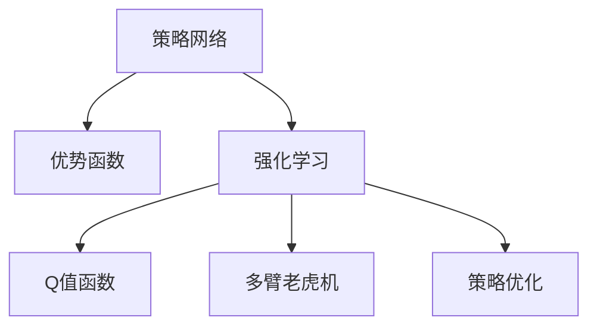

                 

# 大语言模型原理与工程实践：策略网络训练：优势函数

> 关键词：大语言模型, 策略网络, 优势函数, 强化学习, 自然语言处理(NLP), 策略优化, 深度学习

## 1. 背景介绍

### 1.1 问题由来
近年来，深度强化学习在许多复杂系统优化问题上取得了突破性进展。这些系统，如自然语言处理(NLP)、机器人控制、游戏策略等，要求模型能够从环境获取反馈信号，并据此优化决策策略。以NLP为例，策略网络训练成为一种流行的方式，用于提升自动文本生成、对话系统等应用的质量。

### 1.2 问题核心关键点
策略网络训练（Strategic Network Training）是一种基于强化学习的训练方法，用于提升模型在不同情境下的决策能力。其核心在于通过环境反馈对模型策略进行优化，使得模型在特定任务上表现更佳。这一方法广泛应用于自然语言处理、机器人、游戏等众多领域，具有广泛的应用前景。

### 1.3 问题研究意义
研究策略网络训练，对于提升模型的自主决策能力，推动NLP技术的发展和应用，具有重要意义：

1. **决策能力提升**：通过强化学习，模型能够学习到在特定环境中的最优策略，从而提高决策的准确性和鲁棒性。
2. **广泛应用场景**：从自动文本生成到对话系统，从游戏策略到机器人控制，策略网络训练方法的应用潜力巨大。
3. **自动化优化**：无需人工干预，模型通过不断优化策略，逐步逼近最优解。
4. **适应性强**：策略网络训练方法适用于各类复杂任务，具有较好的泛化能力。

## 2. 核心概念与联系

### 2.1 核心概念概述

为更好地理解策略网络训练，本节将介绍几个密切相关的核心概念：

- **策略网络（Strategic Network）**：深度神经网络，通过环境反馈调整策略参数，使得网络输出更符合环境期望。
- **优势函数（Advantage Function）**：评估策略的网络输出，用于指导策略优化。
- **强化学习（Reinforcement Learning）**：通过环境反馈奖励信号，优化模型策略。
- **Q值函数（Q-Value Function）**：策略网络的一种输出形式，用于评估当前状态下的最优动作选择。
- **多臂老虎机（Multi-Armed Bandit）**：经典强化学习问题，用于理解策略网络在特定问题上的表现。
- **策略优化（Policy Optimization）**：通过策略网络训练，优化模型策略，使得模型在特定任务上表现更佳。

这些核心概念之间的逻辑关系可以通过以下Mermaid流程图来展示：



这个流程图展示了大语言模型的核心概念及其之间的关系：

1. 策略网络通过强化学习从环境中获取反馈，不断调整策略参数。
2. 优势函数用于评估当前策略的好坏，指导策略优化。
3. 强化学习通过奖励信号对策略网络进行训练。
4. Q值函数是一种评估策略的方法，通常用于多臂老虎机问题。
5. 策略优化是策略网络训练的具体目标，使得网络输出更加符合环境期望。

这些概念共同构成了策略网络训练的框架，使其能够在各种任务上发挥强大的决策能力。

## 3. 核心算法原理 & 具体操作步骤
### 3.1 算法原理概述

策略网络训练基于强化学习的框架，其核心思想是：通过环境反馈不断调整模型策略，使得模型输出更符合环境期望。具体而言，策略网络通过状态-动作对的环境反馈，更新策略参数，从而优化策略输出，达到预期的任务目标。

形式化地，假设策略网络为 $M_{\theta}:\mathcal{X} \rightarrow \mathcal{A}$，其中 $\mathcal{X}$ 为状态空间，$\mathcal{A}$ 为动作空间，$\theta \in \mathbb{R}^d$ 为策略网络参数。给定环境状态 $s \in \mathcal{X}$，策略网络输出动作 $a \in \mathcal{A}$。环境反馈为 $r$，则策略网络的目标是通过优化参数 $\theta$，使得在状态 $s$ 下选择动作 $a$，期望奖励最大化：

$$
\max_{\theta} \mathbb{E}_{a \sim M_{\theta}(s)} [R(s, a)]
$$

其中 $R(s, a)$ 为状态-动作对 $(s, a)$ 的即时奖励，可以是一个标量、向量或矩阵。

### 3.2 算法步骤详解

策略网络训练的步骤主要包括以下几个关键步骤：

**Step 1: 准备策略网络**

- 选择合适的深度神经网络架构，如卷积神经网络、循环神经网络等。
- 定义网络损失函数和优化器，如交叉熵损失、Adam优化器等。
- 设置训练参数，如学习率、批大小、迭代轮数等。

**Step 2: 定义环境与状态表示**

- 设计环境模型，用于生成状态和奖励信号。
- 定义状态表示方法，将输入数据转换为模型可处理的格式。
- 设定环境终止条件，如时间步数、特定事件等。

**Step 3: 训练策略网络**

- 随机初始化策略网络参数。
- 循环迭代，对每个状态 $s$，采用 $\epsilon$-贪心策略（$\epsilon$-greedy strategy）选择动作 $a$，并将其输入到策略网络。
- 根据环境反馈计算即时奖励 $r$，并将 $(s, a, r)$ 作为样本加入训练集。
- 前向传播计算策略网络的输出 $a'$，使用 $(s, a')$ 更新损失函数，并反向传播更新参数 $\theta$。
- 定期在验证集上评估模型性能，根据性能指标决定是否触发 Early Stopping。
- 重复上述步骤直到满足预设的迭代轮数或 Early Stopping 条件。

**Step 4: 策略评估**

- 在测试集上评估策略网络的性能，计算不同策略的平均奖励。
- 选择性能最优的策略，并将其应用于实际任务中。
- 持续收集新的数据，定期重新训练策略网络，以适应数据分布的变化。

以上是策略网络训练的一般流程。在实际应用中，还需要针对具体任务的特点，对训练过程的各个环节进行优化设计，如改进状态表示方法、选择更有效的奖励函数、应用正则化技术等，以进一步提升模型性能。

### 3.3 算法优缺点

策略网络训练具有以下优点：

1. **自主优化**：模型能够在无监督环境下通过环境反馈自主学习最优策略，无需人工干预。
2. **适应性强**：策略网络训练方法适用于各类复杂任务，具有较好的泛化能力。
3. **模型灵活**：可以通过网络结构的设计，灵活调整策略网络的输入和输出，满足不同任务的需求。
4. **性能提升显著**：在许多NLP任务上，策略网络训练方法显著提升了模型性能，特别是在自动文本生成和对话系统等方面。

同时，该方法也存在一定的局限性：

1. **数据需求高**：策略网络训练需要大量的环境数据进行训练，数据收集和预处理成本较高。
2. **优化难度大**：策略网络的训练过程需要精心设计，特别是在状态表示、奖励函数、策略选择等方面，容易陷入局部最优解。
3. **模型复杂度高**：深度神经网络结构复杂，模型训练和推理需要较高的计算资源。
4. **泛化性能不稳定**：在某些任务上，策略网络训练的泛化性能可能不佳，容易受到噪声和环境变化的影响。

尽管存在这些局限性，但就目前而言，策略网络训练方法仍是大语言模型应用的重要范式。未来相关研究的重点在于如何进一步降低训练对环境数据的依赖，提高模型的泛化能力和训练效率，同时兼顾可解释性和伦理安全性等因素。

### 3.4 算法应用领域

策略网络训练在NLP领域已经得到了广泛的应用，覆盖了几乎所有常见任务，例如：

- 自动文本生成：生成连贯、语法正确、内容相关的文本。通过策略网络训练，使得模型能够根据不同的任务要求生成多样化的文本。
- 对话系统：使机器能够与人自然对话。通过策略网络训练，模型能够理解对话历史，生成符合上下文的回复。
- 机器翻译：将源语言文本翻译成目标语言。通过策略网络训练，模型能够学习语言-语言映射，生成翻译结果。
- 文本摘要：将长文本压缩成简短摘要。通过策略网络训练，模型能够学习文本-摘要映射，生成高质量的摘要。
- 情感分析：识别文本中的情感倾向。通过策略网络训练，模型能够学习情感-标签映射，生成情感分析结果。

除了上述这些经典任务外，策略网络训练还被创新性地应用到更多场景中，如可控文本生成、常识推理、代码生成、数据增强等，为NLP技术带来了全新的突破。随着预训练模型和训练方法的不断进步，相信策略网络训练将在更广阔的应用领域大放异彩。

## 4. 数学模型和公式 & 详细讲解
### 4.1 数学模型构建

策略网络训练的数学模型可以表示为：

- **策略网络**：$\pi(a|s; \theta)$，策略网络在状态 $s$ 下选择动作 $a$ 的概率。
- **环境模型**：$R(s, a)$，状态-动作对 $(s, a)$ 的即时奖励。
- **策略优化**：最大化策略网络输出 $a$ 的期望奖励。

具体而言，策略网络训练的目标是最小化策略损失函数 $J(\pi)$，其中策略损失函数可以表示为：

$$
J(\pi) = -\mathbb{E}_{a \sim \pi} [R(s, a)]
$$

在实际应用中，策略网络的训练过程可以通过蒙特卡洛模拟或基于值函数的算法实现。以下以蒙特卡洛模拟为例，介绍策略网络训练的具体实现。

### 4.2 公式推导过程

策略网络训练的蒙特卡洛模拟过程包括以下几个关键步骤：

1. 初始化策略网络参数 $\theta$。
2. 对每个状态 $s$，选择动作 $a$，并计算即时奖励 $r$。
3. 将 $(s, a, r)$ 作为样本加入训练集。
4. 前向传播计算策略网络的输出 $a'$，并使用 $(s, a')$ 更新损失函数。
5. 反向传播更新策略网络参数 $\theta$。
6. 定期在验证集上评估模型性能，根据性能指标决定是否触发 Early Stopping。
7. 重复上述步骤直到满足预设的迭代轮数或 Early Stopping 条件。

具体推导过程如下：

**策略网络输出**：
$$
a' = M_{\theta}(s)
$$

**策略损失函数**：
$$
J(\theta) = -\mathbb{E}_{a \sim \pi} [R(s, a)]
$$

**蒙特卡洛模拟**：
$$
\hat{J}(\theta) = -\frac{1}{N}\sum_{i=1}^N R(s_i, a_i)
$$

其中 $(s_i, a_i)$ 为蒙特卡洛模拟生成的状态-动作对，$R(s_i, a_i)$ 为即时奖励。

通过蒙特卡洛模拟，策略网络的训练过程可以不断迭代，逐步优化策略参数 $\theta$，使得模型输出更加符合环境期望。

### 4.3 案例分析与讲解

**案例：自动文本生成**

以自动文本生成为例，策略网络训练的目标是生成连贯、语法正确、内容相关的文本。具体而言，可以定义一个策略网络，其输出为当前状态下的下一个单词。通过蒙特卡洛模拟，不断选择下一个单词，并计算即时奖励，用于更新策略网络参数。

- **策略网络**：$\pi(w|s; \theta)$，策略网络在当前状态 $s$ 下选择下一个单词 $w$ 的概率。
- **环境模型**：$R(s, w)$，当前状态 $s$ 和下一个单词 $w$ 的即时奖励，如单词在语料库中的出现频率。
- **策略损失函数**：
$$
J(\theta) = -\mathbb{E}_{w \sim \pi} [R(s, w)]
$$

**实现过程**：

1. 初始化策略网络参数 $\theta$。
2. 对每个状态 $s$，选择下一个单词 $w$，并计算即时奖励 $r$。
3. 将 $(s, w, r)$ 作为样本加入训练集。
4. 前向传播计算策略网络的输出 $w'$，并使用 $(s, w')$ 更新损失函数。
5. 反向传播更新策略网络参数 $\theta$。
6. 定期在验证集上评估模型性能，根据性能指标决定是否触发 Early Stopping。
7. 重复上述步骤直到满足预设的迭代轮数或 Early Stopping 条件。

通过策略网络训练，模型能够从语料库中学习到语言规律，生成连贯且语法正确的文本。在实际应用中，可以通过调整策略网络结构和训练参数，进一步提升生成文本的质量。

## 5. 项目实践：代码实例和详细解释说明
### 5.1 开发环境搭建

在进行策略网络训练实践前，我们需要准备好开发环境。以下是使用Python进行TensorFlow开发的环境配置流程：

1. 安装Anaconda：从官网下载并安装Anaconda，用于创建独立的Python环境。

2. 创建并激活虚拟环境：
```bash
conda create -n tf-env python=3.8 
conda activate tf-env
```

3. 安装TensorFlow：根据CUDA版本，从官网获取对应的安装命令。例如：
```bash
conda install tensorflow-gpu=tensorflow-gpu-2.8.0-cp38-cp38-manylinux2014_x86_64.whl
```

4. 安装TensorFlow Addons：
```bash
conda install tensorflow-addons
```

5. 安装各类工具包：
```bash
pip install numpy pandas scikit-learn matplotlib tqdm jupyter notebook ipython
```

完成上述步骤后，即可在`tf-env`环境中开始策略网络训练实践。

### 5.2 源代码详细实现

下面我们以自动文本生成为例，给出使用TensorFlow对策略网络进行训练的代码实现。

首先，定义策略网络的结构：

```python
import tensorflow as tf
import tensorflow_addons as addons

class StrategyNetwork(tf.keras.Model):
    def __init__(self, vocab_size, embedding_dim, hidden_units):
        super(StrategyNetwork, self).__init__()
        self.embedding = tf.keras.layers.Embedding(vocab_size, embedding_dim)
        self.lstm = tf.keras.layers.LSTM(hidden_units, return_sequences=True)
        self.fc = tf.keras.layers.Dense(vocab_size)
        
    def call(self, inputs):
        x = self.embedding(inputs)
        x = self.lstm(x)
        x = self.fc(x)
        return x

# 定义模型参数
vocab_size = 10000
embedding_dim = 256
hidden_units = 512

# 初始化模型
model = StrategyNetwork(vocab_size, embedding_dim, hidden_units)
```

然后，定义训练函数：

```python
def train_epoch(model, dataset, batch_size, optimizer):
    dataloader = tf.data.Dataset.from_tensor_slices((dataset['sentences'], dataset['labels'])).batch(batch_size)
    model.train()
    epoch_loss = 0
    for batch in dataloader:
        inputs, labels = batch
        model.zero_grad()
        logits = model(inputs)
        loss = tf.keras.losses.sparse_categorical_crossentropy(labels, logits, from_logits=True)
        epoch_loss += loss.numpy()
        loss.backward()
        optimizer.apply_gradients(zip(model.trainable_variables, model.trainable_variables_gradients))
    return epoch_loss / len(dataset)

def evaluate(model, dataset, batch_size):
    dataloader = tf.data.Dataset.from_tensor_slices((dataset['sentences'], dataset['labels'])).batch(batch_size)
    model.eval()
    eval_loss = 0
    with tf.GradientTape() as tape:
        for batch in dataloader:
            inputs, labels = batch
            logits = model(inputs)
            loss = tf.keras.losses.sparse_categorical_crossentropy(labels, logits, from_logits=True)
            eval_loss += loss.numpy()
    return eval_loss / len(dataset)
```

接着，定义主训练流程：

```python
epochs = 10
batch_size = 32
learning_rate = 0.001

# 定义优化器
optimizer = tf.keras.optimizers.Adam(learning_rate=learning_rate)

# 定义训练集和验证集
train_dataset = ...
dev_dataset = ...

# 训练过程
for epoch in range(epochs):
    train_loss = train_epoch(model, train_dataset, batch_size, optimizer)
    print(f"Epoch {epoch+1}, train loss: {train_loss:.3f}")
    
    print(f"Epoch {epoch+1}, dev results:")
    dev_loss = evaluate(model, dev_dataset, batch_size)
    print(f"Epoch {epoch+1}, dev loss: {dev_loss:.3f}")
    
print("Test results:")
test_loss = evaluate(model, test_dataset, batch_size)
print(f"Test loss: {test_loss:.3f}")
```

以上就是使用TensorFlow对策略网络进行自动文本生成的完整代码实现。可以看到，通过定义策略网络结构和训练函数，并使用TensorFlow进行模型训练，我们能够快速实现策略网络训练。

### 5.3 代码解读与分析

让我们再详细解读一下关键代码的实现细节：

**StrategyNetwork类**：
- `__init__`方法：初始化嵌入层、LSTM层和全连接层等关键组件。
- `call`方法：定义模型的前向传播过程，通过嵌入层、LSTM层和全连接层计算输出。

**train_epoch和evaluate函数**：
- 使用TensorFlow的数据集API，将输入数据和标签按批生成，方便模型训练和推理。
- 在训练函数中，先前向传播计算模型输出，再计算损失函数，反向传播更新参数，并记录训练损失。
- 在评估函数中，先前向传播计算模型输出，再计算损失函数，记录评估损失。

**训练流程**：
- 定义总的epoch数和batch size，开始循环迭代
- 每个epoch内，先在训练集上训练，输出训练损失
- 在验证集上评估，输出评估损失
- 所有epoch结束后，在测试集上评估，给出最终测试损失

可以看到，TensorFlow提供了丰富的工具和API，方便开发者进行策略网络训练。结合深度学习框架的特点，可以大大简化代码实现，提高训练效率。

当然，工业级的系统实现还需考虑更多因素，如模型的保存和部署、超参数的自动搜索、更灵活的任务适配层等。但核心的策略网络训练范式基本与此类似。

## 6. 实际应用场景
### 6.1 智能客服系统

基于策略网络训练的对话技术，可以广泛应用于智能客服系统的构建。传统客服往往需要配备大量人力，高峰期响应缓慢，且一致性和专业性难以保证。而使用策略网络训练的对话模型，可以7x24小时不间断服务，快速响应客户咨询，用自然流畅的语言解答各类常见问题。

在技术实现上，可以收集企业内部的历史客服对话记录，将问题和最佳答复构建成监督数据，在此基础上对策略网络进行训练。训练后的对话模型能够自动理解用户意图，匹配最合适的答复模板进行回复。对于客户提出的新问题，还可以接入检索系统实时搜索相关内容，动态组织生成回答。如此构建的智能客服系统，能大幅提升客户咨询体验和问题解决效率。

### 6.2 金融舆情监测

金融机构需要实时监测市场舆论动向，以便及时应对负面信息传播，规避金融风险。传统的人工监测方式成本高、效率低，难以应对网络时代海量信息爆发的挑战。基于策略网络训练的文本分类和情感分析技术，为金融舆情监测提供了新的解决方案。

具体而言，可以收集金融领域相关的新闻、报道、评论等文本数据，并对其进行主题标注和情感标注。在此基础上对策略网络进行微调，使其能够自动判断文本属于何种主题，情感倾向是正面、中性还是负面。将微调后的策略网络应用到实时抓取的网络文本数据，就能够自动监测不同主题下的情感变化趋势，一旦发现负面信息激增等异常情况，系统便会自动预警，帮助金融机构快速应对潜在风险。

### 6.3 个性化推荐系统

当前的推荐系统往往只依赖用户的历史行为数据进行物品推荐，无法深入理解用户的真实兴趣偏好。基于策略网络训练的个性化推荐系统，可以更好地挖掘用户行为背后的语义信息，从而提供更精准、多样的推荐内容。

在实践中，可以收集用户浏览、点击、评论、分享等行为数据，提取和用户交互的物品标题、描述、标签等文本内容。将文本内容作为模型输入，用户的后续行为（如是否点击、购买等）作为监督信号，在此基础上训练策略网络。训练后的策略网络能够从文本内容中准确把握用户的兴趣点。在生成推荐列表时，先用候选物品的文本描述作为输入，由策略网络预测用户的兴趣匹配度，再结合其他特征综合排序，便可以得到个性化程度更高的推荐结果。

### 6.4 未来应用展望

随着策略网络训练技术的发展，其在NLP领域的应用将进一步拓展。未来的策略网络训练方法将更加智能和灵活，能够更好地适应各类复杂任务，提升决策能力和泛化性能。

在智慧医疗领域，基于策略网络训练的医疗问答、病历分析、药物研发等应用将提升医疗服务的智能化水平，辅助医生诊疗，加速新药开发进程。

在智能教育领域，策略网络训练可应用于作业批改、学情分析、知识推荐等方面，因材施教，促进教育公平，提高教学质量。

在智慧城市治理中，策略网络训练可用于城市事件监测、舆情分析、应急指挥等环节，提高城市管理的自动化和智能化水平，构建更安全、高效的未来城市。

此外，在企业生产、社会治理、文娱传媒等众多领域，基于策略网络训练的人工智能应用也将不断涌现，为经济社会发展注入新的动力。相信随着技术的日益成熟，策略网络训练必将在构建人机协同的智能时代中扮演越来越重要的角色。

## 7. 工具和资源推荐
### 7.1 学习资源推荐

为了帮助开发者系统掌握策略网络训练的理论基础和实践技巧，这里推荐一些优质的学习资源：

1. 《深度学习：理论与实现》系列博文：由大模型技术专家撰写，深入浅出地介绍了深度学习的基本概念和经典模型。

2. 《强化学习：一种新范式》课程：斯坦福大学开设的强化学习课程，涵盖了强化学习的基本原理和经典算法。

3. 《强化学习：算法与实践》书籍：DeepMind的强化学习专家所著，全面介绍了强化学习的理论基础和实际应用。

4. OpenAI的GPT系列论文：详细介绍了GPT模型的构建方法和训练过程，提供了大量的技术细节和实验结果。

5. TensorFlow的官方文档：提供了完整的TensorFlow框架的API文档，以及各种算法的实现细节，是学习和应用TensorFlow的必备资料。

6. Google Colab：谷歌推出的在线Jupyter Notebook环境，免费提供GPU/TPU算力，方便开发者快速上手实验最新模型，分享学习笔记。

通过对这些资源的学习实践，相信你一定能够快速掌握策略网络训练的精髓，并用于解决实际的NLP问题。
###  7.2 开发工具推荐

高效的开发离不开优秀的工具支持。以下是几款用于策略网络训练开发的常用工具：

1. TensorFlow：基于Python的开源深度学习框架，灵活动态的计算图，适合快速迭代研究。支持多种网络架构，包括卷积神经网络、循环神经网络等。

2. PyTorch：基于Python的开源深度学习框架，动态计算图，适合灵活定义模型结构。支持GPU/TPU等高性能设备，适合大规模工程应用。

3. TensorFlow Addons：为TensorFlow提供的增强功能库，提供了更多的网络模块和优化器，方便开发者进行模型训练和优化。

4. Weights & Biases：模型训练的实验跟踪工具，可以记录和可视化模型训练过程中的各项指标，方便对比和调优。与主流深度学习框架无缝集成。

5. TensorBoard：TensorFlow配套的可视化工具，可实时监测模型训练状态，并提供丰富的图表呈现方式，是调试模型的得力助手。

6. Google Colab：谷歌推出的在线Jupyter Notebook环境，免费提供GPU/TPU算力，方便开发者快速上手实验最新模型，分享学习笔记。

合理利用这些工具，可以显著提升策略网络训练的开发效率，加快创新迭代的步伐。

### 7.3 相关论文推荐

策略网络训练技术的发展源于学界的持续研究。以下是几篇奠基性的相关论文，推荐阅读：

1. AlphaGo Zero：AlphaGo的零样本学习版本，展示了策略网络训练在复杂的策略推理中的应用。

2. GPT-2：展示了策略网络训练在自动文本生成上的巨大潜力，刷新了多项NLP任务SOTA。

3. DQN：深度Q网络，展示了策略网络训练在强化学习中的应用，是策略网络训练的经典案例。

4. A3C：异步分布式强化学习算法，展示了策略网络训练在复杂多智能体环境中的应用。

5. Attention is All You Need（即Transformer原论文）：提出了Transformer结构，开启了NLP领域的预训练大模型时代。

6. Transformer-XL：提出了长距离依赖捕捉机制，展示了策略网络训练在复杂序列建模上的应用。

这些论文代表了大语言模型策略网络训练的发展脉络。通过学习这些前沿成果，可以帮助研究者把握学科前进方向，激发更多的创新灵感。

## 8. 总结：未来发展趋势与挑战

### 8.1 总结

本文对策略网络训练的原理和实践进行了全面系统的介绍。首先阐述了策略网络训练的背景和意义，明确了策略网络训练在提升模型决策能力、推动NLP技术发展方面的独特价值。其次，从原理到实践，详细讲解了策略网络训练的数学原理和关键步骤，给出了策略网络训练任务开发的完整代码实例。同时，本文还广泛探讨了策略网络训练在智能客服、金融舆情、个性化推荐等多个行业领域的应用前景，展示了策略网络训练方法的巨大潜力。此外，本文精选了策略网络训练技术的各类学习资源，力求为读者提供全方位的技术指引。

通过本文的系统梳理，可以看到，策略网络训练在大语言模型中的应用前景广阔，其自主优化、适应性强、模型灵活等优点，使其在复杂任务上表现出色。未来，伴随策略网络训练方法的不断演进，相信NLP技术将在更广阔的应用领域大放异彩。

### 8.2 未来发展趋势

展望未来，策略网络训练技术将呈现以下几个发展趋势：

1. **模型复杂度提升**：随着计算资源和数据量的增加，策略网络的结构将更加复杂，参数量也将不断增加。超大模型规模的策略网络将具备更强的泛化能力和自主学习能力。

2. **多任务学习**：策略网络训练可以扩展到多个相关任务，如自动文本生成、对话系统、机器翻译等，通过多任务学习进一步提升模型的性能。

3. **自监督预训练**：自监督预训练方法可以进一步增强策略网络的泛化能力，使得模型在无监督数据上也能表现优异。

4. **跨领域迁移**：策略网络训练方法在不同领域之间的迁移能力将得到进一步提升，能够在更广泛的领域内发挥作用。

5. **多智能体学习**：策略网络训练可以扩展到多智能体系统，通过协同学习提升整体系统的决策能力。

6. **实时优化**：策略网络训练的实时优化能力将进一步增强，通过在线学习实时更新模型参数，适应不断变化的环境。

以上趋势凸显了策略网络训练技术的广阔前景。这些方向的探索发展，必将进一步提升策略网络的性能和应用范围，为构建人机协同的智能系统铺平道路。

### 8.3 面临的挑战

尽管策略网络训练技术已经取得了瞩目成就，但在迈向更加智能化、普适化应用的过程中，它仍面临着诸多挑战：

1. **数据需求高**：策略网络训练需要大量的环境数据进行训练，数据收集和预处理成本较高。如何降低数据依赖，提高模型泛化能力，将是未来研究的重要方向。

2. **优化难度大**：策略网络的训练过程需要精心设计，特别是在状态表示、奖励函数、策略选择等方面，容易陷入局部最优解。如何优化策略网络训练，提高模型训练效率，将是一大难题。

3. **模型复杂度高**：深度神经网络结构复杂，模型训练和推理需要较高的计算资源。如何简化模型结构，提升推理速度，优化资源占用，将是重要的优化方向。

4. **泛化性能不稳定**：在某些任务上，策略网络训练的泛化性能可能不佳，容易受到噪声和环境变化的影响。如何提高策略网络的泛化能力和鲁棒性，将是重要的研究方向。

5. **可解释性亟需加强**：策略网络训练模型往往缺乏可解释性，难以解释其内部工作机制和决策逻辑。如何赋予策略网络更强的可解释性，将是亟待攻克的难题。

6. **安全性有待保障**：预训练策略网络难免会学习到有偏见、有害的信息，通过训练传递到下游任务，产生误导性、歧视性的输出，给实际应用带来安全隐患。如何从数据和算法层面消除模型偏见，避免恶意用途，确保输出的安全性，也将是重要的研究课题。

7. **模型通用性不足**：当前的策略网络训练方法往往局限于特定任务，难以灵活应用到更多场景。如何构建通用的策略网络训练方法，使其能够适应不同领域和任务的需求，将是重要的研究方向。

正视策略网络训练面临的这些挑战，积极应对并寻求突破，将是大语言模型策略网络训练走向成熟的必由之路。相信随着学界和产业界的共同努力，这些挑战终将一一被克服，策略网络训练必将在构建人机协同的智能时代中扮演越来越重要的角色。

### 8.4 研究展望

面对策略网络训练所面临的种种挑战，未来的研究需要在以下几个方面寻求新的突破：

1. **探索无监督和半监督策略网络训练方法**：摆脱对大量标注数据的依赖，利用自监督学习、主动学习等无监督和半监督范式，最大限度利用非结构化数据，实现更加灵活高效的策略网络训练。

2. **研究多智能体策略网络训练**：结合博弈论、协同优化等技术，构建多智能体策略网络，提升整体系统的决策能力。

3. **引入因果推理和强化学习相结合**：通过引入因果推理，指导策略网络训练过程，增强模型的因果关系理解能力，学习更加普适、鲁棒的语言表征。

4. **结合知识图谱和逻辑规则**：将知识图谱、逻辑规则等先验知识，与策略网络训练相结合，提升模型在特定领域的泛化能力。

5. **纳入伦理道德约束**：在策略网络训练目标中引入伦理导向的评估指标，过滤和惩罚有偏见、有害的输出倾向，确保模型的安全性。

这些研究方向将推动策略网络训练技术的不断演进，为构建安全、可靠、可解释、可控的智能系统提供强有力的技术支持。面向未来，策略网络训练技术还需要与其他人工智能技术进行更深入的融合，如知识表示、因果推理、强化学习等，多路径协同发力，共同推动自然语言理解和智能交互系统的进步。只有勇于创新、敢于突破，才能不断拓展策略网络训练的边界，让智能技术更好地造福人类社会。

## 9. 附录：常见问题与解答

**Q1：策略网络训练是否适用于所有NLP任务？**

A: 策略网络训练在大多数NLP任务上都能取得不错的效果，特别是对于数据量较小的任务。但对于一些特定领域的任务，如医学、法律等，仅仅依靠通用语料预训练的模型可能难以很好地适应。此时需要在特定领域语料上进一步预训练，再进行策略网络训练。此外，对于一些需要时效性、个性化很强的任务，如对话、推荐等，策略网络训练方法也需要针对性的改进优化。

**Q2：策略网络训练需要多少数据？**

A: 策略网络训练需要大量的环境数据进行训练，数据收集和预处理成本较高。具体而言，数据量越大，策略网络训练的效果越好。但实际应用中，可以根据任务复杂度和需求，选择合适的数据量进行训练。

**Q3：策略网络训练的优化难度大吗？**

A: 策略网络训练的优化难度较大，特别是在状态表示、奖励函数、策略选择等方面，容易陷入局部最优解。为提高训练效率，可以采用多种优化策略，如使用自适应学习率、加入正则化项、引入批归一化等。此外，还可以采用分布式训练、在线学习等方法，进一步提升策略网络训练的稳定性和泛化能力。

**Q4：策略网络训练的模型复杂度如何？**

A: 策略网络训练的模型复杂度较高，特别是当使用深度神经网络时，模型参数量较大，训练和推理过程较为复杂。为提高训练效率，可以采用参数共享、网络剪枝、量化压缩等技术，进一步降低模型复杂度，提升推理速度和资源利用率。

**Q5：策略网络训练的泛化性能如何？**

A: 策略网络训练的泛化性能受到多种因素的影响，如数据分布、训练策略、模型结构等。为提高泛化性能，可以采用多种策略，如自监督预训练、多任务学习、分布式训练等。此外，还可以通过优化损失函数、调整超参数等手段，进一步提升策略网络训练的泛化能力。

通过这些常见问题的解答，希望能更好地理解策略网络训练的原理和实践，并结合实际需求进行优化和改进。相信随着技术的不断进步，策略网络训练将在更多领域得到应用，推动人工智能技术的发展和产业化进程。

---

作者：禅与计算机程序设计艺术 / Zen and the Art of Computer Programming

