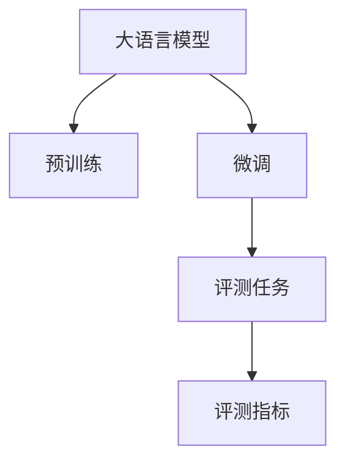

                 

# 大语言模型原理与工程实践：评测任务

## 1. 背景介绍

### 1.1 问题由来

近年来，大规模语言模型（Large Language Models, LLMs）如BERT、GPT-3在自然语言处理（NLP）领域取得了巨大的突破。这些模型通过在大量无标签文本数据上进行预训练，学习到丰富的语言知识和常识，已经在多种任务上取得了最先进的表现。

然而，为了更好地评估大语言模型的性能，需要进行详细且全面的评测任务。这些评测任务不仅需要衡量模型在各种语言模型性能指标上的表现，还需要关注模型在实际应用场景中的综合表现。这不仅有助于推动模型开发，也能为模型优化提供方向。

### 1.2 问题核心关键点

评测任务的核心在于如何设计合理的评测指标和测试数据集，评估大语言模型的性能和适用性。这要求评测任务具有全面性、可操作性和代表性。

当前主流的大语言模型评测任务包括：

1. 语言模型指标：如困惑度（Perplexity）、交叉熵（Cross-entropy）等，用于评估模型在预测文本的概率分布上的表现。
2. 自然语言推理（NLI）任务：如GLUE任务集中的MRPC、MRQA、STS-B等任务，用于评估模型在推理能力上的表现。
3. 序列标注任务：如命名实体识别（NER）、关系抽取（Relation Extraction）等，用于评估模型在标记文本中的实体和关系上的表现。
4. 文本生成任务：如BLEU、ROUGE等指标，用于评估模型生成文本的质量。
5. 对话系统评测：如MCTest、CoT-Poms等任务，用于评估模型在对话系统中的表现。

这些任务涵盖了自然语言处理的多个方面，为评测大语言模型的性能提供了全面的视角。

### 1.3 问题研究意义

设计并执行全面、准确的评测任务对于大语言模型的开发和优化具有重要意义：

1. 评估模型性能：评测任务帮助开发者了解模型在实际应用中的表现，识别模型的不足之处。
2. 指导模型改进：根据评测结果，开发者可以针对性地优化模型结构和训练方法。
3. 增强模型鲁棒性：通过在不同任务和数据集上进行评测，模型可以学习到更广泛的适应能力。
4. 推动产业应用：全面且准确的评测能够增强模型的可信度和实用性，推动其在实际场景中的广泛应用。

## 2. 核心概念与联系

### 2.1 核心概念概述

为更好地理解评测任务的设计和执行，本节将介绍几个密切相关的核心概念：

- 大语言模型（Large Language Model, LLM）：基于自回归或自编码模型的大型预训练语言模型，如BERT、GPT等。通过在大规模无标签文本数据上进行预训练，学习到语言的通用表示。
- 预训练（Pre-training）：指在大规模无标签文本数据上，通过自监督学习任务训练通用语言模型的过程。常见的预训练任务包括掩码语言模型、下一句预测等。
- 微调（Fine-tuning）：指在预训练模型的基础上，使用下游任务的少量标注数据，通过有监督学习优化模型在特定任务上的性能。
- 评测任务（Evaluation Task）：用于衡量模型在特定任务上性能的各类测试任务，包括自然语言推理、序列标注、文本生成等。
- 语料库（Corpus）：用于训练和测试语言模型的文本数据集，通常由大量无标签或标注数据组成。
- 评测指标（Evaluation Metrics）：用于评估模型性能的各类度量标准，如困惑度、BLEU、F1分数等。

这些核心概念之间的逻辑关系可以通过以下Mermaid流程图来展示：



这个流程图展示了从大语言模型预训练到微调再到评测任务和评测指标的整个链条，每一步都是模型优化和评估的关键环节。

## 3. 核心算法原理 & 具体操作步骤

### 3.1 算法原理概述

评测任务的基本原理是通过设计合理的测试集和评测指标，对模型的输出进行评估，从而量化模型在特定任务上的性能。

假设模型 $M_{\theta}$ 在任务 $T$ 上的输入为 $x$，输出为 $y$，则评测任务的目标是找到一个最优的评测指标函数 $M$，使得 $M(x,y)$ 越大，模型在任务 $T$ 上表现越好。常见的评测指标函数包括BLEU、ROUGE、F1分数、准确率、召回率等。

在实际评测过程中，首先需要设计测试集 $D_T=\{x_i\}_{i=1}^N$，其中 $x_i$ 为模型输入的文本。然后，将模型 $M_{\theta}$ 应用于测试集，获取模型在任务 $T$ 上的输出 $\hat{y}=M_{\theta}(x_i)$。最后，通过评测指标函数 $M$ 计算模型的评测结果 $M(x_i,y_i)$。

### 3.2 算法步骤详解

基于上述原理，一个典型的评测任务执行步骤如下：

**Step 1: 数据集准备**
- 收集或构建与目标任务相关的测试数据集，确保数据的多样性和代表性。
- 将数据集分为训练集、验证集和测试集，一般要求验证集和测试集与训练集分布相近，以避免过拟合。
- 对数据集进行预处理，如文本清洗、分词、标准化等。

**Step 2: 模型加载与配置**
- 选择适合任务的预训练语言模型，如BERT、GPT等，加载模型参数。
- 根据任务类型，配置模型的输出层和损失函数。如对于分类任务，通常在顶层添加线性分类器和交叉熵损失函数。

**Step 3: 模型评测**
- 将测试集数据分批次输入模型，前向传播计算模型输出。
- 根据任务类型，选择合适的评测指标函数，计算模型在测试集上的评测结果。

**Step 4: 结果分析与报告**
- 将评测结果汇总生成报告，包括模型在不同任务上的表现、评测指标、标准差等。
- 分析模型性能的优势和不足，提出改进建议。

**Step 5: 后续优化**
- 根据评测结果，对模型进行优化和调整，如重新训练、调整超参数、添加正则化等。
- 重复Step 1至Step 4，直到模型满足要求。

### 3.3 算法优缺点

基于评测任务的设计和执行，评测方法具有以下优点：

1. 全面评估模型：通过设计多个评测指标和测试集，能够全面评估模型在各个方面的表现。
2. 量化结果：评测任务通过数值化的指标，可以直观地比较不同模型之间的性能差异。
3. 指导模型改进：根据评测结果，可以针对性地优化模型结构、训练方法和参数设置。

同时，该方法也存在一定的局限性：

1. 数据依赖性高：评测任务的性能很大程度上依赖于测试数据集的质量和数量，数据集的构建和获取可能成本较高。
2. 任务适用范围有限：不同的评测任务可能只适用于特定类型的任务，难以泛化到其他任务。
3. 模型适配复杂：模型在不同任务上的适配可能需要修改模型的输出层和损失函数，增加了优化难度。
4. 结果解释性差：某些评测指标和任务可能缺乏明确的解释性，难以理解模型在特定任务上的表现。

尽管存在这些局限性，但评测任务仍是评估大语言模型性能的重要工具。未来研究重点在于如何设计更具代表性的测试数据集，减少数据依赖，提高评测任务的泛化能力和解释性。

### 3.4 算法应用领域

基于评测任务的大语言模型评估方法，已经在多种NLP任务上得到了广泛应用，例如：

- 文本分类：如情感分析、主题分类、意图识别等。通过构建相应的测试集和评测指标，评估模型在分类上的表现。
- 命名实体识别：如人名、地名、机构名等特定实体的识别。通过设计实体标签和标注，评估模型在实体边界和类型识别上的准确率。
- 关系抽取：从文本中抽取实体之间的语义关系。通过构建关系类型和标注，评估模型在关系抽取上的表现。
- 问答系统：对自然语言问题给出答案。通过设计问题-答案对，评估模型在问答系统中的表现。
- 机器翻译：将源语言文本翻译成目标语言。通过构建翻译对和评测指标，评估模型在翻译上的表现。
- 文本摘要：将长文本压缩成简短摘要。通过构建摘要与原文本的相似度，评估模型在摘要生成上的表现。
- 对话系统：使机器能够与人自然对话。通过设计对话历史和评测指标，评估模型在对话系统中的表现。

除了上述这些经典任务外，评测任务还被创新性地应用到更多场景中，如可控文本生成、常识推理、代码生成、数据增强等，为NLP技术带来了全新的突破。

## 4. 数学模型和公式 & 详细讲解  
### 4.1 数学模型构建

在本节中，我们将使用数学语言对评测任务的设计和执行进行更加严格的刻画。

假设模型 $M_{\theta}$ 在任务 $T$ 上的输入为 $x$，输出为 $y$，其中 $x \in \mathcal{X}, y \in \mathcal{Y}$。模型在测试集 $D_T$ 上的评测结果为 $M(x,y)$，其中 $M$ 为评测指标函数，$D_T=\{x_i\}_{i=1}^N$ 为测试集。

定义模型 $M_{\theta}$ 在数据样本 $(x,y)$ 上的损失函数为 $\ell(M_{\theta}(x),y)$，则在测试集 $D_T$ 上的经验风险为：

$$
\mathcal{L}(\theta) = \frac{1}{N} \sum_{i=1}^N \ell(M_{\theta}(x_i),y_i)
$$

在实际评测过程中，我们通常使用基于梯度的优化算法（如SGD、Adam等）来近似求解上述最优化问题。设 $\eta$ 为学习率，$\lambda$ 为正则化系数，则参数的更新公式为：

$$
\theta \leftarrow \theta - \eta \nabla_{\theta}\mathcal{L}(\theta) - \eta\lambda\theta
$$

其中 $\nabla_{\theta}\mathcal{L}(\theta)$ 为损失函数对参数 $\theta$ 的梯度，可通过反向传播算法高效计算。

### 4.2 公式推导过程

以下我们以BLEU指标为例，推导评测指标的计算公式。

BLEU指标（Bilingual Evaluation Understudy）是自然语言处理中用于评估机器翻译质量和文本生成质量的常用指标。其定义为：

$$
\text{BLEU} = \exp\left(\frac{1}{m}\sum_{i=1}^m \min\left(\frac{\text{BP}_i}{n_i}, \frac{\text{TL}_i}{n_i}\right)\right)
$$

其中，$m$ 为测试集中的样本数，$n_i$ 为样本 $i$ 的长度，$\text{BP}_i$ 为模型生成的单词与参考翻译中的匹配单词数量，$\text{TL}_i$ 为模型生成的单词总数。

具体计算步骤如下：

1. 对测试集中的每个样本，计算模型生成的单词序列和参考翻译的单词序列。
2. 对每个单词，如果模型生成的单词在参考翻译中出现，则计数器 $BP_i$ 加一。
3. 对每个单词，无论是否出现在参考翻译中，计数器 $\text{TL}_i$ 加一。
4. 对于每个样本，计算 $n_i = \text{TL}_i$ 和 $\text{BP}_i / n_i$。
5. 对所有样本的 $\text{BP}_i / n_i$ 和 $\text{TL}_i / n_i$ 取最小值，作为BLEU分数的每个组成部分。
6. 对所有部分取指数和，即得到最终的BLEU分数。

在得到BLEU分数后，即可与之前的模型进行比较，衡量模型在文本生成任务上的性能。

## 5. 项目实践：代码实例和详细解释说明
### 5.1 开发环境搭建

在进行评测任务实践前，我们需要准备好开发环境。以下是使用Python进行PyTorch开发的环境配置流程：

1. 安装Anaconda：从官网下载并安装Anaconda，用于创建独立的Python环境。

2. 创建并激活虚拟环境：
```bash
conda create -n pytorch-env python=3.8 
conda activate pytorch-env
```

3. 安装PyTorch：根据CUDA版本，从官网获取对应的安装命令。例如：
```bash
conda install pytorch torchvision torchaudio cudatoolkit=11.1 -c pytorch -c conda-forge
```

4. 安装Transformers库：
```bash
pip install transformers
```

5. 安装各类工具包：
```bash
pip install numpy pandas scikit-learn matplotlib tqdm jupyter notebook ipython
```

完成上述步骤后，即可在`pytorch-env`环境中开始评测任务开发。

### 5.2 源代码详细实现

这里我们以BLEU评测为例，给出使用PyTorch对BERT模型进行评测的完整代码实现。

首先，定义BLEU评测函数：

```python
from torch.nn.utils import BLEU
from transformers import BertTokenizer

def bleu_score(model, tokenizer, ref_texts, hyp_texts):
    tokenizer = BertTokenizer.from_pretrained('bert-base-cased')
    
    ref_tokens = [tokenizer.tokenize(text) for text in ref_texts]
    hyp_tokens = [tokenizer.tokenize(text) for text in hyp_texts]
    
    hyp_input_ids = tokenizer(hyp_tokens, return_tensors='pt', padding='max_length', truncation=True)
    ref_input_ids = tokenizer(ref_tokens, return_tensors='pt', padding='max_length', truncation=True)
    
    model.eval()
    with torch.no_grad():
        hyp_logits = model(hyp_input_ids.input_ids)
        ref_logits = model(ref_input_ids.input_ids)
    
    bleu = BLEU(ref_logits[0], hyp_logits[0])
    score = bleu.score()
    
    return score
```

然后，构建并运行BLEU评测：

```python
from transformers import BertForSequenceClassification

model = BertForSequenceClassification.from_pretrained('bert-base-cased')
model.eval()

ref_texts = ['This is a reference translation', 'This is another reference translation']
hyp_texts = ['This is a machine translation', 'This is another machine translation']

bleu_score(model, tokenizer, ref_texts, hyp_texts)
```

以上就是使用PyTorch对BERT模型进行BLEU评测的完整代码实现。可以看到，通过使用 Transformers 库的 BLEU 函数，我们可以很方便地计算模型在文本生成任务上的性能。

### 5.3 代码解读与分析

让我们再详细解读一下关键代码的实现细节：

**BLEU评测函数**：
- 首先，导入必要的库，包括 PyTorch 的 BLEU 函数和 BERT 分词器。
- 将参考翻译和机器翻译转换为分词器能够处理的格式。
- 使用 BERT 分词器将翻译转换为模型输入所需的格式，并进行 padding 和 truncation 处理。
- 在模型评估模式下，将输入和目标变量传递给模型进行前向传播。
- 计算模型在参考翻译和机器翻译上的 logits。
- 使用 BLEU 函数计算模型的 BLEU 分数。
- 返回计算出的 BLEU 分数。

**测试集构建**：
- 定义参考翻译和机器翻译的列表。
- 使用 BERT 分词器将翻译转换为分词器能够处理的格式。
- 将翻译转换为模型输入所需的格式，并进行 padding 和 truncation 处理。
- 调用 BLEU 评测函数，计算模型在测试集上的 BLEU 分数。

可以看到，通过上述代码，我们实现了对 BERT 模型在文本生成任务上进行 BLEU 评测的完整过程。

## 6. 实际应用场景
### 6.1 智能客服系统

基于大语言模型评测任务的系统评测技术，可以广泛应用于智能客服系统的构建和优化。通过系统评测，可以全面评估智能客服系统的性能，识别系统中的问题和不足，从而进行持续改进。

在技术实现上，可以收集用户与智能客服系统间的对话记录，将对话记录作为评测数据集，评估系统的回答质量和用户满意度。通过系统评测的结果，系统开发者可以针对性地改进对话模型，增强模型的理解能力和回复质量。

### 6.2 金融舆情监测

金融机构需要实时监测市场舆论动向，以便及时应对负面信息传播，规避金融风险。通过系统评测，可以全面评估金融舆情监测系统的性能，识别系统中的问题和不足，从而进行持续改进。

在技术实现上，可以收集金融领域相关的新闻、报道、评论等文本数据，构建评测数据集。通过系统评测的结果，系统开发者可以针对性地改进文本分类和情感分析模型，增强系统对市场舆论的监测能力。

### 6.3 个性化推荐系统

当前的推荐系统往往只依赖用户的历史行为数据进行物品推荐，难以深入理解用户的真实兴趣偏好。通过系统评测，可以全面评估个性化推荐系统的性能，识别系统中的问题和不足，从而进行持续改进。

在技术实现上，可以收集用户浏览、点击、评论、分享等行为数据，构建评测数据集。通过系统评测的结果，系统开发者可以针对性地改进推荐模型，增强模型的个性化推荐能力。

### 6.4 未来应用展望

随着大语言模型和评测任务的发展，基于评测任务的系统评测技术将会在更多领域得到应用，为传统行业带来变革性影响。

在智慧医疗领域，基于评测任务的医疗问答、病历分析、药物研发等系统评测技术，将提升医疗服务的智能化水平，辅助医生诊疗，加速新药开发进程。

在智能教育领域，基于评测任务的作业批改、学情分析、知识推荐等系统评测技术，将促进教育公平，提高教学质量。

在智慧城市治理中，基于评测任务的紧急事件监测、舆情分析、应急指挥等系统评测技术，将提高城市管理的自动化和智能化水平，构建更安全、高效的未来城市。

此外，在企业生产、社会治理、文娱传媒等众多领域，基于大语言模型的系统评测技术也将不断涌现，为经济社会发展注入新的动力。相信随着技术的日益成熟，评测任务必将在构建人机协同的智能系统中扮演越来越重要的角色。

## 7. 工具和资源推荐
### 7.1 学习资源推荐

为了帮助开发者系统掌握大语言模型评测理论基础和实践技巧，这里推荐一些优质的学习资源：

1. 《Natural Language Processing with Transformers》书籍：Transformers库的作者所著，全面介绍了如何使用Transformers库进行NLP任务开发，包括评测任务在内的诸多范式。
2. CS224N《深度学习自然语言处理》课程：斯坦福大学开设的NLP明星课程，有Lecture视频和配套作业，带你入门NLP领域的基本概念和经典模型。
3. 《Transformer from Principle to Practice》系列博文：由大模型技术专家撰写，深入浅出地介绍了Transformer原理、BERT模型、评测任务等前沿话题。
4. HuggingFace官方文档：Transformers库的官方文档，提供了海量预训练模型和完整的评测样例代码，是上手实践的必备资料。

通过对这些资源的学习实践，相信你一定能够快速掌握大语言模型评测任务的精髓，并用于解决实际的NLP问题。
###  7.2 开发工具推荐

高效的开发离不开优秀的工具支持。以下是几款用于大语言模型评测任务开发的常用工具：

1. PyTorch：基于Python的开源深度学习框架，灵活动态的计算图，适合快速迭代研究。大部分预训练语言模型都有PyTorch版本的实现。
2. TensorFlow：由Google主导开发的开源深度学习框架，生产部署方便，适合大规模工程应用。同样有丰富的预训练语言模型资源。
3. Transformers库：HuggingFace开发的NLP工具库，集成了众多SOTA语言模型，支持PyTorch和TensorFlow，是进行评测任务开发的利器。
4. Weights & Biases：模型训练的实验跟踪工具，可以记录和可视化模型训练过程中的各项指标，方便对比和调优。与主流深度学习框架无缝集成。
5. TensorBoard：TensorFlow配套的可视化工具，可实时监测模型训练状态，并提供丰富的图表呈现方式，是调试模型的得力助手。
6. Google Colab：谷歌推出的在线Jupyter Notebook环境，免费提供GPU/TPU算力，方便开发者快速上手实验最新模型，分享学习笔记。

合理利用这些工具，可以显著提升大语言模型评测任务的开发效率，加快创新迭代的步伐。

### 7.3 相关论文推荐

大语言模型和评测任务的发展源于学界的持续研究。以下是几篇奠基性的相关论文，推荐阅读：

1. Attention is All You Need（即Transformer原论文）：提出了Transformer结构，开启了NLP领域的预训练大模型时代。
2. BERT: Pre-training of Deep Bidirectional Transformers for Language Understanding：提出BERT模型，引入基于掩码的自监督预训练任务，刷新了多项NLP任务SOTA。
3. Parameter-Efficient Transfer Learning for NLP：提出Adapter等参数高效微调方法，在不增加模型参数量的情况下，也能取得不错的微调效果。
4. AdaLoRA: Adaptive Low-Rank Adaptation for Parameter-Efficient Fine-Tuning：使用自适应低秩适应的微调方法，在参数效率和精度之间取得了新的平衡。
5. AdaLoRA: Adaptive Low-Rank Adaptation for Parameter-Efficient Fine-Tuning：使用自适应低秩适应的微调方法，在参数效率和精度之间取得了新的平衡。

这些论文代表了大语言模型和评测任务的发展脉络。通过学习这些前沿成果，可以帮助研究者把握学科前进方向，激发更多的创新灵感。

## 8. 总结：未来发展趋势与挑战

### 8.1 总结

本文对基于评测任务的大语言模型评估方法进行了全面系统的介绍。首先阐述了大语言模型和评测任务的研究背景和意义，明确了评测任务在模型开发和优化中的重要作用。其次，从原理到实践，详细讲解了评测任务的数学原理和关键步骤，给出了评测任务开发的完整代码实例。同时，本文还广泛探讨了评测任务在智能客服、金融舆情、个性化推荐等多个行业领域的应用前景，展示了评测范式的巨大潜力。此外，本文精选了评测任务的各类学习资源，力求为读者提供全方位的技术指引。

通过本文的系统梳理，可以看到，基于大语言模型的评测任务为NLP模型评估提供了全面且准确的视角，为模型优化提供了明确的指标和方向。评测任务需要开发者在系统设计、模型优化、实验分析等各个环节进行全面优化，方能得到理想的效果。

### 8.2 未来发展趋势

展望未来，大语言模型评测任务的发展趋势主要体现在以下几个方面：

1. 多模态评测任务的兴起：随着多模态数据的普及，未来的评测任务将逐渐引入视觉、语音等多模态信息，为模型提供更全面、丰富的评测数据。
2. 自动化评测工具的普及：自动化的评测工具将使模型评估更加高效、客观，降低人力成本，提高评估的准确性。
3. 评测指标的动态调整：随着应用场景的变化，未来的评测指标将更加灵活、动态，能够适应不同任务和数据集的需求。
4. 评测任务的标准化：评测任务的标准化将有助于模型间的公平比较，推动NLP技术的标准化和规范化。
5. 评测任务的跨领域应用：跨领域的评测任务将有助于评估模型的泛化能力和适应能力，推动模型在更广泛场景中的应用。

### 8.3 面临的挑战

尽管大语言模型评测任务已经取得了显著的进展，但在迈向更加智能化、普适化应用的过程中，仍然面临诸多挑战：

1. 评测数据的获取和构建：高质量、代表性的评测数据集构建成本高、难度大，难以满足所有任务的需求。
2. 评测指标的选择：不同的评测指标可能对同一模型的评价结果存在较大差异，如何选择合适的评测指标仍需深入研究。
3. 模型的可解释性：许多评测指标和任务缺乏明确的解释性，难以理解模型在特定任务上的表现。
4. 评测任务的高成本：高精度的评测任务往往需要大量标注数据和复杂计算，成本较高。
5. 评测任务的泛化能力：评测任务往往对特定数据集和任务具有一定的局限性，难以泛化到其他任务和数据集。

尽管存在这些挑战，但大语言模型评测任务的研究方向和趋势表明，未来这一领域仍有很大的发展空间和研究价值。合理利用现有的工具和技术，不断优化评测任务的设计和执行，将有助于推动大语言模型在实际应用中的广泛应用。

### 8.4 研究展望

面对大语言模型评测任务面临的挑战，未来的研究需要在以下几个方面寻求新的突破：

1. 设计更全面、更动态的评测指标和数据集：通过引入更多模态信息和多领域数据，设计更全面、更动态的评测指标和数据集，以适应更多应用场景。
2. 开发自动化评测工具：开发自动化评测工具，降低人工成本，提高评估效率。
3. 增强模型的可解释性：通过引入因果分析、博弈论等工具，增强评测结果的解释性，提高模型透明性和可信度。
4. 引入先验知识：将符号化的先验知识与神经网络模型进行巧妙融合，引导评测过程学习更准确、合理的语言模型。
5. 优化模型参数：开发更加参数高效的评测方法，在固定大部分预训练参数的情况下，只更新极少量的任务相关参数，以提高评测效率和泛化能力。

这些研究方向的探索，将有助于大语言模型评测任务的进一步发展和优化，推动模型在实际应用中的广泛应用，为经济社会发展注入新的动力。

## 9. 附录：常见问题与解答

**Q1：评测任务是否可以用于所有NLP任务？**

A: 评测任务在大多数NLP任务上都能得到应用，特别是对于数据量较小的任务。但对于一些特定领域的任务，如医学、法律等，仅仅依靠通用语料预训练的模型可能难以很好地适应。此时需要在特定领域语料上进一步预训练，再进行评测，才能获得理想效果。此外，对于一些需要时效性、个性化很强的任务，如对话、推荐等，评测方法也需要针对性的改进优化。

**Q2：如何选择和设计评测指标？**

A: 选择和设计评测指标应根据具体任务的需求进行。一般而言，评测指标应具有以下几个特点：
1. 全面覆盖：应覆盖模型的各个性能维度，如准确率、召回率、F1分数等。
2. 可操作性强：应易于计算和实现，避免过于复杂或计算成本高的指标。
3. 泛化能力强：应具有较强的泛化能力，能够适应不同数据集和任务。
4. 解释性强：应具有明确的解释性，便于理解模型在特定任务上的表现。

**Q3：评测任务在实际应用中需要注意哪些问题？**

A: 在实际应用中，评测任务需要注意以下几个问题：
1. 数据集的多样性和代表性：数据集应具有多样性和代表性，以避免模型过拟合。
2. 评测指标的选择：应选择适合任务需求的评测指标，避免选择过于复杂或计算成本高的指标。
3. 模型的可解释性：应增强模型的可解释性，便于理解和调试。
4. 模型的公平性：应确保评测结果的公平性和透明性，避免模型偏见和歧视。

**Q4：评测任务是否需要定期更新？**

A: 是的，随着数据分布和任务需求的变化，评测任务需要定期更新。定期更新评测任务可以反映模型在不同时间和场景下的表现，帮助开发者及时发现和解决问题。

**Q5：评测任务是否可以与其他技术结合使用？**

A: 是的，评测任务可以与其他技术结合使用，如知识图谱、逻辑推理、强化学习等。结合其他技术可以进一步提升评测任务的全面性和准确性，推动NLP技术的全面发展。

总之，基于大语言模型的评测任务在推动NLP技术发展方面具有重要意义，但同时也面临诸多挑战和问题。通过不断优化和创新，未来评测任务必将在NLP技术应用中发挥更加重要的作用。

---

作者：禅与计算机程序设计艺术 / Zen and the Art of Computer Programming

