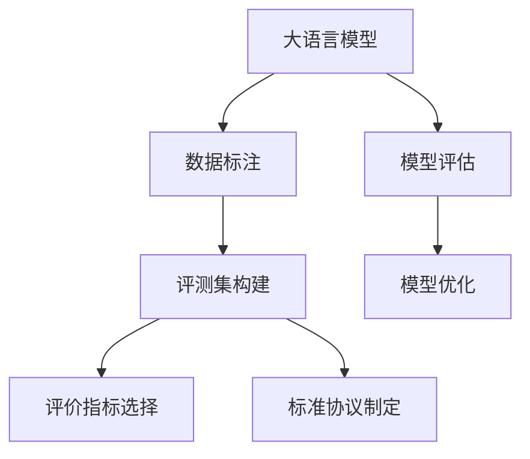

                 

# 大语言模型原理与工程实践：评测集的构建标准

> 关键词：大语言模型, 评测集构建, 评价指标, 标注数据, 数据分析, 标准协议

## 1. 背景介绍

### 1.1 问题由来
随着人工智能技术的快速发展，特别是在自然语言处理(Natural Language Processing, NLP)领域，基于深度学习的大语言模型(Large Language Model, LLM)已经展现出强大的应用潜力。这些模型通过在大规模无标签文本数据上进行预训练，学习到了丰富的语言知识和常识，能够在各种自然语言任务上取得优异的性能。然而，这些模型在实际应用中依然面临诸多挑战，其中评测集构建和评价标准的不统一是核心问题之一。

评测集构建不仅直接影响到模型的评价结果，还会对模型训练和优化产生重要影响。一个合理的评测集能够提供全面且准确的量化指标，帮助开发者更好地理解模型的性能，并指导后续的模型优化和应用。但是，不同研究机构和公司构建的评测集存在差异，缺乏统一的标准和协议，导致评估结果的不一致。这种不统一的评测体系不仅增加了研究和应用的复杂性，也限制了模型的实际应用潜力。因此，本文旨在探讨大语言模型评测集的构建标准，以期为模型的评估、优化和应用提供更加系统化和统一化的指导。

### 1.2 问题核心关键点
构建一个有效的大语言模型评测集，需要考虑以下关键点：

- **评测指标的选择**：应根据具体任务和应用场景选择合适的评价指标。常见的评测指标包括准确率、召回率、F1分数、困惑度、BLEU分数等。
- **数据集的多样性**：评测集应覆盖不同类型和规模的数据，以评估模型在不同场景下的表现。
- **数据标注的规范性**：标注数据的规范性和一致性直接影响评测结果的准确性，应制定详细的标注指南和注释规则。
- **标准协议的制定**：评测集应遵循统一的标准协议，确保评价过程的透明性和公正性。

本文将围绕上述关键点，全面探讨大语言模型评测集的构建标准，从理论到实践，提供一套系统化的指导方案。

## 2. 核心概念与联系

### 2.1 核心概念概述

为更好地理解大语言模型评测集的构建标准，本节将介绍几个密切相关的核心概念：

- **大语言模型(Large Language Model, LLM)**：以自回归(如GPT)或自编码(如BERT)模型为代表的大规模预训练语言模型。通过在大规模无标签文本语料上进行预训练，学习到了丰富的语言知识和常识，具备强大的语言理解和生成能力。

- **评测集(Evaluation Dataset)**：用于评估模型性能的数据集，通常由标注数据和自动评估工具组成。通过评测集，可以量化模型在特定任务上的表现，并指导模型优化。

- **评价指标(Evaluation Metrics)**：用于度量模型性能的定量指标，如准确率、召回率、F1分数等。评价指标的选择应根据具体任务和应用场景进行。

- **数据标注(Annotation)**：将原始文本数据转化为模型可以理解的格式，如将句子分类、标注命名实体、解析依存句法等。数据标注需要遵循一定的规范和标准，以确保标注数据的准确性和一致性。

- **标准协议(Standard Protocol)**：构建评测集时遵循的统一规范和流程，确保评价结果的公正性和透明性。标准协议通常包括数据集划分、评分方法、时间限制等。

这些核心概念之间的逻辑关系可以通过以下Mermaid流程图来展示：



这个流程图展示了评测集构建的核心步骤，以及这些步骤与大语言模型的评估和优化之间的联系。

## 3. 核心算法原理 & 具体操作步骤

### 3.1 算法原理概述

构建大语言模型的评测集，本质上是将模型在特定任务上的表现与预定义的标准进行比较。评测集构建的过程可以分为以下几个步骤：

1. **数据集选择**：选择合适的数据集，涵盖不同类型和规模的文本数据。
2. **数据标注**：对数据集进行标注，生成标注数据。
3. **评价指标选择**：根据具体任务选择合适的评价指标。
4. **标准协议制定**：确保评测过程遵循统一的标准协议。
5. **模型评估**：使用评测集评估模型在特定任务上的性能。
6. **模型优化**：根据评估结果，优化模型结构或参数，提升模型性能。

### 3.2 算法步骤详解

以下详细介绍大语言模型评测集构建的具体操作步骤：

**Step 1: 数据集选择**
- 选择覆盖多种任务的数据集，如命名实体识别、文本分类、机器翻译等。
- 确保数据集的多样性和代表性，涵盖不同领域和主题。

**Step 2: 数据标注**
- 设计详细的标注指南，包括标注规则、注释格式、数据格式等。
- 进行培训，确保标注人员理解标注指南，并严格遵循标注规范。
- 对标注数据进行抽查，确保标注质量。

**Step 3: 评价指标选择**
- 根据具体任务选择合适的评价指标，如准确率、召回率、F1分数、困惑度、BLEU分数等。
- 对指标进行细化，如在命名实体识别任务中，可以使用精确度、召回率、F1分数等。

**Step 4: 标准协议制定**
- 制定统一的评测集划分协议，如训练集、验证集、测试集的划分比例和划分方法。
- 确定评分方法和评分工具，确保评分过程的透明性和一致性。
- 制定时间限制和评估流程，确保评估过程的公正性和公平性。

**Step 5: 模型评估**
- 使用评测集评估模型在特定任务上的性能。
- 记录评估结果，包括各项指标的值和模型在评测集上的表现。
- 分析评估结果，识别模型在特定任务上的强项和弱点。

**Step 6: 模型优化**
- 根据评估结果，优化模型结构或参数，提升模型性能。
- 重新评估模型，确保优化后的模型在特定任务上取得更好的表现。

### 3.3 算法优缺点

构建大语言模型的评测集，具有以下优点：

- **系统性**：通过构建统一的评测集和评价标准，可以系统地评估模型的性能，指导模型优化。
- **可比性**：统一的评测标准使得不同模型的评估结果具有可比性，便于比较和选择。
- **透明性**：统一的评测标准和流程确保了评价过程的透明性和公正性。

同时，构建大语言模型的评测集也存在以下局限：

- **数据标注成本高**：标注数据需要大量人工参与，成本较高。
- **评价标准单一**：单一的评价指标可能无法全面反映模型的性能。
- **模型适应性**：不同的评测集可能对同一模型的评估结果产生差异，模型的适应性需进一步验证。

### 3.4 算法应用领域

构建大语言模型的评测集，在NLP领域得到了广泛应用，具体如下：

- **命名实体识别**：评测集用于评估模型对命名实体的识别精度，如BIO标注的准确率、召回率、F1分数等。
- **文本分类**：评测集用于评估模型对文本分类的准确性，如多分类准确率、混淆矩阵等。
- **机器翻译**：评测集用于评估模型的翻译质量和流畅性，如BLEU分数、METEOR分数等。
- **问答系统**：评测集用于评估模型对问题的理解和回答质量，如精确度、召回率、F1分数等。
- **情感分析**：评测集用于评估模型对情感的识别精度，如情感分类准确率、情感强度评估等。

这些评测集在NLP任务中的应用，极大地推动了模型性能的提升和应用范围的拓展。

## 4. 数学模型和公式 & 详细讲解 & 举例说明

### 4.1 数学模型构建

构建大语言模型的评测集，可以从数学模型和评价指标两个层面进行阐述。

设模型在特定任务上的预测结果为 $\hat{y}$，真实标签为 $y$，则常见的评价指标包括：

- **准确率(Accuracy)**：正确预测的样本占总样本数的比例，公式为 $Accuracy = \frac{TP + TN}{TP + TN + FP + FN}$，其中 $TP$ 为真正例，$TN$ 为真负例，$FP$ 为假正例，$FN$ 为假负例。
- **召回率(Recall)**：正确预测的正样本占所有正样本的比例，公式为 $Recall = \frac{TP}{TP + FN}$。
- **精确率(Precision)**：正确预测的正样本占预测为正样本的比例，公式为 $Precision = \frac{TP}{TP + FP}$。
- **F1分数(F1 Score)**：精确率和召回率的调和平均数，公式为 $F1 = 2 \times \frac{Precision \times Recall}{Precision + Recall}$。

### 4.2 公式推导过程

以二分类任务为例，假设模型在输入 $x$ 上的输出为 $\hat{y} = M_{\theta}(x) \in [0,1]$，表示样本属于正类的概率。真实标签 $y \in \{0,1\}$。则二分类交叉熵损失函数定义为：

$$
\ell(M_{\theta}(x),y) = -[y\log \hat{y} + (1-y)\log (1-\hat{y})]
$$

将其代入经验风险公式，得：

$$
\mathcal{L}(\theta) = -\frac{1}{N}\sum_{i=1}^N [y_i\log M_{\theta}(x_i)+(1-y_i)\log(1-M_{\theta}(x_i))]
$$

根据链式法则，损失函数对参数 $\theta_k$ 的梯度为：

$$
\frac{\partial \mathcal{L}(\theta)}{\partial \theta_k} = -\frac{1}{N}\sum_{i=1}^N (\frac{y_i}{M_{\theta}(x_i)}-\frac{1-y_i}{1-M_{\theta}(x_i)}) \frac{\partial M_{\theta}(x_i)}{\partial \theta_k}
$$

其中 $\frac{\partial M_{\theta}(x_i)}{\partial \theta_k}$ 可进一步递归展开，利用自动微分技术完成计算。

### 4.3 案例分析与讲解

以命名实体识别(NER)任务为例，我们分析如何使用评测集进行模型评估和优化。

假设评测集包含若干个标注好的文本-标签对，每个文本的标签格式为 IOB (Inside-Outside-Begin) 标注，表示每个实体在文本中的位置和类型。例如，一个标注为 "B-PER I-PER O B-LOC I-LOC O" 的句子表示，第一个 "PER" 实体在文本中的位置是 "B" 类型的，第二个 "PER" 实体在文本中的位置是 "I" 类型的，后面的 "LOC" 实体和 "O" 表示其他位置。

在评估模型性能时，可以使用精确度、召回率、F1分数等指标。例如，假设模型在某个文本上的预测标签为 "B-PER I-PER O B-LOC O"，真实标签为 "B-PER I-PER O B-LOC I-LOC O"，则模型的精确度为：

$$
Precision = \frac{TP}{TP + FP} = \frac{2}{4} = 0.5
$$

召回率为：

$$
Recall = \frac{TP}{TP + FN} = \frac{2}{3} \approx 0.67
$$

F1分数为：

$$
F1 = 2 \times \frac{Precision \times Recall}{Precision + Recall} = 2 \times \frac{0.5 \times 0.67}{0.5 + 0.67} \approx 0.57
$$

根据评估结果，可以发现模型在命名实体识别任务中存在一定的性能提升空间。通过模型优化，如增加训练数据、调整模型参数等，可以进一步提升模型的精确度和召回率，从而提升整体的F1分数。

## 5. 项目实践：代码实例和详细解释说明

### 5.1 开发环境搭建

在进行评测集构建实践前，我们需要准备好开发环境。以下是使用Python进行PyTorch开发的环境配置流程：

1. 安装Anaconda：从官网下载并安装Anaconda，用于创建独立的Python环境。

2. 创建并激活虚拟环境：
```bash
conda create -n pytorch-env python=3.8 
conda activate pytorch-env
```

3. 安装PyTorch：根据CUDA版本，从官网获取对应的安装命令。例如：
```bash
conda install pytorch torchvision torchaudio cudatoolkit=11.1 -c pytorch -c conda-forge
```

4. 安装Transformers库：
```bash
pip install transformers
```

5. 安装各类工具包：
```bash
pip install numpy pandas scikit-learn matplotlib tqdm jupyter notebook ipython
```

完成上述步骤后，即可在`pytorch-env`环境中开始评测集构建实践。

### 5.2 源代码详细实现

下面我们以命名实体识别(NER)任务为例，给出使用Transformers库对BERT模型进行评估的PyTorch代码实现。

首先，定义NER任务的数据处理函数：

```python
from transformers import BertTokenizer
from torch.utils.data import Dataset
import torch

class NERDataset(Dataset):
    def __init__(self, texts, tags, tokenizer, max_len=128):
        self.texts = texts
        self.tags = tags
        self.tokenizer = tokenizer
        self.max_len = max_len
        
    def __len__(self):
        return len(self.texts)
    
    def __getitem__(self, item):
        text = self.texts[item]
        tags = self.tags[item]
        
        encoding = self.tokenizer(text, return_tensors='pt', max_length=self.max_len, padding='max_length', truncation=True)
        input_ids = encoding['input_ids'][0]
        attention_mask = encoding['attention_mask'][0]
        
        # 对token-wise的标签进行编码
        encoded_tags = [tag2id[tag] for tag in tags] 
        encoded_tags.extend([tag2id['O']] * (self.max_len - len(encoded_tags)))
        labels = torch.tensor(encoded_tags, dtype=torch.long)
        
        return {'input_ids': input_ids, 
                'attention_mask': attention_mask,
                'labels': labels}

# 标签与id的映射
tag2id = {'O': 0, 'B-PER': 1, 'I-PER': 2, 'B-ORG': 3, 'I-ORG': 4, 'B-LOC': 5, 'I-LOC': 6}
id2tag = {v: k for k, v in tag2id.items()}

# 创建dataset
tokenizer = BertTokenizer.from_pretrained('bert-base-cased')

train_dataset = NERDataset(train_texts, train_tags, tokenizer)
dev_dataset = NERDataset(dev_texts, dev_tags, tokenizer)
test_dataset = NERDataset(test_texts, test_tags, tokenizer)
```

然后，定义评估函数：

```python
from torch.utils.data import DataLoader
from tqdm import tqdm
from sklearn.metrics import classification_report

device = torch.device('cuda') if torch.cuda.is_available() else torch.device('cpu')
model = BertForTokenClassification.from_pretrained('bert-base-cased', num_labels=len(tag2id))

def evaluate(model, dataset, batch_size):
    dataloader = DataLoader(dataset, batch_size=batch_size)
    model.eval()
    preds, labels = [], []
    with torch.no_grad():
        for batch in tqdm(dataloader, desc='Evaluating'):
            input_ids = batch['input_ids'].to(device)
            attention_mask = batch['attention_mask'].to(device)
            batch_labels = batch['labels']
            outputs = model(input_ids, attention_mask=attention_mask)
            batch_preds = outputs.logits.argmax(dim=2).to('cpu').tolist()
            batch_labels = batch_labels.to('cpu').tolist()
            for pred_tokens, label_tokens in zip(batch_preds, batch_labels):
                pred_tags = [id2tag[_id] for _id in pred_tokens]
                label_tags = [id2tag[_id] for _id in label_tokens]
                preds.append(pred_tags[:len(label_tokens)])
                labels.append(label_tags)
                
    print(classification_report(labels, preds))
```

最后，启动评估流程：

```python
print('Evaluation results:')
evaluate(model, test_dataset, batch_size)
```

以上就是使用PyTorch对BERT进行命名实体识别任务评估的完整代码实现。可以看到，得益于Transformers库的强大封装，我们可以用相对简洁的代码完成BERT模型的评估。

### 5.3 代码解读与分析

让我们再详细解读一下关键代码的实现细节：

**NERDataset类**：
- `__init__`方法：初始化文本、标签、分词器等关键组件。
- `__len__`方法：返回数据集的样本数量。
- `__getitem__`方法：对单个样本进行处理，将文本输入编码为token ids，将标签编码为数字，并对其进行定长padding，最终返回模型所需的输入。

**tag2id和id2tag字典**：
- 定义了标签与数字id之间的映射关系，用于将token-wise的预测结果解码回真实的标签。

**评估函数**：
- 使用PyTorch的DataLoader对数据集进行批次化加载，供模型评估使用。
- 定义评估函数`evaluate`：对数据以批为单位进行迭代，在每个批次上前向传播计算损失函数。
- 将预测标签与真实标签进行对比，使用classification_report对评估结果进行打印输出。

**评估流程**：
- 定义总的batch size，开始循环迭代
- 每个epoch内，在测试集上评估，输出分类指标
- 所有epoch结束后，输出最终的测试结果

可以看到，PyTorch配合Transformers库使得BERT评估的代码实现变得简洁高效。开发者可以将更多精力放在数据处理、模型改进等高层逻辑上，而不必过多关注底层的实现细节。

当然，工业级的系统实现还需考虑更多因素，如模型的保存和部署、超参数的自动搜索、更灵活的任务适配层等。但核心的评估范式基本与此类似。

## 6. 实际应用场景

### 6.1 智能客服系统

构建合理的评测集对智能客服系统的构建至关重要。智能客服系统需要能够7x24小时不间断服务，快速响应客户咨询，用自然流畅的语言解答各类常见问题。因此，需要构建一个高质量的评测集，涵盖常见客户咨询场景，评估模型在问答、对话、情感分析等任务上的表现。

在技术实现上，可以收集企业内部的历史客服对话记录，将问题和最佳答复构建成监督数据，在此基础上对预训练对话模型进行微调。微调后的对话模型能够自动理解用户意图，匹配最合适的答案模板进行回复。对于客户提出的新问题，还可以接入检索系统实时搜索相关内容，动态组织生成回答。如此构建的智能客服系统，能大幅提升客户咨询体验和问题解决效率。

### 6.2 金融舆情监测

金融舆情监测需要实时监测市场舆论动向，以便及时应对负面信息传播，规避金融风险。构建一个高质量的评测集，涵盖金融领域相关的新闻、报道、评论等文本数据，并对其进行主题标注和情感标注。在此基础上对预训练语言模型进行微调，使其能够自动判断文本属于何种主题，情感倾向是正面、中性还是负面。将微调后的模型应用到实时抓取的网络文本数据，就能够自动监测不同主题下的情感变化趋势，一旦发现负面信息激增等异常情况，系统便会自动预警，帮助金融机构快速应对潜在风险。

### 6.3 个性化推荐系统

个性化推荐系统需要不断更新推荐内容，以适应用户兴趣的变化。构建一个高质量的评测集，涵盖用户的历史行为数据，如浏览、点击、评论、分享等行为数据，提取和用户交互的物品标题、描述、标签等文本内容。将文本内容作为模型输入，用户的后续行为（如是否点击、购买等）作为监督信号，在此基础上微调预训练语言模型。微调后的模型能够从文本内容中准确把握用户的兴趣点。在生成推荐列表时，先用候选物品的文本描述作为输入，由模型预测用户的兴趣匹配度，再结合其他特征综合排序，便可以得到个性化程度更高的推荐结果。

### 6.4 未来应用展望

随着大语言模型和评测集构建技术的发展，基于微调的方法将在更多领域得到应用，为传统行业带来变革性影响。

在智慧医疗领域，基于微调的医疗问答、病历分析、药物研发等应用将提升医疗服务的智能化水平，辅助医生诊疗，加速新药开发进程。

在智能教育领域，微调技术可应用于作业批改、学情分析、知识推荐等方面，因材施教，促进教育公平，提高教学质量。

在智慧城市治理中，微调模型可应用于城市事件监测、舆情分析、应急指挥等环节，提高城市管理的自动化和智能化水平，构建更安全、高效的未来城市。

此外，在企业生产、社会治理、文娱传媒等众多领域，基于大语言模型微调的人工智能应用也将不断涌现，为NLP技术带来新的突破。相信随着技术的日益成熟，微调方法将成为人工智能落地应用的重要范式，推动人工智能技术向更广阔的领域加速渗透。

## 7. 工具和资源推荐

### 7.1 学习资源推荐

为了帮助开发者系统掌握大语言模型评测集的构建标准，这里推荐一些优质的学习资源：

1. 《自然语言处理入门》课程：斯坦福大学开设的NLP入门课程，适合初学者快速了解NLP的基本概念和经典模型。

2. CS224N《深度学习自然语言处理》课程：斯坦福大学开设的NLP明星课程，有Lecture视频和配套作业，带你深入理解NLP的核心算法。

3. 《自然语言处理与Python》书籍：介绍如何使用Python进行NLP任务开发的书籍，涵盖数据处理、模型构建、评估等多个环节。

4. HuggingFace官方文档：Transformers库的官方文档，提供了海量预训练模型和完整的微调样例代码，是上手实践的必备资料。

5. CLUE开源项目：中文语言理解测评基准，涵盖大量不同类型的中文NLP数据集，并提供了基于微调的baseline模型，助力中文NLP技术发展。

通过对这些资源的学习实践，相信你一定能够快速掌握大语言模型评测集的构建标准，并用于解决实际的NLP问题。

### 7.2 开发工具推荐

高效的开发离不开优秀的工具支持。以下是几款用于大语言模型评测集构建开发的常用工具：

1. PyTorch：基于Python的开源深度学习框架，灵活动态的计算图，适合快速迭代研究。大部分预训练语言模型都有PyTorch版本的实现。

2. TensorFlow：由Google主导开发的开源深度学习框架，生产部署方便，适合大规模工程应用。同样有丰富的预训练语言模型资源。

3. Transformers库：HuggingFace开发的NLP工具库，集成了众多SOTA语言模型，支持PyTorch和TensorFlow，是进行评测集构建开发的利器。

4. Weights & Biases：模型训练的实验跟踪工具，可以记录和可视化模型训练过程中的各项指标，方便对比和调优。与主流深度学习框架无缝集成。

5. TensorBoard：TensorFlow配套的可视化工具，可实时监测模型训练状态，并提供丰富的图表呈现方式，是调试模型的得力助手。

6. Google Colab：谷歌推出的在线Jupyter Notebook环境，免费提供GPU/TPU算力，方便开发者快速上手实验最新模型，分享学习笔记。

合理利用这些工具，可以显著提升大语言模型评测集构建的开发效率，加快创新迭代的步伐。

### 7.3 相关论文推荐

大语言模型和评测集构建技术的发展源于学界的持续研究。以下是几篇奠基性的相关论文，推荐阅读：

1. Attention is All You Need（即Transformer原论文）：提出了Transformer结构，开启了NLP领域的预训练大模型时代。

2. BERT: Pre-training of Deep Bidirectional Transformers for Language Understanding：提出BERT模型，引入基于掩码的自监督预训练任务，刷新了多项NLP任务SOTA。

3. Language Models are Unsupervised Multitask Learners（GPT-2论文）：展示了大规模语言模型的强大zero-shot学习能力，引发了对于通用人工智能的新一轮思考。

4. Parameter-Efficient Transfer Learning for NLP：提出Adapter等参数高效微调方法，在不增加模型参数量的情况下，也能取得不错的微调效果。

5. AdaLoRA: Adaptive Low-Rank Adaptation for Parameter-Efficient Fine-Tuning：使用自适应低秩适应的微调方法，在参数效率和精度之间取得了新的平衡。

这些论文代表了大语言模型评测集构建技术的发展脉络。通过学习这些前沿成果，可以帮助研究者把握学科前进方向，激发更多的创新灵感。

## 8. 总结：未来发展趋势与挑战

### 8.1 总结

本文对大语言模型评测集的构建标准进行了全面系统的介绍。首先阐述了构建评测集的必要性和重要性，明确了评测集在模型评估、优化和应用中的关键作用。其次，从原理到实践，详细讲解了评测集构建的各个步骤和关键要素，提供了系统化的指导方案。最后，本文还探讨了评测集在NLP领域的具体应用，展示了评测集构建技术的广泛应用前景。

通过本文的系统梳理，可以看到，构建大语言模型的评测集不仅具有理论意义，更具有实际应用价值。一个合理的评测集可以提供全面且准确的量化指标，帮助开发者更好地理解模型的性能，并指导模型优化和应用。未来，随着大语言模型和评测集构建技术的发展，这种评价体系将更加系统化和规范化，为模型评估、优化和应用提供更坚实的保障。

### 8.2 未来发展趋势

展望未来，大语言模型评测集构建技术将呈现以下几个发展趋势：

1. **多样性增加**：未来的评测集将更加多样化和全面化，涵盖不同领域、不同类型的数据，以评估模型在更复杂、更广泛的应用场景中的表现。

2. **自动化评价**：自动化评价工具的发展将提高评测效率，降低人工干预的误差。基于模型预测结果的自动评估方法将逐步取代传统的手工标注方式。

3. **数据生成技术**：通过数据生成技术（如对抗样本、噪声注入等），构建更真实的评测集，评估模型在实际应用中的鲁棒性和泛化能力。

4. **跨模态融合**：将视觉、语音、文本等多模态数据进行融合，构建多模态评测集，评估模型的跨模态理解和生成能力。

5. **动态更新机制**：建立动态更新机制，随着数据分布的变化，实时更新评测集，确保评估结果的及时性和有效性。

6. **伦理和安全**：在构建评测集时，引入伦理和安全导向的指标，评估模型在隐私保护、公平性、安全性等方面的表现，确保模型的可解释性和可控性。

以上趋势凸显了大语言模型评测集构建技术的广阔前景。这些方向的探索发展，必将进一步提升模型性能的评估质量和应用价值，为人工智能技术的全面落地提供坚实的技术保障。

### 8.3 面临的挑战

尽管大语言模型评测集构建技术已经取得了瞩目成就，但在迈向更加智能化、普适化应用的过程中，它仍面临着诸多挑战：

1. **数据标注成本高**：构建高质量的评测集需要大量人工参与，成本较高。如何降低标注成本，提高标注效率，是未来的研究方向之一。

2. **数据多样性不足**：现有评测集可能无法覆盖所有应用场景，导致模型评估结果存在偏差。如何构建更加多样化和全面的评测集，是未来需要解决的问题。

3. **模型鲁棒性不足**：现有评测集可能无法充分评估模型的鲁棒性，模型在处理异常数据或对抗样本时可能出现严重性能下降。如何构建鲁棒性更强的评测集，是未来的研究方向之一。

4. **评分标准单一**：现有评测集可能只考虑部分评价指标，忽略其他重要方面，导致评估结果片面。如何构建更加全面和综合的评测集，是未来需要解决的问题。

5. **模型可解释性不足**：现有评测集可能无法评估模型的可解释性，模型在处理复杂任务时可能缺乏可解释性。如何构建可解释性更强的评测集，是未来的研究方向之一。

6. **数据隐私和安全**：在构建评测集时，如何保护数据隐私和安全，确保数据和模型不被滥用，是未来需要解决的问题。

正视评测集构建面临的这些挑战，积极应对并寻求突破，将是大语言模型评测集构建走向成熟的必由之路。相信随着学界和产业界的共同努力，这些挑战终将一一被克服，大语言模型评测集构建必将在构建安全、可靠、可解释、可控的智能系统中扮演越来越重要的角色。

### 8.4 研究展望

面向未来，大语言模型评测集构建技术还需要与其他人工智能技术进行更深入的融合，如知识表示、因果推理、强化学习等，多路径协同发力，共同推动自然语言理解和智能交互系统的进步。只有勇于创新、敢于突破，才能不断拓展语言模型的边界，让智能技术更好地造福人类社会。

---

作者：禅与计算机程序设计艺术 / Zen and the Art of Computer Programming

