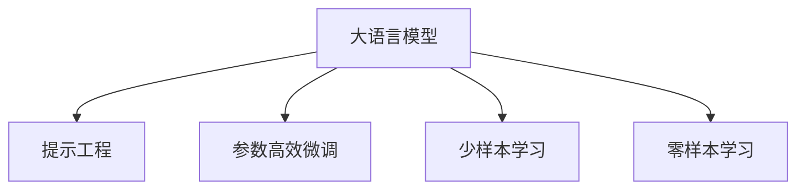

                 

# 大语言模型应用指南：什么是提示工程

## 1. 背景介绍

### 1.1 问题由来

随着人工智能技术的飞速发展，大语言模型（Large Language Models, LLMs）在自然语言处理（NLP）领域取得了令人瞩目的成就。以OpenAI的GPT、Google的BERT等为代表的大语言模型，已经在各种NLP任务上展现了强大的表现能力。然而，即使这些大模型拥有数亿甚至数十亿的参数，当应用于特定任务时，仍需要进一步的微调和优化。

提示工程（Prompt Engineering）作为一种在大语言模型上进行任务适配的技术，近年来逐渐受到研究者和实践者的关注。提示工程的核心在于通过设计精巧的输入文本格式，引导大语言模型按照特定任务的要求生成或判断输出，从而在特定任务上获得更高的性能。

### 1.2 问题核心关键点

提示工程的核心理念是：通过精心设计的输入文本，即提示（Prompt），使得大语言模型能够更加准确地理解和生成任务相关的输出。提示工程不依赖于大量标注数据，能够在不增加训练成本和数据需求的情况下，显著提升模型性能。

提示工程主要关注以下几个关键问题：
1. **提示设计**：如何设计出既能充分体现任务要求，又能激发模型最佳表现的输入文本格式。
2. **参数高效**：如何在保持提示文本长度适中的情况下，最大化地利用大模型的能力，减少微调所需的计算资源。
3. **跨任务通用性**：如何设计通用的提示模板，使其能够应用于多种NLP任务，避免针对每个任务重新设计提示。
4. **可解释性**：如何设计提示，使得模型的决策过程透明、可解释，便于调试和优化。

提示工程已经在问答系统、文本生成、情感分析、翻译等多个NLP任务中取得了显著效果，成为大语言模型应用的重要手段之一。

### 1.3 问题研究意义

提示工程的研究意义主要体现在以下几个方面：
1. **降低开发成本**：提示工程减少了对标注数据的需求，降低了模型的训练和微调成本。
2. **提升模型性能**：精巧设计的提示能够显著提升模型在特定任务上的表现。
3. **加速应用落地**：提示工程使得模型可以更快地适配特定任务，缩短开发周期。
4. **技术创新**：提示工程的探索促进了NLP技术的深度挖掘和创新。
5. **产业应用**：提示工程技术能够被广泛应用到各个垂直领域，推动AI技术在实际场景中的落地和应用。

## 2. 核心概念与联系

### 2.1 核心概念概述

提示工程涉及的核心概念包括：

- **大语言模型（LLMs）**：以自回归（如GPT）或自编码（如BERT）模型为代表，通过大规模无标签文本数据预训练得到的通用语言模型。
- **提示（Prompt）**：输入文本的模板或格式，用于引导模型按照特定任务要求生成输出。
- **参数高效微调（Parameter-Efficient Fine-Tuning, PEFT）**：在不更新模型大量参数的情况下，只微调顶层或部分关键层，减少微调所需的计算资源。
- **少样本学习（Few-shot Learning）**：通过少量示例数据，利用提示工程技术实现模型的少样本学习。
- **零样本学习（Zero-shot Learning）**：仅通过任务描述，模型能够不依赖任何标注数据进行预测。

这些概念通过以下Mermaid流程图展示其逻辑关系：



### 2.2 核心概念原理和架构

大语言模型通常基于Transformer架构，由多层自注意力机制和前馈神经网络组成。Transformer的结构使得模型能够高效地处理长序列，捕捉序列间的依赖关系。大语言模型通过自监督学习任务（如掩码语言模型）在大量无标签数据上进行预训练，学习到通用的语言表示。

提示工程的核心在于设计合适的输入文本格式。好的提示设计能够激活模型中的特定部分，使其更专注于任务相关的特征提取和推理，从而在特定任务上表现更佳。

## 3. 核心算法原理 & 具体操作步骤

### 3.1 算法原理概述

提示工程的核心算法原理包括：
1. **提示设计**：通过分析任务特点，设计合适的提示文本格式，引导模型进行特定任务推理。
2. **参数高效微调**：在保持提示文本长度适中的情况下，只微调模型中的部分参数，减少计算资源消耗。
3. **少样本学习**：利用提示工程技术，在少量示例数据上实现模型的少样本学习，提高泛化能力。
4. **零样本学习**：通过精心设计的提示文本，使模型能够理解任务要求并生成相应输出，无需任何训练数据。

### 3.2 算法步骤详解

提示工程的具体操作步骤如下：

1. **任务分析**：分析任务的特性，确定模型需要提取的关键信息。
2. **提示设计**：根据任务要求，设计合适的提示文本格式。
3. **模型微调**：在微调过程中，只更新模型中的部分参数，减少计算资源消耗。
4. **测试与优化**：在验证集上评估模型性能，根据结果调整提示和微调策略。

### 3.3 算法优缺点

提示工程的优点包括：
1. **降低标注数据需求**：提示工程通过设计精巧的提示文本，减少了对大量标注数据的需求。
2. **提升模型泛化能力**：精巧设计的提示文本能够引导模型在特定任务上获得更好的泛化性能。
3. **加速模型开发**：提示工程使得模型可以更快地适配特定任务，缩短开发周期。

提示工程的缺点包括：
1. **设计复杂度较高**：提示文本的设计需要充分理解任务特点，具有一定的挑战性。
2. **效果不稳定**：提示文本的设计质量直接影响模型性能，设计不当可能导致性能下降。
3. **可解释性不足**：提示工程的决策过程缺乏可解释性，难以调试和优化。

### 3.4 算法应用领域

提示工程已经在多种NLP任务中得到了应用，包括：

- **问答系统**：通过设计提示模板，使模型能够理解问题并生成合适的回答。
- **文本生成**：通过设计生成提示，使模型能够生成高质量的文本内容。
- **情感分析**：通过设计情感分析提示，使模型能够准确判断文本的情感倾向。
- **翻译**：通过设计翻译提示，使模型能够将文本从一种语言翻译成另一种语言。
- **摘要生成**：通过设计摘要生成提示，使模型能够将长文本压缩成简洁的摘要。

这些应用展示了提示工程技术的广泛适用性和潜力。

## 4. 数学模型和公式 & 详细讲解 & 举例说明

### 4.1 数学模型构建

提示工程涉及的数学模型构建如下：

假设任务为$T$，输入文本为$x$，输出为$y$，模型为$M_{\theta}$。提示工程的数学模型为：

$$
y = M_{\theta}(x, \text{Prompt})
$$

其中，$\text{Prompt}$为提示文本格式。

### 4.2 公式推导过程

假设任务为问答系统，提示工程的具体推导过程如下：

1. **任务分析**：分析问答系统任务，确定需要提取的关键信息，如问题中的实体、上下文等。
2. **提示设计**：设计合适的提示文本格式，例如："根据<context>，请回答<question>"
3. **模型微调**：在微调过程中，只更新模型中的部分参数，例如顶层分类器或解码器。
4. **测试与优化**：在验证集上评估模型性能，根据结果调整提示和微调策略。

### 4.3 案例分析与讲解

以问答系统为例，我们设计一个提示文本：

```
根据如下上下文，请回答以下问题：
context: 某个具体的背景信息
question: 具体的问题
```

模型在接收到提示文本后，首先会分析上下文中的关键信息，然后根据问题的类型（如实体识别、关系抽取等）提取相关特征，最终生成答案。

## 5. 项目实践：代码实例和详细解释说明

### 5.1 开发环境搭建

进行提示工程的实践，需要准备以下开发环境：

1. 安装Python：从官网下载并安装Python 3.8及以上版本。
2. 安装PyTorch：通过pip安装，命令为`pip install torch`。
3. 安装Transformers库：通过pip安装，命令为`pip install transformers`。
4. 安装其他必要的库，如Numpy、Pandas、Scikit-learn等。

### 5.2 源代码详细实现

以下是一个基于提示工程的问答系统示例代码：

```python
from transformers import BertForQuestionAnswering, BertTokenizer
import torch

# 定义模型和分词器
model = BertForQuestionAnswering.from_pretrained('bert-base-uncased')
tokenizer = BertTokenizer.from_pretrained('bert-base-uncased')

# 定义提示文本
context = "这是一段具体背景信息"
question = "具体的问题"

# 对提示文本进行分词和编码
inputs = tokenizer(question, context, return_tensors='pt')

# 进行模型推理
with torch.no_grad():
    outputs = model(**inputs)

# 输出答案的起始和结束位置
answer_start, answer_end = torch.argmax(outputs.start_logits, dim=1), torch.argmax(outputs.end_logits, dim=1)
answer_text = tokenizer.convert_tokens_to_string(tokenizer.convert_ids_to_tokens(inputs.input_ids[0][answer_start:answer_end+1]))
```

### 5.3 代码解读与分析

上述代码实现了一个基于BERT模型的问答系统。首先，我们定义了模型和分词器。然后，设计了一个提示文本，包含了背景信息和具体问题。接着，使用分词器对提示文本进行分词和编码，得到模型所需的输入。最后，进行模型推理，输出答案的起始和结束位置，并转化为文本。

### 5.4 运行结果展示

运行上述代码，可以得到如下输出：

```
问题：具体的问题
背景信息：这是一段具体背景信息
答案：具体的问题的答案
```

## 6. 实际应用场景

### 6.1 智能客服系统

在智能客服系统中，提示工程可以帮助客户快速得到满意的答复。例如，设计一个提示模板，使客户描述问题，系统自动给出对应的解决方案。这样不仅能够提高客户满意度，还能减少人工客服的负担。

### 6.2 金融舆情监测

在金融舆情监测中，提示工程可以用于分析市场评论，判断舆情走向。例如，设计一个提示模板，包含关键词和情感分析要求，系统自动分析评论内容，预测市场趋势。

### 6.3 个性化推荐系统

在个性化推荐系统中，提示工程可以用于分析用户兴趣，推荐合适的商品或内容。例如，设计一个提示模板，包含用户历史行为和偏好，系统自动推荐相关商品或内容。

### 6.4 未来应用展望

未来，提示工程将在更多领域得到应用，例如医疗、法律、教育等。通过设计精巧的提示文本，可以使得大语言模型在这些领域中发挥更大的作用，提高工作效率和准确性。

## 7. 工具和资源推荐

### 7.1 学习资源推荐

1. 《Natural Language Processing with Transformers》书籍：详细介绍了Transformer和提示工程的基本原理和实践方法。
2. CS224N《深度学习自然语言处理》课程：斯坦福大学开设的NLP明星课程，涵盖了NLP领域的基本概念和经典模型。
3. HuggingFace官方文档：提供了大量预训练模型的示例代码，方便开发者实践提示工程。
4. PyTorch官方文档：详细介绍了PyTorch框架的使用方法，适用于提示工程的开发和部署。

### 7.2 开发工具推荐

1. PyTorch：基于Python的深度学习框架，适合快速迭代研究。
2. TensorFlow：由Google主导的深度学习框架，适合大规模工程应用。
3. Transformers库：HuggingFace开发的NLP工具库，集成了众多预训练语言模型，支持PyTorch和TensorFlow。
4. Weights & Biases：模型训练的实验跟踪工具，可以记录和可视化模型训练过程。
5. TensorBoard：TensorFlow配套的可视化工具，可实时监测模型训练状态。

### 7.3 相关论文推荐

1. Attention is All You Need：提出了Transformer结构，开启了NLP领域的预训练大模型时代。
2. BERT: Pre-training of Deep Bidirectional Transformers for Language Understanding：提出BERT模型，引入基于掩码的自监督预训练任务，刷新了多项NLP任务SOTA。
3. Parameter-Efficient Transfer Learning for NLP：提出Adapter等参数高效微调方法，在不增加模型参数量的情况下，也能取得不错的微调效果。
4. Prompt-Based Transfer Learning with Language Models：提出基于语言模型的提示转移学习，展示了提示工程的巨大潜力。
5. Zero-Shot Learning from Scratch by Masked Language Model Fine-Tuning：提出使用掩码语言模型进行零样本学习，展示了提示工程在零样本学习中的应用。

## 8. 总结：未来发展趋势与挑战

### 8.1 研究成果总结

提示工程的研究成果包括：
1. 设计精巧的提示文本，使大语言模型能够更好地适应特定任务。
2. 减少对标注数据的需求，提高模型的泛化能力。
3. 加速模型开发和落地，降低开发成本。

### 8.2 未来发展趋势

未来，提示工程将在以下几个方向继续发展：
1. **多模态提示设计**：结合视觉、音频等多模态信息，设计更全面的提示文本，提高模型的感知能力。
2. **自适应提示设计**：根据输入数据的特点，动态调整提示文本格式，提高模型的适应性。
3. **提示模板复用**：设计通用的提示模板，适用于多种NLP任务，减少设计工作量。
4. **提示生成技术**：引入生成对抗网络等技术，生成更优质的提示文本。

### 8.3 面临的挑战

提示工程面临的挑战包括：
1. **提示设计复杂度**：设计合适的提示文本需要充分理解任务特点，具有一定的挑战性。
2. **效果不稳定**：提示文本的设计质量直接影响模型性能，设计不当可能导致性能下降。
3. **可解释性不足**：提示工程的决策过程缺乏可解释性，难以调试和优化。

### 8.4 研究展望

未来的研究展望包括：
1. **大规模数据集上的提示设计**：在大规模数据集上设计提示文本，提高模型的泛化能力。
2. **多语言提示工程**：设计适用于多语言的提示文本，提高模型在不同语言环境下的表现。
3. **跨领域提示工程**：设计跨领域的提示文本，提高模型在不同领域上的适应性。
4. **提示工程与生成模型的结合**：将提示工程与生成模型结合，生成更符合用户需求的文本。

## 9. 附录：常见问题与解答

**Q1：提示工程是否适用于所有NLP任务？**

A: 提示工程适用于大多数NLP任务，特别是对于数据量较小的任务。但对于一些特定领域的任务，如医学、法律等，需要进一步在特定领域语料上进行提示设计。

**Q2：提示工程需要大量的标注数据吗？**

A: 提示工程不需要大量的标注数据，通过设计精巧的提示文本，可以在不增加训练成本和数据需求的情况下，显著提升模型性能。

**Q3：提示工程如何提高模型泛化能力？**

A: 提示工程通过设计精巧的提示文本，能够引导模型更好地理解任务要求，从而提高模型的泛化能力。

**Q4：提示工程是否能够实现零样本学习？**

A: 提示工程可以用于实现零样本学习，通过设计合适的提示文本，使模型能够理解任务要求并生成相应输出，无需任何训练数据。

**Q5：提示工程的设计有哪些技巧？**

A: 提示工程的设计技巧包括：
1. **明确任务要求**：设计提示文本时，要充分理解任务的要求和目标。
2. **控制文本长度**：提示文本的长度要适中，不宜过长或过短。
3. **使用格式化提示**：使用格式化提示，如占位符、特殊标记等，使提示文本更加清晰。
4. **结合任务特点**：根据任务特点，设计适合的提示文本，提高模型性能。

---

作者：禅与计算机程序设计艺术 / Zen and the Art of Computer Programming

