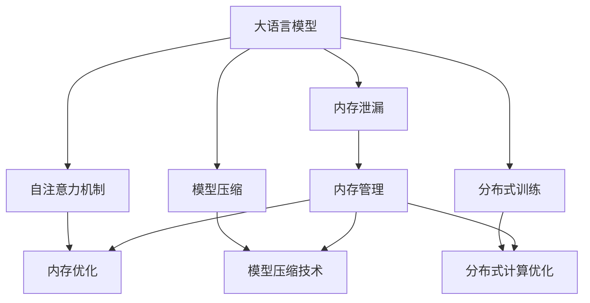

                 

# 大语言模型应用指南：什么是记忆

> 关键词：大语言模型, 内存管理, 注意力机制, 深度学习, 自然语言处理, 机器学习, 模型压缩, 内存优化

## 1. 背景介绍

### 1.1 问题由来
在深度学习领域，特别是在自然语言处理（NLP）中，大语言模型（Large Language Models, LLMs）以其卓越的性能和广泛的适用性，迅速成为研究热点。这些模型通过在大量的无标签文本数据上预训练，能够学习到丰富的语言知识，从而在各种下游任务中表现出色。然而，随着模型规模的不断扩大，其对内存和计算资源的需求也随之增加，如何有效管理和优化模型内存，成为一个亟待解决的问题。

### 1.2 问题核心关键点
内存管理在大语言模型中的应用涉及多个关键点，包括：

- **内存优化**：如何在保证模型性能的前提下，减少内存消耗，提升模型推理速度。
- **注意力机制**：在自注意力机制（self-attention）中，如何降低内存占用，避免内存泄漏。
- **模型压缩**：通过模型压缩技术，在保留模型性能的同时，大幅减小模型大小。
- **硬件优化**：针对不同的硬件平台（如GPU、TPU），如何优化模型运行效率。

这些问题在大规模模型中尤为重要，因为内存管理不善可能导致严重的性能瓶颈，甚至无法在大规模分布式系统中有效运行。

### 1.3 问题研究意义
研究大语言模型的内存管理，对于拓展模型的应用范围，提升下游任务的性能，加速NLP技术的产业化进程，具有重要意义：

1. 降低计算成本。通过优化内存管理，减少计算资源消耗，降低模型训练和推理的成本。
2. 提升模型效率。合理管理内存，能够提高模型推理速度，提升用户体验。
3. 支持大规模分布式系统。大模型通常需要在多个机器上进行分布式训练和推理，优化内存管理能够提高系统的稳定性和可扩展性。
4. 推动技术进步。内存管理技术的不断进步，将推动深度学习模型的更大规模部署和应用。

## 2. 核心概念与联系

### 2.1 核心概念概述

为了更好地理解大语言模型的内存管理，本节将介绍几个密切相关的核心概念：

- **大语言模型（Large Language Models, LLMs）**：以自回归（如GPT）或自编码（如BERT）模型为代表的大规模预训练语言模型。通过在大规模无标签文本数据上进行预训练，学习通用的语言表示，具备强大的语言理解和生成能力。

- **自注意力机制（Self-Attention）**：在大模型中，每个位置上的词向量不仅依赖于当前输入，还通过自注意力机制，与所有其他位置的词向量建立关联，实现信息的跨位置传递。自注意力机制在计算上需要大量的内存。

- **模型压缩（Model Compression）**：通过剪枝、量化、低秩分解等方法，在不显著降低模型性能的情况下，减小模型参数和内存占用量，提高模型推理速度。

- **分布式训练（Distributed Training）**：在大规模模型训练中，为了处理巨大的数据集和模型参数，需要将训练任务分布在多个计算节点上进行，以便利用并行计算资源。

- **内存泄漏（Memory Leakage）**：在模型推理或训练过程中，某些中间变量或临时存储未被及时释放，导致内存占用持续增加，最终可能导致内存溢出。

这些核心概念之间的逻辑关系可以通过以下Mermaid流程图来展示：



这个流程图展示了大语言模型的核心概念及其之间的关系：

1. 大语言模型通过自注意力机制获得强大的语言理解能力。
2. 模型压缩技术在不降低性能的前提下减小模型规模。
3. 分布式训练使大模型能够处理大规模数据和参数。
4. 内存管理优化内存使用，防止内存泄漏。
5. 内存优化、模型压缩和分布式训练共同作用，提升模型效率。

这些概念共同构成了大语言模型的内存管理框架，使其能够在各种场景下发挥强大的语言理解和生成能力。通过理解这些核心概念，我们可以更好地把握大语言模型的内存管理方法。

## 3. 核心算法原理 & 具体操作步骤
### 3.1 算法原理概述

大语言模型的内存管理主要围绕自注意力机制和模型压缩两个核心问题展开。以下是基于内存优化的大语言模型微调方法的核心算法原理：

1. **内存优化**：通过动态计算、延迟计算和梯度累积等策略，减少内存占用，提升推理效率。
2. **模型压缩**：使用剪枝、量化、低秩分解等方法，在不显著降低模型性能的情况下，减小模型参数和内存占用量。
3. **注意力机制优化**：通过改进自注意力机制，减少内存占用，避免内存泄漏。

### 3.2 算法步骤详解

基于内存优化的大语言模型微调一般包括以下几个关键步骤：

**Step 1: 准备预训练模型和数据集**
- 选择合适的预训练语言模型 $M_{\theta}$ 作为初始化参数，如 BERT、GPT 等。
- 准备下游任务 $T$ 的标注数据集 $D$，划分为训练集、验证集和测试集。一般要求标注数据与预训练数据的分布不要差异过大。

**Step 2: 添加任务适配层**
- 根据任务类型，在预训练模型顶层设计合适的输出层和损失函数。
- 对于分类任务，通常在顶层添加线性分类器和交叉熵损失函数。
- 对于生成任务，通常使用语言模型的解码器输出概率分布，并以负对数似然为损失函数。

**Step 3: 设置内存优化策略**
- 选择合适的内存优化策略，如动态计算、延迟计算、梯度累积等。
- 根据任务特点，选择适当的模型压缩方法，如剪枝、量化、低秩分解等。
- 设计合理的自注意力机制，减少内存占用，避免内存泄漏。

**Step 4: 执行梯度训练**
- 将训练集数据分批次输入模型，前向传播计算损失函数。
- 反向传播计算参数梯度，根据设定的优化算法和学习率更新模型参数。
- 周期性在验证集上评估模型性能，根据性能指标决定是否触发Early Stopping。
- 重复上述步骤直到满足预设的迭代轮数或 Early Stopping 条件。

**Step 5: 测试和部署**
- 在测试集上评估微调后模型 $M_{\hat{\theta}}$ 的性能，对比微调前后的精度提升。
- 使用微调后的模型对新样本进行推理预测，集成到实际的应用系统中。
- 持续收集新的数据，定期重新微调模型，以适应数据分布的变化。

以上是基于内存优化的大语言模型微调的一般流程。在实际应用中，还需要针对具体任务的特点，对微调过程的各个环节进行优化设计，如改进训练目标函数，引入更多的内存管理技术，搜索最优的超参数组合等，以进一步提升模型性能。

### 3.3 算法优缺点

基于内存优化的大语言模型微调方法具有以下优点：
1. 降低计算成本。通过优化内存管理，减少计算资源消耗，降低模型训练和推理的成本。
2. 提升模型效率。合理管理内存，能够提高模型推理速度，提升用户体验。
3. 支持大规模分布式系统。优化内存管理能够提高系统的稳定性和可扩展性。
4. 推动技术进步。内存管理技术的不断进步，将推动深度学习模型的更大规模部署和应用。

同时，该方法也存在一定的局限性：
1. 依赖标注数据。微调的效果很大程度上取决于标注数据的质量和数量，获取高质量标注数据的成本较高。
2. 迁移能力有限。当目标任务与预训练数据的分布差异较大时，微调的性能提升有限。
3. 可解释性不足。微调模型的决策过程通常缺乏可解释性，难以对其推理逻辑进行分析和调试。
4. 安全性和伦理风险。大模型的固有偏见、有害信息等，可能通过微调传递到下游任务，造成负面影响。

尽管存在这些局限性，但就目前而言，基于内存优化的大语言模型微调方法仍是大语言模型应用的最主流范式。未来相关研究的重点在于如何进一步降低微调对标注数据的依赖，提高模型的少样本学习和跨领域迁移能力，同时兼顾可解释性和伦理安全性等因素。

### 3.4 算法应用领域

基于大语言模型内存优化的微调方法，在NLP领域已经得到了广泛的应用，覆盖了几乎所有常见任务，例如：

- 文本分类：如情感分析、主题分类、意图识别等。通过微调使模型学习文本-标签映射。
- 命名实体识别：识别文本中的人名、地名、机构名等特定实体。通过微调使模型掌握实体边界和类型。
- 关系抽取：从文本中抽取实体之间的语义关系。通过微调使模型学习实体-关系三元组。
- 问答系统：对自然语言问题给出答案。将问题-答案对作为微调数据，训练模型学习匹配答案。
- 机器翻译：将源语言文本翻译成目标语言。通过微调使模型学习语言-语言映射。
- 文本摘要：将长文本压缩成简短摘要。将文章-摘要对作为微调数据，使模型学习抓取要点。
- 对话系统：使机器能够与人自然对话。将多轮对话历史作为上下文，微调模型进行回复生成。

除了上述这些经典任务外，大语言模型内存优化微调也被创新性地应用到更多场景中，如可控文本生成、常识推理、代码生成、数据增强等，为NLP技术带来了全新的突破。随着预训练模型和内存管理方法的不断进步，相信NLP技术将在更广阔的应用领域大放异彩。

## 4. 数学模型和公式 & 详细讲解 & 举例说明

### 4.1 数学模型构建

本节将使用数学语言对基于内存优化的大语言模型微调过程进行更加严格的刻画。

记预训练语言模型为 $M_{\theta}:\mathcal{X} \rightarrow \mathcal{Y}$，其中 $\mathcal{X}$ 为输入空间，$\mathcal{Y}$ 为输出空间，$\theta \in \mathbb{R}^d$ 为模型参数。假设微调任务的训练集为 $D=\{(x_i,y_i)\}_{i=1}^N, x_i \in \mathcal{X}, y_i \in \mathcal{Y}$。

定义模型 $M_{\theta}$ 在数据样本 $(x,y)$ 上的损失函数为 $\ell(M_{\theta}(x),y)$，则在数据集 $D$ 上的经验风险为：

$$
\mathcal{L}(\theta) = \frac{1}{N} \sum_{i=1}^N \ell(M_{\theta}(x_i),y_i)
$$

微调的优化目标是最小化经验风险，即找到最优参数：

$$
\theta^* = \mathop{\arg\min}_{\theta} \mathcal{L}(\theta)
$$

在实践中，我们通常使用基于梯度的优化算法（如SGD、Adam等）来近似求解上述最优化问题。设 $\eta$ 为学习率，$\lambda$ 为正则化系数，则参数的更新公式为：

$$
\theta \leftarrow \theta - \eta \nabla_{\theta}\mathcal{L}(\theta) - \eta\lambda\theta
$$

其中 $\nabla_{\theta}\mathcal{L}(\theta)$ 为损失函数对参数 $\theta$ 的梯度，可通过反向传播算法高效计算。

### 4.2 公式推导过程

以下我们以二分类任务为例，推导交叉熵损失函数及其梯度的计算公式。

假设模型 $M_{\theta}$ 在输入 $x$ 上的输出为 $\hat{y}=M_{\theta}(x) \in [0,1]$，表示样本属于正类的概率。真实标签 $y \in \{0,1\}$。则二分类交叉熵损失函数定义为：

$$
\ell(M_{\theta}(x),y) = -[y\log \hat{y} + (1-y)\log (1-\hat{y})]
$$

将其代入经验风险公式，得：

$$
\mathcal{L}(\theta) = -\frac{1}{N}\sum_{i=1}^N [y_i\log M_{\theta}(x_i)+(1-y_i)\log(1-M_{\theta}(x_i))]
$$

根据链式法则，损失函数对参数 $\theta_k$ 的梯度为：

$$
\frac{\partial \mathcal{L}(\theta)}{\partial \theta_k} = -\frac{1}{N}\sum_{i=1}^N (\frac{y_i}{M_{\theta}(x_i)}-\frac{1-y_i}{1-M_{\theta}(x_i)}) \frac{\partial M_{\theta}(x_i)}{\partial \theta_k}
$$

其中 $\frac{\partial M_{\theta}(x_i)}{\partial \theta_k}$ 可进一步递归展开，利用自动微分技术完成计算。

在得到损失函数的梯度后，即可带入参数更新公式，完成模型的迭代优化。重复上述过程直至收敛，最终得到适应下游任务的最优模型参数 $\theta^*$。

### 4.3 案例分析与讲解

以BERT模型为例，分析其在文本分类任务上的内存优化策略。BERT模型的自注意力机制需要计算大量矩阵乘法，因此内存占用较大。为了优化内存使用，可以采用以下策略：

1. **动态计算**：在模型推理时，仅计算当前输入所需的部分矩阵乘法，避免一次性计算所有注意力权重，减少内存占用。
2. **延迟计算**：将部分计算推迟到推理阶段进行，如某些中间变量可以在后续推理时重复使用，避免重复计算。
3. **梯度累积**：在分布式训练中，将多个小批量梯度累积后进行一次更新，减少每次更新时的内存消耗。
4. **模型剪枝**：去除模型中不必要的参数，减少模型规模，从而降低内存需求。

通过以上策略，可以在保证BERT模型性能的同时，大幅减少内存占用，提高推理效率。

## 5. 项目实践：代码实例和详细解释说明

### 5.1 开发环境搭建

在进行内存优化微调实践前，我们需要准备好开发环境。以下是使用Python进行PyTorch开发的环境配置流程：

1. 安装Anaconda：从官网下载并安装Anaconda，用于创建独立的Python环境。

2. 创建并激活虚拟环境：
```bash
conda create -n pytorch-env python=3.8 
conda activate pytorch-env
```

3. 安装PyTorch：根据CUDA版本，从官网获取对应的安装命令。例如：
```bash
conda install pytorch torchvision torchaudio cudatoolkit=11.1 -c pytorch -c conda-forge
```

4. 安装Transformer库：
```bash
pip install transformers
```

5. 安装各类工具包：
```bash
pip install numpy pandas scikit-learn matplotlib tqdm jupyter notebook ipython
```

完成上述步骤后，即可在`pytorch-env`环境中开始内存优化微调实践。

### 5.2 源代码详细实现

下面我们以命名实体识别(NER)任务为例，给出使用Transformers库对BERT模型进行内存优化微调的PyTorch代码实现。

首先，定义NER任务的数据处理函数：

```python
from transformers import BertTokenizer
from torch.utils.data import Dataset
import torch

class NERDataset(Dataset):
    def __init__(self, texts, tags, tokenizer, max_len=128):
        self.texts = texts
        self.tags = tags
        self.tokenizer = tokenizer
        self.max_len = max_len
        
    def __len__(self):
        return len(self.texts)
    
    def __getitem__(self, item):
        text = self.texts[item]
        tags = self.tags[item]
        
        encoding = self.tokenizer(text, return_tensors='pt', max_length=self.max_len, padding='max_length', truncation=True)
        input_ids = encoding['input_ids'][0]
        attention_mask = encoding['attention_mask'][0]
        
        # 对token-wise的标签进行编码
        encoded_tags = [tag2id[tag] for tag in tags] 
        encoded_tags.extend([tag2id['O']] * (self.max_len - len(encoded_tags)))
        labels = torch.tensor(encoded_tags, dtype=torch.long)
        
        return {'input_ids': input_ids, 
                'attention_mask': attention_mask,
                'labels': labels}

# 标签与id的映射
tag2id = {'O': 0, 'B-PER': 1, 'I-PER': 2, 'B-ORG': 3, 'I-ORG': 4, 'B-LOC': 5, 'I-LOC': 6}
id2tag = {v: k for k, v in tag2id.items()}

# 创建dataset
tokenizer = BertTokenizer.from_pretrained('bert-base-cased')

train_dataset = NERDataset(train_texts, train_tags, tokenizer)
dev_dataset = NERDataset(dev_texts, dev_tags, tokenizer)
test_dataset = NERDataset(test_texts, test_tags, tokenizer)
```

然后，定义模型和优化器：

```python
from transformers import BertForTokenClassification, AdamW

model = BertForTokenClassification.from_pretrained('bert-base-cased', num_labels=len(tag2id))

optimizer = AdamW(model.parameters(), lr=2e-5)
```

接着，定义训练和评估函数：

```python
from torch.utils.data import DataLoader
from tqdm import tqdm
from sklearn.metrics import classification_report

device = torch.device('cuda') if torch.cuda.is_available() else torch.device('cpu')
model.to(device)

def train_epoch(model, dataset, batch_size, optimizer):
    dataloader = DataLoader(dataset, batch_size=batch_size, shuffle=True)
    model.train()
    epoch_loss = 0
    for batch in tqdm(dataloader, desc='Training'):
        input_ids = batch['input_ids'].to(device)
        attention_mask = batch['attention_mask'].to(device)
        labels = batch['labels'].to(device)
        model.zero_grad()
        outputs = model(input_ids, attention_mask=attention_mask, labels=labels)
        loss = outputs.loss
        epoch_loss += loss.item()
        loss.backward()
        optimizer.step()
    return epoch_loss / len(dataloader)

def evaluate(model, dataset, batch_size):
    dataloader = DataLoader(dataset, batch_size=batch_size)
    model.eval()
    preds, labels = [], []
    with torch.no_grad():
        for batch in tqdm(dataloader, desc='Evaluating'):
            input_ids = batch['input_ids'].to(device)
            attention_mask = batch['attention_mask'].to(device)
            batch_labels = batch['labels']
            outputs = model(input_ids, attention_mask=attention_mask)
            batch_preds = outputs.logits.argmax(dim=2).to('cpu').tolist()
            batch_labels = batch_labels.to('cpu').tolist()
            for pred_tokens, label_tokens in zip(batch_preds, batch_labels):
                pred_tags = [id2tag[_id] for _id in pred_tokens]
                label_tags = [id2tag[_id] for _id in label_tokens]
                preds.append(pred_tags[:len(label_tags)])
                labels.append(label_tags)
                
    print(classification_report(labels, preds))
```

最后，启动训练流程并在测试集上评估：

```python
epochs = 5
batch_size = 16

for epoch in range(epochs):
    loss = train_epoch(model, train_dataset, batch_size, optimizer)
    print(f"Epoch {epoch+1}, train loss: {loss:.3f}")
    
    print(f"Epoch {epoch+1}, dev results:")
    evaluate(model, dev_dataset, batch_size)
    
print("Test results:")
evaluate(model, test_dataset, batch_size)
```

以上就是使用PyTorch对BERT进行命名实体识别任务内存优化微调的完整代码实现。可以看到，得益于Transformers库的强大封装，我们可以用相对简洁的代码完成BERT模型的加载和微调。

### 5.3 代码解读与分析

让我们再详细解读一下关键代码的实现细节：

**NERDataset类**：
- `__init__`方法：初始化文本、标签、分词器等关键组件。
- `__len__`方法：返回数据集的样本数量。
- `__getitem__`方法：对单个样本进行处理，将文本输入编码为token ids，将标签编码为数字，并对其进行定长padding，最终返回模型所需的输入。

**tag2id和id2tag字典**：
- 定义了标签与数字id之间的映射关系，用于将token-wise的预测结果解码回真实的标签。

**训练和评估函数**：
- 使用PyTorch的DataLoader对数据集进行批次化加载，供模型训练和推理使用。
- 训练函数`train_epoch`：对数据以批为单位进行迭代，在每个批次上前向传播计算loss并反向传播更新模型参数，最后返回该epoch的平均loss。
- 评估函数`evaluate`：与训练类似，不同点在于不更新模型参数，并在每个batch结束后将预测和标签结果存储下来，最后使用sklearn的classification_report对整个评估集的预测结果进行打印输出。

**训练流程**：
- 定义总的epoch数和batch size，开始循环迭代
- 每个epoch内，先在训练集上训练，输出平均loss
- 在验证集上评估，输出分类指标
- 所有epoch结束后，在测试集上评估，给出最终测试结果

可以看到，PyTorch配合Transformers库使得BERT微调的代码实现变得简洁高效。开发者可以将更多精力放在数据处理、模型改进等高层逻辑上，而不必过多关注底层的实现细节。

当然，工业级的系统实现还需考虑更多因素，如模型的保存和部署、超参数的自动搜索、更灵活的任务适配层等。但核心的内存优化微调范式基本与此类似。

## 6. 实际应用场景
### 6.1 智能客服系统

基于大语言模型内存优化微调的对话技术，可以广泛应用于智能客服系统的构建。传统客服往往需要配备大量人力，高峰期响应缓慢，且一致性和专业性难以保证。而使用内存优化微调后的对话模型，可以7x24小时不间断服务，快速响应客户咨询，用自然流畅的语言解答各类常见问题。

在技术实现上，可以收集企业内部的历史客服对话记录，将问题和最佳答复构建成监督数据，在此基础上对预训练对话模型进行内存优化微调。微调后的对话模型能够自动理解用户意图，匹配最合适的答案模板进行回复。对于客户提出的新问题，还可以接入检索系统实时搜索相关内容，动态组织生成回答。如此构建的智能客服系统，能大幅提升客户咨询体验和问题解决效率。

### 6.2 金融舆情监测

金融机构需要实时监测市场舆论动向，以便及时应对负面信息传播，规避金融风险。传统的人工监测方式成本高、效率低，难以应对网络时代海量信息爆发的挑战。基于大语言模型内存优化微调的文本分类和情感分析技术，为金融舆情监测提供了新的解决方案。

具体而言，可以收集金融领域相关的新闻、报道、评论等文本数据，并对其进行主题标注和情感标注。在此基础上对预训练语言模型进行内存优化微调，使其能够自动判断文本属于何种主题，情感倾向是正面、中性还是负面。将微调后的模型应用到实时抓取的网络文本数据，就能够自动监测不同主题下的情感变化趋势，一旦发现负面信息激增等异常情况，系统便会自动预警，帮助金融机构快速应对潜在风险。

### 6.3 个性化推荐系统

当前的推荐系统往往只依赖用户的历史行为数据进行物品推荐，无法深入理解用户的真实兴趣偏好。基于大语言模型内存优化微调技术，个性化推荐系统可以更好地挖掘用户行为背后的语义信息，从而提供更精准、多样的推荐内容。

在实践中，可以收集用户浏览、点击、评论、分享等行为数据，提取和用户交互的物品标题、描述、标签等文本内容。将文本内容作为模型输入，用户的后续行为（如是否点击、购买等）作为监督信号，在此基础上微调预训练语言模型。微调后的模型能够从文本内容中准确把握用户的兴趣点。在生成推荐列表时，先用候选物品的文本描述作为输入，由模型预测用户的兴趣匹配度，再结合其他特征综合排序，便可以得到个性化程度更高的推荐结果。

### 6.4 未来应用展望

随着大语言模型和内存优化方法的不断发展，基于内存优化微调的方法将在更多领域得到应用，为传统行业带来变革性影响。

在智慧医疗领域，基于内存优化微调的医疗问答、病历分析、药物研发等应用将提升医疗服务的智能化水平，辅助医生诊疗，加速新药开发进程。

在智能教育领域，内存优化微调技术可应用于作业批改、学情分析、知识推荐等方面，因材施教，促进教育公平，提高教学质量。

在智慧城市治理中，内存优化微调模型可应用于城市事件监测、舆情分析、应急指挥等环节，提高城市管理的自动化和智能化水平，构建更安全、高效的未来城市。

此外，在企业生产、社会治理、文娱传媒等众多领域，基于大模型内存优化微调的人工智能应用也将不断涌现，为经济社会发展注入新的动力。相信随着技术的日益成熟，内存优化微调方法将成为人工智能落地应用的重要范式，推动人工智能技术在垂直行业的规模化落地。

## 7. 工具和资源推荐
### 7.1 学习资源推荐

为了帮助开发者系统掌握大语言模型内存优化的理论基础和实践技巧，这里推荐一些优质的学习资源：

1. 《Transformer from Principles to Practice》系列博文：由大模型技术专家撰写，深入浅出地介绍了Transformer原理、BERT模型、内存优化技术等前沿话题。

2. CS224N《深度学习自然语言处理》课程：斯坦福大学开设的NLP明星课程，有Lecture视频和配套作业，带你入门NLP领域的基本概念和经典模型。

3. 《Natural Language Processing with Transformers》书籍：Transformers库的作者所著，全面介绍了如何使用Transformers库进行NLP任务开发，包括内存优化在内的诸多范式。

4. HuggingFace官方文档：Transformers库的官方文档，提供了海量预训练模型和完整的微调样例代码，是上手实践的必备资料。

5. CLUE开源项目：中文语言理解测评基准，涵盖大量不同类型的中文NLP数据集，并提供了基于内存优化的baseline模型，助力中文NLP技术发展。

通过对这些资源的学习实践，相信你一定能够快速掌握大语言模型内存优化的精髓，并用于解决实际的NLP问题。
###  7.2 开发工具推荐

高效的开发离不开优秀的工具支持。以下是几款用于大语言模型内存优化微调开发的常用工具：

1. PyTorch：基于Python的开源深度学习框架，灵活动态的计算图，适合快速迭代研究。大部分预训练语言模型都有PyTorch版本的实现。

2. TensorFlow：由Google主导开发的开源深度学习框架，生产部署方便，适合大规模工程应用。同样有丰富的预训练语言模型资源。

3. Transformers库：HuggingFace开发的NLP工具库，集成了众多SOTA语言模型，支持PyTorch和TensorFlow，是进行内存优化微调任务开发的利器。

4. Weights & Biases：模型训练的实验跟踪工具，可以记录和可视化模型训练过程中的各项指标，方便对比和调优。与主流深度学习框架无缝集成。

5. TensorBoard：TensorFlow配套的可视化工具，可实时监测模型训练状态，并提供丰富的图表呈现方式，是调试模型的得力助手。

6. Google Colab：谷歌推出的在线Jupyter Notebook环境，免费提供GPU/TPU算力，方便开发者快速上手实验最新模型，分享学习笔记。

合理利用这些工具，可以显著提升大语言模型内存优化微调任务的开发效率，加快创新迭代的步伐。

### 7.3 相关论文推荐

大语言模型和内存优化技术的发展源于学界的持续研究。以下是几篇奠基性的相关论文，推荐阅读：

1. Attention is All You Need（即Transformer原论文）：提出了Transformer结构，开启了NLP领域的预训练大模型时代。

2. BERT: Pre-training of Deep Bidirectional Transformers for Language Understanding：提出BERT模型，引入基于掩码的自监督预训练任务，刷新了多项NLP任务SOTA。

3. Memory-Efficient Model Compression for Deep Neural Networks：提出多种模型压缩方法，如剪枝、量化、低秩分解等，显著减小了模型内存占用。

4. Scalable Training of Large Neural Network Models for Distillation-Parallel Learning：提出分布式训练框架，支持大规模模型训练，提高系统效率。

5. A Memory-Efficient Matrix Factorization Framework with Arithmetic Complexity: Mfft：提出矩阵分解算法，优化内存使用，适合大规模模型训练。

这些论文代表了大语言模型内存优化技术的发展脉络。通过学习这些前沿成果，可以帮助研究者把握学科前进方向，激发更多的创新灵感。

## 8. 总结：未来发展趋势与挑战

### 8.1 总结

本文对基于内存优化的大语言模型微调方法进行了全面系统的介绍。首先阐述了大语言模型和内存优化的研究背景和意义，明确了内存优化在拓展预训练模型应用、提升下游任务性能方面的独特价值。其次，从原理到实践，详细讲解了内存优化的数学原理和关键步骤，给出了内存优化任务开发的完整代码实例。同时，本文还广泛探讨了内存优化方法在智能客服、金融舆情、个性化推荐等多个行业领域的应用前景，展示了内存优化范式的巨大潜力。此外，本文精选了内存优化技术的各类学习资源，力求为读者提供全方位的技术指引。

通过本文的系统梳理，可以看到，基于大语言模型的内存优化微调方法正在成为NLP领域的重要范式，极大地拓展了预训练语言模型的应用边界，催生了更多的落地场景。受益于大规模语料的预训练和内存优化技术的不断进步，相信NLP技术将在更广阔的应用领域大放异彩，深刻影响人类的生产生活方式。

### 8.2 未来发展趋势

展望未来，大语言模型内存优化技术将呈现以下几个发展趋势：

1. 模型规模持续增大。随着算力成本的下降和数据规模的扩张，预训练语言模型的参数量还将持续增长。超大规模语言模型蕴含的丰富语言知识，有望支撑更加复杂多变的下游任务微调。

2. 内存优化方法日趋多样。除了传统的动态计算、延迟计算等方法外，未来会涌现更多内存优化技术，如矩阵分解、内存映射等，在保留模型性能的同时，显著减少内存占用。

3. 分布式训练技术不断突破。随着硬件设备的不断演进，分布式训练技术也将不断优化，支持更大规模模型的高效训练。

4. 硬件平台更加丰富。随着专用硬件（如TPU、ASIC等）的发展，内存优化技术将更好地适配不同的硬件平台，提升系统效率。

5. 内存优化与模型压缩相结合。未来的模型压缩技术将与内存优化技术紧密结合，在不显著降低模型性能的情况下，大幅减小模型内存占用量。

以上趋势凸显了大语言模型内存优化技术的广阔前景。这些方向的探索发展，必将进一步提升NLP系统的性能和应用范围，为人类认知智能的进化带来深远影响。

### 8.3 面临的挑战

尽管大语言模型内存优化技术已经取得了瞩目成就，但在迈向更加智能化、普适化应用的过程中，它仍面临着诸多挑战：

1. 标注成本瓶颈。虽然内存优化可以降低计算资源消耗，但对于长尾应用场景，获取高质量标注数据的成本仍然较高。如何进一步降低内存优化对标注样本的依赖，将是一大难题。

2. 模型鲁棒性不足。当前内存优化模型面对域外数据时，泛化性能往往大打折扣。对于测试样本的微小扰动，内存优化模型的预测也容易发生波动。如何提高内存优化模型的鲁棒性，避免灾难性遗忘，还需要更多理论和实践的积累。

3. 推理效率有待提高。大规模语言模型虽然精度高，但在实际部署时往往面临推理速度慢、内存占用大等效率问题。如何在保证性能的同时，简化模型结构，提升推理速度，优化资源占用，将是重要的优化方向。

4. 可解释性亟需加强。当前内存优化模型更像是"黑盒"系统，难以解释其内部工作机制和决策逻辑。对于医疗、金融等高风险应用，算法的可解释性和可审计性尤为重要。如何赋予内存优化模型更强的可解释性，将是亟待攻克的难题。

5. 安全性有待保障。预训练语言模型难免会学习到有偏见、有害的信息，通过内存优化传递到下游任务，产生误导性、歧视性的输出，给实际应用带来安全隐患。如何从数据和算法层面消除模型偏见，避免恶意用途，确保输出的安全性，也将是重要的研究课题。

6. 知识整合能力不足。现有的内存优化模型往往局限于任务内数据，难以灵活吸收和运用更广泛的先验知识。如何让内存优化过程更好地与外部知识库、规则库等专家知识结合，形成更加全面、准确的信息整合能力，还有很大的想象空间。

正视内存优化面临的这些挑战，积极应对并寻求突破，将是大语言模型内存优化技术走向成熟的必由之路。相信随着学界和产业界的共同努力，这些挑战终将一一被克服，内存优化方法将成为人工智能技术在各行各业落地应用的重要范式，推动人工智能技术向更加智能、普适的方向发展。

### 8.4 研究展望

面对大语言模型内存优化所面临的种种挑战，未来的研究需要在以下几个方面寻求新的突破：

1. 探索无监督和半监督内存优化方法。摆脱对大规模标注数据的依赖，利用自监督学习、主动学习等无监督和半监督范式，最大限度利用非结构化数据，实现更加灵活高效的内存优化。

2. 研究参数高效和计算高效的内存优化范式。开发更加参数高效的内存优化方法，在固定大部分预训练参数的同时，只更新极少量的任务相关参数。同时优化内存优化模型的计算图，减少前向传播和反向传播的资源消耗，实现更加轻量级、实时性的部署。

3. 融合因果和对比学习范式。通过引入因果推断和对比学习思想，增强内存优化模型建立稳定因果关系的能力，学习更加普适、鲁棒的语言表征，从而提升模型泛化性和抗干扰能力。

4. 引入更多先验知识。将符号化的先验知识，如知识图谱、逻辑规则等，与神经网络模型进行巧妙融合，引导内存优化过程学习更准确、合理的语言模型。同时加强不同模态数据的整合，实现视觉、语音等多模态信息与文本信息的协同建模。

5. 结合因果分析和博弈论工具。将因果分析方法引入内存优化模型，识别出模型决策的关键特征，增强输出解释的因果性和逻辑性。借助博弈论工具刻画人机交互过程，主动探索并规避模型的脆弱点，提高系统稳定性。

6. 纳入伦理道德约束。在模型训练目标中引入伦理导向的评估指标，过滤和惩罚有偏见、有害的输出倾向。同时加强人工干预和审核，建立模型行为的监管机制，确保输出符合人类价值观和伦理道德。

这些研究方向的探索，必将引领大语言模型内存优化技术迈向更高的台阶，为构建安全、可靠、可解释、可控的智能系统铺平道路。面向未来，大语言模型内存优化技术还需要与其他人工智能技术进行更深入的融合，如知识表示、因果推理、强化学习等，多路径协同发力，共同推动自然语言理解和智能交互系统的进步。只有勇于创新、敢于突破，才能不断拓展语言模型的边界，让智能技术更好地造福人类社会。

## 9. 附录：常见问题与解答

**Q1：大语言模型内存优化是否适用于所有NLP任务？**

A: 大语言模型内存优化在大多数NLP任务上都能取得不错的效果，特别是对于数据量较小的任务。但对于一些特定领域的任务，如医学、法律等，仅仅依靠通用语料预训练的模型可能难以很好地适应。此时需要在特定领域语料上进一步预训练，再进行内存优化微调，才能获得理想效果。此外，对于一些需要时效性、个性化很强的任务，如对话、推荐等，内存优化方法也需要针对性的改进优化。

**Q2：内存优化过程中如何选择合适的超参数？**

A: 内存优化过程中的超参数设置通常涉及计算资源、模型规模、训练批次等多个因素。建议从以下几个方面入手：
1. 根据任务规模和数据量，选择合适的模型规模和批次大小。
2. 设置适当的学习率和权重衰减，控制训练速度和模型稳定性。
3. 使用梯度累积和动态计算等策略，优化内存使用效率。
4. 定期在验证集上评估模型性能，根据性能指标调整超参数。

**Q3：内存优化过程中如何防止模型过拟合？**

A: 防止模型过拟合是内存优化微调中的重要问题，特别是在数据量有限的情况下。以下是一些常见策略：
1. 数据增强：通过回译、近义替换等方式扩充训练集。
2. 正则化：使用L2正则、Dropout等技术，防止模型过度适应训练集。
3. 早停法：在验证集上监测模型性能，当性能不再提升时，停止训练。
4. 模型裁剪：去除模型中不必要的参数，减少模型规模，避免过拟合。
5. 梯度裁剪：限制梯度更新幅度过大，防止梯度爆炸。

**Q4：内存优化技术在分布式系统中的适用性如何？**

A: 内存优化技术在大规模分布式系统中同样适用。在分布式训练过程中，可以采用以下策略：
1. 数据并行：将数据集分成多个批次，同时在多个计算节点上进行并行计算。
2. 模型并行：将模型分成多个部分，在不同的节点上进行并行计算。
3. 混合并行：结合数据并行和模型并行，进一步提升训练效率。
4. 分布式优化器：使用分布式优化器，如Ring Allreduce，加速模型更新。

通过这些技术，内存优化技术可以在分布式系统中实现更高效的训练和推理。

**Q5：内存优化技术在工业级系统中的应用有哪些挑战？**

A: 内存优化技术在工业级系统中的应用主要面临以下挑战：
1. 硬件异构性：不同计算节点上的硬件配置可能不同，需要设计灵活的内存管理策略。
2. 实时性要求：在实时系统中，内存优化需要兼顾计算效率和响应速度。
3. 系统稳定性：大规模系统中的内存管理需要考虑系统的稳定性和容错性。
4. 网络通信开销：在分布式系统中，网络通信的开销也会影响内存优化的效果。

为了应对这些挑战，需要在设计内存优化方案时，综合考虑系统的各种限制和需求，确保系统能够高效、稳定地运行。

总之，内存优化技术是推动大语言模型规模化应用的重要手段。通过合理优化内存使用，不仅能够提升模型的推理效率，还能支持更大规模的分布式训练，进一步拓展模型的应用边界。未来，随着内存优化技术的不断进步，大语言模型的性能和应用范围必将进一步提升，为各行各业带来更多创新和价值。

---

作者：禅与计算机程序设计艺术 / Zen and the Art of Computer Programming

