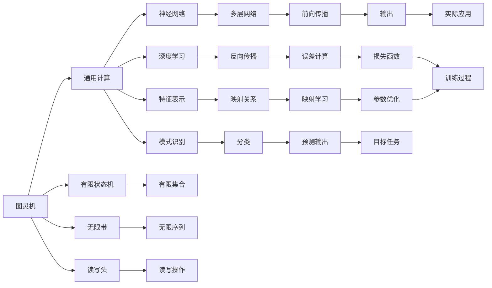

                 

# 大语言模型应用指南：图灵机与神经网络

## 1. 背景介绍

### 1.1 问题由来

在计算机科学的演进历史中，图灵机（Turing Machine, TM）与神经网络（Neural Network, NN）是两种不同的模型，分别代表理论上的通用计算能力和实际的计算模型。尽管两者出现的时间和形式不同，但它们在某种程度上共同塑造了现代计算科学的基础。

图灵机由英国数学家图灵提出，是现代计算理论的基石。它定义了任何计算机能实现的功能，无论软硬件，都必须在图灵机的能力范围内。图灵机由一个读写头、一个无限长度的带和一组状态转移规则组成。它通过读写头在带上的不同位置进行读写，按照转移规则在不同状态之间进行切换，从而执行任何计算任务。

而神经网络则是对生物神经元网络的模拟，最初由人工智能先驱们提出，用于实现各种模式识别和分类任务。神经网络由大量的人工神经元组成，通过多层的前向传播和反向传播算法进行训练，以适应不同的输入输出映射关系。

尽管图灵机和神经网络最初看起来是两个完全不同的概念，但在人工智能的浪潮中，它们找到了结合的契机。大语言模型（Large Language Model, LLM）的出现，将图灵机与神经网络的结合推向了新的高度。大语言模型是一种通过大规模预训练学习广泛语言知识的深度学习模型，能够理解和生成自然语言，并应用于各种自然语言处理任务。

### 1.2 问题核心关键点

大语言模型结合了图灵机的通用计算能力和神经网络的强大表征能力，其核心思想是通过预训练学习语言知识，并针对特定任务进行微调（Fine-tuning），以提高模型在该任务上的性能。以下是大语言模型的一些关键点：

1. **预训练与微调**：
   - 大语言模型首先在大规模无标签文本数据上进行预训练，学习通用的语言表示。
   - 然后在特定任务的标注数据上进行微调，通过有监督地训练优化模型在特定任务上的性能。

2. **自监督学习**：
   - 在大规模无标签数据上，通过自监督任务如语言模型预测、掩码语言模型预测等进行预训练。

3. **模型结构**：
   - 通常采用Transformer模型，通过多头自注意力机制实现高效的特征表示学习。

4. **大模型与小模型**：
   - 大型预训练模型如GPT、BERT等拥有数十亿的参数，但也可以通过参数高效微调（Parameter-Efficient Fine-Tuning, PEFT）使用较少参数进行微调。

5. **提示学习与少样本学习**：
   - 通过精心设计输入文本的格式，引导大语言模型进行特定任务的推理和生成，实现少样本学习。

6. **连续提示学习**：
   - 通过连续型提示（Continuous Prompts）进行微调，提高模型对任务描述的敏感度和适应性。

### 1.3 问题研究意义

研究大语言模型的应用，对于拓展模型的应用范围，提升下游任务的性能，加速人工智能技术落地应用，具有重要意义：

1. **降低开发成本**：
   - 利用成熟的大模型进行微调，可以减少从头开发所需的数据、计算和人力等成本投入。

2. **提升模型效果**：
   - 微调使得通用大模型更好地适应特定任务，在应用场景中取得更优表现。

3. **加速开发进度**：
   - 通过微调范式，开发者可以更快地完成任务适配，缩短开发周期。

4. **带来技术创新**：
   - 微调范式促进了对预训练-微调的深入研究，催生了提示学习、少样本学习等新的研究方向。

5. **赋能产业升级**：
   - 微调使得NLP技术更容易被各行各业所采用，为传统行业数字化转型升级提供新的技术路径。

## 2. 核心概念与联系

### 2.1 核心概念概述

为了更好地理解大语言模型的应用，我们需要对图灵机和神经网络的基本概念有所了解，并探讨它们在大语言模型中的应用和联系。

### 2.2 Mermaid 流程图(Mermaid 流程节点中不要有括号、逗号等特殊字符)



这个流程图展示了图灵机和神经网络在大语言模型中的应用联系：

1. **图灵机**：
   - 通过有限状态机和读写头，图灵机实现了对任何计算任务的通用模拟。

2. **神经网络**：
   - 通过多层网络的前向传播和反向传播，神经网络实现了对特征的有效表示和映射学习。

3. **大语言模型**：
   - 将图灵机的通用计算能力和神经网络的强大表征能力相结合，学习并生成自然语言。

4. **微调与预训练**：
   - 在特定任务上进行微调，利用预训练学习到的通用语言知识，提升模型性能。

### 2.3 核心算法原理

大语言模型结合了图灵机和神经网络的优点，通过预训练学习语言知识，并针对特定任务进行微调，以提高模型在该任务上的性能。其核心算法原理可以概括为以下几个步骤：

1. **预训练**：
   - 在大规模无标签文本数据上进行自监督学习，学习语言的知识和规律。

2. **微调**：
   - 在特定任务的标注数据上进行有监督学习，针对特定任务进行优化。

3. **参数高效微调**：
   - 通过使用参数高效微调（PEFT）方法，只更新少数层，保留大部分预训练参数不变。

4. **提示学习**：
   - 通过精心设计输入文本的格式，引导大语言模型进行特定任务的推理和生成，减少微调参数。

5. **少样本学习**：
   - 在只有少量标注样本的情况下，利用预训练知识进行微调，提升模型性能。

6. **连续提示学习**：
   - 通过连续型提示（Continuous Prompts）进行微调，提高模型对任务描述的敏感度和适应性。

## 3. 核心算法原理 & 具体操作步骤

### 3.1 算法原理概述

大语言模型通过预训练学习语言知识，并针对特定任务进行微调，以提高模型在该任务上的性能。其核心算法原理可以概括为以下几个步骤：

1. **预训练**：
   - 在大规模无标签文本数据上进行自监督学习，学习语言的知识和规律。

2. **微调**：
   - 在特定任务的标注数据上进行有监督学习，针对特定任务进行优化。

3. **参数高效微调**：
   - 通过使用参数高效微调（PEFT）方法，只更新少数层，保留大部分预训练参数不变。

4. **提示学习**：
   - 通过精心设计输入文本的格式，引导大语言模型进行特定任务的推理和生成，减少微调参数。

5. **少样本学习**：
   - 在只有少量标注样本的情况下，利用预训练知识进行微调，提升模型性能。

6. **连续提示学习**：
   - 通过连续型提示（Continuous Prompts）进行微调，提高模型对任务描述的敏感度和适应性。

### 3.2 算法步骤详解

大语言模型的应用过程可以分为以下几个步骤：

**Step 1: 准备数据集**
- 收集大规模无标签文本数据，进行预训练。
- 收集特定任务的标注数据集，用于微调。

**Step 2: 预训练**
- 使用自监督任务进行预训练，学习语言的知识和规律。
- 常用的自监督任务包括语言模型预测、掩码语言模型预测、上下文生成等。

**Step 3: 微调模型**
- 在特定任务的标注数据上进行有监督学习，针对特定任务进行优化。
- 通常只微调顶层或部分层，保留大部分预训练参数不变。

**Step 4: 参数高效微调**
- 使用参数高效微调（PEFT）方法，减少微调参数。
- 例如使用 Adapter、MIP 等技术。

**Step 5: 提示学习**
- 通过精心设计输入文本的格式，引导大语言模型进行特定任务的推理和生成。
- 例如使用 Prompt、Contiguous Prompt 等方法。

**Step 6: 少样本学习**
- 在只有少量标注样本的情况下，利用预训练知识进行微调，提升模型性能。

**Step 7: 连续提示学习**
- 通过连续型提示（Continuous Prompts）进行微调，提高模型对任务描述的敏感度和适应性。

### 3.3 算法优缺点

大语言模型的应用具有以下优点：

1. **高效性**：
   - 通过预训练学习通用语言知识，在大规模数据上预训练一次，微调多次，可以显著提高模型性能。

2. **广泛适用性**：
   - 适用于各种自然语言处理任务，如文本分类、命名实体识别、关系抽取、机器翻译等。

3. **参数高效性**：
   - 可以使用参数高效微调（PEFT）方法，只更新少数层，减少计算资源消耗。

4. **鲁棒性**：
   - 在特定任务上进行微调，可以适应各种数据分布，提高模型的泛化能力。

5. **可解释性**：
   - 通过提示学习，可以了解模型推理和生成的逻辑，提高模型的可解释性。

6. **实时性**：
   - 使用参数高效微调，可以在实际部署中快速响应实时查询。

同时，大语言模型也存在一些缺点：

1. **依赖标注数据**：
   - 微调需要大量标注数据，标注成本较高。

2. **泛化能力有限**：
   - 在数据分布差异较大的情况下，微调的性能提升有限。

3. **偏见与有害信息**：
   - 预训练模型可能会学习到偏见和有害信息，影响模型输出。

4. **可解释性不足**：
   - 模型内部工作机制和推理逻辑不透明，难以解释。

5. **资源消耗大**：
   - 大规模模型的推理和微调需要大量的计算资源。

6. **维护复杂**：
   - 模型规模大，维护和更新成本较高。

### 3.4 算法应用领域

大语言模型在多个领域得到了广泛应用，以下是几个典型的应用场景：

1. **自然语言处理**：
   - 文本分类、命名实体识别、关系抽取、机器翻译、摘要生成等。

2. **智能客服**：
   - 使用微调的对话模型进行客服自动回复，提升用户体验。

3. **金融舆情监测**：
   - 使用微调模型进行金融新闻和报道的情感分析和主题分类，监测市场舆情。

4. **个性化推荐系统**：
   - 使用微调的推荐模型进行个性化商品推荐，提高用户体验。

5. **智能写作**：
   - 使用微调生成的文章辅助写作，提高写作效率和质量。

6. **问答系统**：
   - 使用微调的知识图谱进行问答，提升智能问答系统的准确性和效率。

## 4. 数学模型和公式 & 详细讲解 & 举例说明

### 4.1 数学模型构建

大语言模型的数学模型可以概括为以下几个部分：

- **输入层**：将输入文本转化为模型可以处理的向量表示。
- **编码器层**：通过自注意力机制，学习输入文本的语义表示。
- **解码器层**：通过前向传播和反向传播，调整模型参数，学习任务特定输出。
- **输出层**：将模型输出映射为特定任务的标签或概率分布。

### 4.2 公式推导过程

以一个简单的二分类任务为例，展示大语言模型的微调过程。假设模型输入为 $x$，输出为 $y$，预训练模型为 $M_{\theta}$。

**输入层**：将输入文本 $x$ 转化为模型可以处理的向量表示 $x_v$。

**编码器层**：通过自注意力机制，学习输入文本的语义表示 $h$。

**解码器层**：使用前向传播和反向传播，调整模型参数 $\theta$，学习任务特定输出 $z$。

**输出层**：将模型输出 $z$ 映射为特定任务的标签或概率分布 $y$。

### 4.3 案例分析与讲解

以BERT模型为例，展示其在自然语言处理中的应用。

**预训练过程**：
- 使用掩码语言模型（Masked Language Modeling, MLM）进行预训练，学习语言的知识和规律。
- 通过自监督学习，学习输入文本的语义表示 $h$。

**微调过程**：
- 在特定任务的标注数据集上进行有监督学习，调整模型参数 $\theta$，学习任务特定输出 $z$。
- 例如在情感分析任务中，将输入文本 $x$ 转化为向量表示 $x_v$，使用编码器层 $h$，通过解码器层 $z$，将输出映射为情感标签 $y$。

## 5. 项目实践：代码实例和详细解释说明

### 5.1 开发环境搭建

为了进行大语言模型的应用实践，我们需要准备以下开发环境：

- **Python**：作为主要开发语言。
- **PyTorch**：深度学习框架，支持TensorFlow等。
- **HuggingFace Transformers库**：提供了多种预训练语言模型的实现。
- **Jupyter Notebook**：交互式开发环境，支持代码执行和数据可视化。
- **GPU/TPU**：高性能计算资源，支持大规模模型的训练和推理。

### 5.2 源代码详细实现

以下是一个使用BERT模型进行情感分析任务的微调代码示例：

```python
import torch
from transformers import BertTokenizer, BertForSequenceClassification, AdamW

# 加载预训练模型和分词器
tokenizer = BertTokenizer.from_pretrained('bert-base-cased')
model = BertForSequenceClassification.from_pretrained('bert-base-cased', num_labels=2)

# 加载数据集
train_dataset = ...
val_dataset = ...
test_dataset = ...

# 定义训练函数
def train(model, train_dataset, val_dataset, device, optimizer):
    ...
    # 训练模型
    ...
    # 验证模型
    ...

# 定义微调函数
def fine_tune(model, train_dataset, val_dataset, device, optimizer, epochs=3, batch_size=16):
    ...
    # 微调模型
    ...

# 定义测试函数
def test(model, test_dataset, device):
    ...
    # 测试模型
    ...

# 训练模型
device = 'cuda' if torch.cuda.is_available() else 'cpu'
model.to(device)
optimizer = AdamW(model.parameters(), lr=2e-5)
train_dataset = ...
val_dataset = ...
test_dataset = ...

fine_tune(model, train_dataset, val_dataset, device, optimizer)

# 测试模型
test_dataset = ...
test(model, test_dataset, device)
```

### 5.3 代码解读与分析

- **数据集加载**：使用HuggingFace提供的分词器和模型，加载数据集。
- **模型加载**：加载预训练模型和分词器。
- **模型微调**：通过定义训练函数和微调函数，调整模型参数，学习任务特定输出。
- **模型测试**：在测试集上测试模型性能。

## 6. 实际应用场景

### 6.1 智能客服系统

使用微调的对话模型进行客服自动回复，提升用户体验。通过收集企业内部的历史客服对话记录，将问题和最佳答复构建成监督数据，在此基础上对预训练对话模型进行微调。微调后的对话模型能够自动理解用户意图，匹配最合适的答案模板进行回复。对于客户提出的新问题，还可以接入检索系统实时搜索相关内容，动态组织生成回答。

### 6.2 金融舆情监测

使用微调模型进行金融新闻和报道的情感分析和主题分类，监测市场舆情。收集金融领域相关的新闻、报道、评论等文本数据，并对其进行主题标注和情感标注。在此基础上对预训练语言模型进行微调，使其能够自动判断文本属于何种主题，情感倾向是正面、中性还是负面。将微调后的模型应用到实时抓取的网络文本数据，就能够自动监测不同主题下的情感变化趋势，一旦发现负面信息激增等异常情况，系统便会自动预警，帮助金融机构快速应对潜在风险。

### 6.3 个性化推荐系统

使用微调的推荐模型进行个性化商品推荐，提高用户体验。收集用户浏览、点击、评论、分享等行为数据，提取和用户交互的物品标题、描述、标签等文本内容。将文本内容作为模型输入，用户的后续行为（如是否点击、购买等）作为监督信号，在此基础上微调预训练语言模型。微调后的模型能够从文本内容中准确把握用户的兴趣点。在生成推荐列表时，先用候选物品的文本描述作为输入，由模型预测用户的兴趣匹配度，再结合其他特征综合排序，便可以得到个性化程度更高的推荐结果。

## 7. 工具和资源推荐

### 7.1 学习资源推荐

为了帮助开发者系统掌握大语言模型的应用理论基础和实践技巧，这里推荐一些优质的学习资源：

- **《Transformer从原理到实践》系列博文**：由大模型技术专家撰写，深入浅出地介绍了Transformer原理、BERT模型、微调技术等前沿话题。
- **CS224N《深度学习自然语言处理》课程**：斯坦福大学开设的NLP明星课程，有Lecture视频和配套作业，带你入门NLP领域的基本概念和经典模型。
- **《Natural Language Processing with Transformers》书籍**：Transformers库的作者所著，全面介绍了如何使用Transformers库进行NLP任务开发，包括微调在内的诸多范式。
- **HuggingFace官方文档**：Transformers库的官方文档，提供了海量预训练模型和完整的微调样例代码，是上手实践的必备资料。
- **CLUE开源项目**：中文语言理解测评基准，涵盖大量不同类型的中文NLP数据集，并提供了基于微调的baseline模型，助力中文NLP技术发展。

### 7.2 开发工具推荐

大语言模型的应用离不开优秀的工具支持。以下是几款用于大语言模型微调开发的常用工具：

- **PyTorch**：基于Python的开源深度学习框架，灵活动态的计算图，适合快速迭代研究。
- **TensorFlow**：由Google主导开发的开源深度学习框架，生产部署方便，适合大规模工程应用。
- **Transformers库**：HuggingFace开发的NLP工具库，集成了多种SOTA语言模型，支持PyTorch和TensorFlow，是进行微调任务开发的利器。
- **Weights & Biases**：模型训练的实验跟踪工具，可以记录和可视化模型训练过程中的各项指标，方便对比和调优。
- **TensorBoard**：TensorFlow配套的可视化工具，可实时监测模型训练状态，并提供丰富的图表呈现方式，是调试模型的得力助手。
- **Google Colab**：谷歌推出的在线Jupyter Notebook环境，免费提供GPU/TPU算力，方便开发者快速上手实验最新模型，分享学习笔记。

### 7.3 相关论文推荐

大语言模型和微调技术的发展源于学界的持续研究。以下是几篇奠基性的相关论文，推荐阅读：

- **Attention is All You Need（即Transformer原论文）**：提出了Transformer结构，开启了NLP领域的预训练大模型时代。
- **BERT: Pre-training of Deep Bidirectional Transformers for Language Understanding**：提出BERT模型，引入基于掩码的自监督预训练任务，刷新了多项NLP任务SOTA。
- **Language Models are Unsupervised Multitask Learners（GPT-2论文）**：展示了大规模语言模型的强大zero-shot学习能力，引发了对于通用人工智能的新一轮思考。
- **Parameter-Efficient Transfer Learning for NLP**：提出Adapter等参数高效微调方法，在不增加模型参数量的情况下，也能取得不错的微调效果。
- **Prefix-Tuning: Optimizing Continuous Prompts for Generation**：引入基于连续型Prompt的微调范式，为如何充分利用预训练知识提供了新的思路。
- **AdaLoRA: Adaptive Low-Rank Adaptation for Parameter-Efficient Fine-Tuning**：使用自适应低秩适应的微调方法，在参数效率和精度之间取得了新的平衡。

这些论文代表了大语言模型微调技术的发展脉络。通过学习这些前沿成果，可以帮助研究者把握学科前进方向，激发更多的创新灵感。

## 8. 总结：未来发展趋势与挑战

### 8.1 研究成果总结

大语言模型结合了图灵机和神经网络的优点，通过预训练学习语言知识，并针对特定任务进行微调，以提高模型在该任务上的性能。其核心算法原理可以概括为以下几个步骤：

1. **预训练**：在大规模无标签文本数据上进行自监督学习，学习语言的知识和规律。
2. **微调**：在特定任务的标注数据上进行有监督学习，针对特定任务进行优化。
3. **参数高效微调**：通过使用参数高效微调（PEFT）方法，只更新少数层，保留大部分预训练参数不变。
4. **提示学习**：通过精心设计输入文本的格式，引导大语言模型进行特定任务的推理和生成，减少微调参数。
5. **少样本学习**：在只有少量标注样本的情况下，利用预训练知识进行微调，提升模型性能。
6. **连续提示学习**：通过连续型提示（Continuous Prompts）进行微调，提高模型对任务描述的敏感度和适应性。

### 8.2 未来发展趋势

展望未来，大语言模型微调技术将呈现以下几个发展趋势：

1. **模型规模持续增大**：随着算力成本的下降和数据规模的扩张，预训练语言模型的参数量还将持续增长。超大规模语言模型蕴含的丰富语言知识，有望支撑更加复杂多变的下游任务微调。

2. **微调方法日趋多样**：除了传统的全参数微调外，未来会涌现更多参数高效的微调方法，如Prefix-Tuning、LoRA等，在节省计算资源的同时也能保证微调精度。

3. **持续学习成为常态**：随着数据分布的不断变化，微调模型也需要持续学习新知识以保持性能。如何在不遗忘原有知识的同时，高效吸收新样本信息，将成为重要的研究课题。

4. **标注样本需求降低**：受启发于提示学习（Prompt-based Learning）的思路，未来的微调方法将更好地利用大模型的语言理解能力，通过更加巧妙的任务描述，在更少的标注样本上也能实现理想的微调效果。

5. **多模态微调崛起**：当前的微调主要聚焦于纯文本数据，未来会进一步拓展到图像、视频、语音等多模态数据微调。多模态信息的融合，将显著提升语言模型对现实世界的理解和建模能力。

6. **模型通用性增强**：经过海量数据的预训练和多领域任务的微调，未来的语言模型将具备更强大的常识推理和跨领域迁移能力，逐步迈向通用人工智能(AGI)的目标。

### 8.3 面临的挑战

尽管大语言模型微调技术已经取得了瞩目成就，但在迈向更加智能化、普适化应用的过程中，它仍面临着诸多挑战：

1. **标注成本瓶颈**：微调依赖标注数据，对于长尾应用场景，难以获得充足的高质量标注数据，成为制约微调性能的瓶颈。如何进一步降低微调对标注样本的依赖，将是一大难题。

2. **模型鲁棒性不足**：微调模型面对域外数据时，泛化性能往往大打折扣。对于测试样本的微小扰动，微调模型的预测也容易发生波动。如何提高微调模型的鲁棒性，避免灾难性遗忘，还需要更多理论和实践的积累。

3. **推理效率有待提高**：大规模语言模型虽然精度高，但在实际部署时往往面临推理速度慢、内存占用大等效率问题。如何在保证性能的同时，简化模型结构，提升推理速度，优化资源占用，将是重要的优化方向。

4. **可解释性亟需加强**：当前微调模型更像是"黑盒"系统，难以解释其内部工作机制和决策逻辑。对于医疗、金融等高风险应用，算法的可解释性和可审计性尤为重要。如何赋予微调模型更强的可解释性，将是亟待攻克的难题。

5. **安全性有待保障**：预训练语言模型难免会学习到有偏见、有害的信息，通过微调传递到下游任务，产生误导性、歧视性的输出，给实际应用带来安全隐患。如何从数据和算法层面消除模型偏见，避免恶意用途，确保输出的安全性，也将是重要的研究课题。

6. **知识整合能力不足**：现有的微调模型往往局限于任务内数据，难以灵活吸收和运用更广泛的先验知识。如何让微调过程更好地与外部知识库、规则库等专家知识结合，形成更加全面、准确的信息整合能力，还有很大的想象空间。

### 8.4 研究展望

面对大语言模型微调所面临的种种挑战，未来的研究需要在以下几个方面寻求新的突破：

1. **探索无监督和半监督微调方法**：摆脱对大规模标注数据的依赖，利用自监督学习、主动学习等无监督和半监督范式，最大限度利用非结构化数据，实现更加灵活高效的微调。

2. **研究参数高效和计算高效的微调范式**：开发更加参数高效的微调方法，在固定大部分预训练参数的同时，只更新极少量的任务相关参数。同时优化微调模型的计算图，减少前向传播和反向传播的资源消耗，实现更加轻量级、实时性的部署。

3. **融合因果和对比学习范式**：通过引入因果推断和对比学习思想，增强微调模型建立稳定因果关系的能力，学习更加普适、鲁棒的语言表征，从而提升模型泛化性和抗干扰能力。

4. **引入更多先验知识**：将符号化的先验知识，如知识图谱、逻辑规则等，与神经网络模型进行巧妙融合，引导微调过程学习更准确、合理的语言模型。同时加强不同模态数据的整合，实现视觉、语音等多模态信息与文本信息的协同建模。

5. **结合因果分析和博弈论工具**：将因果分析方法引入微调模型，识别出模型决策的关键特征，增强输出解释的因果性和逻辑性。借助博弈论工具刻画人机交互过程，主动探索并规避模型的脆弱点，提高系统稳定性。

6. **纳入伦理道德约束**：在模型训练目标中引入伦理导向的评估指标，过滤和惩罚有偏见、有害的输出倾向。同时加强人工干预和审核，建立模型行为的监管机制，确保输出符合人类价值观和伦理道德。

这些研究方向的探索，必将引领大语言模型微调技术迈向更高的台阶，为构建安全、可靠、可解释、可控的智能系统铺平道路。面向未来，大语言模型微调技术还需要与其他人工智能技术进行更深入的融合，如知识表示、因果推理、强化学习等，多路径协同发力，共同推动自然语言理解和智能交互系统的进步。只有勇于创新、敢于突破，才能不断拓展语言模型的边界，让智能技术更好地造福人类社会。

## 9. 附录：常见问题与解答

**Q1：大语言模型微调是否适用于所有NLP任务？**

A: 大语言模型微调在大多数NLP任务上都能取得不错的效果，特别是对于数据量较小的任务。但对于一些特定领域的任务，如医学、法律等，仅仅依靠通用语料预训练的模型可能难以很好地适应。此时需要在特定领域语料上进一步预训练，再进行微调，才能获得理想效果。此外，对于一些需要时效性、个性化很强的任务，如对话、推荐等，微调方法也需要针对性的改进优化。

**Q2：微调过程中如何选择合适的学习率？**

A: 微调的学习率一般要比预训练时小1-2个数量级，如果使用过大的学习率，容易破坏预训练权重，导致过拟合。一般建议从1e-5开始调参，逐步减小学习率，直至收敛。也可以使用warmup策略，在开始阶段使用较小的学习率，再逐渐过渡到预设值。需要注意的是，不同的优化器(如AdamW、Adafactor等)以及不同的学习率调度策略，可能需要设置不同的学习率阈值。

**Q3：采用大模型微调时会面临哪些资源瓶颈？**

A: 目前主流的预训练大模型动辄以亿计的参数规模，对算力、内存、存储都提出了很高的要求。GPU/TPU等高性能设备是必不可少的，但即便如此，超大批次的训练和推理也可能遇到显存不足的问题。因此需要采用一些资源优化技术，如梯度积累、混合精度训练、模型并行等，来突破硬件瓶颈。同时，模型的存储和读取也可能占用大量时间和空间，需要采用模型压缩、稀疏化存储等方法进行优化。

**Q4：如何缓解微调过程中的过拟合问题？**

A: 过拟合是微调面临的主要挑战，尤其是在标注数据不足的情况下。常见的缓解策略包括：
1. 数据增强：通过回译、近义替换等方式扩充训练集
2. 正则化：使用L2正则、Dropout、Early Stopping等避免过拟合
3. 对抗训练：引入对抗样本，提高模型鲁棒性
4. 参数高效微调：只调整少量参数(如Adapter、MIP等)，减小过拟合风险
5. 多模型集成：训练多个微调模型，取平均输出，抑制过拟合

这些策略往往需要根据具体任务和数据特点进行灵活组合。只有在数据、模型、训练、推理等各环节进行全面优化，才能最大限度地发挥大模型微调的威力。

**Q5：微调模型在落地部署时需要注意哪些问题？**

A: 将微调模型转化为实际应用，还需要考虑以下因素：
1. 模型裁剪：去除不必要的层和参数，减小模型尺寸，加快推理速度
2. 量化加速：将浮点模型转为定点模型，压缩存储空间，提高计算效率
3. 服务化封装：将模型封装为标准化服务接口，便于集成调用
4. 弹性伸缩：根据请求流量动态调整资源配置，平衡服务质量和成本
5. 监控告警：实时采集系统指标，设置异常告警阈值，确保服务稳定性
6. 安全防护：采用访问鉴权、数据脱敏等措施，保障数据和模型安全

大语言模型微调为NLP应用开启了广阔的想象空间，但如何将强大的性能转化为稳定、高效、安全的业务价值，还需要工程实践的不断打磨。唯有从数据、算法、工程、业务等多个维度协同发力，才能真正实现人工智能技术在垂直行业的规模化落地。总之，微调需要开发者根据具体任务，不断迭代和优化模型、数据和算法，方能得到理想的效果。

---

作者：禅与计算机程序设计艺术 / Zen and the Art of Computer Programming

