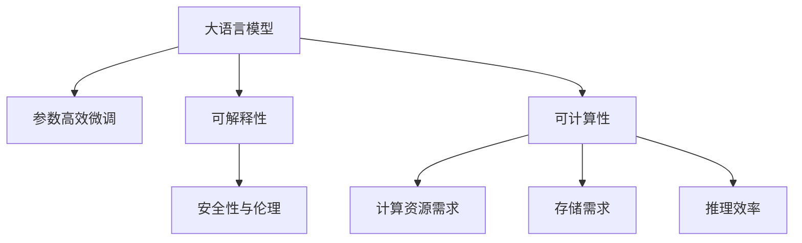

                 

# 大语言模型应用指南：智能的可计算性

## 1. 背景介绍

### 1.1 问题由来
自深度学习兴起以来，大语言模型（Large Language Models, LLMs）如GPT-3、BERT等以其卓越的性能迅速占据了NLP领域的核心地位。这些模型通过在大量文本数据上进行预训练，学习到了丰富的语言知识，展现了强大的语言理解和生成能力。大语言模型的核心在于其可计算性，即能够高效地处理、存储和生成文本数据。然而，尽管其计算能力强大，实际应用中仍存在诸多挑战。

### 1.2 问题核心关键点
- **计算资源需求**：大模型参数量巨大，对计算资源如GPU/TPU等有着极高的要求。
- **存储需求**：模型的存储空间也随着参数量的增加而大幅增长。
- **推理效率**：尽管模型精度高，但推理速度较慢，难以满足实时性要求。
- **可解释性**：大模型通常是"黑盒"系统，难以解释其内部工作机制。
- **安全性与伦理**：模型可能学习到有害信息或偏见，使用不当可能导致安全问题。

### 1.3 问题研究意义
通过改善大语言模型的可计算性，可以有效解决以上问题，使模型更加高效、可靠、可解释和安全。研究智能的可计算性，有助于提升NLP技术在实际应用中的落地效果，加速AI技术的产业化进程，推动AI技术在各行各业中的应用。

## 2. 核心概念与联系

### 2.1 核心概念概述

为深入理解智能的可计算性，本节将介绍几个关键概念及其相互联系。

- **大语言模型**：以自回归（如GPT）或自编码（如BERT）模型为代表，通过在大量文本数据上进行预训练，学习到丰富的语言知识的大规模预训练语言模型。
- **可计算性**：指模型在计算资源、存储空间、推理速度等方面处理文本数据的效率和能力。
- **参数高效微调**：指在微调过程中，仅更新少量模型参数，而固定大部分预训练权重不变，以提高微调效率，避免过拟合的方法。
- **可解释性**：指模型的决策过程可以清楚地被解释和理解，便于开发者调试和优化。
- **安全性与伦理**：指模型在使用过程中能够保证数据隐私和安全性，避免有害信息传播，符合伦理规范。

这些概念构成了大语言模型的计算基础，对其智能性能和应用价值有着重要的影响。

### 2.2 核心概念原理和架构的 Mermaid 流程图



这个流程图展示了大语言模型中的核心概念及其相互关系：

1. **参数高效微调**：通过优化微调过程中的参数更新，提高模型的效率和泛化能力。
2. **可解释性**：通过提升模型的可解释性，使得决策过程更加透明，便于调试和优化。
3. **安全性与伦理**：通过确保模型输出符合伦理规范，保护用户隐私和数据安全。
4. **可计算性**：涵盖了计算资源需求、存储需求和推理效率，是大语言模型智能性能的基础。

## 3. 核心算法原理 & 具体操作步骤
### 3.1 算法原理概述

智能的可计算性旨在提升大语言模型在计算资源、存储和推理速度方面的效率。其核心在于以下几个方面：

- **参数高效微调**：在微调过程中，仅更新少量模型参数，以提高微调效率。
- **可解释性增强**：通过技术手段提高模型的可解释性，便于开发者理解模型行为。
- **安全性与伦理保护**：通过模型训练和推理过程中的监控机制，确保模型输出符合伦理规范。

### 3.2 算法步骤详解

#### 3.2.1 参数高效微调

**Step 1: 准备微调数据集**
- 收集少量标注数据，划分为训练集、验证集和测试集。

**Step 2: 选择微调模型**
- 选择基础大语言模型，如GPT-3、BERT等，作为微调的初始参数。

**Step 3: 设计微调模型**
- 设计微调层，通常包括顶层分类器或解码器，以及相关损失函数。

**Step 4: 设置微调超参数**
- 设置合适的优化算法（如AdamW）、学习率、批大小、迭代轮数等。

**Step 5: 执行微调训练**
- 将训练集数据分批次输入模型，前向传播计算损失函数，反向传播更新模型参数。

**Step 6: 验证和测试**
- 在验证集和测试集上评估微调模型的性能，确保其泛化能力。

**Step 7: 部署与应用**
- 将微调模型集成到实际应用系统中，进行实时推理。

#### 3.2.2 可解释性增强

**Step 1: 可解释性技术选择**
- 选择可解释性技术，如LIME、SHAP等，以理解模型的决策过程。

**Step 2: 特征选择**
- 从模型中提取关键特征，用于解释模型的行为。

**Step 3: 构建解释模型**
- 使用提取的特征构建解释模型，以可视化模型的决策过程。

**Step 4: 应用解释模型**
- 将解释模型应用于实际问题，帮助开发者调试和优化模型。

#### 3.2.3 安全性与伦理保护

**Step 1: 数据预处理**
- 对输入数据进行预处理，确保数据的合法性和安全性。

**Step 2: 模型训练监控**
- 在模型训练过程中，实时监控模型的输出，避免有害信息的传播。

**Step 3: 模型推理监控**
- 在模型推理过程中，实时监控模型的输出，确保其符合伦理规范。

**Step 4: 异常检测与处理**
- 设置异常检测机制，及时发现并处理有害信息，保护用户隐私。

### 3.3 算法优缺点

**参数高效微调**
- **优点**：显著提高微调效率，减少计算和存储资源需求。
- **缺点**：模型可能无法完全利用预训练知识，导致性能损失。

**可解释性增强**
- **优点**：提升模型的透明度，便于开发者理解和优化。
- **缺点**：可解释性技术本身复杂，且解释结果可能不全面。

**安全性与伦理保护**
- **优点**：确保模型输出符合伦理规范，保护用户隐私。
- **缺点**：监控和异常处理机制可能增加计算负担。

### 3.4 算法应用领域

智能的可计算性在多个领域有着广泛的应用：

- **自然语言处理**：如问答系统、对话系统、文本分类、命名实体识别等。
- **医疗健康**：如疾病诊断、医学文献摘要等。
- **金融服务**：如情感分析、欺诈检测等。
- **智能推荐**：如电商推荐、新闻推荐等。
- **内容生成**：如自动摘要、生成式文本、代码自动生成等。

## 4. 数学模型和公式 & 详细讲解 & 举例说明
### 4.1 数学模型构建

假设大语言模型为 $M_{\theta}$，其中 $\theta$ 为模型参数。微调任务为 $T$，训练集为 $D=\{(x_i,y_i)\}_{i=1}^N$，其中 $x_i$ 为输入文本，$y_i$ 为标注标签。微调的目标是最小化损失函数 $\mathcal{L}(\theta)$。

**微调损失函数**
$$
\mathcal{L}(\theta) = \frac{1}{N} \sum_{i=1}^N \ell(M_{\theta}(x_i),y_i)
$$
其中 $\ell$ 为损失函数，如交叉熵损失。

### 4.2 公式推导过程

以二分类任务为例，推导交叉熵损失函数及其梯度计算公式。

假设模型输出为 $\hat{y}=M_{\theta}(x)$，真实标签为 $y \in \{0,1\}$。则二分类交叉熵损失函数定义为：
$$
\ell(M_{\theta}(x),y) = -[y\log \hat{y} + (1-y)\log(1-\hat{y})]
$$

将 $\ell$ 代入经验风险公式，得：
$$
\mathcal{L}(\theta) = -\frac{1}{N}\sum_{i=1}^N [y_i\log M_{\theta}(x_i)+(1-y_i)\log(1-M_{\theta}(x_i))]
$$

**梯度计算**
根据链式法则，损失函数对参数 $\theta_k$ 的梯度为：
$$
\frac{\partial \mathcal{L}(\theta)}{\partial \theta_k} = -\frac{1}{N}\sum_{i=1}^N (\frac{y_i}{M_{\theta}(x_i)}-\frac{1-y_i}{1-M_{\theta}(x_i)}) \frac{\partial M_{\theta}(x_i)}{\partial \theta_k}
$$

**实例分析**
假设微调任务为情感分析，输入文本为 "我非常喜欢这部电影"。模型输出 $\hat{y}=M_{\theta}(x)$ 表示正面情感的概率。损失函数为交叉熵损失。

**梯度计算**
将输入文本输入模型，计算输出概率 $\hat{y}=\text{softmax}(M_{\theta}(x))$。计算损失函数 $\ell$ 对模型参数 $\theta$ 的梯度。

**实际应用**
使用 $\theta$ 更新模型参数，直至模型在验证集和测试集上均能取得理想性能。

### 4.3 案例分析与讲解

以情感分析为例，展示如何使用可计算性技术优化模型。

**Step 1: 准备微调数据集**
收集电影评论数据集，划分为训练集、验证集和测试集。

**Step 2: 选择微调模型**
选择预训练的BERT模型，作为微调的初始参数。

**Step 3: 设计微调模型**
在BERT模型的顶层添加线性分类器，并使用交叉熵损失函数。

**Step 4: 设置微调超参数**
设置AdamW优化算法，学习率为 $2e-5$，批大小为32。

**Step 5: 执行微调训练**
将训练集数据分批次输入模型，前向传播计算损失函数，反向传播更新模型参数。

**Step 6: 验证和测试**
在验证集和测试集上评估微调模型的性能，确保其泛化能力。

**Step 7: 部署与应用**
将微调模型集成到实际应用系统中，进行实时情感分析。

## 5. 项目实践：代码实例和详细解释说明
### 5.1 开发环境搭建

在进行智能的可计算性实践前，我们需要准备好开发环境。以下是使用Python进行PyTorch开发的环境配置流程：

1. 安装Anaconda：从官网下载并安装Anaconda，用于创建独立的Python环境。

2. 创建并激活虚拟环境：
```bash
conda create -n pytorch-env python=3.8 
conda activate pytorch-env
```

3. 安装PyTorch：根据CUDA版本，从官网获取对应的安装命令。例如：
```bash
conda install pytorch torchvision torchaudio cudatoolkit=11.1 -c pytorch -c conda-forge
```

4. 安装Transformers库：
```bash
pip install transformers
```

5. 安装各类工具包：
```bash
pip install numpy pandas scikit-learn matplotlib tqdm jupyter notebook ipython
```

完成上述步骤后，即可在`pytorch-env`环境中开始智能的可计算性实践。

### 5.2 源代码详细实现

这里我们以情感分析任务为例，展示使用Transformers库对BERT模型进行智能的可计算性微调的PyTorch代码实现。

首先，定义情感分析任务的数据处理函数：

```python
from transformers import BertTokenizer
from torch.utils.data import Dataset
import torch

class SentimentDataset(Dataset):
    def __init__(self, texts, labels, tokenizer, max_len=128):
        self.texts = texts
        self.labels = labels
        self.tokenizer = tokenizer
        self.max_len = max_len
        
    def __len__(self):
        return len(self.texts)
    
    def __getitem__(self, item):
        text = self.texts[item]
        label = self.labels[item]
        
        encoding = self.tokenizer(text, return_tensors='pt', max_length=self.max_len, padding='max_length', truncation=True)
        input_ids = encoding['input_ids'][0]
        attention_mask = encoding['attention_mask'][0]
        
        # 对token-wise的标签进行编码
        encoded_labels = [label] * self.max_len
        labels = torch.tensor(encoded_labels, dtype=torch.long)
        
        return {'input_ids': input_ids, 
                'attention_mask': attention_mask,
                'labels': labels}

# 标签与id的映射
label2id = {'negative': 0, 'positive': 1}

# 创建dataset
tokenizer = BertTokenizer.from_pretrained('bert-base-cased')

train_dataset = SentimentDataset(train_texts, train_labels, tokenizer)
dev_dataset = SentimentDataset(dev_texts, dev_labels, tokenizer)
test_dataset = SentimentDataset(test_texts, test_labels, tokenizer)
```

然后，定义模型和优化器：

```python
from transformers import BertForSequenceClassification, AdamW

model = BertForSequenceClassification.from_pretrained('bert-base-cased', num_labels=2)

optimizer = AdamW(model.parameters(), lr=2e-5)
```

接着，定义训练和评估函数：

```python
from torch.utils.data import DataLoader
from tqdm import tqdm
from sklearn.metrics import classification_report

device = torch.device('cuda') if torch.cuda.is_available() else torch.device('cpu')
model.to(device)

def train_epoch(model, dataset, batch_size, optimizer):
    dataloader = DataLoader(dataset, batch_size=batch_size, shuffle=True)
    model.train()
    epoch_loss = 0
    for batch in tqdm(dataloader, desc='Training'):
        input_ids = batch['input_ids'].to(device)
        attention_mask = batch['attention_mask'].to(device)
        labels = batch['labels'].to(device)
        model.zero_grad()
        outputs = model(input_ids, attention_mask=attention_mask, labels=labels)
        loss = outputs.loss
        epoch_loss += loss.item()
        loss.backward()
        optimizer.step()
    return epoch_loss / len(dataloader)

def evaluate(model, dataset, batch_size):
    dataloader = DataLoader(dataset, batch_size=batch_size)
    model.eval()
    preds, labels = [], []
    with torch.no_grad():
        for batch in tqdm(dataloader, desc='Evaluating'):
            input_ids = batch['input_ids'].to(device)
            attention_mask = batch['attention_mask'].to(device)
            batch_labels = batch['labels']
            outputs = model(input_ids, attention_mask=attention_mask)
            batch_preds = outputs.logits.argmax(dim=1).to('cpu').tolist()
            batch_labels = batch_labels.to('cpu').tolist()
            for pred, label in zip(batch_preds, batch_labels):
                preds.append(pred)
                labels.append(label)
                
    print(classification_report(labels, preds))
```

最后，启动训练流程并在测试集上评估：

```python
epochs = 5
batch_size = 16

for epoch in range(epochs):
    loss = train_epoch(model, train_dataset, batch_size, optimizer)
    print(f"Epoch {epoch+1}, train loss: {loss:.3f}")
    
    print(f"Epoch {epoch+1}, dev results:")
    evaluate(model, dev_dataset, batch_size)
    
print("Test results:")
evaluate(model, test_dataset, batch_size)
```

以上就是使用PyTorch对BERT进行情感分析任务智能的可计算性微调的完整代码实现。可以看到，得益于Transformers库的强大封装，我们可以用相对简洁的代码完成BERT模型的加载和微调。

### 5.3 代码解读与分析

让我们再详细解读一下关键代码的实现细节：

**SentimentDataset类**：
- `__init__`方法：初始化文本、标签、分词器等关键组件。
- `__len__`方法：返回数据集的样本数量。
- `__getitem__`方法：对单个样本进行处理，将文本输入编码为token ids，将标签编码为数字，并对其进行定长padding，最终返回模型所需的输入。

**label2id字典**：
- 定义了标签与数字id之间的映射关系，用于将token-wise的预测结果解码回真实的标签。

**训练和评估函数**：
- 使用PyTorch的DataLoader对数据集进行批次化加载，供模型训练和推理使用。
- 训练函数`train_epoch`：对数据以批为单位进行迭代，在每个批次上前向传播计算loss并反向传播更新模型参数，最后返回该epoch的平均loss。
- 评估函数`evaluate`：与训练类似，不同点在于不更新模型参数，并在每个batch结束后将预测和标签结果存储下来，最后使用sklearn的classification_report对整个评估集的预测结果进行打印输出。

**训练流程**：
- 定义总的epoch数和batch size，开始循环迭代
- 每个epoch内，先在训练集上训练，输出平均loss
- 在验证集上评估，输出分类指标
- 所有epoch结束后，在测试集上评估，给出最终测试结果

可以看到，PyTorch配合Transformers库使得BERT微调的代码实现变得简洁高效。开发者可以将更多精力放在数据处理、模型改进等高层逻辑上，而不必过多关注底层的实现细节。

当然，工业级的系统实现还需考虑更多因素，如模型的保存和部署、超参数的自动搜索、更灵活的任务适配层等。但核心的微调范式基本与此类似。

## 6. 实际应用场景
### 6.1 智能客服系统

基于智能的可计算性的大语言模型，可以构建高度智能的客服系统。传统客服往往需要配备大量人力，高峰期响应缓慢，且一致性和专业性难以保证。而使用智能的可计算性微调后的对话模型，可以7x24小时不间断服务，快速响应客户咨询，用自然流畅的语言解答各类常见问题。

在技术实现上，可以收集企业内部的历史客服对话记录，将问题和最佳答复构建成监督数据，在此基础上对预训练对话模型进行智能的可计算性微调。微调后的对话模型能够自动理解用户意图，匹配最合适的答案模板进行回复。对于客户提出的新问题，还可以接入检索系统实时搜索相关内容，动态组织生成回答。如此构建的智能客服系统，能大幅提升客户咨询体验和问题解决效率。

### 6.2 金融舆情监测

金融机构需要实时监测市场舆论动向，以便及时应对负面信息传播，规避金融风险。传统的人工监测方式成本高、效率低，难以应对网络时代海量信息爆发的挑战。基于智能的可计算性的大语言模型微调技术，为金融舆情监测提供了新的解决方案。

具体而言，可以收集金融领域相关的新闻、报道、评论等文本数据，并对其进行主题标注和情感标注。在此基础上对预训练语言模型进行微调，使其能够自动判断文本属于何种主题，情感倾向是正面、中性还是负面。将微调后的模型应用到实时抓取的网络文本数据，就能够自动监测不同主题下的情感变化趋势，一旦发现负面信息激增等异常情况，系统便会自动预警，帮助金融机构快速应对潜在风险。

### 6.3 个性化推荐系统

当前的推荐系统往往只依赖用户的历史行为数据进行物品推荐，无法深入理解用户的真实兴趣偏好。基于智能的可计算性的大语言模型微调技术，个性化推荐系统可以更好地挖掘用户行为背后的语义信息，从而提供更精准、多样的推荐内容。

在实践中，可以收集用户浏览、点击、评论、分享等行为数据，提取和用户交互的物品标题、描述、标签等文本内容。将文本内容作为模型输入，用户的后续行为（如是否点击、购买等）作为监督信号，在此基础上微调预训练语言模型。微调后的模型能够从文本内容中准确把握用户的兴趣点。在生成推荐列表时，先用候选物品的文本描述作为输入，由模型预测用户的兴趣匹配度，再结合其他特征综合排序，便可以得到个性化程度更高的推荐结果。

### 6.4 未来应用展望

随着大语言模型智能的可计算性技术的不断发展，未来将在更多领域得到应用，为传统行业带来变革性影响。

在智慧医疗领域，基于智能的可计算性的大语言模型微调的医疗问答、病历分析、药物研发等应用将提升医疗服务的智能化水平，辅助医生诊疗，加速新药开发进程。

在智能教育领域，智能的可计算性微调技术可应用于作业批改、学情分析、知识推荐等方面，因材施教，促进教育公平，提高教学质量。

在智慧城市治理中，智能的可计算性微调模型可应用于城市事件监测、舆情分析、应急指挥等环节，提高城市管理的自动化和智能化水平，构建更安全、高效的未来城市。

此外，在企业生产、社会治理、文娱传媒等众多领域，基于智能的可计算性的大语言模型微调技术也将不断涌现，为NLP技术带来全新的突破。相信随着预训练语言模型和智能的可计算性微调方法的持续演进，NLP技术必将在更广阔的应用领域大放异彩，深刻影响人类的生产生活方式。

## 7. 工具和资源推荐
### 7.1 学习资源推荐

为了帮助开发者系统掌握智能的可计算性技术的基础知识，这里推荐一些优质的学习资源：

1. 《Transformers: From Zero to Hero》系列博文：由大模型技术专家撰写，深入浅出地介绍了Transformer原理、BERT模型、智能的可计算性微调技术等前沿话题。

2. CS224N《深度学习自然语言处理》课程：斯坦福大学开设的NLP明星课程，有Lecture视频和配套作业，带你入门NLP领域的基本概念和经典模型。

3. 《Natural Language Processing with Transformers》书籍：Transformers库的作者所著，全面介绍了如何使用Transformers库进行NLP任务开发，包括智能的可计算性微调在内的诸多范式。

4. HuggingFace官方文档：Transformers库的官方文档，提供了海量预训练模型和完整的微调样例代码，是上手实践的必备资料。

5. CLUE开源项目：中文语言理解测评基准，涵盖大量不同类型的中文NLP数据集，并提供了基于智能的可计算性微调的baseline模型，助力中文NLP技术发展。

通过对这些资源的学习实践，相信你一定能够快速掌握智能的可计算性技术，并用于解决实际的NLP问题。
###  7.2 开发工具推荐

高效的开发离不开优秀的工具支持。以下是几款用于智能的可计算性微调开发的常用工具：

1. PyTorch：基于Python的开源深度学习框架，灵活动态的计算图，适合快速迭代研究。大部分预训练语言模型都有PyTorch版本的实现。

2. TensorFlow：由Google主导开发的开源深度学习框架，生产部署方便，适合大规模工程应用。同样有丰富的预训练语言模型资源。

3. Transformers库：HuggingFace开发的NLP工具库，集成了众多SOTA语言模型，支持PyTorch和TensorFlow，是进行智能的可计算性微调任务开发的利器。

4. Weights & Biases：模型训练的实验跟踪工具，可以记录和可视化模型训练过程中的各项指标，方便对比和调优。与主流深度学习框架无缝集成。

5. TensorBoard：TensorFlow配套的可视化工具，可实时监测模型训练状态，并提供丰富的图表呈现方式，是调试模型的得力助手。

6. Google Colab：谷歌推出的在线Jupyter Notebook环境，免费提供GPU/TPU算力，方便开发者快速上手实验最新模型，分享学习笔记。

合理利用这些工具，可以显著提升智能的可计算性微调任务的开发效率，加快创新迭代的步伐。

### 7.3 相关论文推荐

智能的可计算性技术的发展源于学界的持续研究。以下是几篇奠基性的相关论文，推荐阅读：

1. Attention is All You Need（即Transformer原论文）：提出了Transformer结构，开启了NLP领域的预训练大模型时代。

2. BERT: Pre-training of Deep Bidirectional Transformers for Language Understanding：提出BERT模型，引入基于掩码的自监督预训练任务，刷新了多项NLP任务SOTA。

3. Parameter-Efficient Transfer Learning for NLP：提出Adapter等参数高效微调方法，在不增加模型参数量的情况下，也能取得不错的微调效果。

4. Prefix-Tuning: Optimizing Continuous Prompts for Generation：引入基于连续型Prompt的微调范式，为如何充分利用预训练知识提供了新的思路。

5. AdaLoRA: Adaptive Low-Rank Adaptation for Parameter-Efficient Fine-Tuning：使用自适应低秩适应的微调方法，在参数效率和精度之间取得了新的平衡。

这些论文代表了大语言模型智能的可计算性微调技术的发展脉络。通过学习这些前沿成果，可以帮助研究者把握学科前进方向，激发更多的创新灵感。

## 8. 总结：未来发展趋势与挑战
### 8.1 研究成果总结

本文对智能的可计算性技术进行了全面系统的介绍。首先阐述了智能的可计算性技术的研究背景和意义，明确了其在提升大语言模型性能和应用价值方面的重要性。其次，从原理到实践，详细讲解了智能的可计算性技术的数学原理和关键步骤，给出了智能的可计算性微调任务开发的完整代码实例。同时，本文还广泛探讨了智能的可计算性技术在智能客服、金融舆情、个性化推荐等多个行业领域的应用前景，展示了智能的可计算性微调技术的巨大潜力。

通过本文的系统梳理，可以看到，智能的可计算性技术在大语言模型的应用中具有重要价值，其优化计算资源、存储空间和推理速度的能力，将使模型更加高效、可靠、可解释和安全。未来，智能的可计算性技术必将在更多领域得到应用，为传统行业带来变革性影响。

### 8.2 未来发展趋势

展望未来，智能的可计算性技术将呈现以下几个发展趋势：

1. **参数高效微调**：开发更多参数高效的微调方法，在固定大部分预训练参数的同时，只更新极少量的任务相关参数，提高微调效率。

2. **多任务学习**：探索多任务学习技术，使得模型能够同时学习多个任务，提升泛化能力和性能。

3. **知识图谱融合**：将符号化的先验知识，如知识图谱、逻辑规则等，与神经网络模型进行融合，引导智能的可计算性微调过程学习更准确、合理的语言模型。

4. **多模态融合**：将视觉、语音等多模态信息与文本信息进行融合，实现多模态信息协同建模。

5. **低秩适应**：使用低秩适应的技术，在保留大部分预训练参数的同时，更新少量的模型参数，提高微调效率和泛化能力。

6. **分布式训练**：通过分布式训练技术，利用多个计算节点并行训练，提高训练速度和模型性能。

### 8.3 面临的挑战

尽管智能的可计算性技术已经取得了显著进展，但在实际应用中仍面临诸多挑战：

1. **资源限制**：大模型的计算资源和存储需求巨大，如何在有限资源下训练和推理高性能模型，仍是技术难题。

2. **模型压缩**：大模型的参数量过大，推理时计算量和存储量巨大，如何压缩模型以减少计算资源消耗，是实际应用中亟需解决的问题。

3. **可解释性不足**：大模型通常是"黑盒"系统，难以解释其内部工作机制，如何提升模型的可解释性，是学术界和工业界共同面临的挑战。

4. **安全性与伦理**：预训练语言模型可能学习到有害信息或偏见，使用不当可能导致安全问题，如何确保模型输出符合伦理规范，是应用中的重要课题。

5. **过拟合风险**：在微调过程中，模型的泛化能力可能下降，如何在保持泛化能力的同时，提高模型性能，是微调中需要关注的重点。

6. **实时性问题**：大规模语言模型推理速度较慢，如何提高推理速度，满足实时性要求，也是智能的可计算性技术需要解决的问题。

### 8.4 研究展望

面对智能的可计算性技术所面临的挑战，未来的研究需要在以下几个方面寻求新的突破：

1. **可解释性提升**：开发更多可解释性技术，提升模型的透明度，便于开发者理解和优化。

2. **模型压缩与优化**：研究更高效的模型压缩和优化方法，减少计算资源消耗，提高模型推理速度。

3. **多任务与多模态学习**：探索多任务学习和多模态融合技术，提升模型的泛化能力和性能。

4. **分布式训练与优化**：研究分布式训练与优化技术，提升训练速度和模型性能。

5. **伦理与安全保护**：在模型训练和推理过程中，加强伦理与安全的约束，确保模型输出符合伦理规范。

这些研究方向的探索，必将引领智能的可计算性技术迈向更高的台阶，为构建安全、可靠、可解释、可控的智能系统铺平道路。面向未来，智能的可计算性技术还需要与其他人工智能技术进行更深入的融合，如知识表示、因果推理、强化学习等，多路径协同发力，共同推动自然语言理解和智能交互系统的进步。只有勇于创新、敢于突破，才能不断拓展语言模型的边界，让智能技术更好地造福人类社会。

## 9. 附录：常见问题与解答

**Q1：大语言模型智能的可计算性是否适用于所有NLP任务？**

A: 智能的可计算性技术在大多数NLP任务上都能取得不错的效果，特别是对于数据量较小的任务。但对于一些特定领域的任务，如医学、法律等，仍然需要进一步优化和改进，才能达到理想的性能。

**Q2：如何选择智能的可计算性微调超参数？**

A: 智能的可计算性微调超参数的选择需要根据具体任务进行调试。通常建议从较小的学习率开始，逐步增加，直到性能不再提升为止。同时，可以通过网格搜索或随机搜索等方法，自动化地寻找最优的超参数组合。

**Q3：智能的可计算性微调过程中如何避免过拟合？**

A: 避免过拟合的方法包括数据增强、正则化、Dropout、Early Stopping等。可以使用对抗样本、知识蒸馏等方法，提升模型的鲁棒性和泛化能力。

**Q4：智能的可计算性微调模型的部署有哪些注意事项？**

A: 在模型部署过程中，需要注意模型的推理速度、内存占用和计算资源，进行模型裁剪和量化等优化。同时，需要确保模型输出符合伦理规范，保护用户隐私和数据安全。

**Q5：智能的可计算性微调技术在实际应用中面临哪些挑战？**

A: 智能的可计算性微调技术在实际应用中面临计算资源限制、模型压缩、可解释性不足、安全性与伦理、过拟合风险、实时性问题等挑战。解决这些问题需要技术上的不断创新和改进。

---

作者：禅与计算机程序设计艺术 / Zen and the Art of Computer Programming

