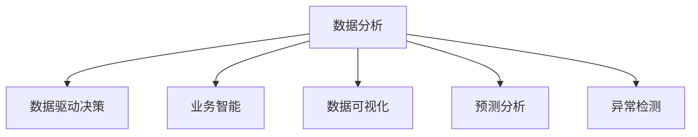

                 

# 如何利用数据分析指导运营决策

> 关键词：数据分析, 运营决策, 数据驱动, 业务智能, 数据可视化, 预测分析, 异常检测

## 1. 背景介绍

### 1.1 问题由来
在数字化转型的浪潮下，数据分析已成为驱动企业运营决策的重要引擎。从市场营销、产品开发到供应链管理，各类业务场景都需要通过数据分析来揭示趋势、预测未来、优化运营，以实现更高的效率和竞争力。然而，如何有效地获取、处理和利用数据，始终是企业面临的一大挑战。

### 1.2 问题核心关键点
数据分析的核心目标在于：通过系统化的数据处理和建模，挖掘数据中的有用信息，生成可视化报表，辅助管理层制定科学的决策方案。这包括但不限于：
- 数据收集与预处理：确保数据的质量、完整性和一致性。
- 数据建模与分析：利用统计、机器学习等技术，分析数据趋势、异常和关联。
- 数据可视化：将复杂的数据信息转化为直观的图形展示，方便决策者理解。
- 预测分析：基于历史数据，构建预测模型，辅助未来决策。
- 异常检测：识别数据中的异常点，及时采取应对措施。

### 1.3 问题研究意义
数据分析在企业运营决策中的作用，可以从以下几个方面来阐述：

1. **提升决策质量**：通过数据分析，可以揭示数据中的潜在规律，辅助管理层制定更加科学和精准的决策。
2. **降低运营成本**：通过数据分析优化资源配置，减少浪费，提高运营效率。
3. **增强竞争力**：通过深入理解市场和客户需求，及时调整策略，增强企业竞争力。
4. **促进创新**：数据分析可以揭示业务中的痛点和改进点，驱动产品和服务的创新。
5. **提升风险管理**：通过数据分析，可以提前识别和预测风险，制定相应的风险应对策略。

## 2. 核心概念与联系

### 2.1 核心概念概述

为更好地理解利用数据分析指导运营决策的方法，本节将介绍几个密切相关的核心概念：

- **数据分析**：通过收集、处理、分析和解释数据，揭示数据中的有用信息和趋势，辅助决策的过程。
- **数据驱动决策**：以数据为依据，结合业务知识，制定和调整运营策略的过程。
- **业务智能(BI)**：利用数据分析技术，将企业数据转化为可操作的商业洞察和知识，辅助高层管理决策。
- **数据可视化**：将复杂的数据信息转化为直观的图形展示，便于决策者理解。
- **预测分析**：基于历史数据，构建预测模型，辅助未来决策。
- **异常检测**：识别数据中的异常点，及时采取应对措施。

这些概念之间的逻辑关系可以通过以下Mermaid流程图来展示：



这个流程图展示了大数据分析在指导运营决策中的主要作用：

1. 数据分析是数据驱动决策的基石。
2. 业务智能通过数据分析生成商业洞察，辅助决策。
3. 数据可视化使复杂数据直观化，方便决策者理解。
4. 预测分析基于历史数据构建模型，辅助未来决策。
5. 异常检测及时识别异常点，确保运营稳定。

## 3. 核心算法原理 & 具体操作步骤
### 3.1 算法原理概述

数据分析的核心算法原理可以归纳为以下几个步骤：

1. **数据收集与预处理**：收集业务相关的数据，进行清洗、去重、归一化等处理，确保数据质量。
2. **数据探索与分析**：使用统计分析、机器学习等技术，分析数据中的模式、趋势和关联，生成图表、报告等。
3. **数据建模与预测**：利用回归、分类、聚类等模型，对数据进行建模，生成预测结果。
4. **数据可视化**：使用图表、仪表盘等工具，将分析结果直观展示。
5. **异常检测**：通过统计方法、算法等，识别数据中的异常点。

这些步骤构成了数据分析的核心流程，是指导运营决策的基础。

### 3.2 算法步骤详解

以下是详细的算法步骤：

**Step 1: 数据收集与预处理**
- 收集业务相关的数据，包括客户数据、交易数据、设备数据等。
- 进行数据清洗，处理缺失值、异常值和重复值。
- 数据归一化，将不同规模的数据进行标准化处理。
- 数据变换，如对数变换、归一化等，适用于数据分布不均的情况。

**Step 2: 数据探索与分析**
- 使用描述性统计分析，如均值、中位数、标准差等，评估数据分布。
- 利用可视化工具（如Tableau、PowerBI）生成图表，展示数据分布、趋势等。
- 进行相关性分析，识别变量之间的关联。
- 进行回归分析，评估变量之间的关系强度。

**Step 3: 数据建模与预测**
- 选择适合的预测模型，如线性回归、决策树、随机森林等。
- 训练模型，使用历史数据进行拟合。
- 评估模型，使用交叉验证、留一法等评估模型性能。
- 应用模型，使用训练好的模型进行预测。

**Step 4: 数据可视化**
- 选择合适的可视化工具，如Tableau、PowerBI等。
- 设计可视化报表，展示关键指标和趋势。
- 使用动态仪表盘，实时展示数据变化。
- 设计报告，详细记录数据分析过程和结果。

**Step 5: 异常检测**
- 定义异常检测阈值，如均值加减3倍标准差等。
- 使用统计方法，如Z-score、IQR等，识别异常值。
- 使用机器学习算法，如孤立森林、One-class SVM等，识别异常点。

### 3.3 算法优缺点

数据分析的方法有以下优点：
1. 准确性高：基于统计和机器学习的方法，可以获得高精度的分析结果。
2. 全面性高：可以从多个角度分析数据，全面了解业务情况。
3. 及时性高：利用实时数据进行分析和预测，及时调整策略。

但同时也有以下缺点：
1. 数据质量依赖性高：数据质量不佳会影响分析结果的准确性。
2. 技术门槛高：需要具备一定的统计和机器学习知识。
3. 模型复杂度高：复杂模型需要较长的训练时间和较大的计算资源。
4. 解释性差：部分模型难以解释其内部逻辑和决策过程。

### 3.4 算法应用领域

数据分析的应用领域非常广泛，涵盖几乎所有业务场景，包括但不限于：

- 市场营销：分析客户行为，制定营销策略，提升客户转化率。
- 产品开发：分析产品使用数据，优化产品功能，提升用户体验。
- 供应链管理：分析库存数据，优化库存管理，减少库存成本。
- 客户服务：分析客户投诉数据，提升服务质量，减少客户流失率。
- 风险管理：分析历史数据，预测风险事件，制定风险应对策略。
- 人力资源：分析员工绩效数据，优化招聘、培训、绩效评估等流程。

此外，数据分析还广泛应用于金融、医疗、教育等多个领域，为这些行业的数字化转型提供了强大的支持。

## 4. 数学模型和公式 & 详细讲解 & 举例说明
### 4.1 数学模型构建

数据分析的核心数学模型可以归纳为以下几个方面：

- **描述性统计**：均值、中位数、标准差、方差等，用于评估数据分布。
- **回归分析**：线性回归、多项式回归等，用于评估变量之间的关系。
- **分类分析**：逻辑回归、决策树等，用于分类预测。
- **聚类分析**：K-Means、层次聚类等，用于识别数据中的群组。

### 4.2 公式推导过程

以下是几个常用的数学公式及其推导过程：

**均值公式**：
$$
\mu = \frac{1}{n} \sum_{i=1}^{n} x_i
$$
其中，$\mu$ 表示均值，$n$ 表示样本数量，$x_i$ 表示第 $i$ 个样本。

**标准差公式**：
$$
\sigma = \sqrt{\frac{1}{n-1} \sum_{i=1}^{n} (x_i - \mu)^2}
$$
其中，$\sigma$ 表示标准差，$n$ 表示样本数量，$x_i$ 表示第 $i$ 个样本。

**线性回归公式**：
$$
y = \beta_0 + \beta_1 x_1 + \epsilon
$$
其中，$y$ 表示因变量，$x_1$ 表示自变量，$\beta_0$ 和 $\beta_1$ 表示模型参数，$\epsilon$ 表示误差项。

**逻辑回归公式**：
$$
P(y=1|x) = \frac{1}{1+e^{-\theta^T x}}
$$
其中，$P(y=1|x)$ 表示在给定自变量 $x$ 下，因变量 $y$ 为正类的概率，$\theta$ 表示模型参数，$e$ 表示自然常数。

### 4.3 案例分析与讲解

**案例1：客户流失分析**
某电商企业希望通过数据分析找出客户流失的原因。收集客户基本信息、购买历史、投诉记录等数据，进行以下步骤：

1. 数据收集与预处理：收集客户基本信息、购买历史、投诉记录等数据，进行清洗、去重、归一化等处理。
2. 数据探索与分析：使用描述性统计分析，评估客户基本信息、购买行为、投诉记录等数据的分布情况。使用可视化工具生成图表，展示客户流失与购买行为、投诉记录等的关系。
3. 数据建模与预测：选择逻辑回归模型，使用历史数据进行拟合。评估模型性能，使用交叉验证、留一法等评估模型预测能力。
4. 数据可视化：设计可视化报表，展示客户流失与购买行为、投诉记录等的关系，并生成动态仪表盘，实时展示客户流失情况。
5. 异常检测：识别投诉记录中的异常点，及时采取应对措施。

通过上述分析，企业可以识别出客户流失的潜在因素，制定相应的策略，减少客户流失。

## 5. 项目实践：代码实例和详细解释说明
### 5.1 开发环境搭建

在进行数据分析实践前，我们需要准备好开发环境。以下是使用Python进行数据分析的环境配置流程：

1. 安装Anaconda：从官网下载并安装Anaconda，用于创建独立的Python环境。

2. 创建并激活虚拟环境：
```bash
conda create -n data-env python=3.8 
conda activate data-env
```

3. 安装必要的库：
```bash
conda install numpy pandas matplotlib seaborn scipy statsmodels
```

4. 安装可视化工具：
```bash
conda install matplotlib seaborn plotly
```

5. 安装机器学习库：
```bash
conda install scikit-learn xgboost lightgbm
```

完成上述步骤后，即可在`data-env`环境中开始数据分析实践。

### 5.2 源代码详细实现

下面我们以客户流失分析为例，给出使用Python进行数据分析的代码实现。

首先，导入必要的库：

```python
import pandas as pd
import numpy as np
import matplotlib.pyplot as plt
import seaborn as sns
from sklearn.linear_model import LogisticRegression
from sklearn.metrics import classification_report, confusion_matrix
from sklearn.model_selection import train_test_split
from sklearn.preprocessing import StandardScaler
```

然后，读取数据集：

```python
data = pd.read_csv('customer_churn.csv')
```

进行数据探索与分析：

```python
# 描述性统计分析
data.describe()

# 可视化图表
sns.pairplot(data, hue='Churn', diag_kind='kde', palette='husl')
plt.show()

# 相关性分析
corr_matrix = data.corr()
sns.heatmap(corr_matrix, annot=True, cmap='coolwarm')
plt.show()
```

接着，进行数据建模与预测：

```python
# 数据拆分
X = data.drop(['Churn'], axis=1)
y = data['Churn']

# 数据标准化
scaler = StandardScaler()
X_scaled = scaler.fit_transform(X)

# 数据拆分训练集和测试集
X_train, X_test, y_train, y_test = train_test_split(X_scaled, y, test_size=0.2, random_state=42)

# 训练模型
model = LogisticRegression()
model.fit(X_train, y_train)

# 评估模型
y_pred = model.predict(X_test)
print(classification_report(y_test, y_pred))
print(confusion_matrix(y_test, y_pred))
```

最后，进行数据可视化：

```python
# 可视化仪表盘
import plotly.express as px
fig = px.scatter(data, x='Age', y='Churn', color='Churn')
fig.show()
```

以上就是使用Python进行客户流失分析的完整代码实现。可以看到，利用Python的强大库函数，可以进行高效的数据分析和可视化。

### 5.3 代码解读与分析

让我们再详细解读一下关键代码的实现细节：

**数据处理**：
- 使用`pandas`库，读取数据集，并进行清洗、去重、归一化等处理。
- 使用`numpy`库，进行数组操作，方便后续分析。

**数据探索与分析**：
- 使用`pandas`库，进行描述性统计分析。
- 使用`matplotlib`库，生成可视化图表。
- 使用`seaborn`库，进行相关性分析，并生成热力图。

**数据建模与预测**：
- 使用`sklearn`库，进行数据拆分和标准化。
- 使用`sklearn`库，进行数据拆分，训练逻辑回归模型，并评估模型性能。

**数据可视化**：
- 使用`plotly`库，生成交互式可视化仪表盘。

通过上述代码实现，可以系统地完成客户流失分析的数据处理、探索、建模和可视化。

## 6. 实际应用场景
### 6.1 智能客服系统

智能客服系统通过数据分析，可以实时监控客户咨询情况，及时发现和解决问题。具体而言：

- 收集客户咨询数据，分析客户咨询的热门问题。
- 使用文本分析工具，识别客户的情绪和需求。
- 生成可视化报表，展示客户咨询的趋势和热点。
- 基于客户反馈，优化客服流程和策略，提升客户满意度。

### 6.2 金融风险管理

金融风险管理通过数据分析，可以实时监控市场风险，提前识别和预测潜在的风险事件。具体而言：

- 收集市场数据，包括股票、期货等金融产品的价格、成交量、波动率等。
- 使用时间序列分析工具，评估市场趋势和波动性。
- 构建风险模型，预测市场风险事件的概率和影响。
- 生成可视化报表，展示市场风险的趋势和预警信号。

### 6.3 零售供应链管理

零售供应链管理通过数据分析，可以优化库存管理，减少库存成本。具体而言：

- 收集销售数据，分析销售趋势和季节性波动。
- 使用时间序列分析工具，预测未来的销售量。
- 构建库存优化模型，优化库存水平和补货策略。
- 生成可视化报表，展示库存管理的绩效和改进点。

### 6.4 未来应用展望

随着数据分析技术的不断发展，未来将涌现更多基于数据分析的运营决策工具。以下是一些可能的趋势：

- **实时分析**：利用实时数据进行分析和预测，及时调整策略。
- **多模态数据融合**：将文本、图像、视频等多种数据源进行融合分析，提供更全面的业务洞察。
- **自动化决策**：利用机器学习算法，自动化生成决策方案，提高决策效率。
- **个性化推荐**：利用数据分析，实现个性化推荐，提升用户体验。
- **跨领域应用**：将数据分析方法应用于更多领域，如医疗、教育、政府等，推动各行各业的数字化转型。

## 7. 工具和资源推荐
### 7.1 学习资源推荐

为了帮助开发者系统掌握数据分析的理论基础和实践技巧，这里推荐一些优质的学习资源：

1. **《Python数据分析实战》**：由数据科学专家撰写，全面介绍了数据分析的基本概念和实用技巧。
2. **《数据科学导论》**：斯坦福大学开设的数据科学课程，涵盖统计、机器学习、可视化等内容。
3. **《Data Science for Business》**：Harvard大学开设的商业数据分析课程，结合实际案例，讲解数据分析的应用。
4. **Kaggle竞赛**：参与数据分析竞赛，通过实战提升数据分析能力。
5. **Coursera、Udacity**：提供数据分析相关的在线课程，涵盖基础到高级的内容。

通过对这些资源的学习实践，相信你一定能够快速掌握数据分析的精髓，并用于解决实际的业务问题。

### 7.2 开发工具推荐

高效的开发离不开优秀的工具支持。以下是几款用于数据分析开发的常用工具：

1. **Jupyter Notebook**：基于Python的交互式开发环境，支持代码块、数学公式、可视化图表等多种功能。
2. **Tableau**：数据可视化工具，支持拖拽式操作，生成高质量的可视化报表。
3. **PowerBI**：微软推出的商业智能工具，支持大规模数据处理和可视化。
4. **Python**：开源的编程语言，拥有丰富的数据分析库，如Pandas、NumPy、Matplotlib等。
5. **R**：另一个流行的统计分析语言，拥有强大的数据处理和可视化库。

合理利用这些工具，可以显著提升数据分析任务的开发效率，加速创新迭代的步伐。

### 7.3 相关论文推荐

数据分析方法的发展源于学界的持续研究。以下是几篇奠基性的相关论文，推荐阅读：

1. **《机器学习实战》**：机器学习领域的经典书籍，涵盖分类、回归、聚类等常用算法。
2. **《数据挖掘：概念与技术》**：全面介绍数据挖掘的基本概念和常用方法。
3. **《数据科学的艺术》**：讲述了数据分析从数据收集、处理到可视化的全过程。
4. **《Python数据科学手册》**：详细介绍Python在数据分析中的应用，包括数据清洗、探索、建模、可视化等。

这些论文代表了大数据分析技术的发展脉络。通过学习这些前沿成果，可以帮助研究者把握学科前进方向，激发更多的创新灵感。

## 8. 总结：未来发展趋势与挑战
### 8.1 总结

本文对利用数据分析指导运营决策的方法进行了全面系统的介绍。首先阐述了数据分析在运营决策中的作用，明确了数据分析在提升决策质量、降低运营成本、增强竞争力等方面的独特价值。其次，从原理到实践，详细讲解了数据分析的数学模型和算法步骤，给出了数据分析任务开发的完整代码实例。同时，本文还广泛探讨了数据分析在智能客服、金融风险管理、零售供应链管理等多个领域的应用前景，展示了数据分析范式的巨大潜力。此外，本文精选了数据分析技术的各类学习资源，力求为读者提供全方位的技术指引。

通过本文的系统梳理，可以看到，数据分析在指导运营决策中的重要作用，其技术方法的不断演进，将推动企业在数字化转型中不断提升运营效率和市场竞争力。

### 8.2 未来发展趋势

展望未来，数据分析技术将呈现以下几个发展趋势：

1. **自动化与智能化**：自动化数据分析工具和智能化算法将越来越普及，提升数据分析效率和准确性。
2. **多模态数据融合**：将文本、图像、视频等多种数据源进行融合分析，提供更全面的业务洞察。
3. **实时分析**：利用实时数据进行分析和预测，及时调整策略。
4. **个性化推荐**：利用数据分析，实现个性化推荐，提升用户体验。
5. **跨领域应用**：将数据分析方法应用于更多领域，如医疗、教育、政府等，推动各行各业的数字化转型。

以上趋势凸显了数据分析技术的广阔前景。这些方向的探索发展，将进一步提升数据分析的深度和广度，为企业的运营决策提供更强大的支持。

### 8.3 面临的挑战

尽管数据分析技术已经取得了瞩目成就，但在迈向更加智能化、普适化应用的过程中，它仍面临着诸多挑战：

1. **数据质量瓶颈**：数据质量不佳会影响数据分析结果的准确性。如何确保数据的质量、完整性和一致性，是一个重要的问题。
2. **技术门槛高**：数据分析需要具备一定的统计和机器学习知识，对非技术人员来说存在一定的门槛。如何降低技术门槛，让更多人参与到数据分析中来，是未来的研究方向。
3. **模型复杂度高**：复杂模型需要较长的训练时间和较大的计算资源。如何简化模型结构，提高计算效率，是未来的一个重要方向。
4. **解释性差**：部分模型难以解释其内部逻辑和决策过程，缺乏透明度。如何增强模型的可解释性，让决策者更信服，是未来的一个重要课题。
5. **数据隐私和安全**：数据分析过程中需要处理大量敏感数据，如何确保数据隐私和安全，是一个重要的挑战。

### 8.4 研究展望

面对数据分析面临的这些挑战，未来的研究需要在以下几个方面寻求新的突破：

1. **数据清洗与预处理**：开发更高效的数据清洗与预处理技术，确保数据的质量和一致性。
2. **自动化数据分析**：开发自动化数据分析工具，降低技术门槛，提升数据分析效率。
3. **模型简化与优化**：简化模型结构，提高计算效率，增强模型的可解释性。
4. **数据隐私与安全**：开发数据隐私保护和安全技术，确保数据分析过程的可靠性和安全性。
5. **跨领域应用**：将数据分析方法应用于更多领域，推动各行各业的数字化转型。

这些研究方向的探索，将引领数据分析技术迈向更高的台阶，为构建智能、高效、安全的运营决策系统铺平道路。面向未来，数据分析技术还需要与其他人工智能技术进行更深入的融合，如知识表示、因果推理、强化学习等，多路径协同发力，共同推动业务智能的进步。只有勇于创新、敢于突破，才能不断拓展数据分析的边界，让智能技术更好地造福人类社会。

## 9. 附录：常见问题与解答
**Q1：数据分析是否适用于所有业务场景？**

A: 数据分析在绝大多数业务场景中都有应用价值，但不同业务场景的数据结构和分析需求不同。例如，金融领域需要高频数据处理和实时分析，而零售领域需要长时间序列分析和预测。因此，需要根据具体业务场景选择合适的数据分析方法和工具。

**Q2：如何选择合适的数据分析工具？**

A: 选择合适的数据分析工具，需要考虑数据规模、处理速度、可视化需求、技术门槛等因素。例如，对于大规模数据处理和实时分析，可以选择Tableau、PowerBI等商业智能工具；对于技术门槛较低的数据探索和可视化，可以选择Python、R等编程语言。

**Q3：数据分析在数据质量不佳的情况下，还能否得到有用的结果？**

A: 数据质量不佳会影响数据分析结果的准确性，但通过数据清洗和预处理，仍然可以得到有用的信息。例如，可以通过异常检测识别数据中的异常点，使用机器学习算法处理缺失值和异常值，从而得到可靠的分析结果。

**Q4：数据分析在数据隐私和安全方面有哪些考虑？**

A: 数据分析过程中需要处理大量敏感数据，因此需要考虑数据隐私和安全问题。例如，可以使用数据脱敏技术保护个人隐私，使用加密技术保护数据安全，使用访问控制技术限制数据访问权限。

通过这些问题和解答，希望能帮助读者更好地理解数据分析在运营决策中的应用，并掌握相应的技术和工具。数据分析技术的发展，将为企业的运营决策提供更加强大的支持，推动企业迈向数字化转型的新高度。

