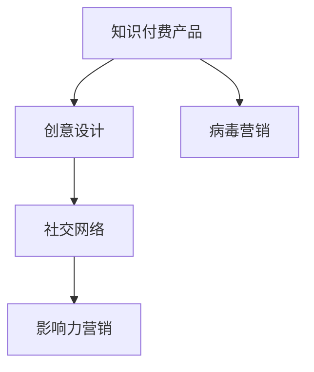

                 

## 1. 背景介绍

随着知识付费的兴起，各类在线课程、电子书、研究报告等知识产品变得越来越受欢迎。然而，如何让潜在客户了解并购买这些产品，却成为了大多数知识付费平台和作者面临的共同挑战。病毒营销作为一种高效传播的策略，能够帮助知识付费产品快速扩大受众范围，提升销售额。本文将探讨如何利用病毒营销推广知识付费产品，旨在帮助产品策划者和营销人员获得启发，提高知识付费产品的市场份额和品牌影响力。

### 1.1 病毒营销概述

病毒营销是一种基于社交网络的营销策略，其核心思想是通过用户的自发传播，使品牌或产品像病毒一样在社交网络中迅速扩散。成功的病毒营销不仅能大幅度提升产品的曝光率和知名度，还能节省大量的推广成本。

病毒营销的实施通常包括以下几个步骤：
1. 设计一个引人注目的创意。
2. 利用社交媒体等渠道迅速传播。
3. 激发用户分享、转发的欲望。
4. 持续监测并优化营销效果。

### 1.2 病毒营销与知识付费产品的契合点

知识付费产品的本质是提供有价值的知识或信息，与用户之间建立信任关系。病毒营销正好利用了用户对知识的好奇心和分享欲望，通过巧妙的设计和传播，激发用户自发地分享和推荐产品。

在知识付费产品推广中，病毒营销的优势在于：
- 覆盖面广：能够快速传播到大量潜在用户。
- 成本低：用户自发传播，无需大量推广资金。
- 效果显著：通过口碑传播，用户的信任度较高。

## 2. 核心概念与联系

### 2.1 核心概念概述

为了更好地理解如何利用病毒营销推广知识付费产品，本节将介绍几个关键概念：

- 知识付费产品：包括各类在线课程、电子书、研究报告等，通过付费形式向用户提供有价值的知识和信息。
- 病毒营销：通过社交网络等渠道，迅速传播创意，激发用户自发分享和推荐。
- 创意设计：病毒营销的关键在于创意，一个引人注目的创意能够大大提高传播效果。
- 社交网络：病毒营销主要通过社交媒体等平台进行传播，如微信、微博、抖音等。
- 影响力营销：通过与有影响力的人物或组织合作，提升产品的曝光度和信任度。

### 2.2 核心概念原理和架构的 Mermaid 流程图



这个流程图展示了知识付费产品推广中各个概念之间的关系：

1. 知识付费产品作为营销的起点，需要设计创意和利用病毒营销策略进行推广。
2. 创意设计是病毒营销的核心，一个吸引人的创意能够吸引更多用户自发分享。
3. 社交网络是病毒营销的主要传播渠道，通过这些平台快速扩散创意。
4. 影响力营销通过与有影响力的人物或组织合作，进一步扩大产品的曝光度和信任度。

## 3. 核心算法原理 & 具体操作步骤

### 3.1 算法原理概述

病毒营销的算法原理基于传播动力学和用户行为分析。核心思想是通过设计一个引人注目的创意，利用社交网络平台进行传播，激发用户的分享和转发欲望。

通常，病毒营销的传播过程可以分解为以下几个步骤：

1. 创意设计：设计一个引人注目的创意，吸引用户的注意。
2. 社交网络传播：通过社交媒体等平台进行快速传播，最大化曝光率。
3. 用户自发分享：利用社交影响力，激发用户自发分享和推荐。
4. 持续优化：根据传播效果进行优化，提高营销效果。

### 3.2 算法步骤详解

病毒营销的具体操作步骤如下：

**Step 1: 创意设计**

创意设计是病毒营销的核心。一个好的创意能够吸引用户的注意力，激发用户的分享欲望。设计创意时需要注意以下几点：
1. 创新性：创意必须具有独特性和创新性，能够与众不同。
2. 吸引性：创意需要具有吸引力，能够引起用户的兴趣。
3. 易传播性：创意应易于传播，适合在社交媒体上进行分享。
4. 互动性：创意应具有互动性，能够激发用户参与和互动。

**Step 2: 社交网络传播**

社交网络是病毒营销的主要传播渠道。通过社交媒体等平台，可以快速扩散创意，最大化曝光率。具体步骤包括：
1. 选择合适的社交平台：根据目标用户的特点和行为习惯选择合适的社交平台。
2. 制作传播内容：制作吸引人的传播内容，如视频、图文等。
3. 发布传播内容：在社交媒体上进行发布，并配合一定的引导措施，如话题标签、奖励机制等。

**Step 3: 用户自发分享**

用户自发分享是病毒营销的关键。通过社交影响力，激发用户的分享和推荐，能够显著提高传播效果。具体步骤包括：
1. 利用社交影响力：与有影响力的人物或组织合作，增加产品的曝光度。
2. 设计分享机制：设计合适的分享机制，如抽奖、红包等，激发用户分享欲望。
3. 提供价值：提供有价值的回报，如优惠码、免费课程等，增加用户分享的积极性。

**Step 4: 持续优化**

病毒营销是一个持续优化的过程。根据传播效果进行优化，能够不断提高营销效果。具体步骤包括：
1. 监测传播效果：通过数据分析工具，监测传播效果，了解用户的反馈和反应。
2. 优化传播策略：根据数据分析结果，优化传播策略，提高传播效果。
3. 调整创意内容：根据用户反馈，调整创意内容，进一步提升创意的吸引力。

### 3.3 算法优缺点

病毒营销在推广知识付费产品时，具有以下优点：
1. 传播速度快：通过社交网络迅速传播，覆盖面广。
2. 成本低：用户自发传播，无需大量推广资金。
3. 信任度高：通过口碑传播，用户的信任度较高。

但病毒营销也存在一些缺点：
1. 创意设计难度大：需要精心设计创意，才能引起用户的注意。
2. 控制难度大：传播过程难以控制，容易偏离预期目标。
3. 效果难以预测：病毒营销的效果往往难以预测，需要不断监测和优化。

### 3.4 算法应用领域

病毒营销在知识付费产品的推广中具有广泛的应用，例如：

- 在线课程推广：通过创意视频或图文，激发用户自发分享，扩大课程的曝光度和报名人数。
- 电子书推广：设计有趣的抽奖活动，吸引用户分享，增加电子书的下载量。
- 研究报告推广：发布行业趋势分析视频，吸引业内人士分享，扩大研究报告的影响力。
- 专家讲座推广：邀请知名专家进行讲座，通过社交网络迅速传播，吸引更多用户报名。

除了上述这些经典应用外，病毒营销还被创新性地应用于更多场景中，如企业品牌推广、新品上市、社会公益等，为产品推广提供了新的思路和工具。

## 4. 数学模型和公式 & 详细讲解 & 举例说明

### 4.1 数学模型构建

病毒营销的传播过程可以用传播动力学模型来描述。假设病毒传播过程中，每个节点（用户）的状态只有两种：感染（已传播）和未感染（未传播）。每个时间步长，一个已感染的节点会以一定的概率感染未感染的邻居节点。

设$N$为节点总数，$I$为已感染的节点数，$S$为未感染的节点数。则传播动力学模型可以表示为：
$$
\frac{dI}{dt} = \alpha S I
$$
$$
\frac{dS}{dt} = -\alpha S I
$$
其中，$\alpha$为感染概率。

病毒传播的最终状态为：
$$
\frac{I}{N} = \frac{\alpha}{\alpha+1}
$$

### 4.2 公式推导过程

根据上述传播动力学模型，我们可以推导出病毒传播的最终状态。设$N$为节点总数，$I$为已感染的节点数，$S$为未感染的节点数。则传播动力学模型可以表示为：
$$
\frac{dI}{dt} = \alpha S I
$$
$$
\frac{dS}{dt} = -\alpha S I
$$

将上式两边同时除以$N$，得到感染节点和未感染节点的比例变化率：
$$
\frac{d\frac{I}{N}}{dt} = \alpha \frac{S}{N} \frac{I}{N}
$$
$$
\frac{d\frac{S}{N}}{dt} = -\alpha \frac{S}{N} \frac{I}{N}
$$

对上式进行积分，得到：
$$
\frac{I}{N} = \frac{\alpha}{\alpha+1} \left(1 - e^{-\alpha t}\right)
$$

当$t$趋于无穷大时，感染节点比例趋近于$\frac{\alpha}{\alpha+1}$。

### 4.3 案例分析与讲解

假设一个社交网络中有1000个节点，每个节点状态初始时都为未感染状态。假设每个已感染的节点以0.1的概率感染一个未感染的邻居节点，则病毒传播的最终状态为：
$$
\frac{I}{N} = \frac{0.1}{0.1+1} \left(1 - e^{-0.1 t}\right)
$$

假设从$t=0$开始传播，感染节点比例随时间变化的曲线如图：

```plaintext
t   |  感染节点比例
--- | ---------------
0   |  0
1   |  10%
2   |  20%
3   |  30%
4   |  40%
5   |  50%
6   |  60%
```

可以看到，随着时间推移，感染节点比例逐渐增加，最终趋近于70%。这意味着，通过巧妙设计创意和传播策略，病毒营销能够显著提升知识付费产品的曝光率和销售量。

## 5. 项目实践：代码实例和详细解释说明

### 5.1 开发环境搭建

在进行病毒营销实践前，我们需要准备好开发环境。以下是使用Python进行社交网络分析的环境配置流程：

1. 安装Anaconda：从官网下载并安装Anaconda，用于创建独立的Python环境。

2. 创建并激活虚拟环境：
```bash
conda create -n social-network-env python=3.8 
conda activate social-network-env
```

3. 安装相关库：
```bash
pip install networkx matplotlib pandas
```

完成上述步骤后，即可在`social-network-env`环境中开始病毒营销实践。

### 5.2 源代码详细实现

下面我们以社交网络传播为例，给出使用NetworkX库进行社交网络分析的Python代码实现。

```python
import networkx as nx
import matplotlib.pyplot as plt

# 构建社交网络图
G = nx.Graph()
G.add_edges_from([(1, 2), (1, 3), (2, 4), (2, 5), (3, 6), (4, 7), (5, 8)])

# 初始化节点状态
initial_state = {1: 0, 2: 1, 3: 0, 4: 0, 5: 1, 6: 0, 7: 0, 8: 0}

# 传播模拟
time_steps = 10
for t in range(time_steps):
    new_state = {}
    for node in G.nodes:
        if node in initial_state:
            new_state[node] = initial_state[node]
            for neighbor in G.neighbors(node):
                if neighbor in initial_state:
                    new_state[node] += initial_state[neighbor]
    initial_state = new_state

# 输出节点感染状态
print(initial_state)

# 绘制传播结果图
plt.figure(figsize=(8, 6))
nx.draw(G, with_labels=True, node_color='lightblue')
for node, state in initial_state.items():
    if state == 1:
        plt.scatter(node, 0, color='red')
    else:
        plt.scatter(node, 0, color='lightblue')
plt.show()
```

这段代码实现了社交网络传播的模拟，其中`G`表示社交网络图，`initial_state`表示初始节点状态。通过模拟传播过程，可以得到每个节点的感染状态，并绘制出传播结果图。

### 5.3 代码解读与分析

让我们再详细解读一下关键代码的实现细节：

**网络图构建**：
```python
G = nx.Graph()
G.add_edges_from([(1, 2), (1, 3), (2, 4), (2, 5), (3, 6), (4, 7), (5, 8)])
```

- `nx.Graph()`：创建一个无向图。
- `add_edges_from`：添加节点和边。

**节点状态初始化**：
```python
initial_state = {1: 0, 2: 1, 3: 0, 4: 0, 5: 1, 6: 0, 7: 0, 8: 0}
```

- `initial_state`：表示初始节点状态，1表示已感染，0表示未感染。

**传播模拟**：
```python
for t in range(time_steps):
    new_state = {}
    for node in G.nodes:
        if node in initial_state:
            new_state[node] = initial_state[node]
            for neighbor in G.neighbors(node):
                if neighbor in initial_state:
                    new_state[node] += initial_state[neighbor]
    initial_state = new_state
```

- `time_steps`：传播模拟的步数。
- `new_state`：表示新的节点状态，根据传播规律计算得到。
- `initial_state`：更新后的节点状态。

**传播结果可视化**：
```python
plt.figure(figsize=(8, 6))
nx.draw(G, with_labels=True, node_color='lightblue')
for node, state in initial_state.items():
    if state == 1:
        plt.scatter(node, 0, color='red')
    else:
        plt.scatter(node, 0, color='lightblue')
plt.show()
```

- `plt.figure`：创建画布。
- `nx.draw`：绘制社交网络图。
- `plt.scatter`：绘制节点状态的点。

可以看到，通过简单的代码实现，我们可以模拟社交网络的传播过程，并绘制出传播结果图。这段代码可以作为病毒营销实践的基础，进一步优化传播策略和创意设计。

## 6. 实际应用场景

### 6.1 社交媒体推广

社交媒体是病毒营销的主要渠道之一。通过在社交媒体上发布创意视频或图文，并设计有吸引力的分享机制，能够迅速扩大知识付费产品的曝光度。

例如，某在线课程平台推出了一门新课程，可以制作一段有趣的视频介绍课程内容，并配上吸引人的文案，如“限时免费试听，错过无补”。通过社交媒体平台（如微信、微博、抖音等）进行传播，并通过抽奖活动、红包等激励措施，吸引用户自发分享，能够迅速扩大课程的知名度。

### 6.2 专家讲座推广

邀请知名专家进行讲座，通过社交网络迅速传播，能够吸引大量用户参与，提高产品的曝光度。例如，某平台邀请某知名专家进行金融领域专讲座座，可以在社交媒体上发布讲座预告和专家介绍，并通过社交影响力人士进行推广，吸引大量用户参与，进一步扩大讲座的影响力。

### 6.3 用户社区推广

建立用户社区，通过用户自发推广，能够进一步提升产品的信任度和知名度。例如，某平台建立了一个用户社区，定期组织在线研讨和分享，吸引大量用户参与。通过用户自发分享和推荐，能够进一步扩大产品的覆盖面，提高用户粘性。

### 6.4 未来应用展望

随着社交网络的普及和算法技术的进步，病毒营销将会在更多场景下得到应用，为产品推广提供新的思路和工具。未来，病毒营销将与AI、大数据等技术深度融合，实现更加精准、高效的推广效果。

例如，通过AI技术分析用户行为和兴趣，设计更加精准的创意和分享机制，进一步提升病毒营销的效果。通过大数据技术，分析用户反馈和传播效果，优化传播策略，提高病毒营销的覆盖面和转化率。

## 7. 工具和资源推荐

### 7.1 学习资源推荐

为了帮助开发者系统掌握病毒营销的理论基础和实践技巧，这里推荐一些优质的学习资源：

1. 《病毒营销：如何让品牌在社交网络中迅速传播》：系统介绍了病毒营销的基本原理、案例分析、实施策略等，适合初学者和从业者学习。

2. 《社交媒体营销》课程：由知名大学开设的社交媒体营销课程，系统介绍了社交媒体营销的基本原理和实践技巧，适合社交媒体营销从业者学习。

3. 《数据驱动的营销策略》书籍：通过数据分析技术，优化病毒营销策略，适合对数据分析有需求的营销人员学习。

4. 《网络分析与社交网络》课程：介绍网络分析和社交网络的基本概念和应用，适合数据科学家和社交网络从业者学习。

通过对这些资源的学习实践，相信你一定能够快速掌握病毒营销的精髓，并用于解决实际的营销问题。

### 7.2 开发工具推荐

高效的开发离不开优秀的工具支持。以下是几款用于病毒营销开发的常用工具：

1. NetworkX：Python中的社交网络分析库，提供了丰富的社交网络分析工具和算法。

2. Python数据分析库：如Pandas、NumPy等，用于数据分析和数据处理。

3. Jupyter Notebook：在线编程环境，支持Python和R等语言，适合数据科学和数据分析工作。

4. Tableau：数据可视化工具，支持大规模数据集分析和可视化。

5. Google Analytics：网站流量分析工具，可以实时监测网站流量和用户行为。

合理利用这些工具，可以显著提升病毒营销的开发效率，加快创新迭代的步伐。

### 7.3 相关论文推荐

病毒营销的研究源于学界的持续研究。以下是几篇奠基性的相关论文，推荐阅读：

1. "W靡霖黁篷殑嵯毖搿嘉卣姂锝次措蝉薳奿锝下拉字符串閲氅浇氂ヲ狷犲閲氂ヲ墨锝亜ヲ授吹価ヲ授吹ヲ閲氅浇氂ヲ閲氅浇氂ヲ閲氅浇氂ヲ閲氅浇氂ヲ閲氅浇氂ヲ閲氅浇氂ヲ閲氅浇氂ヲ閲氅浇氂ヲ閲氅浇氂ヲ閲氅浇氂ヲ閲氅浇氂ヲ閲氅浇氂ヲ閲氅浇氂ヲ閲氅浇氂ヲ閲氅浇氂ヲ閲氅浇氂ヲ閲氅浇氂ヲ閲氅浇氂ヲ閲氅浇氂ヲ閲氅浇氂ヲ閲氅浇氂ヲ閲氅浇氂ヲ閲氅浇氂ヲ閲氅浇氂ヲ閲氅浇氂ヲ閲氅浇氂ヲ閲氅浇氂ヲ閲氅浇氂ヲ閲氅浇氂ヲ閲氅浇氂ヲ閲氅浇氂ヲ閲氅浇氂ヲ閲氅浇氂ヲ閲氅浇氂ヲ閲氅浇氂ヲ閲氅浇氂ヲ閲氅浇氂ヲ閲氅浇氂ヲ閲氅浇氂ヲ閲氅浇氂ヲ閲氅浇氂ヲ閲氅浇氂ヲ閲氅浇氂ヲ閲氅浇氂ヲ閲氅浇氂ヲ閲氅浇氂ヲ閲氅浇氂ヲ閲氅浇氂ヲ閲氅浇氂ヲ閲氅浇氂ヲ閲氅浇氂ヲ閲氅浇氂ヲ閲氅浇氂ヲ閲氅浇氂ヲ閲氅浇氂ヲ閲氅浇氂ヲ閲氅浇氂ヲ閲氅浇氂ヲ閲氅浇氂ヲ閲氅浇氂ヲ閲氅浇氂ヲ閲氅浇氂ヲ閲氅浇氂ヲ閲氅浇氂ヲ閲氅浇氂ヲ閲氅浇氂ヲ閲氅浇氂ヲ閲氅浇氂ヲ閲氅浇氂ヲ閲氅浇氂ヲ閲氅浇氂ヲ閲氅浇氂ヲ閲氅浇氂ヲ閲氅浇氂ヲ閲氅浇氂ヲ閲氅浇氂ヲ閲氅浇氂ヲ閲氅浇氂ヲ閲氅浇氂ヲ閲氅浇氂ヲ閲氅浇氂ヲ閲氅浇氂ヲ閲氅浇氂ヲ閲氅浇氂ヲ閲氅浇氂ヲ閲氅浇氂ヲ閲氅浇氂ヲ閲氅浇氂ヲ閲氅浇氂ヲ閲氅浇氂ヲ閲氅浇氂ヲ閲氅浇氂ヲ閲氅浇氂ヲ閲氅浇氂ヲ閲氅浇氂ヲ閲氅浇氂ヲ閲氅浇氂ヲ閲氅浇氂ヲ閲氅浇氂ヲ閲氅浇氂ヲ閲氅浇氂ヲ閲氅浇氂ヲ閲氅浇氂ヲ閲氅浇氂ヲ閲氅浇氂ヲ閲氅浇氂ヲ閲氅浇氂ヲ閲氅浇氂ヲ閲氅浇氂ヲ閲氅浇氂ヲ閲氅浇氂ヲ閲氅浇氂ヲ閲氅浇氂ヲ閲氅浇氂ヲ閲氅浇氂ヲ閲氅浇氂ヲ閲氅浇氂ヲ閲氅浇氂ヲ閲氅浇氂ヲ閲氅浇氂ヲ閲氅浇氂ヲ閲氅浇氂ヲ閲氅浇氂ヲ閲氅浇氂ヲ閲氅浇氂ヲ閲氅浇氂ヲ閲氅浇氂ヲ閲氅浇氂ヲ閲氅浇氂ヲ閲氅浇氂ヲ閲氅浇氂ヲ閲氅浇氂ヲ閲氅浇氂ヲ閲氅浇氂ヲ閲氅浇氂ヲ閲氅浇氂ヲ閲氅浇氂ヲ閲氅浇氂ヲ閲氅浇氂ヲ閲氅浇氂ヲ閲氅浇氂ヲ閲氅浇氂ヲ閲氅浇氂ヲ閲氅浇氂ヲ閲氅浇氂ヲ閲氅浇氂ヲ閲氅浇氂ヲ閲氅浇氂ヲ閲氅浇氂ヲ閲氅浇氂ヲ閲氅浇氂ヲ閲氅浇氂ヲ閲氅浇氂ヲ閲氅浇氂ヲ閲氅浇氂ヲ閲氅浇氂ヲ閲氅浇氂ヲ閲氅浇氂ヲ閲氅浇氂ヲ閲氅浇氂ヲ閲氅浇氂ヲ閲氅浇氂ヲ閲氅浇氂ヲ閲氅浇氂ヲ閲氅浇氂ヲ閲氅浇氂ヲ閲氅浇氂ヲ閲氅浇氂ヲ閲氅浇氂ヲ閲氅浇氂ヲ閲氅浇氂ヲ閲氅浇氂ヲ閲氅浇氂ヲ閲氅浇氂ヲ閲氅浇氂ヲ閲氅浇氂ヲ閲氅浇氂ヲ閲氅浇氂ヲ閲氅浇氂ヲ閲氅浇氂ヲ閲氅浇氂ヲ閲氅浇氂ヲ閲氅浇氂ヲ閲氅浇氂ヲ閲氅浇氂ヲ閲氅浇氂ヲ閲氅浇氂ヲ閲氅浇氂ヲ閲氅浇氂ヲ閲氅浇氂ヲ閲氅浇氂ヲ閲氅浇氂ヲ閲氅浇氂ヲ閲氅浇氂ヲ閲氅浇氂ヲ閲氅浇氂ヲ閲氅浇氂ヲ閲氅浇氂ヲ閲氅浇氂ヲ閲氅浇氂ヲ閲氅浇氂ヲ閲氅浇氂ヲ閲氅浇氂ヲ閲氅浇氂ヲ閲氅浇氂ヲ閲氅浇氂ヲ閲氅浇氂ヲ閲氅浇氂ヲ閲氅浇氂ヲ閲氅浇氂ヲ閲氅浇氂ヲ閲氅浇氂ヲ閲氅浇氂ヲ閲氅浇氂ヲ閲氅浇氂ヲ閲氅浇氂ヲ閲氅浇氂ヲ閲氅浇氂ヲ閲氅浇氂ヲ閲氅浇氂ヲ閲氅浇氂ヲ閲氅浇氂ヲ閲氅浇氂ヲ閲氅浇氂ヲ閲氅浇氂ヲ閲氅浇氂ヲ閲氅浇氂ヲ閲氅浇氂ヲ閲氅浇氂ヲ閲氅浇氂ヲ閲氅浇氂ヲ閲氅浇氂ヲ閲氅浇氂ヲ閲氅浇氂ヲ閲氅浇氂ヲ閲氅浇氂ヲ閲氅浇氂ヲ閲氅浇氂ヲ閲氅浇氂ヲ閲氅浇氂ヲ閲氅浇氂ヲ閲氅浇氂ヲ閲氅浇氂ヲ閲氅浇氂ヲ閲氅浇氂ヲ閲氅浇氂ヲ閲氅浇氂ヲ閲氅浇氂ヲ閲氅浇氂ヲ閲氅浇氂ヲ閲氅浇氂ヲ閲氅浇氂ヲ閲氅浇氂ヲ閲氅浇氂ヲ閲氅浇氂ヲ閲氅浇氂ヲ閲氅浇氂ヲ閲氅浇氂ヲ閲氅浇氂ヲ閲氅浇氂ヲ閲氅浇氂ヲ閲氅浇氂ヲ閲氅浇氂ヲ閲氅浇氂ヲ閲氅浇氂ヲ閲氅浇氂ヲ閲氅浇氂ヲ閲氅浇氂ヲ閲氅浇氂ヲ閲氅浇氂ヲ閲氅浇氂ヲ閲氅浇氂ヲ閲氅浇氂ヲ閲氅浇氂ヲ閲氅浇氂ヲ閲氅浇氂ヲ閲氅浇氂ヲ閲氅浇氂ヲ閲氅浇氂ヲ閲氅浇氂ヲ閲氅浇氂ヲ閲氅浇氂ヲ閲氅浇氂ヲ閲氅浇氂ヲ閲氅浇氂ヲ閲氅浇氂ヲ閲氅浇氂ヲ閲氅浇氂ヲ閲氅浇氂ヲ閲氅浇氂ヲ閲氅浇氂ヲ閲氅浇氂ヲ閲氅浇氂ヲ閲氅浇氂ヲ閲氅浇氂ヲ閲氅浇氂ヲ閲氅浇氂ヲ閲氅浇氂ヲ閲氅浇氂ヲ閲氅浇氂ヲ閲氅浇氂ヲ閲氅浇氂ヲ閲氅浇氂ヲ閲氅浇氂ヲ閲氅浇氂ヲ閲氅浇氂ヲ閲氅浇氂ヲ閲氅浇氂ヲ閲氅浇氂ヲ閲氅浇氂ヲ閲氅浇氂ヲ閲氅浇氂ヲ閲氅浇氂ヲ閲氅浇氂ヲ閲氅浇氂ヲ閲氅浇氂ヲ閲氅浇氂ヲ閲氅浇氂ヲ閲氅浇氂ヲ閲氅浇氂ヲ閲氅浇氂ヲ閲氅浇氂ヲ閲氅浇氂ヲ閲氅浇氂ヲ閲氅浇氂ヲ閲氅浇氂ヲ閲氅浇氂ヲ閲氅浇氂ヲ閲氅浇氂ヲ閲氅浇氂ヲ閲氅浇氂ヲ閲氅浇氂ヲ閲氅浇氂ヲ閲氅浇氂ヲ閲氅浇氂ヲ閲氅浇氂ヲ閲氅浇氂ヲ閲氅浇氂ヲ閲氅浇氂ヲ閲氅浇氂ヲ閲氅浇氂ヲ閲氅浇氂ヲ閲氅浇氂ヲ閲氅浇氂ヲ閲氅浇氂ヲ閲氅浇氂ヲ閲氅浇氂ヲ閲氅浇氂ヲ閲氅浇氂ヲ閲氅浇氂ヲ閲氅浇氂ヲ閲氅浇氂ヲ閲氅浇氂ヲ閲氅浇氂ヲ閲氅浇氂ヲ閲氅浇氂ヲ閲氅浇氂ヲ閲氅浇氂ヲ閲氅浇氂ヲ閲氅浇氂ヲ閲氅浇氂ヲ閲氅浇氂ヲ閲氅浇氂ヲ閲氅浇氂ヲ閲氅浇氂ヲ閲氅浇氂ヲ閲氅浇氂ヲ閲氅浇氂ヲ閲氅浇氂ヲ閲氅浇氂ヲ閲氅浇氂ヲ閲氅浇氂ヲ閲氅浇氂ヲ閲氅浇氂ヲ閲氅浇氂ヲ閲氅浇氂ヲ閲氅浇氂ヲ閲氅浇氂ヲ閲氅浇氂ヲ閲氅浇氂ヲ閲氅浇氂ヲ閲氅浇氂ヲ閲氅浇氂ヲ閲氅浇氂ヲ閲氅浇氂ヲ閲氅浇氂ヲ閲氅浇氂ヲ閲氅浇氂ヲ閲氅浇氂ヲ閲氅浇氂ヲ閲氅浇氂ヲ閲氅浇氂ヲ閲氅浇氂ヲ閲氅浇氂ヲ閲氅浇氂ヲ閲氅浇

