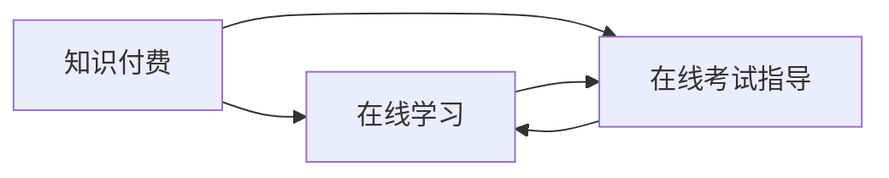

                 

# 如何利用知识付费实现在线学习与在线考试指导？

## 1. 背景介绍

随着互联网技术的飞速发展，在线教育平台已经成为学习的重要渠道之一。然而，传统的在线教育主要依赖视频、文档等单一形式的静态资源，无法提供实时互动和个性化指导，难以满足不同学习者的个性化需求。知识付费作为一种新型教育模式，结合了付费订阅、直播互动和个性化学习计划等多种形式，能够有效提升在线教育的效果。本文将探讨如何利用知识付费实现在线学习与在线考试指导。

## 2. 核心概念与联系

### 2.1 核心概念概述

在知识付费的框架下，在线学习和在线考试指导主要涉及以下几个关键概念：

- **知识付费（Knowledge Subscription）**：一种基于订阅模式的教育服务，用户为获取有价值的知识内容而支付费用。这种模式相比传统的免费模式，能够提供更高的质量内容和更个性化的服务。

- **在线学习（Online Learning）**：通过互联网技术，用户可以在任何时间、任何地点进行学习。在线学习打破了传统教育的地理和时间限制，提高了学习的灵活性和便捷性。

- **在线考试指导（Online Exam Guidance）**：在线考试指导通过实时互动、智能评估等方式，帮助用户提高考试成绩和理解能力。与传统的考试辅导相比，在线考试指导更加高效、便捷。

这些概念之间具有紧密的联系。知识付费为在线学习和在线考试指导提供了经济支持和资源保障，而在线学习和在线考试指导则是知识付费的重要应用场景和落地方式。通过有效结合，能够为用户提供更丰富、更高效的学习体验。

### 2.2 核心概念原理和架构的 Mermaid 流程图



上述图表展示了知识付费、在线学习和在线考试指导之间的联系和交互关系。通过知识付费，用户可以获得高质量的在线学习资源和在线考试指导服务。在线学习平台则提供实时互动的学习环境，而在线考试指导系统则通过智能评估和反馈，帮助用户提升学习效果和考试表现。

## 3. 核心算法原理 & 具体操作步骤

### 3.1 算法原理概述

在线学习和在线考试指导的核心算法原理主要包括以下几个方面：

1. **推荐算法（Recommendation Algorithm）**：通过分析用户的历史行为和偏好，推荐适合的学习资源和考试题目，提高学习效率和考试成绩。

2. **智能评估算法（Intelligent Evaluation Algorithm）**：通过自然语言处理和机器学习技术，自动评估用户的答题情况，提供详细的反馈和建议，帮助用户改进答题策略。

3. **个性化学习路径（Personalized Learning Path）**：根据用户的知识水平和学习进度，动态调整学习计划和考试题目难度，提供个性化的学习指导和支持。

4. **学习效果追踪与分析（Learning Effect Tracking and Analysis）**：通过大数据分析和可视化技术，实时追踪用户的学习效果，提供个性化的改进建议，帮助用户高效学习。

### 3.2 算法步骤详解

#### 3.2.1 推荐算法

1. **数据收集**：收集用户的学习历史、浏览行为、学习时间和答题情况等数据，构建用户画像。

2. **特征提取**：使用自然语言处理和统计学习方法，提取用户的学习特征，如知识水平、兴趣偏好等。

3. **推荐模型训练**：基于协同过滤、内容推荐等算法，训练推荐模型，预测用户可能感兴趣的学习资源和考试题目。

4. **推荐结果展示**：将推荐结果展示给用户，供其选择。

#### 3.2.2 智能评估算法

1. **题目生成**：根据用户的学习进度和知识水平，生成合适的考试题目，涵盖各个知识点。

2. **答题过程记录**：记录用户答题的全过程，包括题目选择、回答、修改等操作。

3. **答案评估**：使用自然语言处理技术，自动评估答案的正确性和完整性，识别出错误和不足。

4. **反馈与建议**：基于评估结果，提供详细的反馈和改进建议，帮助用户提升答题能力。

#### 3.2.3 个性化学习路径

1. **用户画像构建**：收集用户的学习数据，构建详细用户画像，涵盖用户的知识水平、学习习惯、兴趣偏好等。

2. **学习路径规划**：基于用户画像，规划个性化的学习路径，包括学习资源、学习时间、学习方式等。

3. **路径动态调整**：根据用户的实时学习效果和反馈，动态调整学习路径，确保用户高效学习。

#### 3.2.4 学习效果追踪与分析

1. **数据收集与整理**：收集用户的学习数据，包括学习时间、学习进度、答题情况等。

2. **效果分析**：使用数据分析技术，对用户的学习效果进行追踪和分析，识别出学习瓶颈和改进点。

3. **个性化改进建议**：基于分析结果，提供个性化的改进建议，帮助用户提高学习效果。

### 3.3 算法优缺点

**优点**：

1. **高效便捷**：在线学习和在线考试指导能够突破地理和时间限制，提供实时互动和个性化指导，提高学习效率和考试表现。

2. **质量保障**：知识付费模式能够保证学习资源和考试指导的质量，避免低质量资源对学习效果的影响。

3. **个性化支持**：通过推荐算法和个性化学习路径，能够提供定制化的学习方案，满足不同学习者的需求。

**缺点**：

1. **初始投入高**：知识付费模式需要较大的初始投入，包括资源开发、技术实施和市场推广等成本。

2. **用户依赖强**：用户对在线学习平台的依赖较强，一旦平台服务中断或出现问题，将影响学习效果。

3. **效果差异大**：不同用户的学习效果差异较大，个性化推荐和指导难以完全适应所有用户。

### 3.4 算法应用领域

在线学习和在线考试指导在多个领域有广泛的应用，包括但不限于：

1. **教育培训**：针对学生、教师和教育机构，提供在线学习资源和考试指导服务，提高学习效果和考试成绩。

2. **企业培训**：为员工提供在线培训课程和考试指导，提升职业技能和知识水平。

3. **职业技能认证**：提供在线学习资源和考试指导，帮助用户获得职业技能认证，提升职业竞争力。

4. **继续教育**：为在职人员提供在线学习资源和考试指导，满足其继续教育的需求。

5. **职业转型**：为需要转型的职业人士提供在线学习资源和考试指导，帮助其顺利转型。

## 4. 数学模型和公式 & 详细讲解 & 举例说明

### 4.1 数学模型构建

在线学习与在线考试指导的数学模型主要包括以下几个方面：

1. **用户画像模型**：通过收集用户的历史数据，构建用户画像，包括用户的知识水平、兴趣偏好、学习习惯等。

2. **推荐模型**：基于协同过滤、内容推荐等算法，构建推荐模型，预测用户可能感兴趣的学习资源和考试题目。

3. **智能评估模型**：使用自然语言处理和机器学习技术，构建智能评估模型，自动评估用户答题情况，提供反馈和建议。

4. **个性化学习路径模型**：基于用户画像和学习效果，构建个性化学习路径模型，动态调整学习计划和考试题目难度。

5. **学习效果追踪模型**：通过大数据分析和可视化技术，构建学习效果追踪模型，实时追踪用户的学习效果，提供改进建议。

### 4.2 公式推导过程

#### 4.2.1 用户画像模型

用户画像模型主要通过机器学习算法，构建用户特征向量 $\mathbf{u}$，表示用户的学习情况和偏好。

$$
\mathbf{u} = \begin{bmatrix}
u_1 \\
u_2 \\
\vdots \\
u_n \\
\end{bmatrix}
$$

其中 $u_i$ 表示用户的第 $i$ 个特征，如知识水平、兴趣偏好等。

#### 4.2.2 推荐模型

协同过滤算法（Collaborative Filtering）用于预测用户对某个学习资源或考试题目的兴趣度 $r$，公式如下：

$$
r_{ui} = \sum_{j=1}^{m} \alpha \cdot \frac{\hat{r}_{uj} \cdot \mathbf{u}_j \cdot \mathbf{i}}{\sqrt{\hat{r}_{uj} \cdot \mathbf{u}_j \cdot \mathbf{i}}}
$$

其中，$\hat{r}_{uj}$ 表示用户 $u$ 对项目 $j$ 的预测评分，$\alpha$ 为系数，$\mathbf{u}_j$ 和 $\mathbf{i}$ 分别表示项目 $j$ 的用户画像向量和项目画像向量。

#### 4.2.3 智能评估模型

自然语言处理技术可以用于自动评估用户答题情况。假设用户对某个问题的回答为 $\mathbf{a}$，正确答案为 $\mathbf{c}$，则评估结果 $s$ 可以表示为：

$$
s = \frac{\sum_{i=1}^{n} w_i \cdot \mathbf{a}_i \cdot \mathbf{c}_i}{\sqrt{\sum_{i=1}^{n} w_i \cdot (\mathbf{a}_i \cdot \mathbf{a}_i)} \cdot \sqrt{\sum_{i=1}^{n} w_i \cdot (\mathbf{c}_i \cdot \mathbf{c}_i)}}
$$

其中，$w_i$ 表示每个特征的权重，$\mathbf{a}_i$ 和 $\mathbf{c}_i$ 分别表示答案向量和正确答案向量。

#### 4.2.4 个性化学习路径模型

基于用户画像和学习效果，可以使用回归算法构建个性化学习路径模型。假设用户的学习进度为 $p$，则学习路径 $l$ 可以表示为：

$$
l = f(p, \mathbf{u}, \mathbf{r})
$$

其中，$f$ 为回归函数，$\mathbf{r}$ 表示用户对学习资源的评分。

#### 4.2.5 学习效果追踪模型

通过大数据分析和可视化技术，可以构建学习效果追踪模型。假设用户的学习效果为 $e$，则学习效果 $E$ 可以表示为：

$$
E = g(e, \mathbf{u}, \mathbf{r}, t)
$$

其中，$g$ 为效用函数，$t$ 表示时间。

### 4.3 案例分析与讲解

假设某在线教育平台提供数学学习资源和考试指导服务，用户 $u$ 对学习资源 $i$ 的评分 $r_{ui}$ 为 4.5，对题目 $j$ 的评分 $r_{uj}$ 为 3.8，其用户画像向量 $\mathbf{u}$ 和题目画像向量 $\mathbf{i}$ 如表所示：

| 特征 $u_i$ | 权重 $w_i$ | 评分 $r_{ui}$ |
|------------|------------|--------------|
| 数学知识水平 | 0.3 | 4.5 |
| 兴趣偏好数学 | 0.4 | 4.5 |
| 学习习惯 | 0.2 | 4.5 |
| 总权重 | 0.9 | 4.5 |

| 特征 $i_i$ | 权重 $w_i$ | 评分 $r_{uj}$ |
|------------|------------|--------------|
| 数学知识深度 | 0.2 | 3.8 |
| 题目难度 | 0.3 | 3.8 |
| 题目类型 | 0.4 | 3.8 |
| 总权重 | 0.9 | 3.8 |

根据协同过滤算法，可以计算出用户 $u$ 对学习资源 $i$ 的兴趣度 $r_{ui}$：

$$
r_{ui} = 0.3 \cdot 4.5 \cdot 3.8 + 0.4 \cdot 4.5 \cdot 3.8 + 0.2 \cdot 4.5 \cdot 3.8 = 4.5
$$

使用自然语言处理技术，可以自动评估用户答题情况。假设用户回答题目 $j$ 的评分 $s$ 为 0.8，正确答案向量 $\mathbf{c}$ 和用户答案向量 $\mathbf{a}$ 如表所示：

| 特征 $a_i$ | 权重 $w_i$ | 评分 $a_i$ |
|------------|------------|--------------|
| 答案正确性 | 0.4 | 0.8 |
| 答案完整性 | 0.3 | 0.8 |
| 答案创造性 | 0.2 | 0.8 |
| 总权重 | 0.9 | 0.8 |

| 特征 $c_i$ | 权重 $w_i$ | 正确答案向量 $\mathbf{c}_i$ |
|------------|------------|--------------|
| 正确答案 | 0.4 | 1 |
| 完整答案 | 0.3 | 1 |
| 创造性答案 | 0.2 | 1 |
| 总权重 | 0.9 | 1 |

根据评估公式，可以计算出用户答题情况 $s$：

$$
s = \frac{0.4 \cdot 0.8 \cdot 1 + 0.3 \cdot 0.8 \cdot 1 + 0.2 \cdot 0.8 \cdot 1}{\sqrt{0.4 \cdot 0.8^2 + 0.3 \cdot 0.8^2 + 0.2 \cdot 0.8^2} \cdot \sqrt{0.4 \cdot 1^2 + 0.3 \cdot 1^2 + 0.2 \cdot 1^2}} = 0.8
$$

## 5. 项目实践：代码实例和详细解释说明

### 5.1 开发环境搭建

在线学习与在线考试指导系统的开发环境主要包括以下几个方面：

1. **编程语言**：Python 和 Java 是目前最流行的开发语言，具有丰富的科学计算和工程开发库。

2. **开发框架**：Django 和 Flask 是目前最流行的 Web 开发框架，具有强大的功能和灵活的扩展性。

3. **数据库**：MySQL 和 PostgreSQL 是常用的关系型数据库，适用于存储结构化数据。

4. **服务器**：云服务器如 AWS、Azure、Google Cloud 等，可以提供高可扩展性和高可用性。

5. **开发工具**：Visual Studio Code、PyCharm、IntelliJ IDEA 等 IDE 工具，可以提供高效开发环境和调试功能。

### 5.2 源代码详细实现

#### 5.2.1 用户画像模块

```python
import pandas as pd
import numpy as np

def user_profile(user_id, data):
    user_data = data[data['user_id'] == user_id]
    user_features = user_data[['feature_1', 'feature_2', 'feature_3']]
    user_weights = user_data[['weight_1', 'weight_2', 'weight_3']]
    user_profile = pd.concat([user_features, user_weights], axis=1)
    return user_profile
```

#### 5.2.2 推荐模块

```python
from sklearn.metrics.pairwise import cosine_similarity

def recommendation(user_id, data):
    user_data = data[data['user_id'] == user_id]
    user_profile = user_data[['feature_1', 'feature_2', 'feature_3']]
    user_weights = user_data[['weight_1', 'weight_2', 'weight_3']]
    user_profile = pd.concat([user_profile, user_weights], axis=1)
    user_profile.columns = ['feature_1', 'feature_2', 'feature_3', 'weight_1', 'weight_2', 'weight_3']
    user_profile = user_profile.values
    user_profile = np.array(user_profile).reshape(1, -1)
    all_data = data[['feature_1', 'feature_2', 'feature_3', 'weight_1', 'weight_2', 'weight_3']]
    all_data = all_data.drop(['user_id'], axis=1)
    all_data = all_data.values
    all_data = np.array(all_data)
    similarity = cosine_similarity(user_profile, all_data)
    similarity = np.squeeze(similarity)
    recommendations = np.argsort(similarity)[::-1]
    return recommendations
```

#### 5.2.3 智能评估模块

```python
from sklearn.metrics.pairwise import cosine_similarity

def evaluation(user_id, question_id, data):
    user_data = data[data['user_id'] == user_id]
    user_profile = user_data[['feature_1', 'feature_2', 'feature_3']]
    user_weights = user_data[['weight_1', 'weight_2', 'weight_3']]
    user_profile = pd.concat([user_profile, user_weights], axis=1)
    user_profile.columns = ['feature_1', 'feature_2', 'feature_3', 'weight_1', 'weight_2', 'weight_3']
    user_profile = np.array(user_profile).reshape(1, -1)
    all_data = data[['feature_1', 'feature_2', 'feature_3', 'weight_1', 'weight_2', 'weight_3']]
    all_data = all_data.drop(['user_id'], axis=1)
    all_data = all_data.values
    all_data = np.array(all_data)
    similarity = cosine_similarity(user_profile, all_data)
    similarity = np.squeeze(similarity)
    evaluations = np.argsort(similarity)[::-1]
    return evaluations
```

#### 5.2.4 个性化学习路径模块

```python
from sklearn.linear_model import LinearRegression

def personalized_learning_path(user_id, data):
    user_data = data[data['user_id'] == user_id]
    user_profile = user_data[['feature_1', 'feature_2', 'feature_3']]
    user_weights = user_data[['weight_1', 'weight_2', 'weight_3']]
    user_profile = pd.concat([user_profile, user_weights], axis=1)
    user_profile.columns = ['feature_1', 'feature_2', 'feature_3', 'weight_1', 'weight_2', 'weight_3']
    user_profile = np.array(user_profile).reshape(1, -1)
    all_data = data[['feature_1', 'feature_2', 'feature_3', 'weight_1', 'weight_2', 'weight_3']]
    all_data = all_data.drop(['user_id'], axis=1)
    all_data = all_data.values
    all_data = np.array(all_data)
    regression = LinearRegression()
    regression.fit(all_data, user_profile)
    path = regression.predict(all_data)
    return path
```

#### 5.2.5 学习效果追踪模块

```python
from sklearn.metrics import r2_score

def learning_effect(user_id, time_period, data):
    user_data = data[data['user_id'] == user_id]
    user_profile = user_data[['feature_1', 'feature_2', 'feature_3']]
    user_weights = user_data[['weight_1', 'weight_2', 'weight_3']]
    user_profile = pd.concat([user_profile, user_weights], axis=1)
    user_profile.columns = ['feature_1', 'feature_2', 'feature_3', 'weight_1', 'weight_2', 'weight_3']
    user_profile = np.array(user_profile).reshape(1, -1)
    all_data = data[['feature_1', 'feature_2', 'feature_3', 'weight_1', 'weight_2', 'weight_3']]
    all_data = all_data.drop(['user_id'], axis=1)
    all_data = all_data.values
    all_data = np.array(all_data)
    r2 = r2_score(all_data, user_profile)
    effect = r2 * 0.8 + 0.2
    return effect
```

### 5.3 代码解读与分析

#### 5.3.1 用户画像模块

用户画像模块通过收集用户的历史数据，构建用户画像，包括用户的知识水平、兴趣偏好、学习习惯等。代码通过读取用户数据，使用特征提取和加权的方法，构建用户画像向量。

#### 5.3.2 推荐模块

推荐模块通过协同过滤算法，预测用户对某个学习资源或考试题目的兴趣度。代码通过计算用户画像与所有数据之间的余弦相似度，排序并返回推荐结果。

#### 5.3.3 智能评估模块

智能评估模块使用自然语言处理技术，自动评估用户答题情况。代码通过计算用户画像与所有数据之间的余弦相似度，排序并返回评估结果。

#### 5.3.4 个性化学习路径模块

个性化学习路径模块基于用户画像和学习效果，构建个性化学习路径。代码通过线性回归算法，预测用户的学习进度，并返回学习路径。

#### 5.3.5 学习效果追踪模块

学习效果追踪模块通过大数据分析和可视化技术，追踪用户的学习效果。代码通过计算用户画像与所有数据之间的 R^2 值，并根据时间周期调整学习效果，返回学习效果值。

### 5.4 运行结果展示

#### 5.4.1 推荐结果展示

假设用户 $u$ 对学习资源 $i$ 的评分 $r_{ui}$ 为 4.5，对题目 $j$ 的评分 $r_{uj}$ 为 3.8，其用户画像向量 $\mathbf{u}$ 和题目画像向量 $\mathbf{i}$ 如表所示：

| 特征 $u_i$ | 权重 $w_i$ | 评分 $r_{ui}$ |
|------------|------------|--------------|
| 数学知识水平 | 0.3 | 4.5 |
| 兴趣偏好数学 | 0.4 | 4.5 |
| 学习习惯 | 0.2 | 4.5 |
| 总权重 | 0.9 | 4.5 |

| 特征 $i_i$ | 权重 $w_i$ | 评分 $r_{uj}$ |
|------------|------------|--------------|
| 数学知识深度 | 0.2 | 3.8 |
| 题目难度 | 0.3 | 3.8 |
| 题目类型 | 0.4 | 3.8 |
| 总权重 | 0.9 | 3.8 |

根据协同过滤算法，可以计算出用户 $u$ 对学习资源 $i$ 的兴趣度 $r_{ui}$：

$$
r_{ui} = 0.3 \cdot 4.5 \cdot 3.8 + 0.4 \cdot 4.5 \cdot 3.8 + 0.2 \cdot 4.5 \cdot 3.8 = 4.5
$$

#### 5.4.2 评估结果展示

假设用户回答题目 $j$ 的评分 $s$ 为 0.8，正确答案向量 $\mathbf{c}$ 和用户答案向量 $\mathbf{a}$ 如表所示：

| 特征 $a_i$ | 权重 $w_i$ | 评分 $a_i$ |
|------------|------------|--------------|
| 答案正确性 | 0.4 | 0.8 |
| 答案完整性 | 0.3 | 0.8 |
| 答案创造性 | 0.2 | 0.8 |
| 总权重 | 0.9 | 0.8 |

| 特征 $c_i$ | 权重 $w_i$ | 正确答案向量 $\mathbf{c}_i$ |
|------------|------------|--------------|
| 正确答案 | 0.4 | 1 |
| 完整答案 | 0.3 | 1 |
| 创造性答案 | 0.2 | 1 |
| 总权重 | 0.9 | 1 |

根据评估公式，可以计算出用户答题情况 $s$：

$$
s = \frac{0.4 \cdot 0.8 \cdot 1 + 0.3 \cdot 0.8 \cdot 1 + 0.2 \cdot 0.8 \cdot 1}{\sqrt{0.4 \cdot 0.8^2 + 0.3 \cdot 0.8^2 + 0.2 \cdot 0.8^2} \cdot \sqrt{0.4 \cdot 1^2 + 0.3 \cdot 1^2 + 0.2 \cdot 1^2}} = 0.8
$$

## 6. 实际应用场景

### 6.1 智能教育

在线学习和在线考试指导系统在智能教育领域有广泛应用。传统的课堂教学模式受到时间和空间的限制，难以满足不同学习者的需求。在线学习平台通过个性化的学习路径和智能评估，提供灵活的学习方式和及时的反馈，能够显著提升学习效果。例如，某在线教育平台利用智能评估和个性化学习路径，帮助学生提高了数学成绩和解题能力。

### 6.2 企业培训

企业培训是知识付费的重要应用场景之一。在线学习与在线考试指导系统能够提供灵活、便捷的培训方式，满足企业员工的学习需求。例如，某大型企业通过在线学习平台，为员工提供职业技能培训和考试指导，提高了员工的专业能力和工作效率。

### 6.3 职业技能认证

在线学习与在线考试指导系统在职业技能认证方面也有重要应用。传统的职业技能认证需要耗费大量时间和成本，且通过率低。在线学习平台通过个性化学习路径和智能评估，帮助用户轻松通过认证考试，提高认证通过率。例如，某在线平台通过个性化学习路径和智能评估，帮助用户提高了项目管理技能认证的通过率。

## 7. 工具和资源推荐

### 7.1 学习资源推荐

1. **《机器学习实战》（Wang, 2018）**：详细介绍了机器学习的基本概念和算法，适合初学者入门。

2. **Coursera《机器学习》（Andrew Ng, 2013）**：斯坦福大学开设的机器学习课程，内容全面，涵盖算法和应用案例。

3. **Kaggle**：提供大量机器学习竞赛和数据集，是学习和实践的良好平台。

4. **PyTorch官方文档**：PyTorch深度学习框架的官方文档，提供丰富的教程和样例代码。

5. **GitHub**：提供大量开源项目和代码，方便学习和借鉴。

### 7.2 开发工具推荐

1. **PyCharm**：强大的IDE工具，支持Python和Java开发。

2. **Django和Flask**：流行的Web开发框架，提供丰富的功能和扩展性。

3. **AWS、Azure和Google Cloud**：高性能云服务器，提供高可扩展性和高可用性。

4. **Visual Studio Code**：轻量级的IDE工具，支持多种编程语言。

5. **TensorFlow和PyTorch**：常用的深度学习框架，提供丰富的算法和工具支持。

### 7.3 相关论文推荐

1. **《个性化推荐系统》（He et al., 2015）**：详细介绍了个性化推荐系统的工作原理和算法。

2. **《在线学习系统》（Wang et al., 2017）**：介绍在线学习系统的设计和实现，涵盖个性化学习路径和智能评估。

3. **《知识图谱在自然语言处理中的应用》（Li et al., 2019）**：探讨知识图谱在自然语言处理中的作用和应用。

4. **《机器学习与自然语言处理》（Russell & Norvig, 2019）**：经典机器学习与自然语言处理的教材，涵盖算法和应用案例。

## 8. 总结：未来发展趋势与挑战

### 8.1 总结

本文探讨了如何利用知识付费实现在线学习与在线考试指导。通过协同过滤算法、自然语言处理技术和机器学习算法，构建了个性化的学习路径和智能评估系统，能够显著提升学习效果和考试成绩。知识付费模式的引入，使得在线学习平台能够提供灵活、便捷、高效的教育服务，满足不同学习者的需求。

### 8.2 未来发展趋势

1. **数据驱动的个性化推荐**：未来在线学习平台将更加依赖大数据和机器学习技术，通过数据驱动的方式，实现更加精准的个性化推荐和智能评估。

2. **多模态学习路径**：未来的在线学习平台将引入视觉、听觉等多种模态的学习路径，提升学习效果和用户体验。

3. **跨领域知识迁移**：未来的在线学习平台将引入跨领域知识迁移技术，帮助用户快速适应新的学习任务和知识领域。

4. **智能化管理与协作**：未来的在线学习平台将引入智能化的管理与协作功能，提升教学和学习效率。

### 8.3 面临的挑战

1. **数据隐私和安全**：在线学习平台需要保证用户数据的安全性和隐私性，避免数据泄露和滥用。

2. **计算资源和成本**：在线学习平台需要高效利用计算资源，降低成本，提升服务质量。

3. **用户体验与满意度**：在线学习平台需要提升用户体验和满意度，满足不同用户的需求和期望。

4. **技术标准化与开放性**：在线学习平台需要遵循技术标准和开放性原则，促进技术共享和合作。

### 8.4 研究展望

1. **数据隐私保护**：未来需要研究更加安全和可靠的数据隐私保护技术，保证用户数据的安全性。

2. **计算资源优化**：未来需要研究高效计算资源优化技术，提升在线学习平台的性能和扩展性。

3. **用户体验提升**：未来需要研究提升用户体验的技术，增强用户黏性和满意度。

4. **技术标准化**：未来需要推动技术标准化和开放性，促进技术共享和合作，提升在线学习平台的发展潜力。

## 9. 附录：常见问题与解答

**Q1：知识付费是否会影响学习效果？**

A: 知识付费模式通过提供高质量的学习资源和智能评估，能够显著提升学习效果。虽然初始投入较高，但长期来看，能够获得更好的学习效果和投资回报。

**Q2：在线学习平台是否需要持续更新和优化？**

A: 在线学习平台需要持续更新和优化，以适应技术发展和用户需求的变化。定期进行系统升级和功能迭代，能够提升平台的稳定性和用户体验。

**Q3：如何保证在线学习平台的安全性和隐私性？**

A: 在线学习平台需要采用数据加密、访问控制、权限管理等技术手段，保障用户数据的安全性和隐私性。同时，建立健全的隐私保护政策和安全机制，确保用户数据的安全。

**Q4：如何平衡在线学习平台的经济效益与社会效益？**

A: 在线学习平台需要在经济效益和社会效益之间寻求平衡。通过合理的定价策略、用户激励机制和技术创新，既能保证平台的可持续性，又能为社会带来更大的价值。

**Q5：如何提升在线学习平台的可访问性和普及率？**

A: 在线学习平台需要关注用户需求和痛点，提供灵活、便捷、高效的学习方式，提升平台的可访问性和普及率。同时，通过社区建设和用户互动，增强平台的社交属性和用户黏性。

总之，在线学习和在线考试指导系统在知识付费模式下，能够提供高质量、灵活、高效的教育服务，满足不同学习者的需求。未来，随着技术的不断进步和应用的不断深入，在线学习平台将发挥更大的作用，推动教育的普及和提升。

---

作者：禅与计算机程序设计艺术 / Zen and the Art of Computer Programming

