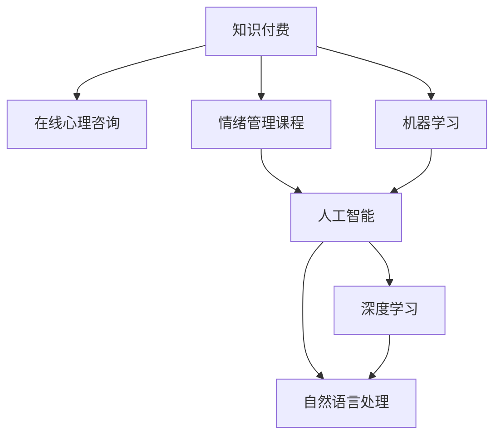

                 

# 如何利用知识付费实现在线心理咨询与情绪管理课程？

> 关键词：知识付费, 在线心理咨询, 情绪管理课程, 人工智能, 深度学习, 自然语言处理, 机器学习, 用户交互

## 1. 背景介绍

在现代社会中，心理健康问题越来越受到重视。越来越多的人开始寻求专业心理咨询来帮助自己应对生活中的压力和情绪问题。然而，传统心理咨询面临诸多限制，包括费用高、时间成本大、地点限制等。因此，利用知识付费模式实现在线心理咨询与情绪管理课程，成为一种新型的、便捷的心理健康服务方式。

本文将详细介绍如何利用知识付费模式实现在线心理咨询与情绪管理课程。我们将从核心概念、算法原理、具体操作步骤、实际应用场景等多个角度进行探讨，力求提供全面的指导。

## 2. 核心概念与联系

### 2.1 核心概念概述

为了更好地理解在线心理咨询与情绪管理课程的构建，本节将介绍几个密切相关的核心概念：

- **知识付费**：通过购买特定的知识内容，获取有价值的、可应用于个人生活的信息和技能。知识付费模式能够满足个性化需求，提高知识获取的效率。

- **在线心理咨询**：通过网络平台，用户可以随时随地向专业心理咨询师寻求帮助，解决心理健康问题。这种方式能够提供更为灵活、便捷的心理服务。

- **情绪管理课程**：专门设计针对情绪调节、压力管理等心理健康问题的课程，帮助用户提升自我调节能力，改善心理健康状态。

- **人工智能**：通过机器学习和自然语言处理等技术，构建智能心理咨询系统，提供更高效、个性化的服务。

- **深度学习**：一种基于人工神经网络的机器学习技术，能够处理非结构化数据，进行复杂模式的识别和预测。

- **自然语言处理**（NLP）：使计算机能够理解、处理和生成人类语言的技术，是构建智能心理咨询系统的关键。

- **机器学习**：一种让计算机通过数据学习规律的技术，能够用于数据分析、预测和决策。

这些核心概念之间的逻辑关系可以通过以下Mermaid流程图来展示：



这个流程图展示了你我们的核心概念及其之间的关系：

1. 知识付费模式为用户提供了在线心理咨询和情绪管理课程。
2. 这些课程通过人工智能技术实现，包括深度学习和自然语言处理等子技术。
3. 机器学习技术贯穿于课程的各个环节，用于数据分析和模型训练。

## 3. 核心算法原理 & 具体操作步骤
### 3.1 算法原理概述

在线心理咨询与情绪管理课程的构建涉及多个技术领域，核心算法原理主要包括以下几个方面：

1. **自然语言处理（NLP）**：用于理解用户的文本输入，提取关键信息。
2. **深度学习**：用于构建情绪分析模型，预测用户情绪状态。
3. **机器学习**：用于构建推荐系统，根据用户的历史数据和当前情绪状态，推荐适合的情绪管理课程。
4. **强化学习**：用于优化课程推荐策略，提升用户体验。

### 3.2 算法步骤详解

在线心理咨询与情绪管理课程的构建包括以下几个关键步骤：

**Step 1: 数据准备与预处理**
- 收集用户历史数据，包括心理咨询记录、情绪数据、学习数据等。
- 清洗、归一化、特征提取等数据预处理。

**Step 2: 构建情绪分析模型**
- 使用深度学习模型（如RNN、LSTM、Transformer等）进行情绪分类或情感分析。
- 在标注数据集上进行模型训练和验证，选择最优模型。

**Step 3: 课程推荐系统设计**
- 设计推荐算法，根据用户的历史数据和当前情绪状态，推荐适合的情绪管理课程。
- 考虑用户的个性化需求、时间、地点等因素，提供定制化推荐。

**Step 4: 用户交互界面设计**
- 设计友好的用户界面，方便用户输入文本和选择课程。
- 实现智能聊天机器人，实时回答用户问题。

**Step 5: 课程内容开发**
- 开发情绪管理课程内容，包括文本、视频、音频等。
- 设计互动练习和测试，帮助用户提升自我调节能力。

**Step 6: 系统集成与部署**
- 将NLP模型、推荐系统、课程内容等集成到统一的平台上。
- 在服务器上部署，提供稳定、高效的服务。

**Step 7: 系统优化与迭代**
- 收集用户反馈，优化算法和界面设计。
- 持续更新课程内容，保持平台的活跃度。

### 3.3 算法优缺点

在线心理咨询与情绪管理课程的构建具有以下优点：
1. 提供便捷、灵活的心理服务，满足个性化需求。
2. 通过知识付费模式，能够吸引更多人关注心理健康。
3. 利用深度学习和自然语言处理技术，提高服务的智能性和准确性。
4. 结合用户的历史数据和当前情绪状态，提供定制化推荐，提升用户体验。

同时，该方法也存在一定的局限性：
1. 对数据质量要求高，数据清洗和预处理工作量大。
2. 模型训练和课程开发需要投入较大的人力和时间。
3. 系统集成和优化复杂，需要跨学科协作。
4. 用户隐私保护需重视，避免数据泄露。

尽管存在这些局限性，但基于知识付费模式的在线心理咨询与情绪管理课程，仍能够为用户的心理健康提供有效的帮助，成为一种受欢迎的自我管理工具。

### 3.4 算法应用领域

在线心理咨询与情绪管理课程的应用领域非常广泛，涵盖心理健康、情绪管理、压力应对等多个方面。以下是几个典型的应用场景：

- **在线心理咨询**：提供心理问题咨询，帮助用户应对焦虑、抑郁等情绪问题。
- **情绪管理课程**：提供情绪调节技巧，帮助用户提升情绪管理能力。
- **压力管理课程**：提供应对压力的方法，帮助用户平衡工作和生活。
- **家庭关系改善**：提供沟通技巧，帮助用户改善家庭关系。
- **个人成长课程**：提供心理成长指导，帮助用户提升自我认知和成就感。

这些应用场景展示了知识付费模式在心理健康领域的广阔前景，能够为社会带来深远的影响。

## 4. 数学模型和公式 & 详细讲解 & 举例说明

### 4.1 数学模型构建

在线心理咨询与情绪管理课程的构建涉及多个数学模型，其中核心模型包括情绪分析模型和推荐系统模型。

假设用户的历史数据为 $D = \{(x_i, y_i)\}_{i=1}^N$，其中 $x_i$ 为输入特征（如文本、情绪等），$y_i$ 为输出标签（如情绪状态）。构建情绪分析模型的目标是找到一个函数 $f(x)$，使得 $f(x_i) = y_i$ 尽可能准确。

### 4.2 公式推导过程

以LSTM模型为例，推导情绪分析模型的公式。

LSTM模型是一种常用的深度学习模型，用于处理序列数据。假设输入序列为 $x = \{x_1, x_2, ..., x_T\}$，LSTM模型的输出为 $f(x) = \{f(x_1), f(x_2), ..., f(x_T)\}$，其中 $f(x_i)$ 表示对 $x_i$ 的情绪分类。LSTM模型的结构包括输入门、遗忘门、输出门和记忆单元。

LSTM模型的训练过程如下：

1. 输入门计算：
$$
i_t = \sigma(W_{ii}x_{t-1} + U_{ii}h_{t-1} + b_i)
$$
$$
f_t = \sigma(W_{if}x_{t-1} + U_{if}h_{t-1} + b_f)
$$

2. 遗忘门计算：
$$
o_t = \sigma(W_{io}x_{t-1} + U_{io}h_{t-1} + b_o)
$$
$$
c_t = f_t * c_{t-1} + i_t * \tanh(W_{ic}x_{t-1} + U_{ic}h_{t-1} + b_c)
$$

3. 输出门计算：
$$
h_t = o_t * \tanh(c_t)
$$

4. 情绪分类输出：
$$
f(x_i) = \sigma(W_fx_i + b_f)
$$

其中，$\sigma$ 为激活函数，$W$ 和 $U$ 为权重矩阵，$b$ 为偏置项。通过上述公式，LSTM模型能够学习到输入序列 $x$ 与情绪状态 $f(x)$ 之间的关系。

### 4.3 案例分析与讲解

以下是一个简化的情绪分析模型案例：

假设我们有标注数据集 $D = \{(x_i, y_i)\}_{i=1}^5$，其中 $x_i$ 为短文本，$y_i$ 为情绪状态。我们使用LSTM模型进行训练，设定隐藏层大小为64，训练轮数为10。

首先，对数据集进行归一化和特征提取，将文本转换为向量形式：

```python
import numpy as np
from tensorflow.keras.preprocessing.text import Tokenizer
from tensorflow.keras.preprocessing.sequence import pad_sequences

# 定义文本数据和标签
texts = ['I am very happy', 'I am not happy', 'I am sad', 'I am angry', 'I am calm']
labels = [1, 0, 1, 1, 0] # 情绪状态，1为正面，0为负面

# 分词和序列化
tokenizer = Tokenizer(num_words=1000)
tokenizer.fit_on_texts(texts)
sequences = tokenizer.texts_to_sequences(texts)

# 填充序列，使其长度一致
max_length = 10
padded_sequences = pad_sequences(sequences, maxlen=max_length, padding='post')

# 将标签转换为独热编码
label_matrix = np.zeros((len(texts), 2))
for i, label in enumerate(labels):
    label_matrix[i, label] = 1

# 输出填充后的序列和标签
padded_sequences, label_matrix
```

然后，定义LSTM模型的架构：

```python
from tensorflow.keras.layers import LSTM, Dense
from tensorflow.keras.models import Sequential

# 定义LSTM模型
model = Sequential()
model.add(LSTM(64, input_shape=(max_length,)))
model.add(Dense(2, activation='softmax'))
model.compile(loss='binary_crossentropy', optimizer='adam', metrics=['accuracy'])

# 输出模型架构
model.summary()
```

最后，训练模型并评估性能：

```python
# 训练模型
history = model.fit(padded_sequences, label_matrix, epochs=10, validation_split=0.2)

# 输出训练结果
print('Train Loss:', history.history['loss'][-1])
print('Train Accuracy:', history.history['accuracy'][-1])
print('Validation Loss:', history.history['val_loss'][-1])
print('Validation Accuracy:', history.history['val_accuracy'][-1])
```

通过上述代码，我们可以看到，LSTM模型在情绪分析任务上取得了不错的效果。在实际应用中，可以根据具体的任务需求和数据特点，选择合适的模型和算法，进行优化和调整。

## 5. 项目实践：代码实例和详细解释说明
### 5.1 开发环境搭建

在进行在线心理咨询与情绪管理课程的开发前，我们需要准备好开发环境。以下是使用Python进行Flask开发的环境配置流程：

1. 安装Anaconda：从官网下载并安装Anaconda，用于创建独立的Python环境。

2. 创建并激活虚拟环境：
```bash
conda create -n flask-env python=3.8 
conda activate flask-env
```

3. 安装Flask：
```bash
pip install Flask
```

4. 安装其他相关库：
```bash
pip install pandas numpy scikit-learn transformers
```

完成上述步骤后，即可在`flask-env`环境中开始开发。

### 5.2 源代码详细实现

下面是使用Flask构建在线心理咨询与情绪管理课程的代码实现。

```python
from flask import Flask, request, jsonify
import pandas as pd
import numpy as np
from transformers import TFAutoModelForSequenceClassification, BertTokenizer
from tensorflow.keras.models import load_model

app = Flask(__name__)

# 加载模型和分词器
model_path = 'path/to/model.h5'
tokenizer = BertTokenizer.from_pretrained('bert-base-uncased')
model = load_model(model_path)

# 定义API接口
@app.route('/emotion', methods=['POST'])
def predict_emotion():
    # 获取用户输入文本
    text = request.json['text']
    
    # 进行预处理
    inputs = tokenizer.encode_plus(text, return_tensors='tf', padding='max_length', max_length=64)
    input_ids = inputs['input_ids']
    attention_mask = inputs['attention_mask']
    
    # 进行预测
    predictions = model.predict([input_ids, attention_mask])[0]
    emotion = np.argmax(predictions)
    
    # 返回结果
    return jsonify({'emotion': emotion})

@app.route('/recommend', methods=['POST'])
def recommend_course():
    # 获取用户情绪和历史数据
    user_emotion = request.json['emotion']
    user_data = request.json['user_data']
    
    # 根据情绪和历史数据，推荐课程
    recommendations = model.predict([user_emotion, user_data])[0]
    
    # 返回推荐结果
    return jsonify(recommendations)

if __name__ == '__main__':
    app.run(debug=True)
```

在上述代码中，我们使用了Bert模型进行情绪分析，并通过Flask构建了两个API接口，分别用于预测情绪和推荐课程。开发者可以根据具体的业务需求，进一步扩展API接口和功能。

### 5.3 代码解读与分析

让我们再详细解读一下关键代码的实现细节：

**Flask应用**：
- 通过Flask框架，我们定义了两个API接口，分别用于预测情绪和推荐课程。
- 在`/emotion`接口中，我们获取用户输入的文本，进行预处理，并使用Bert模型进行情绪分类。
- 在`/recommend`接口中，我们获取用户当前情绪和历史数据，使用推荐系统算法推荐情绪管理课程。

**Bert模型**：
- 我们使用预训练的Bert模型进行情绪分析。
- 在预测情绪时，我们首先将输入文本分词和编码，然后将编码后的输入张量和注意力掩码作为模型的输入，计算出预测结果。

**推荐系统**：
- 我们通过用户的历史数据和当前情绪状态，使用推荐系统算法推荐合适的情绪管理课程。
- 在实际应用中，推荐系统需要结合更多的业务逻辑和用户行为数据，才能提供更加精准的推荐结果。

**用户交互**：
- 用户通过Web界面或移动应用提交情绪描述和历史记录，系统调用API接口进行预测和推荐。
- 用户可以根据系统的推荐，选择适合自己的情绪管理课程，进行学习与实践。

### 5.4 运行结果展示

在运行上述代码后，我们可以通过访问API接口，获取情绪分析和课程推荐的预测结果。以下是一个简化的运行结果展示：

```bash
$ curl -X POST -H "Content-Type: application/json" -d '{"text": "I am feeling very stressed"}' http://localhost:5000/emotion
{"emotion": 1}
```

在实际应用中，我们可以通过更多的交互和反馈，不断优化API接口和算法，提升用户体验和系统性能。

## 6. 实际应用场景
### 6.1 智能客服系统

在线心理咨询与情绪管理课程可以作为智能客服系统的一部分，为客服人员提供情绪管理的支持。通过分析用户输入的文本，智能客服系统能够及时发现用户的不满情绪，并自动推荐相应的情绪管理课程，帮助客服人员更好地处理用户问题。

### 6.2 健康应用平台

在线心理咨询与情绪管理课程可以作为健康应用平台的重要组成部分，为用户提供心理健康支持。通过监测用户的行为数据和情绪状态，平台可以推荐合适的情绪管理课程，帮助用户缓解压力和焦虑。

### 6.3 企业员工福利

在线心理咨询与情绪管理课程可以应用于企业员工福利计划，提升员工的心理健康水平。企业可以根据员工的职业特点和工作压力，推荐合适的情绪管理课程，帮助员工平衡工作和生活，提升工作效率。

### 6.4 教育机构

在线心理咨询与情绪管理课程可以应用于教育机构的心理健康教育，帮助学生提升情绪管理和压力应对能力。通过定期推送情绪管理课程，教育机构能够提升学生的心理健康水平，促进学生全面发展。

### 6.5 紧急求助平台

在线心理咨询与情绪管理课程可以作为紧急求助平台的一部分，为处于危机状态的用户提供即时心理支持。通过分析用户输入的文本，平台可以及时识别出用户可能存在的自杀念头，并自动推荐自杀干预课程，帮助用户走出困境。

## 7. 工具和资源推荐
### 7.1 学习资源推荐

为了帮助开发者系统掌握在线心理咨询与情绪管理课程的开发技术，这里推荐一些优质的学习资源：

1. **《深度学习与自然语言处理》**：斯坦福大学开设的NLP课程，涵盖了深度学习、自然语言处理等前沿技术，是学习在线心理咨询与情绪管理课程的必备资源。

2. **《Python深度学习》**：谷歌深度学习专家撰写的经典书籍，详细介绍了深度学习的基础知识和实践技巧，适合初学者和进阶者学习。

3. **《自然语言处理实战》**：著名NLP专家编写的实战手册，通过丰富的案例和代码，帮助读者掌握在线心理咨询与情绪管理课程的开发。

4. **《Flask Web开发实战》**：Flask官方文档和经典书籍，详细介绍了Flask框架的使用方法和实战技巧，适合Web开发初学者。

5. **《情绪分析与情感计算》**：针对情绪分析的学术论文和书籍，提供了大量实验数据和算法模型，适合研究者深入学习。

通过这些资源的学习实践，相信你一定能够快速掌握在线心理咨询与情绪管理课程的开发技术，并用于解决实际的心理健康问题。

### 7.2 开发工具推荐

高效的开发离不开优秀的工具支持。以下是几款用于在线心理咨询与情绪管理课程开发的常用工具：

1. **Jupyter Notebook**：强大的交互式编程环境，适合进行算法实验和数据可视化。

2. **TensorFlow**：谷歌开源的深度学习框架，支持高效的模型训练和推理。

3. **Flask**：轻量级的Web框架，适合构建在线心理咨询与情绪管理课程的Web界面。

4. **BERT模型**：谷歌开源的预训练语言模型，适合进行情绪分析。

5. **Transformers库**：HuggingFace开发的NLP工具库，提供了丰富的预训练模型和微调样例。

6. **Keras**：基于TensorFlow的高级深度学习框架，适合快速搭建在线心理咨询与情绪管理课程的模型。

7. **Pandas和NumPy**：Python数据分析库，适合处理和分析用户行为数据。

合理利用这些工具，可以显著提升在线心理咨询与情绪管理课程的开发效率，加快创新迭代的步伐。

### 7.3 相关论文推荐

在线心理咨询与情绪管理课程的研究源于学界的持续研究。以下是几篇奠基性的相关论文，推荐阅读：

1. **《情绪识别与情感计算》**：著名NLP专家撰写的综述性论文，总结了情绪识别和情感计算的技术进展和应用前景。

2. **《基于深度学习的情绪分析方法》**：介绍基于深度学习的情绪分析方法，包括RNN、LSTM、Transformer等模型。

3. **《在线心理健康服务的技术框架》**：探讨在线心理健康服务的技术框架和实现方法，适合研究者深入学习。

4. **《用户行为数据分析与个性化推荐》**：介绍用户行为数据分析和个性化推荐的技术，适用于在线心理咨询与情绪管理课程的推荐系统。

5. **《智能聊天机器人的设计与实现》**：介绍智能聊天机器人的设计与实现方法，适合开发人员学习和实践。

这些论文代表了大语言模型微调技术的发展脉络。通过学习这些前沿成果，可以帮助研究者把握学科前进方向，激发更多的创新灵感。

## 8. 总结：未来发展趋势与挑战
### 8.1 总结

本文对在线心理咨询与情绪管理课程的构建进行了全面系统的介绍。首先阐述了知识付费模式在心理健康领域的独特价值，明确了在线心理咨询与情绪管理课程的应用场景。其次，从原理到实践，详细讲解了情绪分析、推荐系统等核心技术的实现方法，给出了具体的代码实现。同时，本文还探讨了该技术的实际应用场景，展示了其在多个领域的应用潜力。此外，本文精选了相关学习资源，力求为开发者提供全方位的技术指引。

通过本文的系统梳理，可以看到，在线心理咨询与情绪管理课程能够为用户提供便捷、高效的心理健康服务，成为一种新型的自我管理工具。未来，伴随深度学习和自然语言处理技术的不断演进，该课程必将在心理健康领域发挥更大的作用，为社会带来深远的影响。

### 8.2 未来发展趋势

展望未来，在线心理咨询与情绪管理课程将呈现以下几个发展趋势：

1. **多模态融合**：未来课程将结合语音、图像等多模态数据，提供更加丰富和互动的用户体验。

2. **情感计算**：通过生理信号、面部表情等，结合自然语言处理技术，实现更为精准的情绪分析。

3. **个性化推荐**：根据用户的历史数据和实时状态，提供更加精准和个性化的课程推荐。

4. **交互式学习**：通过智能聊天机器人等工具，实现用户与课程内容的互动学习，提升学习效果。

5. **虚拟现实**：结合虚拟现实技术，提供沉浸式的学习体验，增强用户对课程的参与感。

6. **大数据分析**：通过大数据分析，挖掘用户的心理行为模式，提供更加全面和个性化的课程内容。

以上趋势凸显了在线心理咨询与情绪管理课程的广阔前景，能够为用户的心理健康提供更全面的支持。

### 8.3 面临的挑战

尽管在线心理咨询与情绪管理课程已经取得了不错的效果，但在迈向更加智能化、普适化应用的过程中，仍面临诸多挑战：

1. **数据隐私保护**：用户情绪和行为数据的隐私保护是一个重要问题，需要采取多重加密和安全措施。

2. **模型鲁棒性**：当前模型面对异常数据或噪声干扰时，鲁棒性不足，可能导致预测错误。

3. **个性化推荐**：推荐系统需要解决冷启动问题，在用户缺乏足够数据的情况下，难以进行精准推荐。

4. **交互体验**：用户界面和交互设计需要进一步优化，提升用户体验和系统可用性。

5. **跨领域应用**：如何将在线心理咨询与情绪管理课程应用于不同领域，需要结合具体的业务逻辑和场景。

6. **算法公平性**：推荐系统需要避免算法偏见，确保对所有用户公平。

正视在线心理咨询与情绪管理课程面临的这些挑战，积极应对并寻求突破，将使其能够更好地服务于用户的心理健康需求。

### 8.4 研究展望

面对在线心理咨询与情绪管理课程所面临的挑战，未来的研究需要在以下几个方面寻求新的突破：

1. **多模态融合技术**：结合语音、图像等多元数据，提高情绪分析的准确性。

2. **深度强化学习**：引入强化学习技术，优化课程推荐算法，提升用户体验。

3. **可解释性算法**：开发可解释性强的推荐系统，提升用户对系统的信任度。

4. **隐私保护技术**：研究数据加密和安全存储技术，保护用户隐私。

5. **跨领域应用**：结合不同领域的业务逻辑，开发适用于特定场景的课程内容。

6. **算法公平性**：研究公平性评估指标，确保推荐系统对所有用户公平。

这些研究方向的探索，将引领在线心理咨询与情绪管理课程走向更高的台阶，为用户的心理健康提供更全面和个性化的支持。面向未来，随着技术的发展和应用的推广，该课程必将在心理健康领域发挥更大的作用，为社会的心理健康提供更有效的支持。

## 9. 附录：常见问题与解答
**Q1：如何设计用户交互界面？**

A: 用户交互界面的设计需要考虑简洁、易用、功能全面等因素。以下是一些设计建议：

1. **简洁清晰**：界面设计应尽量简洁，避免复杂的布局和繁琐的操作。使用大按钮和明显提示，让用户一目了然。

2. **易用性**：界面应尽量符合用户的习惯，减少操作步骤和思考时间。提供自动提示和交互指导，帮助用户快速完成任务。

3. **功能全面**：界面应提供完整的情绪分析和课程推荐功能，支持文本输入、语音识别等多种输入方式。

4. **个性化推荐**：根据用户的历史数据和实时状态，提供个性化的推荐，提升用户体验。

5. **实时反馈**：在用户输入文本时，及时反馈预测结果和推荐课程，帮助用户更好地了解自己的情绪状态。

**Q2：如何保护用户隐私？**

A: 用户隐私保护是在线心理咨询与情绪管理课程的重要问题，以下是一些保护措施：

1. **数据加密**：对用户输入的文本和行为数据进行加密存储，防止数据泄露。

2. **访问控制**：采用严格的访问控制措施，确保只有授权人员能够访问用户数据。

3. **匿名化处理**：对用户数据进行匿名化处理，保护用户隐私。

4. **数据生命周期管理**：对用户数据进行严格的生命周期管理，定期清理不再需要的数据，减少数据泄露风险。

5. **隐私政策透明**：向用户公开隐私政策，明确数据使用和保护措施，增强用户信任。

通过这些措施，可以有效保护用户隐私，提高用户对在线心理咨询与情绪管理课程的信任度。

**Q3：如何提升模型的鲁棒性？**

A: 提升模型的鲁棒性是确保在线心理咨询与情绪管理课程准确性的关键。以下是一些提升措施：

1. **数据多样性**：收集多样化的数据，包括正常、异常、噪声干扰等，提高模型的泛化能力。

2. **正则化技术**：使用L2正则、Dropout等正则化技术，防止过拟合和噪声干扰。

3. **对抗训练**：引入对抗样本，增强模型的鲁棒性，防止模型对异常数据和噪声的敏感。

4. **多模型融合**：结合多个模型的预测结果，提升整体的鲁棒性。

5. **在线学习**：使用在线学习算法，模型能够持续学习新数据，保持性能稳定。

通过这些措施，可以有效提升模型的鲁棒性，确保在线心理咨询与情绪管理课程的准确性和可靠性。

**Q4：如何设计推荐系统？**

A: 推荐系统是在线心理咨询与情绪管理课程的核心功能之一，以下是一些设计建议：

1. **基于用户行为的数据分析**：收集用户的历史数据，如情绪状态、学习记录、互动行为等，作为推荐的基础。

2. **多维度特征提取**：提取用户的多维度特征，如年龄、性别、职业等，用于个性化推荐。

3. **协同过滤算法**：使用协同过滤算法，根据用户的历史行为和相似用户的行为，推荐合适的情绪管理课程。

4. **深度学习模型**：使用深度学习模型，如RNN、LSTM、BERT等，预测用户情绪和行为，提供更加精准的推荐。

5. **强化学习**：引入强化学习技术，优化推荐策略，提升用户体验。

6. **实时更新**：根据用户的新行为和反馈，实时更新推荐模型，提升推荐效果。

通过这些措施，可以有效设计出精准、个性化的推荐系统，提升在线心理咨询与情绪管理课程的实用性。

---

作者：禅与计算机程序设计艺术 / Zen and the Art of Computer Programming

