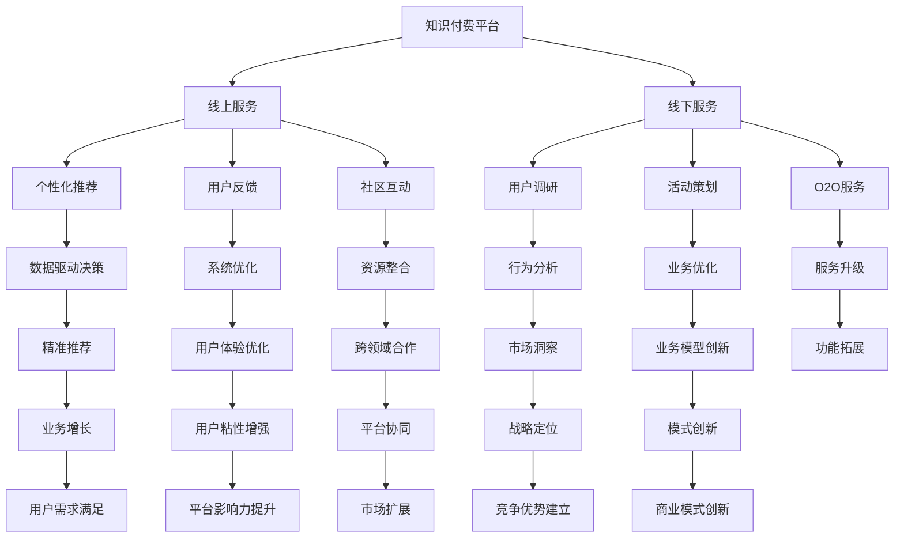

                 

# 如何实现线上知识付费向线下服务延伸

## 1. 背景介绍

### 1.1 问题由来
在移动互联网时代，知识付费模式凭借其快速、便捷、高效的特点，迅速崛起，成为知识传播和分享的重要途径。然而，随着信息泛滥和内容同质化现象的加剧，线上知识付费的边际效益逐渐递减，用户对内容的要求也从“能听”升级到“能懂”和“能用”，这要求知识传播平台必须具备更强的服务能力和更深层次的用户互动。

如何实现线上知识付费服务向线下延伸，实现线上线下的无缝衔接和协同，成为行业内的新需求和新挑战。本文将深入探讨这一问题，提出基于AI和大数据的策略，帮助知识付费平台实现服务升级和创新突破。

### 1.2 问题核心关键点
实现线上知识付费向线下延伸的核心关键点包括：
- 精准定位用户需求，为用户提供个性化、深层次的服务体验。
- 构建线上线下互动机制，提升用户参与度和忠诚度。
- 实现资源整合和协同，推动线上线下服务的一体化。
- 利用AI和大数据技术，进行精准推荐和决策优化。

这些关键点决定了线上知识付费平台向线下延伸的策略和技术路线，具体体现在以下几个方面：

## 2. 核心概念与联系

### 2.1 核心概念概述

为更好地理解线上知识付费向线下延伸的策略，本节将介绍几个密切相关的核心概念：

- **知识付费平台(Knowledge Pay-to-Use Platform, KPUP)**：以提供高质量内容、专业课程、专家讲座等为主要服务内容，面向各类用户提供知识分享和变现的平台。
- **线上服务(Online Service)**：通过互联网平台提供内容分发、互动沟通、个性化推荐等服务。
- **线下服务(Offline Service)**：通过实体店铺、线下活动、O2O服务等方式，提供深入、互动的个性化知识服务。
- **人工智能(Artificial Intelligence, AI)**：利用机器学习、深度学习等技术，进行数据分析、智能推荐、决策优化等。
- **大数据(Big Data)**：通过收集、存储和分析大量数据，发现用户行为规律和偏好，进行精准推荐和营销。
- **互动机制(Interactive Mechanism)**：线上线下结合，提供用户反馈、社区互动、资源共享等功能。

这些核心概念之间的逻辑关系可以通过以下Mermaid流程图来展示：



这个流程图展示了的核心概念及其之间的关系：

1. 知识付费平台通过线上服务分发内容，线下服务提供深度互动。
2. 利用AI和大数据技术，进行个性化推荐和精准决策。
3. 通过互动机制增强用户参与度和忠诚度。
4. 结合线上线下资源，推动服务升级和业务创新。

这些概念共同构成了知识付费平台从线上向线下延伸的框架，为其服务模式转型提供了理论基础。

## 3. 核心算法原理 & 具体操作步骤
### 3.1 算法原理概述

实现线上知识付费向线下延伸，本质上是一个跨域的数据驱动决策过程。其核心思想是：利用AI和大数据技术，收集和分析线上线下的数据，发现用户行为和需求规律，指导平台进行服务优化和资源整合，从而实现线上线下的无缝衔接和协同。

形式化地，假设知识付费平台服务线上用户的数据集为 $D_u=\{(x_i,y_i)\}_{i=1}^N$，其中 $x_i$ 为线上行为数据，如浏览记录、购买记录等，$y_i$ 为标签数据，如课程偏好、购买意愿等。假设线下用户数据集为 $D_o=\{(z_i,t_i)\}_{i=1}^M$，其中 $z_i$ 为线下活动参与记录、服务反馈等，$t_i$ 为标签数据，如用户满意程度、服务评价等。

定义线上线下融合的数据集 $D=\{(x_i,z_i)\}_{i=1}^{N+M}$，其中 $x_i$ 和 $z_i$ 分别对应线上和线下的行为数据。

知识付费平台的目标是：

1. 通过分析 $D_u$ 和 $D_o$，建立线上线下的综合用户画像。
2. 利用用户画像，实现线上内容的精准推荐和线下服务的深度互动。
3. 进行跨域数据融合，优化决策模型，提升整体服务质量和用户满意度。

### 3.2 算法步骤详解

基于上述目标，我们提出以下算法步骤：

**Step 1: 数据收集与预处理**
- 收集线上用户的浏览记录、购买记录、互动信息等行为数据，同时收集线下用户的活动参与记录、服务反馈等数据。
- 对数据进行清洗、去重、归一化等预处理，确保数据质量。

**Step 2: 数据融合与特征工程**
- 将线上和线下数据进行融合，构建综合用户画像。
- 对特征进行工程化处理，如分箱、特征交叉、时间变换等，增强数据的表达能力和区分度。

**Step 3: 用户画像建模**
- 利用机器学习算法，如PCA、K-means等，对用户行为数据进行聚类，发现不同用户群体的行为特征。
- 利用深度学习算法，如GAN、VAE等，对用户画像进行建模，生成高维度的用户表示。

**Step 4: 精准推荐与互动优化**
- 结合用户画像和内容特征，利用协同过滤、深度学习等算法进行个性化推荐。
- 根据用户反馈和互动行为，动态调整推荐算法，优化推荐效果。

**Step 5: 跨域决策优化**
- 利用AI算法，如强化学习、决策树等，构建跨域决策模型，优化服务资源分配。
- 根据模型预测结果，调整线上线下的服务策略和资源配置，提升整体服务质量。

### 3.3 算法优缺点

实现线上知识付费向线下延伸的策略，具有以下优点：
1. 提升用户体验：通过精准推荐和深度互动，提升用户满意度，增强用户忠诚度。
2. 优化服务资源：通过跨域决策优化，实现资源的高效配置和利用，降低服务成本。
3. 促进业务增长：通过线上线下协同，提升整体服务质量和用户粘性，推动业务增长。

同时，该策略也存在一定的局限性：
1. 数据获取难度高：线上线下的数据可能存在分布不均、质量参差不齐等问题，影响数据融合效果。
2. 技术门槛高：需要具备较强的数据处理和算法优化能力，对技术团队的要求较高。
3. 隐私风险：线上线下数据的融合可能涉及用户隐私，需采取严格的隐私保护措施。
4. 模型复杂度：跨域决策模型可能较为复杂，需要大量数据和计算资源进行训练。

尽管存在这些局限性，但就目前而言，该策略仍然是知识付费平台向线下延伸的较为有效手段。未来相关研究的重点在于如何进一步提升数据融合效果，降低技术门槛，确保用户隐私，并优化跨域决策模型。

### 3.4 算法应用领域

基于线上线下数据融合的策略，在知识付费平台中的应用场景包括：

- **个性化推荐**：结合用户画像和内容特征，为每个用户提供个性化的课程推荐。
- **课程定价优化**：根据用户画像和市场行为数据，动态调整课程价格，提升课程销售转化率。
- **活动策划与执行**：通过分析线下用户数据，策划个性化线下活动，提升用户参与度和满意度。
- **服务质量监控**：利用线上线下数据，实时监控服务质量，发现并解决问题，提升整体服务水平。
- **市场营销与推广**：结合线上线下数据，进行精准的市场营销，提升品牌影响力和市场份额。

此外，该策略还可应用于其他垂直行业，如旅游、零售、金融等，帮助企业实现线上线下的一体化运营。

## 4. 数学模型和公式 & 详细讲解 & 举例说明

### 4.1 数学模型构建

本节将使用数学语言对线上线下数据融合的过程进行更加严格的刻画。

假设线上用户行为数据为 $D_u=\{(x_i,y_i)\}_{i=1}^N$，其中 $x_i \in \mathcal{X}_u$，$y_i \in \mathcal{Y}$，$\mathcal{X}_u$ 为线上行为特征空间，$\mathcal{Y}$ 为标签空间。线下用户数据为 $D_o=\{(z_i,t_i)\}_{i=1}^M$，其中 $z_i \in \mathcal{Z}$，$t_i \in \mathcal{T}$，$\mathcal{Z}$ 为线下活动特征空间，$\mathcal{T}$ 为标签空间。

定义综合数据集 $D=\{(x_i,z_i)\}_{i=1}^{N+M}$，其中 $x_i \in \mathcal{X}$，$z_i \in \mathcal{Z}$，$\mathcal{X}=\mathcal{X}_u \times \mathcal{X}_o$，$\mathcal{Z}=\mathcal{Z}_u \times \mathcal{Z}_o$，$\mathcal{X}_o$ 为线下行为特征空间，$\mathcal{Z}_o$ 为线下活动特征空间。

用户画像模型为 $F_u=\{f_u(x_i)\}_{i=1}^N$，线下服务评分模型为 $F_o=\{f_o(z_i)\}_{i=1}^M$，其中 $f_u(x_i)$ 为线上行为数据的表示，$f_o(z_i)$ 为线下活动数据的表示。

**目标函数**：
$$
\min_{\theta} \frac{1}{N+M} \sum_{i=1}^{N+M} \ell(F_u(x_i),y_i) + \ell(F_o(z_i),t_i)
$$

其中 $\ell$ 为损失函数，$F_u(x_i)$ 和 $F_o(z_i)$ 分别为线上线下数据的预测值，$y_i$ 和 $t_i$ 为标签值。

### 4.2 公式推导过程

以下我们以协同过滤算法为例，推导个性化推荐模型的数学表达式。

假设用户 $u$ 对课程 $i$ 的评分 $r_{ui}$ 为 $x_i$ 和 $y_i$ 的函数，即 $r_{ui}=f_u(x_i)+\epsilon_i$，其中 $\epsilon_i$ 为噪声项。设 $N$ 为用户数，$M$ 为课程数。

根据协同过滤算法，用户 $u$ 对未评分课程 $j$ 的预测评分 $r_{uj}$ 为：
$$
r_{uj}=\sum_{i=1}^M a_{ij}f_u(x_i)+\epsilon_j
$$
其中 $a_{ij}$ 为隐式用户行为矩阵，表示用户 $u$ 对课程 $j$ 的兴趣权重。

将 $r_{ui}=f_u(x_i)+\epsilon_i$ 代入上述公式，得：
$$
r_{uj}=\sum_{i=1}^M a_{ij}(f_u(x_i)+\epsilon_i)+\epsilon_j
$$

为了简化公式，定义 $a_{u'}$ 为 $u'$ 用户对 $j$ 课程的评分向量，则有：
$$
r_{uj}=a_j^Tf_u(x)+\epsilon_j
$$
其中 $a_j=a_{1j},a_{2j},...,a_{Mj}$ 为课程 $j$ 的兴趣权重向量，$f_u(x)=f_u(x_1),f_u(x_2),...,f_u(x_N)$ 为 $u$ 用户的兴趣表示向量。

根据上述公式，协同过滤算法可以表示为：
$$
\min_{f_u,a} \frac{1}{2}\sum_{i=1}^N \sum_{j=1}^M (f_u(x_i)+\epsilon_i-r_{ui})^2 + \frac{1}{2}\sum_{i=1}^M \sum_{j=1}^N (a_{ij}-\frac{\sum_{u=1}^N r_{uj}f_u(x_i)}{\sum_{u=1}^N f_u(x_i)})^2
$$

简化得到：
$$
\min_{f_u,a} \frac{1}{2}\sum_{i=1}^N \sum_{j=1}^M (f_u(x_i)-a_j)^2 + \frac{1}{2}\sum_{i=1}^M \sum_{j=1}^N (a_{ij}-a_{ij}')^2
$$

其中 $a_{ij}'$ 为真实用户 $u$ 对课程 $j$ 的评分矩阵。

### 4.3 案例分析与讲解

以某知识付费平台为例，通过数据融合和用户画像建模，实现了个性化推荐和线下服务优化：

1. **数据融合与特征工程**：
   - 平台收集了用户线上浏览、购买、互动数据 $D_u$，以及线下活动参与、服务反馈数据 $D_o$。
   - 对数据进行清洗、归一化、分箱等预处理，构建用户画像。

2. **用户画像建模**：
   - 利用K-means算法对用户行为数据进行聚类，发现不同用户群体的行为特征。
   - 利用VAE模型对用户画像进行建模，生成高维度的用户表示。

3. **个性化推荐**：
   - 将用户画像和内容特征作为输入，使用协同过滤算法进行个性化推荐。
   - 根据用户反馈和互动行为，动态调整算法参数，优化推荐效果。

4. **线下服务优化**：
   - 利用用户画像和线下活动数据，策划个性化线下活动，提升用户参与度和满意度。
   - 根据用户评分和反馈，优化线下服务质量，提升整体服务水平。

通过以上步骤，平台成功实现了线上线下数据的融合，构建了精准的用户画像，提升了个性化推荐和服务质量，实现了从线上到线下的无缝衔接和协同。

## 5. 项目实践：代码实例和详细解释说明
### 5.1 开发环境搭建

在进行项目实践前，我们需要准备好开发环境。以下是使用Python进行PyTorch开发的环境配置流程：

1. 安装Anaconda：从官网下载并安装Anaconda，用于创建独立的Python环境。

2. 创建并激活虚拟环境：
```bash
conda create -n pytorch-env python=3.8 
conda activate pytorch-env
```

3. 安装PyTorch：根据CUDA版本，从官网获取对应的安装命令。例如：
```bash
conda install pytorch torchvision torchaudio cudatoolkit=11.1 -c pytorch -c conda-forge
```

4. 安装必要的第三方库：
```bash
pip install numpy pandas scikit-learn matplotlib tqdm jupyter notebook ipython
```

完成上述步骤后，即可在`pytorch-env`环境中开始项目实践。

### 5.2 源代码详细实现

下面我们以个性化推荐系统为例，给出使用PyTorch进行协同过滤算法的实现。

首先，定义数据处理函数：

```python
import numpy as np
import pandas as pd
from sklearn.model_selection import train_test_split

def load_data(file_path):
    data = pd.read_csv(file_path)
    X = data[['item_id', 'user_id']]
    y = data['rating']
    return X, y
```

然后，定义模型和优化器：

```python
import torch
from torch import nn
from torch.nn import functional as F

class协同过滤(nn.Module):
    def __init__(self, num_users, num_items):
        super(协同过滤, self).__init__()
        self.num_users = num_users
        self.num_items = num_items
        self.user_factors = nn.Parameter(torch.randn(num_users, 10))
        self.item_factors = nn.Parameter(torch.randn(num_items, 10))

    def forward(self, user, item):
        user_embed = self.user_factors[user]
        item_embed = self.item_factors[item]
        return user_embed.dot(item_embed)

model = 协同过滤(num_users=1000, num_items=10000)

optimizer = torch.optim.Adam(model.parameters(), lr=0.01)
```

接着，定义训练和评估函数：

```python
from torch.utils.data import DataLoader
from tqdm import tqdm

def train_epoch(model, data_loader, optimizer):
    model.train()
    total_loss = 0
    for data, target in data_loader:
        optimizer.zero_grad()
        output = model(data)
        loss = F.mse_loss(output, target)
        total_loss += loss.item()
        loss.backward()
        optimizer.step()
    return total_loss / len(data_loader)

def evaluate(model, data_loader):
    model.eval()
    total_loss = 0
    for data, target in data_loader:
        with torch.no_grad():
            output = model(data)
            loss = F.mse_loss(output, target)
            total_loss += loss.item()
    return total_loss / len(data_loader)

# 加载数据并分割训练集和测试集
X_train, X_test, y_train, y_test = train_test_split(X, y, test_size=0.2, random_state=0)
train_data = torch.tensor(X_train.values, dtype=torch.long)
test_data = torch.tensor(X_test.values, dtype=torch.long)
train_labels = torch.tensor(y_train.values, dtype=torch.float)
test_labels = torch.tensor(y_test.values, dtype=torch.float)

# 将数据转换为模型需要的张量格式
train_data = torch.tensor(X_train.values, dtype=torch.long)
test_data = torch.tensor(X_test.values, dtype=torch.long)
train_labels = torch.tensor(y_train.values, dtype=torch.float)
test_labels = torch.tensor(y_test.values, dtype=torch.float)

# 构建数据加载器
train_data_loader = DataLoader(train_data, batch_size=32)
test_data_loader = DataLoader(test_data, batch_size=32)

# 开始训练
epochs = 10
for epoch in range(epochs):
    loss = train_epoch(model, train_data_loader, optimizer)
    print(f"Epoch {epoch+1}, train loss: {loss:.3f}")
    
    print(f"Epoch {epoch+1}, test loss: {evaluate(model, test_data_loader):.3f}")
    
```

以上就是使用PyTorch对协同过滤算法进行个性化推荐系统开发的完整代码实现。可以看到，借助PyTorch的强大功能和模块化设计，协同过滤算法的实现变得相对简单和高效。

### 5.3 代码解读与分析

让我们再详细解读一下关键代码的实现细节：

**load_data函数**：
- 从指定文件中加载数据，并将其转换为训练集和测试集的特征矩阵和标签向量。

**模型定义**：
- 定义协同过滤模型的结构，包括用户和物品的因子向量，并通过点乘操作计算用户对物品的评分预测值。

**训练函数train_epoch**：
- 在每个epoch内，对数据以批为单位进行迭代，前向传播计算损失并反向传播更新模型参数。

**评估函数evaluate**：
- 对模型进行测试，计算平均损失，用于评估模型的泛化性能。

**训练和评估流程**：
- 定义总的epoch数，开始循环迭代
- 每个epoch内，先进行训练，输出平均损失
- 在测试集上评估模型，输出平均损失
- 所有epoch结束后，将训练集和测试集的平均损失输出，帮助调试和优化模型

可以看到，借助PyTorch，协同过滤算法的实现过程变得简洁高效，大大降低了算法开发和调试的难度。

当然，工业级的系统实现还需考虑更多因素，如模型的保存和部署、超参数的自动搜索、更灵活的任务适配层等。但核心的协同过滤算法基本与此类似。

## 6. 实际应用场景
### 6.1 个性化推荐

个性化推荐是知识付费平台的重要应用场景之一。利用协同过滤算法，平台可以分析用户行为数据，发现不同用户群体的兴趣特征，从而为用户推荐个性化的课程。例如：

- 用户在平台上浏览、购买、评价不同课程，系统会根据这些行为数据生成用户画像。
- 当用户浏览新课程时，系统通过协同过滤算法，预测该课程与用户已浏览、购买课程的相似度，推荐相关课程。
- 根据用户反馈和互动行为，动态调整协同过滤算法参数，优化推荐效果。

### 6.2 线下活动策划

知识付费平台还可以通过线下活动策划，增强用户参与度和粘性。利用协同过滤算法，平台可以发现用户的兴趣偏好和活动参与规律，从而设计个性化的线下活动：

- 分析用户的线下活动参与记录、服务反馈等数据，构建用户画像。
- 根据用户画像和课程推荐，策划个性化的线下活动，如课程试听会、专家讲座等。
- 根据用户反馈和互动行为，动态调整活动策划，提升用户参与度和满意度。

### 6.3 课程定价优化

课程定价优化是知识付费平台的重要收入来源之一。利用协同过滤算法，平台可以分析用户行为数据，动态调整课程价格，提升课程销售转化率：

- 分析用户对不同课程的评分和购买记录，发现用户的支付意愿和课程质量偏好。
- 根据用户画像和课程评分，动态调整课程价格，提升用户购买意愿。
- 根据用户反馈和互动行为，动态调整定价策略，优化课程销售效果。

### 6.4 服务质量监控

服务质量监控是知识付费平台的重要保障之一。利用协同过滤算法，平台可以实时监控服务质量，发现并解决问题，提升整体服务水平：

- 分析用户的线上线下行为数据，构建综合用户画像。
- 根据用户画像和课程推荐，实时监控服务质量，发现用户投诉和问题。
- 根据用户反馈和互动行为，动态调整服务策略，提升服务水平。

### 6.5 市场营销与推广

市场营销与推广是知识付费平台的重要支持之一。利用协同过滤算法，平台可以进行精准的市场营销，提升品牌影响力和市场份额：

- 分析用户的线上线下行为数据，发现不同用户群体的行为特征。
- 根据用户画像和市场行为数据，策划个性化的市场营销活动，如专题课程推广、广告投放等。
- 根据用户反馈和互动行为，动态调整营销策略，提升市场效果。

## 7. 工具和资源推荐
### 7.1 学习资源推荐

为了帮助开发者系统掌握知识付费平台的数据融合与推荐技术，这里推荐一些优质的学习资源：

1. 《协同过滤算法》系列博文：由大模型技术专家撰写，深入浅出地介绍了协同过滤算法的基本概念和实现细节。

2. CS231n《卷积神经网络》课程：斯坦福大学开设的NLP明星课程，有Lecture视频和配套作业，带你入门NLP领域的基本概念和经典模型。

3. 《自然语言处理与推荐系统》书籍：推荐系统专家所著，全面介绍了推荐系统的原理和实现，包括协同过滤、深度学习等。

4. TensorFlow官方文档：TensorFlow的官方文档，提供了丰富的API和样例代码，适合快速上手推荐系统的实现。

5. PyTorch官方文档：PyTorch的官方文档，提供了强大的自动微分和动态计算图功能，适合深度学习和推荐算法的实现。

通过对这些资源的学习实践，相信你一定能够快速掌握知识付费平台的数据融合与推荐技术，并用于解决实际的业务问题。
###  7.2 开发工具推荐

高效的开发离不开优秀的工具支持。以下是几款用于知识付费平台开发推荐的工具：

1. PyTorch：基于Python的开源深度学习框架，灵活动态的计算图，适合快速迭代研究。大部分推荐系统都有PyTorch版本的实现。

2. TensorFlow：由Google主导开发的开源深度学习框架，生产部署方便，适合大规模工程应用。同样有丰富的推荐系统资源。

3. Pandas：基于Python的数据分析库，支持高效的数据处理和分析，是数据融合和特征工程的利器。

4. Scikit-learn：基于Python的机器学习库，提供了丰富的模型和算法，适合推荐系统的特征工程和模型训练。

5. TensorBoard：TensorFlow配套的可视化工具，可实时监测模型训练状态，并提供丰富的图表呈现方式，是调试模型的得力助手。

6. Weights & Biases：模型训练的实验跟踪工具，可以记录和可视化模型训练过程中的各项指标，方便对比和调优。

合理利用这些工具，可以显著提升知识付费平台的数据融合与推荐任务的开发效率，加快创新迭代的步伐。

### 7.3 相关论文推荐

知识付费平台的数据融合与推荐技术的发展源于学界的持续研究。以下是几篇奠基性的相关论文，推荐阅读：

1. Approximate Nearest Neighbors: Towards Resisting the Curse of Dimensionality（协同过滤算法的基础性论文）：提出了基于向量空间近邻的协同过滤算法，奠定了协同过滤算法的理论基础。

2. Factorization Machines for Ad-click Prediction: A Circumventing Technique to Address Non-monotonicity in Ad Click Modeling（FM算法）：提出了因子分解机算法，进一步优化了协同过滤算法的效果。

3. Deep Collaborative Filtering: A Layered Approach to Modeling User Preference（深度协同过滤算法）：提出了深度协同过滤算法，通过引入神经网络结构，提升了推荐系统的深度表达能力。

4. Neural Factorization Machines for Personalized Recommendation（神经网络因子分解机）：提出了基于神经网络的协同过滤算法，在效果和效率上都有较大提升。

5. Attention Is All You Need（Transformer算法）：提出了Transformer结构，为推荐系统的深度学习建模提供了新的思路。

这些论文代表了大语言模型微调技术的发展脉络。通过学习这些前沿成果，可以帮助研究者把握学科前进方向，激发更多的创新灵感。

## 8. 总结：未来发展趋势与挑战

### 8.1 总结

本文对知识付费平台的数据融合与推荐技术进行了全面系统的介绍。首先阐述了知识付费平台的背景和需求，明确了数据融合与推荐技术的重要性和应用场景。其次，从原理到实践，详细讲解了协同过滤算法的数学原理和关键步骤，给出了推荐系统开发的完整代码实例。同时，本文还广泛探讨了推荐系统在线下服务延伸中的应用，展示了数据融合与推荐技术在知识付费平台中的巨大潜力。

通过本文的系统梳理，可以看到，基于线上线下数据融合的推荐算法，在知识付费平台中具有广泛的适用性和高效性。借助AI和大数据技术，平台可以实现精准的个性化推荐，增强用户粘性和满意度，从而推动业务增长。未来，伴随数据处理和算法优化的不断进步，推荐系统必将在知识付费平台中发挥越来越重要的作用。

### 8.2 未来发展趋势

展望未来，知识付费平台的数据融合与推荐技术将呈现以下几个发展趋势：

1. 数据获取方式多样化。除了线上行为数据，平台将更多地关注线下活动、社交网络等多样化的数据来源，构建更全面的用户画像。

2. 推荐算法多样化。除了协同过滤算法，未来会涌现更多推荐算法，如基于深度学习的神经网络推荐、基于内容相似性的协同过滤、基于混合策略的推荐等，提升推荐效果。

3. 服务模式多样化。除了传统的内容推荐，平台还将更多地关注个性化线下活动、社交网络、社区互动等新型服务模式，提升用户体验。

4. 用户体验个性化。通过深度学习和交互式推荐，平台将实现更精准、更个性化的推荐，提升用户满意度和忠诚度。

5. 数据质量提升。随着数据融合技术的进步，平台将更多地关注数据质量提升，如数据去重、噪声过滤、缺失值处理等，确保推荐系统效果和鲁棒性。

6. 隐私保护加强。随着用户隐私意识的提升，平台将更多地关注用户隐私保护，如匿名化处理、数据加密、隐私保护技术等。

以上趋势凸显了知识付费平台推荐技术的多样化和个性化需求，预示着推荐系统的技术创新和业务升级将有更广阔的空间。

### 8.3 面临的挑战

尽管数据融合与推荐技术已经取得了显著的进步，但在迈向更加智能化、个性化应用的过程中，仍面临诸多挑战：

1. 数据质量和数量不足。线上线下的数据可能存在分布不均、质量参差不齐等问题，影响数据融合效果。

2. 推荐算法复杂度高。深度学习和神经网络推荐算法需要大量的数据和计算资源进行训练，且效果和解释性不足。

3. 服务模式多样化带来的挑战。新型服务模式如线下活动、社区互动等需要更灵活的算法和模型，对平台的技术能力提出了更高的要求。

4. 用户体验一致性难以保障。跨域数据融合和个性化推荐需要平衡线上线下的服务一致性，用户在不同场景下的体验可能不一致。

5. 用户隐私保护难度大。线下活动和社交网络数据的隐私保护难度大，需采取严格的隐私保护措施。

尽管存在这些挑战，但就目前而言，数据融合与推荐技术仍然是知识付费平台向线下延伸的重要手段。未来相关研究的重点在于如何进一步提升数据融合效果，降低技术门槛，确保用户隐私，并优化跨域决策模型。

### 8.4 研究展望

面对知识付费平台推荐技术面临的种种挑战，未来的研究需要在以下几个方面寻求新的突破：

1. 探索无监督和半监督推荐方法。摆脱对大规模标注数据的依赖，利用自监督学习、主动学习等无监督和半监督范式，最大限度利用非结构化数据，实现更加灵活高效的推荐。

2. 研究参数高效和计算高效的推荐方法。开发更加参数高效的推荐方法，在固定大部分预训练参数的情况下，只更新极少量的任务相关参数。同时优化推荐模型的计算图，减少前向传播和反向传播的资源消耗，实现更加轻量级、实时性的部署。

3. 融合因果和对比学习范式。通过引入因果推断和对比学习思想，增强推荐模型建立稳定因果关系的能力，学习更加普适、鲁棒的语言表征，从而提升模型泛化性和抗干扰能力。

4. 引入更多先验知识。将符号化的先验知识，如知识图谱、逻辑规则等，与神经网络模型进行巧妙融合，引导推荐过程学习更准确、合理的推荐知识。同时加强不同模态数据的整合，实现视觉、语音等多模态信息与文本信息的协同建模。

5. 结合因果分析和博弈论工具。将因果分析方法引入推荐模型，识别出模型决策的关键特征，增强推荐结果的因果性和逻辑性。借助博弈论工具刻画人机交互过程，主动探索并规避推荐模型的脆弱点，提高系统稳定性。

6. 纳入伦理道德约束。在推荐模型的目标函数中引入伦理导向的评估指标，过滤和惩罚有偏见、有害的推荐结果。同时加强人工干预和审核，建立推荐模型的监管机制，确保推荐结果符合人类价值观和伦理道德。

这些研究方向的探索，必将引领知识付费平台推荐技术迈向更高的台阶，为构建安全、可靠、可解释、可控的智能系统铺平道路。面向未来，推荐技术还需要与其他人工智能技术进行更深入的融合，如知识表示、因果推理、强化学习等，多路径协同发力，共同推动自然语言理解和智能交互系统的进步。只有勇于创新、敢于突破，才能不断拓展推荐算法的边界，让智能技术更好地造福用户。

## 9. 附录：常见问题与解答

**Q1：如何确保用户隐私保护？**

A: 确保用户隐私保护是推荐系统开发过程中需要特别关注的问题。具体措施包括：

1. 匿名化处理：在数据收集和处理过程中，对用户数据进行匿名化处理，去除或替换敏感信息。

2. 数据加密：对敏感数据进行加密存储和传输，防止数据泄露和篡改。

3. 隐私保护技术：采用差分隐私、联邦学习等隐私保护技术，保护用户数据不被滥用。

4. 数据访问控制：限制数据访问权限，确保只有授权人员可以访问敏感数据。

5. 透明性：对用户数据的使用和保护措施进行透明化，增强用户信任感。

**Q2：如何优化推荐算法的效率？**

A: 推荐算法效率的优化可以从以下几个方面入手：

1. 数据预处理：对数据进行去重、去噪、特征选择等预处理，减少数据量和计算量。

2. 模型优化：采用轻量级模型，如线性模型、神经网络等，提升模型推理速度。

3. 并行计算：利用多核、分布式计算等技术，提升模型训练和推理的并行性。

4. 算法优化：优化算法结构和参数设置，减少计算复杂度。

5. 缓存技术：对常用数据和模型结果进行缓存，减少重复计算。

6. 模型压缩：对模型进行压缩，减少存储空间和计算量。

**Q3：如何进行推荐算法的调优？**

A: 推荐算法的调优需要综合考虑多个因素，包括模型效果、计算效率、用户满意度等。具体措施包括：

1. 超参数调优：通过网格搜索、随机搜索等方法，寻找最优的模型参数组合。

2. 特征工程：通过特征选择、特征交叉等方法，优化特征表达能力和区分度。

3. 模型评估：利用交叉验证、A/B测试等方法，评估模型效果和鲁棒性。

4. 用户反馈：通过用户反馈和互动行为，动态调整推荐算法，优化推荐效果。

5. 实时更新：根据用户行为数据和市场变化，实时更新推荐算法，保持推荐系统的新鲜度和准确性。

通过以上步骤，可以在推荐系统开发过程中，不断优化算法效果和用户体验，实现推荐算法的持续改进。

**Q4：如何实现推荐系统的协同过滤？**

A: 协同过滤算法的实现需要遵循以下几个步骤：

1. 数据预处理：对用户行为数据进行清洗、归一化、分箱等预处理，构建用户画像。

2. 模型训练：利用协同过滤算法，对用户画像和物品特征进行建模，生成推荐结果。

3. 模型评估：利用交叉验证、A/B测试等方法，评估模型效果和鲁棒性。

4. 实时推荐：根据用户行为数据和市场变化，实时更新推荐模型，保持推荐系统的新鲜度和准确性。

5. 用户反馈：通过用户反馈和互动行为，动态调整推荐算法，优化推荐效果。

**Q5：如何实现推荐系统的跨域数据融合？**

A: 推荐系统的跨域数据融合需要遵循以下几个步骤：

1. 数据收集：从线上和线下多个渠道收集用户行为数据，构建综合数据集。

2. 特征工程：对数据进行清洗、归一化、分箱等预处理，构建用户画像。

3. 模型训练：利用深度学习算法，对用户画像和物品特征进行建模，生成推荐结果。

4. 模型评估：利用交叉验证、A/B测试等方法，评估模型效果和鲁棒性。

5. 实时推荐：根据用户行为数据和市场变化，实时更新推荐模型，保持推荐系统的新鲜度和准确性。

6. 用户反馈：通过用户反馈和互动行为，动态调整推荐算法，优化推荐效果。

通过以上步骤，可以在推荐系统开发过程中，实现线上线下的无缝衔接和协同，提升整体服务质量和用户满意度。

---

作者：禅与计算机程序设计艺术 / Zen and the Art of Computer Programming

