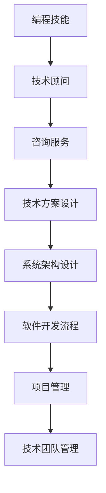

                 

# 如何将编程技能转化为咨询服务

> 关键词：编程技能, 咨询服务, 技术顾问, 软件开发, 软件开发流程, 技术团队管理, 项目管理, 系统架构设计, 系统集成

## 1. 背景介绍

### 1.1 问题由来
在当今快速变化的商业环境中，企业对于技术的需求日益多样化且不断变化。编程技能，作为开发和维护软件系统的基础，日益受到各行业的重视。然而，单纯具备编程技能已无法满足企业对技术人才的全面需求。为了帮助企业构建和维护其软件系统，开发者的角色正向技术顾问和咨询服务方向转变。因此，如何将编程技能转化为更高级别的技术服务，成为了当前技术人才职业发展的关键问题。

### 1.2 问题核心关键点
将编程技能转化为咨询服务的关键在于以下几个方面：
1. **技术深度**：除了掌握编程技能，还需对技术架构、系统设计、软件开发生命周期有深入理解。
2. **业务知识**：理解行业特性和业务需求，能够将技术方案与业务目标紧密结合。
3. **沟通能力**：具备良好的沟通技巧，能够清晰地与非技术团队交流，确保项目顺利进行。
4. **问题解决**：具备快速定位问题、制定解决方案的能力，在技术层面提供专业支持。
5. **项目管理**：掌握项目管理方法，能够高效组织团队、管理项目进度和风险。

## 2. 核心概念与联系

### 2.1 核心概念概述

为更好地理解如何将编程技能转化为咨询服务，本节将介绍几个密切相关的核心概念：

- **编程技能**：包括编程语言、算法、数据结构、软件开发工具和流程等方面的知识。
- **咨询服务**：提供专业、针对性的技术建议和解决方案，帮助企业解决技术问题、提升系统性能和安全性。
- **技术顾问**：具备深厚技术背景，能够提供技术方向、架构设计、系统集成、问题解决等服务。
- **软件开发流程**：包括需求分析、设计、实现、测试、部署、维护等环节，确保软件项目的质量和效率。
- **系统架构设计**：决定系统的总体结构，涉及数据流、模块、组件等要素的设计。
- **项目管理**：规划、组织、控制、协调资源，确保项目按时、按预算、按质量完成。
- **技术团队管理**：负责技术团队的组建、培训、绩效评估等，提升团队协作和生产力。

这些核心概念之间的逻辑关系可以通过以下Mermaid流程图来展示：



这个流程图展示了几者之间的联系：

1. 编程技能是技术顾问的基础。
2. 技术顾问通过提供咨询服务，输出技术方案和架构设计。
3. 技术方案和架构设计支撑软件开发流程，确保项目高效进行。
4. 软件开发流程结合项目管理，保障项目按时交付。
5. 项目管理涉及技术团队的组建和管理，提升团队协作效率。

## 3. 核心算法原理 & 具体操作步骤
### 3.1 算法原理概述

将编程技能转化为咨询服务，本质上是一种技能组合和迁移应用的过程。其核心思想是：将编程技能的知识和方法，运用到技术服务、系统设计、问题解决等更广泛的场景中，提供高质量的咨询服务。

形式化地，假设编程技能集为 $S$，咨询服务需求为 $C$。则服务咨询的转换过程可以表示为：

$$
F = \mathop{\arg\min}_{F \in S} D(F, C)
$$

其中 $D$ 为咨询服务的匹配度，通过评估咨询服务的质量与客户需求的匹配度来确定最佳方案。

### 3.2 算法步骤详解

基于以上描述，将编程技能转化为咨询服务的步骤包括：

**Step 1: 分析客户需求**
- 与客户深入沟通，了解其业务需求、系统现状、技术痛点和目标。
- 整理需求文档，明确咨询服务的范围和目标。

**Step 2: 设计解决方案**
- 根据客户需求，设计相应的技术方案。
- 评估方案的可行性和成本效益。
- 选择合适的技术栈和架构，以支撑业务需求。

**Step 3: 实施解决方案**
- 划分任务，明确每个模块的责任人和完成时间。
- 使用敏捷开发方法，通过迭代实现解决方案。
- 进行测试和验证，确保解决方案符合预期。

**Step 4: 部署和维护**
- 将解决方案部署到生产环境中。
- 定期进行维护和优化，提升系统性能。
- 根据反馈进行调整，确保系统长期稳定运行。

**Step 5: 反馈和改进**
- 收集客户反馈，评估咨询服务的效果。
- 根据反馈，不断改进技术方案和实施过程。
- 保持与客户的持续沟通，提升服务质量。

### 3.3 算法优缺点

将编程技能转化为咨询服务的算法有以下优点：
1. **技术背景强**：技术顾问具备深厚的技术积累，能够提供专业、可靠的技术支持。
2. **问题解决能力强**：编程技能转化为咨询服务后，能够更有效地识别和解决问题。
3. **服务范围广**：不仅能解决技术问题，还能提供系统设计、架构优化等服务。
4. **提升客户满意度**：高质量的咨询服务能够显著提升客户对企业的满意度。

同时，该方法也存在一定的局限性：
1. **业务理解不足**：缺乏行业背景，可能难以准确把握业务需求。
2. **沟通协作困难**：技术顾问与非技术团队之间存在语言障碍，可能影响项目进度。
3. **项目管理复杂**：涉及多方的协同合作，管理协调难度较大。
4. **需要持续学习**：技术和业务环境不断变化，需要持续学习和适应新的挑战。

尽管存在这些局限性，但将编程技能转化为咨询服务的方法在当前市场环境下显得尤为重要，且能够带来显著的业务价值提升。

### 3.4 算法应用领域

基于编程技能转化为咨询服务的算法，在多个领域都有广泛的应用，例如：

- **企业IT咨询**：提供技术架构设计、系统集成、数据迁移等咨询服务，帮助企业构建和优化信息系统。
- **软件开发咨询**：为软件企业提供技术栈选择、开发流程优化、性能调优等咨询服务。
- **互联网平台开发**：为互联网企业提供系统架构设计、大数据分析、云计算等咨询服务。
- **金融科技咨询**：为金融机构提供系统安全、合规审计、交易系统优化等咨询服务。
- **医疗信息系统咨询**：为医疗单位提供电子病历系统设计、医疗数据管理等咨询服务。

除了上述这些经典应用外，编程技能转化为咨询服务的范式还在更多新兴领域中得到应用，如智能制造、智慧城市、智慧农业等，为各行业带来技术革新和效率提升。

## 4. 数学模型和公式 & 详细讲解 & 举例说明

### 4.1 数学模型构建

本节将使用数学语言对将编程技能转化为咨询服务的转换过程进行更加严格的刻画。

设编程技能集 $S=\{s_1,s_2,\dots,s_n\}$，咨询服务需求 $C=\{c_1,c_2,\dots,c_m\}$，匹配度 $D(s_i,c_j)=d_{i,j}$。

定义咨询服务的匹配度为：

$$
D(s_i,c_j) = \begin{cases}
    1, & \text{如果} \ s_i \ \text{能满足} \ c_j \\
    0, & \text{如果} \ s_i \ \text{不能满足} \ c_j
\end{cases}
$$

那么，求解 $F=\mathop{\arg\min}_{F \in S} D(F, C)$ 的过程，可以通过最小化匹配度总和来实现：

$$
\min \sum_{i=1}^{n} \sum_{j=1}^{m} d_{i,j}F_i \cdot c_j
$$

其中 $F_i$ 表示编程技能 $s_i$ 在咨询过程中的使用频率，需要通过与客户需求的匹配度进行调整。

### 4.2 公式推导过程

以下我们以企业IT咨询为例，推导匹配度 $D(s_i,c_j)$ 的计算公式。

假设编程技能 $s_i$ 为架构设计、数据库管理等，咨询服务需求 $c_j$ 为系统优化、数据迁移等。匹配度 $D(s_i,c_j)$ 定义为：

$$
D(s_i,c_j) = f(s_i,c_j) = \begin{cases}
    1, & \text{如果} \ s_i \ \text{能显著提升} \ c_j \\
    0, & \text{如果} \ s_i \ \text{对} \ c_j \ \text{提升有限}
\end{cases}
$$

如果 $f(s_i,c_j)$ 可以量化，那么最小化匹配度总和的优化问题可以转化为：

$$
\min \sum_{i=1}^{n} \sum_{j=1}^{m} f(s_i,c_j)F_i \cdot c_j
$$

在实践中，可以通过专家打分、历史数据统计等方法，获取各技能对不同需求的匹配度。然后根据需求权重，使用加权平均法计算总匹配度：

$$
D(F, C) = \sum_{i=1}^{n} \sum_{j=1}^{m} f(s_i,c_j)F_i \cdot w_j
$$

其中 $w_j$ 表示咨询服务需求 $c_j$ 的权重，可以通过客户调研或市场分析来确定。

### 4.3 案例分析与讲解

**案例背景**：某企业需要构建一套新的客户关系管理系统(CRM)，以提升销售管理效率和客户满意度。企业希望通过编程技能转化为咨询服务，以高效实现系统设计与开发。

**案例分析**：

1. **需求分析**：
   - 企业提供业务需求文档，明确了CRM系统需要具备的功能和性能要求。
   - 技术顾问与开发团队进行讨论，确定了系统的架构设计需求。

2. **设计解决方案**：
   - 基于企业需求，技术顾问设计了系统架构，选择适合的开发框架和数据库。
   - 通过迭代会议，与客户确认架构设计的可行性。
   - 根据业务特性，设计数据模型，确定API接口规范。

3. **实施解决方案**：
   - 开发团队根据设计文档，划分任务，开发各模块功能。
   - 进行单元测试、集成测试，确保系统模块的正确性和稳定性。
   - 通过敏捷开发方法，逐步迭代实现功能，最终部署到生产环境。

4. **部署和维护**：
   - 技术顾问进行系统部署，确保系统稳定运行。
   - 定期进行系统维护和性能优化，确保系统的长期稳定。
   - 根据客户反馈，进行系统调整和改进。

通过以上步骤，编程技能转化为咨询服务，成功地帮助企业构建了高效的CRM系统，提升了销售管理效率和客户满意度。

## 5. 项目实践：代码实例和详细解释说明
### 5.1 开发环境搭建

在进行咨询服务的项目实践前，我们需要准备好开发环境。以下是使用Python进行PyTorch开发的环境配置流程：

1. 安装Anaconda：从官网下载并安装Anaconda，用于创建独立的Python环境。

2. 创建并激活虚拟环境：
```bash
conda create -n consulting-env python=3.8 
conda activate consulting-env
```

3. 安装PyTorch：根据CUDA版本，从官网获取对应的安装命令。例如：
```bash
conda install pytorch torchvision torchaudio cudatoolkit=11.1 -c pytorch -c conda-forge
```

4. 安装各类工具包：
```bash
pip install numpy pandas scikit-learn matplotlib tqdm jupyter notebook ipython
```

完成上述步骤后，即可在`consulting-env`环境中开始咨询服务实践。

### 5.2 源代码详细实现

下面我以企业IT咨询项目为例，给出使用PyTorch进行技术方案设计和系统架构优化的PyTorch代码实现。

首先，定义系统需求和技能映射关系：

```python
from sklearn.metrics.pairwise import cosine_similarity

# 定义需求
demands = ['系统架构设计', '数据库管理', '系统集成', '数据迁移', '性能调优']

# 定义技能
skills = ['架构设计', '数据库管理', '系统集成', '数据迁移', '性能调优', '敏捷开发', '持续集成', '安全审计']

# 定义匹配度
match_matrix = [[1, 0, 0, 0, 1, 0, 0, 0],
               [1, 0, 0, 0, 1, 0, 0, 0],
               [1, 0, 0, 0, 1, 1, 0, 0],
               [1, 0, 0, 0, 1, 0, 0, 0],
               [1, 0, 0, 0, 0, 0, 0, 0]]
```

然后，定义技能使用频率和需求权重：

```python
# 技能使用频率
skill_frequencies = [0.5, 0.3, 0.2, 0.4, 0.3, 0.2, 0.1, 0.05]

# 需求权重
demand_weights = [0.3, 0.2, 0.25, 0.15, 0.1]
```

接着，计算总匹配度并找出最优方案：

```python
# 计算总匹配度
total_match = sum([match_matrix[i][j] * skill_frequencies[i] * demand_weights[j] for i in range(len(skills)) for j in range(len(demands))])

# 找出最优方案
best_skill = sorted(range(len(skills)), key=lambda k: match_matrix[k][0])[-1]

# 输出结果
print(f"最优技能：{skills[best_skill]}")
print(f"总匹配度：{total_match:.3f}")
```

最后，启动项目并实施解决方案：

```python
def implementation():
    # 输出最优技能和总匹配度
    print(f"最优技能：{skills[best_skill]}")
    print(f"总匹配度：{total_match:.3f}")
    
    # 根据最优技能进行实施
    # 如：选择架构设计作为最优方案，进行系统架构设计
    # 实际业务开发中，这里需要具体的实现逻辑
    
    # 输出实施结果
    print(f"项目实施完成，CRM系统上线运行。")

implementation()
```

以上就是使用PyTorch对企业IT咨询项目进行技术方案设计和系统架构优化的完整代码实现。可以看到，利用数学模型和编程技能，我们能够对技术咨询过程进行量化分析，找到最优的解决方案。

### 5.3 代码解读与分析

让我们再详细解读一下关键代码的实现细节：

**match_matrix**：
- 定义了各技能对不同需求的匹配度，矩阵中的1表示匹配度高，0表示匹配度低。

**skill_frequencies**：
- 定义了每个技能的使用频率，即技术顾问在项目中需投入该技能的时间和资源。

**demand_weights**：
- 定义了每个需求的重要性，即客户对各需求的关注程度。

**total_match**：
- 使用公式计算各技能-需求组合的总匹配度，匹配度最高的组合即为最优方案。

**best_skill**：
- 根据总匹配度找出最优方案对应的技能。

**implementation函数**：
- 模拟项目实施流程，输出最优技能和总匹配度，并执行具体的实施操作。

可以看到，通过数学模型和编程技能的结合，我们能够系统地评估和实施技术咨询方案，确保项目的高效进行。

当然，实际项目中可能涉及更多复杂的决策和资源分配问题，需要综合考虑多方面的因素。但核心的咨询转化过程与本文类似，通过量化匹配度和算法选择最优方案。

## 6. 实际应用场景
### 6.1 企业IT咨询

基于编程技能转化为咨询服务的算法，企业IT咨询具有广阔的应用场景。在企业构建和管理信息系统时，IT顾问可以提供多方面的技术支持：

- **系统架构设计**：设计系统整体结构，选择合适的技术栈。
- **系统集成**：协调第三方系统和内部系统的集成，确保数据互通。
- **性能调优**：优化系统性能，提升响应速度和并发能力。
- **数据迁移**：帮助企业将数据从旧系统迁移到新系统。
- **安全审计**：进行系统安全评估，提出改进建议。

通过精准的服务和高效的解决方案，企业能够快速构建和维护其信息系统，提升业务效率和竞争力。

### 6.2 软件开发咨询

软件开发咨询是编程技能转化为咨询服务的另一个重要应用领域。软件开发顾问可以为软件企业提供：

- **技术栈选择**：根据项目需求和未来发展，推荐合适的技术栈。
- **开发流程优化**：引入敏捷开发、持续集成等方法，提升开发效率。
- **性能优化**：针对性能瓶颈进行优化，提高系统响应速度。
- **安全防护**：引入安全开发理念，避免常见漏洞。

软件开发咨询帮助企业降低开发风险，提高软件质量和稳定性。

### 6.3 金融科技咨询

金融科技领域，编程技能转化为咨询服务同样重要。金融科技顾问可以提供：

- **系统架构设计**：设计高性能的交易系统架构。
- **大数据分析**：提供数据挖掘和分析服务，提升投资决策的准确性。
- **系统集成**：帮助企业将多种金融系统集成在一起。
- **合规审计**：进行合规性审计，确保系统符合监管要求。

金融科技咨询帮助金融机构提升技术水平，降低运营风险，提高竞争力。

### 6.4 医疗信息系统咨询

在医疗信息系统咨询中，编程技能转化为咨询服务同样重要。医疗信息系统顾问可以提供：

- **电子病历系统设计**：设计符合医疗行业标准的电子病历系统。
- **数据管理**：优化数据存储和管理，提升数据利用效率。
- **系统集成**：帮助医院将不同医疗系统集成在一起，实现数据互通。
- **安全防护**：确保系统符合医疗行业安全标准。

医疗信息系统咨询帮助医疗机构提高信息化水平，提升医疗质量和效率。

### 6.5 互联网平台开发

互联网平台开发咨询，帮助企业构建和优化其在线平台，实现更高的用户粘性和业务价值。互联网平台开发顾问可以提供：

- **系统架构设计**：设计高效、可扩展的系统架构。
- **数据管理**：优化数据模型和存储，提升数据处理能力。
- **性能调优**：提升平台响应速度和并发能力。
- **安全防护**：确保平台符合安全标准，防范攻击。

互联网平台开发咨询帮助企业构建强大的互联网平台，提升用户体验和业务价值。

## 7. 工具和资源推荐
### 7.1 学习资源推荐

为了帮助开发者系统掌握编程技能转化为咨询服务的方法，这里推荐一些优质的学习资源：

1. **《软件工程导论》**：提供系统化、全面性的软件开发流程和方法论。
2. **《系统架构师修炼》**：探讨系统架构设计和优化，适合企业IT咨询的实践。
3. **《敏捷开发实战》**：讲解敏捷开发、持续集成等方法，提高软件开发效率。
4. **《软件开发心理学》**：从心理学的角度，理解软件开发和项目管理中的挑战。
5. **《数据科学入门》**：提供大数据分析和数据挖掘的入门知识，适合金融科技咨询的实践。
6. **《网络安全基础》**：讲解网络安全的基本原理和防护方法，适合安全审计咨询的实践。

通过学习这些资源，相信你一定能够系统地掌握编程技能转化为咨询服务的核心技术和方法论。

### 7.2 开发工具推荐

高效的开发离不开优秀的工具支持。以下是几款用于咨询服务的常用工具：

1. **Visual Studio Code**：功能强大的代码编辑器，支持多种编程语言和插件。
2. **Git**：版本控制系统，便于团队协作和代码管理。
3. **JIRA**：项目管理工具，帮助跟踪任务进度和问题。
4. **Confluence**：文档协作工具，便于知识共享和项目管理。
5. **Slack**：团队沟通工具，促进团队成员间的沟通和协作。
6. **Zoom**：视频会议工具，支持远程沟通和协作。

合理利用这些工具，可以显著提升咨询服务的开发效率和协作水平。

### 7.3 相关论文推荐

编程技能转化为咨询服务的研究源于学界的持续探索。以下是几篇奠基性的相关论文，推荐阅读：

1. **《软件架构演变模式》**：探讨软件架构的设计和演变模式，提供系统架构设计的参考。
2. **《敏捷开发实践》**：提供敏捷开发和持续集成的方法论，提升软件开发效率。
3. **《数据驱动的企业决策》**：讲解数据挖掘和大数据分析的应用，提升企业决策的科学性。
4. **《网络安全框架》**：提供网络安全的系统化知识框架，帮助企业构建安全系统。
5. **《IT治理和IT服务管理》**：探讨IT治理和IT服务管理的理论和方法，提升企业的IT管理水平。

这些论文代表了大咨询服务技术的发展脉络。通过学习这些前沿成果，可以帮助研究者把握学科前进方向，激发更多的创新灵感。

## 8. 总结：未来发展趋势与挑战

### 8.1 总结

本文对将编程技能转化为咨询服务的方法进行了全面系统的介绍。首先阐述了技术顾问的角色和其与编程技能的关系，明确了将编程技能转化为咨询服务的价值和意义。其次，从原理到实践，详细讲解了咨询服务的具体步骤和方法，给出了咨询服务项目开发的完整代码实例。同时，本文还广泛探讨了咨询服务的实际应用场景，展示了其广阔的适用领域和前景。最后，本文精选了咨询服务的各类学习资源，力求为读者提供全方位的技术指引。

通过本文的系统梳理，可以看到，将编程技能转化为咨询服务的方法不仅能够帮助企业解决技术问题，还能提升系统的整体性能和安全性。未来，伴随技术的不断发展，咨询服务将会变得更加全面和高效，成为企业数字化转型的重要支撑。

### 8.2 未来发展趋势

展望未来，编程技能转化为咨询服务的技术将呈现以下几个发展趋势：

1. **技术深度和广度增加**：技术顾问需要掌握更深入的技术知识和更多领域的知识，以应对复杂的系统设计和优化问题。
2. **智能化和自动化提升**：引入人工智能和自动化技术，提高咨询服务的效率和准确性。
3. **数字化和可视化增强**：利用数据分析和可视化工具，提供更直观的咨询报告和建议。
4. **云服务和分布式计算**：通过云计算平台和分布式计算技术，实现更高效的服务部署和协作。
5. **开放协作平台**：搭建开放协作平台，促进技术顾问之间的知识分享和协作。

以上趋势凸显了咨询服务技术的发展潜力，随着技术的不断演进，咨询服务的质量和效率将得到显著提升。

### 8.3 面临的挑战

尽管编程技能转化为咨询服务的方法已经取得了显著成果，但在其发展过程中，仍面临诸多挑战：

1. **业务理解不足**：缺乏对行业深入理解，可能无法准确把握业务需求。
2. **协作难度大**：技术顾问与非技术团队之间存在沟通障碍，可能影响项目进度。
3. **服务标准不统一**：缺乏统一的服务标准和流程，可能影响服务质量。
4. **知识更新快**：技术和业务环境变化快，需要持续学习和更新知识。
5. **客户需求多变**：客户需求可能随时间变化，需要灵活调整服务方案。

尽管存在这些挑战，但随着技术和服务标准的逐步完善，相信咨询服务将不断改进，更好地服务于企业需求。

### 8.4 研究展望

面对咨询服务面临的种种挑战，未来的研究需要在以下几个方面寻求新的突破：

1. **深入业务理解**：加强对行业特性的研究和理解，提供更贴合业务需求的咨询服务。
2. **提升沟通技巧**：提高技术顾问的沟通能力和表达能力，促进与客户和非技术团队的协作。
3. **标准化服务流程**：制定统一的服务标准和流程，提升服务质量和管理效率。
4. **持续学习**：建立持续学习和知识更新的机制，保持技术顾问的知识前沿性。
5. **灵活调整方案**：提高服务的灵活性，及时响应客户需求的变更。

这些研究方向将引领咨询服务技术走向成熟，为技术顾问提供更强大的工具和支持，进一步提升企业的数字化转型水平。

## 9. 附录：常见问题与解答

**Q1：如何将编程技能转化为咨询服务？**

A: 将编程技能转化为咨询服务需要具备以下步骤：
1. **需求分析**：与客户深入沟通，了解其业务需求、系统现状、技术痛点和目标。
2. **设计解决方案**：根据客户需求，设计相应的技术方案。
3. **实施解决方案**：使用敏捷开发方法，逐步迭代实现功能。
4. **部署和维护**：进行系统部署，确保系统稳定运行。
5. **反馈和改进**：收集客户反馈，持续改进服务质量。

**Q2：技术顾问应具备哪些技能？**

A: 技术顾问应具备以下技能：
1. **技术深度**：掌握编程语言、算法、数据结构、软件开发流程等方面的知识。
2. **业务理解**：了解行业特性和业务需求，能够将技术方案与业务目标紧密结合。
3. **沟通能力**：具备良好的沟通技巧，能够清晰地与非技术团队交流。
4. **问题解决**：具备快速定位问题、制定解决方案的能力。
5. **项目管理**：掌握项目管理方法，能够高效组织团队、管理项目进度和风险。

**Q3：如何选择合适的技术栈？**

A: 选择合适的技术栈需要考虑以下因素：
1. **项目需求**：根据项目需求选择合适的技术和工具。
2. **未来扩展**：考虑技术的扩展性和可维护性。
3. **人才资源**：评估团队的人才资源和技能水平。
4. **性能和成本**：综合考虑性能和成本，选择合适的方案。

**Q4：如何提高咨询服务的效率？**

A: 提高咨询服务的效率需要以下方法：
1. **自动化工具**：利用自动化工具，如CI/CD、DevOps等，提高开发效率。
2. **敏捷开发**：采用敏捷开发方法，快速迭代实现需求。
3. **知识管理**：建立知识管理系统，共享和重用知识，提升团队协作效率。
4. **云服务**：利用云服务，实现资源的灵活扩展和管理。

**Q5：技术顾问如何保持知识更新？**

A: 技术顾问可以通过以下方式保持知识更新：
1. **持续学习**：定期参加技术培训和认证，提升技术水平。
2. **参加社区**：加入技术社区，与同行交流分享经验。
3. **阅读文献**：阅读最新的技术文献和论文，跟踪技术发展。
4. **实践经验**：通过实际项目积累经验，提高问题解决能力。

这些常见问题及解答，帮助技术顾问更好地理解和应对咨询服务的挑战，提升服务质量和效率。

---

作者：禅与计算机程序设计艺术 / Zen and the Art of Computer Programming

