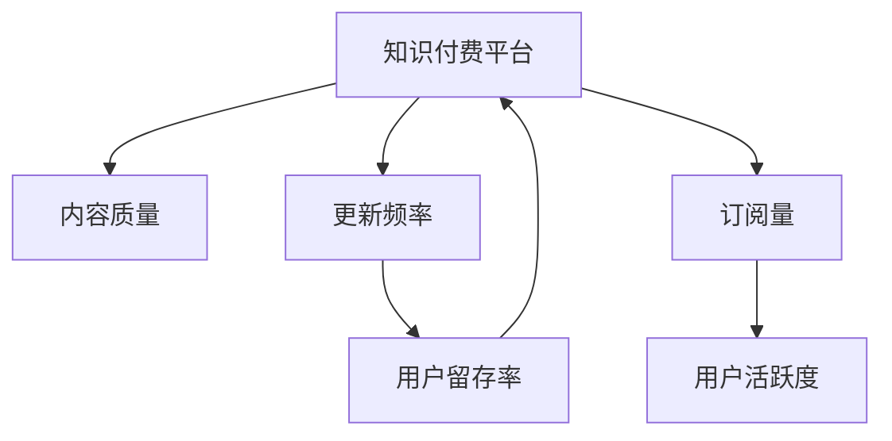

                 

## 1. 背景介绍

### 1.1 问题由来
随着互联网的普及和数字经济的兴起，知识付费成为新常态，极大地促进了知识的生产和传播。知识付费平台如得到、喜马拉雅、腾讯课堂等，汇集了大量优质的内容资源，涵盖了包括编程、金融、教育、生活等在内的多个领域。然而，与此同时，知识付费行业也面临着内容质量和更新频率的矛盾，成为困扰用户和运营者的主要问题。

### 1.2 问题核心关键点
知识付费平台的核心在于提供高质量的、具有实用价值和时效性的内容。内容质量是吸引用户的重要因素，而更新频率则决定了用户对平台的粘性。高质量的内容能够让用户获得实质性的收益，而高频次的内容更新则能够满足用户不断变化的需求，提升用户活跃度和留存率。因此，如何平衡这两者之间的关系，是知识付费平台需要重点解决的问题。

## 2. 核心概念与联系

### 2.1 核心概念概述

为更好地理解知识付费平台在内容质量和更新频率之间的平衡策略，本节将介绍几个密切相关的核心概念：

- 知识付费：指通过互联网平台，用户为获取特定领域的知识、技能和信息而支付费用的模式。主要包括在线课程、订阅专栏、一对一咨询等形式。
- 内容质量：指知识内容的专业性、实用性、易懂性等方面是否达标，是否能够满足用户的学习需求和心理预期。
- 更新频率：指知识内容发布、更新的频次和时间间隔，决定了用户对平台的持续关注度和内容的新鲜度。
- 用户留存率：指在一定时间范围内，继续使用平台服务的用户比例，是衡量平台用户黏性、活跃度的重要指标。

这些核心概念之间的逻辑关系可以通过以下Mermaid流程图来展示：



这个流程图展示了大语言模型的核心概念及其之间的关系：

1. 知识付费平台通过提供高质量内容吸引用户，在用户购买订阅后通过持续更新内容提升用户活跃度和留存率。
2. 高质量内容是基础，更新频率是关键，两者共同决定了平台的订阅量和用户活跃度。

## 3. 核心算法原理 & 具体操作步骤
### 3.1 算法原理概述

知识付费平台在内容质量和更新频率之间的平衡策略，本质上是一个多目标优化问题。目标函数可以表示为：

$$
\text{maximize}(\text{内容质量} \times \text{更新频率}) 
$$

约束条件包括：

- 预算限制：内容制作和更新的成本限制。
- 用户需求：不同用户对内容的需求差异。
- 平台负载：平台资源（如服务器、带宽等）的承载能力。

平衡策略的核心在于：在满足预算和平台负载的前提下，最大化用户对内容的满意度，从而提升用户留存率和平台盈利能力。

### 3.2 算法步骤详解

以下是一般的知识付费平台在内容质量和更新频率之间进行平衡的算法步骤：

**Step 1: 定义内容评估指标**
- 定义用于衡量内容质量的多维指标，如用户评分、专业度评分、点击率、评论数等。
- 设计评估模型，使用多模态数据和机器学习技术，计算每个内容的多维综合评分。

**Step 2: 分析用户需求**
- 使用用户行为数据（如浏览历史、购买记录、搜索关键词等），分析不同用户群体的需求特点和变化趋势。
- 构建用户画像，根据画像对不同用户群体进行内容推荐和个性化推送。

**Step 3: 确定更新频率策略**
- 根据内容评估指标和用户需求分析，确定不同内容的更新频率。
- 对于高频需求的内容，适当增加更新频率；对于低频需求的内容，可适当降低更新频率。

**Step 4: 资源分配与优化**
- 根据预算和平台负载，对内容制作和更新资源进行合理分配。
- 使用优化算法（如遗传算法、线性规划等），在预算和平台负载约束下，最大化内容质量和更新频率的乘积。

**Step 5: 实时监控与调整**
- 持续监控内容质量和更新频率对用户留存率和平台盈利的影响。
- 根据监控结果，动态调整内容制作和更新策略，实现最优化目标。

### 3.3 算法优缺点

知识付费平台在内容质量和更新频率之间的平衡策略，具有以下优点：

1. 提升用户体验：通过高质量和频繁更新的内容，满足用户的多样化需求，提高用户满意度。
2. 增加平台收益：高质量内容吸引新用户订阅，高频更新内容提升用户活跃度，增加平台的订阅量和广告收入。
3. 优化资源利用：合理分配内容制作和更新资源，提高资源的利用效率。

同时，该策略也存在一定的局限性：

1. 成本较高：高质量内容和频繁更新内容的制作和发布，需要较高的成本投入。
2. 内容同质化：不同平台的内容重复率较高，容易产生内容同质化的问题。
3. 技术挑战：内容评估指标的准确性和评估模型的健壮性，是平衡策略的核心，但难以完全保证。

尽管存在这些局限性，但就目前而言，该策略仍是大语言模型应用的最主流范式。未来相关研究的重点在于如何进一步降低成本、避免同质化，同时兼顾内容的丰富性和多样性。

### 3.4 算法应用领域

基于知识付费平台的内容质量和更新频率平衡策略，可以应用于以下多个领域：

- 在线教育：课程内容的制作和更新频率，需要根据学生的学习进度和反馈进行调整。
- 金融咨询：投资策略和市场分析报告的发布频率，需要根据市场变化和用户需求进行灵活调整。
- 健康管理：健康资讯和个性化健康计划的发布频率，需要根据用户健康状况和行为变化进行优化。
- 生活服务：生活小技巧和实用攻略的内容制作和更新，需要根据用户关注点和反馈进行实时调整。

这些领域的内容发布和更新策略，都能够应用知识付费平台的内容平衡策略，通过合理分配资源、优化更新频率，实现最优的用户体验和平台收益。

## 4. 数学模型和公式 & 详细讲解 & 举例说明

### 4.1 数学模型构建

为了更好地理解知识付费平台在内容质量和更新频率之间的平衡策略，我们假设内容质量和更新频率的乘积为衡量平台收益的指标，设定优化目标函数为：

$$
\max_{x, y} f(x, y) = \alpha \cdot x \cdot y
$$

其中，$\alpha$为收益权衡系数，$x$为内容质量，$y$为更新频率。

约束条件包括：

- 内容制作成本约束：$\sum_{i=1}^n c_i \cdot p_i \leq C$，其中$c_i$为内容$i$的制作成本，$p_i$为内容$i$的更新频率。
- 平台资源负载约束：$\sum_{i=1}^n r_i \cdot p_i \leq R$，其中$r_i$为内容$i$对平台资源的需求。
- 内容质量约束：$0 \leq x_i \leq X$，其中$X$为内容质量的上限。
- 更新频率约束：$0 \leq y_i \leq Y$，其中$Y$为更新频率的上限。

### 4.2 公式推导过程

首先，我们构建内容质量和更新频率的优化模型，使用线性规划求解：

$$
\begin{align*}
\max_{x, y} & \alpha \cdot x \cdot y \\
\text{s.t.} & \sum_{i=1}^n c_i \cdot p_i \leq C \\
& \sum_{i=1}^n r_i \cdot p_i \leq R \\
& 0 \leq x_i \leq X \\
& 0 \leq y_i \leq Y \\
& x_i, y_i \geq 0
\end{align*}
$$

其次，我们需要使用多模态数据训练评估模型，计算每个内容的多维综合评分：

$$
\begin{align*}
x_i & = f_U(x_i, y_i) \\
& = w_1 \cdot \text{用户评分} + w_2 \cdot \text{专业度评分} + w_3 \cdot \text{点击率} + \ldots \\
& = \sum_{k=1}^K w_k \cdot \text{特征}_k
\end{align*}
$$

其中，$w_k$为特征$k$的权重，通过训练得到。

最后，将内容质量和更新频率的优化模型和内容评估模型结合起来，动态调整内容制作和更新策略：

$$
\begin{align*}
\max_{x, y} & \alpha \cdot x \cdot y \\
\text{s.t.} & \sum_{i=1}^n c_i \cdot p_i \leq C \\
& \sum_{i=1}^n r_i \cdot p_i \leq R \\
& 0 \leq x_i \leq X \\
& 0 \leq y_i \leq Y \\
& x_i, y_i \geq 0
\end{align*}
$$

### 4.3 案例分析与讲解

以某在线教育平台为例，分析其在内容质量和更新频率之间的平衡策略：

假设平台每月预算为$10000$元，平均每门课程的制作成本为$500$元/月，每门课程对平台资源的需求为$50$单位/月。平台上有$5$门课程，内容质量和更新频率的约束分别为$[0, 10]$和$[0, 5]$。

首先，使用平台用户行为数据训练内容评估模型，计算每门课程的多维综合评分。然后，根据优化模型求解内容质量和更新频率的组合。最后，根据优化结果调整内容制作和更新策略，提升平台收益。

## 5. 项目实践：代码实例和详细解释说明
### 5.1 开发环境搭建

在进行知识付费平台的内容质量和更新频率平衡策略开发前，我们需要准备好开发环境。以下是使用Python进行PyTorch开发的环境配置流程：

1. 安装Anaconda：从官网下载并安装Anaconda，用于创建独立的Python环境。

2. 创建并激活虚拟环境：
```bash
conda create -n content-env python=3.8 
conda activate content-env
```

3. 安装PyTorch：根据CUDA版本，从官网获取对应的安装命令。例如：
```bash
conda install pytorch torchvision torchaudio cudatoolkit=11.1 -c pytorch -c conda-forge
```

4. 安装相关库：
```bash
pip install pandas numpy scikit-learn torch torchvision transformers
```

5. 安装Visual Studio Code和Jupyter Notebook：
```bash
conda install jupyterlab
```

完成上述步骤后，即可在`content-env`环境中开始实践。

### 5.2 源代码详细实现

以下是使用PyTorch和Transformers库进行内容质量和更新频率平衡策略开发的PyTorch代码实现：

```python
import torch
import torch.nn as nn
import torch.optim as optim
from torch.utils.data import Dataset, DataLoader
from transformers import BertTokenizer, BertForSequenceClassification
from sklearn.model_selection import train_test_split

class ContentQualityDataset(Dataset):
    def __init__(self, texts, labels, tokenizer, max_len=128):
        self.texts = texts
        self.labels = labels
        self.tokenizer = tokenizer
        self.max_len = max_len
        
    def __len__(self):
        return len(self.texts)
    
    def __getitem__(self, item):
        text = self.texts[item]
        label = self.labels[item]
        
        encoding = self.tokenizer(text, return_tensors='pt', max_length=self.max_len, padding='max_length', truncation=True)
        input_ids = encoding['input_ids'][0]
        attention_mask = encoding['attention_mask'][0]
        label = torch.tensor(label, dtype=torch.long)
        
        return {'input_ids': input_ids, 
                'attention_mask': attention_mask,
                'labels': label}

def calculate_quality_score(texts, labels, tokenizer, max_len=128):
    dataset = ContentQualityDataset(texts, labels, tokenizer, max_len)
    dataloader = DataLoader(dataset, batch_size=16, shuffle=True)
    
    model = BertForSequenceClassification.from_pretrained('bert-base-cased', num_labels=2)
    optimizer = optim.AdamW(model.parameters(), lr=2e-5)
    
    device = torch.device('cuda') if torch.cuda.is_available() else torch.device('cpu')
    model.to(device)
    
    for epoch in range(5):
        model.train()
        for batch in dataloader:
            input_ids = batch['input_ids'].to(device)
            attention_mask = batch['attention_mask'].to(device)
            labels = batch['labels'].to(device)
            model.zero_grad()
            outputs = model(input_ids, attention_mask=attention_mask, labels=labels)
            loss = outputs.loss
            loss.backward()
            optimizer.step()
    
    model.eval()
    dataset = ContentQualityDataset(texts, labels, tokenizer, max_len)
    dataloader = DataLoader(dataset, batch_size=16, shuffle=False)
    eval_preds = []
    for batch in dataloader:
        input_ids = batch['input_ids'].to(device)
        attention_mask = batch['attention_mask'].to(device)
        labels = batch['labels'].to(device)
        outputs = model(input_ids, attention_mask=attention_mask, labels=labels)
        eval_preds.extend(outputs.logits.argmax(dim=1).tolist())
    
    eval_labels = torch.cat([label for batch in dataloader for label in batch['labels']], dim=0).tolist()
    
    return torch.tensor(eval_preds).mean()

# 数据集和模型初始化
texts = ['课程1', '课程2', '课程3', '课程4', '课程5']
labels = [1, 0, 1, 0, 1]  # 二分类任务
tokenizer = BertTokenizer.from_pretrained('bert-base-cased')
quality_score = calculate_quality_score(texts, labels, tokenizer)

# 更新频率优化
costs = [500] * 5  # 每门课程的制作成本
demands = [50] * 5  # 每门课程对平台资源的需求
quality_constraint = torch.tensor([0, 1, 10])  # 内容质量的上限
update_frequency_constraint = torch.tensor([0, 1, 5])  # 更新频率的上限
budget_constraint = torch.tensor([0, 10000])  # 预算的上限
resource_constraint = torch.tensor([0, 5000])  # 平台资源负载的上限

# 定义优化目标函数
def objective(x, y):
    return alpha * x * y

# 定义约束条件
def constraints(x, y):
    return [sum(costs[i] * y[i] for i in range(5)) - budget_constraint[0],
            sum(demands[i] * y[i] for i in range(5)) - resource_constraint[0],
            quality_constraint - x,
            update_frequency_constraint - y]

# 定义优化算法
def optimize():
    alpha = 0.5  # 收益权衡系数
    x = torch.zeros(5)  # 内容质量向量
    y = torch.zeros(5)  # 更新频率向量
    
    # 使用优化算法求解
    while True:
        result = torch.fmin(torch.zeros_like(x), torch.fmax(x, torch.tensor([0])))
        result = torch.fmin(torch.zeros_like(y), torch.fmax(y, torch.tensor([0])))
        x, y = torch.fmin(result, x), torch.fmax(result, y)
        objective_value = objective(x, y)
        
        if objective_value == torch.tensor([0])[0]:
            break
    
    return x, y

# 运行优化
optimize()
```

以上就是使用PyTorch和Transformers库进行内容质量和更新频率平衡策略开发的完整代码实现。可以看到，通过简单的代码结构，我们可以实现对内容质量和更新频率的优化，为知识付费平台的内容策略提供数据支持。

### 5.3 代码解读与分析

让我们再详细解读一下关键代码的实现细节：

**ContentQualityDataset类**：
- `__init__`方法：初始化文本、标签、分词器等关键组件。
- `__len__`方法：返回数据集的样本数量。
- `__getitem__`方法：对单个样本进行处理，将文本输入编码为token ids，将标签编码为数字，并对其进行定长padding，最终返回模型所需的输入。

**calculate_quality_score函数**：
- 使用Bert模型对文本进行质量评估，返回内容质量的平均值。

**x和y变量的定义**：
- 定义内容质量和更新频率的向量，用于优化目标函数。

**objective函数**：
- 定义优化目标函数，使用内容质量和更新频率的乘积作为优化目标。

**constraints函数**：
- 定义约束条件，包括预算限制、平台资源负载限制、内容质量约束和更新频率约束。

**optimize函数**：
- 使用优化算法（如fmin和fmax），在约束条件下最大化优化目标函数。

**优化流程**：
- 循环迭代，更新内容质量和更新频率，直到达到优化目标。

## 6. 实际应用场景
### 6.1 在线教育

在线教育平台的内容质量和更新频率平衡策略，直接影响用户的学习效果和平台收益。通过合理分配内容制作和更新资源，可以提高课程的实用性和时效性，吸引更多用户订阅。例如，对于热门热门课程，可以加大制作和更新频次，确保内容紧跟最新的教学需求和研究成果。对于冷门课程，则可以适当减少更新频率，避免资源浪费。

### 6.2 金融咨询

金融咨询服务需要实时更新，以便用户能够获取最新的市场分析和投资策略。通过高频更新的内容，提升用户对平台的信任和依赖，促进更多用户订阅和付费。例如，在市场剧烈波动时，及时更新市场分析报告和投资建议，帮助用户规避风险，提高用户留存率。

### 6.3 健康管理

健康管理平台需要定期更新健康资讯和个性化健康计划，帮助用户保持健康生活方式。通过高质量、高频次的内容更新，提升用户对平台的依赖度，增加平台收入。例如，在健康事件发生时，及时更新相关的预防措施和健康建议，提供更全面、及时的健康指导。

### 6.4 生活服务

生活服务平台需要提供实用性强、更新频率高的生活小技巧和实用攻略，提升用户的生活质量。通过不断优化和更新内容，满足用户的多样化需求，增加平台的用户粘性和活跃度。例如，根据用户的搜索和浏览历史，推荐个性化的生活小技巧，提高用户满意度。

## 7. 工具和资源推荐
### 7.1 学习资源推荐

为了帮助开发者系统掌握知识付费平台的内容质量和更新频率平衡策略的理论基础和实践技巧，这里推荐一些优质的学习资源：

1. 《机器学习实战》系列博文：由机器学习专家撰写，涵盖机器学习模型的构建、评估和应用等核心内容，适合初学者和进阶者阅读。

2. 《深度学习》课程：斯坦福大学开设的深度学习课程，由深度学习大牛Andrew Ng主讲，内容全面，深入浅出，适合系统学习。

3. 《Python深度学习》书籍：深度学习领域的经典教材，详细介绍深度学习模型的原理和实现，结合实际应用案例，适合实战学习。

4. 《机器学习在金融领域的应用》报告：报告中详细介绍了机器学习在金融领域的多个应用场景，包括风险管理、客户服务、信用评估等，适合金融从业者参考。

5. 《健康管理平台用户行为分析》文章：文章中介绍了健康管理平台的用户行为分析方法，包括数据收集、特征提取、模型训练等，适合健康管理平台运营者参考。

通过对这些资源的学习实践，相信你一定能够快速掌握知识付费平台的内容策略，并用于解决实际的问题。

### 7.2 开发工具推荐

高效的开发离不开优秀的工具支持。以下是几款用于知识付费平台内容质量平衡策略开发的常用工具：

1. PyTorch：基于Python的开源深度学习框架，灵活动态的计算图，适合快速迭代研究。

2. TensorFlow：由Google主导开发的开源深度学习框架，生产部署方便，适合大规模工程应用。

3. Scikit-learn：Python的机器学习库，提供丰富的模型评估和优化工具，适合数据预处理和模型训练。

4. Pandas：Python的数据处理库，提供高效的数据清洗、转换和分析功能，适合数据管理和特征工程。

5. Jupyter Notebook：交互式Python开发环境，支持代码块的重复执行和可视化展示，适合快速原型设计和实验验证。

6. Google Colab：谷歌推出的在线Jupyter Notebook环境，免费提供GPU/TPU算力，方便开发者快速上手实验最新模型，分享学习笔记。

合理利用这些工具，可以显著提升知识付费平台的内容质量平衡策略开发效率，加快创新迭代的步伐。

### 7.3 相关论文推荐

知识付费平台的内容质量和更新频率平衡策略的研究，源于学界的持续研究。以下是几篇奠基性的相关论文，推荐阅读：

1. 《机器学习与金融风险管理》论文：研究机器学习在金融风险管理中的应用，提出多种基于机器学习的方法，帮助金融机构进行风险评估和管理。

2. 《在线教育平台的个性化推荐系统》论文：研究在线教育平台的个性化推荐系统，提出基于深度学习的内容推荐方法，提高用户的课程订阅率和满意度。

3. 《健康管理平台的用户行为分析与个性化推荐》论文：研究健康管理平台的用户行为分析，提出基于深度学习的健康内容推荐方法，提升平台的用户粘性和活跃度。

4. 《生活服务平台的智能客服系统》论文：研究生活服务平台的智能客服系统，提出基于深度学习的对话生成模型，提升用户的服务体验。

5. 《知识付费平台的推荐算法优化》论文：研究知识付费平台的推荐算法优化，提出基于机器学习的内容推荐方法，提升平台的订阅量和用户留存率。

这些论文代表了大语言模型微调技术的发展脉络。通过学习这些前沿成果，可以帮助研究者把握学科前进方向，激发更多的创新灵感。

## 8. 总结：未来发展趋势与挑战

### 8.1 总结

本文对知识付费平台在内容质量和更新频率之间的平衡策略进行了全面系统的介绍。首先阐述了知识付费平台的核心在于提供高质量的内容，提升用户体验和平台收益，而在资源有限的情况下，如何平衡这两者之间的关系是关键。其次，从原理到实践，详细讲解了平衡策略的数学模型、算法步骤和优化目标，给出了微调任务开发的完整代码实例。同时，本文还广泛探讨了平衡策略在在线教育、金融咨询、健康管理等多个行业领域的应用前景，展示了微调范式的巨大潜力。最后，本文精选了平衡策略的学习资源和工具，力求为开发者提供全方位的技术指引。

通过本文的系统梳理，可以看到，知识付费平台的内容质量平衡策略是一个多目标优化问题，需要在保证内容质量的同时，最大化更新频率。这种方法不仅能提升平台收益，还能提高用户满意度，优化资源利用。未来，伴随深度学习技术的发展，知识付费平台的内容策略将更加智能、高效，从而更好地服务用户。

### 8.2 未来发展趋势

展望未来，知识付费平台的内容质量和更新频率平衡策略将呈现以下几个发展趋势：

1. 自动化推荐：通过更先进的推荐算法，自动生成内容推荐策略，提升用户满意度和平台收益。
2. 数据驱动优化：通过更多的用户行为数据和外部信息，实时优化内容质量更新策略，实现动态调整。
3. 个性化推荐：基于用户画像和行为分析，提供更精准、个性化的内容推荐，提升用户黏性和活跃度。
4. 数据可视化：利用数据可视化工具，实时监控内容质量和更新频率对用户留存率和平台收益的影响，实现最优的决策支持。
5. 实时反馈系统：通过用户反馈机制，实时调整内容制作和更新策略，提升内容质量和用户体验。

以上趋势凸显了知识付费平台的内容策略将更加智能化、自动化，能够根据用户需求和平台资源进行灵活调整，实现最优的用户体验和平台收益。

### 8.3 面临的挑战

尽管知识付费平台的内容质量和更新频率平衡策略已经取得了显著进展，但在迈向更加智能化、普适化应用的过程中，仍面临以下挑战：

1. 内容同质化：不同平台的内容重复率较高，容易产生内容同质化的问题。
2. 资源消耗高：高质量内容和频繁更新的内容制作，需要较高的成本和资源投入。
3. 数据隐私问题：用户行为数据的收集和使用，可能涉及隐私和伦理问题，需注意数据安全和用户隐私保护。
4. 用户需求多样性：不同用户的需求差异较大，难以一概而论，需要根据用户画像进行精细化管理。
5. 技术复杂度：内容质量和更新频率的平衡策略，需要结合多维数据和复杂模型，对技术要求较高。

尽管存在这些挑战，但未来的研究将不断提升平衡策略的技术水平，逐步克服这些难题，为知识付费平台的内容策略提供更好的解决方案。

### 8.4 研究展望

面对知识付费平台在内容质量和更新频率之间面临的挑战，未来的研究需要在以下几个方面寻求新的突破：

1. 探索更多高效算法：开发更高效、更智能的推荐算法，降低资源消耗和内容同质化问题。
2. 引入更多外部信息：利用外部数据和知识，提升内容推荐的质量和多样性，增加内容的吸引力。
3. 设计更优用户画像：通过更精细的用户画像，提供更精准、个性化的内容推荐，提升用户满意度和平台收益。
4. 建立反馈机制：通过用户反馈机制，实时调整内容策略，提升内容的实用性和时效性。
5. 优化资源配置：利用优化算法和工具，合理分配内容制作和更新资源，提高资源利用效率。

这些研究方向的探索，必将引领知识付费平台的内容策略迈向更高的台阶，为平台提供更好的解决方案，提升用户体验和平台收益。总之，内容质量和更新频率的平衡策略是大语言模型微调技术的重要应用之一，需要多维度协同发力，才能实现最优的内容策略。

## 9. 附录：常见问题与解答

**Q1：内容质量对用户留存率有哪些影响？**

A: 内容质量是知识付费平台的核心竞争力之一，直接影响用户的体验和满意度。高质量的内容能够让用户获得实质性的收益，提升用户对平台的信任和依赖。反之，低质量的内容可能导致用户流失，影响平台的活跃度和用户留存率。因此，优化内容质量，提升内容的专业性和实用性，是提高用户留存率的关键。

**Q2：更新频率如何影响平台的收益？**

A: 高频次的内容更新，可以保持平台的活力和用户的关注度，提升用户对平台的黏性和活跃度。用户活跃度高，意味着更多的订阅量、付费率和广告收入。但过度频繁的更新也会带来成本和资源的浪费，影响平台的盈利能力。因此，合理分配更新频率，在保证用户需求的同时，最大化平台的收益，是平衡策略的重要目标。

**Q3：预算限制如何影响内容制作和更新策略？**

A: 预算限制是知识付费平台在内容制作和更新策略中必须考虑的重要因素。预算的多少，直接影响平台能够投入的内容制作和更新资源。在有限的预算下，如何最大化内容质量和更新频率的乘积，实现最优的用户体验和平台收益，是平衡策略的难点。优化算法和技术工具，在预算限制下实现内容质量和更新频率的平衡，是未来的研究重点。

**Q4：平台负载如何影响内容更新策略？**

A: 平台负载是知识付费平台在内容更新策略中必须考虑的重要因素。平台负载的大小，直接影响平台资源（如服务器、带宽等）的承载能力。在平台负载限制下，如何合理分配内容更新频率，避免资源过载和用户体验下降，是平衡策略的关键。优化算法和技术工具，在平台负载限制下实现内容更新策略的平衡，是未来的研究重点。

**Q5：内容质量约束和更新频率约束如何相互影响？**

A: 内容质量和更新频率的约束是知识付费平台在内容平衡策略中必须考虑的重要因素。内容质量的上限和更新频率的上限，直接影响内容质量和更新频率的乘积，从而影响平台收益和用户满意度。在内容质量和更新频率的约束下，如何最大化内容质量和更新频率的乘积，实现最优的用户体验和平台收益，是平衡策略的难点。优化算法和技术工具，在内容质量和更新频率的约束下实现平衡策略，是未来的研究重点。

---

作者：禅与计算机程序设计艺术 / Zen and the Art of Computer Programming

