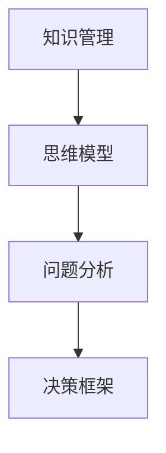

                 

# 如何建立个人的思维体系

## 1. 背景介绍

在当今快速变化的世界中，个人思维体系的建立显得尤为重要。无论是科技创新、企业管理还是日常生活，思维体系的构建都是解决问题的关键。本文将探讨如何通过系统化的学习和实践，建立个人的思维体系，以应对复杂多变的挑战。

### 1.1 问题的由来

随着知识经济的兴起和人工智能技术的普及，个人如何在信息爆炸的时代保持竞争力，如何在快速变化的环境中做出明智的决策，成为了一个重要的问题。思维体系作为个体处理信息和决策的基础，其构建已成为提升个人综合能力的核心。

### 1.2 问题核心关键点

个人思维体系的构建涉及多个方面，包括知识获取、思维方式、问题解决、决策制定等。本文将从知识管理、思维模型、问题分析和决策框架等方面，系统介绍如何建立一套完整的个人思维体系。

## 2. 核心概念与联系

### 2.1 核心概念概述

为了更好地理解个人思维体系的构建，我们需要先明确几个核心概念：

- **知识管理(Knowledge Management)**：涉及如何收集、组织、应用和分享知识的过程。
- **思维模型(Thinking Model)**：指解决特定问题的思考方式和逻辑框架。
- **问题分析(Problem Analysis)**：对问题的定义、分析、分解和结构化的过程。
- **决策框架(Decision Framework)**：根据特定情境和目标，制定决策的标准和步骤。

这些核心概念相互关联，共同构成了个人思维体系的基础框架。

### 2.2 核心概念原理和架构的 Mermaid 流程图



这个流程图展示了知识管理、思维模型、问题分析和决策框架之间的联系和转换过程。通过系统化地应用这些概念，个体可以构建一套完整的思维体系，以应对各种挑战。

## 3. 核心算法原理 & 具体操作步骤

### 3.1 算法原理概述

个人思维体系的构建是一个动态的过程，涉及知识的持续获取、思维模式的不断迭代、问题分析能力的提升和决策框架的优化。其核心算法原理可以概括为：

1. **知识获取**：通过阅读、学习、实践等方式获取新知识。
2. **思维模型**：建立一套或若干套有效的思维模型，用于处理不同类型的问题。
3. **问题分析**：运用思维模型对问题进行结构化分析，明确问题的关键点。
4. **决策框架**：根据问题分析结果，制定决策步骤和标准。
5. **反馈与迭代**：根据执行结果，不断调整和优化知识、思维模型、问题分析和决策框架。

### 3.2 算法步骤详解

#### 3.2.1 知识获取

知识获取是思维体系构建的基础。通过阅读书籍、参加课程、参与实践等方式，持续不断地获取新知识。步骤如下：

1. **选择学习资源**：根据兴趣和需求选择合适的学习资源，如书籍、在线课程、论文等。
2. **制定学习计划**：制定系统的学习计划，包括时间安排和进度跟踪。
3. **实践应用**：通过实际应用，巩固所学知识，如编程、写作、思考等。

#### 3.2.2 思维模型建立

思维模型是解决问题的关键工具。以下是一个简单的思维模型建立流程：

1. **确定问题类型**：明确问题属于哪种类型，如因果关系、系统思考、逻辑推理等。
2. **选择或设计思维模型**：根据问题类型选择合适的思维模型，或根据需求设计新的思维模型。
3. **应用与优化**：在实际问题中应用思维模型，根据反馈进行优化和调整。

#### 3.2.3 问题分析

问题分析是思维体系构建的核心环节。以下是问题分析的基本步骤：

1. **明确问题**：对问题进行明确定义，包括问题描述、背景和目标。
2. **分解问题**：将问题分解为更小、更具体的子问题。
3. **结构化问题**：对分解后的子问题进行结构化处理，明确各子问题之间的逻辑关系。

#### 3.2.4 决策框架制定

决策框架是解决问题的重要工具。以下是一个简单的决策框架制定流程：

1. **确定决策目标**：明确决策的目标和标准。
2. **收集决策信息**：收集与决策相关的信息，如数据、知识、经验等。
3. **制定决策步骤**：根据目标和信息，制定决策步骤和评估标准。
4. **执行决策**：根据制定的步骤和标准，执行决策并监控结果。
5. **反馈与调整**：根据执行结果，调整决策框架，优化决策步骤。

### 3.3 算法优缺点

个人思维体系的构建有以下优点：

1. **系统化**：通过系统化的方法获取知识、分析问题和制定决策，提升问题解决能力。
2. **持续改进**：不断反馈与迭代，不断优化思维模型和决策框架。
3. **应用广泛**：适用于各种类型的问题和情境，灵活性高。

同时，也存在一些局限性：

1. **时间成本高**：构建思维体系需要大量时间和精力，短期内效果不明显。
2. **知识更新快**：知识快速变化，需要不断更新思维模型和决策框架。
3. **灵活性要求高**：需要根据具体情况灵活应用思维模型和决策框架。

### 3.4 算法应用领域

个人思维体系的构建不仅适用于学术研究、技术开发，还适用于企业管理、项目管理、生活决策等领域。具体应用场景包括：

- **项目管理**：运用问题分析和决策框架，提高项目管理的效率和效果。
- **产品开发**：通过思维模型指导产品设计、功能优化等。
- **个人理财**：制定决策框架，优化财务规划和管理。
- **日常生活决策**：通过问题分析和决策框架，提高日常决策的准确性。

## 4. 数学模型和公式 & 详细讲解 & 举例说明

### 4.1 数学模型构建

为了更好地理解个人思维体系的构建，我们可以使用数学模型进行抽象和描述。以下是一个简化的思维模型数学模型：

$$
\text{Thinking Model} = F(\text{Knowledge}, \text{Problem}, \text{Decision Framework})
$$

其中，`F` 表示思维模型的转换函数，`Knowledge` 表示知识库，`Problem` 表示问题结构，`Decision Framework` 表示决策框架。

### 4.2 公式推导过程

对于上述数学模型，我们可以进一步推导如下：

1. **知识库构建**：
   $$
   \text{Knowledge} = \sum_{i=1}^{N} K_i
   $$
   其中，`N` 表示知识的总数量，`K_i` 表示第 `i` 个知识点的具体内容。

2. **问题结构分析**：
   $$
   \text{Problem} = P(\text{Problem Statement}, \text{Sub-problems}, \text{Relationships})
   $$
   其中，`Problem Statement` 表示问题描述，`Sub-problems` 表示分解后的子问题，`Relationships` 表示各子问题之间的逻辑关系。

3. **决策框架优化**：
   $$
   \text{Decision Framework} = D(\text{Objective}, \text{Criteria}, \text{Steps})
   $$
   其中，`Objective` 表示决策目标，`Criteria` 表示决策标准，`Steps` 表示决策步骤。

### 4.3 案例分析与讲解

以下是一个具体的案例分析：

**案例**：设计一款新的移动应用

1. **知识获取**：
   - 阅读相关行业报告、用户需求分析文档。
   - 参加用户体验设计课程，学习设计原理和工具。

2. **思维模型建立**：
   - 确定问题类型为**需求-功能匹配**。
   - 选择或设计思维模型，如**用户故事地图**。

3. **问题分析**：
   - 明确问题：设计一款新的移动应用，提升用户满意度。
   - 分解问题：功能设计、用户体验、界面布局等。
   - 结构化问题：用户画像、功能优先级、界面设计规则等。

4. **决策框架制定**：
   - 确定决策目标：提升用户满意度。
   - 收集决策信息：用户调研数据、竞品分析、技术可行性评估等。
   - 制定决策步骤：功能原型设计、用户测试、迭代优化等。
   - 执行决策：根据用户反馈，进行功能和界面优化。
   - 反馈与调整：根据测试结果，优化决策框架和问题分析方法。

## 5. 项目实践：代码实例和详细解释说明

### 5.1 开发环境搭建

为了进行思维体系的构建和优化，需要一定的开发环境支持。以下是一个基本的开发环境搭建流程：

1. **选择合适的IDE**：如Visual Studio Code、PyCharm等。
2. **安装必要的工具**：如Git、GitHub、Jupyter Notebook等。
3. **配置环境变量**：如Python路径、环境变量等。
4. **设置项目管理工具**：如JIRA、Trello等。

### 5.2 源代码详细实现

以下是一个简单的思维模型构建和应用示例：

```python
from sklearn.ensemble import RandomForestClassifier
from sklearn.metrics import accuracy_score

# 构建思维模型
class ThinkingModel:
    def __init__(self):
        self.model = RandomForestClassifier()

    def train(self, X, y):
        self.model.fit(X, y)

    def predict(self, X):
        return self.model.predict(X)

    def evaluate(self, X, y):
        y_pred = self.predict(X)
        accuracy = accuracy_score(y, y_pred)
        return accuracy

# 应用思维模型
model = ThinkingModel()
X_train = ...
y_train = ...
X_test = ...
y_test = ...

model.train(X_train, y_train)
accuracy = model.evaluate(X_test, y_test)
print(f"Accuracy: {accuracy}")
```

### 5.3 代码解读与分析

上述代码实现了一个简单的思维模型：随机森林分类器。通过`train`方法进行模型训练，`predict`方法进行预测，`evaluate`方法评估模型性能。

在实际应用中，可以根据具体问题选择合适的模型，如决策树、神经网络等。同时，可以通过可视化工具（如Matplotlib、Seaborn等）进行结果展示，进一步分析模型性能。

### 5.4 运行结果展示

在上述示例中，运行结果为模型在测试集上的准确率。根据实际应用场景，还可以输出其他性能指标，如精确度、召回率、F1分数等。

## 6. 实际应用场景

### 6.1 项目管理

在项目管理中，运用思维模型和决策框架，可以显著提升项目管理的效率和效果。具体应用场景包括：

- **项目规划**：通过问题分析，明确项目目标和关键路径。
- **资源分配**：根据项目需求，制定合理的资源分配方案。
- **风险管理**：识别潜在风险，制定应对策略。

### 6.2 产品开发

在产品开发中，运用思维模型和决策框架，可以提升产品设计和功能优化能力。具体应用场景包括：

- **用户体验设计**：通过用户故事地图，明确用户需求和功能优先级。
- **原型设计**：通过思维模型，设计符合用户需求的产品原型。
- **迭代优化**：根据用户反馈，持续优化产品功能和界面。

### 6.3 个人理财

在个人理财中，运用决策框架，可以优化财务规划和管理。具体应用场景包括：

- **预算制定**：制定合理的预算计划，控制支出。
- **投资决策**：根据风险偏好，选择适合的投资组合。
- **绩效评估**：定期评估财务绩效，调整理财策略。

### 6.4 未来应用展望

随着人工智能和数据科学的不断发展，个人思维体系的构建将更加系统和高效。未来应用展望包括：

1. **智能决策辅助**：利用机器学习和自然语言处理技术，辅助个人进行决策。
2. **个性化推荐系统**：根据个人兴趣和行为数据，推荐个性化的学习资源和信息。
3. **多模态融合**：结合视觉、听觉等多模态信息，提升问题分析和决策能力。
4. **跨领域应用**：将思维体系应用到不同领域，如医疗、法律、金融等，提升综合能力。

## 7. 工具和资源推荐

### 7.1 学习资源推荐

为了系统学习个人思维体系的构建，推荐以下学习资源：

1. **《系统思考：思维模式与方法》**：这本书系统介绍了系统思考的基本原理和方法，是构建个人思维体系的重要参考。
2. **Coursera的《Design Thinking Specialization》**：通过设计思维课程，提升问题分析和创造性解决问题的能力。
3. **Kaggle的机器学习竞赛**：通过实际项目，应用机器学习模型，提升问题解决能力。
4. **《数据科学与决策分析》**：这本书详细介绍了数据分析和决策分析的方法，是构建决策框架的重要参考。
5. **TED Talks的《How to Measure the Unmeasurable》**：TED Talks上的视频演讲，帮助理解系统思考和问题分析的实际应用。

### 7.2 开发工具推荐

为了支持思维体系的构建和优化，推荐以下开发工具：

1. **Jupyter Notebook**：用于编写和运行Python代码，支持交互式分析和结果展示。
2. **Git**：用于版本控制，支持团队协作和代码共享。
3. **GitHub**：用于代码托管和版本控制，支持项目管理。
4. **PyCharm**：用于Python编程，提供代码高亮、调试等功能。
5. **Visual Studio Code**：轻量级代码编辑器，支持多种语言和框架。

### 7.3 相关论文推荐

为了深入理解个人思维体系的构建，推荐以下相关论文：

1. **《System Dynamics: A Handbook for Research, Modeling, and Simulation》**：系统动力学领域的经典教材，介绍了系统思考的基本概念和建模方法。
2. **《Thinking, Fast and Slow》**：诺贝尔经济学奖得主Daniel Kahneman的著作，系统介绍了人类思维的两种模式，对理解问题分析和决策框架具有重要参考价值。
3. **《Design Thinking: Integrating Innovation, Customer Experience, and Brand Value》**：设计思维领域的经典著作，介绍了设计思维的基本原理和方法，对提升问题分析和创造性解决问题的能力具有重要参考价值。
4. **《A Taxonomy of Decision Frameworks》**：对决策框架进行了全面的分类和分析，对制定合理的决策框架具有重要参考价值。

## 8. 总结：未来发展趋势与挑战

### 8.1 研究成果总结

本文系统介绍了个人思维体系的构建方法和应用场景，详细讲解了知识管理、思维模型、问题分析和决策框架等内容。通过系统化的学习和实践，个体可以构建一套完整的思维体系，以应对各种挑战。

### 8.2 未来发展趋势

未来，个人思维体系的构建将呈现出以下趋势：

1. **智能化辅助**：利用人工智能和机器学习技术，辅助个人进行决策。
2. **个性化定制**：根据个人兴趣和行为数据，推荐个性化的学习资源和信息。
3. **跨领域应用**：将思维体系应用到不同领域，提升综合能力。
4. **多模态融合**：结合视觉、听觉等多模态信息，提升问题分析和决策能力。

### 8.3 面临的挑战

尽管个人思维体系的构建具有重要的意义，但也面临以下挑战：

1. **时间成本高**：构建思维体系需要大量时间和精力，短期内效果不明显。
2. **知识更新快**：知识快速变化，需要不断更新思维模型和决策框架。
3. **灵活性要求高**：需要根据具体情况灵活应用思维模型和决策框架。

### 8.4 研究展望

未来的研究应在以下方面进行探索：

1. **智能化决策辅助**：利用人工智能和机器学习技术，辅助个人进行决策。
2. **个性化推荐系统**：根据个人兴趣和行为数据，推荐个性化的学习资源和信息。
3. **跨领域应用**：将思维体系应用到不同领域，提升综合能力。
4. **多模态融合**：结合视觉、听觉等多模态信息，提升问题分析和决策能力。

## 9. 附录：常见问题与解答

### 9.1 Q1：构建个人思维体系需要多少时间？

A: 构建个人思维体系需要持续的投入和实践，具体时间因人而异。一般来说，每周投入一定时间进行学习和实践，3-6个月可以初步构建一套基本的思维体系。

### 9.2 Q2：如何评估思维体系的构建效果？

A: 可以通过实际问题的解决效果进行评估，如项目管理的效率提升、产品设计的用户满意度提升、个人理财的财务绩效提升等。还可以通过定期的自我反思和反馈，评估思维体系的持续改进效果。

### 9.3 Q3：构建思维体系需要哪些工具？

A: 需要一些基础的开发工具和学习资源，如IDE、Git、GitHub、Jupyter Notebook、Coursera等。具体工具选择可以根据个人习惯和需求进行。

### 9.4 Q4：如何保持思维体系的持续更新？

A: 持续关注行业动态和前沿技术，定期阅读相关的书籍、论文、视频等。同时，不断实践和优化，根据实际问题调整和改进思维模型和决策框架。

---

作者：禅与计算机程序设计艺术 / Zen and the Art of Computer Programming

