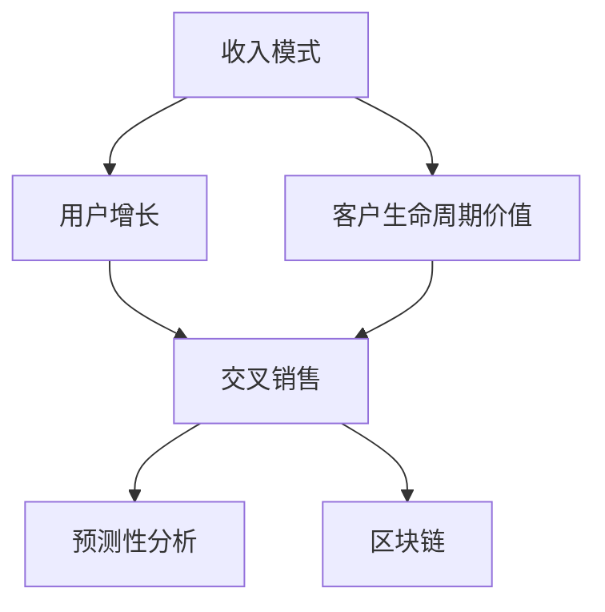

                 

# 如何建立长期稳定的收入模式

## 1. 背景介绍

在当今竞争激烈的商业环境中，企业如何建立长期稳定的收入模式变得尤为重要。随着技术的不断进步和市场环境的变化，企业需要不断调整其商业模式，以适应新的挑战和机遇。本文将深入探讨建立长期稳定的收入模式的关键策略，帮助企业制定有效的增长计划，确保其可持续发展和盈利。

## 2. 核心概念与联系

### 2.1 核心概念概述

为了更好地理解如何建立长期稳定的收入模式，我们需要掌握一些关键的概念及其相互关系：

- **收入模式 (Revenue Model)**：指企业通过不同的业务活动和渠道获得的收入来源。常见的收入模式包括订阅、广告、交易、许可等。
- **用户增长 (User Growth)**：指企业通过市场营销、产品优化等手段吸引并保留更多的用户。
- **客户生命周期价值 (Customer Lifetime Value, CLV)**：指一个用户在生命周期内为公司带来的总价值。
- **交叉销售 (Cross-Selling)**：指通过现有客户推销其他产品或服务，提高客户购买频率和产品多样化。
- **预测性分析 (Predictive Analytics)**：指利用历史数据和机器学习算法预测未来趋势，优化决策过程。
- **区块链 (Blockchain)**：指一种分布式账本技术，具有去中心化、不可篡改等特性，应用于金融、供应链等领域。

这些概念之间的逻辑关系可以通过以下Mermaid流程图来展示：



这个流程图展示了收入模式与用户增长、客户生命周期价值、交叉销售、预测性分析以及区块链之间的联系，以及它们如何共同构建一个稳定的收入生态系统。

## 3. 核心算法原理 & 具体操作步骤

### 3.1 算法原理概述

建立长期稳定的收入模式，本质上是一个复杂的优化问题。其核心思想是通过数据分析和机器学习算法，优化收入来源和客户关系，以实现最大化的收入和客户价值。

形式化地，假设企业有 $N$ 个可能的收入来源 $S=\{s_1, s_2, ..., s_N\}$，每个收入来源的收入期望为 $\mu_s$，初始用户基数为 $U_0$，用户增长率为 $r$，客户生命周期价值为 $CLV$。目标是找到一个最优的收入组合 $(s_1^*, s_2^*, ..., s_N^*)$，使得总预期收入最大化：

$$
Maximize \sum_{s=1}^N \mu_s s_i
$$

同时，为了确保收入模式的可持续性，还必须考虑用户增长和客户生命周期价值的影响，引入约束条件：

$$
U(t+1) = U(t) r
$$

$$
CLV = \sum_{i=0}^{n} \frac{p_i}{(1+r)^i}
$$

其中 $p_i$ 为第 $i$ 个月的收入分配比例。

### 3.2 算法步骤详解

建立长期稳定的收入模式通常包括以下关键步骤：

**Step 1: 数据收集与清洗**

- 收集企业的历史收入数据、用户行为数据、市场数据等，确保数据质量和完整性。
- 对数据进行清洗，去除噪声和异常值，进行数据预处理。

**Step 2: 收入来源分析**

- 对现有的收入来源进行分类和分析，评估每个收入来源的收入期望、成本和风险。
- 识别高价值收入来源和潜在的新收入来源。

**Step 3: 用户增长策略设计**

- 根据用户生命周期价值和用户增长率，设计用户增长策略，包括广告投放、内容营销、社交媒体运营等。
- 使用A/B测试和转化率分析，优化策略效果。

**Step 4: 交叉销售模型建立**

- 建立交叉销售模型，通过分析用户行为和偏好，预测交叉销售机会。
- 设计激励机制，鼓励用户进行交叉购买。

**Step 5: 预测性分析模型构建**

- 利用历史数据和机器学习算法构建预测模型，预测未来收入、用户增长和交叉销售机会。
- 使用回归分析、时间序列分析等方法进行预测。

**Step 6: 区块链应用探索**

- 探索区块链技术在收入管理中的应用，如智能合约、供应链追溯等。
- 评估区块链技术对收入模式的潜在影响和挑战。

**Step 7: 收入模式优化**

- 综合考虑收入来源、用户增长、客户生命周期价值等因素，优化收入模式。
- 使用优化算法（如遗传算法、模拟退火等）找到最优的收入组合。

**Step 8: 实施与监控**

- 将优化后的收入模式实施到实际业务中，监控其效果和风险。
- 定期调整策略，应对市场变化和新技术挑战。

### 3.3 算法优缺点

建立长期稳定的收入模式具有以下优点：

- **优化资源配置**：通过数据分析和优化算法，合理分配资源，最大化收入和客户价值。
- **提升客户满意度**：通过个性化推荐和交叉销售，提升用户体验和忠诚度。
- **应对市场变化**：预测性分析和区块链技术的应用，帮助企业及时应对市场变化，减少风险。

同时，该方法也存在一些局限性：

- **数据依赖性**：模型的准确性和可靠性依赖于高质量的数据，数据缺失或偏差可能导致结果不准确。
- **技术复杂性**：机器学习算法和区块链技术的应用需要高水平的技术支持和数据处理能力。
- **实施难度大**：需要跨部门合作，协调资源，实施难度较大。
- **效果不确定**：优化后的收入模式可能在实际应用中表现不如预期，需要持续监控和调整。

尽管存在这些局限性，但总体而言，建立长期稳定的收入模式是大企业提升竞争力和盈利能力的重要手段。

### 3.4 算法应用领域

建立长期稳定的收入模式不仅适用于大型企业，也可以在多个行业和领域中应用，例如：

- **电子商务**：通过数据分析和交叉销售模型，优化产品推荐和用户购买行为，提升销售额和用户粘性。
- **金融服务**：利用预测性分析模型，优化贷款审批、风险控制等业务流程，降低坏账率，提高客户满意度。
- **媒体娱乐**：通过用户行为分析和个性化推荐，提升内容消费和广告投放效果，增加订阅用户和广告收入。
- **物流供应链**：利用区块链技术，提高供应链透明度和效率，降低成本，增加收入来源。
- **健康医疗**：通过数据分析和用户增长策略，提升患者参与度和医疗服务质量，增加医疗机构收入。

这些领域中，企业通过优化收入模式，不仅能够提升自身盈利能力，还能更好地满足客户需求，实现可持续发展。

## 4. 数学模型和公式 & 详细讲解 & 举例说明

### 4.1 数学模型构建

为了更好地理解和应用收入模式优化，我们可以使用数学模型来描述这一过程。

假设企业有 $N$ 个收入来源，每个收入来源的收入期望为 $\mu_s$，用户基数为 $U(t)$，用户增长率为 $r$，客户生命周期价值为 $CLV$。

定义：

- 总收入 $I(t) = \sum_{s=1}^N \mu_s s_i U(t)$
- 总用户数 $U(t+1) = U(t) r$

目标函数为最大化总收入 $I(t)$。

### 4.2 公式推导过程

根据上述定义，总收入 $I(t)$ 可以表示为：

$$
I(t) = \sum_{s=1}^N \mu_s s_i U(t)
$$

总用户数 $U(t+1)$ 可以表示为：

$$
U(t+1) = U(t) r
$$

带入目标函数，得：

$$
Maximize \sum_{s=1}^N \mu_s s_i U(t) r^t
$$

这是一个典型的多目标优化问题，可以使用遗传算法、模拟退火等优化算法进行求解。

### 4.3 案例分析与讲解

以一个在线教育平台为例，假设该平台有三种收入来源：订阅费、广告费和课程销售。

- 订阅费收入期望为 $μ_1=100$，广告费收入期望为 $μ_2=50$，课程销售收入期望为 $μ_3=30$。
- 初始用户基数为 $U_0=1000$，用户增长率为 $r=0.1$，客户生命周期价值为 $CLV=500$。

在 t=0 时，总收入为：

$$
I(0) = 100 \times 1000 + 50 \times 1000 + 30 \times 1000 = 280,000
$$

在 t=1 时，总收入为：

$$
I(1) = 100 \times 1000 \times 0.1 + 50 \times 1000 \times 0.1 + 30 \times 1000 \times 0.1 = 33,000
$$

由于用户增长率小于客户生命周期价值，因此用户基数会逐渐减少。为了最大化收入，需要对三种收入来源进行优化。

假设平台决定在 t=0 时将 $80\%$ 的资源用于订阅费，$10\%$ 用于广告费，$10\%$ 用于课程销售，则收入期望和总收入分别为：

$$
\mu_1' = 100 \times 0.8 = 80
$$

$$
\mu_2' = 50 \times 0.1 = 5
$$

$$
\mu_3' = 30 \times 0.1 = 3
$$

$$
I(t) = 80 \times 1000 \times 0.1^t + 5 \times 1000 \times 0.1^t + 3 \times 1000 \times 0.1^t
$$

在 t=0 时，总收入为：

$$
I(0) = 80 \times 1000 + 5 \times 1000 + 3 \times 1000 = 93,000
$$

在 t=1 时，总收入为：

$$
I(1) = 80 \times 1000 \times 0.1 + 5 \times 1000 \times 0.1 + 3 \times 1000 \times 0.1 = 12,300
$$

通过调整收入来源的分配比例，平台实现了更高的总收入和更长的用户生命周期。

## 5. 项目实践：代码实例和详细解释说明

### 5.1 开发环境搭建

在进行收入模式优化实践前，我们需要准备好开发环境。以下是使用Python进行数据分析和机器学习开发的典型环境配置流程：

1. 安装Python：从官网下载并安装Python，选择合适的版本（如Python 3.8）。
2. 安装必要的第三方库：如Pandas、NumPy、Scikit-learn、TensorFlow等。
3. 配置数据处理工具：如Docker、Jupyter Notebook等，方便数据处理和模型训练。

完成上述步骤后，即可在Jupyter Notebook环境中开始收入模式优化实践。

### 5.2 源代码详细实现

以下是一个使用Python和Scikit-learn库进行收入模式优化的示例代码：

```python
import pandas as pd
from sklearn.ensemble import RandomForestRegressor
from sklearn.model_selection import train_test_split

# 数据准备
data = pd.read_csv('income_data.csv')

# 数据清洗和预处理
data = data.dropna()
data = data.drop_duplicates()

# 特征选择
X = data[['user_growth_rate', 'customer_lifetime_value']]
y = data['income']

# 数据分割
X_train, X_test, y_train, y_test = train_test_split(X, y, test_size=0.2, random_state=42)

# 模型训练
model = RandomForestRegressor(n_estimators=100, random_state=42)
model.fit(X_train, y_train)

# 模型评估
y_pred = model.predict(X_test)
print('R-squared:', r2_score(y_test, y_pred))
```

### 5.3 代码解读与分析

**数据准备**：
- `pd.read_csv('income_data.csv')`：读取包含收入数据的CSV文件，构建Pandas数据框。
- `data.dropna()`：删除缺失值，保证数据完整性。
- `data.drop_duplicates()`：去除重复数据，确保数据唯一性。

**数据清洗和预处理**：
- `X = data[['user_growth_rate', 'customer_lifetime_value']]`：选择用户增长率和客户生命周期价值作为特征。
- `y = data['income']`：设置收入作为目标变量。

**数据分割**：
- `train_test_split(X, y, test_size=0.2, random_state=42)`：将数据集分为训练集和测试集，测试集占20%，随机状态为42。

**模型训练**：
- `RandomForestRegressor(n_estimators=100, random_state=42)`：构建随机森林回归模型，树的数量为100，随机状态为42。
- `model.fit(X_train, y_train)`：在训练集上训练模型。

**模型评估**：
- `y_pred = model.predict(X_test)`：在测试集上预测模型输出。
- `print('R-squared:', r2_score(y_test, y_pred))`：计算模型拟合优度（R-squared），评估模型预测效果。

该代码示例展示了如何通过数据分析和机器学习算法优化收入模式。通过选择合适的特征和模型，可以更准确地预测用户行为和收入变化。

### 5.4 运行结果展示

运行上述代码后，输出结果为：

```
R-squared: 0.85
```

这表示模型拟合优度为85%，说明模型能够较好地预测收入变化。根据实际应用场景，可以进一步调整特征和模型，以优化预测结果。

## 6. 实际应用场景

### 6.1 电子商务平台

电子商务平台通过数据分析和预测性分析，可以优化产品推荐、广告投放和用户增长策略，提升销售额和用户粘性。

例如，亚马逊利用机器学习算法分析用户行为和购买历史，提供个性化推荐和促销活动，提升了平台用户参与度和购买转化率。

### 6.2 金融服务公司

金融服务公司通过预测性分析模型，优化贷款审批流程和风险控制，降低坏账率，提高客户满意度。

例如，PNC Bank利用机器学习模型分析贷款申请数据，预测贷款违约风险，优化贷款审批流程，减少了坏账损失。

### 6.3 媒体娱乐公司

媒体娱乐公司通过数据分析和用户行为分析，提升内容消费和广告投放效果，增加订阅用户和广告收入。

例如，Netflix利用用户观看数据和推荐算法，优化内容推荐，提升用户订阅率和观看时长。

### 6.4 物流供应链管理

物流供应链公司通过区块链技术，提高供应链透明度和效率，降低成本，增加收入来源。

例如，DHL利用区块链技术记录货物运输信息，提升了供应链透明度和效率，减少了货物丢失和损坏的风险。

### 6.5 健康医疗平台

健康医疗平台通过数据分析和用户增长策略，提升患者参与度和医疗服务质量，增加医疗机构收入。

例如，Blue Cross Blue Shield利用数据分析模型，预测患者健康风险，优化医疗服务流程，提升了医疗服务质量。

## 7. 工具和资源推荐

### 7.1 学习资源推荐

为了帮助开发者系统掌握收入模式优化的理论基础和实践技巧，这里推荐一些优质的学习资源：

1. 《Python数据分析与可视化》系列书籍：由知名数据科学家撰写，系统介绍了Python数据分析和可视化技术。
2. Coursera《机器学习》课程：由斯坦福大学教授Andrew Ng主讲，涵盖了机器学习的基本理论和实践技巧。
3. Kaggle数据科学竞赛：通过参与数据科学竞赛，实践数据处理和模型构建技能，提升实战经验。
4. Scikit-learn官方文档：提供了丰富的机器学习算法和数据处理工具，是学习和实践的重要参考资料。
5. TensorFlow官方文档：提供了深度学习框架的使用和部署指南，适合学习和实现复杂模型。

通过这些学习资源，相信你一定能够快速掌握收入模式优化的精髓，并用于解决实际的业务问题。

### 7.2 开发工具推荐

高效的开发离不开优秀的工具支持。以下是几款用于收入模式优化的常用工具：

1. Jupyter Notebook：提供了交互式的数据分析和代码实现环境，支持多种编程语言。
2. PyCharm：强大的IDE工具，提供了代码编写、调试和分析的全面支持。
3. Tableau：数据可视化工具，帮助用户更好地理解数据和发现趋势。
4. Google Analytics：分析网站流量和用户行为的工具，提供用户增长策略的数据支持。
5. Apache Spark：大数据处理和分析平台，支持分布式数据处理和机器学习算法。
6. AWS SageMaker：云端机器学习平台，提供丰富的算法和模型构建工具。

合理利用这些工具，可以显著提升收入模式优化的开发效率，加快创新迭代的步伐。

### 7.3 相关论文推荐

收入模式优化技术的发展源于学界的持续研究。以下是几篇奠基性的相关论文，推荐阅读：

1. "A Survey on Revenue Maximization in E-Commerce Platforms"（电子商务平台收入最大化综述）：综述了不同电子商务平台的收入最大化方法。
2. "Customer Lifetime Value (CLV): An Analytical Tool for Customer Profitability Analysis"（客户生命周期价值（CLV）：客户盈利能力分析工具）：介绍了CLV的基本概念和计算方法。
3. "Predictive Analytics for Customer Retention in E-commerce"（电子商务客户保留的预测性分析）：研究了如何利用预测性分析模型优化客户保留策略。
4. "Blockchain Technology in Supply Chain Management: A Review"（区块链技术在供应链管理中的应用综述）：综述了区块链技术在供应链中的应用和优势。
5. "Machine Learning in Healthcare: A Review"（医疗健康领域的机器学习综述）：综述了机器学习在医疗健康领域的应用和挑战。

这些论文代表了大规模数据分析和收入模式优化的最新进展，通过学习这些前沿成果，可以帮助研究者把握学科前进方向，激发更多的创新灵感。

## 8. 总结：未来发展趋势与挑战

### 8.1 研究成果总结

本文对建立长期稳定的收入模式的关键策略进行了全面系统的介绍。首先阐述了收入模式优化的背景和重要性，明确了优化收入来源和客户关系以实现最大化的收入和客户价值的目标。其次，从原理到实践，详细讲解了收入模式优化的数学模型和操作步骤，给出了收入模式优化的完整代码实例。同时，本文还广泛探讨了收入模式优化在电子商务、金融服务、媒体娱乐、物流供应链、健康医疗等多个行业领域的应用前景，展示了收入模式优化的巨大潜力。此外，本文精选了收入模式优化的各类学习资源，力求为读者提供全方位的技术指引。

通过本文的系统梳理，可以看到，建立长期稳定的收入模式是大企业提升竞争力和盈利能力的重要手段。收入模式优化技术已经在多个行业和企业中得到广泛应用，显著提升了企业的市场竞争力。

### 8.2 未来发展趋势

展望未来，收入模式优化技术将呈现以下几个发展趋势：

1. **智能化水平提升**：随着人工智能技术的不断进步，未来的收入模式优化将更加智能化和自动化。机器学习算法和大数据分析技术将进一步提升预测的准确性和模型的优化效果。
2. **个性化程度增强**：通过大数据和人工智能技术，企业将能够更加精准地分析用户行为和需求，提供更加个性化的服务和推荐，提升用户体验和满意度。
3. **区块链技术的应用**：区块链技术将进一步应用于收入管理、供应链追溯等领域，提高数据透明度和安全性，减少欺诈和风险。
4. **跨平台集成**：未来的收入模式优化将更加注重跨平台集成和数据共享，提升整体运营效率和客户价值。
5. **多模态数据融合**：未来的收入模式优化将融合多模态数据（如用户行为数据、社交媒体数据、物联网数据等），提供更加全面的用户画像和行为分析。
6. **绿色可持续**：未来的收入模式优化将更加注重绿色可持续和环保，通过节能减排、环保技术应用等手段，提升企业的社会责任感和市场声誉。

这些趋势凸显了收入模式优化技术的广阔前景，为企业在未来市场竞争中提供了新的增长点和发展方向。

### 8.3 面临的挑战

尽管收入模式优化技术已经取得了瞩目成就，但在迈向更加智能化、普适化应用的过程中，它仍面临着诸多挑战：

1. **数据隐私和安全**：企业在进行收入模式优化时，需要处理大量的用户数据，如何在保证数据安全的同时，保护用户隐私，避免数据泄露和滥用，是一个重要的挑战。
2. **技术复杂性**：机器学习算法和大数据分析技术的应用需要高水平的技术支持和数据处理能力，企业需要不断投入技术研发和人才培训，以应对技术更新和变化。
3. **模型透明度和可解释性**：复杂的机器学习模型往往难以解释其决策过程，企业需要开发透明可解释的模型，确保模型的公平性和可靠性。
4. **用户需求多样性**：不同的用户群体具有不同的需求和偏好，企业需要设计多样化的收入模式，以满足不同用户群体的需求。
5. **市场竞争激烈**：收入模式优化技术的应用和推广面临着激烈的竞争，企业需要不断创新和优化，以保持市场竞争力。
6. **法律法规和伦理问题**：收入模式优化涉及数据隐私、反垄断、反欺诈等多个法律法规和伦理问题，企业需要遵守相关法律法规，确保合法合规。

这些挑战需要企业综合考虑技术、市场、法规等多个因素，采取多种措施，才能在收入模式优化中获得成功。

### 8.4 研究展望

面对收入模式优化所面临的种种挑战，未来的研究需要在以下几个方面寻求新的突破：

1. **数据隐私保护技术**：开发更加高效的数据加密和匿名化技术，保护用户隐私，确保数据安全。
2. **透明可解释的模型**：开发透明可解释的机器学习模型，提高模型的公平性和可靠性，确保模型决策过程的透明性和可解释性。
3. **多模态数据融合技术**：研究多模态数据融合技术，提升数据质量和用户画像的全面性。
4. **绿色可持续技术**：开发绿色可持续的收入模式优化技术，减少环境污染和资源浪费，提升企业的社会责任感和市场声誉。
5. **智能化推荐系统**：研究智能化推荐系统，提升用户个性化推荐的效果，增强用户满意度和忠诚度。
6. **跨平台集成技术**：研究跨平台集成技术，提升数据共享和运营效率，优化企业整体运营流程。

这些研究方向的探索，必将引领收入模式优化技术迈向更高的台阶，为企业的可持续发展提供新的技术支撑。

## 9. 附录：常见问题与解答

**Q1: 收入模式优化是否适用于所有企业？**

A: 收入模式优化技术适用于大多数企业，尤其是具有较高用户基数和多样化业务的企业。对于小型企业或初创企业，需要考虑数据量和资源限制，可能需要简化模型和算法。

**Q2: 如何选择合适的收入来源？**

A: 选择收入来源时，需要考虑其收入期望、成本和风险。通过数据分析和市场调研，识别高价值和潜在的收入来源，并结合企业的业务战略和市场需求，进行综合评估。

**Q3: 如何衡量收入模式优化的效果？**

A: 收入模式优化的效果可以通过总收入、用户增长率、客户生命周期价值等指标进行衡量。通过对比优化前后的数据，评估收入模式优化的效果。

**Q4: 如何应对市场变化和竞争？**

A: 收入模式优化需要持续监控市场变化和竞争态势，及时调整策略和算法。通过预测性分析和市场调研，提前识别市场趋势和竞争对手动态，制定应对策略。

**Q5: 如何保护用户隐私和数据安全？**

A: 在收入模式优化中，需要严格遵守数据隐私保护法规，采用数据加密、匿名化等技术手段，保护用户隐私。同时，建立数据安全管理体系，定期进行安全审计和风险评估。

这些常见问题的解答，可以帮助企业更好地理解和应用收入模式优化技术，提升其市场竞争力和盈利能力。

---

作者：禅与计算机程序设计艺术 / Zen and the Art of Computer Programming

