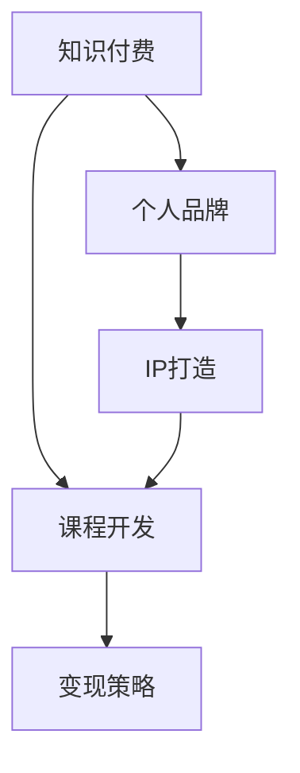

                 

# 如何打造个人知识付费生态圈

> 关键词：知识付费,个人品牌,IP打造,课程开发,变现策略

## 1. 背景介绍

### 1.1 问题由来
随着互联网的普及和技术的进步，知识付费成为了一种快速、高效获取知识的方式。个人品牌作为知识付费生态的重要组成部分，不仅能够为自身带来商业价值，还能够促进行业的良性发展。因此，如何打造个人品牌，实现个人知识变现，是当前知识付费领域的一个重要课题。

### 1.2 问题核心关键点
打造个人知识付费生态圈的核心在于：
- 选择合适的知识领域和专业方向。
- 打造个人品牌，提升知名度和影响力。
- 开发高质量课程，满足用户需求。
- 实现有效的变现策略，最大化收益。

### 1.3 问题研究意义
个人知识付费生态圈的打造，对个人和行业都有着重要意义：
- 对个人而言，能够通过分享专业知识，实现个人品牌的提升和收益的增加。
- 对行业而言，丰富了知识付费产品线，推动了知识经济的发展。
- 对用户而言，提供了更多高质量、系统化的知识资源。

## 2. 核心概念与联系

### 2.1 核心概念概述

为了更好地理解打造个人知识付费生态圈的过程，本节将介绍几个密切相关的核心概念：

- 知识付费：通过付费形式获取特定知识资源，如课程、文章、讲座等。
- 个人品牌：通过个人能力、形象、风格等特征，在特定领域内建立的影响力和知名度。
- IP打造：打造个人知识产权，即通过各种方式建立个人品牌，形成独特的价值主张和商业模型。
- 课程开发：基于专业知识，开发设计并制作课程内容，满足用户需求，实现知识变现。
- 变现策略：制定有效的商业模式和运营策略，将知识资源转化为经济收益。

这些核心概念之间的逻辑关系可以通过以下Mermaid流程图来展示：



这个流程图展示了个知识付费生态圈的核心概念及其之间的关系：
1. 知识付费是整个生态的基础，提供了知识资源。
2. 个人品牌和IP打造是核心驱动力，提升知名度和影响力。
3. 课程开发是内容来源，满足用户需求。
4. 变现策略是变现手段，最大化收益。

## 3. 核心算法原理 & 具体操作步骤
### 3.1 算法原理概述

打造个人知识付费生态圈，本质上是一个基于用户需求和市场反馈的知识产品设计与优化过程。其核心思想是：通过深入分析用户需求，设计满足用户痛点的课程内容，并通过合理的营销策略，将知识产品推向市场，实现商业变现。

形式化地，假设用户需求为 $U$，课程内容为 $C$，营销策略为 $S$，商业变现能力为 $P$，则知识付费生态圈的目标是最大化 $P$，即：

$$
P = f(U, C, S)
$$

其中 $f$ 为某种优化函数，反映了课程内容与营销策略对商业变现能力的影响。通过不断迭代优化 $U$、$C$、$S$ 三个变量，可以逐步逼近最优解。

### 3.2 算法步骤详解

基于以上原理，打造个人知识付费生态圈一般包括以下几个关键步骤：

**Step 1: 用户需求分析**
- 通过调研、问卷、访谈等方式，收集用户对知识产品的需求和痛点。
- 分析用户群体的特点，如年龄、职业、兴趣等，制定针对性课程设计方案。

**Step 2: 课程内容设计**
- 根据用户需求，设计课程大纲和知识点，确保课程内容覆盖全面、实用。
- 选择合适的平台和工具，如Udemy、Coursera等，进行课程开发和制作。
- 采用丰富的教学手段，如视频讲解、互动问答、案例分析等，提升课程吸引力。

**Step 3: 营销策略制定**
- 制定差异化的营销策略，如内容预告、免费试听、社交媒体推广等。
- 选择合适的渠道进行课程宣传，如官网、社交媒体、电子邮件等。
- 分析用户反馈，持续优化课程内容和推广策略。

**Step 4: 变现策略实施**
- 选择合适的定价策略，如单次购买、订阅制、免费增值等。
- 通过多种方式进行收入变现，如平台分成、广告收入、会员服务费等。
- 持续收集用户反馈，优化课程内容和服务体验，提升用户满意度。

### 3.3 算法优缺点

打造个人知识付费生态圈的方法具有以下优点：
1. 灵活高效。通过持续优化用户需求、课程内容和营销策略，可以快速迭代课程产品，满足市场变化。
2. 市场覆盖广。通过多渠道推广，可以实现广泛的受众覆盖，提升课程销量。
3. 收益模式多样。通过多种变现策略，能够最大化收益，降低对单一渠道的依赖。

同时，该方法也存在一定的局限性：
1. 初期投入高。课程开发、平台费用、营销推广等初期成本较大。
2. 用户需求变化快。需要持续关注市场动态，及时调整课程内容。
3. 竞争激烈。随着知识付费市场逐渐成熟，竞争者增多，提升竞争力需要更多努力。
4. 效果评估困难。课程销量和用户满意度等指标难以全面量化，评估难度较大。

尽管存在这些局限性，但就目前而言，打造个人知识付费生态圈的方法仍是主流且有效的范式。未来相关研究的重点在于如何进一步降低初期投入，提高市场覆盖和收益最大化，同时兼顾用户满意度和竞争优势。

### 3.4 算法应用领域

打造个人知识付费生态圈的方法，不仅适用于传统教育领域，更广泛应用于多个行业：

- 教育培训：通过系统化的课程设计，帮助用户提升专业技能和知识水平。
- 职业培训：针对特定职业，提供实用的职业技能培训和证书课程。
- 心理咨询：提供心理健康相关的知识普及和实操培训，帮助用户应对心理问题。
- 健康管理：提供健康饮食、运动、心理调适等方面的知识，提升用户生活质量。
- 兴趣爱好：提供各类兴趣爱好的课程，如编程、音乐、摄影等，满足个性化需求。
- 职业技能：提供特定职业的必备技能课程，如项目管理、数据分析、编程等，助力职业发展。

除了上述这些经典领域外，知识付费生态圈还在不断拓展，如金融理财、时尚生活、旅行探索等，为各行各业带来新的增长点和价值提升。

## 4. 数学模型和公式 & 详细讲解 & 举例说明
### 4.1 数学模型构建

本节将使用数学语言对打造个人知识付费生态圈的过程进行更加严格的刻画。

假设用户需求为 $U$，课程内容为 $C$，营销策略为 $S$，商业变现能力为 $P$，则知识付费生态圈的目标是最大化 $P$，即：

$$
P = f(U, C, S)
$$

其中 $f$ 为某种优化函数，反映了课程内容与营销策略对商业变现能力的影响。

### 4.2 公式推导过程

以下我们以教育培训为例，推导课程销量与课程内容、营销策略之间的关系。

假设课程销量的函数为 $Sales(U, C, S)$，其中 $U$ 为课程相关问题，$C$ 为课程质量，$S$ 为营销活动。通过分析课程内容和营销策略对用户行为的影响，可以建立如下函数关系：

$$
Sales(U, C, S) = \alpha \cdot U + \beta \cdot C + \gamma \cdot S + \delta \cdot \epsilon
$$

其中 $\alpha, \beta, \gamma$ 为常数项，$\epsilon$ 为随机误差项。$\alpha$ 和 $\beta$ 反映了用户需求和课程质量对课程销量的影响，$\gamma$ 反映了营销策略的效果。$\delta$ 为衰减系数，反映了用户需求和课程质量随时间变化的趋势。

### 4.3 案例分析与讲解

假设某教育培训平台上线了关于 Python 编程的新课程。根据用户调研，初步判断用户对该课程的需求较高。课程开发者设计了详细的课程大纲，并邀请知名教师录制视频讲解。此外，平台还采取了多项营销策略，如课程预告、折扣优惠等。

根据上述信息，可以建立如下数学模型：

$$
Sales(U, C, S) = 0.8 \cdot U + 0.5 \cdot C + 0.2 \cdot S + 0.1 \cdot \epsilon
$$

其中 $U=1$ 表示用户需求较高，$C=1$ 表示课程质量较好，$S=0.8$ 表示营销活动有效。$\epsilon$ 为随机误差项，反映了实际用户行为与模型预测之间的偏差。

通过该模型，可以计算课程的预期销量，并进行相应的市场推广策略优化。例如，当用户需求降低时，可以适当调整营销策略，增加广告投入或降低折扣力度，以提升课程销量。

## 5. 项目实践：代码实例和详细解释说明
### 5.1 开发环境搭建

在进行课程开发实践前，我们需要准备好开发环境。以下是使用Python进行Flask开发的环境配置流程：

1. 安装Flask：
```bash
pip install Flask
```

2. 创建项目目录和文件：
```bash
mkdir knowledge_paid_ecosystem
cd knowledge_paid_ecosystem
```

3. 创建项目文件：
```bash
touch app.py
```

4. 编写项目代码：
```python
from flask import Flask

app = Flask(__name__)

@app.route('/')
def index():
    return 'Hello, World!'

if __name__ == '__main__':
    app.run(debug=True)
```

完成上述步骤后，即可在本地运行Flask应用程序。

### 5.2 源代码详细实现

下面我们以一个简单的课程销售平台为例，展示如何使用Flask框架进行课程管理和销售的开发实现。

首先，定义课程和销售的模型：

```python
from flask_sqlalchemy import SQLAlchemy

app.config['SQLALCHEMY_DATABASE_URI'] = 'sqlite:///knowledge_paid_ecosystem.db'
app.config['SQLALCHEMY_TRACK_MODIFICATIONS'] = False

db = SQLAlchemy(app)

class Course(db.Model):
    id = db.Column(db.Integer, primary_key=True)
    name = db.Column(db.String(100), nullable=False)
    description = db.Column(db.Text, nullable=False)
    price = db.Column(db.Float, nullable=False)
    discount = db.Column(db.Float, nullable=True)

class Sale(db.Model):
    id = db.Column(db.Integer, primary_key=True)
    course_id = db.Column(db.Integer, db.ForeignKey('course.id', ondelete='CASCADE'), nullable=False)
    quantity = db.Column(db.Integer, nullable=False)
    discount = db.Column(db.Float, nullable=True)
```

然后，定义Flask路由和视图：

```python
@app.route('/courses', methods=['GET'])
def get_courses():
    courses = Course.query.all()
    return jsonify([{'id': course.id, 'name': course.name, 'description': course.description, 'price': course.price} for course in courses])

@app.route('/courses/<int:id>', methods=['GET'])
def get_course(id):
    course = Course.query.get(id)
    if course is None:
        abort(404)
    return jsonify({'id': course.id, 'name': course.name, 'description': course.description, 'price': course.price})

@app.route('/sales', methods=['POST'])
def make_sale():
    course_id = request.json.get('course_id')
    quantity = request.json.get('quantity')
    discount = request.json.get('discount')
    course = Course.query.get(course_id)
    if course is None:
        abort(404)
    sale = Sale(course_id=course_id, quantity=quantity, discount=discount)
    db.session.add(sale)
    db.session.commit()
    return jsonify({'success': True})
```

最后，启动Flask服务器：

```python
if __name__ == '__main__':
    app.run(debug=True)
```

### 5.3 代码解读与分析

让我们再详细解读一下关键代码的实现细节：

**Course和Sale模型**：
- 定义了课程和销售的实体类，包括课程的基本信息（名称、描述、价格）和销售信息（数量、折扣）。
- 使用了SQLAlchemy进行数据库操作，方便对课程和销售数据进行增删改查。

**Flask路由和视图**：
- 定义了三个Flask路由，分别用于获取所有课程信息、获取指定课程信息、进行课程销售。
- 路由中使用了Flask提供的request对象，用于接收和处理POST请求的数据。
- 在处理课程销售请求时，需要先判断课程是否存在，再进行销售数据记录。

**Flask服务器启动**：
- 使用Flask的run方法，启动本地服务器，并在调试模式下运行应用程序。
- 调试模式开启后，Flask服务器会实时刷新代码变更，便于快速迭代开发。

通过上述代码，可以看出Flask框架的简洁高效，开发者可以轻松地实现课程管理和销售的基本功能。当然，实际的课程平台还需要更多的功能和优化，如用户认证、支付集成、数据分析等，但核心模块的开发思路是一致的。

## 6. 实际应用场景
### 6.1 在线教育平台

在线教育平台已经成为知识付费的重要载体。通过打造高质量的课程内容和个性化推荐，能够有效满足用户学习需求，提升用户黏性。

在技术实现上，可以借助课程管理系统，进行课程的发布、推广和销售。同时，采用推荐算法，对用户进行个性化推荐，提升课程点击率和销量。例如，某编程在线教育平台可以在用户浏览某门课程时，根据用户历史行为，推荐其他相关的编程课程，增加用户购买的可能性。

### 6.2 企业内部培训

企业内部培训也是知识付费的重要应用场景之一。通过将企业内部知识分享给员工，提升员工技能和工作效率，同时也能提升企业品牌影响力。

在技术实现上，可以开发企业内部的课程平台，将企业内部培训资料、项目管理经验、职业技能培训等内容发布到平台上。同时，采用问卷调查等方式，收集员工对课程的需求和反馈，不断优化课程内容，提升培训效果。例如，某科技公司可以将技术培训课程发布到企业内部平台上，供员工自主学习，同时收集员工反馈，不断更新课程内容，提升培训效果。

### 6.3 自媒体知识付费

自媒体平台也逐渐成为知识付费的重要渠道之一。通过打造个人品牌，积累大量粉丝，自媒体人可以通过知识付费实现变现，获得更多收益。

在技术实现上，可以开发自媒体人的课程平台，将自媒体人的文章、视频、直播等内容进行整理和打包，形成系统化的课程产品。同时，采用多种变现策略，如单次购买、订阅制、会员服务等，最大化收益。例如，某自媒体人可以通过开设心理学、写作技巧等课程，吸引大量粉丝订阅，实现知识变现。

### 6.4 未来应用展望

随着知识付费市场的不断成熟，打造个人知识付费生态圈的方法也在不断演进。未来，知识付费将更加多样化，覆盖更多领域和应用场景。

- 垂直领域知识付费：知识付费将更加细分化，针对特定领域（如医学、法律、金融等）提供专业化的知识资源，满足特定用户需求。
- 多模态知识付费：结合文字、视频、音频等多种形式，提供更加丰富、互动的知识产品，提升用户体验。
- 社群互动知识付费：建立社群平台，进行知识分享和互动，提升用户黏性和参与度。
- 智能推荐知识付费：采用智能推荐算法，提供个性化、动态化的知识推荐，提升课程销量和用户满意度。
- 在线教育与线下培训结合：结合在线教育平台和线下培训，提供更系统、全面的知识体系，满足不同用户的学习需求。

此外，随着AI和大数据技术的发展，知识付费还将迎来更多创新和突破，如AI辅助内容创作、数据分析驱动的用户行为预测等，为知识付费生态圈带来更多可能性。

## 7. 工具和资源推荐
### 7.1 学习资源推荐

为了帮助开发者系统掌握打造个人知识付费生态圈的理论基础和实践技巧，这里推荐一些优质的学习资源：

1. Udemy《知识付费课程设计与开发》系列课程：深入浅出地介绍了知识付费的课程设计、运营策略等核心内容。
2. Coursera《知识付费平台设计与运营》课程：由知名教育技术专家授课，涵盖了知识付费平台从开发到运营的完整流程。
3. 《知识付费生态系统设计与运营》书籍：全面介绍了知识付费生态系统的构建与运营策略，适合希望系统化学习知识付费的开发者。
4. 知识付费市场调研报告：各大研究机构发布的市场报告，分析了知识付费市场的现状、趋势和机会。
5. 知识付费运营案例分析：来自知名知识付费平台的运营案例分析，提供实践经验和方法论。

通过对这些资源的学习实践，相信你一定能够快速掌握打造个人知识付费生态圈的核心要点，并用于解决实际的课程开发和运营问题。

### 7.2 开发工具推荐

高效的开发离不开优秀的工具支持。以下是几款用于知识付费平台开发的常用工具：

1. Flask：轻量级的Web框架，易于上手，适合快速迭代开发。
2. SQLAlchemy：Python的ORM框架，方便进行数据库操作。
3. PyTorch：开源深度学习框架，适合进行课程内容推荐、数据分析等任务。
4. TensorBoard：深度学习模型的可视化工具，便于调试和优化模型。
5. Weights & Biases：实验跟踪工具，记录和可视化模型训练过程中的各项指标，方便对比和调优。
6. Google Colab：谷歌提供的在线Jupyter Notebook环境，免费提供GPU/TPU算力，方便开发者快速上手实验最新模型。

合理利用这些工具，可以显著提升知识付费平台的开发效率，加快创新迭代的步伐。

### 7.3 相关论文推荐

知识付费技术的发展源于学界的持续研究。以下是几篇奠基性的相关论文，推荐阅读：

1. "A Framework for Knowledge Monetization in Social Media"：提出基于社交媒体的知识付费模型，分析用户行为和心理，提供优化建议。
2. "A Survey on Knowledge Platforms and Their Ecosystems"：总结了各类知识付费平台的特点和运营策略，提供全面的知识生态分析。
3. "User-Centric Knowledge Valuation in Platform Economy"：探讨用户对知识资源的价值评估方法，提出基于用户反馈的定价策略。
4. "Machine Learning in Knowledge Curation and Recommendation"：分析了机器学习在知识资源整理和推荐中的应用，提供技术实现思路。
5. "The Impact of Knowledge Paywalls on User Behavior"：研究了知识付费壁垒对用户行为的影响，提供政策建议和改进方案。

这些论文代表了大知识付费技术的发展脉络。通过学习这些前沿成果，可以帮助研究者把握学科前进方向，激发更多的创新灵感。

## 8. 总结：未来发展趋势与挑战
### 8.1 总结

本文对打造个人知识付费生态圈的方法进行了全面系统的介绍。首先阐述了知识付费生态圈的研究背景和意义，明确了课程设计与运营策略在知识付费生态中的核心作用。其次，从原理到实践，详细讲解了知识付费生态圈的设计和优化过程，给出了知识付费平台开发的完整代码实例。同时，本文还广泛探讨了知识付费在在线教育、企业培训、自媒体等领域的应用前景，展示了知识付费范式的广泛适用性。

通过本文的系统梳理，可以看到，打造个人知识付费生态圈的方法在知识付费领域已经得到了广泛的应用，为课程内容设计、运营推广、商业变现等提供了系统的指导。未来，伴随知识付费市场的不断成熟，打造个人知识付费生态圈的方法也将不断迭代和优化，推动知识付费生态圈的蓬勃发展。

### 8.2 未来发展趋势

展望未来，知识付费生态圈将呈现以下几个发展趋势：

1. 内容多样化。知识付费将更加细分化，覆盖更多领域和应用场景，满足用户多样化的知识需求。
2. 个性化推荐。通过智能化推荐算法，提供个性化、动态化的知识推荐，提升用户体验和满意度。
3. 全渠道布局。知识付费将不再局限于线上平台，还将拓展到线下培训、社群互动等多个渠道，形成全渠道知识生态圈。
4. 多模态融合。结合文字、视频、音频等多种形式，提供更加丰富、互动的知识产品，提升用户黏性和参与度。
5. AI驱动。采用AI和大数据技术，优化课程设计、用户推荐、个性化定价等环节，提升知识付费生态的智能化水平。
6. 区块链技术。通过区块链技术实现知识版权保护和收益分配，提供更安全、透明的知识付费平台。

以上趋势凸显了知识付费生态圈的广阔前景。这些方向的探索发展，必将进一步提升知识付费平台的用户体验和收益，推动知识经济的发展。

### 8.3 面临的挑战

尽管知识付费生态圈已经取得了显著成果，但在迈向更加智能化、普适化应用的过程中，仍面临着诸多挑战：

1. 内容质量参差不齐。许多知识付费平台上的课程内容质量良莠不齐，难以满足用户需求。如何提升内容质量，吸引更多优质课程资源，是一个重要问题。
2. 运营成本高昂。课程开发、平台推广、营销活动等初期成本较高，且后期运营费用也不可忽视。如何降低运营成本，实现可持续发展，是一个亟待解决的难题。
3. 用户流失率高。知识付费平台用户流失率高，特别是对于新兴平台，用户黏性不足。如何提升用户满意度，增强用户黏性，是一个重要课题。
4. 数据隐私问题。用户隐私保护是知识付费平台面临的重要挑战。如何保护用户隐私，避免数据泄露，是一个需要重视的问题。
5. 知识版权问题。知识付费平台需要对课程内容进行版权保护，防止盗版和侵权。如何建立有效的版权保护机制，是一个重要研究方向。
6. 市场监管问题。知识付费平台需要遵守相关法律法规，避免误导用户和欺诈行为。如何加强市场监管，确保平台的合法合规，是一个重要课题。

正视知识付费生态圈面临的这些挑战，积极应对并寻求突破，将是大知识付费生态圈迈向成熟的必由之路。相信随着学界和产业界的共同努力，这些挑战终将一一被克服，知识付费生态圈必将在构建人机协同的智能时代中扮演越来越重要的角色。

### 8.4 未来突破

面对知识付费生态圈所面临的种种挑战，未来的研究需要在以下几个方面寻求新的突破：

1. 内容质量提升：通过引入高质量的课程资源、专家讲授、用户评价等机制，提升课程内容的质量和可信度。
2. 运营成本优化：采用精益创业的理念，优化平台运营流程，降低初期投入和运营成本。
3. 用户黏性增强：通过用户互动、社群建设、个性化推荐等手段，提升用户黏性和满意度。
4. 数据隐私保护：采用数据加密、匿名化处理等技术，保护用户隐私，提升平台信任度。
5. 知识版权保护：通过区块链技术实现课程版权保护，确保知识付费平台收益。
6. 市场监管加强：建立完善的法律法规和监管机制，确保知识付费平台合法合规运营。

这些研究方向的探索，必将引领知识付费生态圈向更高的台阶，为知识经济带来更多活力和创新。面向未来，知识付费生态圈需要持续创新和优化，才能更好地服务用户，推动知识经济的繁荣发展。总之，知识付费生态圈是一个不断演变和进步的过程，需要开发者和运营者不断探索和优化，才能实现持续发展和繁荣。

## 9. 附录：常见问题与解答
**Q1: 如何判断知识付费平台的用户需求？**

A: 判断用户需求需要从多个方面入手：
1. 调研：通过问卷调查、访谈等方式，直接向用户了解其需求和痛点。
2. 数据分析：利用用户行为数据，分析用户关注的热门主题和热点问题。
3. 市场调研：通过行业报告、市场分析等，了解行业趋势和用户需求变化。
4. 用户反馈：收集用户对已有课程的评价和建议，不断优化课程内容。

**Q2: 如何提高知识付费平台的课程销量？**

A: 提高课程销量需要从多个方面入手：
1. 内容质量：确保课程内容系统化、实用化，满足用户需求。
2. 课程推广：利用多种渠道进行课程推广，如社交媒体、搜索引擎等。
3. 用户推荐：采用用户推荐机制，提高课程曝光率。
4. 用户互动：通过社群建设、在线交流等方式，增强用户黏性。
5. 课程更新：不断更新课程内容，保持课程的时效性和吸引力。
6. 优惠策略：采用限时折扣、新用户优惠等策略，吸引更多用户购买。

**Q3: 如何选择合适的知识付费平台？**

A: 选择合适的知识付费平台需要从多个方面入手：
1. 平台功能：选择功能齐全、易于使用的平台，如支持多种支付渠道、课程推荐等。
2. 平台用户：选择用户基础大、活跃度高、口碑良好的平台，确保课程有足够的曝光率。
3. 平台费用：选择平台费用合理、分成比例公道的平台，降低运营成本。
4. 平台保障：选择有良好平台保障和用户保障的平台，确保平台运营稳定、用户权益得到保障。
5. 平台生态：选择生态系统完善、资源丰富的平台，如丰富的课程资源、社区交流等。

**Q4: 如何评估知识付费平台的用户满意度？**

A: 评估用户满意度需要从多个方面入手：
1. 用户反馈：通过问卷调查、用户评论等方式，直接了解用户满意度。
2. 用户留存率：分析用户留存率变化，判断用户对平台的黏性。
3. 课程评价：通过课程评价数据，评估课程质量和用户反馈。
4. 用户互动：分析用户互动数据，判断用户参与度和满意度。
5. 用户流失率：分析用户流失率变化，判断用户对平台的满意度和信任度。

**Q5: 如何保护知识付费平台的版权？**

A: 保护知识付费平台的版权需要从多个方面入手：
1. 版权声明：在课程页面上明确版权声明，告知用户版权归属。
2. 数字水印：在课程内容中添加数字水印，防止盗版和侵权。
3. 版权保护技术：采用版权保护技术，如加密、安全传输等，保护课程内容。
4. 版权授权：通过版权授权协议，确保课程版权合法。
5. 法律保护：建立完善的版权保护机制，对侵权行为进行法律追诉。

通过上述常见问题的解答，相信你一定能够更好地理解知识付费平台的设计和运营策略，提升平台的竞争力和用户满意度。

---

作者：禅与计算机程序设计艺术 / Zen and the Art of Computer Programming

