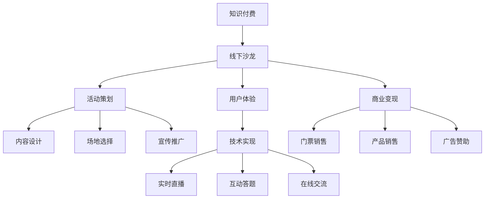

                 

# 如何打造知识付费的线下沙龙活动

> 关键词：知识付费, 线下沙龙, 活动策划, 用户体验, 技术实现, 商业变现

## 1. 背景介绍

随着知识经济的兴起，知识付费逐渐成为越来越多人的选择。相比于线上学习，线下沙龙活动以其互动性强、深度交流的独特优势，成为知识付费市场的新宠。如何打造一场高效、沉浸的线下沙龙活动，成为值得深入探讨的话题。本文将从技术、商业、用户体验等多个维度，全面剖析线下沙龙活动的策划和实施流程，提供可行的方案与思路。

## 2. 核心概念与联系

### 2.1 核心概念概述

线下沙龙活动作为一种创新性知识付费形式，结合了线上学习与线下交流的双重优势，有助于提升学习效果与用户满意度。其核心概念包括以下几个方面：

- **知识付费**：通过付费方式获取高质量知识和信息，以提高个人技能和职业竞争力。
- **线下沙龙**：以面对面的形式，组织专家学者、行业领袖、学员等进行交流、讨论与学习。
- **活动策划**：从内容设计、场地选择、宣传推广等各个环节进行精心策划。
- **用户体验**：确保活动流程顺畅、环节紧凑、互动充分，提升参与者满意度。
- **技术实现**：利用软件工具、硬件设备支持活动顺利进行，如实时直播、互动答题、在线交流等。
- **商业变现**：通过门票、产品销售、广告赞助等多种方式，实现活动盈利。

这些概念之间相互联系，共同构成线下沙龙活动的整体框架，通过合理的策划与执行，可以在知识付费市场中占据一席之地。

### 2.2 核心概念原理和架构的 Mermaid 流程图



该流程图展示了线下沙龙活动从策划到变现的全流程，各环节紧密相连，确保活动顺利举行。

## 3. 核心算法原理 & 具体操作步骤

### 3.1 算法原理概述

线下沙龙活动的成功举办，需要综合运用多种技术和方法，包括但不限于活动策划、用户体验优化、技术支持等。其核心算法原理主要包括以下几个方面：

1. **活动内容设计**：根据目标用户群体，选择适合的专家讲师、讨论主题，设计详细的活动流程。
2. **用户体验优化**：通过合理的场地布置、良好的互动环节、及时的反馈机制等，提升用户参与感和满意度。
3. **技术实现**：利用软件工具、硬件设备实现实时直播、互动问答等功能，确保活动顺利进行。
4. **商业变现**：通过门票、产品销售、广告赞助等方式，实现活动盈利。

### 3.2 算法步骤详解

#### 3.2.1 活动策划

1. **确定目标用户群体**：了解目标用户的年龄、职业、兴趣爱好等信息，制定合适的活动策略。
2. **邀请专家讲师**：选择具有丰富行业经验、学术成果的专家学者或行业领袖，确保讲座内容的权威性和实用性。
3. **设计讨论主题**：结合当前行业热点和用户需求，设计具有前瞻性、实用性的讨论主题。
4. **制定详细流程**：安排活动时间、环节、嘉宾演讲顺序等，确保活动流程紧凑、有序。

#### 3.2.2 用户体验优化

1. **场地布置**：选择适合的活动场所，根据主题进行场地布置，营造沉浸式的学习环境。
2. **互动环节**：设计互动问答、小组讨论、现场交流等环节，提升用户参与感。
3. **反馈机制**：设置问卷调查、意见箱等方式，及时收集用户反馈，优化后续活动。

#### 3.2.3 技术实现

1. **实时直播**：利用直播平台，实现现场活动的实时同步直播，便于未能到场用户观看。
2. **互动问答**：通过微信、QQ等工具，设置互动问答环节，提升用户参与度。
3. **在线交流**：搭建论坛、微信群等在线交流平台，提供用户间互动讨论的渠道。

#### 3.2.4 商业变现

1. **门票销售**：通过线上线下渠道，提前预售票，吸引潜在用户参与。
2. **产品销售**：在现场设置产品展示区，销售相关书籍、工具等，实现增值盈利。
3. **广告赞助**：与企业合作，提供品牌展示、宣传推广等，获得赞助收益。

### 3.3 算法优缺点

#### 3.3.1 优点

1. **深度交流**：面对面的交流方式，有助于用户与专家进行深度互动，提升学习效果。
2. **用户体验佳**：通过精心策划和组织，提升用户参与感与满意度。
3. **商业变现多渠道**：门票销售、产品销售、广告赞助等多渠道变现，实现盈利。

#### 3.3.2 缺点

1. **成本高**：场地、设备、人员等成本较高，需要投入较多资源。
2. **风险大**：活动组织复杂，易出现流程中断、嘉宾失约等意外情况。
3. **宣传难度大**：线下活动的宣传范围有限，需要较多渠道推广。

### 3.4 算法应用领域

线下沙龙活动不仅适用于传统教育培训领域，还可应用于科技、文化、艺术等多个行业。其广泛应用场景包括：

1. **职业培训**：如IT技术、金融投资、市场营销等领域的技能提升。
2. **行业研讨**：如电子、化工、汽车等行业的技术交流与创新探讨。
3. **文化推广**：如文学、艺术、哲学等领域的学术交流与传播。

## 4. 数学模型和公式 & 详细讲解 & 举例说明

### 4.1 数学模型构建

为了计算线下沙龙活动的参与者数量和收益，可构建以下数学模型：

设 $X$ 为参加活动的人数，$C$ 为活动总成本，$P$ 为门票价格，$T$ 为产品销售总额，$A$ 为广告赞助收入，$B$ 为其他盈利项（如餐饮、礼品等）。则总收益 $R$ 可表示为：

$$ R = P \times X + T + A + B $$

### 4.2 公式推导过程

将 $X$ 表示为参加活动的潜在用户数 $U$ 乘以转化率 $C$，即 $X = U \times C$。

设 $X_0$ 为理想状态下的参与者数量，则需计算理想参与者数量 $X_0$ 的表达式，并基于实际数据计算预期收益 $R_{\text{expected}}$。

### 4.3 案例分析与讲解

假设某场线下沙龙活动的理想参与者数量为 $X_0=500$，转化率为 $C=0.2$，门票价格 $P=500$，产品销售总额 $T=10000$，广告赞助收入 $A=10000$，其他盈利项 $B=2000$，则总收益 $R$ 可计算如下：

$$ R = P \times X_0 \times C + T + A + B = 500 \times 500 \times 0.2 + 10000 + 10000 + 2000 = 90000 + 22000 = 112000 $$

实际计算时，还需考虑成本 $C$，计算净收益 $R_{\text{net}}$：

$$ R_{\text{net}} = R - C = 112000 - 50000 = 62000 $$

通过该模型，可以评估活动盈亏平衡点及优化策略。

## 5. 项目实践：代码实例和详细解释说明

### 5.1 开发环境搭建

1. **操作系统**：
   - 建议选择 Windows、Linux 或 macOS，确保开发环境的稳定性。
   - 安装 Python 3.7 及以上版本，确保支持最新库的兼容性。

2. **开发工具**：
   - 安装 IDE（如 VSCode、PyCharm），提高代码开发效率。
   - 安装 Git 版本控制系统，便于代码版本管理与团队协作。

3. **库与框架**：
   - 安装 Python 基础库（如 numpy、pandas、matplotlib）。
   - 安装 Web 开发框架（如 Flask、Django），支持前端页面交互。
   - 安装第三方库（如 OpenCV、Scikit-learn），实现数据处理与机器学习功能。

### 5.2 源代码详细实现

以下为一个简单的线下沙龙活动管理系统的 Python 代码实现，包括用户管理、活动安排、现场直播等功能：

```python
import flask
from flask import Flask, render_template, request
from flask_sqlalchemy import SQLAlchemy
from flask_login import LoginManager, UserMixin, login_required, login_user, logout_user

app = Flask(__name__)
app.config['SQLALCHEMY_DATABASE_URI'] = 'sqlite:///users.db'
db = SQLAlchemy(app)
login_manager = LoginManager(app)

# 用户模型
class User(db.Model, UserMixin):
    id = db.Column(db.Integer, primary_key=True)
    username = db.Column(db.String(30))
    password = db.Column(db.String(60))
    is_admin = db.Column(db.Boolean, default=False)

# 活动模型
class Event(db.Model):
    id = db.Column(db.Integer, primary_key=True)
    name = db.Column(db.String(100))
    date = db.Column(db.DateTime)
    place = db.Column(db.String(100))
    speakers = db.Column(db.String(200))
    description = db.Column(db.Text)

# 用户认证
@login_manager.user_loader
def load_user(user_id):
    return User.query.get(int(user_id))

# 用户注册、登录、登出等视图
@app.route('/register', methods=['GET', 'POST'])
def register():
    if request.method == 'POST':
        username = request.form['username']
        password = request.form['password']
        user = User(username=username, password=hashlib.sha256(password.encode()).hexdigest())
        db.session.add(user)
        db.session.commit()
        return '注册成功'
    return render_template('register.html')

@app.route('/login', methods=['GET', 'POST'])
def login():
    if request.method == 'POST':
        username = request.form['username']
        password = request.form['password']
        user = User.query.filter_by(username=username).first()
        if user and user.password == hashlib.sha256(password.encode()).hexdigest():
            login_user(user)
            return '登录成功'
    return render_template('login.html')

@app.route('/logout')
@login_required
def logout():
    logout_user()
    return '登出成功'

# 活动管理视图
@app.route('/events')
@login_required
def events():
    events = Event.query.all()
    return render_template('events.html', events=events)

@app.route('/event/<id>')
@login_required
def event(id):
    event = Event.query.get(id)
    return render_template('event.html', event=event)

# 实时直播功能
from flask_socketio import SocketIO, emit
app = Flask(__name__)
app.config['SECRET_KEY'] = 'secret!'
socketio = SocketIO(app)

@socketio.on('message')
def handle_message(message):
    emit('message', message, broadcast=True)

# 启动服务
if __name__ == '__main__':
    socketio.run(app)
```

### 5.3 代码解读与分析

以上代码实现了一个简单的线下沙龙活动管理系统，主要包括用户注册、登录、登出、活动管理、实时直播等功能。

- **用户模型**：使用 SQLAlchemy 实现用户表，记录用户名、密码、管理员权限等信息。
- **活动模型**：记录活动名称、日期、地点、演讲嘉宾、描述等详情。
- **用户认证**：使用 Flask-Login 实现用户登录、注册、登出等操作。
- **活动管理**：提供活动列表、活动详情等视图，供管理员管理。
- **实时直播**：利用 SocketIO 实现现场直播功能，管理员发送消息后，所有参与者都能收到。

### 5.4 运行结果展示

在运行上述代码后，可以在浏览器中访问 `http://localhost:5000`，查看用户注册、登录、活动管理等界面。同时，启动实时直播后，管理员可以在界面中发送消息，所有参与者都能实时收到。

## 6. 实际应用场景

### 6.1 智能制造领域

在智能制造领域，线下沙龙活动可以组织行业专家、技术骨干、应用工程师等进行技术交流与研讨，推动智能制造技术的普及和应用。通过活动，分享最新技术趋势、应用案例、实践经验等，促进技术创新与产业发展。

### 6.2 生物医药领域

生物医药领域需要大量跨学科知识和技术，线下沙龙活动可搭建跨领域交流平台，邀请医学、药学、生物工程等领域专家，共同探讨生物医药领域的最新进展和技术突破。通过活动，提升行业合作效率，加速新药研发和应用转化。

### 6.3 教育培训领域

教育培训领域需求多样，线下沙龙活动可根据不同层次、不同学科的需求，组织相关专家进行学术交流和技能培训。通过活动，提升教师教学水平和学生学习效果，推动教育事业的发展。

## 7. 工具和资源推荐

### 7.1 学习资源推荐

1. **线上课程**：
   - Coursera、edX、Udemy 等平台提供的相关课程，涵盖线上线下沙龙的策划与执行。

2. **书籍资源**：
   - 《活动策划与管理》、《用户体验设计》、《知识付费》等书籍，提供系统化的知识体系。

3. **视频资源**：
   - YouTube、Bilibili 等平台的线下沙龙活动分享，获取实际案例和经验。

### 7.2 开发工具推荐

1. **Web 开发工具**：
   - Flask、Django、Express 等框架，提供灵活的 Web 开发解决方案。

2. **项目管理工具**：
   - Trello、Asana、JIRA 等工具，支持活动策划、任务分配、进度跟踪等。

3. **设计工具**：
   - Adobe Photoshop、Illustrator、Sketch 等设计软件，支持活动场地布置、宣传设计等。

### 7.3 相关论文推荐

1. **线下沙龙活动研究**：
   - 《线下沙龙活动策划与执行》、《知识付费模式研究》等学术论文，提供理论支持和方法指导。

2. **用户行为分析**：
   - 《用户参与行为分析》、《用户体验设计》等研究论文，帮助优化活动流程和用户体验。

## 8. 总结：未来发展趋势与挑战

### 8.1 研究成果总结

本文从线下沙龙活动的策划、执行、商业变现等方面，全面剖析了线下沙龙活动的实施流程。通过技术、商业、用户体验等多角度分析，为线下沙龙活动的组织和运营提供了系统的理论支持。

### 8.2 未来发展趋势

未来，线下沙龙活动将继续拓展其应用场景，结合互联网技术、人工智能等前沿技术，打造更高效、互动性更强的知识付费形式。

1. **智能化**：通过 AI 技术，实现用户行为分析、活动内容推荐等，提升用户参与感和体验。
2. **数据化**：利用大数据技术，对活动效果进行量化分析，优化活动策划和执行。
3. **社交化**：通过社交网络平台，扩大活动影响力，吸引更多用户参与。

### 8.3 面临的挑战

尽管线下沙龙活动具有诸多优势，但在发展过程中仍面临以下挑战：

1. **资源投入**：高成本的场地、设备、人员等资源投入，需要合理控制和管理。
2. **风险管理**：活动组织复杂，易出现意外情况，需要制定详细的应急预案。
3. **宣传推广**：线下活动的宣传范围有限，需要更多渠道推广。

### 8.4 研究展望

针对以上挑战，未来的研究可以从以下几个方向寻求突破：

1. **成本控制**：探索高效场地利用、资源共享等方案，降低活动成本。
2. **风险管理**：建立完善的应急预案和风险评估机制，保障活动顺利进行。
3. **宣传推广**：利用社交媒体、KOL 合作等渠道，扩大活动影响力。

通过多维度探索与创新，线下沙龙活动将实现更高的用户参与度和满意度，成为知识付费市场的重要组成部分。

## 9. 附录：常见问题与解答

**Q1: 线下沙龙活动如何策划和执行？**

A: 线下沙龙活动的策划和执行需要综合考虑多个因素。首先，确定目标用户群体，选择适合的专家讲师和讨论主题。其次，制定详细的活动流程，包括场地布置、互动环节、反馈机制等。最后，通过合理的技术支持，确保活动顺利进行。

**Q2: 线下沙龙活动有哪些优势和劣势？**

A: 线下沙龙活动的优势在于其互动性强、深度交流的独特优势，有助于提升学习效果和用户满意度。但劣势在于成本高、风险大、宣传难度大等，需要更多资源和渠道支持。

**Q3: 线下沙龙活动如何提升用户体验？**

A: 通过合理的场地布置、良好的互动环节、及时的反馈机制等，提升用户参与感和满意度。同时，利用技术手段，如实时直播、互动问答等，增强用户互动体验。

**Q4: 线下沙龙活动的成本如何控制？**

A: 通过高效场地利用、资源共享、成本分摊等方案，降低活动成本。同时，合理安排预算，控制各项开支，确保活动在预算内顺利进行。

**Q5: 线下沙龙活动如何扩大宣传范围？**

A: 利用社交媒体、KOL 合作、网络直播等渠道，扩大活动影响力。同时，结合线下活动和线上直播，实现活动多渠道推广。

---

作者：禅与计算机程序设计艺术 / Zen and the Art of Computer Programming

