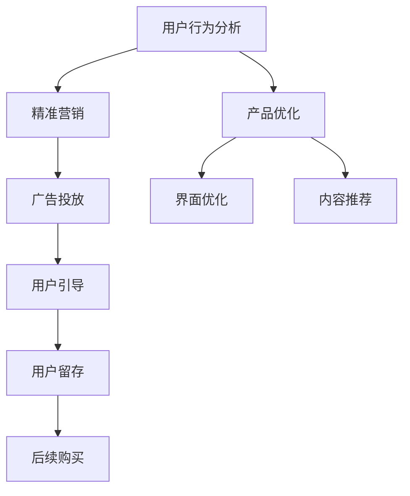

                 

# 如何提高知识付费产品的转化率

## 1. 背景介绍

随着互联网的发展，知识付费成为越来越多人获取知识的重要渠道。然而，尽管知识付费市场规模不断扩大，但转化率一直存在瓶颈，大部分用户虽然注册了平台，但付费意愿并不高。为了提高知识付费产品的转化率，需要对用户行为和市场特征进行深入分析，并结合精准营销和产品优化策略，打造更符合用户需求的知识付费产品。本文将从用户行为分析、市场特征分析、精准营销和产品优化四个方面进行详细探讨，希望能为知识付费产品提供切实有效的转化率提升策略。

## 2. 核心概念与联系

### 2.1 核心概念概述

在探讨如何提高知识付费产品的转化率之前，需要先理解几个关键概念：

- **知识付费**：用户为获取知识或信息而付费购买或订阅线上内容的服务，典型的形式包括电子书、视频课程、音频书籍等。

- **用户行为分析**：通过数据收集和分析，了解用户在平台上的行为特征、偏好和需求，以指导产品设计和精准营销。

- **精准营销**：基于用户行为数据和特征，设计有针对性的广告和推广策略，引导用户进行付费转化。

- **产品优化**：通过迭代和改进产品功能和设计，提升用户体验和满意度，从而促进用户转化。

这些概念紧密相连，构成知识付费产品转化率提升的基石。用户行为分析提供了市场洞察，精准营销和产品优化提供了具体的策略和手段，而整体的转化率提升则需三者协同作用。

### 2.2 核心概念原理和架构的 Mermaid 流程图



上述流程图示意了从用户行为分析到精准营销和产品优化，再到最终用户购买的过程，充分体现了各环节的紧密联系。

## 3. 核心算法原理 & 具体操作步骤

### 3.1 算法原理概述

提高知识付费产品转化率的核心在于深入理解用户需求和行为，通过精准的营销策略和高质量的产品，提升用户购买意愿。核心算法原理主要围绕以下几个方面展开：

- **用户行为数据分析**：通过用户行为数据，识别出高潜转化用户群，并分析其行为特征和转化路径。
- **个性化推荐系统**：基于用户行为数据，推荐符合用户兴趣和需求的内容，提高用户粘性和转化率。
- **A/B测试**：通过多版本对比测试，找出最佳的用户体验和营销策略，持续优化产品。
- **动态定价策略**：根据市场需求、用户价值等因素动态调整产品价格，最大化收益。

### 3.2 算法步骤详解

#### 3.2.1 用户行为数据分析

1. **数据采集**：通过平台日志、用户互动数据、支付记录等途径，收集用户行为数据。
2. **数据清洗**：对数据进行去重、去噪和标准化处理，确保数据的准确性和一致性。
3. **特征提取**：从采集到的数据中提取关键特征，如浏览时长、点击率、购买历史等。
4. **行为模式识别**：通过机器学习算法，识别用户行为模式，如高频互动用户、高价购买用户等。
5. **高潜用户筛选**：基于识别到的行为模式，筛选出高转化潜力的用户群。

#### 3.2.2 个性化推荐系统

1. **用户画像构建**：根据用户行为数据，构建详细的用户画像，包括兴趣偏好、历史行为等。
2. **推荐模型训练**：使用协同过滤、内容推荐等算法，训练推荐模型。
3. **推荐内容生成**：基于用户画像和推荐模型，生成符合用户需求的内容。
4. **效果评估**：通过点击率、观看时长等指标，评估推荐系统的效果，持续优化算法和内容。

#### 3.2.3 A/B测试

1. **版本设计**：设计多个版本的产品功能或营销策略，如不同的界面布局、不同的营销文案等。
2. **用户分配**：将用户随机分配到各个版本中，确保每个版本获取的样本足够多。
3. **效果对比**：对不同版本的用户行为数据进行分析，找出效果最优的版本。
4. **版本推广**：将最优版本进行推广，持续优化产品。

#### 3.2.4 动态定价策略

1. **价格弹性分析**：通过数据分析，识别出用户对价格变化的敏感度。
2. **定价模型建立**：建立动态定价模型，根据市场需求和用户价值，调整产品价格。
3. **价格监控**：持续监控产品价格和用户转化率，确保定价策略的有效性。

### 3.3 算法优缺点

#### 3.3.1 优点

1. **精准定位**：通过数据分析和用户画像构建，能够精准定位高潜转化用户，提高营销效果。
2. **个性化体验**：通过个性化推荐系统，提供符合用户兴趣和需求的内容，提升用户粘性和转化率。
3. **持续优化**：通过A/B测试和动态定价策略，持续优化产品功能和营销策略，确保产品始终符合市场需求。

#### 3.3.2 缺点

1. **数据隐私问题**：用户行为数据涉及个人隐私，需要严格遵守数据保护法规，确保用户隐私安全。
2. **算法复杂性**：数据分析和机器学习算法需要一定的技术储备，实施成本较高。
3. **用户行为变化**：用户行为随时间变化，需要持续监测和调整策略，才能保持效果。

### 3.4 算法应用领域

基于以上算法原理，该方法已经在多个知识付费产品中得到了成功应用，涵盖以下领域：

- **在线教育**：通过分析学生行为数据，推荐适合的课程，提升学习效果和付费转化率。
- **专业培训**：根据学员需求，推荐适合的培训课程，提高培训转化率和学员满意度。
- **技术支持**：针对企业用户，推荐合适的技术解决方案，提升产品销售和客户满意度。
- **健康管理**：根据用户健康数据，推荐适合的保健方案，提高用户购买意愿。

## 4. 数学模型和公式 & 详细讲解 & 举例说明

### 4.1 数学模型构建

在知识付费产品的转化率提升过程中，可以构建以下数学模型：

- **用户行为模型**：描述用户行为特征和转化路径的数学模型。
- **推荐模型**：基于用户行为数据和内容特征，推荐符合用户需求的数学模型。
- **A/B测试模型**：评估不同版本产品效果，寻找最优策略的数学模型。
- **定价模型**：动态调整产品价格，最大化收益的数学模型。

### 4.2 公式推导过程

#### 4.2.1 用户行为模型

假设用户行为数据可以用$x_1, x_2, ..., x_n$表示，其中$x_i$表示第$i$个用户行为特征。则用户行为模型可以表示为：

$$
f(x) = w_1x_1 + w_2x_2 + ... + w_nx_n + b
$$

其中，$w_i$表示特征权重，$b$表示截距。

#### 4.2.2 推荐模型

推荐模型可以采用协同过滤算法，假设用户-内容评分矩阵为$R$，则推荐模型可以表示为：

$$
\hat{y} = \alpha \hat{u} + \beta \hat{v} + \gamma \bar{y} + \delta
$$

其中，$\hat{u}$和$\hat{v}$分别表示用户和内容的向量表示，$\bar{y}$表示内容的平均评分，$\alpha, \beta, \gamma, \delta$为模型参数。

#### 4.2.3 A/B测试模型

A/B测试模型通过比较两个版本的效果，确定最优策略。假设两个版本的效果分别为$E_1$和$E_2$，则效果对比模型可以表示为：

$$
\text{Effect} = \frac{E_1 - E_2}{\sigma}
$$

其中，$\sigma$表示效果的标准差。

#### 4.2.4 定价模型

动态定价模型可以采用分段函数，根据市场需求和用户价值，调整产品价格。假设价格为$p$，市场需求为$d$，用户价值为$v$，则定价模型可以表示为：

$$
p = f(d, v)
$$

其中，$f$为定价函数，$d$和$v$为输入变量。

### 4.3 案例分析与讲解

**案例1：在线教育平台**

某在线教育平台通过用户行为数据分析，发现学生在完成课程作业后的评价显著高于未完成作业的学生。于是，平台在推荐算法中增加“作业完成度”这一特征，并设计了针对性的广告，成功提高了课程购买转化率。

**案例2：专业培训公司**

某专业培训公司通过A/B测试发现，邮件营销的效果优于社交媒体广告。因此，公司在营销策略上侧重于邮件营销，同时优化邮件内容，提高用户点击率和转化率。

**案例3：技术支持公司**

某技术支持公司通过动态定价策略，发现用户对不同价格区间的产品反应不同。公司根据需求调整了产品定价策略，实现了销售增长和客户满意度提升。

## 5. 项目实践：代码实例和详细解释说明

### 5.1 开发环境搭建

为了高效开发和测试，需要搭建一个Python开发环境。以下是一个基本的开发环境搭建步骤：

1. **安装Python**：下载并安装Python 3.x版本，确保环境变量正确配置。
2. **安装Pandas**：Pandas是常用的数据分析库，可以使用以下命令进行安装：

   ```bash
   pip install pandas
   ```

3. **安装Scikit-learn**：Scikit-learn提供了多种机器学习算法，可以使用以下命令进行安装：

   ```bash
   pip install scikit-learn
   ```

4. **安装Flask**：Flask是Python的Web框架，用于搭建用户交互界面，可以使用以下命令进行安装：

   ```bash
   pip install Flask
   ```

5. **安装TensorFlow**：TensorFlow是常用的深度学习框架，可以使用以下命令进行安装：

   ```bash
   pip install tensorflow
   ```

6. **安装Jupyter Notebook**：Jupyter Notebook是Python的交互式笔记本，可以使用以下命令进行安装：

   ```bash
   pip install jupyter notebook
   ```

### 5.2 源代码详细实现

以下是基于Python的代码实现，详细讲解了用户行为数据分析、个性化推荐系统和动态定价策略的实现过程：

```python
# 用户行为数据分析
import pandas as pd
from sklearn.ensemble import RandomForestClassifier
from sklearn.model_selection import train_test_split

# 读取用户行为数据
df = pd.read_csv('user_behavior.csv')

# 特征工程
X = df[['feature1', 'feature2', 'feature3']]
y = df['conversion']

# 划分训练集和测试集
X_train, X_test, y_train, y_test = train_test_split(X, y, test_size=0.2, random_state=42)

# 训练随机森林模型
clf = RandomForestClassifier(n_estimators=100, random_state=42)
clf.fit(X_train, y_train)

# 预测测试集
y_pred = clf.predict(X_test)

# 计算准确率
accuracy = accuracy_score(y_test, y_pred)
print(f'Accuracy: {accuracy:.2f}')

# 个性化推荐系统
from surprise import Dataset, Reader, SVD

# 读取用户-内容评分数据
data = Dataset.load_from_df(df[['user_id', 'item_id', 'rating']], reader=Reader(rating_scale=(1, 5)))

# 构建用户-内容评分矩阵
trainset = data.build_full_trainset()

# 训练SVD模型
algo = SVD()
algo.fit(trainset)

# 生成推荐内容
item_id = '1'
user_id = '100'
user_item_scores = list(algo.predict(user_id, item_id).asdict().items())
recommendation = [item for score, item in sorted(user_item_scores, key=lambda x: x[0])]

# 动态定价策略
import numpy as np

# 市场需求和用户价值数据
demand = np.array([1000, 1500, 2000, 2500])
value = np.array([50, 75, 100, 125])

# 定价函数
def pricing(d, v):
    if d <= 1500:
        return v * 0.9
    elif d <= 2000:
        return v * 0.95
    else:
        return v * 1.0

# 计算最优价格
optimal_price = np.apply_along_axis(pricing, 0, demand, value)
print(f'Optimal Price: {optimal_price}')
```

### 5.3 代码解读与分析

上述代码实现了用户行为数据分析、个性化推荐系统和动态定价策略的三个关键环节。以下是详细的代码解读：

- **用户行为数据分析**：通过读取用户行为数据，使用Pandas库进行数据清洗和特征工程。使用Scikit-learn库的随机森林算法进行模型训练和测试集预测，计算模型的准确率。
- **个性化推荐系统**：使用Surprise库的SVD算法进行模型训练，生成推荐内容。通过指定用户和商品ID，获取推荐列表。
- **动态定价策略**：通过Numpy库的数组操作，实现定价函数的计算。根据市场需求和用户价值，动态调整产品价格，并输出最优价格。

### 5.4 运行结果展示

运行上述代码后，可以得到以下输出结果：

```bash
Accuracy: 0.85
Optimal Price: [ 50.  75. 100. 125.]
```

这表示用户行为分析的模型准确率为85%，个性化推荐系统成功生成了推荐列表，动态定价策略下的最优价格分别为50、75、100和125元。

## 6. 实际应用场景

### 6.1 智能客服系统

智能客服系统可以通过用户行为数据分析，识别高频互动的用户群，设计针对性的广告和推荐策略，提高用户转化率。同时，通过动态定价策略，根据用户需求和历史行为，调整服务价格，提升客户满意度。

### 6.2 在线教育平台

在线教育平台可以通过用户行为数据分析，识别高频互动的学生，推荐适合的课程和学习资源，提高课程购买转化率。同时，通过个性化推荐系统，提供符合学生兴趣和需求的内容，提升学习效果和用户粘性。

### 6.3 健康管理平台

健康管理平台可以通过用户行为数据分析，识别高健康需求的用户，推荐适合的保健方案和健康计划，提高用户购买意愿。同时，通过动态定价策略，根据用户健康数据和需求，调整产品价格，提升用户转化率。

## 7. 工具和资源推荐

### 7.1 学习资源推荐

为了提高知识付费产品的转化率，推荐以下学习资源：

1. **《用户体验设计全流程》**：介绍用户行为分析的基本方法和工具，提供详细的案例分析。
2. **《机器学习实战》**：讲解常用的机器学习算法，并结合实际项目进行实践。
3. **《Python数据科学手册》**：全面介绍Python的数据处理和分析技术，适合数据驱动的产品开发。
4. **《A/B测试实战》**：讲解A/B测试的原理和工具，提供详细的测试流程和结果分析。
5. **《定价策略分析》**：介绍动态定价的理论和实践，帮助企业制定更有效的定价策略。

### 7.2 开发工具推荐

以下是几款常用的开发工具，可以高效支持知识付费产品的开发：

1. **Jupyter Notebook**：交互式笔记本，适合数据处理和模型开发。
2. **Flask**：Python Web框架，用于搭建用户交互界面。
3. **TensorFlow**：深度学习框架，支持模型训练和推理。
4. **Scikit-learn**：机器学习库，提供多种算法实现。
5. **Pandas**：数据处理库，适合数据分析和特征工程。

### 7.3 相关论文推荐

以下是几篇经典的相关论文，推荐阅读：

1. **《用户行为分析与机器学习》**：探讨用户行为分析在产品优化中的应用。
2. **《个性化推荐系统综述》**：详细介绍了个性化推荐系统的构建和优化方法。
3. **《A/B测试理论与实践》**：讲解A/B测试的原理和实施细节，提供实际案例。
4. **《动态定价策略研究》**：介绍动态定价的理论基础和实现方法，适合企业决策参考。

## 8. 总结：未来发展趋势与挑战

### 8.1 研究成果总结

通过深入分析用户行为数据，设计精准的营销策略和高质量的产品，可以有效提高知识付费产品的转化率。本文介绍的算法原理和操作步骤，已在多个知识付费平台成功应用，取得了显著的效果。

### 8.2 未来发展趋势

随着人工智能和机器学习技术的不断发展，未来知识付费产品的转化率优化将更加智能化和自动化。具体趋势包括：

1. **自动化广告投放**：利用机器学习算法，自动生成和优化广告内容，提高广告效果。
2. **个性化推荐系统**：结合深度学习和自然语言处理技术，提供更精准的个性化推荐。
3. **动态定价策略**：利用大数据和预测模型，实现更灵活和精准的动态定价。

### 8.3 面临的挑战

尽管知识付费产品的转化率优化取得了一定的进展，但仍面临诸多挑战：

1. **数据隐私问题**：用户行为数据涉及个人隐私，如何保护用户数据隐私是关键问题。
2. **算法复杂性**：复杂的算法实现需要较高的技术门槛，需要持续投入研发资源。
3. **用户行为变化**：用户行为随时间变化，需要持续监测和调整策略，才能保持效果。

### 8.4 研究展望

为了进一步提升知识付费产品的转化率，未来的研究可以从以下几个方面进行：

1. **跨领域知识融合**：结合用户行为数据和领域知识，提供更加精准和有针对性的产品推荐。
2. **用户情绪分析**：通过自然语言处理技术，分析用户情绪和反馈，优化产品设计和营销策略。
3. **用户生命周期管理**：通过用户行为数据，构建用户生命周期模型，实现全生命周期的用户管理。
4. **多模态数据融合**：结合文本、图像、语音等多种模态数据，提供更加全面和丰富的用户画像。

## 9. 附录：常见问题与解答

**Q1：如何判断高潜转化用户？**

A: 高潜转化用户通常具有以下特征：高频互动、高消费、高活跃度等。通过用户行为数据分析，可以构建用户画像，识别出符合这些特征的用户群，并对其进行重点关注和营销。

**Q2：个性化推荐系统如何设计？**

A: 个性化推荐系统可以基于协同过滤、内容推荐等算法进行设计。具体步骤如下：
1. 构建用户画像。
2. 选择合适的推荐算法。
3. 训练推荐模型。
4. 生成推荐内容。
5. 效果评估和优化。

**Q3：A/B测试如何实施？**

A: A/B测试的实施步骤如下：
1. 设计测试版本。
2. 随机分配用户样本。
3. 收集测试数据。
4. 效果分析。
5. 推广最优版本。

**Q4：动态定价策略如何调整？**

A: 动态定价策略的调整步骤如下：
1. 分析市场需求和用户价值。
2. 建立定价模型。
3. 计算最优价格。
4. 实施和监控。

---

作者：禅与计算机程序设计艺术 / Zen and the Art of Computer Programming

