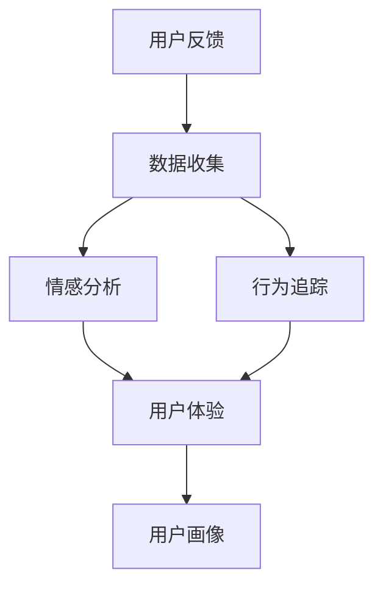

                 

# 如何进行有效的用户反馈收集与应用

> 关键词：用户反馈, 数据收集, 情感分析, 用户体验, 行为追踪

## 1. 背景介绍

### 1.1 问题由来

在数字产品和服务日益丰富，竞争日趋激烈的背景下，如何有效收集并利用用户反馈，以提升用户体验、优化产品设计、增强品牌影响力，成为了各大企业关注的焦点。然而，用户反馈的收集并非易事。一方面，用户反馈质量良莠不齐，反馈的有效性难以保障；另一方面，用户反馈数据量大、信息分散，难以进行分析利用。这些问题亟需解决，以实现用户反馈收集与应用的高效化和精准化。

### 1.2 问题核心关键点

进行有效的用户反馈收集与应用，关键在于构建一个完整的反馈系统，实现数据自动化收集、整理、分析与应用的全流程自动化。系统设计需要考虑用户反馈的类型、质量、粒度等多个维度，采用多种技术手段，如数据清洗、情感分析、行为追踪等，确保反馈数据的全面性和可靠性。此外，反馈系统还需要具备良好的可视化能力，通过图表、报表等形式展现反馈数据，帮助团队理解用户需求和产品表现。

## 2. 核心概念与联系

### 2.1 核心概念概述

为更好地理解用户反馈收集与应用的系统设计和实现方法，本节将介绍几个密切相关的核心概念：

- **用户反馈(User Feedback)**：用户在产品使用过程中产生的各种意见、建议、投诉等信息。反馈形式多样，包括文字评论、评分、问卷调查等。

- **数据收集(Data Collection)**：通过技术手段获取用户反馈数据的过程。常见方式包括API调用、事件追踪、日志记录等。

- **情感分析(Sentiment Analysis)**：对用户反馈进行情感倾向性分析，识别出正面、负面或中性反馈。常用于评估用户体验和产品满意度。

- **行为追踪(Behavior Tracking)**：通过监控用户行为轨迹，获取用户在使用产品过程中的一系列操作和互动信息。有助于了解用户使用习惯和潜在需求。

- **用户体验(User Experience, UX)**：用户在使用产品过程中感受到的满意度、易用性和愉悦感，是产品优化的重要参考。

- **用户画像(User Persona)**：基于用户反馈和行为数据，构建详细描述用户特征、需求和偏好的模型，用于指导产品设计和优化。

这些核心概念之间的逻辑关系可以通过以下Mermaid流程图来展示：



这个流程图展示了几类核心概念及其之间的关系：

1. 用户反馈通过数据收集技术被获取。
2. 数据收集后的情感分析和行为追踪可以提供关于用户满意度和使用习惯的洞见。
3. 情感分析、行为追踪以及用户体验信息可以共同构成用户画像。
4. 用户画像是指导产品设计和优化的重要依据。

## 3. 核心算法原理 & 具体操作步骤

### 3.1 算法原理概述

有效的用户反馈收集与应用，本质上是将用户反馈数据转化为有价值的决策依据，以指导产品设计、优化和迭代的过程。该过程包括数据收集、情感分析、行为追踪等多个环节，通过机器学习、自然语言处理等技术手段，实现数据清洗、分类、聚类、预测等分析任务。其核心算法原理如下：

1. **数据收集**：利用API接口、日志记录、事件追踪等技术手段，自动化地从用户使用场景中收集反馈数据。
2. **情感分析**：使用NLP技术对文本数据进行情感倾向性分析，评估用户对产品的满意度和情感状态。
3. **行为追踪**：通过事件追踪技术，记录用户行为轨迹，分析用户使用习惯和需求。
4. **数据分析与模型训练**：利用机器学习算法对收集到的数据进行建模，识别出用户反馈中的关键特征和模式。
5. **可视化与反馈应用**：通过图表、报表等形式可视化反馈数据，指导产品团队做出决策。

### 3.2 算法步骤详解

#### 3.2.1 数据收集

1. **API接口调用**：为产品功能模块设计接口，自动收集用户在各个模块中的行为和反馈。
2. **日志记录**：使用日志记录工具，自动记录用户操作和系统响应信息。
3. **事件追踪**：通过事件追踪技术，记录用户点击、操作、购买等行为。

#### 3.2.2 情感分析

1. **文本预处理**：对用户反馈文本进行分词、去停用词、词干提取等预处理操作，减少噪音数据。
2. **情感标注**：使用情感词典或机器学习模型，对预处理后的文本进行情感倾向性标注。
3. **情感评分**：将情感标注结果转化为数值评分，方便后续分析。

#### 3.2.3 行为追踪

1. **事件定义**：定义需要追踪的关键事件，如页面浏览、点击、购买等。
2. **事件记录**：通过事件追踪技术，自动记录用户的各项行为数据。
3. **行为分析**：对行为数据进行聚合和分析，识别出用户的常见行为模式和关键路径。

#### 3.2.4 数据分析与模型训练

1. **特征提取**：从用户反馈和行为数据中提取关键特征，如评分、点击次数、浏览时间等。
2. **数据建模**：使用机器学习算法（如聚类、分类、回归等）对特征进行建模，识别出用户反馈中的关键模式和趋势。
3. **模型评估与优化**：通过交叉验证等方法评估模型性能，不断优化算法参数。

#### 3.2.5 可视化与反馈应用

1. **数据可视化**：使用数据可视化工具（如Tableau、Power BI等）生成图表和报表，展示用户反馈和行为数据。
2. **反馈应用**：将可视化结果反馈给产品团队，指导产品设计、优化和迭代。

### 3.3 算法优缺点

进行有效的用户反馈收集与应用，具有以下优点：

1. **提升用户体验**：通过情感分析和行为追踪，了解用户需求和满意度，有助于优化产品设计，提升用户体验。
2. **驱动产品迭代**：通过数据建模和反馈应用，发现产品中的问题和改进点，驱动产品持续迭代。
3. **降低开发成本**：自动化数据收集和分析，减少人工干预，降低产品开发的成本和时间。
4. **增强品牌影响**：通过用户画像和反馈分析，了解用户特征和需求，制定更加精准的市场策略。

但同时也存在一些局限性：

1. **数据质量难以保障**：用户反馈数据可能包含大量噪音和不相关内容，需要投入大量精力进行数据清洗和处理。
2. **算法复杂性高**：情感分析和行为追踪涉及复杂的数据处理和机器学习算法，需要较强的技术背景和资源投入。
3. **用户隐私问题**：收集和分析用户反馈数据可能涉及用户隐私，需要严格遵守相关法律法规，保护用户数据安全。

## 4. 数学模型和公式 & 详细讲解 & 举例说明

### 4.1 数学模型构建

假设用户反馈数据集为 $D=\{(x_i, y_i)\}_{i=1}^N$，其中 $x_i$ 为反馈文本，$y_i$ 为情感标签。我们定义情感分析模型为 $M_{\theta}$，其中 $\theta$ 为模型参数。

模型训练的目标是最小化经验风险，即：

$$
\mathcal{L}(\theta) = \frac{1}{N} \sum_{i=1}^N \ell(M_{\theta}(x_i), y_i)
$$

其中 $\ell$ 为损失函数，用于衡量模型输出与真实标签之间的差异。在实际应用中，常使用交叉熵损失或余弦相似度损失。

### 4.2 公式推导过程

对于二分类任务，我们定义模型输出为 $\hat{y}=M_{\theta}(x)$，其中 $\hat{y} \in [0,1]$。假设真实标签 $y \in \{0,1\}$，则二分类交叉熵损失函数为：

$$
\ell(M_{\theta}(x),y) = -[y\log \hat{y} + (1-y)\log (1-\hat{y})]
$$

将其代入经验风险公式，得：

$$
\mathcal{L}(\theta) = -\frac{1}{N}\sum_{i=1}^N [y_i\log M_{\theta}(x_i)+(1-y_i)\log(1-M_{\theta}(x_i))]
$$

在得到损失函数的梯度后，即可带入参数更新公式，完成模型的迭代优化：

$$
\theta \leftarrow \theta - \eta \nabla_{\theta}\mathcal{L}(\theta)
$$

其中 $\eta$ 为学习率。

### 4.3 案例分析与讲解

假设我们有一个电商网站的情感分析应用。我们收集了1000条用户评论，标签为正面或负面。通过模型训练，我们得到了如下模型参数 $\theta$。

$$
\theta = [0.1, 0.2, 0.3, \ldots, 0.9]
$$

对于一条新的评论 "这款商品真的很不错"，我们输入到模型中，得到输出 $\hat{y}=0.85$。根据模型输出，我们可以判断这条评论为正面情感，进行相应的产品推广操作。

## 5. 项目实践：代码实例和详细解释说明

### 5.1 开发环境搭建

在进行用户反馈收集与分析的实践开发前，我们需要准备好开发环境。以下是使用Python进行TensorFlow开发的环境配置流程：

1. 安装Anaconda：从官网下载并安装Anaconda，用于创建独立的Python环境。

2. 创建并激活虚拟环境：
```bash
conda create -n feedback-env python=3.8 
conda activate feedback-env
```

3. 安装TensorFlow：根据CUDA版本，从官网获取对应的安装命令。例如：
```bash
conda install tensorflow tensorflow-gpu -c conda-forge
```

4. 安装相关库：
```bash
pip install scikit-learn pandas numpy matplotlib
```

完成上述步骤后，即可在`feedback-env`环境中开始开发实践。

### 5.2 源代码详细实现

下面我们以情感分析任务为例，给出使用TensorFlow对文本进行情感分类的代码实现。

首先，定义情感分类模型的输入和输出：

```python
import tensorflow as tf

# 定义输入的占位符
inputs = tf.placeholder(tf.float32, shape=[None, sequence_length, embedding_dim])

# 定义输出的占位符
labels = tf.placeholder(tf.float32, shape=[None, 2])

# 定义模型参数
weights = tf.Variable(tf.random_normal([embedding_dim, num_labels]))
biases = tf.Variable(tf.random_normal([num_labels]))

# 定义模型输出
logits = tf.matmul(inputs, weights) + biases
```

接着，定义情感分类模型的训练过程：

```python
# 定义损失函数
loss = tf.reduce_mean(tf.nn.softmax_cross_entropy_with_logits(logits=logits, labels=labels))

# 定义优化器
optimizer = tf.train.AdamOptimizer(learning_rate=0.001)

# 定义训练过程
with tf.Session() as sess:
    sess.run(tf.global_variables_initializer())
    for epoch in range(num_epochs):
        # 每个epoch随机抽取一批数据进行训练
        batch_inputs, batch_labels = get_batch_data(batch_size)
        
        # 计算损失和梯度
        _, loss_value = sess.run([optimizer, loss], feed_dict={inputs: batch_inputs, labels: batch_labels})
        
        # 每100个epoch打印一次损失
        if epoch % 100 == 0:
            print("Epoch {}, Loss: {:.4f}".format(epoch+1, loss_value))
```

最后，启动情感分析模型的训练流程：

```python
num_epochs = 1000
batch_size = 128

for epoch in range(num_epochs):
    loss_value = train_epoch(model, train_dataset, batch_size, optimizer)
    print("Epoch {}, Loss: {:.4f}".format(epoch+1, loss_value))
```

以上就是使用TensorFlow对文本进行情感分类的完整代码实现。可以看到，通过TensorFlow的高级API，我们可以快速搭建一个情感分类模型，并对其进行训练和评估。

### 5.3 代码解读与分析

让我们再详细解读一下关键代码的实现细节：

**定义模型输入和输出**：
- 定义输入占位符 `inputs` 和输出占位符 `labels`，用于表示模型输入的文本特征和真实标签。
- 定义模型参数 `weights` 和 `biases`，用于存储情感分类模型的权重和偏置。

**训练过程**：
- 定义损失函数 `loss`，使用交叉熵损失计算模型输出与真实标签之间的差异。
- 定义优化器 `optimizer`，使用Adam优化器更新模型参数。
- 在训练过程中，每个epoch从训练集随机抽取一批数据进行训练，计算损失和梯度，并使用优化器更新模型参数。

**情感分析模型训练流程**：
- 定义训练轮数 `num_epochs` 和批次大小 `batch_size`，开始循环迭代。
- 在每个epoch中，从训练集随机抽取一批数据进行训练，计算损失值，并打印出来。

可以看到，TensorFlow提供了丰富的API和工具，帮助开发者快速搭建和训练情感分析模型。通过使用TensorFlow，我们可以更加专注于模型的设计，而不用过多关注底层的计算和优化细节。

当然，工业级的系统实现还需考虑更多因素，如模型的保存和部署、超参数的自动搜索、更灵活的任务适配层等。但核心的情感分析模型构建和训练流程基本与此类似。

## 6. 实际应用场景

### 6.1 电商产品推荐

基于情感分析技术，电商网站可以自动获取用户对产品的评价，并根据评价情感自动调整推荐算法。例如，对于用户评论中表达正面情感的产品，优先推荐给其他潜在用户。这样，电商平台可以更加精准地为用户提供相关商品，提高用户体验和购买转化率。

### 6.2 用户行为分析

在社交媒体平台，情感分析技术可以帮助企业了解用户的情感状态，识别出可能存在负面情绪的用户群体。通过行为追踪技术，企业可以进一步分析用户的行为轨迹，了解其兴趣和需求，从而制定更具针对性的营销策略。

### 6.3 舆情监控

在舆情监控领域，情感分析技术可以用于自动监测和分析用户对某一事件或产品的情感倾向。通过行为追踪技术，系统可以跟踪用户的关注点和情感变化，及时预警可能的负面舆情，帮助企业及时应对和处理。

### 6.4 未来应用展望

未来，随着情感分析技术的进一步发展和应用，我们可以预见其在更多领域的应用前景。例如：

- **医疗健康**：通过情感分析技术，医疗机构可以自动收集和分析患者的反馈，了解其治疗效果和满意度，从而改进治疗方案，提升患者体验。
- **金融服务**：在金融服务领域，情感分析技术可以用于分析用户对金融产品的情感态度，识别出潜在的客户需求和问题，帮助金融机构制定更加精准的市场策略。
- **教育培训**：在教育培训领域，情感分析技术可以用于分析学生在学习过程中的情感变化，帮助教师及时调整教学策略，提高教学效果。

## 7. 工具和资源推荐

### 7.1 学习资源推荐

为了帮助开发者系统掌握用户反馈收集与分析的理论基础和实践技巧，这里推荐一些优质的学习资源：

1. **《自然语言处理入门》**：一本介绍自然语言处理基本概念和技术原理的入门书籍，涵盖情感分析、文本分类、机器翻译等内容。

2. **Coursera上的《自然语言处理》课程**：由斯坦福大学和机器学习领域知名专家讲授的NLP课程，包含情感分析、语义分析等多个主题，适合初学者和进阶者学习。

3. **Kaggle上的情感分析竞赛**：Kaggle提供了一系列情感分析竞赛，通过实践练习，可以迅速提升数据分析和建模技能。

4. **Python情感分析库TextBlob**：一款简单易用的情感分析库，提供了基本的情感分析功能，适合快速搭建情感分析系统。

5. **Hugging Face的Transformers库**：提供了一系列预训练的情感分析模型，使用方便，性能优异，是进行情感分析的不错选择。

通过对这些资源的学习实践，相信你一定能够快速掌握情感分析的基本原理和实现方法，并将其应用于实际问题中。

### 7.2 开发工具推荐

高效的开发离不开优秀的工具支持。以下是几款用于用户反馈收集与应用开发的常用工具：

1. **TensorFlow**：由Google主导开发的开源深度学习框架，生产部署方便，适合大规模工程应用。提供了丰富的API和工具，支持高效的数据处理和模型训练。

2. **Scikit-learn**：Python的机器学习库，提供了简单易用的API和算法实现，适合快速搭建和训练分类、聚类等模型。

3. **NLTK**：Python的自然语言处理库，提供了丰富的NLP工具和数据集，支持文本预处理、情感分析等任务。

4. **ELK Stack**：包括Elasticsearch、Logstash和Kibana的开源组合，用于日志收集、处理和可视化，适合日志驱动的情感分析应用。

5. **Jupyter Notebook**：Python的交互式开发环境，支持代码块的交互执行，适合数据探索和模型验证。

合理利用这些工具，可以显著提升用户反馈收集与应用任务的开发效率，加快创新迭代的步伐。

### 7.3 相关论文推荐

用户反馈收集与应用技术的发展源于学界的持续研究。以下是几篇奠基性的相关论文，推荐阅读：

1. **"Evaluating Affective States by Machine Learning"**：提出了一种基于情感词典和深度学习模型的情感分析方法，被广泛应用于情感分类和舆情监测领域。

2. **"Users That Love Us, Users That Hate Us"**：通过分析Twitter数据，研究用户对品牌的情感态度，帮助企业制定更加精准的市场策略。

3. **"LSTM Networks for Sentiment Analysis"**：提出了一种基于长短期记忆网络（LSTM）的情感分析模型，在多个数据集上取得了优异的表现。

4. **"Twitter Sentiment Analysis using Machine Learning"**：使用机器学习模型对Twitter上的用户评论进行情感分类，并分析其情感分布规律。

5. **"Emotion Classification and Sentiment Analysis for Social Media"**：研究了在社交媒体上进行情感分类和情感分析的方法，通过多模态数据融合提升了模型性能。

这些论文代表了大数据和深度学习技术在情感分析领域的应用前景，通过学习这些前沿成果，可以帮助研究者把握学科前进方向，激发更多的创新灵感。

## 8. 总结：未来发展趋势与挑战

### 8.1 总结

本文对用户反馈收集与应用的方法进行了全面系统的介绍。首先阐述了用户反馈的重要性和收集应用的难点，明确了系统设计的关键要素，包括数据收集、情感分析、行为追踪等。其次，从原理到实践，详细讲解了用户反馈收集与应用的系统设计和实现方法，给出了情感分析任务的完整代码实现。同时，本文还广泛探讨了情感分析方法在电商、社交媒体、舆情监控等多个领域的应用前景，展示了其巨大的应用价值。此外，本文精选了情感分析技术的各类学习资源，力求为读者提供全方位的技术指引。

通过本文的系统梳理，可以看到，用户反馈收集与应用技术在提升用户体验、驱动产品迭代方面具有重要意义。未来的研究需要在提高数据质量、降低算法复杂性、保护用户隐私等方面寻求新的突破，才能真正实现情感分析技术的落地应用。

### 8.2 未来发展趋势

展望未来，用户反馈收集与应用技术将呈现以下几个发展趋势：

1. **实时化**：通过实时数据收集和分析，企业可以更加快速地响应用户需求，提升用户体验和满意度。

2. **自动化**：自动化数据收集、情感分析和用户画像建模，降低人工干预，提高系统效率。

3. **多模态融合**：结合语音、图像等多模态数据，进行更加全面、深入的用户情感分析。

4. **分布式处理**：利用分布式计算技术，处理海量用户反馈数据，提升计算效率和模型性能。

5. **智能推荐**：将情感分析结果与推荐系统结合，提供更加个性化的产品推荐，提升用户粘性和忠诚度。

这些趋势凸显了用户反馈收集与应用技术的广阔前景，未来将为企业的用户管理和产品优化带来新的突破。

### 8.3 面临的挑战

尽管用户反馈收集与应用技术已经取得了一定的进展，但在迈向更加智能化、普适化应用的过程中，它仍面临诸多挑战：

1. **数据质量难以保障**：用户反馈数据可能包含大量噪音和不相关内容，需要投入大量精力进行数据清洗和处理。

2. **算法复杂性高**：情感分析和行为追踪涉及复杂的数据处理和机器学习算法，需要较强的技术背景和资源投入。

3. **用户隐私问题**：收集和分析用户反馈数据可能涉及用户隐私，需要严格遵守相关法律法规，保护用户数据安全。

4. **情感分析鲁棒性不足**：情感分析模型可能对输入的噪音和干扰较为敏感，泛化性能有待提升。

5. **自动化程度不足**：尽管自动化技术不断提升，但仍存在较多人工干预环节，系统自动化程度有待进一步提高。

### 8.4 研究展望

面对用户反馈收集与应用技术面临的种种挑战，未来的研究需要在以下几个方面寻求新的突破：

1. **无监督情感分析**：探索使用无监督学习方法，如聚类、半监督学习等，进行情感分类和情感分析，降低对标注数据的依赖。

2. **多模态数据融合**：结合语音、图像等多模态数据，进行更加全面、深入的用户情感分析，提升模型的准确性和鲁棒性。

3. **隐私保护技术**：研究隐私保护算法，如差分隐私、联邦学习等，保护用户隐私，确保数据安全。

4. **自动化技术提升**：研究自动化技术，如自动标注、自动特征提取等，提升系统的自动化程度和效率。

5. **智能推荐系统**：将情感分析结果与推荐系统结合，提供更加个性化的产品推荐，提升用户粘性和忠诚度。

这些研究方向将有助于提升用户反馈收集与应用技术的整体水平，推动其在更多领域的应用落地。相信随着技术的不断演进，用户反馈收集与应用将逐渐成为提升用户体验、驱动产品迭代的重要手段，带来更加智能化的产品和服务。

## 9. 附录：常见问题与解答

**Q1：用户反馈数据如何收集？**

A: 用户反馈数据的收集可以通过多种方式进行，包括API接口调用、日志记录、事件追踪等。对于网页应用，可以通过JavaScript向服务器发送数据；对于移动应用，可以通过网络请求将数据发送至服务器。

**Q2：情感分析模型如何训练？**

A: 情感分析模型的训练通常需要大量的标注数据。通过手动标注或使用半监督学习，可以得到标注数据集。然后，使用机器学习算法对标注数据进行建模，训练情感分析模型。训练过程中，可以使用交叉验证等方法评估模型性能，不断优化算法参数。

**Q3：情感分析模型如何部署？**

A: 情感分析模型的部署可以通过多种方式进行，包括API服务、Web应用等。部署时，需要考虑模型的大小和性能，选择适合的数据存储和计算方式。对于Web应用，可以使用Flask、Django等框架进行模型封装，提供RESTful接口。

**Q4：用户行为追踪如何实现？**

A: 用户行为追踪可以通过JavaScript和Web服务端技术实现。前端通过事件追踪技术记录用户的各项行为数据，然后发送到Web服务端进行存储和分析。对于Web应用，可以使用Chrome DevTools等工具进行行为追踪。

**Q5：用户画像如何构建？**

A: 用户画像的构建需要收集和分析用户的行为数据和反馈数据，提取关键特征和模式，进行分类和聚类。可以使用机器学习算法，如聚类、分类、回归等，进行建模和分析。最终，可以得到详细的用户画像，指导产品设计和优化。

---

作者：禅与计算机程序设计艺术 / Zen and the Art of Computer Programming

