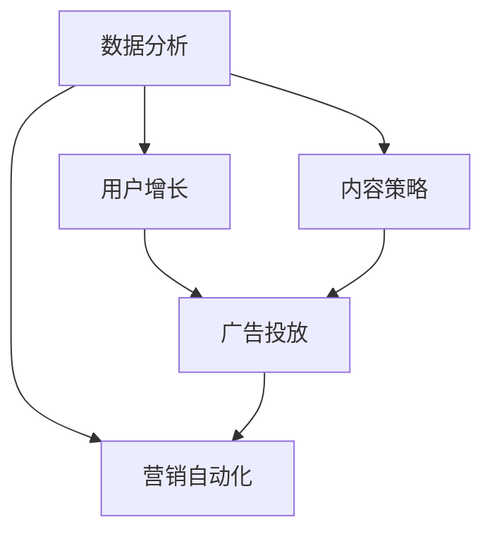

                 

# 如何进行有效的社交媒体运营

> 关键词：社交媒体, 数据分析, 用户增长, 内容策略, 营销自动化, 广告投放, 数据可视化

## 1. 背景介绍

### 1.1 问题由来

社交媒体的兴起不仅改变了人们的交流方式，也为企业和品牌提供了前所未有的营销渠道。然而，由于社交媒体平台众多，用户行为复杂多变，如何有效运营社交媒体成为许多企业和品牌面临的重大挑战。本文将从数据分析、用户增长、内容策略、营销自动化和广告投放等多个角度，介绍如何进行有效的社交媒体运营。

### 1.2 问题核心关键点

社交媒体运营的核心在于利用数据分析驱动决策，通过用户增长策略吸引更多粉丝，制定精准的内容策略以提高互动率和转化率，利用营销自动化工具提高效率，以及有效进行广告投放以扩大品牌影响力和用户覆盖面。本文将详细探讨这些关键点，并通过实际案例展示它们的实施效果。

### 1.3 问题研究意义

有效的社交媒体运营不仅能提升品牌的知名度和用户忠诚度，还能通过精准的投放和内容策略，提高转化率和ROI。因此，掌握社交媒体运营的技巧，对于企业而言具有重要的现实意义。本文旨在帮助读者全面理解社交媒体运营的核心方法，提升品牌在社交媒体上的表现，实现更高的营销效果。

## 2. 核心概念与联系

### 2.1 核心概念概述

为更好地理解社交媒体运营的框架和方法，本节将介绍几个关键概念：

- **社交媒体**：包括但不限于Facebook、Instagram、Twitter、LinkedIn等平台，是品牌与用户互动的重要渠道。
- **数据分析**：通过收集、整理和分析用户数据，了解用户行为和偏好，指导运营决策。
- **用户增长**：通过策略和活动，增加社交媒体账号的粉丝和互动。
- **内容策略**：制定并实施内容计划，以提高用户参与度和品牌影响力。
- **营销自动化**：利用工具自动化执行任务，提高运营效率和效果。
- **广告投放**：在社交媒体平台上投放广告，扩大品牌覆盖和用户增长。

这些概念之间的逻辑关系可以通过以下Mermaid流程图来展示：



这个流程图展示了一些核心概念及其之间的关系：数据分析指导用户增长和内容策略的制定，用户增长和内容策略又能支持广告投放；营销自动化则贯穿整个运营过程，提高效率和效果。

## 3. 核心算法原理 & 具体操作步骤
### 3.1 算法原理概述

社交媒体运营的核心在于通过数据分析和算法模型，不断优化运营策略和投放效果。其核心算法原理包括：

- **聚类算法**：用于将用户按兴趣或行为分为不同的群体，以便进行更有针对性的内容推广和广告投放。
- **预测模型**：通过历史数据和特征分析，预测用户行为和趋势，指导未来的运营决策。
- **推荐系统**：根据用户的历史行为和偏好，推荐相关内容或广告，提高互动率和转化率。
- **A/B测试**：通过对比不同的策略或广告效果，确定最优方案。

### 3.2 算法步骤详解

基于以上算法原理，社交媒体运营的步骤通常包括以下几个关键环节：

**Step 1: 数据收集与清洗**

- 收集社交媒体平台的数据，包括用户行为、互动、转化等。
- 清洗数据，去除噪音和异常值，确保数据质量。

**Step 2: 数据分析和建模**

- 对数据进行分析和探索，了解用户的行为模式和偏好。
- 利用聚类算法、预测模型等算法，构建用户画像和行为预测模型。
- 实施A/B测试，对比不同策略的效果。

**Step 3: 用户增长策略**

- 制定用户增长目标和策略，如社交媒体营销活动、激励机制等。
- 通过内容推广、广告投放等方式，吸引新用户。

**Step 4: 内容策略和创建**

- 根据用户画像和预测模型，制定内容策略，如发布时间、内容类型等。
- 创建符合策略的内容，如图片、视频、文字等。

**Step 5: 营销自动化**

- 利用营销自动化工具，如HubSpot、Marketo等，自动化执行任务，提高效率。
- 跟踪任务执行结果，进行效果评估和优化。

**Step 6: 广告投放**

- 选择合适的广告平台和广告形式，如社交媒体广告、原生广告等。
- 根据用户画像和预测模型，进行定向投放，提高广告效果。

**Step 7: 效果监控与优化**

- 持续监控社交媒体运营的效果，包括用户增长、内容互动、转化率等。
- 根据监控结果，不断优化运营策略和广告投放。

### 3.3 算法优缺点

社交媒体运营的算法和策略有其自身的优缺点：

**优点**：
1. **高效性**：通过自动化工具和算法模型，可以显著提高运营效率和效果。
2. **精准性**：利用数据分析和预测模型，能够制定更精准的策略和广告投放。
3. **可扩展性**：社交媒体平台众多，算法和策略可以灵活应用于不同平台。

**缺点**：
1. **复杂性**：需要综合考虑多个因素，如用户行为、内容互动、广告效果等，难度较大。
2. **资源需求**：需要大量的数据和计算资源，以及高质量的算法和模型。
3. **依赖数据**：运营效果高度依赖于数据的准确性和完整性，数据质量不足会影响效果。

### 3.4 算法应用领域

社交媒体运营的算法和策略不仅适用于品牌和企业的社交媒体运营，也广泛应用于以下领域：

- **电子商务**：通过社交媒体平台的销售和转化效果监控，优化营销策略。
- **教育**：利用社交媒体平台进行在线教育，通过数据分析和内容策略提高参与度。
- **医疗**：通过社交媒体平台进行健康教育和疾病预防，利用数据分析指导内容策略。
- **政府**：利用社交媒体平台进行公共服务和政策宣传，通过数据分析提升效果。

## 4. 数学模型和公式 & 详细讲解 & 举例说明
### 4.1 数学模型构建

为了更好地理解社交媒体运营的数学模型，本节将介绍几个关键模型：

- **K-means聚类模型**：用于将用户按兴趣或行为分为不同的群体，参数为$k$。
- **线性回归模型**：用于预测用户转化率，参数为$\beta$。
- **逻辑回归模型**：用于预测用户是否进行购买或点击，参数为$\omega$。
- **A/B测试**：通过对比不同的策略或广告效果，参数为$n_1, n_2, \overline{Y_1}, \overline{Y_2}$。

### 4.2 公式推导过程

以下是几个关键模型的公式推导过程：

**K-means聚类模型**：
$$
\min_{\mu_i} \sum_{x \in S_i} ||x - \mu_i||^2_2
$$
其中，$S_i$为第$i$个聚类簇，$\mu_i$为聚类中心。

**线性回归模型**：
$$
\min_{\beta} \sum_{i=1}^N (y_i - \beta^T x_i)^2
$$
其中，$y_i$为第$i$个样本的真实值，$x_i$为第$i$个样本的特征向量。

**逻辑回归模型**：
$$
\min_{\omega} -\frac{1}{N} \sum_{i=1}^N [y_i \log \sigma(\omega^T x_i) + (1-y_i) \log (1-\sigma(\omega^T x_i))]
$$
其中，$\sigma(z) = \frac{1}{1+e^{-z}}$为sigmoid函数。

**A/B测试**：
$$
t = \frac{\sum_{i=1}^{n_1} (Y_i - \overline{Y_1})^2}{\sum_{i=1}^{n_2} (Y_i - \overline{Y_2})^2}
$$
其中，$n_1$为测试组的样本数，$n_2$为对照组的样本数，$Y_i$为第$i$个样本的实际效果，$\overline{Y_1}, \overline{Y_2}$为测试组和对照组的平均效果。

### 4.3 案例分析与讲解

以下是一个案例分析，展示如何使用上述模型进行社交媒体运营：

某电子商务平台希望通过社交媒体运营提高转化率。首先，利用K-means聚类模型将用户分为不同群体，并根据用户画像制定不同的内容策略。其次，利用线性回归模型预测用户转化率，并根据预测结果进行定向广告投放。最后，通过A/B测试对比不同广告策略的效果，确定最优方案。

## 5. 项目实践：代码实例和详细解释说明
### 5.1 开发环境搭建

在进行社交媒体运营项目实践前，我们需要准备好开发环境。以下是使用Python进行Facebook Ads API开发的环境配置流程：

1. 安装Python：从官网下载并安装Python，确保版本为3.6以上。
2. 安装Facebook Ads API库：
```bash
pip install facebook-ads
```
3. 创建Facebook Ads账户：前往Facebook Ads官网注册，获取API密钥和访问权限。
4. 创建虚拟环境：
```bash
conda create -n social_media_env python=3.6
conda activate social_media_env
```
5. 配置Facebook Ads API：
```python
from FacebookAdsAPI import FacebookAdsAPI

api = FacebookAdsAPI(access_token='YOUR_ACCESS_TOKEN')
```

### 5.2 源代码详细实现

这里我们以Facebook Ads为例，展示如何使用Facebook Ads API进行社交媒体广告投放的代码实现。

```python
from FacebookAdsAPI import FacebookAdsAPI
from FacebookAdsObject import FacebookObject

api = FacebookAdsAPI(access_token='YOUR_ACCESS_TOKEN')

# 创建广告集
adset = FacebookObject()
adset.set_field('name', 'Product Adset')
adset.set_field('objective', ' conversions')
adset.set_field('criterion', {
    'and': [
        {
            'type': 'audience',
            'operator': 'OR',
            'conditions': [
                {
                    'type': 'global',
                    'operator': 'and',
                    'conditions': [
                        {'field': 'age', 'operator': 'equals', 'value': 18},
                        {'field': 'gender', 'operator': 'equals', 'value': 'male'},
                    ]
                },
                {
                    'type': 'custom audiences',
                    'operator': 'equals',
                    'value': 'YOUR_CUSTOM_AUDIENCE_ID',
                }
            ]
        }
    ]
})
adset = api.create_adset(adset)

# 创建广告
ad = FacebookObject()
ad.set_field('name', 'Product Ad')
ad.set_field('objective', ' conversions')
ad.set_field('adset_id', adset.id)
ad.set_field('creative', 'YOUR_CREATIVE_ID')
ad.set_field('call_to_action_text', 'Buy now')
ad = api.create_ad(ad)

# 创建定向策略
targeting = FacebookObject()
targeting.set_field('and', [
    {
        'type': 'global',
        'operator': 'and',
        'conditions': [
            {'field': 'age', 'operator': 'equals', 'value': 18},
            {'field': 'gender', 'operator': 'equals', 'value': 'male'},
        ]
    },
    {
        'type': 'custom audiences',
        'operator': 'equals',
        'value': 'YOUR_CUSTOM_AUDIENCE_ID',
    }
])
targeting = api.create_targeting(targeting)

# 创建广告组
ad_group = FacebookObject()
ad_group.set_field('name', 'Product Ad Group')
ad_group.set_field('adset_id', adset.id)
ad_group.set_field('targeting', targeting.id)
ad_group = api.create_ad_group(ad_group)

# 创建广告集配置
adset_config = FacebookObject()
adset_config.set_field('name', 'Product Adset')
adset_config.set_field('criterion', {
    'and': [
        {
            'type': 'global',
            'operator': 'and',
            'conditions': [
                {'field': 'age', 'operator': 'equals', 'value': 18},
                {'field': 'gender', 'operator': 'equals', 'value': 'male'},
            ]
        },
        {
            'type': 'custom audiences',
            'operator': 'equals',
            'value': 'YOUR_CUSTOM_AUDIENCE_ID',
        }
    ]
})
adset_config = api.create_adset_config(adset_config)
```

### 5.3 代码解读与分析

让我们再详细解读一下关键代码的实现细节：

**FacebookAdsAPI创建广告集和广告组**：
- `FacebookAdsAPI`：用于创建和操作Facebook Ads API的客户端。
- `FacebookObject`：用于封装Facebook Ads API的请求和响应对象。
- `create_adset`和`create_ad_group`：分别用于创建广告集和广告组。

**广告集和广告组创建**：
- `adset`和`ad_group`对象中，通过设置不同的字段，定义了广告集和广告组的属性和配置。
- `and`和`equals`字段，用于构建广告集和广告组的定向策略。

**广告创建**：
- `ad`对象中，通过设置不同的字段，定义了广告的属性和配置。
- `call_to_action_text`字段，用于设置广告的行动号召文本。

以上代码展示了如何使用Facebook Ads API创建广告集、广告组和广告，并设置定向策略。通过这些操作，可以自动化地在Facebook上进行广告投放。

### 5.4 运行结果展示

运行以上代码后，可以在Facebook Ads管理界面中看到创建的广告集、广告组和广告，并开始投放。通过不断监控广告效果，调整优化广告策略，以达到最佳的转化率和ROI。

## 6. 实际应用场景
### 6.1 智能营销活动

智能营销活动是指通过数据分析和算法模型，自动化执行和优化营销策略，以提高效果和效率。以下是一个智能营销活动的案例：

某电商品牌在双11期间进行促销活动，希望通过社交媒体平台提高销售额。首先，通过数据分析，将用户分为高价值和低价值群体。然后，利用聚类算法和预测模型，对高价值群体进行定向广告投放，并调整广告内容和形式，以提高点击率和转化率。最后，通过A/B测试，确定最优的广告策略，实现销售额的大幅提升。

### 6.2 社交媒体互动

社交媒体互动是指通过互动内容和策略，增加用户参与度和品牌忠诚度。以下是一个社交媒体互动的案例：

某旅游品牌希望通过社交媒体平台提高用户参与度。首先，通过数据分析，了解用户对不同旅游内容的偏好。然后，制定内容策略，如发布目的地介绍、旅游攻略、用户评价等，并利用营销自动化工具，自动推送到用户的时间线。最后，通过监测用户互动数据，不断优化内容策略，提高用户参与度和品牌忠诚度。

### 6.3 品牌推广活动

品牌推广活动是指通过广告投放和内容策略，扩大品牌覆盖和影响力。以下是一个品牌推广活动的案例：

某科技公司希望通过社交媒体平台扩大品牌影响力。首先，通过数据分析，了解目标用户的兴趣和行为。然后，利用广告投放工具，选择适合的广告形式和平台，并进行定向投放。最后，通过监测广告效果，不断优化广告策略，提高品牌覆盖和影响力。

### 6.4 未来应用展望

随着技术的不断进步，社交媒体运营将呈现以下几个发展趋势：

1. **数据驱动决策**：通过更全面、更准确的数据分析，驱动运营策略的制定和优化。
2. **自动化执行**：利用更智能的营销自动化工具，提高运营效率和效果。
3. **个性化推荐**：利用推荐系统，提供个性化的内容和广告，提高用户参与度和转化率。
4. **实时监控**：通过实时监控工具，及时发现和解决问题，优化运营策略。
5. **用户生成内容**：利用用户生成内容，增加品牌的参与度和可信度。

以上趋势将进一步推动社交媒体运营的智能化和自动化，为企业和品牌带来更大的营销价值。

## 7. 工具和资源推荐
### 7.1 学习资源推荐

为了帮助读者全面掌握社交媒体运营的原理和技巧，这里推荐一些优质的学习资源：

1. **《社交媒体运营实战》系列书籍**：深入浅出地介绍了社交媒体运营的核心方法和技巧，适合初学者和进阶者。
2. **Google Analytics官方文档**：提供了详细的分析工具使用指南，帮助用户深入理解用户行为和数据。
3. **HubSpot Academy**：提供免费的社交媒体营销课程，涵盖从基础到高级的运营技巧。
4. **Facebook Ads帮助中心**：提供了详细的广告投放指南和案例分析，帮助用户优化广告效果。

通过对这些资源的学习实践，相信读者一定能够快速掌握社交媒体运营的核心方法，提升品牌在社交媒体上的表现。

### 7.2 开发工具推荐

高效的开发离不开优秀的工具支持。以下是几款用于社交媒体运营开发的常用工具：

1. **Facebook Ads Manager**：Facebook的广告管理平台，提供广告投放、效果监控等功能。
2. **Google Analytics**：谷歌提供的网站分析工具，帮助用户理解用户行为和流量来源。
3. **Hootsuite**：社交媒体管理和分析工具，支持多平台管理和自动化。
4. **Google Data Studio**：谷歌提供的数据可视化工具，帮助用户创建和共享数据报告。

合理利用这些工具，可以显著提升社交媒体运营的效率和效果。

### 7.3 相关论文推荐

社交媒体运营的研究源于学界的持续探索。以下是几篇奠基性的相关论文，推荐阅读：

1. **Social Media Marketing Analytics**：介绍了社交媒体营销分析的方法和工具，提供了丰富的案例分析。
2. **The Effectiveness of Social Media Marketing**：通过实证研究，探讨了社交媒体营销的效果和影响。
3. **Twitter Sentiment Analysis**：利用自然语言处理技术，分析Twitter上的情感变化，指导品牌营销策略。

这些论文代表了大数据和社交媒体分析的发展脉络，通过学习这些前沿成果，可以帮助研究者把握学科前进方向，激发更多的创新灵感。

## 8. 总结：未来发展趋势与挑战
### 8.1 总结

本文对社交媒体运营的核心方法和技术进行了全面系统的介绍。首先，阐述了社交媒体运营的核心概念和关键点，明确了运营策略和广告投放的实施流程。其次，从数据分析、用户增长、内容策略、营销自动化和广告投放等多个角度，详细讲解了社交媒体运营的数学模型和实际案例。最后，对社交媒体运营的未来发展趋势和面临的挑战进行了深入分析。

通过本文的系统梳理，可以看到，社交媒体运营是一项复杂且高度依赖数据和算法的任务，需要综合运用多个技术和策略，方能取得最佳效果。未来，随着技术的不断进步，社交媒体运营也将迎来更多的机遇和挑战，需要我们持续探索和优化。

### 8.2 未来发展趋势

展望未来，社交媒体运营将呈现以下几个发展趋势：

1. **数据驱动决策**：通过更全面、更准确的数据分析，驱动运营策略的制定和优化。
2. **自动化执行**：利用更智能的营销自动化工具，提高运营效率和效果。
3. **个性化推荐**：利用推荐系统，提供个性化的内容和广告，提高用户参与度和转化率。
4. **实时监控**：通过实时监控工具，及时发现和解决问题，优化运营策略。
5. **用户生成内容**：利用用户生成内容，增加品牌的参与度和可信度。

这些趋势将进一步推动社交媒体运营的智能化和自动化，为企业和品牌带来更大的营销价值。

### 8.3 面临的挑战

尽管社交媒体运营已经取得了显著的成效，但在迈向更加智能化、普适化应用的过程中，它仍面临诸多挑战：

1. **数据质量**：社交媒体平台的数据质量参差不齐，数据噪音和缺失值问题严重，影响数据分析的准确性。
2. **算法复杂性**：社交媒体运营需要综合考虑多个因素，如用户行为、内容互动、广告效果等，难度较大。
3. **资源需求**：社交媒体运营需要大量的数据和计算资源，以及高质量的算法和模型。
4. **技术壁垒**：社交媒体运营涉及多种技术和工具，需要综合运用多个领域的知识，对技术要求较高。

尽管存在这些挑战，但通过不断优化算法、提升数据质量、加强技术合作，我们相信社交媒体运营的潜力将得到进一步释放，带来更多的价值和机遇。

### 8.4 研究展望

面向未来，社交媒体运营的研究需要在以下几个方面寻求新的突破：

1. **数据清洗和预处理**：通过更先进的数据清洗和预处理技术，提升数据质量，减少噪音和缺失值。
2. **多模态数据分析**：结合社交媒体平台的多模态数据，如图片、视频、文本等，进行综合分析和建模。
3. **实时计算和流式处理**：利用实时计算和流式处理技术，提升数据处理和分析的效率和效果。
4. **自动化算法和模型**：开发更智能、更高效的自动化算法和模型，减少人工干预和优化成本。

这些研究方向将引领社交媒体运营技术的进步，为品牌和企业在社交媒体平台上的成功运营提供更坚实的基础。

## 9. 附录：常见问题与解答

**Q1：社交媒体运营需要哪些技术和工具？**

A: 社交媒体运营需要多种技术和工具，包括数据分析、广告投放、营销自动化、内容创作和优化等。常用的工具包括Facebook Ads、Google Analytics、HubSpot、Hootsuite等。

**Q2：如何进行数据清洗和预处理？**

A: 数据清洗和预处理是数据分析的重要环节。可以通过缺失值处理、数据去重、数据转换等方式提升数据质量。具体方法包括使用Python的pandas库进行数据清洗和预处理。

**Q3：如何利用数据进行用户画像和行为预测？**

A: 利用K-means聚类模型和预测模型，对用户进行分类和行为预测。具体方法包括使用Python的scikit-learn库进行模型训练和预测。

**Q4：如何进行A/B测试？**

A: A/B测试是比较不同策略或广告效果的方法。具体步骤包括创建测试组和对照组，收集效果数据，计算效果差异等。具体方法包括使用Python的statsmodels库进行统计分析。

**Q5：如何利用社交媒体数据进行品牌推广？**

A: 通过社交媒体数据分析，了解目标用户的兴趣和行为。然后，利用广告投放工具，选择适合的广告形式和平台，并进行定向投放。具体方法包括使用Facebook Ads API进行广告创建和投放。

以上问题与解答展示了社交媒体运营中的一些关键技术和工具的使用方法，相信读者能够从中获得启发和帮助。

