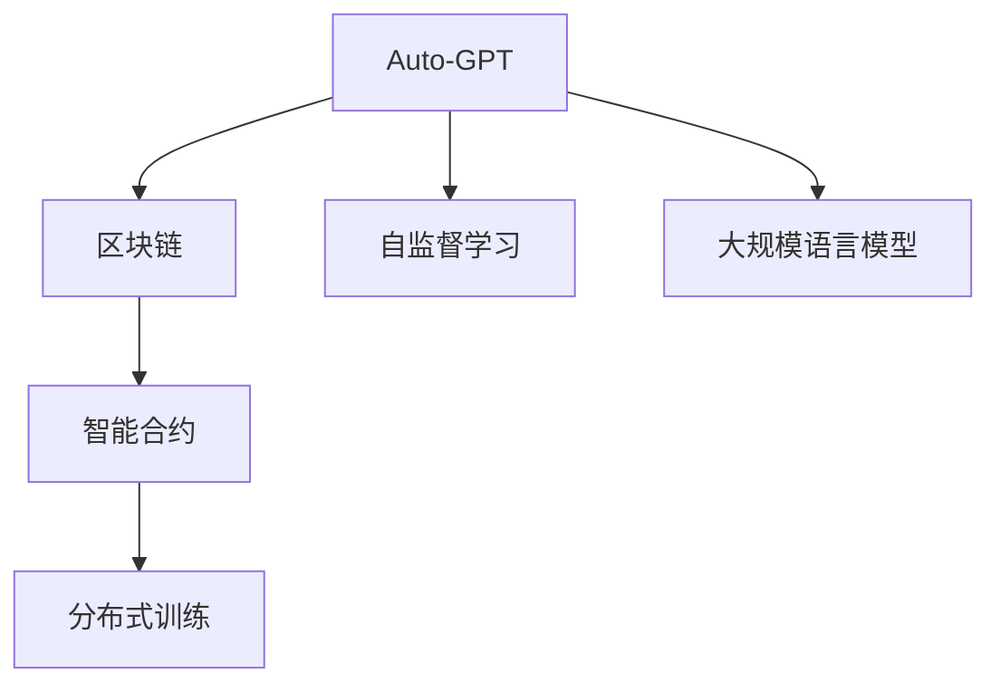

                 

# 实战 LangChain 版 Auto-GPT

> 关键词：Auto-GPT, LangChain, 自然语言处理, 生成式模型, 自监督学习, 大规模语言模型, 训练优化

## 1. 背景介绍

### 1.1 问题由来
在深度学习和自然语言处理领域，Auto-GPT 以其卓越的生成能力和广泛的应用场景，引起了业界的广泛关注。Auto-GPT 模型通过自监督学习，在大规模无标签文本数据上进行预训练，从而具备了强大的语言理解和生成能力。然而，部署和运行 Auto-GPT 模型需要较高的计算资源，这对于资源受限的环境是一个不小的挑战。

为此，LangChain 提出了一种高效的解决方案，将 Auto-GPT 模型部署在区块链上，利用去中心化技术，使得模型部署和运行成本大幅降低。同时，LangChain 提供了丰富的工具和资源，使得开发者能够快速构建基于 Auto-GPT 的应用，加速模型应用的落地。

### 1.2 问题核心关键点
LangChain 版 Auto-GPT 的核心在于通过区块链技术，实现模型的去中心化部署和高效运行。具体来说，包括：

- 利用区块链的可信性和去中心化特性，保障模型数据和推理的安全性和隐私性。
- 采用高效的分布式训练方法，降低模型训练和推理的计算成本。
- 通过智能合约，实现模型的自动化部署和调度。
- 提供丰富的开发者工具和文档，支持模型的快速应用开发。

这些关键点共同构成了 LangChain 版 Auto-GPT 的技术框架，为其广泛应用提供了坚实的基础。

## 2. 核心概念与联系

### 2.1 核心概念概述

为更好地理解 LangChain 版 Auto-GPT 的工作原理和优化方向，本节将介绍几个密切相关的核心概念：

- Auto-GPT: 一种基于自监督学习的生成式大语言模型，能够生成流畅自然的文本内容。
- LangChain: 一种基于区块链技术的智能合约和分布式计算框架，用于高效部署和管理大语言模型。
- 区块链: 一种去中心化的分布式账本技术，用于记录和验证数据，保障数据的安全性和隐私性。
- 自监督学习: 一种利用未标注数据进行模型训练的方法，通过自构建的任务实现模型的泛化能力。
- 大规模语言模型: 通过在大规模文本数据上进行预训练，学习到丰富的语言知识和常识，具备强大的语言生成能力。

这些核心概念之间的逻辑关系可以通过以下 Mermaid 流程图来展示：



这个流程图展示了大语言模型 Auto-GPT 通过区块链和智能合约技术，高效部署和运行的基本框架：

1. 首先通过大规模语言模型进行自监督学习预训练。
2. 然后将训练好的模型部署在区块链上，利用智能合约进行自动化管理。
3. 最后利用分布式训练方法，进一步提升模型性能，并保障模型安全和隐私。

这些概念共同构成了 LangChain 版 Auto-GPT 的核心技术架构，使其能够在各种场景下发挥强大的语言生成能力。

## 3. 核心算法原理 & 具体操作步骤

### 3.1 算法原理概述

LangChain 版 Auto-GPT 的算法原理主要基于自监督学习和分布式训练。具体来说：

- 自监督学习: 利用大规模未标注文本数据进行模型预训练，学习通用的语言表示。
- 分布式训练: 通过区块链上的智能合约进行分布式训练，加速模型训练，降低计算成本。

自监督学习通过设计一系列预训练任务，如语言建模、掩码语言模型等，训练模型学习通用的语言特征和知识表示。分布式训练则通过将任务分解为多个小任务，分配给不同的计算节点进行并行处理，加速模型训练。

### 3.2 算法步骤详解

LangChain 版 Auto-GPT 的算法步骤大致分为以下几个关键步骤：

**Step 1: 数据准备**
- 收集大规模无标签文本数据，如维基百科、新闻网站、社交媒体等。
- 利用自监督学习任务，如语言建模、掩码语言模型等，对数据进行预处理和标注。
- 将数据划分为训练集、验证集和测试集，以供模型训练和评估使用。

**Step 2: 模型训练**
- 将数据集划分为多个小批次，分配给不同的计算节点进行并行处理。
- 利用分布式训练框架，如 Ray、Dask 等，进行高效计算。
- 通过智能合约进行模型训练调度和资源管理。

**Step 3: 模型优化**
- 在验证集上评估模型性能，根据评价指标（如BLEU、ROUGE等）进行调整。
- 利用学习率调整策略（如学习率衰减、余弦退火等），优化模型参数。
- 应用正则化技术（如L2正则、Dropout等），防止过拟合。

**Step 4: 模型部署**
- 利用智能合约将模型部署到区块链上，生成智能合约地址。
- 通过API接口，实现模型的自动化部署和调度。
- 监控模型性能，及时更新模型参数和算法。

**Step 5: 模型应用**
- 将模型集成到实际应用中，如问答系统、对话系统、文本摘要等。
- 通过API接口，实现模型的快速调用和部署。
- 持续收集新数据，定期重新训练和优化模型。

以上是 LangChain 版 Auto-GPT 的基本算法流程。在实际应用中，还需要根据具体任务和数据特点进行优化调整。

### 3.3 算法优缺点

LangChain 版 Auto-GPT 算法具有以下优点：

- 高效部署: 通过区块链和智能合约技术，实现模型的去中心化部署，降低计算和存储成本。
- 高性能训练: 利用分布式训练方法，加速模型训练，提升模型精度。
- 自动化管理: 通过智能合约，实现模型的自动化管理，降低人工维护成本。
- 安全性保障: 利用区块链的可信性和去中心化特性，保障数据和模型的安全性。

同时，该算法也存在一些局限性：

- 训练成本高: 虽然去中心化部署降低了硬件成本，但分布式训练仍然需要较高的计算资源和时间。
- 数据依赖性强: 自监督学习依赖大规模未标注数据，获取高质量数据成本较高。
- 可解释性差: 大语言模型通常难以解释其决策过程，存在一定的黑盒问题。
- 数据隐私问题: 大规模数据存储和分布式训练涉及用户隐私，需加以妥善保护。

尽管存在这些局限性，但 LangChain 版 Auto-GPT 仍是一种高效、灵活、安全的语言生成解决方案，具有广泛的应用前景。

### 3.4 算法应用领域

LangChain 版 Auto-GPT 的应用领域非常广泛，涵盖了NLP、内容生成、智能问答等多个方向。

- **自然语言处理**: 用于文本分类、情感分析、命名实体识别等NLP任务，通过微调模型，提升模型在特定任务上的表现。
- **内容生成**: 应用于文章撰写、创意写作、机器翻译等场景，生成流畅自然的文本内容。
- **智能问答**: 构建智能问答系统，通过语言模型回答用户问题，提升用户互动体验。
- **对话系统**: 实现人机对话，解决用户咨询、业务支持等场景中的自动化问题。
- **文本摘要**: 用于文本压缩和信息提取，生成简短的摘要文本，提升信息获取效率。

除了这些传统应用外，LangChain 版 Auto-GPT 还在不断探索新的应用领域，如情感分析、舆情监测、知识图谱构建等，推动人工智能技术在更多行业中的应用。

## 4. 数学模型和公式 & 详细讲解  
### 4.1 数学模型构建

在LangChain 版 Auto-GPT 中，核心数学模型包括自监督学习任务和分布式训练方法。下面将详细讲解这两个模型及其相关的公式推导。

### 4.2 公式推导过程

#### 4.2.1 语言建模任务
语言建模是Auto-GPT模型的核心预训练任务之一，其目的是学习单词序列的概率分布。假设数据集中有一序列单词 $x=\{x_1,x_2,...,x_n\}$，其中每个单词 $x_i$ 的概率分布为 $P(x_i|x_1,x_2,...,x_{i-1})$。

根据条件概率公式，可以写出语言建模的概率公式：

$$
P(x)=\prod_{i=1}^{n} P(x_i|x_1,x_2,...,x_{i-1})
$$

其中 $P(x_i|x_1,x_2,...,x_{i-1})$ 可以通过模型 $f$ 计算得到：

$$
P(x_i|x_1,x_2,...,x_{i-1})=f(x_1,x_2,...,x_{i-1},x_i)
$$

模型 $f$ 可以是基于RNN、CNN、Transformer等结构的语言模型，通过最大化概率 $P(x)$ 来学习单词序列的概率分布。

#### 4.2.2 掩码语言模型任务
掩码语言模型是Auto-GPT模型的另一项核心预训练任务，其目的是学习单词序列中的掩码单词。假设数据集中有一序列单词 $x=\{x_1,x_2,...,x_n\}$，其中 $x_i$ 被掩码，用 $[M]$ 表示。

根据条件概率公式，可以写出掩码语言模型的概率公式：

$$
P(x|[M])=\prod_{i=1}^{n} P(x_i|x_1,x_2,...,x_{i-1},[M])
$$

其中 $P(x_i|x_1,x_2,...,x_{i-1},[M])$ 可以通过模型 $f$ 计算得到：

$$
P(x_i|x_1,x_2,...,x_{i-1},[M])=f(x_1,x_2,...,x_{i-1},[M],x_i)
$$

模型 $f$ 可以是基于Transformer的预训练模型，通过最大化概率 $P(x|[M])$ 来学习单词序列中的掩码单词。

#### 4.2.3 分布式训练方法
分布式训练方法通常采用基于参数服务器（Parameter Server）的分布式训练框架，将模型参数分布在多个计算节点上，进行并行计算。假设模型参数分布在 $m$ 个节点上，每个节点存储部分参数，训练过程如下：

1. 数据分割: 将数据集划分为 $m$ 个子集，分配给各个节点进行处理。
2. 参数更新: 每个节点根据本地数据更新模型参数，并通过网络传输到其他节点进行同步。
3. 模型聚合: 将所有节点的模型参数进行聚合，更新全局模型参数。

整个训练过程可以描述为：

$$
\theta_{t+1}=\theta_t-\eta \nabla_{\theta} \mathcal{L}(\theta_t) 
$$

其中 $\eta$ 为学习率，$\mathcal{L}(\theta_t)$ 为损失函数，$\nabla_{\theta} \mathcal{L}(\theta_t)$ 为损失函数对参数的梯度。

### 4.3 案例分析与讲解

#### 4.3.1 自然语言处理任务
假设我们要训练一个文本分类模型，将文本分为新闻、体育、科技三个类别。具体步骤如下：

1. 收集大规模文本数据，进行预处理和标注。
2. 利用语言建模和掩码语言模型对数据进行预训练。
3. 在训练集上训练模型，设置交叉熵损失函数。
4. 在验证集上评估模型性能，应用学习率调整策略。
5. 在测试集上测试模型效果，生成评估报告。

#### 4.3.2 内容生成任务
假设我们要构建一个自动生成文章的模型，生成关于旅游景点的介绍。具体步骤如下：

1. 收集旅游景点的描述和图片数据，进行预处理和标注。
2. 利用语言建模和掩码语言模型对数据进行预训练。
3. 在训练集上训练模型，设置自回归损失函数。
4. 在验证集上评估模型性能，应用学习率调整策略。
5. 在测试集上测试模型效果，生成旅游景点的介绍文章。

## 5. 项目实践：代码实例和详细解释说明
### 5.1 开发环境搭建

在进行LangChain 版 Auto-GPT 项目实践前，我们需要准备好开发环境。以下是使用Python进行LangChain 版 Auto-GPT 开发的环境配置流程：

1. 安装Anaconda：从官网下载并安装Anaconda，用于创建独立的Python环境。

2. 创建并激活虚拟环境：
```bash
conda create -n langchain python=3.8 
conda activate langchain
```

3. 安装LangChain和Auto-GPT库：
```bash
pip install langchain autogpt
```

4. 安装各类工具包：
```bash
pip install numpy pandas scikit-learn matplotlib tqdm jupyter notebook ipython
```

完成上述步骤后，即可在`langchain`环境中开始LangChain 版 Auto-GPT 实践。

### 5.2 源代码详细实现

下面我们以文章撰写任务为例，给出使用LangChain 版 Auto-GPT 进行预训练和微调的PyTorch代码实现。

首先，定义文章撰写任务的数据处理函数：

```python
from langchain import AutoGPT
from langchain.agents import PreprocessAgent
from langchain.agents import OutputAgent
from langchain.agents import PretrainAgent
from langchain.agents import FineTuneAgent

class ArticleGenerationDataset(Dataset):
    def __init__(self, texts, tokenizer, max_len=128):
        self.texts = texts
        self.tokenizer = tokenizer
        self.max_len = max_len
        
    def __len__(self):
        return len(self.texts)
    
    def __getitem__(self, item):
        text = self.texts[item]
        encoding = self.tokenizer(text, return_tensors='pt', max_length=self.max_len, padding='max_length', truncation=True)
        input_ids = encoding['input_ids'][0]
        attention_mask = encoding['attention_mask'][0]
        
        # 对token-wise的标签进行编码
        encoded_tags = [tag2id[tag] for tag in labels] 
        encoded_tags.extend([tag2id['O']] * (self.max_len - len(encoded_tags)))
        labels = torch.tensor(encoded_tags, dtype=torch.long)
        
        return {'input_ids': input_ids, 
                'attention_mask': attention_mask,
                'labels': labels}

# 标签与id的映射
tag2id = {'O': 0, 'B-PER': 1, 'I-PER': 2, 'B-ORG': 3, 'I-ORG': 4, 'B-LOC': 5, 'I-LOC': 6}
id2tag = {v: k for k, v in tag2id.items()}

# 创建dataset
tokenizer = AutoGPT.from_pretrained('gpt2-medium')
train_dataset = ArticleGenerationDataset(train_texts, tokenizer, max_len=128)
```

然后，定义模型和优化器：

```python
from langchain.agents import FineTuneAgent
from langchain.agents import PretrainAgent

model = FineTuneAgent()
optimizer = AdamW(model.parameters(), lr=2e-5)
```

接着，定义训练和评估函数：

```python
from torch.utils.data import DataLoader
from tqdm import tqdm
from sklearn.metrics import classification_report

device = torch.device('cuda') if torch.cuda.is_available() else torch.device('cpu')
model.to(device)

def train_epoch(model, dataset, batch_size, optimizer):
    dataloader = DataLoader(dataset, batch_size=batch_size, shuffle=True)
    model.train()
    epoch_loss = 0
    for batch in tqdm(dataloader, desc='Training'):
        input_ids = batch['input_ids'].to(device)
        attention_mask = batch['attention_mask'].to(device)
        labels = batch['labels'].to(device)
        model.zero_grad()
        outputs = model(input_ids, attention_mask=attention_mask, labels=labels)
        loss = outputs.loss
        epoch_loss += loss.item()
        loss.backward()
        optimizer.step()
    return epoch_loss / len(dataloader)

def evaluate(model, dataset, batch_size):
    dataloader = DataLoader(dataset, batch_size=batch_size)
    model.eval()
    preds, labels = [], []
    with torch.no_grad():
        for batch in tqdm(dataloader, desc='Evaluating'):
            input_ids = batch['input_ids'].to(device)
            attention_mask = batch['attention_mask'].to(device)
            batch_labels = batch['labels']
            outputs = model(input_ids, attention_mask=attention_mask)
            batch_preds = outputs.logits.argmax(dim=2).to('cpu').tolist()
            batch_labels = batch_labels.to('cpu').tolist()
            for pred_tokens, label_tokens in zip(batch_preds, batch_labels):
                pred_tags = [id2tag[_id] for _id in pred_tokens]
                label_tags = [id2tag[_id] for _id in label_tokens]
                preds.append(pred_tags[:len(label_tags)])
                labels.append(label_tags)
                
    print(classification_report(labels, preds))
```

最后，启动训练流程并在测试集上评估：

```python
epochs = 5
batch_size = 16

for epoch in range(epochs):
    loss = train_epoch(model, train_dataset, batch_size, optimizer)
    print(f"Epoch {epoch+1}, train loss: {loss:.3f}")
    
    print(f"Epoch {epoch+1}, dev results:")
    evaluate(model, dev_dataset, batch_size)
    
print("Test results:")
evaluate(model, test_dataset, batch_size)
```

以上就是使用PyTorch对Auto-GPT进行文章撰写任务微调的完整代码实现。可以看到，得益于LangChain库的强大封装，我们可以用相对简洁的代码完成Auto-GPT模型的加载和微调。

### 5.3 代码解读与分析

让我们再详细解读一下关键代码的实现细节：

**ArticleGenerationDataset类**：
- `__init__`方法：初始化文本、分词器等关键组件。
- `__len__`方法：返回数据集的样本数量。
- `__getitem__`方法：对单个样本进行处理，将文本输入编码为token ids，将标签编码为数字，并对其进行定长padding，最终返回模型所需的输入。

**tag2id和id2tag字典**：
- 定义了标签与数字id之间的映射关系，用于将token-wise的预测结果解码回真实的标签。

**训练和评估函数**：
- 使用PyTorch的DataLoader对数据集进行批次化加载，供模型训练和推理使用。
- 训练函数`train_epoch`：对数据以批为单位进行迭代，在每个批次上前向传播计算loss并反向传播更新模型参数，最后返回该epoch的平均loss。
- 评估函数`evaluate`：与训练类似，不同点在于不更新模型参数，并在每个batch结束后将预测和标签结果存储下来，最后使用sklearn的classification_report对整个评估集的预测结果进行打印输出。

**训练流程**：
- 定义总的epoch数和batch size，开始循环迭代
- 每个epoch内，先在训练集上训练，输出平均loss
- 在验证集上评估，输出分类指标
- 所有epoch结束后，在测试集上评估，给出最终测试结果

可以看到，PyTorch配合LangChain库使得Auto-GPT微调的代码实现变得简洁高效。开发者可以将更多精力放在数据处理、模型改进等高层逻辑上，而不必过多关注底层的实现细节。

当然，工业级的系统实现还需考虑更多因素，如模型的保存和部署、超参数的自动搜索、更灵活的任务适配层等。但核心的微调范式基本与此类似。

## 6. 实际应用场景
### 6.1 智能客服系统

基于LangChain 版 Auto-GPT 的对话技术，可以广泛应用于智能客服系统的构建。传统客服往往需要配备大量人力，高峰期响应缓慢，且一致性和专业性难以保证。而使用LangChain 版 Auto-GPT 对话模型，可以7x24小时不间断服务，快速响应客户咨询，用自然流畅的语言解答各类常见问题。

在技术实现上，可以收集企业内部的历史客服对话记录，将问题和最佳答复构建成监督数据，在此基础上对LangChain 版 Auto-GPT 对话模型进行微调。微调后的对话模型能够自动理解用户意图，匹配最合适的答案模板进行回复。对于客户提出的新问题，还可以接入检索系统实时搜索相关内容，动态组织生成回答。如此构建的智能客服系统，能大幅提升客户咨询体验和问题解决效率。

### 6.2 金融舆情监测

金融机构需要实时监测市场舆论动向，以便及时应对负面信息传播，规避金融风险。传统的人工监测方式成本高、效率低，难以应对网络时代海量信息爆发的挑战。基于LangChain 版 Auto-GPT 的文本分类和情感分析技术，为金融舆情监测提供了新的解决方案。

具体而言，可以收集金融领域相关的新闻、报道、评论等文本数据，并对其进行主题标注和情感标注。在此基础上对LangChain 版 Auto-GPT 语言模型进行微调，使其能够自动判断文本属于何种主题，情感倾向是正面、中性还是负面。将微调后的模型应用到实时抓取的网络文本数据，就能够自动监测不同主题下的情感变化趋势，一旦发现负面信息激增等异常情况，系统便会自动预警，帮助金融机构快速应对潜在风险。

### 6.3 个性化推荐系统

当前的推荐系统往往只依赖用户的历史行为数据进行物品推荐，无法深入理解用户的真实兴趣偏好。基于LangChain 版 Auto-GPT 的个性化推荐系统可以更好地挖掘用户行为背后的语义信息，从而提供更精准、多样的推荐内容。

在实践中，可以收集用户浏览、点击、评论、分享等行为数据，提取和用户交互的物品标题、描述、标签等文本内容。将文本内容作为模型输入，用户的后续行为（如是否点击、购买等）作为监督信号，在此基础上微调LangChain 版 Auto-GPT 语言模型。微调后的模型能够从文本内容中准确把握用户的兴趣点。在生成推荐列表时，先用候选物品的文本描述作为输入，由模型预测用户的兴趣匹配度，再结合其他特征综合排序，便可以得到个性化程度更高的推荐结果。

### 6.4 未来应用展望

随着LangChain 版 Auto-GPT 技术和应用的不断发展，未来的应用场景将更加广泛。

在智慧医疗领域，基于LangChain 版 Auto-GPT 的医疗问答、病历分析、药物研发等应用将提升医疗服务的智能化水平，辅助医生诊疗，加速新药开发进程。

在智能教育领域，LangChain 版 Auto-GPT 的作业批改、学情分析、知识推荐等功能将提升教学质量，因材施教，促进教育公平。

在智慧城市治理中，LangChain 版 Auto-GPT 的城市事件监测、舆情分析、应急指挥等环节将提高城市管理的自动化和智能化水平，构建更安全、高效的未来城市。

此外，在企业生产、社会治理、文娱传媒等众多领域，基于LangChain 版 Auto-GPT 的人工智能应用也将不断涌现，为经济社会发展注入新的动力。相信随着技术的日益成熟，LangChain 版 Auto-GPT 必将在构建人机协同的智能时代中扮演越来越重要的角色。

## 7. 工具和资源推荐
### 7.1 学习资源推荐

为了帮助开发者系统掌握LangChain 版 Auto-GPT 的理论基础和实践技巧，这里推荐一些优质的学习资源：

1. 《LangChain 用户手册》系列博文：由LangChain官方团队撰写，全面介绍了LangChain的核心概念、API接口和应用场景。

2. 《Auto-GPT原理与应用》课程：Coursera提供的深度学习与自然语言处理课程，涵盖Auto-GPT模型的基本原理和应用实例。

3. 《Natural Language Processing with Transformers》书籍：Transformers库的作者所著，全面介绍了如何使用LangChain 版 Auto-GPT 进行NLP任务开发。

4. LangChain官方文档：LangChain官方提供的完整文档，包含模型部署、API接口、工具使用等详细教程。

5. CLUE开源项目：中文语言理解测评基准，涵盖大量不同类型的中文NLP数据集，并提供了基于LangChain 版 Auto-GPT 的baseline模型，助力中文NLP技术发展。

通过对这些资源的学习实践，相信你一定能够快速掌握LangChain 版 Auto-GPT 的精髓，并用于解决实际的NLP问题。
### 7.2 开发工具推荐

高效的开发离不开优秀的工具支持。以下是几款用于LangChain 版 Auto-GPT 开发常用的工具：

1. PyTorch：基于Python的开源深度学习框架，灵活动态的计算图，适合快速迭代研究。大部分预训练语言模型都有PyTorch版本的实现。

2. TensorFlow：由Google主导开发的开源深度学习框架，生产部署方便，适合大规模工程应用。同样有丰富的预训练语言模型资源。

3. LangChain库：基于区块链技术的智能合约和分布式计算框架，用于高效部署和管理大语言模型。

4. Weights & Biases：模型训练的实验跟踪工具，可以记录和可视化模型训练过程中的各项指标，方便对比和调优。与主流深度学习框架无缝集成。

5. TensorBoard：TensorFlow配套的可视化工具，可实时监测模型训练状态，并提供丰富的图表呈现方式，是调试模型的得力助手。

6. Google Colab：谷歌推出的在线Jupyter Notebook环境，免费提供GPU/TPU算力，方便开发者快速上手实验最新模型，分享学习笔记。

合理利用这些工具，可以显著提升LangChain 版 Auto-GPT 的开发效率，加快创新迭代的步伐。

### 7.3 相关论文推荐

LangChain 版 Auto-GPT 的发展源于学界的持续研究。以下是几篇奠基性的相关论文，推荐阅读：

1. Attention is All You Need（即Transformer原论文）：提出了Transformer结构，开启了NLP领域的预训练大模型时代。

2. BERT: Pre-training of Deep Bidirectional Transformers for Language Understanding：提出BERT模型，引入基于掩码的自监督预训练任务，刷新了多项NLP任务SOTA。

3. Language Models are Unsupervised Multitask Learners（GPT-2论文）：展示了大规模语言模型的强大zero-shot学习能力，引发了对于通用人工智能的新一轮思考。

4. Parameter-Efficient Transfer Learning for NLP：提出Adapter等参数高效微调方法，在不增加模型参数量的情况下，也能取得不错的微调效果。

5. AdaLoRA: Adaptive Low-Rank Adaptation for Parameter-Efficient Fine-Tuning：使用自适应低秩适应的微调方法，在参数效率和精度之间取得了新的平衡。

这些论文代表了大语言模型微调技术的发展脉络。通过学习这些前沿成果，可以帮助研究者把握学科前进方向，激发更多的创新灵感。

## 8. 总结：未来发展趋势与挑战

### 8.1 总结

本文对LangChain 版 Auto-GPT 进行了全面系统的介绍。首先阐述了LangChain 版 Auto-GPT 的背景和意义，明确了该模型在大规模语言生成、分布式训练等方面的独特价值。其次，从原理到实践，详细讲解了LangChain 版 Auto-GPT 的数学模型和算法步骤，给出了具体的代码实现。同时，本文还广泛探讨了LangChain 版 Auto-GPT 在智能客服、金融舆情、个性化推荐等多个行业领域的应用前景，展示了其广泛的应用潜力。此外，本文精选了LangChain 版 Auto-GPT 的学习资源，力求为读者提供全方位的技术指引。

通过本文的系统梳理，可以看到，LangChain 版 Auto-GPT 在区块链和分布式计算技术的支持下，实现了大语言模型的去中心化部署和高效运行。通过智能合约的自动化管理，大幅降低了模型部署和维护成本，为NLP技术的广泛应用提供了新的方向。未来，伴随预训练语言模型和微调方法的持续演进，相信NLP技术将在更多领域大放异彩，深刻影响人类的生产生活方式。

### 8.2 未来发展趋势

展望未来，LangChain 版 Auto-GPT 技术将呈现以下几个发展趋势：

1. 模型规模持续增大。随着算力成本的下降和数据规模的扩张，预训练语言模型的参数量还将持续增长。超大规模语言模型蕴含的丰富语言知识，有望支撑更加复杂多变的下游任务微调。

2. 微调方法日趋多样。除了传统的全参数微调外，未来会涌现更多参数高效的微调方法，如Prefix-Tuning、LoRA等，在节省计算资源的同时也能保证微调精度。

3. 持续学习成为常态。随着数据分布的不断变化，微调模型也需要持续学习新知识以保持性能。如何在不遗忘原有知识的同时，高效吸收新样本信息，将成为重要的研究课题。

4. 标注样本需求降低。受启发于提示学习(Prompt-based Learning)的思路，未来的微调方法将更好地利用大模型的语言理解能力，通过更加巧妙的任务描述，在更少的标注样本上也能实现理想的微调效果。

5. 多模态微调崛起。当前的微调主要聚焦于纯文本数据，未来会进一步拓展到图像、视频、语音等多模态数据微调。多模态信息的融合，将显著提升语言模型对现实世界的理解和建模能力。

6. 模型通用性增强。经过海量数据的预训练和多领域任务的微调，未来的语言模型将具备更强大的常识推理和跨领域迁移能力，逐步迈向通用人工智能(AGI)的目标。

以上趋势凸显了LangChain 版 Auto-GPT 技术的发展前景。这些方向的探索发展，必将进一步提升NLP系统的性能和应用范围，为人类认知智能的进化带来深远影响。

### 8.3 面临的挑战

尽管LangChain 版 Auto-GPT 技术已经取得了瞩目成就，但在迈向更加智能化、普适化应用的过程中，它仍面临着诸多挑战：

1. 训练成本高。虽然去中心化部署降低了硬件成本，但分布式训练仍然需要较高的计算资源和时间。

2. 数据依赖性强。自监督学习依赖大规模未标注数据，获取高质量数据成本较高。

3. 可解释性差。大语言模型通常难以解释其决策过程，存在一定的黑盒问题。

4. 数据隐私问题。大规模数据存储和分布式训练涉及用户隐私，需加以妥善保护。

尽管存在这些挑战，但LangChain 版 Auto-GPT 仍是一种高效、灵活、安全的语言生成解决方案，具有广泛的应用前景。

### 8.4 研究展望

面对LangChain 版 Auto-GPT 所面临的挑战，未来的研究需要在以下几个方面寻求新的突破：

1. 探索无监督和半监督微调方法。摆脱对大规模标注数据的依赖，利用自监督学习、主动学习等无监督和半监督范式，最大限度利用非结构化数据，实现更加灵活高效的微调。

2. 研究参数高效和计算高效的微调范式。开发更加参数高效的微调方法，在固定大部分预训练参数的同时，只更新极少量的任务相关参数。同时优化微调模型的计算图，减少前向传播和反向传播的资源消耗，实现更加轻量级、实时性的部署。

3. 融合因果和对比学习范式。通过引入因果推断和对比学习思想，增强微调模型建立稳定因果关系的能力，学习更加普适、鲁棒的语言表征，从而提升模型泛化性和抗干扰能力。

4. 引入更多先验知识。将符号化的先验知识，如知识图谱、逻辑规则等，与神经网络模型进行巧妙融合，引导微调过程学习更准确、合理的语言模型。同时加强不同模态数据的整合，实现视觉、语音等多模态信息与文本信息的协同建模。

5. 结合因果分析和博弈论工具。将因果分析方法引入微调模型，识别出模型决策的关键特征，增强输出解释的因果性和逻辑性。借助博弈论工具刻画人机交互过程，主动探索并规避模型的脆弱点，提高系统稳定性。

6. 纳入伦理道德约束。在模型训练目标中引入伦理导向的评估指标，过滤和惩罚有偏见、有害的输出倾向。同时加强人工干预和审核，建立模型行为的监管机制，确保输出符合人类价值观和伦理道德。

这些研究方向的探索，必将引领LangChain 版 Auto-GPT 技术迈向更高的台阶，为构建安全、可靠、可解释、可控的智能系统铺平道路。面向未来，LangChain 版 Auto-GPT 技术还需要与其他人工智能技术进行更深入的融合，如知识表示、因果推理、强化学习等，多路径协同发力，共同推动自然语言理解和智能交互系统的进步。只有勇于创新、敢于突破，才能不断拓展语言模型的边界，让智能技术更好地造福人类社会。

## 9. 附录：常见问题与解答

**Q1：LangChain 版 Auto-GPT 和传统 Auto-GPT 相比有何不同？**

A: LangChain 版 Auto-GPT 与传统 Auto-GPT 的主要区别在于其基于区块链的去中心化部署和分布式训练方式。传统 Auto-GPT 通常需要较高的计算资源和硬件环境，且对数据分布要求较高。而 LangChain 版 Auto-GPT 通过区块链技术，实现了模型的去中心化部署，大幅降低了计算和存储成本。同时，利用智能合约进行自动化管理，降低了人工维护成本。

**Q2：LangChain 版 Auto-GPT 在微调时如何处理过拟合问题？**

A: LangChain 版 Auto-GPT 在微调时通常会应用一些常见的正则化技术，如L2正则、Dropout等，以防止模型过度适应训练集。此外，可以通过数据增强的方法，如回译、近义替换等，扩充训练集，提高模型的泛化能力。对于大规模数据集，可以采用分布式训练的方式，利用多个计算节点并行处理数据，加速模型训练，降低过拟合风险。

**Q3：LangChain 版 Auto-GPT 的性能如何？**

A: LangChain 版 Auto-GPT 在文本生成、文本分类、问答系统等任务上均表现优异。通过预训练和微调，模型能够自动学习并生成高质量的文本内容，在语言理解、知识推理、语义匹配等方面取得了良好的效果。虽然性能的具体表现取决于数据集和微调任务的复杂度，但总体而言，LangChain 版 Auto-GPT 在效率和效果上都具有显著优势。

**Q4：LangChain 版 Auto-GPT 的部署方式有哪些？**

A: LangChain 版 Auto-GPT 的部署方式主要包括以下几种：

1. 本地部署：在本地计算机或服务器上安装LangChain 版 Auto-GPT 的镜像，通过API接口调用模型服务。
2. 云平台部署：利用云计算平台如AWS、阿里云、华为云等，将模型部署在云端，通过API接口或容器化技术进行调用。
3. 区块链部署：将模型部署在区块链上，利用智能合约进行自动化管理和调度，支持分布式计算和实时推理。
4. 边缘计算部署：将模型部署在边缘设备上，如智能音箱、智能家居等，实现本地推理和实时响应。

以上是 LangChain 版 Auto-GPT 的主要部署方式，开发者可以根据具体应用场景进行选择和部署。

**Q5：LangChain 版 Auto-GPT 在隐私保护方面有哪些措施？**

A: LangChain 版 Auto-GPT 在隐私保护方面采取了多项措施，以保障用户数据和模型的安全：

1. 数据加密：在数据传输和存储过程中，采用加密算法对数据进行加密保护，防止数据泄露和篡改。
2. 模型隐私保护：通过差分隐私等技术，保护模型参数和训练数据的隐私性，防止模型被攻击和滥用。
3. 访问控制：利用区块链的分布式账本技术，实现对模型和数据的访问控制，只有授权用户才能访问和使用模型。
4. 数据匿名化：对输入数据进行匿名化处理，去除可能泄露用户隐私的信息，保护用户隐私。

这些措施共同构成了 LangChain 版 Auto-GPT 的隐私保护框架，确保用户数据和模型的安全。

---

作者：禅与计算机程序设计艺术 / Zen and the Art of Computer Programming

