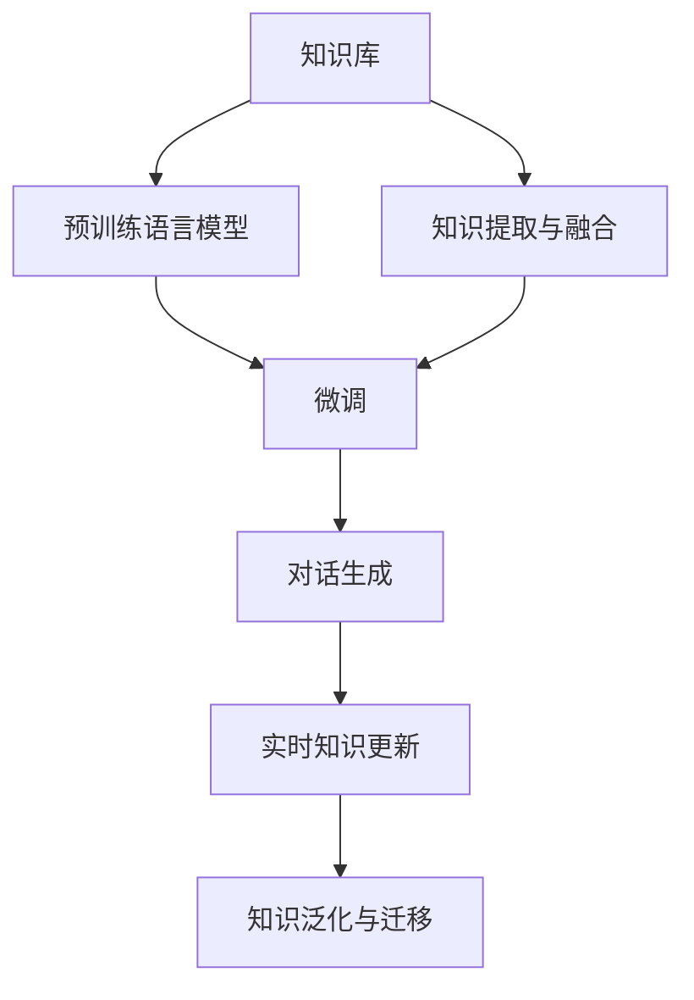

                 

# 实战五：基于知识库的销售顾问 Sales-Consultant

## 1. 背景介绍

### 1.1 问题由来

销售顾问（Sales-Consultant）系统是许多企业用于提高销售效率和客户满意度的重要工具。传统的销售顾问系统依赖于人工知识，难以应对复杂多变的销售场景，且效率低下。基于知识库的销售顾问系统，则通过预训练语言模型和微调技术，从大量的客户互动数据和产品信息中挖掘出有用的知识，实时辅助销售顾问进行决策。

传统的销售顾问系统面临的主要挑战包括：
1. **知识更新滞后**：人工知识库难以及时更新，无法适应快速变化的销售场景。
2. **知识获取难度大**：需要大量的人工标注和专家审核，成本高、效率低。
3. **知识泛化能力差**：难以应对复杂多变的销售对话，无法提供精准的个性化建议。

基于知识库的销售顾问系统则利用预训练语言模型和微调技术，从大量历史数据中学习出通用的语言知识和销售策略，通过在特定任务上的微调，提升系统的个性化推荐和情境化决策能力。这种系统可以实时从知识库中检索并应用知识，显著提高销售顾问的效率和效果。

### 1.2 问题核心关键点

基于知识库的销售顾问系统主要关注以下几个核心关键点：

1. **知识表示与存储**：如何将知识以结构化或非结构化的形式存储，方便系统检索和应用。
2. **知识提取与融合**：如何从原始数据中自动提取出有用的知识，并将其与现有知识进行融合，形成系统的知识库。
3. **基于知识库的对话生成**：如何利用知识库生成自然流畅的对话，辅助销售顾问进行决策。
4. **实时知识更新**：如何保证知识库的及时更新，使其始终处于最新状态。
5. **知识泛化与迁移**：如何使系统能够泛化到不同的销售场景和客户，提供个性化的服务。

这些关键点构成了基于知识库的销售顾问系统的核心框架，使其能够在复杂多变的销售环境中提供精准、实时的辅助决策支持。

## 2. 核心概念与联系

### 2.1 核心概念概述

为了更好地理解基于知识库的销售顾问系统，本节将介绍几个密切相关的核心概念：

- **知识库（Knowledge Base）**：用于存储和检索知识的结构化或非结构化数据。可以是数据库、文本文档、图谱等形式。
- **预训练语言模型（Pre-trained Language Model）**：通过大规模无标签文本数据预训练得到的通用语言模型，如BERT、GPT等。
- **微调（Fine-tuning）**：指在预训练模型的基础上，使用下游任务的少量标注数据，通过有监督学习优化模型在该任务上的性能。
- **知识提取与融合（Knowledge Extraction & Integration）**：从原始数据中自动提取出有用的知识，并将其与现有知识进行融合，形成系统的知识库。
- **对话生成（Dialogue Generation）**：利用知识库生成自然流畅的对话，辅助销售顾问进行决策。
- **实时知识更新（Real-time Knowledge Update）**：保证知识库的及时更新，使其始终处于最新状态。
- **知识泛化与迁移（Knowledge Generalization & Transfer）**：使系统能够泛化到不同的销售场景和客户，提供个性化的服务。

这些核心概念之间的逻辑关系可以通过以下Mermaid流程图来展示：



这个流程图展示了大语言模型、知识库、微调、知识提取与融合、对话生成、实时更新、泛化迁移等核心概念及其之间的关系：

1. 知识库为预训练语言模型提供了丰富的知识。
2. 预训练语言模型通过微调，使其具备下游任务的处理能力。
3. 知识提取与融合使系统能够自动获取和整合新知识。
4. 对话生成利用知识库生成自然流畅的对话。
5. 实时更新保持知识库的时效性和相关性。
6. 泛化迁移使系统能够适应不同的销售场景和客户需求。

这些概念共同构成了基于知识库的销售顾问系统的核心框架，使其能够在复杂多变的销售环境中提供精准、实时的辅助决策支持。

## 3. 核心算法原理 & 具体操作步骤
### 3.1 算法原理概述

基于知识库的销售顾问系统，本质上是一种结合了预训练语言模型和微调技术的知识驱动型系统。其核心思想是：通过预训练语言模型学习通用的语言知识，将其微调到特定的销售任务上，结合知识库中的领域知识，生成个性化的销售建议，并根据实时对话动态更新知识库，保证知识的时效性和相关性。

形式化地，假设知识库为 $K$，预训练语言模型为 $M_{\theta}$，其中 $\theta$ 为预训练得到的模型参数。微调后的模型为 $M_{\hat{\theta}}$，目标是将 $M_{\hat{\theta}}$ 在知识库 $K$ 上应用，生成推荐结果 $R$。

微调的过程可以表示为：

$$
\hat{\theta} = \mathop{\arg\min}_{\theta} \mathcal{L}(M_{\theta}, K)
$$

其中 $\mathcal{L}$ 为损失函数，用于衡量模型输出与知识库的推荐结果之间的差异。常见的损失函数包括交叉熵损失、均方误差损失等。

通过梯度下降等优化算法，微调过程不断更新模型参数 $\theta$，最小化损失函数 $\mathcal{L}$，使得模型输出逼近知识库的推荐结果。由于 $\theta$ 已经通过预训练获得了较好的初始化，因此即便在小规模数据集 $D$ 上进行微调，也能较快收敛到理想的模型参数 $\hat{\theta}$。

### 3.2 算法步骤详解

基于知识库的销售顾问系统通常包括以下几个关键步骤：

**Step 1: 准备知识库和预训练模型**
- 选择合适的预训练语言模型 $M_{\theta}$ 作为初始化参数，如 BERT、GPT等。
- 准备知识库 $K$，存储领域知识，如产品信息、销售策略、客户反馈等。

**Step 2: 定义任务适配层**
- 根据任务类型，在预训练模型顶层设计合适的输出层和损失函数。
- 对于推荐任务，通常在顶层添加评分函数和交叉熵损失函数。
- 对于对话生成任务，使用语言模型的解码器输出概率分布，并以负对数似然为损失函数。

**Step 3: 设置微调超参数**
- 选择合适的优化算法及其参数，如 AdamW、SGD 等，设置学习率、批大小、迭代轮数等。
- 设置正则化技术及强度，包括权重衰减、Dropout、Early Stopping 等。
- 确定冻结预训练参数的策略，如仅微调顶层，或全部参数都参与微调。

**Step 4: 执行梯度训练**
- 将知识库数据分批次输入模型，前向传播计算损失函数。
- 反向传播计算参数梯度，根据设定的优化算法和学习率更新模型参数。
- 周期性在验证集上评估模型性能，根据性能指标决定是否触发 Early Stopping。
- 重复上述步骤直到满足预设的迭代轮数或 Early Stopping 条件。

**Step 5: 知识库更新与对话生成**
- 在训练过程中，实时从知识库中检索并更新对话历史。
- 将更新后的对话历史作为输入，微调后的模型进行对话生成和推荐。

### 3.3 算法优缺点

基于知识库的销售顾问系统具有以下优点：
1. **泛化能力强**：结合了预训练语言模型和知识库，能够泛化到不同的销售场景和客户。
2. **实时更新**：结合实时对话更新知识库，保证知识的时效性和相关性。
3. **个性化推荐**：利用知识库生成个性化的销售建议，提高客户满意度。
4. **高效性**：基于预训练语言模型的微调，能够快速适应新任务，减少从头训练的计算成本。
5. **可解释性强**：知识库中的知识可以直观地解释推荐结果，提高系统的透明度和可信度。

同时，该方法也存在一定的局限性：
1. **依赖知识库质量**：知识库的质量直接影响系统的性能，构建高质量知识库成本较高。
2. **知识泛化不足**：对于一些极端、罕见的销售场景，可能无法从知识库中检索到相关知识。
3. **知识迁移难度大**：不同领域的知识库难以直接迁移应用，需要针对特定领域进行定制化微调。
4. **对抗样本风险**：知识库中的知识可能包含偏见和错误，在对抗样本攻击下容易失效。
5. **系统复杂度高**：系统需要同时处理大量的知识库数据和实时对话，对硬件和算法的要求较高。

尽管存在这些局限性，但就目前而言，基于知识库的销售顾问系统仍是大语言模型应用的一种重要范式。未来相关研究的重点在于如何进一步降低知识库构建的难度，提高系统的泛化能力和迁移能力，同时兼顾可解释性和安全性等因素。

### 3.4 算法应用领域

基于知识库的销售顾问系统已经在许多领域得到了广泛的应用，包括但不限于以下领域：

- **电商平台**：利用知识库提供个性化商品推荐，提高销售转化率。
- **企业客服**：结合知识库进行智能客服对话，提升客户服务体验。
- **房地产**：利用知识库进行房产推荐和客户咨询，提高销售效率。
- **金融**：结合知识库进行金融产品推荐和客户咨询，提升金融服务质量。
- **旅游**：结合知识库进行旅游产品推荐和客户咨询，提升旅游体验。
- **医疗**：结合知识库进行医疗咨询和诊断建议，提高医疗服务水平。

除了上述这些经典应用外，基于知识库的销售顾问系统还在不断拓展新的应用场景，如教育、能源、制造业等，为不同行业的数字化转型升级提供了新的技术路径。

## 4. 数学模型和公式 & 详细讲解 & 举例说明

### 4.1 数学模型构建

本节将使用数学语言对基于知识库的销售顾问系统进行更加严格的刻画。

假设知识库为 $K=\{(k_i, r_i)\}_{i=1}^N$，其中 $k_i$ 为知识项，$r_i$ 为对应的推荐结果。预训练语言模型为 $M_{\theta}$，其中 $\theta$ 为预训练得到的模型参数。

定义模型 $M_{\theta}$ 在知识库 $K$ 上的损失函数为 $\mathcal{L}(\theta, K)$，用于衡量模型输出与知识库的推荐结果之间的差异。常见的损失函数包括交叉熵损失、均方误差损失等。

微调的目标是最小化损失函数，即找到最优参数：

$$
\hat{\theta} = \mathop{\arg\min}_{\theta} \mathcal{L}(\theta, K)
$$

在实践中，我们通常使用基于梯度的优化算法（如SGD、Adam等）来近似求解上述最优化问题。设 $\eta$ 为学习率，$\lambda$ 为正则化系数，则参数的更新公式为：

$$
\theta \leftarrow \theta - \eta \nabla_{\theta}\mathcal{L}(\theta, K) - \eta\lambda\theta
$$

其中 $\nabla_{\theta}\mathcal{L}(\theta, K)$ 为损失函数对参数 $\theta$ 的梯度，可通过反向传播算法高效计算。

### 4.2 公式推导过程

以下我们以二分类任务为例，推导交叉熵损失函数及其梯度的计算公式。

假设模型 $M_{\theta}$ 在输入 $k_i$ 上的输出为 $\hat{r}_i=M_{\theta}(k_i) \in [0,1]$，表示知识项 $k_i$ 与推荐结果 $r_i$ 的匹配程度。定义二分类交叉熵损失函数：

$$
\ell(M_{\theta}(k_i),r_i) = -[r_i\log \hat{r}_i + (1-r_i)\log (1-\hat{r}_i)]
$$

将其代入损失函数公式，得：

$$
\mathcal{L}(\theta, K) = -\frac{1}{N}\sum_{i=1}^N [r_i\log M_{\theta}(k_i)+(1-r_i)\log(1-M_{\theta}(k_i))]
$$

根据链式法则，损失函数对参数 $\theta_k$ 的梯度为：

$$
\frac{\partial \mathcal{L}(\theta, K)}{\partial \theta_k} = -\frac{1}{N}\sum_{i=1}^N (\frac{r_i}{M_{\theta}(k_i)}-\frac{1-r_i}{1-M_{\theta}(k_i)}) \frac{\partial M_{\theta}(k_i)}{\partial \theta_k}
$$

其中 $\frac{\partial M_{\theta}(k_i)}{\partial \theta_k}$ 可进一步递归展开，利用自动微分技术完成计算。

在得到损失函数的梯度后，即可带入参数更新公式，完成模型的迭代优化。重复上述过程直至收敛，最终得到适应知识库的最优模型参数 $\hat{\theta}$。

## 5. 项目实践：代码实例和详细解释说明

### 5.1 开发环境搭建

在进行销售顾问系统微调实践前，我们需要准备好开发环境。以下是使用Python进行PyTorch开发的环境配置流程：

1. 安装Anaconda：从官网下载并安装Anaconda，用于创建独立的Python环境。

2. 创建并激活虚拟环境：
```bash
conda create -n sales-consultant-env python=3.8 
conda activate sales-consultant-env
```

3. 安装PyTorch：根据CUDA版本，从官网获取对应的安装命令。例如：
```bash
conda install pytorch torchvision torchaudio cudatoolkit=11.1 -c pytorch -c conda-forge
```

4. 安装Transformers库：
```bash
pip install transformers
```

5. 安装各类工具包：
```bash
pip install numpy pandas scikit-learn matplotlib tqdm jupyter notebook ipython
```

完成上述步骤后，即可在`sales-consultant-env`环境中开始微调实践。

### 5.2 源代码详细实现

这里我们以知识库中的房产推荐任务为例，给出使用Transformers库对BERT模型进行微调的PyTorch代码实现。

首先，定义房产推荐任务的数据处理函数：

```python
from transformers import BertTokenizer
from torch.utils.data import Dataset
import torch

class PropertyDataset(Dataset):
    def __init__(self, texts, tags, tokenizer, max_len=128):
        self.texts = texts
        self.tags = tags
        self.tokenizer = tokenizer
        self.max_len = max_len
        
    def __len__(self):
        return len(self.texts)
    
    def __getitem__(self, item):
        text = self.texts[item]
        tags = self.tags[item]
        
        encoding = self.tokenizer(text, return_tensors='pt', max_length=self.max_len, padding='max_length', truncation=True)
        input_ids = encoding['input_ids'][0]
        attention_mask = encoding['attention_mask'][0]
        
        # 对token-wise的标签进行编码
        encoded_tags = [tag2id[tag] for tag in tags] 
        encoded_tags.extend([tag2id['None']] * (self.max_len - len(encoded_tags)))
        labels = torch.tensor(encoded_tags, dtype=torch.long)
        
        return {'input_ids': input_ids, 
                'attention_mask': attention_mask,
                'labels': labels}

# 标签与id的映射
tag2id = {'None': 0, 'High': 1, 'Medium': 2, 'Low': 3}
id2tag = {v: k for k, v in tag2id.items()}

# 创建dataset
tokenizer = BertTokenizer.from_pretrained('bert-base-cased')

train_dataset = PropertyDataset(train_texts, train_tags, tokenizer)
dev_dataset = PropertyDataset(dev_texts, dev_tags, tokenizer)
test_dataset = PropertyDataset(test_texts, test_tags, tokenizer)
```

然后，定义模型和优化器：

```python
from transformers import BertForTokenClassification, AdamW

model = BertForTokenClassification.from_pretrained('bert-base-cased', num_labels=len(tag2id))

optimizer = AdamW(model.parameters(), lr=2e-5)
```

接着，定义训练和评估函数：

```python
from torch.utils.data import DataLoader
from tqdm import tqdm
from sklearn.metrics import classification_report

device = torch.device('cuda') if torch.cuda.is_available() else torch.device('cpu')
model.to(device)

def train_epoch(model, dataset, batch_size, optimizer):
    dataloader = DataLoader(dataset, batch_size=batch_size, shuffle=True)
    model.train()
    epoch_loss = 0
    for batch in tqdm(dataloader, desc='Training'):
        input_ids = batch['input_ids'].to(device)
        attention_mask = batch['attention_mask'].to(device)
        labels = batch['labels'].to(device)
        model.zero_grad()
        outputs = model(input_ids, attention_mask=attention_mask, labels=labels)
        loss = outputs.loss
        epoch_loss += loss.item()
        loss.backward()
        optimizer.step()
    return epoch_loss / len(dataloader)

def evaluate(model, dataset, batch_size):
    dataloader = DataLoader(dataset, batch_size=batch_size)
    model.eval()
    preds, labels = [], []
    with torch.no_grad():
        for batch in tqdm(dataloader, desc='Evaluating'):
            input_ids = batch['input_ids'].to(device)
            attention_mask = batch['attention_mask'].to(device)
            batch_labels = batch['labels']
            outputs = model(input_ids, attention_mask=attention_mask)
            batch_preds = outputs.logits.argmax(dim=2).to('cpu').tolist()
            batch_labels = batch_labels.to('cpu').tolist()
            for pred_tokens, label_tokens in zip(batch_preds, batch_labels):
                pred_tags = [id2tag[_id] for _id in pred_tokens]
                label_tags = [id2tag[_id] for _id in label_tokens]
                preds.append(pred_tags[:len(label_tags)])
                labels.append(label_tags)
                
    print(classification_report(labels, preds))
```

最后，启动训练流程并在测试集上评估：

```python
epochs = 5
batch_size = 16

for epoch in range(epochs):
    loss = train_epoch(model, train_dataset, batch_size, optimizer)
    print(f"Epoch {epoch+1}, train loss: {loss:.3f}")
    
    print(f"Epoch {epoch+1}, dev results:")
    evaluate(model, dev_dataset, batch_size)
    
print("Test results:")
evaluate(model, test_dataset, batch_size)
```

以上就是使用PyTorch对BERT进行房产推荐任务微调的完整代码实现。可以看到，得益于Transformers库的强大封装，我们可以用相对简洁的代码完成BERT模型的加载和微调。

### 5.3 代码解读与分析

让我们再详细解读一下关键代码的实现细节：

**PropertyDataset类**：
- `__init__`方法：初始化文本、标签、分词器等关键组件。
- `__len__`方法：返回数据集的样本数量。
- `__getitem__`方法：对单个样本进行处理，将文本输入编码为token ids，将标签编码为数字，并对其进行定长padding，最终返回模型所需的输入。

**tag2id和id2tag字典**：
- 定义了标签与数字id之间的映射关系，用于将token-wise的预测结果解码回真实的标签。

**训练和评估函数**：
- 使用PyTorch的DataLoader对数据集进行批次化加载，供模型训练和推理使用。
- 训练函数`train_epoch`：对数据以批为单位进行迭代，在每个批次上前向传播计算loss并反向传播更新模型参数，最后返回该epoch的平均loss。
- 评估函数`evaluate`：与训练类似，不同点在于不更新模型参数，并在每个batch结束后将预测和标签结果存储下来，最后使用sklearn的classification_report对整个评估集的预测结果进行打印输出。

**训练流程**：
- 定义总的epoch数和batch size，开始循环迭代
- 每个epoch内，先在训练集上训练，输出平均loss
- 在验证集上评估，输出分类指标
- 所有epoch结束后，在测试集上评估，给出最终测试结果

可以看到，PyTorch配合Transformers库使得BERT微调的代码实现变得简洁高效。开发者可以将更多精力放在数据处理、模型改进等高层逻辑上，而不必过多关注底层的实现细节。

当然，工业级的系统实现还需考虑更多因素，如模型的保存和部署、超参数的自动搜索、更灵活的任务适配层等。但核心的微调范式基本与此类似。

## 6. 实际应用场景

### 6.1 销售顾问推荐

基于知识库的销售顾问系统可以广泛应用于各种销售场景，如电商平台、企业客服、房地产等。通过预训练语言模型和微调技术，系统能够从知识库中检索并生成个性化的销售建议，显著提高销售顾问的效率和效果。

在电商平台中，可以利用知识库中的商品信息、客户偏好等数据，生成个性化的商品推荐。例如，某客户在浏览某商品时，系统可以根据知识库中该商品的销量、评价、用户反馈等信息，生成推荐理由，提高客户的购买意愿。

在企业客服中，结合知识库中的产品信息、客户历史数据等，生成智能客服对话。例如，某客户咨询某产品时，系统可以根据知识库中该产品的常见问题和解答，生成智能回答，提升客户满意度。

在房地产中，利用知识库中的房产信息、市场需求等数据，生成房产推荐。例如，某客户在浏览某房产时，系统可以根据知识库中该房产的价格、面积、地理位置等信息，生成推荐理由，帮助客户做出购买决策。

### 6.2 实时知识更新

基于知识库的销售顾问系统的一个显著优势是其能够实时更新知识库，保证推荐内容的准确性和时效性。在销售顾问与客户的对话过程中，系统可以动态更新知识库，从而提供更加精准的推荐和建议。

例如，某客户在询问某产品的功能时，系统可以实时从知识库中检索该产品的最新信息，生成最新的推荐理由，避免推荐过时或错误的信息。这不仅提升了客户体验，还减少了销售顾问的工作量。

### 6.3 个性化推荐

基于知识库的销售顾问系统能够根据客户的历史行为和偏好，生成个性化的推荐内容。系统可以从知识库中检索与客户行为最相关的产品或服务，并提供详细的推荐理由，从而提升客户的购买意愿。

例如，某客户在浏览某电商网站时，系统可以根据其浏览历史、购买记录等数据，生成个性化的商品推荐。系统还可以根据客户的情感倾向，生成更加贴近客户心理的推荐内容，提高客户的购买转化率。

### 6.4 未来应用展望

随着预训练语言模型和微调技术的不断发展，基于知识库的销售顾问系统将在更多领域得到应用，为销售顾问工作提供更全面的支持。

在智慧医疗领域，基于知识库的销售顾问系统可以帮助医生推荐合适的医疗产品，提高医疗服务水平。例如，某医生在推荐某药物时，系统可以根据知识库中该药物的临床试验数据、副作用等信息，生成推荐理由，帮助医生做出更科学的选择。

在智能教育领域，结合知识库中的课程信息、学习数据等，生成个性化的学习推荐。例如，某学生在学习某课程时，系统可以根据其学习进度、兴趣偏好等数据，生成个性化的学习路径，提高学习效果。

在智慧城市治理中，基于知识库的销售顾问系统可以帮助城市管理者推荐合适的公共服务，提升城市治理效率。例如，某城市管理者在规划某项目时，系统可以根据知识库中类似项目的经验和教训，生成推荐理由，帮助管理者做出更科学的决策。

此外，在企业生产、社会治理、文娱传媒等众多领域，基于知识库的销售顾问系统也将不断涌现，为各行业的数字化转型升级提供新的技术路径。

## 7. 工具和资源推荐

### 7.1 学习资源推荐

为了帮助开发者系统掌握基于知识库的销售顾问系统的理论基础和实践技巧，这里推荐一些优质的学习资源：

1. 《Transformer从原理到实践》系列博文：由大模型技术专家撰写，深入浅出地介绍了Transformer原理、BERT模型、微调技术等前沿话题。

2. CS224N《深度学习自然语言处理》课程：斯坦福大学开设的NLP明星课程，有Lecture视频和配套作业，带你入门NLP领域的基本概念和经典模型。

3. 《Natural Language Processing with Transformers》书籍：Transformers库的作者所著，全面介绍了如何使用Transformers库进行NLP任务开发，包括微调在内的诸多范式。

4. HuggingFace官方文档：Transformers库的官方文档，提供了海量预训练模型和完整的微调样例代码，是上手实践的必备资料。

5. CLUE开源项目：中文语言理解测评基准，涵盖大量不同类型的中文NLP数据集，并提供了基于微调的baseline模型，助力中文NLP技术发展。

通过对这些资源的学习实践，相信你一定能够快速掌握基于知识库的销售顾问系统的精髓，并用于解决实际的NLP问题。
###  7.2 开发工具推荐

高效的开发离不开优秀的工具支持。以下是几款用于基于知识库的销售顾问系统开发的常用工具：

1. PyTorch：基于Python的开源深度学习框架，灵活动态的计算图，适合快速迭代研究。大部分预训练语言模型都有PyTorch版本的实现。

2. TensorFlow：由Google主导开发的开源深度学习框架，生产部署方便，适合大规模工程应用。同样有丰富的预训练语言模型资源。

3. Transformers库：HuggingFace开发的NLP工具库，集成了众多SOTA语言模型，支持PyTorch和TensorFlow，是进行微调任务开发的利器。

4. Weights & Biases：模型训练的实验跟踪工具，可以记录和可视化模型训练过程中的各项指标，方便对比和调优。与主流深度学习框架无缝集成。

5. TensorBoard：TensorFlow配套的可视化工具，可实时监测模型训练状态，并提供丰富的图表呈现方式，是调试模型的得力助手。

6. Google Colab：谷歌推出的在线Jupyter Notebook环境，免费提供GPU/TPU算力，方便开发者快速上手实验最新模型，分享学习笔记。

合理利用这些工具，可以显著提升基于知识库的销售顾问系统的开发效率，加快创新迭代的步伐。

### 7.3 相关论文推荐

大语言模型和微调技术的发展源于学界的持续研究。以下是几篇奠基性的相关论文，推荐阅读：

1. Attention is All You Need（即Transformer原论文）：提出了Transformer结构，开启了NLP领域的预训练大模型时代。

2. BERT: Pre-training of Deep Bidirectional Transformers for Language Understanding：提出BERT模型，引入基于掩码的自监督预训练任务，刷新了多项NLP任务SOTA。

3. Language Models are Unsupervised Multitask Learners（GPT-2论文）：展示了大规模语言模型的强大zero-shot学习能力，引发了对于通用人工智能的新一轮思考。

4. Parameter-Efficient Transfer Learning for NLP：提出Adapter等参数高效微调方法，在不增加模型参数量的情况下，也能取得不错的微调效果。

5. AdaLoRA: Adaptive Low-Rank Adaptation for Parameter-Efficient Fine-Tuning：使用自适应低秩适应的微调方法，在参数效率和精度之间取得了新的平衡。

这些论文代表了大语言模型微调技术的发展脉络。通过学习这些前沿成果，可以帮助研究者把握学科前进方向，激发更多的创新灵感。

## 8. 总结：未来发展趋势与挑战

### 8.1 总结

本文对基于知识库的销售顾问系统进行了全面系统的介绍。首先阐述了基于知识库的销售顾问系统的研究背景和意义，明确了系统在提升销售效率和客户满意度方面的独特价值。其次，从原理到实践，详细讲解了系统的数学原理和关键步骤，给出了基于知识库的销售顾问系统的完整代码实例。同时，本文还广泛探讨了系统在销售顾问推荐、实时知识更新、个性化推荐等多个领域的应用前景，展示了系统的巨大潜力。此外，本文精选了系统的各类学习资源，力求为读者提供全方位的技术指引。

通过本文的系统梳理，可以看到，基于知识库的销售顾问系统正在成为NLP领域的重要范式，极大地拓展了预训练语言模型的应用边界，催生了更多的落地场景。受益于预训练语言模型和微调方法的不断进步，相信NLP技术将在更广阔的应用领域大放异彩，深刻影响人类的生产生活方式。

### 8.2 未来发展趋势

展望未来，基于知识库的销售顾问系统将呈现以下几个发展趋势：

1. **模型规模持续增大**：随着算力成本的下降和数据规模的扩张，预训练语言模型的参数量还将持续增长。超大规模语言模型蕴含的丰富语言知识，有望支撑更加复杂多变的销售场景。

2. **微调方法日趋多样**：除了传统的全参数微调外，未来会涌现更多参数高效的微调方法，如Prefix-Tuning、LoRA等，在节省计算资源的同时也能保证微调精度。

3. **持续学习成为常态**：随着数据分布的不断变化，微调模型也需要持续学习新知识以保持性能。如何在不遗忘原有知识的同时，高效吸收新样本信息，将成为重要的研究课题。

4. **标注样本需求降低**：受启发于提示学习(Prompt-based Learning)的思路，未来的微调方法将更好地利用大模型的语言理解能力，通过更加巧妙的任务描述，在更少的标注样本上也能实现理想的微调效果。

5. **多模态微调崛起**：当前的微调主要聚焦于纯文本数据，未来会进一步拓展到图像、视频、语音等多模态数据微调。多模态信息的融合，将显著提升语言模型对现实世界的理解和建模能力。

6. **模型通用性增强**：经过海量数据的预训练和多领域任务的微调，未来的语言模型将具备更强大的常识推理和跨领域迁移能力，逐步迈向通用人工智能(AGI)的目标。

以上趋势凸显了基于知识库的销售顾问系统的广阔前景。这些方向的探索发展，必将进一步提升NLP系统的性能和应用范围，为人类认知智能的进化带来深远影响。

### 8.3 面临的挑战

尽管基于知识库的销售顾问系统已经取得了瞩目成就，但在迈向更加智能化、普适化应用的过程中，它仍面临着诸多挑战：

1. **知识库质量瓶颈**：知识库的质量直接影响系统的性能，构建高质量知识库成本较高。如何降低知识库构建的难度，提高系统的泛化能力和迁移能力，还需要更多研究和实践。

2. **知识泛化不足**：对于一些极端、罕见的销售场景，可能无法从知识库中检索到相关知识。如何提高系统的泛化能力，使其能够应对更多的销售场景，还需要深入研究。

3. **知识迁移难度大**：不同领域的知识库难以直接迁移应用，需要针对特定领域进行定制化微调。如何在不改变知识库的情况下，提升系统的迁移能力，是未来的一个重要研究方向。

4. **对抗样本风险**：知识库中的知识可能包含偏见和错误，在对抗样本攻击下容易失效。如何提高系统的鲁棒性，避免对抗样本攻击，是未来的一个重要研究方向。

5. **系统复杂度高**：系统需要同时处理大量的知识库数据和实时对话，对硬件和算法的要求较高。如何降低系统的复杂度，提高实时处理能力，是未来的一个重要研究方向。

尽管存在这些挑战，但就目前而言，基于知识库的销售顾问系统仍是大语言模型应用的一种重要范式。未来相关研究的重点在于如何进一步降低知识库构建的难度，提高系统的泛化能力和迁移能力，同时兼顾可解释性和安全性等因素。

### 8.4 研究展望

面对基于知识库的销售顾问系统所面临的种种挑战，未来的研究需要在以下几个方面寻求新的突破：

1. **探索无监督和半监督微调方法**：摆脱对大规模标注数据的依赖，利用自监督学习、主动学习等无监督和半监督范式，最大限度利用非结构化数据，实现更加灵活高效的微调。

2. **研究参数高效和计算高效的微调范式**：开发更加参数高效的微调方法，在固定大部分预训练参数的同时，只更新极少量的任务相关参数。同时优化微调模型的计算图，减少前向传播和反向传播的资源消耗，实现更加轻量级、实时性的部署。

3. **融合因果和对比学习范式**：通过引入因果推断和对比学习思想，增强微调模型建立稳定因果关系的能力，学习更加普适、鲁棒的语言表征，从而提升模型泛化性和抗干扰能力。

4. **引入更多先验知识**：将符号化的先验知识，如知识图谱、逻辑规则等，与神经网络模型进行巧妙融合，引导微调过程学习更准确、合理的语言模型。同时加强不同模态数据的整合，实现视觉、语音等多模态信息与文本信息的协同建模。

5. **结合因果分析和博弈论工具**：将因果分析方法引入微调模型，识别出模型决策的关键特征，增强输出解释的因果性和逻辑性。借助博弈论工具刻画人机交互过程，主动探索并规避模型的脆弱点，提高系统稳定性。

6. **纳入伦理道德约束**：在模型训练目标中引入伦理导向的评估指标，过滤和惩罚有偏见、有害的输出倾向。同时加强人工干预和审核，建立模型行为的监管机制，确保输出符合人类价值观和伦理道德。

这些研究方向的探索，必将引领基于知识库的销售顾问系统迈向更高的台阶，为构建安全、可靠、可解释、可控的智能系统铺平道路。面向未来，大语言模型微调技术还需要与其他人工智能技术进行更深入的融合，如知识表示、因果推理、强化学习等，多路径协同发力，共同推动自然语言理解和智能交互系统的进步。只有勇于创新、敢于突破，才能不断拓展语言模型的边界，让智能技术更好地造福人类社会。

## 9. 附录：常见问题与解答

**Q1：基于知识库的销售顾问系统如何构建高质量的知识库？**

A: 构建高质量的知识库是确保系统性能的关键。以下是一些构建高质量知识库的建议：

1. **数据收集**：收集与销售场景相关的多种数据，如客户对话记录、产品信息、市场报告等。

2. **数据清洗**：清洗数据，去除噪声、重复、不相关的信息，确保数据的质量和一致性。

3. **标注与审核**：对数据进行标注，如分类、排序等，并由专家进行审核，确保标注的准确性和完备性。

4. **知识抽取**：利用NLP技术从原始数据中抽取有用的知识，如实体识别、关系抽取等。

5. **知识融合**：将抽取的知识与现有知识进行融合，构建结构化的知识库，如关系图谱、知识图谱等。

6. **知识更新**：定期更新知识库，引入新的数据和知识，保持知识的时效性和相关性。

**Q2：基于知识库的销售顾问系统如何进行参数高效微调？**

A: 参数高效微调是提高系统效率的重要手段。以下是一些参数高效微调的方法：

1. **Adapter**：在预训练模型的顶层添加Adapter层，只微调这部分参数，固定其他层权重。

2. **Prompt Tuning**：通过精心设计的输入模板，引导模型按期望方式输出，减少微调参数。

3. **KnowPrompt**：在输入中引入额外的知识信息，提高模型的泛化能力和迁移能力。

4. **LoRA**：使用低秩正交映射，将预训练模型映射到低维空间，减少微调参数量。

5. **Model Pruning**：去除不重要的层和参数，减小模型尺寸，提高推理速度。

6. **Knowledge Distillation**：将知识库中的知识转移到模型中，提高模型的泛化能力和迁移能力。

**Q3：基于知识库的销售顾问系统如何处理对抗样本？**

A: 对抗样本是系统面临的重要挑战。以下是一些处理对抗样本的方法：

1. **对抗训练**：在训练过程中加入对抗样本，提高模型的鲁棒性和抗干扰能力。

2. **模型蒸馏**：通过知识蒸馏技术，将知识库中的知识转移到模型中，提高模型的鲁棒性和泛化能力。

3. **鲁棒性评估**：定期评估模型的鲁棒性，发现和修复潜在的漏洞和风险。

4. **对抗检测**：利用对抗检测技术，识别和过滤对抗样本，提高系统的安全性。

5. **多样性生成**：在输入中引入多样性信息，增加模型的鲁棒性，避免对抗样本攻击。

通过这些方法，可以提高系统的鲁棒性，降低对抗样本风险，确保系统的安全性和稳定性。

**Q4：基于知识库的销售顾问系统如何进行实时知识更新？**

A: 实时知识更新是系统保持时效性的关键。以下是一些实时更新知识库的方法：

1. **流式数据处理**：利用流式数据处理技术，实时更新知识库，避免数据积累和滞后。

2. **分布式计算**：利用分布式计算技术，提高知识库更新和检索的效率。

3. **增量更新**：对知识库进行增量更新，只更新变化的部分，减少资源消耗。

4. **缓存机制**：利用缓存机制，加快知识库的检索速度，提高系统的响应速度。

5. **知识抽取**：利用NLP技术从实时数据中抽取有用的知识，更新知识库。

通过这些方法，可以确保知识库的时效性和相关性，使系统能够提供最新、最精准的推荐和建议。

**Q5：基于知识库的销售顾问系统如何进行多模态微调？**

A: 多模态微调是提高系统性能的重要手段。以下是一些多模态微调的方法：

1. **融合多模态数据**：将文本、图像、语音等多种模态的数据进行融合，提高系统的综合能力和泛化能力。

2. **多模态特征提取**：利用多模态特征提取技术，从不同模态中提取有用的特征，进行联合微调。

3. **多模态推理**：在模型中引入多模态推理机制，利用不同模态的信息进行综合推理。

4. **跨模态学习**：将不同模态的信息进行跨模态学习，提高模型的泛化能力和迁移能力。

5. **多模态表示学习**：利用多模态表示学习技术，学习跨模态的表示，提高模型的鲁棒性和泛化能力。

通过这些方法，可以提升系统的多模态能力和泛化能力，使系统能够应对更复杂、更丰富的销售场景。

总之，基于知识库的销售顾问系统是一种具有广泛应用前景的技术，但也需要不断优化和改进，以应对新的挑战和需求。相信在学界和产业界的共同努力下，基于知识库的销售顾问系统将不断成熟和完善，为销售顾问工作提供更加智能、高效的辅助。

