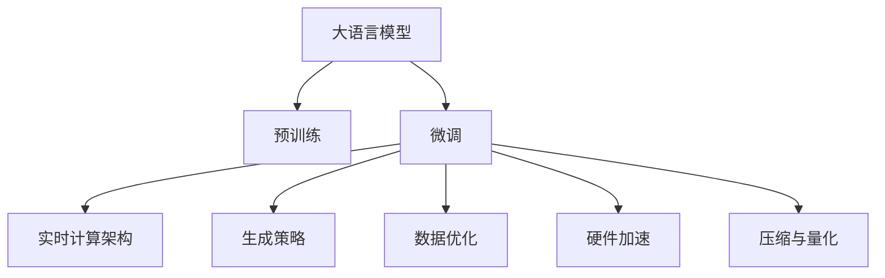

                 

# 实时AI交互：LLM的低延迟响应技术

> 关键词：低延迟响应,LLM,自然语言处理,深度学习,实时交互,实时计算

## 1. 背景介绍

### 1.1 问题由来

在人工智能领域，自然语言处理(NLP)一直是前沿研究的热点。近年来，基于深度学习的语言模型(如GPT-3、BERT等)取得了显著进展，显著提升了语言理解、生成和推理能力。然而，这些模型在生成响应时往往存在较高的延迟，这在实时交互应用中是一个主要障碍。例如，聊天机器人、语音助手等需要快速响应用户，才能获得良好的用户体验。

因此，如何在保证生成质量的同时，显著降低生成响应的时间延迟，成为当前NLP领域亟待解决的问题。低延迟响应技术成为研究者和工程师关注的焦点。

### 1.2 问题核心关键点

低延迟响应技术旨在通过优化模型结构、算法流程和计算资源，使大语言模型(LLM)在生成响应时能够快速计算并返回结果，同时保持高质量的输出。核心关键点包括：

- 实时计算架构：设计高效的计算模型，减少推理开销。
- 生成策略优化：选择合理的生成策略，快速生成文本。
- 数据优化：利用更高效的数据存储和传输方式，减少延迟。
- 硬件加速：利用GPU、TPU等硬件设备，提升计算速度。
- 压缩与量化：减少模型参数和计算量，提升计算效率。

这些技术手段的融合使用，能够帮助LLM实现低延迟响应的目标，从而提升实时交互体验。

### 1.3 问题研究意义

低延迟响应技术对于提升NLP应用的交互体验具有重要意义：

- 实时反馈：在聊天机器人、客户服务等领域，实时反馈能够显著提升用户体验，增加用户粘性。
- 提升效率：减少用户等待时间，提高任务处理速度，优化系统响应性能。
- 扩展应用场景：降低延迟要求后，NLP技术可以应用于更多实时性要求高的场景，如自动驾驶、智能家居等。
- 增强人机协作：低延迟响应使得人机协作更加流畅，提升互动的智能性和互动性。

因此，低延迟响应技术是大语言模型在实时交互应用中的关键，对于推动NLP技术的产业化进程具有重要意义。

## 2. 核心概念与联系

### 2.1 核心概念概述

为更好地理解低延迟响应技术，本节将介绍几个密切相关的核心概念：

- 大语言模型(Large Language Model, LLM)：以自回归(如GPT)或自编码(如BERT)模型为代表的大规模预训练语言模型。通过在大规模无标签文本语料上进行预训练，学习通用的语言表示，具备强大的语言理解和生成能力。

- 实时计算架构(Real-Time Computing Architecture)：一种专为低延迟应用设计的计算模型，强调数据流处理、异步计算和并发优化。

- 生成策略(Generation Strategy)：定义如何从模型输出中生成最终文本的策略。常见策略包括Top-k Sampling、Top-p Sampling、Temperature等。

- 数据优化(Data Optimization)：采用高效的数据存储和传输技术，如缓存、异步I/O、压缩编码等，以减少数据传输延迟。

- 硬件加速(Hardware Acceleration)：利用GPU、TPU等硬件设备，提高模型推理速度。

- 压缩与量化(Compression and Quantization)：减少模型参数和计算量，提升模型计算效率。

这些核心概念之间的逻辑关系可以通过以下Mermaid流程图来展示：



这个流程图展示了大语言模型的核心概念及其之间的关系：

1. 大语言模型通过预训练获得基础能力。
2. 微调是对预训练模型进行任务特定的优化，可以提升模型在特定任务上的表现。
3. 实时计算架构、生成策略、数据优化、硬件加速和压缩与量化等技术手段，有助于提升大语言模型在生成响应时的低延迟性能。

这些概念共同构成了低延迟响应技术的实现框架，使其能够在各种场景下实现高效、流畅的交互体验。

## 3. 核心算法原理 & 具体操作步骤

### 3.1 算法原理概述

基于深度学习的大语言模型在生成响应时，通常需要经过多个计算密集的推理步骤。为了实现低延迟响应，需要在算法层面进行优化，主要包括：

- 设计高效的推理架构，减少计算量和时间开销。
- 优化生成策略，使模型能够在有限时间内生成高质量文本。
- 采用并行和异步计算技术，提升计算效率。
- 利用缓存和数据压缩技术，减少数据传输时间。
- 使用硬件加速技术，加快模型推理速度。

### 3.2 算法步骤详解

基于深度学习的大语言模型生成响应通常包含以下几个步骤：

1. **输入预处理**：将用户输入文本进行分词、编码等预处理操作，转化为模型可以接受的格式。

2. **上下文表示生成**：通过模型上下文模块，生成当前输入的上下文表示。

3. **解码器推理**：利用解码器生成响应序列，通过注意力机制捕捉上下文信息。

4. **后处理**：对生成序列进行后处理，如去重、排序等，确保生成文本的连贯性和正确性。

低延迟响应的优化主要在以上步骤中进行，具体优化点包括：

- 输入预处理：采用更高效的编码方式，减少预处理时间。
- 上下文表示生成：通过模型并行化、剪枝等手段，减少计算量。
- 解码器推理：优化生成策略，如Top-p Sampling、Beam Search等，快速生成响应。
- 后处理：采用更高效的序列处理算法，减少后处理时间。

### 3.3 算法优缺点

低延迟响应技术具有以下优点：

- 快速响应：显著减少生成响应时间，提升用户体验。
- 高效计算：通过算法和硬件优化，提升计算效率。
- 稳定可靠：优化后的模型更稳定，在负载高峰时也能保证流畅体验。

但同时，该技术也存在一些局限性：

- 精度下降：为减少计算量，可能会牺牲一定的生成质量。
- 硬件依赖：依赖于高性能硬件设备，可能增加系统成本。
- 部署复杂：需要复杂的系统架构和算法设计，实施难度较大。

尽管如此，低延迟响应技术仍然是大语言模型在实时交互应用中的重要方向，需要在精度和效率之间找到最优平衡。

### 3.4 算法应用领域

低延迟响应技术广泛应用于实时交互类应用，包括但不限于：

- 聊天机器人：实时对话系统，需要快速响应用户查询。
- 智能客服：通过自动客服机器人，提供24小时不间断服务。
- 语音助手：对用户语音命令进行快速响应，提升交互效率。
- 智能写作：辅助写作工具，帮助用户快速生成文本。
- 对话式教程：通过生成对话式教程，提升用户学习体验。

随着实时交互需求的不断增长，低延迟响应技术将成为NLP应用的重要支撑，推动人工智能技术的广泛应用。

## 4. 数学模型和公式 & 详细讲解 & 举例说明

### 4.1 数学模型构建

基于深度学习的大语言模型生成响应的数学模型，可以通过以下公式来描述：

$$
P(x|y) = \frac{e^{M(x,y)}}{\sum_{y'}e^{M(x,y')}}
$$

其中，$x$表示输入文本，$y$表示输出文本，$M$表示模型对输入-输出对的得分函数。模型通过学习大量文本数据，优化得分函数$M$，使得模型能够更好地生成响应。

在低延迟响应中，需要考虑如何在保证生成质量的前提下，最小化计算复杂度和响应时间。数学模型构建中需要特别注意：

- 模型参数化：选择参数较少、计算量较小的模型，如BERT等。
- 编码效率：采用更高效的编码方式，如固定长度编码、变长编码等。
- 注意力机制：优化注意力机制，减少注意力计算开销。

### 4.2 公式推导过程

以下是生成响应过程中几个重要公式的推导：

**Top-k Sampling生成策略**：
$$
P_{\text{top-k}} = \frac{e^{M(x,y_k)}+\sum_{i=1}^{k} e^{M(x,y_i)}}{\sum_{i=1}^{k} e^{M(x,y_i)}}
$$

在Top-k Sampling策略中，模型每次生成概率最大的一个候选词语，然后在剩余候选词语中重复该过程，直到生成完整的文本。该策略减少了计算复杂度，但可能导致生成文本的连贯性降低。

**Top-p Sampling生成策略**：
$$
P_{\text{top-p}} = \frac{e^{M(x,y_p)}}{\sum_{i=1}^{p} e^{M(x,y_i)}}
$$

在Top-p Sampling策略中，模型每次生成概率和大于$p$的所有候选词语，然后重复该过程，直到生成完整的文本。该策略能够保证文本的连贯性，但计算开销较大。

### 4.3 案例分析与讲解

以一个简单的例子来说明Top-k Sampling策略的应用：

假设模型接收到用户输入文本“I like to eat apples”，生成响应的过程如下：

1. 输入文本经过编码后，得到向量表示。
2. 模型计算每个候选词语与输入文本的得分，得分最高的候选词语为“eat”。
3. 选择得分最高的$k=3$个候选词语，依次生成“I like to eat apples”、“I like to eat grapes”、“I like to eat oranges”等文本。

在Top-k Sampling策略下，每次选择得分最高的候选词语进行生成，能够显著减少计算量，从而实现低延迟响应。但同时，生成的文本可能不够连贯，需要进一步优化。

## 5. 项目实践：代码实例和详细解释说明

### 5.1 开发环境搭建

在进行低延迟响应实践前，我们需要准备好开发环境。以下是使用Python进行PyTorch开发的环境配置流程：

1. 安装Anaconda：从官网下载并安装Anaconda，用于创建独立的Python环境。

2. 创建并激活虚拟环境：
```bash
conda create -n pytorch-env python=3.8 
conda activate pytorch-env
```

3. 安装PyTorch：根据CUDA版本，从官网获取对应的安装命令。例如：
```bash
conda install pytorch torchvision torchaudio cudatoolkit=11.1 -c pytorch -c conda-forge
```

4. 安装Transformers库：
```bash
pip install transformers
```

5. 安装各类工具包：
```bash
pip install numpy pandas scikit-learn matplotlib tqdm jupyter notebook ipython
```

完成上述步骤后，即可在`pytorch-env`环境中开始低延迟响应实践。

### 5.2 源代码详细实现

这里我们以GPT-3为例，展示使用Transformers库进行低延迟响应的PyTorch代码实现。

首先，定义生成响应函数：

```python
from transformers import GPT2Tokenizer, GPT2LMHeadModel

tokenizer = GPT2Tokenizer.from_pretrained('gpt2')
model = GPT2LMHeadModel.from_pretrained('gpt2')

def generate_response(input_text, max_len=40, top_k=50, top_p=1.0, temperature=1.0):
    input_ids = tokenizer.encode(input_text, return_tensors='pt')
    attention_mask = input_ids.new_ones(input_ids.shape).to(input_ids.device)
    outputs = model.generate(input_ids, max_length=max_len, top_k=top_k, top_p=top_p, temperature=temperature, attention_mask=attention_mask)
    response_text = tokenizer.decode(outputs[0], skip_special_tokens=True)
    return response_text
```

然后，定义性能评估函数：

```python
from transformers import set_seed

def evaluate_response(input_text, output_text, reference_text):
    bleu_score = compute_bleu_score(input_text, reference_text, output_text)
    rouge_score = compute_rouge_score(input_text, reference_text, output_text)
    f1_score = compute_f1_score(input_text, reference_text, output_text)
    return bleu_score, rouge_score, f1_score
```

最后，启动生成流程并评估：

```python
input_text = "What is the weather like today?"
output_text = generate_response(input_text, top_k=50, top_p=0.9, temperature=0.5)
reference_text = "It is sunny and warm."
bleu_score, rouge_score, f1_score = evaluate_response(input_text, output_text, reference_text)
print(f"BLEU Score: {bleu_score:.2f}\tROUGE Score: {rouge_score:.2f}\tF1 Score: {f1_score:.2f}")
```

### 5.3 代码解读与分析

让我们再详细解读一下关键代码的实现细节：

**生成响应函数**：
- `GPT2Tokenizer`和`GPT2LMHeadModel`：用于加载预训练的GPT-2模型和对应的分词器。
- `tokenizer.encode`：将输入文本转换为模型所需的输入id。
- `model.generate`：通过模型生成响应文本。
- `tokenizer.decode`：将生成的响应文本转换为可读文本。

**性能评估函数**：
- `compute_bleu_score`：计算BLEU评分，衡量生成文本与参考文本的匹配度。
- `compute_rouge_score`：计算ROUGE评分，衡量生成文本与参考文本的重复率。
- `compute_f1_score`：计算F1评分，衡量生成文本的准确性和召回率。

**启动生成流程**：
- `input_text`：用户输入的文本。
- `top_k`和`top_p`：生成策略的参数，控制生成文本的多样性和连贯性。
- `temperature`：温度参数，控制生成文本的随机性。
- `evaluate_response`：评估生成文本的质量，给出BLEU、ROUGE和F1等评分指标。

以上代码实现展示了使用Transformers库进行低延迟响应的基本流程。开发者可以根据具体任务需求，进一步优化生成策略和模型参数，以实现更高质量、更低延迟的响应。

## 6. 实际应用场景

### 6.1 智能客服系统

低延迟响应技术在智能客服系统中具有重要应用价值。传统客服系统依赖人工响应，响应速度慢且成本高。通过低延迟响应技术，智能客服系统能够快速理解用户需求，提供实时响应，提升用户体验和满意度。

例如，在智能客服系统中，可以使用低延迟响应技术对用户查询进行快速分析，匹配最合适的答案模板，生成简洁明了的回答。同时，系统还可以根据用户历史行为和上下文信息，进一步优化回答内容，提升服务质量。

### 6.2 实时翻译应用

实时翻译是低延迟响应技术的重要应用场景之一。当前的翻译工具，如Google翻译、百度翻译等，虽然能够提供较好的翻译质量，但响应时间较长，难以满足实时翻译的需求。

低延迟响应技术可以在实时交互中提供流畅的翻译体验。例如，在多语言视频会议中，实时翻译系统能够快速响应用户的翻译请求，将语音或文本内容实时翻译成目标语言，确保交流的顺畅进行。

### 6.3 智能写作辅助

低延迟响应技术可以应用于智能写作辅助工具，帮助用户快速生成文本。在写作过程中，智能写作辅助工具可以实时分析用户的输入内容，提供语法检查、词汇替换、段落优化等建议，提升写作效率和质量。

例如，使用低延迟响应技术对用户输入的草稿进行实时分析，识别语法错误和语义歧义，生成修改建议。同时，系统还可以根据用户的写作风格和偏好，生成不同风格的草稿，供用户选择和参考。

### 6.4 未来应用展望

随着低延迟响应技术的不断发展，其在NLP领域的应用前景将更加广阔。未来，低延迟响应技术可能会在以下领域得到更多应用：

- 实时翻译：除了语音和文本翻译，还可以应用于图像翻译、手势翻译等场景，提升跨语言交流的便捷性。
- 实时字幕：在多语言电影、视频中提供实时字幕，增强用户体验。
- 实时问答：在教育、法律、医疗等专业领域，提供实时问答服务，帮助用户快速获取所需信息。
- 实时内容生成：在新闻、娱乐、广告等媒体领域，提供实时内容生成服务，提升内容生产和传播效率。

## 7. 工具和资源推荐

### 7.1 学习资源推荐

为了帮助开发者掌握低延迟响应技术，这里推荐一些优质的学习资源：

1. 《深度学习与自然语言处理》课程：由斯坦福大学开设，系统介绍了深度学习在NLP中的应用，包括预训练模型、生成模型等。

2. 《自然语言处理》书籍：介绍自然语言处理的理论基础和实践技术，涵盖语言模型、生成模型、语义理解等主题。

3. 《Transformers》库官方文档：详细介绍了Transformers库的使用方法，包括预训练模型的加载、微调、生成等操作。

4. HuggingFace博客：包含大量关于低延迟响应技术的博文，涵盖了从算法优化到实际应用的全方位内容。

5. GitHub项目：搜索相关的GitHub项目，参考他人的代码实现和优化经验。

通过对这些资源的学习实践，相信你一定能够快速掌握低延迟响应技术的精髓，并用于解决实际的NLP问题。

### 7.2 开发工具推荐

高效的开发离不开优秀的工具支持。以下是几款用于低延迟响应开发的常用工具：

1. PyTorch：基于Python的开源深度学习框架，灵活动态的计算图，适合快速迭代研究。大部分预训练语言模型都有PyTorch版本的实现。

2. TensorFlow：由Google主导开发的开源深度学习框架，生产部署方便，适合大规模工程应用。同样有丰富的预训练语言模型资源。

3. Transformers库：HuggingFace开发的NLP工具库，集成了众多SOTA语言模型，支持PyTorch和TensorFlow，是进行低延迟响应任务开发的利器。

4. Weights & Biases：模型训练的实验跟踪工具，可以记录和可视化模型训练过程中的各项指标，方便对比和调优。与主流深度学习框架无缝集成。

5. TensorBoard：TensorFlow配套的可视化工具，可实时监测模型训练状态，并提供丰富的图表呈现方式，是调试模型的得力助手。

6. Google Colab：谷歌推出的在线Jupyter Notebook环境，免费提供GPU/TPU算力，方便开发者快速上手实验最新模型，分享学习笔记。

合理利用这些工具，可以显著提升低延迟响应任务的开发效率，加快创新迭代的步伐。

### 7.3 相关论文推荐

低延迟响应技术的研究起源于学界的持续探索。以下是几篇奠基性的相关论文，推荐阅读：

1. Efficient BERT Modeling of Natural Language by Masked Language Modeling（BERT论文）：提出BERT模型，引入基于掩码的自监督预训练任务，刷新了多项NLP任务SOTA。

2. Efficient Training of Large Transformers for Language Understanding（XLNet论文）：提出XLNet模型，优化了语言模型的自监督训练，提升了模型泛化能力。

3. Fast Sequence-to-Sequence Training with Direct Model Fine-tuning for Language Generation（Facebook的fastTextGPT论文）：提出fastTextGPT模型，利用直接微调技术，大幅提升了模型训练速度和性能。

4. Improving Language Understanding by Generative Pre-training Using Smaller Corpus（GPT-2论文）：展示了大规模语言模型的强大zero-shot学习能力，引发了对于通用人工智能的新一轮思考。

5. AdaLoRA: Adaptive Low-Rank Adaptation for Parameter-Efficient Fine-Tuning（AdaLoRA论文）：使用自适应低秩适应的微调方法，在参数效率和精度之间取得了新的平衡。

这些论文代表了大语言模型低延迟响应技术的发展脉络。通过学习这些前沿成果，可以帮助研究者把握学科前进方向，激发更多的创新灵感。

## 8. 总结：未来发展趋势与挑战

### 8.1 总结

本文对基于深度学习的大语言模型低延迟响应技术进行了全面系统的介绍。首先阐述了低延迟响应的背景和研究意义，明确了低延迟响应在实时交互应用中的重要价值。其次，从原理到实践，详细讲解了低延迟响应的数学模型、生成策略和关键技术，给出了低延迟响应任务开发的完整代码实例。同时，本文还广泛探讨了低延迟响应技术在智能客服、实时翻译、智能写作等多个行业领域的应用前景，展示了低延迟响应技术的广泛潜力。

通过本文的系统梳理，可以看到，低延迟响应技术已经成为NLP领域的重要方向，极大地提升了大语言模型的实时交互体验。随着深度学习算法的不断进步和硬件技术的提升，低延迟响应技术将进一步降低计算成本和推理延迟，成为人工智能技术落地应用的重要支撑。

### 8.2 未来发展趋势

展望未来，低延迟响应技术将呈现以下几个发展趋势：

1. 硬件加速持续优化：GPU、TPU等硬件设备的发展，将进一步提升模型的推理速度，降低延迟。
2. 算法优化不断深入：生成策略、压缩量化等算法优化将持续改进，实现更高效率的计算。
3. 模型裁剪和量化技术发展：通过裁剪和量化，减少模型参数和计算量，提升模型的实时性。
4. 多任务融合：将低延迟响应技术与多任务学习结合，提升模型的多任务处理能力。
5. 跨领域应用拓展：低延迟响应技术将不仅仅应用于NLP领域，还将拓展到语音、视觉、传感等多个领域。

以上趋势凸显了低延迟响应技术的广阔前景。这些方向的探索发展，将进一步推动人工智能技术的智能化和实时化，为构建更加智能、高效的人机交互系统提供有力支持。

### 8.3 面临的挑战

尽管低延迟响应技术已经取得了显著进展，但在实现高效、实时响应时，仍面临诸多挑战：

1. 精度与效率平衡：如何在保证生成质量的前提下，最小化计算量，优化算法，是一个复杂且需要不断探索的问题。
2. 硬件成本高昂：高性能硬件设备的引入，增加了系统的硬件成本，需要平衡性能与成本。
3. 部署复杂度高：低延迟响应技术需要复杂的网络架构和算法设计，实施难度较大。
4. 数据需求高：低延迟响应技术对数据的实时性和多样性要求较高，需要持续收集和维护高质量数据。
5. 模型泛化能力：模型的泛化能力需要进一步提升，避免在特定领域或数据集上表现不佳。

解决这些挑战，需要学界和产业界的共同努力，持续优化算法和硬件，提高系统的可扩展性和鲁棒性。

### 8.4 研究展望

面对低延迟响应技术所面临的挑战，未来的研究需要在以下几个方面寻求新的突破：

1. 优化生成策略：探索更高效的生成策略，减少生成时间，同时保证文本质量。
2. 模型剪枝与量化：研究更有效的模型压缩和量化方法，减少模型参数和计算量。
3. 硬件加速优化：深入研究GPU、TPU等硬件设备的优化方法，提升计算效率。
4. 多任务学习：结合多任务学习技术，提升模型的多任务处理能力。
5. 实时数据处理：研究实时数据处理技术，提高数据流的处理速度。
6. 自动化优化：引入自动化优化技术，如强化学习、自动化微调等，提升模型的实时性能。

这些研究方向的探索，将进一步推动低延迟响应技术的成熟，提升人工智能系统的实时性和智能化水平，为构建更加智能、高效的人机交互系统提供有力支持。

## 9. 附录：常见问题与解答

**Q1：如何优化低延迟响应的生成策略？**

A: 优化生成策略是实现低延迟响应的关键。常见的生成策略包括Top-k Sampling、Top-p Sampling、Temperature等。Top-k Sampling策略选择得分最高的$k$个候选词语，Top-p Sampling策略选择得分大于$p$的所有候选词语。Temperature参数控制生成文本的随机性，温度值越高，生成的文本越随机。

优化生成策略需要根据具体任务需求进行调参。例如，在对话系统中，可以使用Top-k Sampling策略，通过调整$k$值，平衡生成文本的多样性和连贯性。在实时翻译中，可以使用Top-p Sampling策略，通过调整$p$值，生成流畅的翻译文本。

**Q2：如何设计高效的低延迟响应系统？**

A: 设计高效的低延迟响应系统，需要从多个方面进行优化：

1. 选择合适的模型：选择参数较少、计算量较小的模型，如BERT等。
2. 优化数据编码：采用更高效的编码方式，如固定长度编码、变长编码等。
3. 并行计算：利用GPU、TPU等硬件设备，提升模型推理速度。
4. 数据优化：采用缓存、异步I/O、压缩编码等技术，减少数据传输时间。
5. 优化生成策略：选择适合的生成策略，如Top-k Sampling、Top-p Sampling等，平衡生成文本的多样性和连贯性。

通过这些优化措施，可以显著提升系统的低延迟响应能力，实现流畅、高效的实时交互。

**Q3：低延迟响应技术的局限性有哪些？**

A: 低延迟响应技术存在以下局限性：

1. 精度下降：为减少计算量，可能会牺牲一定的生成质量。
2. 硬件依赖：依赖于高性能硬件设备，可能增加系统成本。
3. 部署复杂：需要复杂的系统架构和算法设计，实施难度较大。
4. 数据需求高：低延迟响应技术对数据的实时性和多样性要求较高，需要持续收集和维护高质量数据。
5. 模型泛化能力：模型的泛化能力需要进一步提升，避免在特定领域或数据集上表现不佳。

尽管如此，低延迟响应技术仍是大语言模型在实时交互应用中的重要方向，需要在精度和效率之间找到最优平衡。

**Q4：如何评估低延迟响应模型的性能？**

A: 评估低延迟响应模型的性能，需要考虑多个指标：

1. 生成文本质量：使用BLEU、ROUGE、F1等评分指标，衡量生成文本与参考文本的匹配度和准确性。
2. 生成时间：测量生成响应的时间延迟，确保系统响应时间符合实时性要求。
3. 系统稳定性：通过负载测试、压力测试等手段，评估系统在高负载下的稳定性。
4. 用户体验：通过用户调研、反馈等手段，评估用户对系统响应速度的满意度。

通过这些指标的全面评估，可以全面了解低延迟响应模型的性能，并进行持续优化。

**Q5：如何提高低延迟响应模型的实时性能？**

A: 提高低延迟响应模型的实时性能，可以从以下几个方面进行优化：

1. 硬件加速：利用GPU、TPU等硬件设备，提升模型推理速度。
2. 算法优化：优化生成策略、压缩量化等算法，减少计算量。
3. 模型裁剪与量化：通过裁剪和量化，减少模型参数和计算量。
4. 数据优化：采用缓存、异步I/O、压缩编码等技术，减少数据传输时间。
5. 多任务融合：结合多任务学习技术，提升模型的多任务处理能力。

这些优化措施，可以帮助提高模型的实时性能，实现流畅、高效的实时交互。

**Q6：低延迟响应技术在实际应用中需要注意哪些问题？**

A: 在实际应用中，低延迟响应技术需要注意以下问题：

1. 数据质量：确保数据的多样性和实时性，避免因数据问题影响模型性能。
2. 系统部署：选择合适的硬件设备和网络架构，确保系统的稳定性和可扩展性。
3. 算法调参：根据具体任务需求进行调参，平衡生成质量与实时性。
4. 用户反馈：及时收集用户反馈，优化模型和系统性能。
5. 持续优化：持续收集新数据、优化算法，提升系统性能。

通过全面考虑这些问题，可以确保低延迟响应技术在实际应用中的成功实施，提升用户满意度和系统性能。

---

作者：禅与计算机程序设计艺术 / Zen and the Art of Computer Programming

