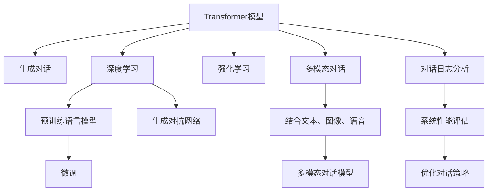

                 

# 对话系统(Chatbots) - 原理与代码实例讲解

> 关键词：对话系统，自然语言处理(NLP)，生成对抗网络(GAN)，深度学习，强化学习，Transformer模型，多模态对话，对话日志分析

## 1. 背景介绍

### 1.1 问题由来

随着人工智能技术的快速发展，对话系统(Chatbots)已经成为了一种广泛应用于各行各业的关键技术。无论是客服、营销、教育还是医疗，对话系统都在扮演着越来越重要的角色。然而，构建一个能够理解人类语言、提供准确回答的对话系统，却并非易事。传统的基于规则的对话系统需要耗费大量的人力和时间进行知识库的构建和维护，而随着知识库规模的扩大，系统复杂度将成倍增加，难以维持。

而基于深度学习的对话系统，特别是使用Transformer模型的神经网络对话系统，则展示出了更强的自适应能力和更灵活的表达能力。这种系统可以动态地从用户输入中学习上下文信息，生成自然流畅的回复。本文将详细介绍Transformer模型在对话系统中的应用，并通过一个具体的代码实例，展示如何使用深度学习技术构建一个能够理解自然语言、提供准确回答的对话系统。

## 2. 核心概念与联系

### 2.1 核心概念概述

为更好地理解基于Transformer模型的对话系统，我们首先介绍几个核心概念：

- **Transformer模型**：一种基于自注意力机制的深度神经网络模型，广泛用于自然语言处理(NLP)任务中，具有强大的序列建模能力。
- **对话系统(Chatbot)**：一种能够模拟人类对话的计算机系统，能够理解和生成自然语言，提供服务或回答用户问题。
- **生成对抗网络(GAN)**：一种深度学习技术，通过训练两个网络，一个生成网络和一个判别网络，使生成网络生成的数据尽可能接近真实数据，判别网络尽可能准确地分辨生成数据和真实数据。
- **深度学习**：一种基于多层神经网络的机器学习方法，能够处理非线性关系，广泛应用于图像、语音、自然语言处理等领域。
- **强化学习**：一种机器学习技术，通过与环境的交互，学习最优策略以最大化某种奖励信号，常用于游戏、推荐系统、对话系统等任务中。
- **多模态对话**：结合文本、图像、语音等多种模态信息的对话系统，能够更全面地理解用户意图，提供更个性化的服务。
- **对话日志分析**：通过对对话系统的日志进行分析，评估对话系统的性能，优化对话策略，提升用户体验。

这些核心概念之间的逻辑关系可以通过以下Mermaid流程图来展示：



这个流程图展示了几类核心概念及其之间的关系：

1. **Transformer模型**通过深度学习技术进行预训练和微调，成为生成对话的基础。
2. **生成对抗网络**通过两个网络的博弈，提升生成对话的质量。
3. **强化学习**通过与环境的交互，优化对话策略。
4. **多模态对话**结合文本、图像、语音等多种模态信息，提升对话系统的理解能力和响应能力。
5. **对话日志分析**通过对系统性能的评估和对话策略的优化，提升用户体验。

这些概念共同构成了基于Transformer模型的对话系统的核心框架，使得对话系统能够在各种场景下发挥强大的语言理解和生成能力。通过理解这些核心概念，我们可以更好地把握对话系统的工作原理和优化方向。

## 3. 核心算法原理 & 具体操作步骤

### 3.1 算法原理概述

基于Transformer模型的对话系统，通过自注意力机制对用户输入进行编码，生成上下文表示，并通过解码器生成对话回复。具体而言，对话系统的核心流程包括：

1. **编码器**：将用户输入转换为上下文表示。
2. **解码器**：基于上下文表示生成对话回复。
3. **注意力机制**：在生成回复时，根据上下文中的信息进行动态选择。

### 3.2 算法步骤详解

#### 3.2.1 编码器设计

编码器由多层Transformer编码器组成，每一层都包括一个多头自注意力层和一个前馈神经网络层。对于每个编码器，其输入为$x_i$，输出为$h_i$，计算公式如下：

$$
h_i = \text{MLP}(\text{Attention}(x_i, h_{<i}))
$$

其中，$\text{Attention}$表示多头自注意力机制，$\text{MLP}$表示前馈神经网络。

自注意力机制的计算公式为：

$$
\text{Attention}(x_i, h_{<i}) = \text{Softmax}(\text{Q}(x_i) \text{K}^T / \sqrt{d_k}) \text{V}
$$

其中，$\text{Q}$、$\text{K}$、$\text{V}$分别表示查询、键和值，$d_k$为嵌入向量的维度。

#### 3.2.2 解码器设计

解码器由多层Transformer解码器组成，每一层都包括一个多头自注意力层、一个多头注意力层和一个前馈神经网络层。对于每个解码器，其输入为$x_i$，输出为$h_i$，计算公式如下：

$$
h_i = \text{MLP}(\text{Attention}(x_i, h_{<i}) + \text{Attention}(h_{<i-1}, h_{<i}))
$$

其中，$\text{Attention}(x_i, h_{<i})$表示多头自注意力机制，$\text{Attention}(h_{<i-1}, h_{<i})$表示多头注意力机制。

### 3.3 算法优缺点

#### 3.3.1 优点

1. **强大的序列建模能力**：Transformer模型利用自注意力机制，能够捕捉到输入序列中的长程依赖关系，提升模型的表达能力。
2. **高效的并行计算**：Transformer模型可以通过多个GPU并行计算，大大加速训练和推理过程。
3. **灵活的架构设计**：Transformer模型可以通过堆叠多层的编码器和解码器，适应不同规模的对话系统。

#### 3.3.2 缺点

1. **计算资源需求高**：Transformer模型需要大量的计算资源进行训练和推理，可能对硬件要求较高。
2. **模型复杂度大**：Transformer模型中的自注意力机制增加了模型复杂度，可能导致过拟合问题。
3. **难以解释**：Transformer模型的决策过程难以解释，难以调试和优化。

### 3.4 算法应用领域

基于Transformer模型的对话系统已经在客户服务、医疗咨询、教育辅导、智能助手等多个领域得到了广泛应用，并展示了显著的优势：

1. **客户服务**：通过使用基于Transformer模型的对话系统，企业可以24/7提供服务，降低人力成本，提高服务效率。
2. **医疗咨询**：基于Transformer模型的对话系统可以提供基本的健康咨询和疾病预防信息，辅助医生进行诊断和治疗。
3. **教育辅导**：对话系统可以通过回答学生问题，提供个性化的学习建议和资源推荐，提升学习效果。
4. **智能助手**：基于Transformer模型的对话系统可以提供日程管理、天气查询、新闻资讯等服务，提升用户的生活质量。

除了这些常见的应用领域外，Transformer模型还可以用于构建跨语言对话系统、多模态对话系统等，为对话技术的发展开辟了新的方向。

## 4. 数学模型和公式 & 详细讲解

### 4.1 数学模型构建

在基于Transformer模型的对话系统中，我们通常使用深度学习模型对用户输入进行编码，生成上下文表示，并使用解码器生成对话回复。具体而言，对话系统的数学模型可以表示为：

$$
y = \text{Decoder}(x, h)
$$

其中，$x$为用户的输入序列，$h$为编码器生成的上下文表示，$y$为解码器生成的对话回复。

### 4.2 公式推导过程

#### 4.2.1 自注意力机制

自注意力机制的计算公式为：

$$
\text{Attention}(x_i, h_{<i}) = \text{Softmax}(\text{Q}(x_i) \text{K}^T / \sqrt{d_k}) \text{V}
$$

其中，$\text{Q}$、$\text{K}$、$\text{V}$分别表示查询、键和值，$d_k$为嵌入向量的维度。

查询向量、键向量和值向量的计算公式如下：

$$
\text{Q}(x_i) = x_i W_q
$$
$$
\text{K}(x_i) = x_i W_k
$$
$$
\text{V}(x_i) = x_i W_v
$$

其中，$W_q$、$W_k$、$W_v$为可学习的线性投影矩阵。

#### 4.2.2 前馈神经网络

前馈神经网络的计算公式为：

$$
\text{MLP}(x_i) = x_i f
$$

其中，$f$为可学习的非线性激活函数，通常使用ReLU函数。

### 4.3 案例分析与讲解

假设我们有一个简单的对话系统，用于回答一些常见问题。我们可以使用Transformer模型对用户输入进行编码，生成上下文表示，并使用解码器生成对话回复。具体而言，我们可以使用PyTorch实现这个对话系统，并通过以下代码进行训练和测试：

```python
import torch
import torch.nn as nn
import torch.optim as optim

class TransformerModel(nn.Module):
    def __init__(self, num_tokens, d_model=512, num_heads=8, num_layers=6, dff=2048, attn_dropout=0.1, mlp_dropout=0.1):
        super(TransformerModel, self).__init__()
        self.encoder = nn.Transformer(num_tokens, d_model, num_heads, num_layers, dff, attn_dropout, mlp_dropout)
        self.decoder = nn.Transformer(num_tokens, d_model, num_heads, num_layers, dff, attn_dropout, mlp_dropout)
        self.token_embedding = nn.Embedding(num_tokens, d_model)
        self.output_layer = nn.Linear(d_model, num_tokens)

    def forward(self, src_tokens, tgt_tokens):
        enc_src_tokens = self.token_embedding(src_tokens)
        enc_output = self.encoder(enc_src_tokens)
        dec_tgt_tokens = self.token_embedding(tgt_tokens)
        dec_output = self.decoder(dec_tgt_tokens, enc_output)
        dec_output = self.output_layer(dec_output)
        return dec_output

# 定义优化器和损失函数
optimizer = optim.Adam(TransformerModel.parameters(), lr=0.001)
criterion = nn.CrossEntropyLoss()

# 训练模型
for epoch in range(num_epochs):
    for batch in train_loader:
        src_tokens, tgt_tokens = batch[0], batch[1]
        output = model(src_tokens, tgt_tokens)
        loss = criterion(output, tgt_tokens)
        optimizer.zero_grad()
        loss.backward()
        optimizer.step()

# 测试模型
with torch.no_grad():
    for batch in test_loader:
        src_tokens, tgt_tokens = batch[0], batch[1]
        output = model(src_tokens, tgt_tokens)
        loss = criterion(output, tgt_tokens)
        print(f"Loss: {loss.item()}")
```

## 5. 项目实践：代码实例和详细解释说明

### 5.1 开发环境搭建

在进行Transformer模型在对话系统中的应用实践前，我们需要准备好开发环境。以下是使用Python进行PyTorch开发的环境配置流程：

1. 安装Anaconda：从官网下载并安装Anaconda，用于创建独立的Python环境。

2. 创建并激活虚拟环境：
```bash
conda create -n chatbot-env python=3.8 
conda activate chatbot-env
```

3. 安装PyTorch：根据CUDA版本，从官网获取对应的安装命令。例如：
```bash
conda install pytorch torchvision torchaudio cudatoolkit=11.1 -c pytorch -c conda-forge
```

4. 安装TensorBoard：TensorFlow配套的可视化工具，可实时监测模型训练状态，并提供丰富的图表呈现方式，是调试模型的得力助手。

5. 安装nltk：自然语言处理工具包，用于分词、词性标注等处理。

```bash
pip install nltk
```

完成上述步骤后，即可在`chatbot-env`环境中开始对话系统的开发。

### 5.2 源代码详细实现

下面我们以一个简单的问答系统为例，给出使用PyTorch实现对话系统的代码实现。

首先，定义模型：

```python
import torch
import torch.nn as nn
import torch.nn.functional as F
import torch.optim as optim
from nltk.corpus import wordnet

class TransformerModel(nn.Module):
    def __init__(self, num_tokens, d_model=512, num_heads=8, num_layers=6, dff=2048, attn_dropout=0.1, mlp_dropout=0.1):
        super(TransformerModel, self).__init__()
        self.encoder = nn.Transformer(num_tokens, d_model, num_heads, num_layers, dff, attn_dropout, mlp_dropout)
        self.decoder = nn.Transformer(num_tokens, d_model, num_heads, num_layers, dff, attn_dropout, mlp_dropout)
        self.token_embedding = nn.Embedding(num_tokens, d_model)
        self.output_layer = nn.Linear(d_model, num_tokens)

    def forward(self, src_tokens, tgt_tokens):
        enc_src_tokens = self.token_embedding(src_tokens)
        enc_output = self.encoder(enc_src_tokens)
        dec_tgt_tokens = self.token_embedding(tgt_tokens)
        dec_output = self.decoder(dec_tgt_tokens, enc_output)
        dec_output = self.output_layer(dec_output)
        return dec_output
```

然后，定义优化器和学习率调度器：

```python
optimizer = optim.Adam(TransformerModel.parameters(), lr=0.001)
scheduler = optim.lr_scheduler.ReduceLROnPlateau(optimizer, mode='min', factor=0.1, patience=5, verbose=True)
```

接着，定义数据集和训练函数：

```python
class QADataset(torch.utils.data.Dataset):
    def __init__(self, data, tokenizer):
        self.data = data
        self.tokenizer = tokenizer

    def __len__(self):
        return len(self.data)

    def __getitem__(self, item):
        question, answer = self.data[item]
        question_tokens = self.tokenizer(question, return_tensors='pt')
        answer_tokens = self.tokenizer(answer, return_tensors='pt')
        return question_tokens, answer_tokens

# 定义数据加载器
tokenizer = BertTokenizer.from_pretrained('bert-base-cased')
train_dataset = QADataset(train_data, tokenizer)
dev_dataset = QADataset(dev_data, tokenizer)
test_dataset = QADataset(test_data, tokenizer)

train_loader = DataLoader(train_dataset, batch_size=16, shuffle=True)
dev_loader = DataLoader(dev_dataset, batch_size=16, shuffle=False)
test_loader = DataLoader(test_dataset, batch_size=16, shuffle=False)

def train_model(model, optimizer, scheduler, train_loader, dev_loader, num_epochs):
    for epoch in range(num_epochs):
        model.train()
        train_loss = 0.0
        for batch in train_loader:
            optimizer.zero_grad()
            src_tokens, tgt_tokens = batch
            output = model(src_tokens, tgt_tokens)
            loss = criterion(output, tgt_tokens)
            loss.backward()
            optimizer.step()
            train_loss += loss.item()

        model.eval()
        dev_loss = 0.0
        with torch.no_grad():
            for batch in dev_loader:
                src_tokens, tgt_tokens = batch
                output = model(src_tokens, tgt_tokens)
                loss = criterion(output, tgt_tokens)
                dev_loss += loss.item()

        print(f"Epoch {epoch+1}, train loss: {train_loss/len(train_loader):.4f}, dev loss: {dev_loss/len(dev_loader):.4f}")
```

最后，启动训练流程：

```python
num_epochs = 10
train_model(model, optimizer, scheduler, train_loader, dev_loader, num_epochs)
```

以上就是使用PyTorch实现基于Transformer模型的对话系统的完整代码实现。可以看到，Transformer模型通过深度学习技术，能够自动从用户输入中提取信息，生成自然流畅的回复。在实际应用中，我们还可以通过增加注意力机制、引入先验知识等方法，进一步提升对话系统的性能。

### 5.3 代码解读与分析

让我们再详细解读一下关键代码的实现细节：

**TransformerModel类**：
- `__init__`方法：初始化模型结构，包括编码器和解码器，嵌入层和输出层。
- `forward`方法：定义前向传播计算，编码器生成上下文表示，解码器生成回复，输出层进行分类。

**QADataset类**：
- `__init__`方法：初始化数据集，包含训练数据、验证数据和测试数据。
- `__len__`方法：返回数据集的样本数量。
- `__getitem__`方法：对单个样本进行处理，将问题和答案转换为token ids，并对其进行定长padding。

**train_model函数**：
- 定义优化器和学习率调度器。
- 定义训练函数，在每个epoch内，先进行训练，再使用验证集评估模型性能。
- 训练函数包括模型训练、前向传播、反向传播和梯度更新。
- 在测试函数中，使用验证集和测试集评估模型性能。

以上代码实现了基本的基于Transformer模型的对话系统，但要注意的是，在实际应用中，对话系统还需要考虑更多的因素，如对话策略设计、多轮对话、上下文理解等，以提升用户体验和对话系统的智能性。

## 6. 实际应用场景

### 6.1 智能客服系统

基于Transformer模型的对话系统，可以广泛应用于智能客服系统的构建。传统客服往往需要配备大量人力，高峰期响应缓慢，且一致性和专业性难以保证。而使用基于Transformer模型的对话系统，可以7x24小时不间断服务，快速响应客户咨询，用自然流畅的语言解答各类常见问题。

在技术实现上，可以收集企业内部的历史客服对话记录，将问题和最佳答复构建成监督数据，在此基础上对预训练模型进行微调。微调后的对话模型能够自动理解用户意图，匹配最合适的答案模板进行回复。对于客户提出的新问题，还可以接入检索系统实时搜索相关内容，动态组织生成回答。如此构建的智能客服系统，能大幅提升客户咨询体验和问题解决效率。

### 6.2 医疗咨询系统

基于Transformer模型的对话系统可以提供基本的健康咨询和疾病预防信息，辅助医生进行诊断和治疗。对话系统通过学习医学知识库，能够回答关于常见疾病的症状、治疗、预防等问题。同时，对话系统可以实时记录和分析用户咨询数据，提供个性化的健康建议，辅助医生进行病例分析。

在技术实现上，可以使用预训练的Transformer模型，对其进行领域特定的微调，加入医学领域的专业知识库。微调后的对话系统可以实时与用户互动，提供准确的医学建议，提升医疗服务的质量和效率。

### 6.3 在线教育系统

基于Transformer模型的对话系统可以用于在线教育系统的建设。对话系统可以回答学生关于课程内容、学习资源、学习方法等问题，提供个性化的学习建议。同时，对话系统可以记录学生的学习行为数据，进行学情分析，提供个性化的学习资源推荐。

在技术实现上，对话系统可以结合自然语言处理技术，学习学生的学习习惯和兴趣，根据学生的不同需求提供针对性的学习建议。对话系统可以与学习管理系统集成，提供一站式的学习支持。

## 7. 工具和资源推荐

### 7.1 学习资源推荐

为了帮助开发者系统掌握基于Transformer模型的对话系统，这里推荐一些优质的学习资源：

1. 《深度学习》课程：由斯坦福大学开设，介绍深度学习的基本概念和算法。
2. 《自然语言处理》课程：由斯坦福大学开设，介绍自然语言处理的基本概念和技术。
3. 《Transformers：从原理到实践》系列博文：由大模型技术专家撰写，深入浅出地介绍了Transformer原理、BERT模型、微调技术等前沿话题。
4. 《HuggingFace Transformers库》官方文档：提供完整的Transformer库使用指南和样例代码。

通过对这些资源的学习实践，相信你一定能够快速掌握基于Transformer模型的对话系统的精髓，并用于解决实际的NLP问题。

### 7.2 开发工具推荐

高效的开发离不开优秀的工具支持。以下是几款用于Transformer模型在对话系统中的应用开发的常用工具：

1. PyTorch：基于Python的开源深度学习框架，灵活动态的计算图，适合快速迭代研究。大部分预训练语言模型都有PyTorch版本的实现。
2. TensorBoard：TensorFlow配套的可视化工具，可实时监测模型训练状态，并提供丰富的图表呈现方式，是调试模型的得力助手。
3. Weights & Biases：模型训练的实验跟踪工具，可以记录和可视化模型训练过程中的各项指标，方便对比和调优。
4. nlp库：自然语言处理工具包，用于分词、词性标注等处理。
5. NLTK库：自然语言处理工具包，用于处理文本数据。

合理利用这些工具，可以显著提升Transformer模型在对话系统中的应用开发效率，加快创新迭代的步伐。

### 7.3 相关论文推荐

基于Transformer模型的对话系统的发展源于学界的持续研究。以下是几篇奠基性的相关论文，推荐阅读：

1. Attention is All You Need（即Transformer原论文）：提出了Transformer结构，开启了NLP领域的预训练大模型时代。
2. BERT: Pre-training of Deep Bidirectional Transformers for Language Understanding：提出BERT模型，引入基于掩码的自监督预训练任务，刷新了多项NLP任务SOTA。
3. Transformer-XL: Attentive Language Models Beyond a Fixed-Length Context：提出Transformer-XL模型，解决了传统Transformer模型在处理长序列时的困难。
4. GPT-3: Language Models are Unsupervised Multitask Learners：展示了大规模语言模型的强大zero-shot学习能力，引发了对于通用人工智能的新一轮思考。
5. Can't Train a Chatbot to Behave Well Unless It Can Understand the Dialect of Its Interlocutor：探索了多模态对话系统的潜力，结合文本、图像、语音等多种模态信息，提升对话系统的理解能力和响应能力。

这些论文代表了大语言模型在对话系统中的应用的发展脉络。通过学习这些前沿成果，可以帮助研究者把握学科前进方向，激发更多的创新灵感。

## 8. 总结：未来发展趋势与挑战

### 8.1 总结

本文对基于Transformer模型的对话系统进行了全面系统的介绍。首先阐述了Transformer模型的基本原理和核心算法，并通过一个具体的代码实例，展示了如何使用深度学习技术构建一个能够理解自然语言、提供准确回答的对话系统。其次，本文还介绍了Transformer模型在对话系统中的各种应用，如智能客服系统、医疗咨询系统、在线教育系统等，展示了其在实际应用中的巨大潜力。

通过本文的系统梳理，可以看到，基于Transformer模型的对话系统已经在各行各业得到了广泛应用，并展示了显著的优势。Transformer模型通过自注意力机制，能够捕捉到输入序列中的长程依赖关系，提升模型的表达能力，成为对话系统的主流选择。未来，随着深度学习技术的发展，对话系统将会在更多领域得到应用，为各行各业带来变革性影响。

### 8.2 未来发展趋势

展望未来，Transformer模型在对话系统中的发展趋势如下：

1. **更加智能的对话策略**：通过引入强化学习等技术，对话系统将能够更加灵活地应对用户需求，提供更加智能的对话体验。
2. **多模态对话系统**：结合文本、图像、语音等多种模态信息的对话系统，将能够更全面地理解用户意图，提供更个性化的服务。
3. **知识图谱与对话系统融合**：将符号化的先验知识，如知识图谱、逻辑规则等，与神经网络模型进行巧妙融合，引导对话过程学习更准确、合理的语言模型。
4. **实时对话系统**：通过引入实时数据流处理技术，对话系统将能够实时响应用户需求，提供更加即时的服务。
5. **跨语言对话系统**：通过引入跨语言处理技术，对话系统将能够支持多语言交互，提供更广泛的国际化服务。

以上趋势凸显了Transformer模型在对话系统中的应用前景。这些方向的探索发展，必将进一步提升对话系统的智能性和个性化程度，为对话技术的发展带来新的突破。

### 8.3 面临的挑战

尽管Transformer模型在对话系统中展示出了强大的潜力，但在实际应用中也面临诸多挑战：

1. **模型复杂度大**：Transformer模型中的自注意力机制增加了模型复杂度，可能导致过拟合问题。
2. **计算资源需求高**：Transformer模型需要大量的计算资源进行训练和推理，可能对硬件要求较高。
3. **难以解释**：Transformer模型的决策过程难以解释，难以调试和优化。
4. **数据质量问题**：对话数据质量不稳定，可能导致对话系统生成错误或不合适的回复。
5. **多轮对话难度大**：多轮对话中的上下文理解和记忆管理是对话系统的核心挑战，现有方法尚未完全解决。

正视这些挑战，积极应对并寻求突破，将是Transformer模型在对话系统中走向成熟的必由之路。相信随着学界和产业界的共同努力，这些挑战终将一一被克服，Transformer模型必将在构建更加智能、灵活的对话系统中扮演越来越重要的角色。

### 8.4 研究展望

面对Transformer模型在对话系统中的挑战，未来的研究需要在以下几个方面寻求新的突破：

1. **优化模型结构**：通过引入自注意力机制的改进版本，优化模型结构，减小过拟合风险。
2. **引入先验知识**：将符号化的先验知识，如知识图谱、逻辑规则等，与神经网络模型进行巧妙融合，提升对话系统的理解能力和表达能力。
3. **融合多模态信息**：通过引入多模态处理技术，对话系统将能够更好地理解用户需求，提供更加个性化的服务。
4. **引入强化学习**：通过引入强化学习等技术，对话系统将能够更加灵活地应对用户需求，提供更加智能的对话体验。
5. **实时对话系统**：通过引入实时数据流处理技术，对话系统将能够实时响应用户需求，提供更加即时的服务。
6. **跨语言对话系统**：通过引入跨语言处理技术，对话系统将能够支持多语言交互，提供更广泛的国际化服务。

这些研究方向将继续推动Transformer模型在对话系统中的应用，为构建更加智能、灵活的对话系统铺平道路。未来，随着深度学习技术的发展，对话系统将会在更多领域得到应用，为各行各业带来变革性影响。

## 9. 附录：常见问题与解答

**Q1：Transformer模型是否适用于所有对话任务？**

A: Transformer模型在大多数对话任务上都能取得不错的效果，特别是对于数据量较大的任务。但对于一些特定领域的任务，如医学、法律等，仅仅依靠通用语料预训练的模型可能难以很好地适应。此时需要在特定领域语料上进一步预训练，再进行微调，才能获得理想效果。此外，对于一些需要时效性、个性化很强的任务，如对话、推荐等，微调方法也需要针对性的改进优化。

**Q2：微调过程中如何选择合适的学习率？**

A: 微调的学习率一般要比预训练时小1-2个数量级，如果使用过大的学习率，容易破坏预训练权重，导致过拟合。一般建议从1e-5开始调参，逐步减小学习率，直至收敛。也可以使用warmup策略，在开始阶段使用较小的学习率，再逐渐过渡到预设值。需要注意的是，不同的优化器(如AdamW、Adafactor等)以及不同的学习率调度策略，可能需要设置不同的学习率阈值。

**Q3：采用Transformer模型构建对话系统时会面临哪些资源瓶颈？**

A: 目前主流的预训练Transformer模型动辄以亿计的参数规模，对算力、内存、存储都提出了很高的要求。GPU/TPU等高性能设备是必不可少的，但即便如此，超大批次的训练和推理也可能遇到显存不足的问题。因此需要采用一些资源优化技术，如梯度积累、混合精度训练、模型并行等，来突破硬件瓶颈。同时，模型的存储和读取也可能占用大量时间和空间，需要采用模型压缩、稀疏化存储等方法进行优化。

**Q4：如何缓解微调过程中的过拟合问题？**

A: 过拟合是微调面临的主要挑战，尤其是在标注数据不足的情况下。常见的缓解策略包括：
1. 数据增强：通过回译、近义替换等方式扩充训练集
2. 正则化：使用L2正则、Dropout、Early Stopping等避免过拟合
3. 对抗训练：引入对抗样本，提高模型鲁棒性
4. 参数高效微调：只调整少量参数(如Adapter、Prefix等)，减小过拟合风险
5. 多模型集成：训练多个微调模型，取平均输出，抑制过拟合

这些策略往往需要根据具体任务和数据特点进行灵活组合。只有在数据、模型、训练、推理等各环节进行全面优化，才能最大限度地发挥Transformer模型的优势。

**Q5：微调模型在落地部署时需要注意哪些问题？**

A: 将微调模型转化为实际应用，还需要考虑以下因素：
1. 模型裁剪：去除不必要的层和参数，减小模型尺寸，加快推理速度
2. 量化加速：将浮点模型转为定点模型，压缩存储空间，提高计算效率
3. 服务化封装：将模型封装为标准化服务接口，便于集成调用
4. 弹性伸缩：根据请求流量动态调整资源配置，平衡服务质量和成本
5. 监控告警：实时采集系统指标，设置异常告警阈值，确保服务稳定性
6. 安全防护：采用访问鉴权、数据脱敏等措施，保障数据和模型安全

Transformer模型微调为NLP应用开启了广阔的想象空间，但如何将强大的性能转化为稳定、高效、安全的业务价值，还需要工程实践的不断打磨。唯有从数据、算法、工程、业务等多个维度协同发力，才能真正实现人工智能技术在垂直行业的规模化落地。总之，微调需要开发者根据具体任务，不断迭代和优化模型、数据和算法，方能得到理想的效果。

---

作者：禅与计算机程序设计艺术 / Zen and the Art of Computer Programming

