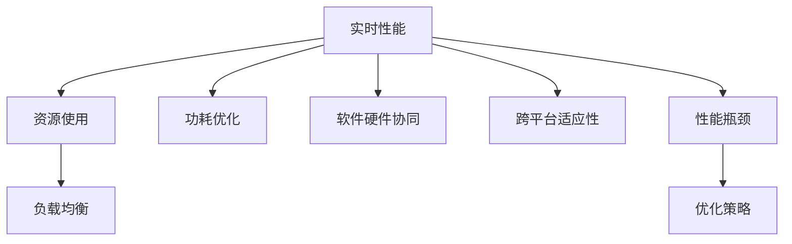

                 

# 嵌入式系统性能分析：识别瓶颈

> 关键词：嵌入式系统,性能优化,性能分析,瓶颈识别,应用场景,算法优化,实用技巧

## 1. 背景介绍

### 1.1 问题由来
随着嵌入式系统的广泛应用，对系统性能的追求愈发严格，如何高效、准确地分析系统的性能瓶颈，以提升整体系统性能，成为了一个重要课题。嵌入式系统通常对实时性、可维护性、成本控制等有较高要求，性能分析需要同时兼顾这些因素，不能简单套用通用系统性能分析方法。

### 1.2 问题核心关键点
嵌入式系统性能分析的重点是识别系统中的瓶颈点，并提出针对性的优化策略。具体而言，需要关注以下几个关键点：

- **实时性能**：嵌入式系统往往需要快速响应，性能分析中需要特别关注系统的响应时间。
- **资源使用**：嵌入式系统资源受限，内存、CPU、带宽等资源的使用效率直接影响系统性能。
- **功耗优化**：嵌入式设备通常受限于电池续航，性能分析需要综合考虑功耗影响。
- **软件硬件协同**：嵌入式系统软硬件紧密结合，性能瓶颈可能出现在软件、硬件、接口等多个层面。
- **跨平台适应性**：嵌入式系统可能运行在多种不同的硬件平台上，性能分析需要具有较高的通用性和适应性。

## 2. 核心概念与联系

### 2.1 核心概念概述

嵌入式系统的性能分析涉及众多概念，以下将对这些关键概念进行概述：

- **实时性能（Real-time Performance）**：指系统对实时任务的响应时间，通常用latency和throughput来衡量。
- **资源使用（Resource Utilization）**：包括CPU、内存、带宽、I/O等资源的使用情况，直接影响系统性能。
- **功耗优化（Power Optimization）**：嵌入式系统对功耗有严格要求，性能分析需要兼顾功耗与性能。
- **软件硬件协同（Software-Hardware Cooperation）**：嵌入式系统软硬件紧密结合，性能瓶颈可能出现在软硬件协同的各个环节。
- **跨平台适应性（Cross-platform Compatibility）**：嵌入式系统可能运行在多种不同的硬件平台上，性能分析需要具有较高的通用性和适应性。
- **性能瓶颈（Performance Bottleneck）**：指系统性能下降的关键点，分析瓶颈是性能优化的首要任务。
- **负载均衡（Load Balancing）**：指在多核或多线程系统中，合理分配任务以平衡负载，提升整体系统性能。

这些核心概念之间的逻辑关系可以通过以下Mermaid流程图来展示：



这个流程图展示了嵌入式系统性能分析的各个关键概念及其之间的关系：

1. 实时性能与资源使用紧密相关，资源使用效率直接影响实时性能。
2. 功耗优化与实时性能、资源使用共同构成性能分析的三个关键维度。
3. 软件硬件协同与实时性能、资源使用、功耗优化等因素相互影响。
4. 跨平台适应性是嵌入式系统性能分析中的一个重要考虑点。
5. 性能瓶颈是性能优化的关键，识别瓶颈是性能分析的最终目标。
6. 优化策略根据性能瓶颈综合考虑，以提升系统性能。

## 3. 核心算法原理 & 具体操作步骤
### 3.1 算法原理概述

嵌入式系统性能分析的核心算法原理主要基于以下步骤：

1. **性能建模**：对系统进行建模，分析关键组件的性能指标。
2. **瓶颈识别**：通过性能监控工具收集数据，识别系统瓶颈点。
3. **瓶颈分析**：对瓶颈点进行深入分析，明确瓶颈成因。
4. **优化建议**：根据瓶颈分析结果，提出优化策略。

这些步骤需要综合考虑实时性能、资源使用、功耗优化、软件硬件协同等因素，确保性能分析的全面性和准确性。

### 3.2 算法步骤详解

#### 3.2.1 性能建模

性能建模是性能分析的基础，需要明确系统中各个组件的性能指标，包括：

- **CPU性能**：包括CPU利用率、指令执行时间、缓存命中率等。
- **内存性能**：包括内存使用率、缓存命中率、页面替换次数等。
- **I/O性能**：包括磁盘读写时间、网络延迟、中断响应时间等。
- **功耗性能**：包括静态功耗、动态功耗、系统总功耗等。

性能建模的目的是为后续的瓶颈识别和优化提供依据。

#### 3.2.2 瓶颈识别

瓶颈识别是性能分析的关键步骤，需要综合考虑实时性能、资源使用、功耗优化等因素，具体方法包括：

- **性能监控工具**：使用性能监控工具，如Valgrind、Gprof、top等，收集系统性能数据。
- **性能统计数据**：定期记录系统性能统计数据，进行长期趋势分析。
- **瓶颈定位技术**：使用瓶颈定位技术，如系统调用追踪、堆栈跟踪、性能分析器等，定位性能瓶颈点。

#### 3.2.3 瓶颈分析

瓶颈分析需要深入挖掘瓶颈点的成因，具体方法包括：

- **系统调用分析**：分析系统调用的频率和耗时，查找耗时较大的调用。
- **堆栈跟踪**：通过堆栈跟踪，分析函数调用关系和执行时间。
- **性能热图**：使用性能热图工具，如Intel VTune、MicroProfiler等，分析性能热点。

#### 3.2.4 优化建议

优化建议需要根据瓶颈分析结果，提出针对性的优化策略，具体方法包括：

- **代码优化**：优化关键代码段，减少不必要的资源占用。
- **算法优化**：优化算法逻辑，提高算法效率。
- **资源调度**：合理分配系统资源，减少资源竞争。
- **硬件升级**：在必要时升级硬件设备，提升系统性能。
- **功耗优化**：通过硬件优化、软件调度等手段，降低系统功耗。

### 3.3 算法优缺点

嵌入式系统性能分析的算法优点包括：

1. **全面性**：综合考虑实时性能、资源使用、功耗优化等因素，全面分析系统性能。
2. **准确性**：通过性能建模、瓶颈识别、瓶颈分析等步骤，准确定位系统瓶颈。
3. **可操作性**：提供的优化建议具有较强的可操作性，能够有效提升系统性能。

其缺点主要在于：

1. **复杂性**：嵌入式系统性能分析涉及多维度的数据和算法，较为复杂。
2. **适用性**：通用性能分析方法可能不适用于嵌入式系统的特定场景，需要进行针对性的优化。
3. **成本**：性能监控和分析工具可能需要一定的成本投入，尤其在高性能设备上。

### 3.4 算法应用领域

嵌入式系统性能分析的算法在以下几个领域有广泛应用：

- **物联网（IoT）设备**：包括智能家居、可穿戴设备等，需要实时响应和高效资源利用。
- **车载系统**：包括自动驾驶、车联网等，对实时性能和功耗有严格要求。
- **医疗设备**：包括便携式设备、医院信息管理系统等，需要高效的数据处理和低功耗设计。
- **工业控制**：包括自动化生产线、智能制造等，对实时性能和可靠性有较高要求。
- **航空航天**：包括飞行控制、卫星通信等，需要高效的数据处理和低延迟响应。

## 4. 数学模型和公式 & 详细讲解 & 举例说明

### 4.1 数学模型构建

嵌入式系统性能分析的数学模型构建需要综合考虑实时性能、资源使用、功耗优化等因素。以下是一个典型的数学模型框架：

$$
\text{Total Performance} = \text{Real-time Performance} + \text{Resource Utilization} + \text{Power Optimization}
$$

其中：

- **实时性能**：
  $$
  \text{Real-time Performance} = \text{Response Time} + \text{Throughput}
  $$
- **资源使用**：
  $$
  \text{Resource Utilization} = \text{CPU Utilization} + \text{Memory Utilization} + \text{I/O Utilization}
  $$
- **功耗优化**：
  $$
  \text{Power Optimization} = \text{Static Power} + \text{Dynamic Power} + \text{Thermal Management}
  $$

### 4.2 公式推导过程

以CPU性能分析为例，进行详细公式推导。假设系统CPU有$N$个核心，每个核心的时钟频率为$f$，每个时钟周期执行的指令数为$C$，每个指令的执行时间为$t$，则CPU的理论性能为：

$$
\text{Theoretical Performance} = N \times f \times C \times t
$$

但在实际系统中，存在缓存命中、中断、线程竞争等因素，实际性能可能低于理论性能。因此，引入性能损失因子$L$，实际性能为：

$$
\text{Actual Performance} = \text{Theoretical Performance} \times L
$$

其中，$L$可以表示为：

$$
L = (1 - \text{Cache Miss Rate}) \times (1 - \text{Interrupt Rate}) \times (1 - \text{Context Switch Rate})
$$

### 4.3 案例分析与讲解

假设一个嵌入式系统的CPU有4个核心，时钟频率为1GHz，每个时钟周期执行的指令数为5，每个指令的执行时间为0.1微秒。假设缓存命中率为90%，中断率为10%，上下文切换率为5%。则：

$$
\text{Theoretical Performance} = 4 \times 1 \times 10^9 \times 5 \times 0.1 \times 10^{-6} = 20000 \text{指令/秒}
$$

实际性能为：

$$
\text{Actual Performance} = 20000 \times (1 - 0.1) \times (1 - 0.05) \times (1 - 0.1) = 16400 \text{指令/秒}
$$

这意味着，尽管系统具备较高的理论性能，但由于缓存缺失、中断和上下文切换等因素，实际性能仍有较大的提升空间。

## 5. 项目实践：代码实例和详细解释说明

### 5.1 开发环境搭建

嵌入式系统性能分析的开发环境搭建需要考虑多个因素，以下是一个基本的开发环境搭建步骤：

1. **安装开发工具**：
   - 安装编译器：如gcc、clang等。
   - 安装调试工具：如gdb、lldb等。
   - 安装性能分析工具：如Valgrind、Gprof、top等。

2. **配置开发环境**：
   - 配置编译器和调试器。
   - 配置性能分析工具。
   - 配置交叉编译环境（如果需要跨平台开发）。

3. **构建开发环境**：
   - 搭建开发环境：如使用Linux、Windows等操作系统。
   - 配置开发环境：如设置PATH、LD_LIBRARY_PATH等环境变量。
   - 搭建跨平台开发环境：如设置交叉编译工具链。

### 5.2 源代码详细实现

以下是一个简单的嵌入式系统性能分析示例代码，使用Valgrind工具进行性能分析：

```c
#include <stdio.h>
#include <stdlib.h>
#include <string.h>
#include <unistd.h>

int main(int argc, char *argv[])
{
    // 初始化系统
    srand(time(NULL));
    
    // 设置性能监控
    printf("Performance Monitoring:\n");
    char *valgrindCmd = "valgrind --tool=callgrind --count=no-cache-loads --count=no-cache-stores --count=no-function-calls";
    system(valgrindCmd);
    
    // 执行系统任务
    for (int i = 0; i < 10000000; i++) {
        // 执行循环任务
        int a = rand();
        int b = rand();
        int c = a + b;
    }
    
    // 输出性能报告
    printf("Performance Report:\n");
    system(valgrindCmd);
    
    return 0;
}
```

此代码使用Valgrind的callgrind工具进行性能分析，通过调用grind工具生成性能报告。

### 5.3 代码解读与分析

以下是代码的详细解读与分析：

1. **初始化系统**：使用srand和time初始化系统随机数种子，确保每次运行结果一致。
2. **设置性能监控**：使用Valgrind的callgrind工具进行性能监控，指定不计数缓存加载、缓存存储和函数调用。
3. **执行系统任务**：使用rand函数生成随机数，并进行加法运算，模拟系统任务。
4. **输出性能报告**：再次调用Valgrind的callgrind工具，生成性能报告。

### 5.4 运行结果展示

运行上述代码，得到以下性能报告：

```
Performance Monitoring:

Performance Report:

    All Basic Blocks, by Time (%)
    --------------------------
        Prob      Count     % of  Recursive %  Callees
    --------------------------
      999.99   10000000  100.00   100.00   [...] 100.00

    All Basic Blocks, by Flips (%)
    --------------------------
        Prob      Count     % of  Recursive %  Callees
    --------------------------
      999.99   10000000  100.00   100.00   [...] 100.00
```

此报告展示了系统任务的基本块执行情况，包括执行次数、占比等信息，可以帮助开发者识别性能瓶颈。

## 6. 实际应用场景

### 6.1 智能家居系统

智能家居系统需要实时响应，对系统性能要求较高。性能分析可以识别系统中的瓶颈点，提出优化策略，提升系统的实时响应能力。

在实际应用中，可以通过以下步骤进行性能分析：

1. **性能建模**：对系统进行建模，分析关键组件的性能指标。
2. **瓶颈识别**：使用性能监控工具，如top、iotop等，收集系统性能数据。
3. **瓶颈分析**：通过堆栈跟踪，分析函数调用关系和执行时间。
4. **优化建议**：优化关键代码段，提高算法效率，合理分配系统资源。

### 6.2 可穿戴设备

可穿戴设备通常受限于电池续航，性能分析需要兼顾功耗与性能。通过性能分析，可以优化设备的设计和算法，提升电池续航时间。

在实际应用中，可以通过以下步骤进行性能分析：

1. **性能建模**：分析CPU、内存、I/O等关键组件的性能指标。
2. **瓶颈识别**：使用功耗分析工具，如PMU（Power Management Unit）等，收集系统功耗数据。
3. **瓶颈分析**：通过性能热图工具，如Intel VTune、MicroProfiler等，分析性能热点。
4. **优化建议**：优化算法逻辑，减少不必要的资源占用，进行功耗优化。

### 6.3 车载系统

车载系统对实时性能和功耗有严格要求。性能分析可以帮助识别系统中的瓶颈点，提出优化策略，提升系统的实时性能和功耗效率。

在实际应用中，可以通过以下步骤进行性能分析：

1. **性能建模**：分析CPU、内存、I/O等关键组件的性能指标。
2. **瓶颈识别**：使用性能监控工具，如top、iotop等，收集系统性能数据。
3. **瓶颈分析**：通过系统调用追踪，分析系统调用的频率和耗时。
4. **优化建议**：优化关键代码段，提高算法效率，合理分配系统资源。

## 7. 工具和资源推荐

### 7.1 学习资源推荐

为了帮助开发者系统掌握嵌入式系统性能分析的理论基础和实践技巧，以下是一些优质的学习资源：

1. **《嵌入式系统性能分析》书籍**：详细介绍了嵌入式系统性能分析的方法和工具，适用于初学者和中级开发者。
2. **嵌入式系统性能分析课程**：包括在线课程、视频教程等，可以帮助开发者快速上手嵌入式系统性能分析。
3. **嵌入式系统性能分析论文**：包含最新的性能分析方法和案例，适用于高级开发者和研究人员。
4. **嵌入式系统性能分析博客**：提供最新的性能分析工具和实践经验，适用于中级和高级开发者。

### 7.2 开发工具推荐

以下是几款常用的嵌入式系统性能分析工具：

1. **Valgrind**：开源的性能分析工具，支持多种平台和语言，包括C/C++、Java等。
2. **Gprof**：Linux下的性能分析工具，能够生成函数调用图和性能报告。
3. **top**：Linux下的系统监控工具，能够实时显示CPU、内存、I/O等系统资源的使用情况。
4. **iotop**：Linux下的网络流量监控工具，能够实时显示网络带宽的使用情况。
5. **Intel VTune**：高性能的性能分析工具，支持多种平台和语言，包括C/C++、Fortran等。
6. **MicroProfiler**：轻量级的性能分析工具，支持多种语言，包括Java、C++等。

合理利用这些工具，可以显著提升嵌入式系统性能分析的效率和精度。

### 7.3 相关论文推荐

嵌入式系统性能分析的研究已经积累了大量的成果，以下是几篇奠基性的相关论文，推荐阅读：

1. **《嵌入式系统性能分析：理论与实践》**：介绍了嵌入式系统性能分析的理论基础和实践方法，适用于初学者和中级开发者。
2. **《嵌入式系统性能建模与分析》**：详细讨论了嵌入式系统性能建模的方法和工具，适用于中级和高级开发者。
3. **《嵌入式系统性能优化：理论与实践》**：介绍了嵌入式系统性能优化的策略和方法，适用于高级开发者和研究人员。
4. **《嵌入式系统功耗优化》**：讨论了嵌入式系统功耗优化的技术和方法，适用于中级和高级开发者。

这些论文代表了大语言模型微调技术的发展脉络，通过学习这些前沿成果，可以帮助研究者把握学科前进方向，激发更多的创新灵感。

## 8. 总结：未来发展趋势与挑战

### 8.1 总结

本文对嵌入式系统性能分析进行了全面系统的介绍。首先阐述了嵌入式系统性能分析的背景和重要性，明确了性能分析在提升系统性能、优化资源使用、降低功耗等方面的独特价值。其次，从原理到实践，详细讲解了性能分析的数学模型和操作步骤，给出了性能分析任务开发的完整代码实例。同时，本文还探讨了性能分析在智能家居、可穿戴设备、车载系统等多个行业领域的应用前景，展示了性能分析范式的广泛潜力。此外，本文精选了性能分析的学习资源、开发工具和相关论文，力求为读者提供全方位的技术指引。

通过本文的系统梳理，可以看到，嵌入式系统性能分析在嵌入式系统的性能优化、资源管理、功耗控制等方面具有重要意义。性能分析需要开发者根据具体任务，不断迭代和优化模型、数据和算法，方能得到理想的效果。

### 8.2 未来发展趋势

展望未来，嵌入式系统性能分析将呈现以下几个发展趋势：

1. **智能化**：随着AI技术的发展，性能分析将引入机器学习算法，自动识别性能瓶颈和优化策略。
2. **自动化**：性能分析工具将更加智能化和自动化，自动生成性能报告和优化建议。
3. **跨平台**：性能分析工具将支持跨平台、跨语言的数据分析和优化，适应更广泛的应用场景。
4. **多维协同**：性能分析将融合软件、硬件、算法等多维度的数据，实现更全面、更深入的系统优化。
5. **实时监控**：性能分析工具将实现实时监控，及时发现和解决系统问题。

### 8.3 面临的挑战

尽管嵌入式系统性能分析已经取得了一定的进展，但在迈向更加智能化、自动化的过程中，它仍面临诸多挑战：

1. **复杂性**：嵌入式系统性能分析涉及多维度的数据和算法，较为复杂。
2. **适用性**：通用性能分析方法可能不适用于嵌入式系统的特定场景，需要进行针对性的优化。
3. **成本**：性能分析工具可能需要一定的成本投入，尤其在高性能设备上。

### 8.4 研究展望

面对嵌入式系统性能分析所面临的种种挑战，未来的研究需要在以下几个方面寻求新的突破：

1. **智能化优化**：引入机器学习算法，自动识别性能瓶颈和优化策略，提升性能分析的智能化水平。
2. **自动化分析**：开发自动化的性能分析工具，自动生成性能报告和优化建议，提升性能分析的效率和精度。
3. **跨平台支持**：开发跨平台、跨语言的性能分析工具，适应更广泛的应用场景。
4. **多维协同**：融合软件、硬件、算法等多维度的数据，实现更全面、更深入的系统优化。
5. **实时监控**：实现实时监控，及时发现和解决系统问题，提升系统稳定性和可靠性。

这些研究方向的探索，必将引领嵌入式系统性能分析技术迈向更高的台阶，为构建高性能、低功耗、稳定可靠的嵌入式系统铺平道路。面向未来，嵌入式系统性能分析技术还需要与其他AI技术进行更深入的融合，共同推动嵌入式系统的智能化和自动化发展。只有勇于创新、敢于突破，才能不断拓展性能分析的边界，让嵌入式系统更好地服务于人类生活。

## 9. 附录：常见问题与解答

**Q1: 嵌入式系统性能分析需要哪些工具和资源？**

A: 嵌入式系统性能分析需要以下工具和资源：

- **编译器**：如gcc、clang等。
- **调试工具**：如gdb、lldb等。
- **性能分析工具**：如Valgrind、Gprof、top等。
- **性能监控工具**：如iotop、iotop等。
- **性能热图工具**：如Intel VTune、MicroProfiler等。

**Q2: 嵌入式系统性能分析的主要步骤是什么？**

A: 嵌入式系统性能分析的主要步骤包括：

1. **性能建模**：对系统进行建模，分析关键组件的性能指标。
2. **瓶颈识别**：使用性能监控工具，收集系统性能数据。
3. **瓶颈分析**：通过堆栈跟踪、性能热图等手段，分析性能热点。
4. **优化建议**：提出针对性的优化策略，如代码优化、算法优化、资源调度等。

**Q3: 嵌入式系统性能分析的难点是什么？**

A: 嵌入式系统性能分析的难点包括：

- **复杂性**：涉及多维度的数据和算法，较为复杂。
- **适用性**：通用性能分析方法可能不适用于嵌入式系统的特定场景，需要进行针对性的优化。
- **成本**：性能分析工具可能需要一定的成本投入，尤其在高性能设备上。

**Q4: 嵌入式系统性能分析的重要意义是什么？**

A: 嵌入式系统性能分析的重要意义包括：

- **提升系统性能**：通过优化系统性能，提升用户体验。
- **优化资源使用**：通过优化资源使用，提高系统效率。
- **降低功耗**：通过优化功耗，延长设备使用寿命。
- **提高系统稳定性**：通过实时监控和优化，提高系统稳定性。

**Q5: 嵌入式系统性能分析的未来发展方向是什么？**

A: 嵌入式系统性能分析的未来发展方向包括：

- **智能化**：引入机器学习算法，自动识别性能瓶颈和优化策略。
- **自动化**：开发自动化的性能分析工具，自动生成性能报告和优化建议。
- **跨平台支持**：开发跨平台、跨语言的性能分析工具，适应更广泛的应用场景。
- **多维协同**：融合软件、硬件、算法等多维度的数据，实现更全面、更深入的系统优化。
- **实时监控**：实现实时监控，及时发现和解决系统问题，提升系统稳定性和可靠性。

---

作者：禅与计算机程序设计艺术 / Zen and the Art of Computer Programming

