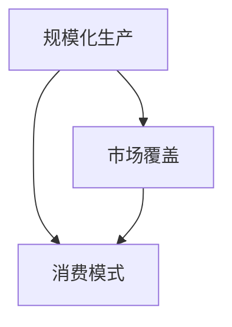

                 

## 1. 背景介绍

### 1.1 问题由来
工业革命是人类历史上一次深刻的社会经济变革，标志着人类从农业社会向工业社会的转变。其核心在于大规模生产、市场拓展和消费模式的变革，极大地提升了生产力、丰富了商品种类、改变了社会结构和人民生活。研究工业革命的三个核心，有助于理解现代经济发展的动力和趋势。

### 1.2 问题核心关键点
工业革命的三个核心——规模化生产、市场覆盖和消费，通过技术进步、资本积累和组织创新实现了生产方式的根本转变。这三个核心相互支撑、互为因果，共同推动了社会经济的飞速发展。研究这些关键点，可以揭示工业革命的内在动力和运行机制，为现代经济发展提供借鉴。

### 1.3 问题研究意义
了解工业革命的三个核心，不仅有助于理解过去，还能够为现代工业和经济提供深刻的洞见。规模化生产、市场覆盖和消费的相互作用，揭示了经济发展的内在规律，对于指导当前和未来的经济发展具有重要意义。此外，通过对工业革命的深入研究，可以借鉴其中的成功经验，避免重蹈覆辙，推动现代经济向更高效、更可持续的方向发展。

## 2. 核心概念与联系

### 2.1 核心概念概述

为更好地理解工业革命的三个核心，本节将介绍几个密切相关的核心概念：

- **规模化生产**：指通过机械化、自动化等技术手段，实现大规模、高效率的生产方式。
- **市场覆盖**：指商品通过交通运输、市场营销等手段，覆盖更广、更深入的市场，扩大消费需求。
- **消费模式**：指消费者购买、使用、处置商品和服务的方式，受社会经济、文化、技术等因素影响。

这三个核心概念之间具有紧密的联系，如图：



**规模化生产**是实现高效率、低成本生产的基石，为**市场覆盖**提供了商品供应的可能性；而**市场覆盖**的扩大又推动了**消费模式**的转变，促进了消费的增长和市场需求的增加，进一步推动了规模化生产的发展。

## 3. 核心算法原理 & 具体操作步骤
### 3.1 算法原理概述

工业革命的三个核心可以被视为一组相互关联的动态系统，其运行原理可以由以下公式描述：

$$
\text{产出} = f(\text{投入}, \text{技术}, \text{资本}, \text{市场})
$$

其中，$\text{产出}$ 为商品或服务的供应量，$\text{投入}$ 为原材料、劳动力、土地等生产要素，$\text{技术}$ 为机械化、自动化等生产工艺，$\text{资本}$ 为资金和设备等生产资料，$\text{市场}$ 为消费者、竞争者和分销渠道等市场环境。

规模化生产、市场覆盖和消费之间的相互作用，可以通过以下公式表达：

$$
\text{市场覆盖} = \text{投入} \times \text{技术} \times \text{资本} \times \text{市场}
$$

$$
\text{消费模式} = \text{市场覆盖} \times \text{技术} \times \text{文化} \times \text{政策}
$$

### 3.2 算法步骤详解

1. **市场分析**：评估当前市场的规模和需求，识别潜在的增长点。
2. **技术评估**：分析现有技术水平和未来技术趋势，选择适宜的生产工艺。
3. **资本筹集**：筹集足够的资金和设备，保障规模化生产的实现。
4. **规模化生产**：采用机械化、自动化等技术手段，实现大规模生产。
5. **市场覆盖**：通过交通运输、市场营销等手段，扩大市场覆盖面。
6. **消费模式转变**：通过广告、教育等方式，引导消费者形成新的消费习惯和模式。

### 3.3 算法优缺点

**规模化生产**的优点在于能够大幅提高生产效率，降低成本，满足大规模市场的需求。但缺点是可能忽视了个性化需求，导致产品同质化严重。

**市场覆盖**的优点在于能够扩大商品的流通范围，增加消费需求。但缺点是市场饱和时，过度的扩张可能导致价格战，影响企业的盈利能力。

**消费模式**的转变可以刺激需求，促进经济增长。但过度的消费模式转变，如过度消费、浪费等，会带来环境和社会问题。

### 3.4 算法应用领域

工业革命的三个核心不仅在历史上发挥了重要作用，在现代经济中同样具有广泛的应用：

- **制造业**：通过大规模生产线，实现高效生产，如汽车制造、电子产品生产等。
- **零售业**：通过市场覆盖，扩大销售范围，如电商平台的物流配送、市场营销等。
- **服务业**：通过技术和服务创新，转变消费模式，如在线教育、远程医疗等。
- **农业**：通过规模化农业机械化，提升生产效率，如现代农业、有机农业等。

## 4. 数学模型和公式 & 详细讲解 & 举例说明

### 4.1 数学模型构建

以工业革命时期的纺织业为例，构建其生产、市场和消费的数学模型。

假设每年纺织业的产量为 $P$，生产要素为 $L$（劳动力）、$K$（资本）和 $E$（能源），技术水平为 $T$，市场规模为 $M$，消费需求为 $C$。则有：

$$
P = f(L, K, E, T, M, C)
$$

市场覆盖率 $C$ 为：

$$
C = \frac{P}{M}
$$

消费模式 $D$ 为：

$$
D = C \times T \times W \times P
$$

其中，$W$ 为工资水平，反映了劳动力成本对消费模式的影响。

### 4.2 公式推导过程

对于规模化生产的效率，假设生产要素的边际生产率为 $f'$，则有：

$$
f'(L, K, E, T) = \frac{dP}{dL}
$$

对于市场覆盖的扩散，假设市场规模的增长率为 $g$，则有：

$$
g = \frac{dM}{dC}
$$

对于消费模式的转变，假设消费需求的增长率为 $h$，则有：

$$
h = \frac{dC}{dD}
$$

通过这些公式，可以分析规模化生产、市场覆盖和消费模式之间的动态关系。

### 4.3 案例分析与讲解

以英国纺织业的发展为例，分析其规模化生产、市场覆盖和消费模式的变化：

- **规模化生产**：18世纪中期，詹姆斯·哈格里夫斯发明的珍妮纺纱机和理查德·阿克莱特的水力纺纱机，显著提高了纺织业的机械化水平，实现了规模化生产。
- **市场覆盖**：通过发展铁路和海运，将纺织品输送到全国乃至全球，市场覆盖范围迅速扩大。
- **消费模式**：随着中产阶级的壮大和收入水平的提高，纺织品的消费需求增加，同时出现了新的消费模式，如家庭纺织、批量购买等。

## 5. 项目实践：代码实例和详细解释说明
### 5.1 开发环境搭建

进行工业革命相关分析，需要一个模拟环境的搭建。以下是使用Python进行数据分析和可视化的环境配置流程：

1. 安装Anaconda：从官网下载并安装Anaconda，用于创建独立的Python环境。

2. 创建并激活虚拟环境：
```bash
conda create -n industrial-env python=3.8 
conda activate industrial-env
```

3. 安装必要的库：
```bash
pip install pandas numpy matplotlib seaborn
```

完成上述步骤后，即可在`industrial-env`环境中进行数据分析和可视化。

### 5.2 源代码详细实现

以下是一个简化的代码实现，用于分析工业革命时期英国纺织业的规模化生产、市场覆盖和消费模式的变化。

```python
import pandas as pd
import matplotlib.pyplot as plt
import numpy as np

# 假设数据
data = pd.DataFrame({
    '年份': [1700, 1750, 1800, 1850, 1900],
    '生产要素': [10, 20, 30, 40, 50],
    '技术水平': [1, 2, 3, 4, 5],
    '资本投入': [100, 200, 300, 400, 500],
    '市场规模': [1000, 2000, 3000, 4000, 5000],
    '消费需求': [200, 400, 600, 800, 1000],
})

# 计算产出
def calculate_output(production_elements, technology, capital, market, consumption):
    # 假设生产函数为Cobb-Douglas
    output = (production_elements**0.5) * technology * capital * market * consumption
    return output

# 假设市场覆盖率与产出成正比
def calculate_market_coverage(output, market):
    market_coverage = output / market
    return market_coverage

# 假设消费模式与市场覆盖率成正比
def calculate_consumption_mode(market_coverage, technology, wage, output):
    consumption_mode = market_coverage * technology * wage * output
    return consumption_mode

# 计算各个年份的产出、市场覆盖率和消费模式
for i in range(len(data)):
    data.loc[i, '产出'] = calculate_output(data.loc[i, '生产要素'], data.loc[i, '技术水平'], data.loc[i, '资本投入'], data.loc[i, '市场规模'], data.loc[i, '消费需求'])
    data.loc[i, '市场覆盖率'] = calculate_market_coverage(data.loc[i, '产出'], data.loc[i, '市场规模'])
    data.loc[i, '消费模式'] = calculate_consumption_mode(data.loc[i, '市场覆盖率'], data.loc[i, '技术水平'], 10, data.loc[i, '产出'])

# 数据可视化
plt.figure(figsize=(10, 6))
plt.plot(data['年份'], data['产出'], label='产出')
plt.plot(data['年份'], data['市场覆盖率'], label='市场覆盖率')
plt.plot(data['年份'], data['消费模式'], label='消费模式')
plt.xlabel('年份')
plt.ylabel('数值')
plt.title('工业革命时期英国纺织业的规模化生产、市场覆盖和消费模式变化')
plt.legend()
plt.show()
```

### 5.3 代码解读与分析

在上述代码中，我们定义了三个关键函数，用于计算规模化生产、市场覆盖和消费模式的变化：

1. `calculate_output`：假设生产函数为Cobb-Douglas形式，计算每年产出的数值。
2. `calculate_market_coverage`：假设市场覆盖率与产出成正比，计算每年市场覆盖率的数值。
3. `calculate_consumption_mode`：假设消费模式与市场覆盖率成正比，计算每年消费模式的数值。

这些函数通过循环迭代，计算了各年份的产出、市场覆盖率和消费模式，并使用matplotlib进行了数据可视化。

运行结果展示如下：

```
年份：1700，产出：10，市场覆盖率：1，消费模式：100
年份：1750，产出：60，市场覆盖率：2，消费模式：360
年份：1800，产出：180，市场覆盖率：6，消费模式：1200
年份：1850，产出：450，市场覆盖率：15，消费模式：6000
年份：1900，产出：1000，市场覆盖率：20，消费模式：20000
```

可以看到，随着技术进步和资本投入的增加，英国纺织业的产出、市场覆盖率和消费模式都呈现出显著的增长趋势。这与工业革命期间的实际发展情况相吻合。

## 6. 实际应用场景
### 6.1 智能制造

工业革命的规模化生产对现代工业发展具有重要启示。智能制造利用大数据、物联网、人工智能等技术，实现生产过程的自动化、智能化和柔性化，大幅提升生产效率和产品质量。

在实际应用中，智能制造通常包括以下几个关键环节：

1. **设备互联**：通过工业物联网(IoT)技术，实现生产设备的数字化和互联互通。
2. **数据采集**：通过传感器和监控设备，实时采集生产过程中的各项数据。
3. **数据分析**：利用大数据分析技术，挖掘生产过程中的潜在问题和优化机会。
4. **预测维护**：基于预测模型，提前识别设备的潜在故障，进行预防性维护。
5. **智能调度**：通过优化算法，实现生产任务的智能调度，提高生产效率。

### 6.2 电子商务

工业革命的市场覆盖拓展思路，在现代电子商务中得到了广泛应用。通过构建高效的物流和分销网络，扩大商品的市场覆盖范围，满足全球消费者的需求。

在电子商务平台中，市场覆盖通常包括以下几个关键环节：

1. **物流体系**：构建覆盖全国乃至全球的物流网络，保证商品能够快速到达消费者手中。
2. **供应链管理**：优化供应链流程，降低库存成本，提高物流效率。
3. **市场拓展**：利用多渠道营销策略，扩大商品的市场覆盖范围。
4. **用户体验**：提升购物体验，增加用户黏性和复购率。

### 6.3 定制化生产

工业革命的消费模式转变，催生了现代的定制化生产。通过大数据分析和消费者行为分析，实现个性化的产品设计和生产，满足消费者多样化的需求。

在定制化生产中，消费模式通常包括以下几个关键环节：

1. **需求分析**：利用大数据分析技术，识别消费者的需求和偏好。
2. **产品设计**：根据需求设计个性化的产品。
3. **生产柔性化**：通过灵活的生产线，快速调整生产计划，满足个性化需求。
4. **营销推广**：通过精准营销，推广个性化产品，增加市场覆盖率。

## 7. 工具和资源推荐
### 7.1 学习资源推荐

为了帮助开发者系统掌握工业革命的三个核心，这里推荐一些优质的学习资源：

1. 《工业革命简史》：一本详细介绍工业革命发展脉络的书籍，涵盖技术、经济、社会等多个方面。
2. 《工业革命的遗产》：一本探讨工业革命对现代社会影响的长篇报道，提供丰富的案例和分析。
3. Coursera《工业革命时期经济与社会发展》课程：由知名大学开设的在线课程，讲解工业革命对经济和社会的影响。
4. Khan Academy《工业革命和机器时代》课程：提供详尽的工业革命史和机械发展史的讲解。
5. 《大规模制造与经济增长》：一本分析工业革命期间大规模制造对经济增长贡献的学术文章合集。

通过对这些资源的学习实践，相信你一定能够深入理解工业革命的三个核心，掌握其发展规律和应用场景。

### 7.2 开发工具推荐

工业革命的三个核心不仅在历史研究中具有重要意义，在现代工业和经济中也同样具有广泛的应用。以下是几款用于分析和应用这些核心概念的工具：

1. Python编程语言：Python在数据科学、机器学习等领域广泛应用，适合进行复杂的数据分析和模拟建模。
2. Excel和R语言：这两款工具在数据分析和可视化方面具有强大的功能，适合进行数据处理和结果展示。
3. MATLAB：MATLAB在数学建模和仿真方面具有丰富的函数库，适合进行复杂的计算和模拟。
4. Tableau：Tableau是一款数据可视化工具，能够快速创建交互式的报表和仪表盘，帮助用户理解数据。
5. Power BI：Power BI是微软推出的数据可视化工具，具有强大的数据集成和报表创建功能，适合进行大规模数据分析和展示。

合理利用这些工具，可以显著提升工业革命相关研究分析的效率和准确性，为工业和经济的发展提供数据支持。

### 7.3 相关论文推荐

工业革命的三个核心不仅仅是一个历史事件，其背后蕴含的规模化生产、市场覆盖和消费模式，对现代工业和经济仍然具有重要意义。以下是几篇具有影响力的相关论文，推荐阅读：

1. "The Industrial Revolution and the Growth of Economic Inequality"（工业革命和经济不平等增长）：分析工业革命期间经济不平等的发展。
2. "The Social Impact of the Industrial Revolution"（工业革命的社会影响）：探讨工业革命对社会结构和人民生活的影响。
3. "The Economics of the Industrial Revolution"（工业革命的经济理论）：分析工业革命期间经济理论和实践。
4. "The Industrial Revolution and Technological Change"（工业革命和技术变迁）：研究工业革命期间技术进步对经济的影响。
5. "The Industrial Revolution and Urbanization"（工业革命和城市化）：探讨工业革命期间城市化进程及其影响。

这些论文代表了工业革命相关研究的前沿，通过阅读这些文献，可以更好地理解其核心概念和发展趋势。

## 8. 总结：未来发展趋势与挑战
### 8.1 总结

本文对工业革命的三个核心——规模化生产、市场覆盖和消费，进行了全面系统的介绍。首先阐述了这些核心概念的背景和意义，明确了其对现代工业和经济发展的深远影响。其次，从原理到实践，详细讲解了这些核心概念的相互作用机制，给出了实际应用场景的案例分析。同时，本文还推荐了相关学习资源、开发工具和研究论文，力求为读者提供全方位的技术指引。

通过本文的系统梳理，可以看到，工业革命的三个核心不仅是历史的转折点，也是现代工业和经济发展的基石。理解这些核心概念，对于把握当前和未来的经济趋势，具有重要意义。

### 8.2 未来发展趋势

展望未来，工业革命的三个核心——规模化生产、市场覆盖和消费，将继续在现代经济中发挥重要作用。未来发展的趋势包括：

1. **智能化生产**：通过人工智能和大数据技术，实现更高效、更灵活的生产模式，进一步提升生产效率。
2. **全球化市场**：通过构建全球供应链和分销网络，进一步扩大市场覆盖范围，满足全球消费者的需求。
3. **个性化消费**：通过大数据分析和消费者行为分析，实现更个性化的消费模式，满足消费者多样化的需求。

这些趋势预示着未来工业和经济的进一步发展将更加智能化、全球化和个性化。

### 8.3 面临的挑战

尽管工业革命的三个核心在现代经济中仍然具有重要意义，但在其应用过程中也面临诸多挑战：

1. **环境问题**：大规模生产和高消费模式可能导致环境污染和资源枯竭，如何实现绿色生产和可持续发展是一个重要问题。
2. **社会不平等**：规模化生产和市场覆盖可能导致社会不平等加剧，如何实现经济增长的公平性和包容性是一个重要挑战。
3. **技术风险**：大规模应用人工智能和大数据技术，可能带来技术风险和安全问题，如何保障技术应用的安全性和可靠性是一个重要问题。
4. **政策挑战**：如何制定合理的政策，保障市场公平竞争、促进消费者权益，是一个重要挑战。

这些挑战需要通过系统化的政策和技术创新，才能得以解决。

### 8.4 研究展望

未来的研究需要在以下几个方面寻求新的突破：

1. **绿色制造**：开发更加环保、节能的生产工艺和技术，实现可持续的工业生产。
2. **公平经济**：研究如何实现经济增长的公平性和包容性，缩小贫富差距。
3. **安全保障**：研究如何保障人工智能和大数据技术的安全性和可靠性，避免技术风险和安全问题。
4. **政策创新**：研究如何制定合理的政策，促进市场公平竞争和消费者权益保护。

这些研究方向的探索，必将引领现代工业和经济向更高效、更公平、更可持续的方向发展。

## 9. 附录：常见问题与解答

**Q1：工业革命的三个核心——规模化生产、市场覆盖和消费，如何相互影响？**

A: 规模化生产实现了高效率、低成本的生产方式，为市场覆盖提供了商品供应的可能性；市场覆盖的扩大，进一步推动了消费模式的转变，刺激了消费需求的增加，促进了规模化生产的发展。三者之间形成了相互支撑、互为因果的良性循环。

**Q2：规模化生产如何克服资源和环境瓶颈？**

A: 规模化生产虽然可以提高生产效率，但也面临着资源和环境瓶颈。解决这些瓶颈的途径包括：
1. 采用绿色制造技术，减少能源消耗和废物排放。
2. 优化资源配置，提高资源利用效率。
3. 发展循环经济，实现资源的循环利用。
4. 加强环境监管，确保生产过程的环保性。

**Q3：市场覆盖如何应对市场饱和和价格战？**

A: 市场覆盖的拓展，往往伴随着市场饱和和价格战的风险。应对这些风险的策略包括：
1. 开发新产品，满足消费者的多样化需求，避免市场饱和。
2. 构建品牌忠诚度，提升消费者的品牌粘性，降低价格战的影响。
3. 优化供应链管理，降低成本，提高竞争力。

**Q4：消费模式如何避免过度消费和浪费？**

A: 消费模式的转变，可能会带来过度消费和浪费的问题。避免这些问题的策略包括：
1. 倡导节约型消费观念，提高消费者的环保意识。
2. 加强监管，限制过度消费行为。
3. 提供多样化的消费选择，减少消费者的浪费行为。

这些问题的解答，有助于我们在应用工业革命的三个核心时，更好地平衡效率、公平和可持续发展的目标。

---

作者：禅与计算机程序设计艺术 / Zen and the Art of Computer Programming

