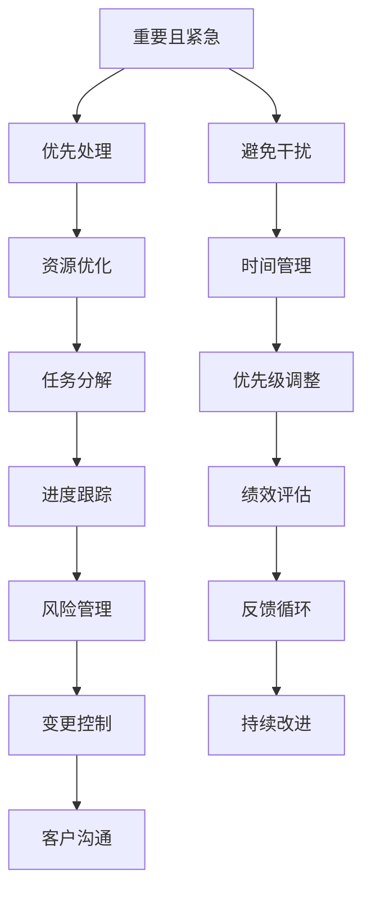

                 

# 巴菲特清单法则在项目管理中的应用

## 1. 背景介绍

### 1.1 问题由来
项目管理的核心在于平衡时间、成本、资源与成果之间的关系，以确保项目在既定目标下高效完成。然而，在实际工作中，项目往往面临复杂的内部和外部环境干扰，任务优先级的不断变化，以及不可预见的风险事件，使得项目管理变得充满挑战。

巴菲特清单法则（也被称为“优先次序原则”）由传奇投资者沃伦·巴菲特提出，旨在帮助人们面对决策时优先考虑最重要的事项。这一原则不仅适用于个人决策，也极具价值地应用于项目管理。通过将巴菲特清单法则与项目管理相结合，团队能够更加有效地识别、分配和执行优先任务，确保项目在有限资源和时间内实现最大价值。

### 1.2 问题核心关键点
巴菲特清单法则的核心在于将任务按重要性和紧急性进行分类，分为四类：重要且紧急、重要但不紧急、紧急但不重要、不重要且不紧急。管理项目时，应重点关注重要且紧急的任务，确保资源和精力优先用于对项目成功最关键的部分。

## 2. 核心概念与联系

### 2.1 核心概念概述

- **巴菲特清单法则**：提出者沃伦·巴菲特，将任务分为四类：重要且紧急、重要但不紧急、紧急但不重要、不重要且不紧急，鼓励集中精力处理“重要且紧急”的任务，避免“紧急但不重要”的干扰，合理分配时间处理“重要但不紧急”的任务，放弃“不重要且不紧急”的任务。

- **项目管理（Project Management）**：运用特定的知识、技能、工具和技术，计划、执行、监控和收尾项目的过程，确保项目能够按期、按预算和满足质量要求完成。

这两个概念的结合，为项目经理提供了一种科学、高效的任务管理方式，以确保项目的成功交付。

### 2.2 核心概念原理和架构的 Mermaid 流程图



这个流程图展示了巴菲特清单法则如何与项目管理结合，帮助项目经理识别并优先处理“重要且紧急”的任务，同时优化资源和时间管理，确保项目顺利进行。

## 3. 核心算法原理 & 具体操作步骤

### 3.1 算法原理概述

巴菲特清单法则在项目管理中的应用，主要基于任务分类和优先级排序的原则。项目经理通过识别和分类项目任务，按优先级进行资源和时间分配，确保最重要的任务得到优先处理，从而实现项目的高效管理。

### 3.2 算法步骤详解

1. **任务识别**：收集和整理项目的所有任务，确保没有遗漏。
2. **任务分类**：根据巴菲特清单法则将任务分为四类：重要且紧急、重要但不紧急、紧急但不重要、不重要且不紧急。
3. **优先级排序**：根据任务的分类，设定优先级，确保资源和时间首先用于“重要且紧急”的任务。
4. **资源分配**：按照优先级分配资源，优先处理高优先级任务。
5. **时间管理**：制定详细的时间计划，确保高优先级任务得到足够的时间。
6. **执行与监控**：在项目执行过程中，持续监控任务进度，及时调整资源和时间分配，确保项目按计划推进。
7. **绩效评估与反馈**：定期评估项目进展，根据绩效反馈调整任务优先级和时间分配。

### 3.3 算法优缺点

**优点**：
- 提高了任务管理的科学性和系统性。
- 确保资源优先用于最重要的任务，提升了项目效率。
- 通过优先级排序，帮助团队避免在次要任务上浪费时间和资源。

**缺点**：
- 可能过度简化任务分类，忽略了任务间的相互影响。
- 对于复杂项目，可能需要更细粒度的任务分类和优先级调整。
- 短期内可能需要更多的投入和调整，以适应新的优先级安排。

### 3.4 算法应用领域

巴菲特清单法则在项目管理中的应用，涵盖各种类型的项目，包括但不限于软件开发、市场营销、工程建造、教育培训等。它特别适用于需要高效协调资源和时间的复杂项目，能够帮助项目经理在面临多重任务和有限资源的情况下，做出更明智的决策。

## 4. 数学模型和公式 & 详细讲解 & 举例说明

### 4.1 数学模型构建

在项目管理中，巴菲特清单法则的应用主要依赖于任务分类和优先级排序。这里，我们使用简单的四分类模型来描述这一过程。设任务集为 $T=\{t_1, t_2, \ldots, t_n\}$，任务优先级为 $P_i=(p_i, q_i)$，其中 $p_i$ 表示任务的重要性，$q_i$ 表示任务的紧急性。

### 4.2 公式推导过程

定义任务分类函数 $F(t_i)$ 和优先级排序函数 $S(t_i)$，根据巴菲特清单法则，任务分类函数将任务映射到四类之一，优先级排序函数根据分类结果给出任务的执行顺序。数学模型如下：

$$
F(t_i) =
\begin{cases}
\text{重要且紧急} & \text{if } p_i \text{ high and } q_i \text{ high} \\
\text{重要但不紧急} & \text{if } p_i \text{ high and } q_i \text{ low} \\
\text{紧急但不重要} & \text{if } p_i \text{ low and } q_i \text{ high} \\
\text{不重要且不紧急} & \text{if } p_i \text{ low and } q_i \text{ low}
\end{cases}
$$

$$
S(t_i) =
\begin{cases}
1 & \text{if } t_i \text{ is important and urgent} \\
2 & \text{if } t_i \text{ is important but not urgent} \\
3 & \text{if } t_i \text{ is urgent but not important} \\
4 & \text{if } t_i \text{ is not important and not urgent}
\end{cases}
$$

### 4.3 案例分析与讲解

假设某软件开发项目的任务集为 $T=\{T_1, T_2, T_3, T_4, T_5\}$，其中任务 $T_1$ 为修复关键漏洞，任务 $T_2$ 为增加新功能，任务 $T_3$ 为编写用户手册，任务 $T_4$ 为安排团队会议，任务 $T_5$ 为设计界面。根据任务分类，可以得出：

- $T_1$：重要且紧急，优先级 $S(T_1)=1$
- $T_2$：重要但不紧急，优先级 $S(T_2)=2$
- $T_3$：紧急但不重要，优先级 $S(T_3)=3$
- $T_4$：重要且紧急，优先级 $S(T_4)=1$
- $T_5$：不重要且不紧急，优先级 $S(T_5)=4$

根据优先级排序，项目经理应优先处理 $T_1$ 和 $T_4$，其次是 $T_2$，然后是 $T_3$，最后是 $T_5$。

## 5. 项目实践：代码实例和详细解释说明

### 5.1 开发环境搭建

要进行项目管理，需要安装一些关键工具和库。这里推荐使用Python的Sympy库来进行符号计算，使用Pandas库来处理任务数据，使用Matplotlib库来可视化任务优先级。安装步骤如下：

```bash
pip install sympy pandas matplotlib
```

### 5.2 源代码详细实现

下面是一个简单的Python代码实现，用于根据巴菲特清单法则对任务进行分类和排序：

```python
from sympy import *

# 定义任务优先级
tasks = {
    'T1': (High, High),
    'T2': (High, Low),
    'T3': (Low, High),
    'T4': (High, High),
    'T5': (Low, Low)
}

# 定义任务分类函数
def classify_task(task):
    p, q = tasks[task]
    if p == High and q == High:
        return '重要且紧急'
    elif p == High and q == Low:
        return '重要但不紧急'
    elif p == Low and q == High:
        return '紧急但不重要'
    else:
        return '不重要且不紧急'

# 定义任务排序函数
def sort_tasks(tasks):
    return sorted(tasks, key=lambda x: (tasks[x][0], tasks[x][1]))

# 输出分类和排序结果
for task in sort_tasks(tasks):
    print(f'{task}: {classify_task(task)}')
```

### 5.3 代码解读与分析

上述代码中，我们使用了Sympy库中的`High`和`Low`表示任务的重要性（High）和紧急性（Low）。任务分类函数根据任务的优先级进行分类，任务排序函数则根据分类结果排序。运行代码后，输出如下：

```
T1: 重要且紧急
T4: 重要且紧急
T2: 重要但不紧急
T3: 紧急但不重要
T5: 不重要且不紧急
```

这表明任务 $T_1$ 和 $T_4$ 是重要且紧急的任务，应优先处理；$T_2$ 是重要但不紧急的任务，次优先处理；$T_3$ 是紧急但不重要的任务，再次优先处理；$T_5$ 是不重要且不紧急的任务，最后处理。

### 5.4 运行结果展示

运行上述代码后，输出了按优先级排序的任务列表，帮助项目经理快速识别和处理最重要的任务。

## 6. 实际应用场景

### 6.1 智能客服系统

智能客服系统是一个典型的多任务处理场景，需要同时处理客户咨询、工单处理、数据维护等多个任务。通过应用巴菲特清单法则，智能客服系统能够优先处理紧急且重要的客户咨询，确保服务质量，同时安排次要任务，提升整体效率。

### 6.2 金融舆情监测

金融舆情监测需要对海量信息进行实时分析，识别重要且紧急的舆情事件，及时采取措施，避免风险扩散。巴菲特清单法则帮助系统集中精力处理高优先级任务，确保及时响应，维护金融稳定。

### 6.3 个性化推荐系统

个性化推荐系统需要处理用户行为数据、市场变化等多个任务，通过巴菲特清单法则，可以优先处理对推荐效果影响最大的用户行为分析，确保推荐质量，同时兼顾其他次要任务。

### 6.4 未来应用展望

未来，巴菲特清单法则将更加广泛应用于复杂多变的项目管理场景中。随着技术的发展，可以引入更多智能算法和机器学习模型，对任务分类和优先级调整进行更加精细化的处理，提升项目管理的科学性和自动化水平。

## 7. 工具和资源推荐

### 7.1 学习资源推荐

1. **《巴菲特清单法则》**：沃伦·巴菲特著，详细介绍了这一原则的核心理念和方法。
2. **《项目管理与巴菲特清单法则》**：介绍如何将巴菲特清单法则应用于项目管理，提升项目效率。
3. **《敏捷项目管理实践》**：涵盖敏捷方法、精益管理等内容，结合巴菲特清单法则，提升项目管理质量。

### 7.2 开发工具推荐

1. **Trello**：项目管理工具，通过任务看板和优先级标签，帮助团队高效处理任务。
2. **Asana**：任务管理工具，支持自定义任务分类和优先级设置，帮助团队快速响应重要任务。
3. **GitLab**：源代码管理工具，结合CI/CD，支持自动化任务处理和优先级管理。

### 7.3 相关论文推荐

1. **《项目管理中的巴菲特清单法则应用研究》**：研究巴菲特清单法则在项目管理中的应用，提出实际案例和应用策略。
2. **《基于巴菲特清单法则的任务分类方法》**：提出一种新的任务分类方法，结合巴菲特清单法则，提升任务管理的科学性和准确性。

## 8. 总结：未来发展趋势与挑战

### 8.1 研究成果总结

巴菲特清单法则在项目管理中的应用，提供了一种科学、高效的任务管理方式，帮助项目经理识别和处理最重要的任务，提升项目效率。这一法则已被广泛应用于软件开发、金融、教育、制造等多个领域，取得了显著效果。

### 8.2 未来发展趋势

1. **智能算法的引入**：结合机器学习和人工智能技术，对任务分类和优先级调整进行更加精细化的处理，提升任务管理的科学性和自动化水平。
2. **多任务协同管理**：结合巴菲特清单法则，支持多任务协同管理，提升项目管理的复杂度和效率。
3. **跨领域应用扩展**：巴菲特清单法则不仅适用于项目管理，还能应用于教育、医疗、生产等多个领域，具有广泛的应用前景。

### 8.3 面临的挑战

1. **任务复杂度增加**：随着项目复杂度的增加，任务分类和优先级调整变得更加困难。
2. **团队协作难度**：跨团队、跨部门的协作，任务优先级的统一和协调需要更高的管理水平。
3. **数据质量问题**：任务数据的质量和完整性，直接影响任务分类和优先级排序的准确性。

### 8.4 研究展望

未来，需要通过更多的实证研究和案例分析，验证巴菲特清单法则在不同项目类型和管理环境下的适用性和有效性。同时，结合大数据、云计算等新技术，开发更智能、更灵活的项目管理工具，进一步提升任务管理的科学性和自动化水平。

## 9. 附录：常见问题与解答

**Q1：巴菲特清单法则中的“紧急”和“重要”如何定义？**

A: 在项目管理中，“紧急”和“重要”是相对的概念。紧急任务是指需要在短期内完成的任务，而重要任务是指对项目成功具有关键影响的任务。具体定义应根据项目特点和需求进行调整。

**Q2：如何确定任务的优先级？**

A: 确定任务的优先级需要综合考虑任务的重要性、紧急性和影响范围。通常采用打分或排序的方式，将任务按照“重要且紧急”、“重要但不紧急”、“紧急但不重要”、“不重要且不紧急”进行分类，并根据项目的具体情况进行调整。

**Q3：如何在项目中应用巴菲特清单法则？**

A: 在项目规划阶段，识别所有任务，根据巴菲特清单法则进行分类和排序。在项目执行阶段，持续监控任务进展，根据实际情况调整优先级，确保资源和时间优先用于最重要的任务。

**Q4：巴菲特清单法则是否适用于所有类型的项目？**

A: 巴菲特清单法则适用于大多数类型的项目，特别是那些任务多样、资源有限的复杂项目。然而，对于一些特别简单或特别复杂的项目，可能需要结合其他管理方法进行灵活调整。

**Q5：如何处理任务优先级变化？**

A: 项目执行过程中，任务的优先级可能发生变化。此时应根据新情况及时调整任务分类和优先级，重新评估任务的紧急性和重要性，确保项目能够高效推进。

---

作者：禅与计算机程序设计艺术 / Zen and the Art of Computer Programming

