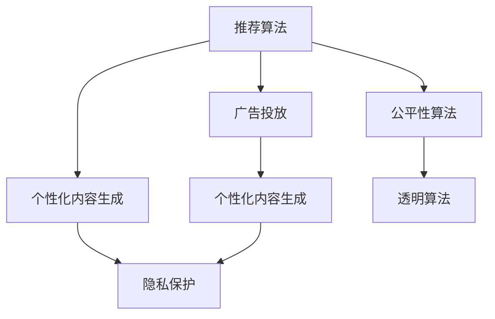

                 

## 1. 背景介绍

在现代社会中，大数据和人工智能(AI)技术的发展，已经让我们的日常生活和社会治理变得前所未有的高效。无论是智能客服、电商推荐系统，还是社交媒体平台，背后都有着一系列复杂的算法在默默地运行。这些算法不仅极大地提升了我们的生活便利度，同时也带来了前所未有的问题和挑战。

### 1.1 为什么算法重要？

在商业和社会的各个领域，算法已经成为企业竞争的核心。从广告投放、金融风控到医疗诊断、城市交通管理，算法无处不在。一个高效、可靠的算法，可以为平台提供准确的用户画像，提高决策效率，优化用户体验。但同时，算法的决策过程也蕴含着深层次的伦理和道德问题，可能会对个体和社会带来不利的后果。

### 1.2 算法的伦理困境

由于算法决策过程的“黑盒化”，用户往往无法了解算法的运行逻辑和内部机制。这导致了对算法的盲目信任，并使得决策的透明度和可解释性成为难题。例如，某电商平台通过算法推荐了用户可能感兴趣的商品，但用户可能并不真正需要，反而可能因为推荐而被诱导消费。再如，社交媒体平台通过算法推送个性化内容，这可能导致用户的信息茧房，造成群体极化，进而影响社会稳定。

## 2. 核心概念与联系

### 2.1 核心概念概述

为了更好地理解平台算法的运作原理和伦理问题，本节将介绍几个关键概念：

- **推荐算法**：利用用户的浏览历史、搜索记录等数据，为用户推荐商品、文章等内容的算法。
- **广告投放算法**：根据用户的特征和行为数据，投放精准的广告以实现最大化收益的算法。
- **个性化内容生成算法**：通过自然语言处理(NLP)、图像处理等技术，生成个性化内容如新闻、视频等的算法。
- **隐私保护算法**：在数据采集和使用过程中，保证用户隐私安全的算法。
- **公平性算法**：确保算法决策不带有歧视性，平等对待所有用户的算法。
- **透明算法**：让用户能够理解和监督算法决策过程的算法。

这些核心概念之间的联系可以通过以下Mermaid流程图来展示：



这个流程图展示了推荐算法在各个环节的应用：
1. 推荐算法不仅用于推荐商品，还能用于广告投放和个性化内容生成。
2. 隐私保护和公平性算法是推荐算法在数据使用和决策过程中必须遵守的原则。
3. 透明算法则是为了解决推荐算法的决策透明性和可解释性问题。

## 3. 核心算法原理 & 具体操作步骤

### 3.1 算法原理概述

平台算法通常基于用户画像和行为数据，使用一系列复杂的数学模型和机器学习算法来训练模型，以实现各种功能。这些算法通常包括以下步骤：

1. **数据预处理**：清洗、归一化数据，处理缺失值和异常值。
2. **特征提取**：从原始数据中提取有意义的特征，如用户的浏览记录、搜索关键词、历史评分等。
3. **模型训练**：使用历史数据训练推荐模型，如协同过滤、深度神经网络、矩阵分解等。
4. **结果评估**：通过A/B测试、点击率、转化率等指标评估模型性能。
5. **部署与迭代**：将模型部署到生产环境，根据实时反馈进行模型迭代优化。

### 3.2 算法步骤详解

以推荐算法为例，下面详细介绍推荐算法的具体操作步骤：

1. **数据采集与预处理**：
    - 从用户的浏览器、移动应用等处收集数据，如浏览记录、购买历史、评价评论等。
    - 清洗数据，移除无关的字段，填补缺失值，去除异常值。
    - 对数据进行归一化处理，确保不同特征之间可比。

2. **特征工程**：
    - 提取特征，如用户的浏览时间、点击次数、评分等。
    - 使用One-Hot编码、归一化、标准化等方法，处理分类和数值型特征。
    - 引入交叉特征，如用户ID和商品ID的组合特征，以提升模型表现。

3. **模型选择与训练**：
    - 选择合适的推荐模型，如协同过滤、基于矩阵分解的推荐算法或深度神经网络。
    - 划分训练集和测试集，使用训练集进行模型训练。
    - 调整模型超参数，如学习率、正则化系数、迭代次数等，优化模型性能。

4. **结果评估**：
    - 使用测试集对模型进行评估，计算各项指标，如准确率、召回率、F1分数等。
    - 进行A/B测试，对比新算法和旧算法的性能差异。
    - 根据评估结果，调整模型超参数，进行模型迭代。

5. **部署与监控**：
    - 将模型部署到生产环境，使用实时数据进行推荐。
    - 实时监控模型性能，检测异常，及时调整模型参数。
    - 定期更新模型，引入新的数据，提升推荐效果。

### 3.3 算法优缺点

推荐算法具有以下优点：
- 能够提高用户满意度，增加平台收益。
- 可以提供个性化服务，提升用户体验。
- 可以预测用户行为，优化资源分配。

推荐算法也存在以下缺点：
- 可能导致信息茧房，限制用户视野。
- 可能诱导用户消费，引发过度消费。
- 算法偏见可能导致歧视，损害公平性。

### 3.4 算法应用领域

推荐算法广泛应用于以下领域：

- **电商平台**：根据用户浏览历史、购买记录推荐商品。
- **视频网站**：根据用户观看记录推荐影片和视频。
- **社交媒体**：根据用户互动行为推荐内容。
- **新闻平台**：根据用户阅读偏好推荐文章。
- **金融服务**：根据用户交易历史推荐理财产品。

除了上述常见领域外，推荐算法还被应用于医疗健康、教育培训、智能家居等多个行业，为各行各业提供智能服务。

## 4. 数学模型和公式 & 详细讲解

### 4.1 数学模型构建

在推荐算法中，常见的数学模型包括协同过滤、基于矩阵分解的推荐算法、深度神经网络等。下面以基于矩阵分解的推荐算法为例，介绍数学模型的构建过程。

假设用户集合为 $U$，物品集合为 $I$，用户的评分矩阵为 $\mathbf{R} \in \mathbb{R}^{m \times n}$，其中 $m$ 为物品数量，$n$ 为用户数量。矩阵中的元素 $R_{ui}$ 表示用户 $u$ 对物品 $i$ 的评分。推荐算法通过分解矩阵，获得用户和物品的隐向量表示，来计算推荐结果。

推荐算法通过训练矩阵分解模型，拟合 $\mathbf{R} \approx \mathbf{P} \mathbf{Q}^T$，其中 $\mathbf{P} \in \mathbb{R}^{m \times k}$ 为物品隐向量，$\mathbf{Q} \in \mathbb{R}^{n \times k}$ 为用户隐向量，$k$ 为隐向量维度。模型最小化损失函数 $L(\mathbf{P}, \mathbf{Q})$，通过迭代优化参数，使预测值与实际评分之间的误差最小化。

### 4.2 公式推导过程

以矩阵分解为例，介绍推荐算法的公式推导过程。

目标是最小化损失函数：

$$
L(\mathbf{P}, \mathbf{Q}) = \frac{1}{2} \Vert \mathbf{R} - \mathbf{P} \mathbf{Q}^T \Vert^2_F
$$

其中 $\Vert \cdot \Vert^2_F$ 为矩阵的 Frobenius 范数。

将 $\mathbf{R}$ 分解为 $\mathbf{R} = \mathbf{P} \mathbf{Q}^T$，则目标函数转化为：

$$
L(\mathbf{P}, \mathbf{Q}) = \frac{1}{2} \Vert \mathbf{R} - \mathbf{P} \mathbf{Q}^T \Vert^2_F = \frac{1}{2} \sum_{u=1}^m \sum_{i=1}^n (R_{ui} - \mathbf{p}_u \cdot \mathbf{q}_i)^2
$$

其中 $\mathbf{p}_u = \mathbf{P}_u$，$\mathbf{q}_i = \mathbf{Q}_i$。

目标函数可以分解为两部分，分别对 $\mathbf{P}$ 和 $\mathbf{Q}$ 求偏导数：

$$
\frac{\partial L}{\partial \mathbf{P}} = \mathbf{Q} \mathbf{Q}^T \mathbf{R} - \mathbf{P} \mathbf{Q}^T \mathbf{Q} \mathbf{Q}^T = \mathbf{Q} (\mathbf{Q}^T \mathbf{R} - \mathbf{P} \mathbf{Q}^T)
$$

$$
\frac{\partial L}{\partial \mathbf{Q}} = \mathbf{P}^T \mathbf{P} \mathbf{Q} - \mathbf{P}^T \mathbf{R} \mathbf{Q} = \mathbf{P}^T (\mathbf{P} \mathbf{Q}^T - \mathbf{R})
$$

根据梯度下降算法，更新参数 $\mathbf{P}$ 和 $\mathbf{Q}$：

$$
\mathbf{P} \leftarrow \mathbf{P} - \eta \frac{\partial L}{\partial \mathbf{P}}
$$

$$
\mathbf{Q} \leftarrow \mathbf{Q} - \eta \frac{\partial L}{\partial \mathbf{Q}}
$$

其中 $\eta$ 为学习率。

### 4.3 案例分析与讲解

以某电商平台为例，该平台使用了基于矩阵分解的推荐算法。数据预处理阶段，平台从用户订单、浏览记录、评价等数据中提取特征，并进行归一化和标准化处理。然后，平台使用矩阵分解算法对用户和物品进行隐向量分解，计算用户对物品的评分预测值。在模型训练阶段，平台使用用户和物品的历史评分数据，最小化预测值与实际评分之间的差异，优化模型参数。最终，模型能够在实时数据上计算用户的评分预测值，并推荐物品。

## 5. 项目实践：代码实例和详细解释说明

### 5.1 开发环境搭建

在进行推荐算法开发前，我们需要准备好开发环境。以下是使用Python进行TensorFlow开发的环境配置流程：

1. 安装Anaconda：从官网下载并安装Anaconda，用于创建独立的Python环境。

2. 创建并激活虚拟环境：
```bash
conda create -n tf-env python=3.7 
conda activate tf-env
```

3. 安装TensorFlow：根据CUDA版本，从官网获取对应的安装命令。例如：
```bash
conda install tensorflow -c pytorch -c conda-forge
```

4. 安装各类工具包：
```bash
pip install numpy pandas scikit-learn matplotlib tqdm jupyter notebook ipython
```

完成上述步骤后，即可在`tf-env`环境中开始推荐算法开发。

### 5.2 源代码详细实现

下面以基于矩阵分解的推荐算法为例，给出使用TensorFlow实现代码。

```python
import tensorflow as tf
import numpy as np

def matrix_factorization(R, K):
    m, n = R.shape
    P = tf.Variable(tf.random.normal([m, K]))
    Q = tf.Variable(tf.random.normal([n, K]))
    
    X = tf.matmul(P, Q, transpose_b=True)
    loss = tf.reduce_mean(tf.square(R - X))
    optimizer = tf.keras.optimizers.Adam(learning_rate=0.01)
    
    train_op = optimizer.minimize(loss)
    
    return train_op

# 数据生成
m = 10
n = 5
R = np.random.rand(m, n) * 5 - 2.5
R[R > 4] = 5
R[R < -2] = -2

# 训练模型
K = 5
train_op = matrix_factorization(R, K)

with tf.Session() as sess:
    sess.run(tf.global_variables_initializer())
    for i in range(1000):
        _, loss_val = sess.run([train_op, loss])
        if i % 100 == 0:
            print(f"Iteration {i}, Loss: {loss_val:.4f}")

# 推荐新物品
P_val, Q_val = sess.run([P, Q])
X_val = tf.matmul(P_val, Q_val, transpose_b=True)
print(X_val)
```

### 5.3 代码解读与分析

**矩阵分解算法**：
- 首先定义了模型参数 $P$ 和 $Q$，并进行随机初始化。
- 使用矩阵乘法计算预测值 $X$，并计算预测值与实际评分之间的误差损失。
- 使用Adam优化器最小化损失函数，并返回训练操作。

**数据生成**：
- 生成随机评分矩阵 $R$，并进行归一化处理，确保评分在合理范围内。
- 根据评分矩阵训练模型，计算损失值并输出。

**模型训练**：
- 定义模型超参数 $K$，并调用训练函数进行模型训练。
- 训练过程中，每100次迭代输出一次损失值，观察损失变化。
- 最后输出模型预测值 $X$，用于推荐新物品。

在实际应用中，还需结合业务需求，对推荐算法进行优化，如添加模型正则化、设置模型评估指标等。通过不断迭代和优化，推荐算法能够更好地适应不同平台和业务场景，提升用户体验和平台收益。

## 6. 实际应用场景

### 6.1 电商平台推荐

电商平台使用推荐算法为用户推荐商品，可以显著提升用户的购买决策效率，增加平台销售额。例如，亚马逊的推荐系统能够根据用户的浏览历史和购买记录，推荐用户可能感兴趣的商品，使用户更容易发现并购买所需商品。

### 6.2 视频网站推荐

视频网站通过推荐算法，为用户推荐影片和视频，提高用户观看体验。例如，Netflix推荐系统能够根据用户的观看历史和评分，推荐用户可能感兴趣的影片，提高用户留存率和满意度。

### 6.3 社交媒体推荐

社交媒体平台使用推荐算法，为用户推荐感兴趣的内容，提升用户活跃度和参与度。例如，Facebook通过推荐算法为用户推荐朋友动态、热门文章等，使用户能够快速发现和参与感兴趣的内容。

## 7. 工具和资源推荐

### 7.1 学习资源推荐

为了帮助开发者系统掌握推荐算法的理论基础和实践技巧，这里推荐一些优质的学习资源：

1. 《推荐系统实战》书籍：介绍了推荐算法的基本原理、工程实现和业务应用，适合初学者和从业者阅读。

2. Coursera《Recommender Systems》课程：由斯坦福大学开设，涵盖推荐算法的理论基础和实际应用，课程配套作业和项目实战。

3. Kaggle推荐系统竞赛：通过参与实际竞赛，了解推荐算法的应用场景和优化方法，学习先进算法和模型结构。

4. DeepLearning.AI的推荐系统课程：由吴恩达教授讲授，介绍推荐算法的最新进展，包括深度学习和强化学习在推荐中的应用。

5. 《TensorFlow实战推荐系统》书籍：介绍使用TensorFlow实现推荐算法的全过程，包括数据预处理、模型训练和评估等环节。

### 7.2 开发工具推荐

推荐的开发工具包括以下几种：

1. TensorFlow：基于数据流的计算框架，支持分布式计算和深度学习模型训练，适合构建大规模推荐系统。

2. PyTorch：灵活易用的深度学习框架，适合快速迭代和模型优化，支持多种推荐算法。

3. Apache Spark：分布式计算框架，支持大规模数据处理和机器学习任务，适合构建推荐引擎。

4. Hadoop：分布式数据存储和处理平台，支持大规模数据存储和处理，适合构建推荐系统的数据基础设施。

5. Elasticsearch：分布式搜索和分析引擎，支持实时数据检索和处理，适合构建推荐系统的搜索功能。

### 7.3 相关论文推荐

推荐算法的理论基础和最新进展主要体现在以下几个方面：

1. Netflix Prize竞赛论文：介绍了协同过滤算法的优化方法和应用，推动了推荐算法的工程实践。

2. 《Top-k recommendation via a novel matrix factorization method》：提出了一种基于矩阵分解的推荐算法，并通过实验验证了其有效性。

3. 《Adaptive Collaborative Filtering》：提出了一种自适应协同过滤算法，能够动态调整推荐策略，提升推荐效果。

4. 《Deep Learning for Recommender Systems》：介绍了深度学习在推荐系统中的应用，展示了深度模型的优越性。

5. 《Contextual Bandits with Linear Payoff Functions》：介绍了一种上下文强化学习算法，用于推荐系统的动态优化。

这些论文代表了推荐算法的研究热点和发展方向，通过学习这些前沿成果，可以帮助研究者把握学科前进方向，激发更多的创新灵感。

## 8. 总结：未来发展趋势与挑战

### 8.1 总结

本文对基于平台算法的推荐系统进行了全面系统的介绍。首先阐述了推荐系统的背景和重要性，明确了推荐系统在提高用户满意度、增加平台收益等方面的作用。其次，从原理到实践，详细讲解了推荐算法的数学模型和操作步骤，给出了推荐算法开发的完整代码实例。同时，本文还广泛探讨了推荐算法在电商平台、视频网站、社交媒体等各个领域的应用前景，展示了推荐算法的巨大潜力。此外，本文精选了推荐算法的各类学习资源，力求为读者提供全方位的技术指引。

通过本文的系统梳理，可以看到，推荐算法在现代社会中发挥了重要的作用，极大地提升了用户的体验和平台的收益。但同时，推荐算法也面临诸如信息茧房、隐私泄露、算法偏见等伦理问题，需要通过技术和管理手段进行全面优化。

### 8.2 未来发展趋势

展望未来，推荐算法将呈现以下几个发展趋势：

1. **多模态推荐**：结合文本、图像、音频等多模态数据，提升推荐系统的丰富性和多样性。例如，将用户的社交网络信息与商品图片结合，生成更为精准的推荐。

2. **实时推荐**：通过实时数据流处理和计算，提升推荐系统的响应速度和时效性。例如，在线广告平台能够根据用户即时行为数据，实时更新推荐策略。

3. **联邦学习**：通过分布式训练，在用户隐私保护的前提下，收集多方数据进行联合训练，提升推荐系统的泛化能力和公平性。例如，电商平台和社交媒体平台合作，联合训练推荐模型。

4. **推荐结果的个性化**：通过个性化特征提取和推荐策略定制，提升推荐系统的精准度和用户满意度。例如，使用用户画像和行为数据，定制化推荐方案。

5. **推荐结果的多样性**：通过引入多样性约束，避免推荐结果过于集中，提升推荐系统的鲁棒性和多样性。例如，引入“多样性最大化”算法，增加推荐结果的多样性。

6. **推荐系统的可持续性**：通过持续学习和动态优化，保证推荐系统的长期稳定性和适应性。例如，根据用户行为数据，动态调整推荐策略。

这些趋势将使得推荐算法更加智能和高效，为用户带来更好的体验，同时也为平台创造更大的商业价值。

### 8.3 面临的挑战

尽管推荐算法已经取得了显著的成就，但在迈向更智能化、普适化应用的过程中，仍面临诸多挑战：

1. **数据质量问题**：推荐算法的准确性很大程度上依赖于数据的质量，数据的缺失、噪声和异常值等会影响推荐结果。

2. **隐私保护问题**：在数据收集和处理过程中，如何保护用户隐私，防止数据泄露和滥用，是一个重要难题。

3. **算法偏见问题**：推荐算法可能会因数据偏见和模型设计，导致推荐结果的歧视和不公平。例如，某些用户群体的推荐效果不如其他群体。

4. **资源消耗问题**：大规模推荐系统需要处理海量数据，需要高计算能力和存储资源，如何在不增加成本的情况下，提高系统性能，是一个技术挑战。

5. **效果评估问题**：推荐算法的评估指标多种多样，如何选择合适的评估指标，全面客观地评价推荐效果，是一个重要难题。

6. **透明性和可解释性问题**：推荐算法的决策过程“黑盒化”，难以解释和解释，无法满足用户的知情权和监督权。

这些挑战需要进一步的研究和创新，以提升推荐算法的公平性、透明性和用户满意度。

### 8.4 研究展望

为了应对上述挑战，未来的研究需要在以下几个方面进行深入探索：

1. **数据采集与处理**：通过先进的数据采集和处理技术，提升数据质量，减少噪声和异常值，优化数据分布。

2. **隐私保护技术**：研究隐私保护算法和技术，确保用户数据的安全和隐私，如差分隐私、联邦学习等。

3. **算法公平性**：引入公平性约束，减少算法偏见，实现不同用户群体的公平推荐，如公平性算法、对抗训练等。

4. **资源优化技术**：开发高效的数据处理和计算技术，如模型压缩、分布式训练、混合精度计算等，优化资源使用。

5. **透明性和可解释性**：研究透明性和可解释性算法，提升推荐算法的决策过程的透明性和可解释性，如因果推断、模型可解释性技术等。

6. **推荐系统集成**：将推荐系统与用户反馈、行为数据、外部知识库等结合，提升推荐系统的性能和效果，如模型集成、知识增强等。

这些研究方向将推动推荐算法的技术进步，帮助推荐系统更好地服务用户和平台，提升推荐系统的公平性和透明性，解决数据隐私和算法偏见等伦理问题。

## 9. 附录：常见问题与解答

**Q1: 推荐算法是否适用于所有业务场景？**

A: 推荐算法在很多业务场景中都有应用，但其效果取决于业务特性和用户行为。例如，在电商、视频、新闻等领域，推荐算法能显著提升用户体验和平台收益。但在某些场景下，如B2B销售、医疗服务，推荐算法的效果可能不如传统方法。因此，需要根据具体业务需求选择合适的算法。

**Q2: 如何评估推荐算法的性能？**

A: 推荐算法的性能评估可以从多个角度进行，如准确率、召回率、F1分数、覆盖率等。常用的评估指标包括：
- 准确率（Precision）：推荐的物品中，用户真正感兴趣的占比。
- 召回率（Recall）：用户感兴趣的物品中，被推荐成功的占比。
- F1分数（F1 Score）：综合考虑准确率和召回率，衡量推荐结果的综合效果。
- 覆盖率（Coverage）：被推荐物品的覆盖范围，即推荐结果的多样性。
- 个性化程度（Personalization）：推荐结果与用户兴趣的匹配程度，如用户行为预测准确率。

**Q3: 推荐算法中是否需要考虑用户隐私？**

A: 推荐算法需要考虑用户隐私保护，避免在数据收集和处理过程中，用户数据被泄露和滥用。常用的隐私保护技术包括：
- 差分隐私（Differential Privacy）：在数据统计中引入噪声，保护个体数据隐私。
- 联邦学习（Federated Learning）：在分布式环境下，保护用户数据隐私，联合训练模型。
- 数据匿名化（Data Anonymization）：对数据进行去标识化处理，防止数据泄露。

**Q4: 如何提升推荐算法的公平性？**

A: 提升推荐算法的公平性需要考虑多个因素，如数据分布、模型设计、推荐策略等。常用的方法包括：
- 数据预处理：对数据进行公平性处理，减少数据偏差。
- 模型设计：引入公平性约束，如对抗训练、公平性优化等。
- 推荐策略：使用公平性算法，如加权推荐、多样性最大化等。
- 外部知识结合：引入外部知识库，如规则库、知识图谱等，提升推荐公平性。

**Q5: 推荐算法是否容易受到信息茧房影响？**

A: 推荐算法容易受到信息茧房的影响，即用户只接收到自己感兴趣的内容，导致视野变窄。解决方法包括：
- 引入多样性约束：在推荐过程中，增加多样性约束，避免推荐结果过于集中。
- 动态调整推荐策略：根据用户行为数据，动态调整推荐策略，提升推荐结果的多样性。
- 推荐系统集成：将推荐系统与内容推荐、社交网络等功能结合，打破信息茧房。

通过不断优化推荐算法的性能和公平性，可以有效避免信息茧房问题，提升用户的广泛视野和满意度。

