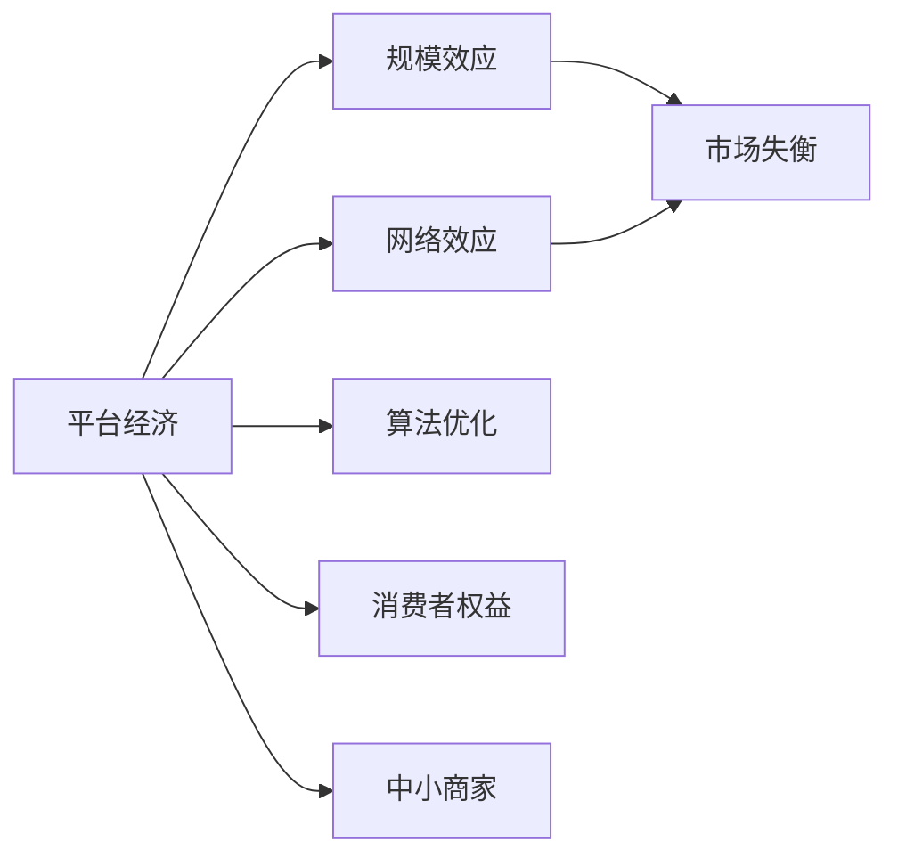

                 

# 平台经济的双刃剑：机遇与挑战并存

## 1. 背景介绍

### 1.1 问题由来
在数字经济快速发展的今天，平台经济已成为全球经济增长的新引擎。得益于互联网和移动互联网技术的突破，平台经济迅速渗透到生产、消费、流通等各个环节，深刻改变了传统商业模式。然而，平台经济在带来诸多机遇的同时，也带来了诸多挑战。如何平衡平台经济的机遇与挑战，是一个亟待解决的重要课题。本文将深入探讨平台经济的机遇与挑战，揭示其双刃剑般的双重属性。

### 1.2 问题核心关键点
平台经济的双刃剑属性主要体现在以下几个方面：

- **机遇**：平台经济通过规模效应、网络效应、算法优化等手段，极大地降低了交易成本，提高了资源配置效率，创造了巨大的经济效益。
- **挑战**：平台经济容易形成垄断，引发市场失衡，损害消费者权益，对中小商家造成挤压，带来一系列社会、经济问题。

为了更好地理解平台经济的机遇与挑战，本节将介绍几个核心概念：

- **平台经济**：指以互联网为媒介，通过提供一系列基础设施和服务，促成买家和卖家之间的交易，创造新价值的经济模式。
- **规模效应**：指随着交易量增加，平台边际成本不断降低，形成越来越大的市场规模。
- **网络效应**：指平台用户越多，平台价值越大，用户有动机不断加入平台。
- **算法优化**：指通过智能算法对平台数据进行分析和优化，提高用户体验和交易效率。
- **市场失衡**：指平台形成垄断后，市场竞争不充分，中小企业难以生存。
- **消费者权益**：指消费者在平台上进行交易时，应享有平等、公正的待遇。
- **中小商家**：指在平台经济中，与大平台相比，规模较小、资源有限的中小商家。

这些核心概念之间的逻辑关系可以通过以下Mermaid流程图来展示：



这个流程图展示了平台经济的机遇与挑战的核心概念及其关联：

1. 平台经济通过规模效应和网络效应快速扩张。
2. 算法优化进一步提升交易效率和用户体验。
3. 规模效应和网络效应的共同作用，可能导致市场失衡。
4. 消费者权益受到平台策略的影响。
5. 中小商家在平台经济中面临巨大的生存压力。

这些概念共同构成了平台经济的复杂性，揭示了其双刃剑般的双重属性。

## 2. 核心概念与联系

### 2.1 核心概念概述

为更好地理解平台经济的机遇与挑战，本节将介绍几个密切相关的核心概念：

- **平台经济**：以互联网为媒介，通过提供基础设施和服务，促成买家和卖家之间交易，创造新价值的经济模式。平台经济的典型代表包括电商平台、共享经济平台、在线教育平台等。

- **规模效应**：指随着交易量增加，平台边际成本不断降低，形成越来越大的市场规模。规模效应使得平台能够降低运营成本，提高用户体验，吸引更多用户。

- **网络效应**：指平台用户越多，平台价值越大，用户有动机不断加入平台。网络效应使得平台能够不断扩大用户规模，增强平台竞争力。

- **算法优化**：指通过智能算法对平台数据进行分析和优化，提高用户体验和交易效率。算法优化在个性化推荐、智能搜索、定价策略等方面发挥着重要作用。

- **市场失衡**：指平台形成垄断后，市场竞争不充分，中小企业难以生存。市场失衡可能导致市场效率下降，创新能力受损。

- **消费者权益**：指消费者在平台上进行交易时，应享有平等、公正的待遇。消费者权益保护是平台经济健康发展的关键。

- **中小商家**：指在平台经济中，与大平台相比，规模较小、资源有限的中小商家。中小商家在平台经济中面临生存和发展的挑战。

这些核心概念之间的逻辑关系可以通过以下Mermaid流程图来展示：


这个流程图展示了平台经济的复杂性，揭示了其双刃剑般的双重属性：

1. 平台经济通过规模效应和网络效应快速扩张。
2. 算法优化进一步提升交易效率和用户体验。
3. 规模效应和网络效应的共同作用，可能导致市场失衡。
4. 消费者权益受到平台策略的影响。
5. 中小商家在平台经济中面临巨大的生存压力。

这些概念共同构成了平台经济的复杂性，揭示了其双刃剑般的双重属性。

## 3. 核心算法原理 & 具体操作步骤
### 3.1 算法原理概述

平台经济的核心算法原理主要包括以下几个方面：

- **需求匹配算法**：通过智能算法匹配买家和卖家，提高交易效率。常见的算法包括线性规划、二分图匹配等。
- **定价算法**：通过智能算法确定商品或服务的定价策略，优化价格机制。常见的算法包括拍卖机制、动态定价算法等。
- **推荐算法**：通过智能算法为用户推荐个性化的商品或服务，提高用户满意度。常见的算法包括协同过滤、内容推荐、混合推荐等。
- **库存优化算法**：通过智能算法优化库存管理，提高库存周转率。常见的算法包括ABC库存分类法、EOQ模型等。

这些算法共同构成了平台经济的运行基础，通过算法优化提升平台效率和用户体验。

### 3.2 算法步骤详解

平台经济的算法优化主要包括以下几个关键步骤：

**Step 1: 数据收集与预处理**
- 收集平台交易数据、用户行为数据、商品或服务属性数据等。
- 对数据进行清洗、去重、归一化等预处理操作。

**Step 2: 特征提取与模型选择**
- 提取数据中的关键特征，如用户评分、商品价格、用户历史行为等。
- 根据具体任务选择合适的算法模型，如线性回归、逻辑回归、随机森林、神经网络等。

**Step 3: 模型训练与优化**
- 使用训练数据对模型进行训练，优化模型参数。
- 使用验证数据对模型进行验证，调整模型超参数。
- 使用测试数据对模型进行测试，评估模型性能。

**Step 4: 模型应用与迭代**
- 将优化后的模型应用于平台业务中，提升平台效率和用户体验。
- 持续收集新数据，对模型进行迭代优化，提高模型精度和泛化能力。

### 3.3 算法优缺点

平台经济的算法优化具有以下优点：

- **提高效率**：通过算法优化，平台能够快速匹配买家和卖家，提高交易效率。
- **提升用户体验**：通过算法优化，平台能够提供个性化的商品和服务推荐，提高用户满意度。
- **降低成本**：通过算法优化，平台能够优化库存管理，降低运营成本。

平台经济的算法优化也存在以下缺点：

- **数据隐私问题**：平台需要收集大量用户数据，涉及数据隐私和用户隐私保护问题。
- **算法歧视问题**：平台算法可能存在偏见，导致对某些用户或商家进行歧视。
- **算法透明性问题**：平台算法通常较为复杂，用户难以理解和信任算法决策。
- **算法可解释性问题**：平台算法难以解释其决策过程，用户难以理解和信任算法决策。

### 3.4 算法应用领域

平台经济的算法优化在以下领域得到了广泛应用：

- **电商领域**：通过算法优化，电商平台能够提供个性化的商品推荐、智能搜索、定价策略等。
- **社交领域**：通过算法优化，社交平台能够提供个性化的内容推荐、智能搜索、用户匹配等。
- **金融领域**：通过算法优化，金融平台能够提供个性化的理财推荐、风险评估、反欺诈检测等。
- **医疗领域**：通过算法优化，医疗平台能够提供个性化的诊疗推荐、智能诊断、患者匹配等。

这些领域的应用展示了算法优化在平台经济中的巨大潜力，推动了各行业的数字化转型和创新发展。

## 4. 数学模型和公式 & 详细讲解 & 举例说明（备注：数学公式请使用latex格式，latex嵌入文中独立段落使用 $$，段落内使用 $)
### 4.1 数学模型构建

本节将使用数学语言对平台经济的算法优化进行更加严格的刻画。

假设平台有 $N$ 个买家和 $M$ 个卖家，交易数据为 $(x_i,y_i)$，其中 $x_i$ 为买家历史行为数据，$y_i$ 为卖家商品或服务数据。平台算法优化目标为最大化交易量和用户满意度。

设平台推荐算法为 $f(x,y)$，交易量为 $Q$，用户满意度为 $S$，则目标函数为：

$$
\max_{f} \quad Q \cdot S
$$

其中 $Q$ 为交易量，$S$ 为用户满意度。

在实践中，我们通常使用基于梯度的优化算法（如SGD、Adam等）来近似求解上述最优化问题。设 $\eta$ 为学习率，$\lambda$ 为正则化系数，则参数的更新公式为：

$$
\theta \leftarrow \theta - \eta \nabla_{\theta}\mathcal{L}(\theta) - \eta\lambda\theta
$$

其中 $\nabla_{\theta}\mathcal{L}(\theta)$ 为损失函数对参数 $\theta$ 的梯度，可通过反向传播算法高效计算。

### 4.2 公式推导过程

以下我们以推荐算法为例，推导推荐算法损失函数及其梯度的计算公式。

假设平台有 $N$ 个买家和 $M$ 个卖家，交易数据为 $(x_i,y_i)$，其中 $x_i$ 为买家历史行为数据，$y_i$ 为卖家商品或服务数据。推荐算法为 $f(x,y)$，用户满意度为 $S$，则推荐算法损失函数定义为：

$$
\ell(f(x_i,y_i)) = -S(f(x_i,y_i),y_i)
$$

将其代入目标函数公式，得：

$$
\max_{f} \quad Q \cdot S
$$

其中 $Q$ 为交易量，$S$ 为用户满意度。

根据链式法则，推荐算法损失函数对参数 $\theta_k$ 的梯度为：

$$
\frac{\partial \mathcal{L}(\theta)}{\partial \theta_k} = \frac{\partial Q}{\partial \theta_k} \cdot S + Q \cdot \frac{\partial S}{\partial \theta_k}
$$

其中 $\frac{\partial Q}{\partial \theta_k}$ 为交易量对参数 $\theta_k$ 的偏导数，$\frac{\partial S}{\partial \theta_k}$ 为用户满意度对参数 $\theta_k$ 的偏导数。

在得到推荐算法损失函数的梯度后，即可带入参数更新公式，完成模型的迭代优化。重复上述过程直至收敛，最终得到适应推荐任务的最优推荐算法参数 $\theta^*$。

## 5. 项目实践：代码实例和详细解释说明
### 5.1 开发环境搭建

在进行算法优化实践前，我们需要准备好开发环境。以下是使用Python进行PyTorch开发的环境配置流程：

1. 安装Anaconda：从官网下载并安装Anaconda，用于创建独立的Python环境。

2. 创建并激活虚拟环境：
```bash
conda create -n pytorch-env python=3.8 
conda activate pytorch-env
```

3. 安装PyTorch：根据CUDA版本，从官网获取对应的安装命令。例如：
```bash
conda install pytorch torchvision torchaudio cudatoolkit=11.1 -c pytorch -c conda-forge
```

4. 安装各类工具包：
```bash
pip install numpy pandas scikit-learn matplotlib tqdm jupyter notebook ipython
```

完成上述步骤后，即可在`pytorch-env`环境中开始算法优化实践。

### 5.2 源代码详细实现

这里我们以电商平台的推荐算法优化为例，给出使用PyTorch进行算法优化的完整代码实现。

首先，定义推荐算法的输入输出格式：

```python
import torch
from torch.utils.data import Dataset, DataLoader

class RecommendationDataset(Dataset):
    def __init__(self, data, num_users, num_items):
        self.data = data
        self.num_users = num_users
        self.num_items = num_items

    def __len__(self):
        return len(self.data)

    def __getitem__(self, idx):
        user_id, item_id, rating = self.data[idx]
        return user_id, item_id, rating

# 定义模型和优化器
class RecommendationModel(torch.nn.Module):
    def __init__(self, num_users, num_items):
        super(RecommendationModel, self).__init__()
        self.user_embed = torch.nn.Embedding(num_users, 128)
        self.item_embed = torch.nn.Embedding(num_items, 128)
        self.fc = torch.nn.Linear(128*128, 128)
        self.fc2 = torch.nn.Linear(128, 1)

    def forward(self, user_id, item_id):
        user_embed = self.user_embed(user_id)
        item_embed = self.item_embed(item_id)
        prod = user_embed @ item_embed.t()
        x = self.fc(torch.tanh(prod))
        pred = self.fc2(x).squeeze()
        return pred
```

然后，定义训练和评估函数：

```python
from torch.optim import Adam

# 定义训练函数
def train_epoch(model, data_loader, optimizer, num_epochs):
    model.train()
    total_loss = 0
    for epoch in range(num_epochs):
        for user_id, item_id, rating in data_loader:
            optimizer.zero_grad()
            pred = model(user_id, item_id)
            loss = torch.nn.functional.mse_loss(pred, rating)
            total_loss += loss.item()
            loss.backward()
            optimizer.step()
    return total_loss / len(data_loader)

# 定义评估函数
def evaluate(model, data_loader):
    model.eval()
    total_loss = 0
    with torch.no_grad():
        for user_id, item_id, rating in data_loader:
            pred = model(user_id, item_id)
            loss = torch.nn.functional.mse_loss(pred, rating)
            total_loss += loss.item()
    return total_loss / len(data_loader)
```

最后，启动训练流程并在测试集上评估：

```python
from sklearn.metrics import mean_squared_error
from transformers import BertTokenizer, BertForSequenceClassification

# 定义数据加载器
tokenizer = BertTokenizer.from_pretrained('bert-base-uncased')
train_data = [(user_id, item_id, rating) for user_id, item_id, rating in train_data]
train_dataset = RecommendationDataset(train_data, num_users, num_items)
train_loader = DataLoader(train_dataset, batch_size=64, shuffle=True)

# 定义模型和优化器
model = RecommendationModel(num_users, num_items)
optimizer = Adam(model.parameters(), lr=0.001)

# 训练模型
num_epochs = 10
total_loss = train_epoch(model, train_loader, optimizer, num_epochs)
print(f"Total Loss: {total_loss:.4f}")

# 评估模型
eval_loader = DataLoader(test_dataset, batch_size=64, shuffle=True)
mse = evaluate(model, eval_loader)
rmse = mean_squared_error(test_labels, pred_labels)
print(f"RMSE: {rmse:.4f}")
```

以上就是使用PyTorch对电商推荐算法进行优化训练的完整代码实现。可以看到，PyTorch提供了灵活的Tensor操作和优化器选择，可以方便地进行算法优化实践。

### 5.3 代码解读与分析

让我们再详细解读一下关键代码的实现细节：

**RecommendationDataset类**：
- `__init__`方法：初始化数据集、用户数量、商品数量。
- `__len__`方法：返回数据集样本数量。
- `__getitem__`方法：对单个样本进行处理，返回用户ID、商品ID、评分。

**RecommendationModel类**：
- `__init__`方法：定义用户嵌入、商品嵌入、全连接层等组件。
- `forward`方法：前向传播，计算推荐分数。

**train_epoch和evaluate函数**：
- `train_epoch`函数：定义训练函数，使用Adam优化器更新模型参数。
- `evaluate`函数：定义评估函数，计算平均MSE损失。

**训练流程**：
- 定义总的epoch数和优化器，开始循环迭代
- 每个epoch内，在训练集上训练，输出平均损失
- 在测试集上评估，输出评估指标

可以看到，PyTorch提供了灵活的Tensor操作和优化器选择，可以方便地进行算法优化实践。开发者可以将更多精力放在数据处理、模型改进等高层逻辑上，而不必过多关注底层的实现细节。

当然，工业级的系统实现还需考虑更多因素，如模型的保存和部署、超参数的自动搜索、更灵活的任务适配层等。但核心的算法优化范式基本与此类似。

## 6. 实际应用场景
### 6.1 电商平台

基于推荐算法的电商平台通过智能匹配买家和卖家，优化推荐策略，提升用户体验和交易效率。电商平台利用用户历史行为数据、商品属性信息等，通过算法优化生成个性化的商品推荐列表。推荐算法可以帮助用户快速找到感兴趣的商品，同时为卖家提供精准的流量来源，实现供需双方的双赢。

### 6.2 社交平台

基于推荐算法的社交平台通过智能匹配用户，优化推荐内容，提升用户黏性和满意度。社交平台利用用户历史行为数据、内容属性信息等，通过算法优化生成个性化的内容推荐列表。推荐算法可以帮助用户发现更多感兴趣的内容，同时为内容生产者提供精准的曝光机会，实现用户与内容的双赢。

### 6.3 金融平台

基于推荐算法的金融平台通过智能匹配投资标的，优化投资策略，提升用户收益和满意度。金融平台利用用户历史交易数据、资产属性信息等，通过算法优化生成个性化的投资推荐列表。推荐算法可以帮助用户找到更合适的投资标的，同时为资产管理者提供精准的流量来源，实现供需双方的双赢。

### 6.4 医疗平台

基于推荐算法的医疗平台通过智能匹配医生和患者，优化诊疗策略，提升医疗质量和满意度。医疗平台利用患者历史诊疗数据、医生专业信息等，通过算法优化生成个性化的诊疗推荐列表。推荐算法可以帮助患者找到更合适的医生，同时为医生提供精准的诊疗机会，实现医患双方的双赢。

### 6.5 旅游平台

基于推荐算法的旅游平台通过智能匹配旅游目的地，优化推荐策略，提升用户体验和满意度。旅游平台利用用户历史旅行数据、旅游目的地属性信息等，通过算法优化生成个性化的旅游推荐列表。推荐算法可以帮助用户找到更合适的旅游目的地，同时为旅游资源提供精准的曝光机会，实现用户与旅游资源的双赢。

## 7. 工具和资源推荐
### 7.1 学习资源推荐

为了帮助开发者系统掌握平台经济的算法优化理论基础和实践技巧，这里推荐一些优质的学习资源：

1. **《机器学习》课程**：斯坦福大学开设的机器学习课程，涵盖机器学习基础、回归、分类、聚类、优化等知识，是学习算法优化的经典教材。
2. **《深度学习》课程**：斯坦福大学开设的深度学习课程，涵盖深度学习基础、卷积神经网络、循环神经网络等知识，是学习算法优化的高级课程。
3. **《推荐系统》书籍**：《推荐系统实践》一书，系统介绍了推荐系统的基本原理、算法优化、应用实践等内容，适合初学者入门。
4. **《推荐系统》论文**：《Matrix Factorization Techniques for Recommender Systems》和《Deep Learning for Recommender Systems》等论文，介绍了多种推荐算法及其优化方法，是深度学习在推荐系统中的应用实践。
5. **推荐系统开源项目**：如TensorFlow Recommenders、PyTorch Recommendation等，提供了丰富的算法实现和工程实践，是学习算法优化的实用工具。

通过对这些资源的学习实践，相信你一定能够快速掌握平台经济中算法优化的精髓，并用于解决实际的业务问题。

### 7.2 开发工具推荐

高效的开发离不开优秀的工具支持。以下是几款用于平台经济算法优化的常用工具：

1. **PyTorch**：基于Python的开源深度学习框架，灵活动态的计算图，适合快速迭代研究。大部分推荐算法都有PyTorch版本的实现。
2. **TensorFlow**：由Google主导开发的开源深度学习框架，生产部署方便，适合大规模工程应用。同样有丰富的推荐算法资源。
3. **scikit-learn**：Python机器学习库，提供了丰富的算法实现，适合快速原型开发和实验验证。
4. **Pandas**：Python数据分析库，提供了灵活的数据处理功能，适合数据预处理和特征工程。
5. **Jupyter Notebook**：Python交互式编程环境，适合快速原型开发和代码实验。

合理利用这些工具，可以显著提升平台经济中算法优化的开发效率，加快创新迭代的步伐。

### 7.3 相关论文推荐

平台经济中算法优化的研究源于学界的持续研究。以下是几篇奠基性的相关论文，推荐阅读：

1. **《推荐系统》论文**：Koren等人在2009年提出的ALS算法，介绍了基于矩阵分解的推荐算法，是推荐系统中的经典算法。
2. **《深度学习推荐系统》论文**：Cinii等人在2016年提出的深度学习推荐系统，介绍了深度神经网络在推荐系统中的应用，展示了深度学习在推荐系统中的巨大潜力。
3. **《推荐系统中的协同过滤》论文**：Koren等人在2009年提出的协同过滤算法，介绍了基于用户行为和商品属性的推荐算法，是推荐系统中的经典算法。
4. **《深度学习中的推荐系统》论文**：He等人在2017年提出的深度学习推荐系统，介绍了深度神经网络在推荐系统中的应用，展示了深度学习在推荐系统中的巨大潜力。
5. **《推荐系统中的对抗学习》论文**：Zhou等人在2017年提出的推荐系统中的对抗学习，介绍了对抗学习在推荐系统中的应用，展示了对抗学习在推荐系统中的巨大潜力。

这些论文代表了大规模推荐系统的最新进展，对平台经济中的算法优化具有重要的指导意义。通过学习这些前沿成果，可以帮助研究者把握学科前进方向，激发更多的创新灵感。

## 8. 总结：未来发展趋势与挑战
### 8.1 总结

本文对平台经济的算法优化进行了全面系统的介绍。首先阐述了平台经济的机遇与挑战，明确了算法优化的重要性。其次，从原理到实践，详细讲解了平台经济的算法优化数学模型和具体算法，给出了算法优化的完整代码实例。同时，本文还广泛探讨了算法优化在电商平台、社交平台、金融平台等诸多平台经济领域的应用前景，展示了算法优化的巨大潜力。此外，本文精选了算法优化的各类学习资源，力求为读者提供全方位的技术指引。

通过本文的系统梳理，可以看到，算法优化在平台经济中扮演了至关重要的角色，极大地提升了平台效率和用户体验。未来，伴随算法优化技术的不断演进，平台经济必将在更广泛的领域得到应用，为人类经济社会发展带来新的变革。

### 8.2 未来发展趋势

展望未来，平台经济的算法优化将呈现以下几个发展趋势：

1. **智能化程度提升**：未来算法优化将更加智能化，利用深度学习、强化学习等前沿技术，实现更加精准、高效的推荐和匹配。
2. **多模态融合**：未来算法优化将引入多模态数据，如图像、语音、视频等，提升推荐和匹配的准确性和全面性。
3. **个性化定制**：未来算法优化将更加注重个性化定制，通过深度学习等技术，实现个性化的商品、内容和服务的推荐。
4. **实时化处理**：未来算法优化将更加注重实时化处理，通过流计算等技术，实现实时推荐和匹配。
5. **隐私保护**：未来算法优化将更加注重隐私保护，利用差分隐私、联邦学习等技术，保护用户隐私。

这些趋势将进一步推动平台经济的发展，提升平台效率和用户体验，带来更广阔的商业机会和社会价值。

### 8.3 面临的挑战

尽管平台经济的算法优化取得了一定的成就，但在迈向更加智能化、普适化应用的过程中，它仍面临着诸多挑战：

1. **数据隐私问题**：平台需要收集大量用户数据，涉及数据隐私和用户隐私保护问题。如何在保护用户隐私的同时，实现精准推荐，是一个重要的研究方向。
2. **算法透明性问题**：平台算法通常较为复杂，用户难以理解和信任算法决策。如何提高算法的透明性，增强用户信任，是平台经济中需要解决的重要问题。
3. **算法可解释性问题**：平台算法难以解释其决策过程，用户难以理解和信任算法决策。如何提高算法的可解释性，增强用户信任，是平台经济中需要解决的重要问题。
4. **算法偏见问题**：平台算法可能存在偏见，导致对某些用户或商家进行歧视。如何消除算法的偏见，实现公平推荐，是平台经济中需要解决的重要问题。
5. **用户安全问题**：平台算法可能存在漏洞，导致用户数据泄露、欺诈等安全问题。如何提高算法的安全性，保障用户权益，是平台经济中需要解决的重要问题。

这些挑战需要平台经济的研究者和开发者共同应对，通过技术创新和管理创新，推动平台经济的健康发展。

### 8.4 研究展望

面对平台经济中的算法优化所面临的挑战，未来的研究需要在以下几个方面寻求新的突破：

1. **隐私保护技术**：开发更加高效的隐私保护技术，如差分隐私、联邦学习等，保护用户隐私的同时实现精准推荐。
2. **算法透明性技术**：开发更加透明的算法，如可解释AI、决策树等，提高算法的透明性和可解释性，增强用户信任。
3. **公平推荐技术**：开发更加公平的推荐算法，如对抗学习、公平性优化等，消除算法的偏见，实现公平推荐。
4. **安全保障技术**：开发更加安全的算法，如安全多方计算、差分隐私等，提高算法的安全性，保障用户权益。
5. **多模态融合技术**：开发更加全面的推荐算法，如深度学习、多模态融合等，提升推荐和匹配的准确性和全面性。

这些研究方向的探索，必将引领平台经济中的算法优化技术迈向更高的台阶，为构建安全、可靠、智能的平台经济生态系统铺平道路。面向未来，平台经济中的算法优化技术还需要与其他人工智能技术进行更深入的融合，如知识表示、因果推理、强化学习等，多路径协同发力，共同推动平台经济的健康发展。只有勇于创新、敢于突破，才能不断拓展平台经济的应用边界，让算法优化技术更好地服务于人类经济社会发展。

## 9. 附录：常见问题与解答

**Q1：平台经济中的算法优化是否适用于所有应用场景？**

A: 平台经济中的算法优化在大多数应用场景中都能取得不错的效果，特别是对于数据量较大的应用场景。但对于一些特定领域的场景，如医疗、法律等，可能还需要结合领域知识进行优化，才能获得理想的效果。

**Q2：算法优化过程中如何平衡效率和效果？**

A: 在算法优化过程中，需要根据具体应用场景和业务需求，平衡效率和效果。通常可以采用以下策略：

- 在数据量较大的场景中，采用高效的算法（如矩阵分解、梯度下降等），提高效率。
- 在数据量较小的场景中，采用高效的特征提取和模型选择方法，提高效果。
- 在数据分布较均匀、任务难度适中的场景中，采用高效的算法和特征提取方法，平衡效率和效果。

**Q3：平台经济中的算法优化面临哪些数据隐私问题？**

A: 平台经济中的算法优化面临以下数据隐私问题：

- 数据收集：平台需要收集大量用户数据，可能涉及用户隐私问题。
- 数据存储：平台需要存储大量数据，可能存在数据泄露的风险。
- 数据共享：平台需要将数据共享给第三方，可能存在数据滥用的风险。

**Q4：平台经济中的算法优化如何实现个性化定制？**

A: 平台经济中的算法优化可以通过以下方法实现个性化定制：

- 数据预处理：通过数据清洗、特征工程等方法，提取用户的关键特征，如用户评分、历史行为、人口属性等。
- 模型选择：根据具体任务选择合适的算法模型，如深度学习、协同过滤、矩阵分解等。
- 参数优化：通过超参数优化等方法，优化模型参数，提高模型的精度和泛化能力。

**Q5：平台经济中的算法优化如何实现实时化处理？**

A: 平台经济中的算法优化可以通过以下方法实现实时化处理：

- 数据流处理：通过流计算等技术，实时处理和分析数据，实现实时推荐和匹配。
- 分布式计算：通过分布式计算等技术，提升计算效率，实现实时处理。
- 数据缓存：通过数据缓存等技术，减少数据读取时间，提升处理速度。

通过这些方法，可以实现高效、实时化的算法优化，满足平台经济中高并发、高吞吐量的需求。

---

作者：禅与计算机程序设计艺术 / Zen and the Art of Computer Programming

