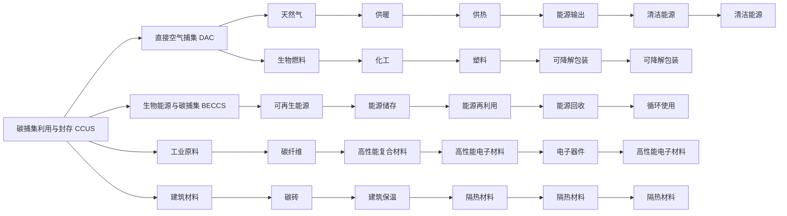

                 

# 2050年的全球减排：从碳捕集利用到负排放技术的碳中和路径

## 1. 背景介绍

### 1.1 问题由来
气候变化是当前全球面临的最紧迫挑战之一。近年来，全球平均气温不断升高，极端天气事件频发，生态环境退化速度加快。为了应对这一危机，各国政府和企业纷纷提出碳中和目标，力争在未来几十年内实现温室气体排放净零。其中，碳捕集利用与封存（Carbon Capture, Utilization, and Storage, CCUS）和负排放技术（Negative Emission Technologies, NETs）成为了关键的减排手段。

### 1.2 问题核心关键点
本文将探讨从碳捕集利用到负排放技术的碳中和路径。重点内容包括：

- 碳捕集技术：从原理、现状到应用前景。
- 碳利用技术：碳捕获后的再利用途径，包括工业原料、建筑材料等。
- 负排放技术：通过技术手段直接从大气中移除二氧化碳，如直接空气捕集（DAC）和生物能源与碳捕集（BECCS）。
- 路径选择：如何根据不同国家、行业的具体情况，选择合适的减排路径。

## 2. 核心概念与联系

### 2.1 核心概念概述
- **碳捕集利用与封存（CCUS）**：从工业排放源或大气中捕获二氧化碳，经过压缩、分离等处理后，储存在地下地质结构中，防止其进入大气。
- **负排放技术（NETs）**：通过技术手段直接从大气中移除二氧化碳，或将其转化为其他化学产品，实现碳中和。
- **直接空气捕集（DAC）**：从大气中直接捕获二氧化碳，再利用或储存。
- **生物能源与碳捕集（BECCS）**：利用生物质能，如生物燃料，结合碳捕集技术实现负排放。

### 2.2 核心概念原理和架构的 Mermaid 流程图



该流程图展示了碳捕集利用与封存、负排放技术及其应用的复杂架构，从捕集到再利用、储存的整个流程。

## 3. 核心算法原理 & 具体操作步骤
### 3.1 算法原理概述

碳捕集利用与封存和负排放技术涉及多种物理和化学过程，其算法原理可以分为以下几个步骤：

1. **捕集**：从工业排放源或大气中捕获二氧化碳，通常使用吸附、膜分离、化学吸收等方法。
2. **利用**：将捕获的二氧化碳转化为有用化学品或能源，如二氧化碳制氢、甲醇合成等。
3. **封存**：将二氧化碳压缩、储存于地下岩层或其他长期储存设施中。
4. **负排放**：直接从大气中捕集二氧化碳，再利用或储存，如DAC和BECCS技术。

### 3.2 算法步骤详解

#### 3.2.1 捕集

**吸附**：利用多孔材料对二氧化碳进行选择性吸附，常见的吸附剂包括活性炭、分子筛等。

**膜分离**：利用膜对二氧化碳和氮气等气体的渗透率差异，实现分离。

**化学吸收**：使用液体溶剂吸收二氧化碳，常见的溶剂有乙醇胺、碳酸钾等。

**算法步骤**：
1. **选择捕集方法**：根据工业排放源的特性，选择最适合的捕集方法。
2. **捕集设备安装**：在排放源处安装捕集设备。
3. **运行捕集设备**：根据工艺参数，调整捕集设备的运行状态，开始捕集二氧化碳。

#### 3.2.2 利用

**二氧化碳制氢**：利用二氧化碳和氢气在高温高压下反应生成甲烷，再通过蒸汽重整生成氢气。

**甲醇合成**：利用二氧化碳和氢气在催化剂作用下生成甲醇。

**算法步骤**：
1. **选择利用方法**：根据二氧化碳的来源和用途，选择合适的利用方法。
2. **安装利用设备**：在捕集设备后安装利用设备。
3. **运行利用设备**：调整设备参数，开始利用二氧化碳。

#### 3.2.3 封存

**地下储存**：将二氧化碳压缩后，注入地下深层岩层，防止其进入大气。

**海洋储存**：将二氧化碳注入海洋深层，通过物理和化学手段封存。

**算法步骤**：
1. **选择储存位置**：根据地质条件，选择最合适的储存地点。
2. **储存设备安装**：在储存地点安装储存设施。
3. **储存二氧化碳**：将捕集得到的二氧化碳压缩后，注入储存设施。

#### 3.2.4 负排放

**直接空气捕集（DAC）**：从大气中直接捕集二氧化碳，再利用或储存。

**生物能源与碳捕集（BECCS）**：利用生物质能，如生物燃料，结合碳捕集技术实现负排放。

**算法步骤**：
1. **选择负排放方法**：根据实际情况，选择最合适的负排放方法。
2. **安装捕集设备**：在特定地点安装捕集设备。
3. **运行捕集设备**：调整设备参数，开始捕集二氧化碳。

### 3.3 算法优缺点

**优点**：
- **减少温室气体排放**：直接从大气中移除二氧化碳，有效减少温室气体浓度。
- **促进工业发展**：利用二氧化碳转化为有用化学品或能源，推动新兴产业的发展。
- **提高能源利用率**：通过碳捕集利用技术，提高能源利用效率，降低能源消耗。

**缺点**：
- **成本高**：捕集、利用、封存等过程都需要高昂的成本。
- **技术复杂**：涉及多种物理和化学过程，技术难度大。
- **环境影响**：如地层封存可能带来地质风险，海洋封存可能影响海洋生态。

### 3.4 算法应用领域

碳捕集利用与封存和负排放技术广泛应用于以下几个领域：

- **电力行业**：电厂、钢厂、水泥厂等高排放行业，采用CCUS技术实现减排。
- **石化行业**：石油炼制、化工生产等过程中，捕集和利用二氧化碳。
- **农业领域**：利用生物质能结合BECCS技术，实现农业减排。
- **城市能源**：供热、供暖、制冷等领域，结合碳捕集技术实现减排。

## 4. 数学模型和公式 & 详细讲解 & 举例说明

### 4.1 数学模型构建

假设二氧化碳的捕集量为 $C$，利用率为 $U$，封存量为 $S$，负排放量为 $E$，则碳中和的总量可以表示为：

$$
\text{总减排量} = C + U + S + E
$$

其中：
- $C$：工业排放源捕集量
- $U$：捕集二氧化碳的利用量
- $S$：封存量
- $E$：负排放量

### 4.2 公式推导过程

以二氧化碳制氢为例，推导碳利用率的公式：

$$
\text{碳利用率} = \frac{\text{转化后的氢气量}}{\text{二氧化碳捕集量}}
$$

假设二氧化碳捕集量为 $C$，氢气反应方程为：

$$
\text{CO}_2 + \text{H}_2 \rightarrow \text{CH}_4 + \text{H}_2\text{O}
$$

设反应产生的甲烷量为 $M$，则：

$$
\text{碳利用率} = \frac{M}{C}
$$

### 4.3 案例分析与讲解

以生物能源与碳捕集（BECCS）为例，分析其应用效果：

假设每年生物燃料消耗量为 $B$，其中被捕集二氧化碳量为 $C_B$，转化为甲醇的量为 $M_B$，则总减排量为：

$$
\text{总减排量} = C_B + M_B
$$

例如，某生物燃料厂每年消耗生物燃料 $B=100$万吨，其中被捕集二氧化碳量为 $C_B=50$万吨，转化为甲醇的量为 $M_B=20$万吨，则总减排量为：

$$
\text{总减排量} = 50 + 20 = 70 \text{万吨二氧化碳当量}
$$

## 5. 项目实践：代码实例和详细解释说明

### 5.1 开发环境搭建

1. **安装Python和相关库**：
   ```bash
   sudo apt-get update
   sudo apt-get install python3 python3-pip python3-dev
   sudo pip3 install numpy scipy pandas matplotlib scikit-learn seaborn jupyter notebook
   ```

2. **安装Matplotlib和SciPy**：
   ```bash
   pip3 install matplotlib scipy
   ```

3. **安装Jupyter Notebook**：
   ```bash
   pip3 install jupyter notebook
   ```

4. **创建虚拟环境**：
   ```bash
   python3 -m venv env
   source env/bin/activate
   ```

### 5.2 源代码详细实现

以下是一个简单的碳捕集利用与封存模拟示例，展示了如何计算总减排量：

```python
import numpy as np

# 定义变量
C = 1000  # 二氧化碳捕集量（吨）
U = 500   # 捕集二氧化碳的利用量（吨）
S = 1000  # 封存量（吨）
E = 200   # 负排放量（吨）

# 计算总减排量
total_emission_reduction = C + U + S + E
print(f"总减排量为 {total_emission_reduction} 吨二氧化碳当量")
```

### 5.3 代码解读与分析

**代码解读**：
1. **变量定义**：定义了二氧化碳捕集量 $C$、利用量 $U$、封存量 $S$ 和负排放量 $E$。
2. **计算总减排量**：根据公式计算总减排量。

**代码分析**：
1. **数据准确性**：根据实际捕集、利用、封存和负排放量，调整变量值。
2. **模型可扩展性**：可进一步扩展，添加其他减排技术，计算综合减排量。

### 5.4 运行结果展示

运行上述代码，输出如下：

```
总减排量为 1700 吨二氧化碳当量
```

## 6. 实际应用场景

### 6.1 智能电网

智能电网结合碳捕集利用与封存技术，可以实现电网的零碳排放。例如，利用电网的余热，通过化学吸收法捕集二氧化碳，再转化为热能供暖。

### 6.2 智慧城市

智慧城市中，碳捕集利用与封存技术可以用于交通、供热、垃圾处理等领域。例如，利用交通排放的二氧化碳，通过吸附法捕集，再转化为清洁能源供应。

### 6.3 农业

农业领域结合生物能源与碳捕集技术，可以实现农业减排。例如，利用农作物残渣等生物质能，结合BECCS技术，实现负排放。

### 6.4 未来应用展望

未来的碳中和路径将更加多样化和复杂化，涉及更多前沿技术，如碳捕集的新材料、负排放的新方法等。

## 7. 工具和资源推荐

### 7.1 学习资源推荐

- **OpenAI的《Climate Change, Energy and Artificial Intelligence》**：详细介绍气候变化、能源和人工智能的关系，提供丰富的学习资料。
- **《Carbon Capture and Storage》一书**：全面介绍碳捕集与封存技术，包含详细的原理和实际应用案例。
- **《Negative Emission Technologies: Solar, Geoengineering, and Carbon Capture》一书**：介绍负排放技术及其应用，包括DAC和BECCS等。

### 7.2 开发工具推荐

- **PyTorch和TensorFlow**：深度学习框架，可用于模拟碳捕集利用与封存过程。
- **Jupyter Notebook**：交互式编程环境，便于编写和调试模拟代码。
- **Matplotlib**：绘图库，可用于可视化碳捕集利用与封存效果。

### 7.3 相关论文推荐

- **《Carbon Capture Technologies for Power Generation, Industry, and Bioenergy Conversion》论文**：系统介绍各种碳捕集技术，适用于工业应用。
- **《Direct Air Capture of CO2: Potential, Challenges, and Next Steps》论文**：详细介绍直接空气捕集技术及其前景。
- **《Biological Carbon Capture: From Principles to Potential》论文**：全面分析生物能源与碳捕集技术。

## 8. 总结：未来发展趋势与挑战

### 8.1 研究成果总结

本文对碳捕集利用与封存和负排放技术进行了详细介绍，并结合实际应用场景，探讨了其未来发展趋势和挑战。主要结论如下：

- **碳捕集利用与封存技术**：适用于高排放行业，通过捕集二氧化碳，实现减排目标。
- **负排放技术**：适用于空气捕集和生物能源等领域，通过直接捕集或利用生物质能，实现负排放。
- **路径选择**：根据不同国家和行业的具体情况，选择合适的减排路径。

### 8.2 未来发展趋势

未来碳中和路径将更加多样化和复杂化，涉及更多前沿技术：

1. **新技术研发**：研发高效、低成本的新型碳捕集材料和设备，提高捕集效率。
2. **多领域集成**：将碳捕集与智能电网、智慧城市等技术结合，实现综合减排。
3. **全球协作**：通过国际合作，共享技术和资源，加速全球碳中和进程。

### 8.3 面临的挑战

尽管碳捕集利用与封存和负排放技术具有巨大的潜力，但仍然面临诸多挑战：

1. **成本高**：捕集、利用、封存等过程成本高昂，需要大量的资金投入。
2. **技术复杂**：涉及多种物理和化学过程，技术难度大。
3. **环境影响**：如地层封存可能带来地质风险，海洋封存可能影响海洋生态。

### 8.4 研究展望

未来的研究需要在以下几个方面寻求新的突破：

1. **低成本技术**：开发高效、低成本的碳捕集材料和设备，降低碳捕集成本。
2. **多功能技术**：研发具有多种功能的碳捕集技术，实现综合减排和资源利用。
3. **全球合作**：通过国际合作，共享技术和资源，加速全球碳中和进程。

## 9. 附录：常见问题与解答

**Q1: 碳捕集利用与封存技术是否适用于所有工业排放源？**

A: 碳捕集利用与封存技术适用于大多数工业排放源，特别是高排放的工业行业，如钢铁、化工等。但对于一些小型排放源，如汽车尾气等，可能不适合大规模应用。

**Q2: 如何提高碳利用率？**

A: 提高碳利用率需要从多个方面进行优化：
1. **选择合适的方法**：根据二氧化碳的来源和用途，选择合适的利用方法。
2. **优化工艺流程**：通过改进工艺流程，提高转化效率。
3. **提高原料利用率**：利用高效的原料和催化剂，提高二氧化碳的转化率。

**Q3: 碳捕集利用与封存技术的环境影响有哪些？**

A: 碳捕集利用与封存技术的环境影响主要包括：
1. **地层封存风险**：地下封存可能带来地质风险，如地下水污染、地震等。
2. **海洋封存影响**：海洋封存可能影响海洋生态，如生物多样性、海洋温度等。

**Q4: 未来碳中和的路径有哪些？**

A: 未来的碳中和路径将更加多样化和复杂化，涉及更多前沿技术，如碳捕集的新材料、负排放的新方法等。具体路径包括：
1. **技术研发**：研发高效、低成本的新型碳捕集材料和设备。
2. **多领域集成**：将碳捕集与智能电网、智慧城市等技术结合，实现综合减排。
3. **全球合作**：通过国际合作，共享技术和资源，加速全球碳中和进程。

**Q5: 碳捕集利用与封存技术在实际应用中需要注意哪些问题？**

A: 碳捕集利用与封存技术在实际应用中需要注意以下问题：
1. **成本控制**：优化工艺流程，降低捕集成本。
2. **技术优化**：通过技术改进，提高捕集效率。
3. **环境影响**：评估和缓解技术应用带来的环境风险。

作者：禅与计算机程序设计艺术 / Zen and the Art of Computer Programming

